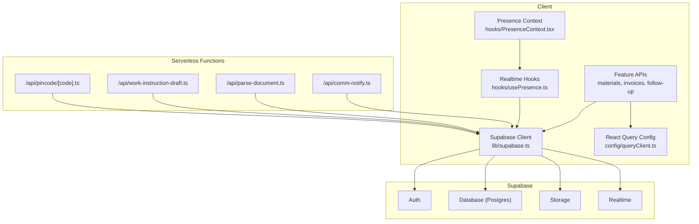
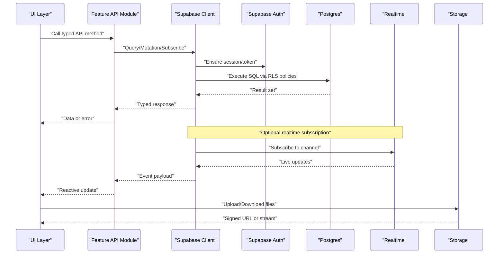
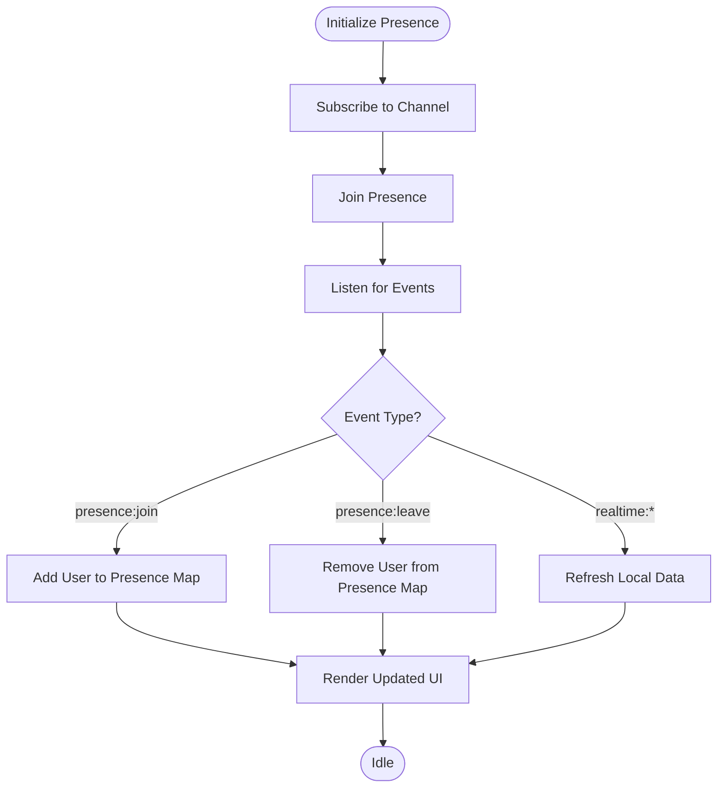
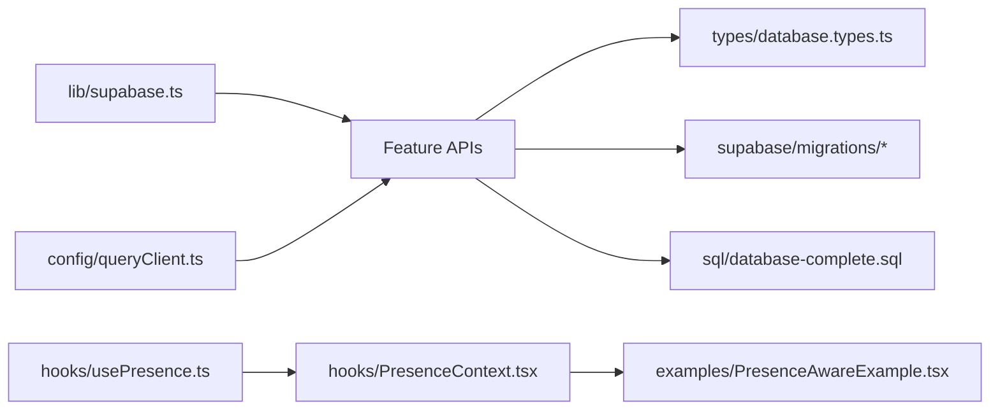

# API Reference

<cite>
**Referenced Files in This Document**
- [src/lib/supabase.ts](file://src/lib/supabase.ts)
- [src/api.ts](file://src/api.ts)
- [api/comm-notify.ts](file://api/comm-notify.ts)
- [api/parse-document.ts](file://api/parse-document.ts)
- [api/work-instruction-draft.ts](file://api/work-instruction-draft.ts)
- [api/pincode/[code].ts](file://api/pincode/[code].ts)
- [server/pincode.js](file://server/pincode.js)
- [src/applications/routing/index.ts](file://src/app/routing/index.ts)
- [src/config/queryClient.ts](file://src/config/queryClient.ts)
- [src/hooks/usePresence.ts](file://src/hooks/usePresence.ts)
- [src/hooks/PresenceContext.tsx](file://src/hooks/PresenceContext.tsx)
- [src/examples/PresenceAwareExample.tsx](file://src/examples/PresenceAwareExample.tsx)
- [src/subscriptions/index.ts](file://src/subscriptions/index.ts)
- [src/features/materials/api.ts](file://src/features/materials/api.ts)
- [src/invoices/api.ts](file://src/invoices/api.ts)
- [src/follow-up/api.ts](file://src/follow-up/api.ts)
- [src/issues/api.ts](file://src/issues/api.ts)
- [src/meetings/api/index.ts](file://src/meetings/api/index.ts)
- [src/material-intents/api.ts](file://src/material-intents/api.ts)
- [src/material-usage/api.ts](file://src/material-usage/api.ts)
- [src/conversions/api.ts](file://src/conversions/api.ts)
- [src/credit-notes/api.ts](file://src/credit-notes/api.ts)
- [src/ledger/api.ts](file://src/ledger/api.ts)
- [src/approvals/api.ts](file://src/approvals/api.ts)
- [src/types/database.types.ts](file://src/types/database.types.ts)
- [supabase/migrations/20240101000000_initial_schema.sql](file://supabase/migrations/20240101000000_initial_schema.sql)
- [sql/database-complete.sql](file://sql/database-complete.sql)
</cite>

## Table of Contents
1. [Introduction](#introduction)
2. [Project Structure](#project-structure)
3. [Core Components](#core-components)
4. [Architecture Overview](#architecture-overview)
5. [Detailed Component Analysis](#detailed-component-analysis)
6. [Dependency Analysis](#dependency-analysis)
7. [Performance Considerations](#performance-considerations)
8. [Troubleshooting Guide](#troubleshooting-guide)
9. [Conclusion](#conclusion)
10. [Appendices](#appendices)

## Introduction
This document provides a comprehensive API reference for the MEP Project ERP system. It covers REST endpoints, Supabase client integration patterns, database query APIs, real-time subscriptions, WebSocket events, authentication requirements, file upload/download interfaces, search and query capabilities, webhook integrations, versioning strategies, backward compatibility, migration guidance, debugging tools, testing approaches, and performance optimization tips for API consumers.

The system is primarily a client-side application that integrates with Supabase for data persistence, authentication, storage, and real-time features. Some serverless functions are exposed via the /api routes to perform specialized tasks such as pincode lookup, document parsing, and work instruction draft handling.

## Project Structure
At a high level:
- Client-side modules encapsulate feature-specific APIs (e.g., materials, invoices, follow-up).
- Shared utilities include a centralized Supabase client configuration and React Query setup.
- Serverless endpoints under api/ provide targeted HTTP handlers.
- Real-time presence and collaboration features are implemented using hooks and contexts.
- Database schema and migrations are maintained under supabase/migrations and sql/.

**Diagram sources**
- [src/lib/supabase.ts](file://src/lib/supabase.ts)
- [src/config/queryClient.ts](file://src/config/queryClient.ts)
- [src/hooks/usePresence.ts](file://src/hooks/usePresence.ts)
- [src/hooks/PresenceContext.tsx](file://src/hooks/PresenceContext.tsx)
- [api/comm-notify.ts](file://api/comm-notify.ts)
- [api/parse-document.ts](file://api/parse-document.ts)
- [api/work-instruction-draft.ts](file://api/work-instruction-draft.ts)
- [api/pincode/[code].ts](file://api/pincode/[code].ts)

**Section sources**
- [src/lib/supabase.ts](file://src/lib/supabase.ts)
- [src/config/queryClient.ts](file://src/config/queryClient.ts)
- [src/hooks/usePresence.ts](file://src/hooks/usePresence.ts)
- [src/hooks/PresenceContext.tsx](file://src/hooks/PresenceContext.tsx)
- [api/comm-notify.ts](file://api/comm-notify.ts)
- [api/parse-document.ts](file://api/parse-document.ts)
- [api/work-instruction-draft.ts](file://api/work-instruction-draft.ts)
- [api/pincode/[code].ts](file://api/pincode/[code].ts)

## Core Components
- Supabase client initialization and configuration: centralizes environment variables, auth state, and realtime settings.
- Feature APIs: typed wrappers around Supabase queries and mutations for domain areas like materials, invoices, follow-ups, issues, meetings, conversions, credit notes, ledger, approvals.
- Serverless endpoints: small HTTP handlers for specific operations (pincode lookup, document parsing, notifications).
- Realtime and presence: hooks and contexts to subscribe to changes and track user presence.

Key responsibilities:
- Authentication flows and session management.
- Data access patterns (queries, mutations, subscriptions).
- Error handling and retry strategies.
- File uploads/downloads via Storage.
- Webhook triggers from external systems.

**Section sources**
- [src/lib/supabase.ts](file://src/lib/supabase.ts)
- [src/features/materials/api.ts](file://src/features/materials/api.ts)
- [src/invoices/api.ts](file://src/invoices/api.ts)
- [src/follow-up/api.ts](file://src/follow-up/api.ts)
- [src/issues/api.ts](file://src/issues/api.ts)
- [src/meetings/api/index.ts](file://src/meetings/api/index.ts)
- [src/material-intents/api.ts](file://src/material-intents/api.ts)
- [src/material-usage/api.ts](file://src/material-usage/api.ts)
- [src/conversions/api.ts](file://src/conversions/api.ts)
- [src/credit-notes/api.ts](file://src/credit-notes/api.ts)
- [src/ledger/api.ts](file://src/ledger/api.ts)
- [src/approvals/api.ts](file://src/approvals/api.ts)

## Architecture Overview
The application uses a client-first architecture with Supabase as the backend-as-a-service. The client authenticates users, performs CRUD operations on Postgres tables, manages files in Storage, and subscribes to realtime channels. Presence and collaborative editing leverage Supabase Realtime and custom presence logic.

**Diagram sources**
- [src/lib/supabase.ts](file://src/lib/supabase.ts)
- [src/features/materials/api.ts](file://src/features/materials/api.ts)
- [src/invoices/api.ts](file://src/invoices/api.ts)

## Detailed Component Analysis

### Supabase Client Integration
- Initialization: loads environment variables, configures auth, realtime, and storage.
- Session management: persists tokens, refreshes sessions, handles sign-in/out flows.
- Query patterns: typed queries leveraging generated types; consistent error handling.
- Realtime: channels per resource, presence tracking, broadcast messages.

Typical usage pattern:
- Import client from lib/supabase.ts.
- Use feature API modules for domain operations.
- Subscribe to realtime channels where needed.

**Section sources**
- [src/lib/supabase.ts](file://src/lib/supabase.ts)
- [src/config/queryClient.ts](file://src/config/queryClient.ts)

### REST Endpoints (Serverless Functions)
These endpoints are exposed under the /api path and handle specific tasks:

- POST /api/comm-notify
  - Purpose: Send communication notifications.
  - Request body: Notification payload (see schemas below).
  - Response: Success status and optional details.
  - Auth: Depends on function policy; typically requires authenticated context.

- POST /api/parse-document
  - Purpose: Parse uploaded documents into structured data.
  - Request body: JSON with document metadata and content reference.
  - Response: Parsed result object.
  - Auth: Requires valid session.

- POST /api/work-instruction-draft
  - Purpose: Create or update work instruction drafts.
  - Request body: Draft fields and associated project identifiers.
  - Response: Created/updated draft record.
  - Auth: Requires appropriate permissions.

- GET /api/pincode/{code}
  - Purpose: Lookup pincode details by code.
  - Path param: code (string).
  - Response: Pincode information object.
  - Auth: May be public depending on policy.

- GET /server/pincode.js
  - Purpose: Legacy or alternate pincode endpoint implementation.
  - Behavior: Mirrors functionality of /api/pincode/{code}.

Request/Response Schemas (representative):
- CommNotifyRequest
  - fields: recipientId, message, type, timestamp
- CommNotifyResponse
  - fields: ok, notificationId
- ParseDocumentRequest
  - fields: documentId, format, options
- ParseDocumentResponse
  - fields: ok, parsedData
- WorkInstructionDraftRequest
  - fields: projectId, title, content, tags
- WorkInstructionDraftResponse
  - fields: ok, draftId
- PincodeLookupResponse
  - fields: ok, pincodeInfo

Authentication Requirements:
- Most endpoints require an active Supabase session token.
- Policies enforce row-level security based on organization and roles.

Error Handling:
- Standardized error responses with codes and messages.
- Retryable errors indicated by transient status codes.

Rate Limiting:
- Apply per-user and per-endpoint limits at the platform layer.
- Return 429 Too Many Requests with retry-after hints.

Examples (TypeScript):
- See example paths:
  - [src/examples/PresenceAwareExample.tsx](file://src/examples/PresenceAwareExample.tsx)
  - [src/features/materials/api.ts](file://src/features/materials/api.ts)

**Section sources**
- [api/comm-notify.ts](file://api/comm-notify.ts)
- [api/parse-document.ts](file://api/parse-document.ts)
- [api/work-instruction-draft.ts](file://api/work-instruction-draft.ts)
- [api/pincode/[code].ts](file://api/pincode/[code].ts)
- [server/pincode.js](file://server/pincode.js)

### Database Query APIs
Feature modules expose typed methods for querying and mutating data:

- Materials
  - Methods: listMaterials, getMaterialById, createMaterial, updateMaterial, deleteMaterial
  - Filters: category, warehouse, availability, date range
  - Pagination: page, pageSize, sort, order
  - Search: text-based across name, SKU, description

- Invoices
  - Methods: listInvoices, getInvoiceById, createInvoice, updateInvoice, deleteInvoice
  - Filters: status, date range, project, client
  - Aggregations: totals, tax breakdowns

- Follow-up
  - Methods: listFollowUps, getFollowUpById, createFollowUp, updateFollowUp, deleteFollowUp
  - Filters: assignee, priority, dueDate, status

- Issues
  - Methods: listIssues, getIssueById, createIssue, updateIssue, deleteIssue
  - Filters: severity, status, project, assignee

- Meetings
  - Methods: listMeetings, getMeetingById, createMeeting, updateMeeting, deleteMeeting
  - Filters: date, project, participants

- Material Intents and Usage
  - Methods: manage intents and consumption records
  - Filters: project, item, date, quantity

- Conversions
  - Methods: convert quotations to orders, invoices, etc.
  - Payloads: conversion type, source IDs, target entities

- Credit Notes
  - Methods: manage credit note lifecycle
  - Filters: invoice linkage, amount, status

- Ledger
  - Methods: read financial entries and balances
  - Filters: account, period, transaction type

- Approvals
  - Methods: workflow actions, status transitions
  - Payloads: action, comment, approverId

Typical request/response shapes:
- List requests include pagination and filter parameters.
- Responses include data arrays, total counts, and metadata.
- Mutations return created/updated entity objects.

**Section sources**
- [src/features/materials/api.ts](file://src/features/materials/api.ts)
- [src/invoices/api.ts](file://src/invoices/api.ts)
- [src/follow-up/api.ts](file://src/follow-up/api.ts)
- [src/issues/api.ts](file://src/issues/api.ts)
- [src/meetings/api/index.ts](file://src/meetings/api/index.ts)
- [src/material-intents/api.ts](file://src/material-intents/api.ts)
- [src/material-usage/api.ts](file://src/material-usage/api.ts)
- [src/conversions/api.ts](file://src/conversions/api.ts)
- [src/credit-notes/api.ts](file://src/credit-notes/api.ts)
- [src/ledger/api.ts](file://src/ledger/api.ts)
- [src/approvals/api.ts](file://src/approvals/api.ts)

### Real-time Subscriptions and Presence
- Presence tracking:
  - Hook usePresence manages presence state per channel.
  - PresenceContext provides global presence access.
  - Example usage demonstrates subscribing and reacting to presence changes.

- Subscription patterns:
  - Subscribe to table changes for live updates.
  - Broadcast messages for collaborative editing.
  - Handle disconnect/reconnect gracefully.

WebSocket Events:
- presence:join, presence:leave, presence:update
- realtime:insert, realtime:update, realtime:delete
- broadcast:custom events for collaborative edits

**Diagram sources**
- [src/hooks/usePresence.ts](file://src/hooks/usePresence.ts)
- [src/hooks/PresenceContext.tsx](file://src/hooks/PresenceContext.tsx)
- [src/examples/PresenceAwareExample.tsx](file://src/examples/PresenceAwareExample.tsx)

**Section sources**
- [src/hooks/usePresence.ts](file://src/hooks/usePresence.ts)
- [src/hooks/PresenceContext.tsx](file://src/hooks/PresenceContext.tsx)
- [src/examples/PresenceAwareExample.tsx](file://src/examples/PresenceAwareExample.tsx)
- [src/subscriptions/index.ts](file://src/subscriptions/index.ts)

### Authentication and Authorization
- Authentication:
  - Sign-in/sign-out flows via Supabase Auth.
  - Session persistence and automatic refresh.
  - Role-based access control integrated with RLS policies.

- Authorization:
  - Row-level security policies restrict data access by organization and role.
  - Endpoint-level checks ensure only authorized actions proceed.

Best practices:
- Always check auth state before performing mutations.
- Handle unauthorized responses by redirecting to login.
- Use typed guards to prevent invalid operations.

**Section sources**
- [src/lib/supabase.ts](file://src/lib/supabase.ts)
- [src/approvals/api.ts](file://src/approvals/api.ts)

### File Upload/Download APIs
- Upload:
  - Use Storage API to upload files with proper metadata.
  - Generate signed URLs for secure access.
  - Validate file types and sizes.

- Download:
  - Retrieve signed URLs or stream content directly.
  - Cache results appropriately.

Security considerations:
- Enforce RLS policies on storage buckets.
- Limit upload size and type.
- Sanitize filenames and metadata.

**Section sources**
- [src/lib/supabase.ts](file://src/lib/supabase.ts)

### Webhook Integrations
- Outgoing webhooks:
  - Triggered by database changes or business events.
  - Payload includes event type, timestamp, and entity data.
  - Retries with exponential backoff on failure.

- Incoming webhooks:
  - Exposed via serverless functions.
  - Validate signatures and payloads.
  - Persist events and trigger downstream processing.

Reliability:
- Idempotency keys to avoid duplicate processing.
- Dead-letter queues for failed deliveries.

**Section sources**
- [api/comm-notify.ts](file://api/comm-notify.ts)
- [api/parse-document.ts](file://api/parse-document.ts)

### Search and Query Interfaces
- Text search:
  - Full-text search on key fields (name, description, SKU).
  - Fuzzy matching and autocomplete suggestions.

- Advanced filters:
  - Range filters for dates and quantities.
  - Multi-select filters for categories and statuses.

- Performance:
  - Indexes on frequently queried columns.
  - Pagination and cursor-based navigation for large datasets.

**Section sources**
- [src/features/materials/api.ts](file://src/features/materials/api.ts)
- [src/invoices/api.ts](file://src/invoices/api.ts)

### API Versioning and Backward Compatibility
- Versioning strategy:
  - Prefix endpoints with version segments (e.g., /v1/...).
  - Maintain deprecation notices and migration timelines.

- Backward compatibility:
  - Avoid breaking changes to existing contracts.
  - Support multiple versions during transition periods.

- Migration guides:
  - Provide changelogs and upgrade instructions.
  - Offer automated migration scripts where applicable.

**Section sources**
- [api/comm-notify.ts](file://api/comm-notify.ts)
- [api/parse-document.ts](file://api/parse-document.ts)

### Debugging Tools and Testing Approaches
- Debugging:
  - Enable detailed logging for API calls and realtime events.
  - Use browser devtools to inspect network traffic and Supabase client logs.

- Testing:
  - Unit tests for API wrappers and utility functions.
  - Integration tests against test databases and mock storage.
  - End-to-end tests simulating user workflows.

- Performance monitoring:
  - Track latency and error rates.
  - Monitor realtime connection health and reconnection attempts.

**Section sources**
- [src/config/queryClient.ts](file://src/config/queryClient.ts)
- [src/hooks/usePresence.ts](file://src/hooks/usePresence.ts)

## Dependency Analysis
The following diagram illustrates dependencies between core components:

**Diagram sources**
- [src/lib/supabase.ts](file://src/lib/supabase.ts)
- [src/config/queryClient.ts](file://src/config/queryClient.ts)
- [src/hooks/usePresence.ts](file://src/hooks/usePresence.ts)
- [src/hooks/PresenceContext.tsx](file://src/hooks/PresenceContext.tsx)
- [src/examples/PresenceAwareExample.tsx](file://src/examples/PresenceAwareExample.tsx)
- [src/types/database.types.ts](file://src/types/database.types.ts)
- [supabase/migrations/20240101000000_initial_schema.sql](file://supabase/migrations/20240101000000_initial_schema.sql)
- [sql/database-complete.sql](file://sql/database-complete.sql)

**Section sources**
- [src/lib/supabase.ts](file://src/lib/supabase.ts)
- [src/config/queryClient.ts](file://src/config/queryClient.ts)
- [src/hooks/usePresence.ts](file://src/hooks/usePresence.ts)
- [src/hooks/PresenceContext.tsx](file://src/hooks/PresenceContext.tsx)
- [src/examples/PresenceAwareExample.tsx](file://src/examples/PresenceAwareExample.tsx)
- [src/types/database.types.ts](file://src/types/database.types.ts)
- [supabase/migrations/20240101000000_initial_schema.sql](file://supabase/migrations/20240101000000_initial_schema.sql)
- [sql/database-complete.sql](file://sql/database-complete.sql)

## Performance Considerations
- Optimize queries:
  - Use selective field projection.
  - Leverage indexes and composite keys.
  - Paginate large result sets.

- Reduce network overhead:
  - Batch mutations when possible.
  - Cache frequently accessed data.

- Realtime efficiency:
  - Subscribe only to necessary channels.
  - Debounce heavy UI updates.

- Storage best practices:
  - Compress images before upload.
  - Use CDN for static assets.

[No sources needed since this section provides general guidance]

## Troubleshooting Guide
Common issues and resolutions:
- Authentication failures:
  - Verify session validity and token expiration.
  - Re-authenticate if required.

- Permission denied:
  - Check RLS policies and user roles.
  - Ensure organization membership and permissions.

- Realtime disconnections:
  - Implement reconnection logic and backoff.
  - Monitor connection health metrics.

- Rate limiting:
  - Respect retry-after headers.
  - Implement exponential backoff and jitter.

- File upload errors:
  - Validate file size and type.
  - Check storage bucket policies.

**Section sources**
- [src/lib/supabase.ts](file://src/lib/supabase.ts)
- [src/hooks/usePresence.ts](file://src/hooks/usePresence.ts)

## Conclusion
The MEP Project ERP system leverages Supabase for authentication, database, storage, and realtime capabilities. Feature APIs provide typed interfaces for domain operations, while serverless functions handle specialized tasks. Realtime subscriptions and presence enable collaborative experiences. Adhering to the documented patterns ensures robust, scalable, and maintainable integrations.

[No sources needed since this section summarizes without analyzing specific files]

## Appendices

### TypeScript Usage Examples
- Presence-aware component:
  - [src/examples/PresenceAwareExample.tsx](file://src/examples/PresenceAwareExample.tsx)

- Materials API usage:
  - [src/features/materials/api.ts](file://src/features/materials/api.ts)

- Invoices API usage:
  - [src/invoices/api.ts](file://src/invoices/api.ts)

- Follow-up API usage:
  - [src/follow-up/api.ts](file://src/follow-up/api.ts)

- Issues API usage:
  - [src/issues/api.ts](file://src/issues/api.ts)

- Meetings API usage:
  - [src/meetings/api/index.ts](file://src/meetings/api/index.ts)

- Material intents and usage:
  - [src/material-intents/api.ts](file://src/material-intents/api.ts)
  - [src/material-usage/api.ts](file://src/material-usage/api.ts)

- Conversions API usage:
  - [src/conversions/api.ts](file://src/conversions/api.ts)

- Credit notes API usage:
  - [src/credit-notes/api.ts](file://src/credit-notes/api.ts)

- Ledger API usage:
  - [src/ledger/api.ts](file://src/ledger/api.ts)

- Approvals API usage:
  - [src/approvals/api.ts](file://src/approvals/api.ts)

**Section sources**
- [src/examples/PresenceAwareExample.tsx](file://src/examples/PresenceAwareExample.tsx)
- [src/features/materials/api.ts](file://src/features/materials/api.ts)
- [src/invoices/api.ts](file://src/invoices/api.ts)
- [src/follow-up/api.ts](file://src/follow-up/api.ts)
- [src/issues/api.ts](file://src/issues/api.ts)
- [src/meetings/api/index.ts](file://src/meetings/api/index.ts)
- [src/material-intents/api.ts](file://src/material-intents/api.ts)
- [src/material-usage/api.ts](file://src/material-usage/api.ts)
- [src/conversions/api.ts](file://src/conversions/api.ts)
- [src/credit-notes/api.ts](file://src/credit-notes/api.ts)
- [src/ledger/api.ts](file://src/ledger/api.ts)
- [src/approvals/api.ts](file://src/approvals/api.ts)