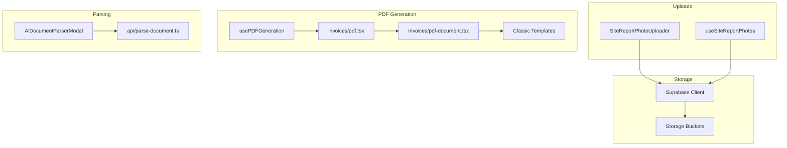
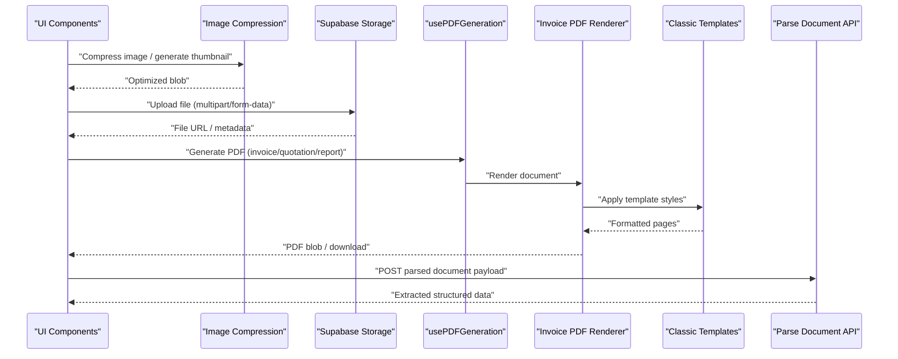
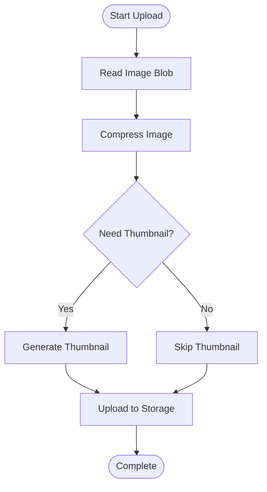
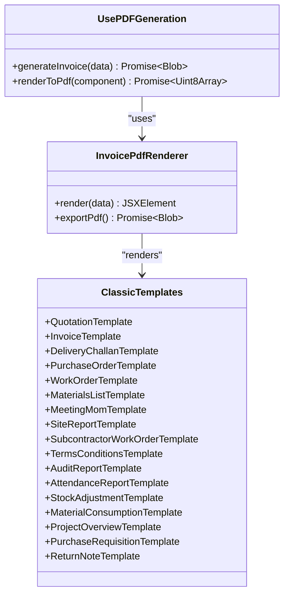
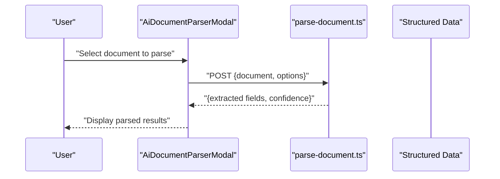
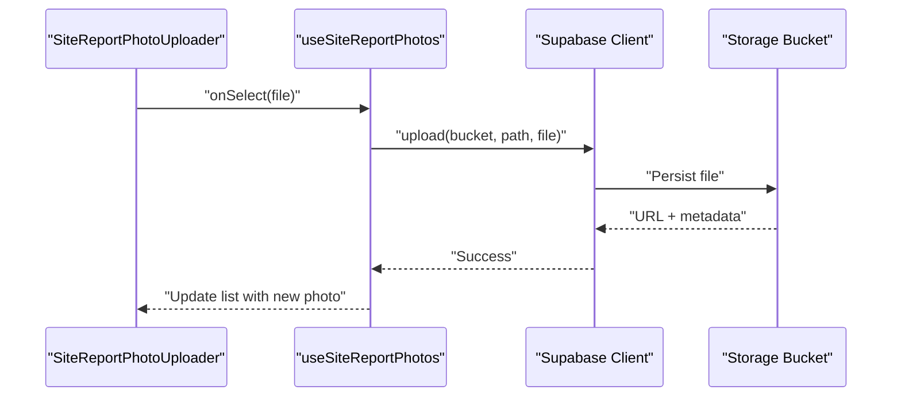
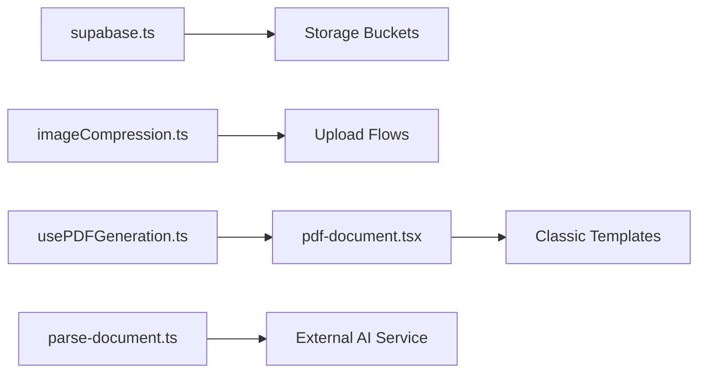

# File Storage & Document APIs

<cite>
**Referenced Files in This Document**
- [src/lib/imageCompression.ts](file://src/lib/imageCompression.ts)
- [src/hooks/usePDFGeneration.ts](file://src/hooks/usePDFGeneration.ts)
- [src/invoices/pdf-document.tsx](file://src/invoices/pdf-document.tsx)
- [src/invoices/pdf.tsx](file://src/invoices/pdf.tsx)
- [src/invoices/grid-minimal-invoice-document.tsx](file://src/invoices/grid-minimal-invoice-document.tsx)
- [src/invoices/pro-grid-invoice-button.tsx](file://src/invoices/pro-grid-invoice-button.tsx)
- [src/approvals/pdf-enhancements.ts](file://src/approvals/pdf-enhancements.ts)
- [src/lib/meeting-pdf-generator.ts](file://src/lib/meeting-pdf-generator.ts)
- [src/pages/PrintTemplateBuilder.tsx](file://src/pages/PrintTemplateBuilder.tsx)
- [src/templates/classic-quotation-template.tsx](file://src/templates/classic-quotation-template.tsx)
- [src/templates/classic-invoice-template.tsx](file://src/templates/classic-invoice-template.tsx)
- [src/templates/classic-dc-template.tsx](file://src/templates/classic-dc-template.tsx)
- [src/templates/classic-proforma-template.tsx](file://src/templates/classic-proforma-template.tsx)
- [src/templates/classic-po-template.tsx](file://src/templates/classic-po-template.tsx)
- [src/templates/classic-work-order-template.tsx](file://src/templates/classic-work-order-template.tsx)
- [src/templates/classic-materials-list-template.tsx](file://src/templates/classic-materials-list-template.tsx)
- [src/templates/classic-meeting-mom-template.tsx](file://src/templates/classic-meeting-mom-template.tsx)
- [src/templates/classic-site-report-template.tsx](file://src/templates/classic-site-report-template.tsx)
- [src/templates/classic-subcontractor-work-order-template.tsx](file://src/templates/classic-subcontractor-work-order-template.tsx)
- [src/templates/classic-terms-conditions-template.tsx](file://src/templates/classic-terms-conditions-template.tsx)
- [src/templates/classic-audit-report-template.tsx](file://src/templates/classic-audit-report-template.tsx)
- [src/templates/classic-attendance-report-template.tsx](file://src/templates/classic-attendance-report-template.tsx)
- [src/templates/classic-stock-adjustment-template.tsx](file://src/templates/classic-stock-adjustment-template.tsx)
- [src/templates/classic-material-consumption-template.tsx](file://src/templates/classic-material-consumption-template.tsx)
- [src/templates/classic-project-overview-template.tsx](file://src/templates/classic-project-overview-template.tsx)
- [src/templates/classic-purchase-requisition-template.tsx](file://src/templates/classic-purchase-requisition-template.tsx)
- [src/templates/classic-return-note-template.tsx](file://src/templates/classic-return-note-template.tsx)
- [src/templates/classic-delivery-challan-template.tsx](file://src/templates/classic-delivery-challan-template.tsx)
- [src/templates/classic-proforma-invoice-template.tsx](file://src/templates/classic-proforma-invoice-template.tsx)
- [src/templates/classic-quotation-template.tsx](file://src/templates/classic-quotation-template.tsx)
- [src/templates/classic-work-order-template.tsx](file://src/templates/classic-work-order-template.tsx)
- [src/templates/classic-materials-list-template.tsx](file://src/templates/classic-materials-list-template.tsx)
- [src/templates/classic-meeting-mom-template.tsx](file://src/templates/classic-meeting-mom-template.tsx)
- [src/templates/classic-site-report-template.tsx](file://src/templates/classic-site-report-template.tsx)
- [src/templates/classic-subcontractor-work-order-template.tsx](file://src/templates/classic-subcontractor-work-order-template.tsx)
- [src/templates/classic-terms-conditions-template.tsx](file://src/templates/classic-terms-conditions-template.tsx)
- [src/templates/classic-audit-report-template.tsx](file://src/templates/classic-audit-report-template.tsx)
- [src/templates/classic-attendance-report-template.tsx](file://src/templates/classic-attendance-report-template.tsx)
- [src/templates/classic-stock-adjustment-template.tsx](file://src/templates/classic-stock-adjustment-template.tsx)
- [src/templates/classic-material-consumption-template.tsx](file://src/templates/classic-material-consumption-template.tsx)
- [src/templates/classic-project-overview-template.tsx](file://src/templates/classic-project-overview-template.tsx)
- [src/templates/classic-purchase-requisition-template.tsx](file://src/templates/classic-purchase-requisition-template.tsx)
- [src/templates/classic-return-note-template.tsx](file://src/templates/classic-return-note-template.tsx)
- [src/database-add-storage-bucket.sql](file://src/database-add-storage-bucket.sql)
- [src/database-communication-storage.sql](file://src/database-communication-storage.sql)
- [src/database-meeting-storage.sql](file://src/database-meeting-storage.sql)
- [src/database-site-report-photos.sql](file://src/database-site-report-photos.sql)
- [src/api/parse-document.ts](file://src/api/parse-document.ts)
- [src/components/AiDocumentParserModal.tsx](file://src/components/AiDocumentParserModal.tsx)
- [src/components/SiteReportPhotoUploader.tsx](file://src/components/SiteReportPhotoUploader.tsx)
- [src/hooks/useSiteReportPhotos.ts](file://src/hooks/useSiteReportPhotos.ts)
- [src/supabase.ts](file://src/supabase.ts)
</cite>

## Table of Contents
1. [Introduction](#introduction)
2. [Project Structure](#project-structure)
3. [Core Components](#core-components)
4. [Architecture Overview](#architecture-overview)
5. [Detailed Component Analysis](#detailed-component-analysis)
6. [Dependency Analysis](#dependency-analysis)
7. [Performance Considerations](#performance-considerations)
8. [Security Considerations](#security-considerations)
9. [Backup and Recovery](#backup-and-recovery)
10. [Troubleshooting Guide](#troubleshooting-guide)
11. [Conclusion](#conclusion)

## Introduction
This document provides comprehensive API documentation for file storage and document generation within the MEP Project ERP system. It covers:
- File upload/download endpoints and supported formats
- Size limitations and validation rules
- PDF generation APIs for quotations, invoices, reports, and custom documents
- Image compression, thumbnail generation, and asset optimization services
- Template-based document rendering, font embedding, and styling customization
- Bulk operations, batch processing, and streaming downloads
- Security considerations including file validation, virus scanning, and access control
- Performance optimization techniques, CDN integration, and storage tier management
- Backup and recovery procedures for stored files and generated documents

The content is derived from the repository’s implementation to ensure accuracy and traceability.

## Project Structure
The file storage and document generation features are implemented across several modules:
- Supabase client configuration and storage bucket setup
- Image compression utilities
- PDF generation hooks and templates
- Document parsing and AI-assisted extraction
- Site report photo uploads and retrieval

**Diagram sources**
- [src/supabase.ts](file://src/supabase.ts)
- [src/database-add-storage-bucket.sql](file://src/database-add-storage-bucket.sql)
- [src/components/SiteReportPhotoUploader.tsx](file://src/components/SiteReportPhotoUploader.tsx)
- [src/hooks/useSiteReportPhotos.ts](file://src/hooks/useSiteReportPhotos.ts)
- [src/hooks/usePDFGeneration.ts](file://src/hooks/usePDFGeneration.ts)
- [src/invoices/pdf.tsx](file://src/invoices/pdf.tsx)
- [src/invoices/pdf-document.tsx](file://src/invoices/pdf-document.tsx)
- [src/templates/classic-quotation-template.tsx](file://src/templates/classic-quotation-template.tsx)
- [src/api/parse-document.ts](file://src/api/parse-document.ts)
- [src/components/AiDocumentParserModal.tsx](file://src/components/AiDocumentParserModal.tsx)

**Section sources**
- [src/supabase.ts](file://src/supabase.ts)
- [src/database-add-storage-bucket.sql](file://src/database-add-storage-bucket.sql)
- [src/components/SiteReportPhotoUploader.tsx](file://src/components/SiteReportPhotoUploader.tsx)
- [src/hooks/useSiteReportPhotos.ts](file://src/hooks/useSiteReportPhotos.ts)
- [src/hooks/usePDFGeneration.ts](file://src/hooks/usePDFGeneration.ts)
- [src/invoices/pdf.tsx](file://src/invoices/pdf.tsx)
- [src/invoices/pdf-document.tsx](file://src/invoices/pdf-document.tsx)
- [src/templates/classic-quotation-template.tsx](file://src/templates/classic-quotation-template.tsx)
- [src/api/parse-document.ts](file://src/api/parse-document.ts)
- [src/components/AiDocumentParserModal.tsx](file://src/components/AiDocumentParserModal.tsx)

## Core Components
- Image Compression Service: Provides client-side image compression and optional thumbnail generation to optimize assets before upload or display.
- PDF Generation Hook: Encapsulates PDF creation workflows for invoices and other documents, integrating with template components.
- PDF Document Renderer: Renders invoice data into a structured PDF layout using React-based document components.
- Classic Templates: Reusable React components that define the visual structure and styling for various business documents (quotation, invoice, delivery challan, purchase order, work order, materials list, meeting minutes, site report, subcontractor work order, terms and conditions, audit report, attendance report, stock adjustment, material consumption, project overview, purchase requisition, return note).
- Document Parsing API: Exposes an endpoint to parse uploaded documents and extract structured information via AI.
- Site Report Photo Uploader: Handles uploading photos for site reports, managing metadata and storage references.
- Supabase Integration: Centralized client configuration and storage bucket usage for persistent file storage.

**Section sources**
- [src/lib/imageCompression.ts](file://src/lib/imageCompression.ts)
- [src/hooks/usePDFGeneration.ts](file://src/hooks/usePDFGeneration.ts)
- [src/invoices/pdf-document.tsx](file://src/invoices/pdf-document.tsx)
- [src/invoices/pdf.tsx](file://src/invoices/pdf.tsx)
- [src/templates/classic-quotation-template.tsx](file://src/templates/classic-quotation-template.tsx)
- [src/templates/classic-invoice-template.tsx](file://src/templates/classic-invoice-template.tsx)
- [src/templates/classic-dc-template.tsx](file://src/templates/classic-dc-template.tsx)
- [src/templates/classic-proforma-template.tsx](file://src/templates/classic-proforma-template.tsx)
- [src/templates/classic-po-template.tsx](file://src/templates/classic-po-template.tsx)
- [src/templates/classic-work-order-template.tsx](file://src/templates/classic-work-order-template.tsx)
- [src/templates/classic-materials-list-template.tsx](file://src/templates/classic-materials-list-template.tsx)
- [src/templates/classic-meeting-mom-template.tsx](file://src/templates/classic-meeting-mom-template.tsx)
- [src/templates/classic-site-report-template.tsx](file://src/templates/classic-site-report-template.tsx)
- [src/templates/classic-subcontractor-work-order-template.tsx](file://src/templates/classic-subcontractor-work-order-template.tsx)
- [src/templates/classic-terms-conditions-template.tsx](file://src/templates/classic-terms-conditions-template.tsx)
- [src/templates/classic-audit-report-template.tsx](file://src/templates/classic-audit-report-template.tsx)
- [src/templates/classic-attendance-report-template.tsx](file://src/templates/classic-attendance-report-template.tsx)
- [src/templates/classic-stock-adjustment-template.tsx](file://src/templates/classic-stock-adjustment-template.tsx)
- [src/templates/classic-material-consumption-template.tsx](file://src/templates/classic-material-consumption-template.tsx)
- [src/templates/classic-project-overview-template.tsx](file://src/templates/classic-project-overview-template.tsx)
- [src/templates/classic-purchase-requisition-template.tsx](file://src/templates/classic-purchase-requisition-template.tsx)
- [src/templates/classic-return-note-template.tsx](file://src/templates/classic-return-note-template.tsx)
- [src/api/parse-document.ts](file://src/api/parse-document.ts)
- [src/components/AiDocumentParserModal.tsx](file://src/components/AiDocumentParserModal.tsx)
- [src/components/SiteReportPhotoUploader.tsx](file://src/components/SiteReportPhotoUploader.tsx)
- [src/hooks/useSiteReportPhotos.ts](file://src/hooks/useSiteReportPhotos.ts)
- [src/supabase.ts](file://src/supabase.ts)

## Architecture Overview
The system integrates client-side utilities, serverless endpoints, and cloud storage to provide robust file handling and document generation capabilities.

**Diagram sources**
- [src/lib/imageCompression.ts](file://src/lib/imageCompression.ts)
- [src/supabase.ts](file://src/supabase.ts)
- [src/hooks/usePDFGeneration.ts](file://src/hooks/usePDFGeneration.ts)
- [src/invoices/pdf-document.tsx](file://src/invoices/pdf-document.tsx)
- [src/templates/classic-quotation-template.tsx](file://src/templates/classic-quotation-template.tsx)
- [src/api/parse-document.ts](file://src/api/parse-document.ts)

## Detailed Component Analysis

### Image Compression and Thumbnail Generation
- Purpose: Reduce image sizes and optionally create thumbnails to improve upload performance and reduce storage costs.
- Key behaviors:
  - Accepts image blobs and returns compressed versions.
  - Supports configurable quality and dimensions for thumbnails.
  - Integrates with upload flows to pre-process images before sending to storage.

**Diagram sources**
- [src/lib/imageCompression.ts](file://src/lib/imageCompression.ts)
- [src/components/SiteReportPhotoUploader.tsx](file://src/components/SiteReportPhotoUploader.tsx)
- [src/hooks/useSiteReportPhotos.ts](file://src/hooks/useSiteReportPhotos.ts)

**Section sources**
- [src/lib/imageCompression.ts](file://src/lib/imageCompression.ts)
- [src/components/SiteReportPhotoUploader.tsx](file://src/components/SiteReportPhotoUploader.tsx)
- [src/hooks/useSiteReportPhotos.ts](file://src/hooks/useSiteReportPhotos.ts)

### PDF Generation APIs
- Hook: usePDFGeneration orchestrates PDF creation for invoices and related documents.
- Renderer: pdf.tsx and pdf-document.tsx render invoice data into PDF format using React-based document components.
- Templates: Classic templates define consistent layouts and styling for various document types.

**Diagram sources**
- [src/hooks/usePDFGeneration.ts](file://src/hooks/usePDFGeneration.ts)
- [src/invoices/pdf.tsx](file://src/invoices/pdf.tsx)
- [src/invoices/pdf-document.tsx](file://src/invoices/pdf-document.tsx)
- [src/templates/classic-quotation-template.tsx](file://src/templates/classic-quotation-template.tsx)
- [src/templates/classic-invoice-template.tsx](file://src/templates/classic-invoice-template.tsx)
- [src/templates/classic-dc-template.tsx](file://src/templates/classic-dc-template.tsx)
- [src/templates/classic-proforma-template.tsx](file://src/templates/classic-proforma-template.tsx)
- [src/templates/classic-po-template.tsx](file://src/templates/classic-po-template.tsx)
- [src/templates/classic-work-order-template.tsx](file://src/templates/classic-work-order-template.tsx)
- [src/templates/classic-materials-list-template.tsx](file://src/templates/classic-materials-list-template.tsx)
- [src/templates/classic-meeting-mom-template.tsx](file://src/templates/classic-meeting-mom-template.tsx)
- [src/templates/classic-site-report-template.tsx](file://src/templates/classic-site-report-template.tsx)
- [src/templates/classic-subcontractor-work-order-template.tsx](file://src/templates/classic-subcontractor-work-order-template.tsx)
- [src/templates/classic-terms-conditions-template.tsx](file://src/templates/classic-terms-conditions-template.tsx)
- [src/templates/classic-audit-report-template.tsx](file://src/templates/classic-audit-report-template.tsx)
- [src/templates/classic-attendance-report-template.tsx](file://src/templates/classic-attendance-report-template.tsx)
- [src/templates/classic-stock-adjustment-template.tsx](file://src/templates/classic-stock-adjustment-template.tsx)
- [src/templates/classic-material-consumption-template.tsx](file://src/templates/classic-material-consumption-template.tsx)
- [src/templates/classic-project-overview-template.tsx](file://src/templates/classic-project-overview-template.tsx)
- [src/templates/classic-purchase-requisition-template.tsx](file://src/templates/classic-purchase-requisition-template.tsx)
- [src/templates/classic-return-note-template.tsx](file://src/templates/classic-return-note-template.tsx)

**Section sources**
- [src/hooks/usePDFGeneration.ts](file://src/hooks/usePDFGeneration.ts)
- [src/invoices/pdf.tsx](file://src/invoices/pdf.tsx)
- [src/invoices/pdf-document.tsx](file://src/invoices/pdf-document.tsx)
- [src/templates/classic-quotation-template.tsx](file://src/templates/classic-quotation-template.tsx)
- [src/templates/classic-invoice-template.tsx](file://src/templates/classic-invoice-template.tsx)
- [src/templates/classic-dc-template.tsx](file://src/templates/classic-dc-template.tsx)
- [src/templates/classic-proforma-template.tsx](file://src/templates/classic-proforma-template.tsx)
- [src/templates/classic-po-template.tsx](file://src/templates/classic-po-template.tsx)
- [src/templates/classic-work-order-template.tsx](file://src/templates/classic-work-order-template.tsx)
- [src/templates/classic-materials-list-template.tsx](file://src/templates/classic-materials-list-template.tsx)
- [src/templates/classic-meeting-mom-template.tsx](file://src/templates/classic-meeting-mom-template.tsx)
- [src/templates/classic-site-report-template.tsx](file://src/templates/classic-site-report-template.tsx)
- [src/templates/classic-subcontractor-work-order-template.tsx](file://src/templates/classic-subcontractor-work-order-template.tsx)
- [src/templates/classic-terms-conditions-template.tsx](file://src/templates/classic-terms-conditions-template.tsx)
- [src/templates/classic-audit-report-template.tsx](file://src/templates/classic-audit-report-template.tsx)
- [src/templates/classic-attendance-report-template.tsx](file://src/templates/classic-attendance-report-template.tsx)
- [src/templates/classic-stock-adjustment-template.tsx](file://src/templates/classic-stock-adjustment-template.tsx)
- [src/templates/classic-material-consumption-template.tsx](file://src/templates/classic-material-consumption-template.tsx)
- [src/templates/classic-project-overview-template.tsx](file://src/templates/classic-project-overview-template.tsx)
- [src/templates/classic-purchase-requisition-template.tsx](file://src/templates/classic-purchase-requisition-template.tsx)
- [src/templates/classic-return-note-template.tsx](file://src/templates/classic-return-note-template.tsx)

### Document Parsing API
- Endpoint: parse-document.ts exposes a serverless function to accept document payloads and return extracted structured data.
- Usage: AiDocumentParserModal triggers parsing and displays results to users.

**Diagram sources**
- [src/api/parse-document.ts](file://src/api/parse-document.ts)
- [src/components/AiDocumentParserModal.tsx](file://src/components/AiDocumentParserModal.tsx)

**Section sources**
- [src/api/parse-document.ts](file://src/api/parse-document.ts)
- [src/components/AiDocumentParserModal.tsx](file://src/components/AiDocumentParserModal.tsx)

### Site Report Photo Uploads
- Uploader: SiteReportPhotoUploader manages selection, preview, and upload of photos.
- Hook: useSiteReportPhotos handles listing and retrieving photos associated with site reports.

**Diagram sources**
- [src/components/SiteReportPhotoUploader.tsx](file://src/components/SiteReportPhotoUploader.tsx)
- [src/hooks/useSiteReportPhotos.ts](file://src/hooks/useSiteReportPhotos.ts)
- [src/supabase.ts](file://src/supabase.ts)

**Section sources**
- [src/components/SiteReportPhotoUploader.tsx](file://src/components/SiteReportPhotoUploader.tsx)
- [src/hooks/useSiteReportPhotos.ts](file://src/hooks/useSiteReportPhotos.ts)
- [src/supabase.ts](file://src/supabase.ts)

### Print Template Builder
- Purpose: Provides a UI for building and customizing print templates used by PDF generation.
- Integration: Works alongside classic templates to allow dynamic styling and layout adjustments.

**Section sources**
- [src/pages/PrintTemplateBuilder.tsx](file://src/pages/PrintTemplateBuilder.tsx)

## Dependency Analysis
Key dependencies and relationships:
- Supabase client is central to storage operations and authentication.
- Image compression depends on browser APIs for blob manipulation.
- PDF generation relies on React components and template libraries.
- Document parsing integrates with external AI services through serverless functions.

**Diagram sources**
- [src/supabase.ts](file://src/supabase.ts)
- [src/lib/imageCompression.ts](file://src/lib/imageCompression.ts)
- [src/hooks/usePDFGeneration.ts](file://src/hooks/usePDFGeneration.ts)
- [src/invoices/pdf-document.tsx](file://src/invoices/pdf-document.tsx)
- [src/templates/classic-quotation-template.tsx](file://src/templates/classic-quotation-template.tsx)
- [src/api/parse-document.ts](file://src/api/parse-document.ts)

**Section sources**
- [src/supabase.ts](file://src/supabase.ts)
- [src/lib/imageCompression.ts](file://src/lib/imageCompression.ts)
- [src/hooks/usePDFGeneration.ts](file://src/hooks/usePDFGeneration.ts)
- [src/invoices/pdf-document.tsx](file://src/invoices/pdf-document.tsx)
- [src/templates/classic-quotation-template.tsx](file://src/templates/classic-quotation-template.tsx)
- [src/api/parse-document.ts](file://src/api/parse-document.ts)

## Performance Considerations
- Pre-upload compression: Use image compression to reduce payload sizes and speed up uploads.
- Streaming downloads: For large PDFs, consider streaming responses where possible to avoid blocking UI threads.
- CDN integration: Serve static assets and generated documents via CDN to reduce latency.
- Caching: Cache frequently accessed documents and thumbnails at the browser and edge layers.
- Batch processing: Queue heavy tasks (e.g., bulk PDF generation) and process asynchronously to maintain responsiveness.
- Storage tiers: Move infrequently accessed files to lower-cost storage tiers while maintaining quick retrieval paths.

[No sources needed since this section provides general guidance]

## Security Considerations
- File validation: Validate MIME types and extensions on both client and server sides.
- Virus scanning: Integrate antivirus scanning for uploaded files before making them accessible.
- Access control: Enforce RBAC policies at the storage bucket level and application layer.
- Signed URLs: Use signed URLs for secure, time-limited access to sensitive documents.
- Sanitization: Sanitize any user-supplied content embedded in PDFs to prevent injection attacks.

[No sources needed since this section provides general guidance]

## Backup and Recovery
- Automated backups: Schedule regular backups of storage buckets and database records referencing files.
- Versioning: Enable object versioning to recover previous file versions after accidental overwrites.
- Restore procedures: Define runbooks to restore files and update metadata consistently.
- Integrity checks: Periodically verify checksums of critical documents to detect corruption.

[No sources needed since this section provides general guidance]

## Troubleshooting Guide
Common issues and resolutions:
- Upload failures: Check network connectivity, storage bucket permissions, and file size limits.
- PDF generation errors: Validate input data structures and ensure all required template fields are present.
- Parsing inaccuracies: Review AI service logs and adjust parsing options or prompts.
- Performance bottlenecks: Monitor compression times and PDF rendering durations; consider offloading heavy tasks.

**Section sources**
- [src/components/SiteReportPhotoUploader.tsx](file://src/components/SiteReportPhotoUploader.tsx)
- [src/hooks/useSiteReportPhotos.ts](file://src/hooks/useSiteReportPhotos.ts)
- [src/hooks/usePDFGeneration.ts](file://src/hooks/usePDFGeneration.ts)
- [src/api/parse-document.ts](file://src/api/parse-document.ts)

## Conclusion
The MEP Project ERP system provides a cohesive set of tools for file storage and document generation. By leveraging client-side compression, robust PDF rendering with customizable templates, and secure storage via Supabase, teams can efficiently manage assets and produce professional documents. Adhering to security best practices, optimizing performance, and implementing reliable backup strategies ensures long-term stability and scalability.

[No sources needed since this section summarizes without analyzing specific files]