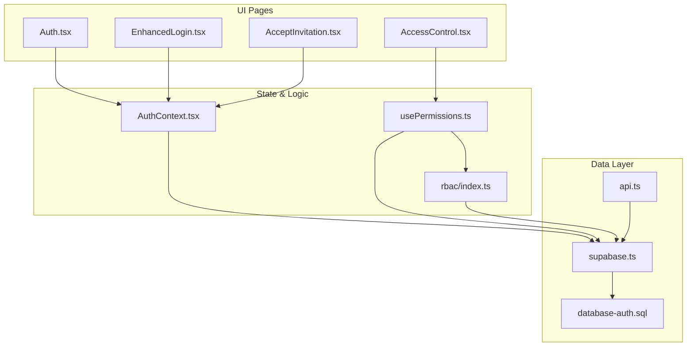
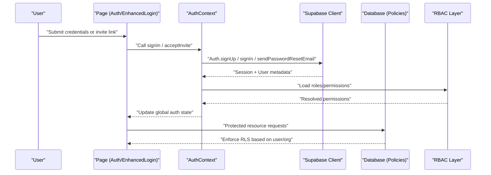
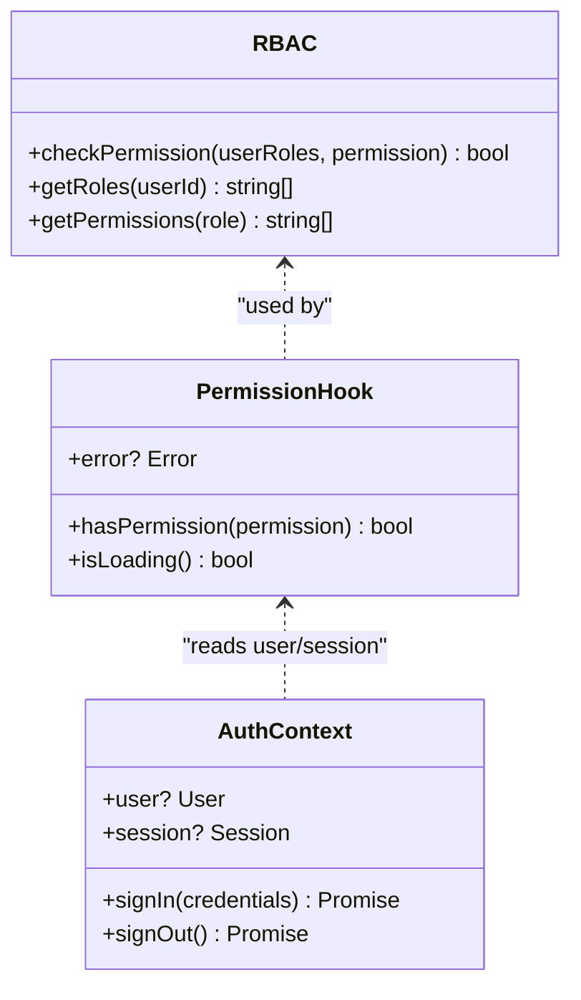
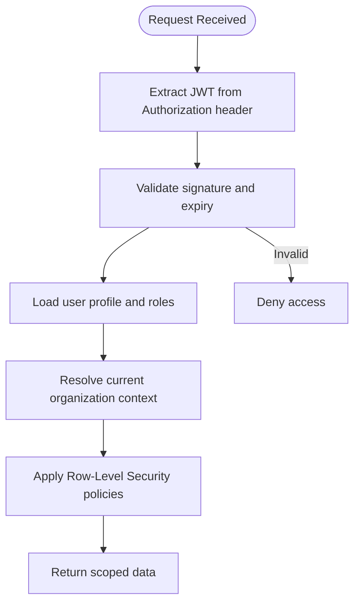
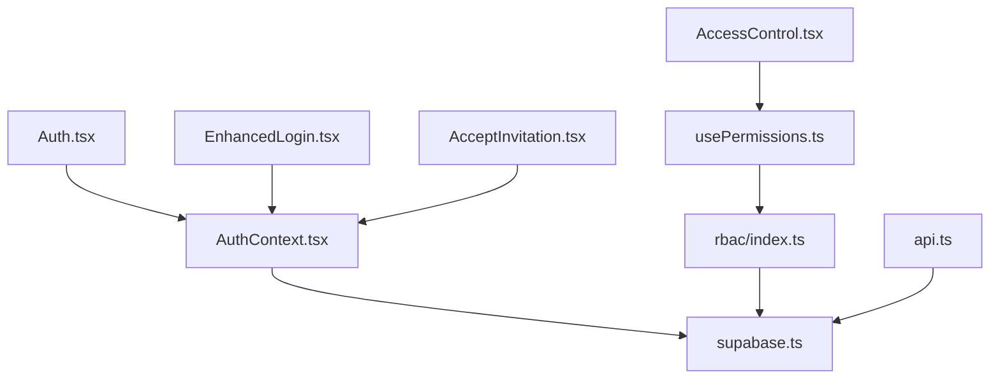

# Authentication & User Management API

<cite>
**Referenced Files in This Document**
- [Auth.tsx](file://src/pages/Auth.tsx)
- [EnhancedLogin.tsx](file://src/pages/EnhancedLogin.tsx)
- [AcceptInvitation.tsx](file://src/pages/AcceptInvitation.tsx)
- [AccessControl.tsx](file://src/pages/AccessControl.tsx)
- [AuthContext.tsx](file://src/contexts/AuthContext.tsx)
- [usePermissions.ts](file://src/hooks/usePermissions.ts)
- [rbac/index.ts](file://src/rbac/index.ts)
- [database-auth.sql](file://src/database-auth.sql)
- [supabase.ts](file://src/supabase.ts)
- [api.ts](file://src/api.ts)
</cite>

## Table of Contents
1. [Introduction](#introduction)
2. [Project Structure](#project-structure)
3. [Core Components](#core-components)
4. [Architecture Overview](#architecture-overview)
5. [Detailed Component Analysis](#detailed-component-analysis)
6. [Dependency Analysis](#dependency-analysis)
7. [Performance Considerations](#performance-considerations)
8. [Troubleshooting Guide](#troubleshooting-guide)
9. [Conclusion](#conclusion)
10. [Appendices](#appendices)

## Introduction
This document provides comprehensive API documentation for authentication and user management endpoints, including user registration, login, logout, password reset, session management, JWT token handling, role-based access control (RBAC), permission validation, and multi-organization support. It also includes request/response schemas, TypeScript client examples with error handling, and security considerations such as token refresh, session timeout, and CSRF protection.

The implementation is built on Supabase Auth and a custom RBAC layer, with UI flows exposed through pages and context providers.

## Project Structure
Authentication and user management are implemented across several layers:
- Pages: User-facing flows for login, registration, invitation acceptance, and access control.
- Context: Global authentication state and helpers.
- Hooks: Permission checks and RBAC utilities.
- Database: Auth-related SQL migrations and policies.
- Client: Supabase client configuration and shared API helpers.

**Diagram sources**
- [Auth.tsx](file://src/pages/Auth.tsx)
- [EnhancedLogin.tsx](file://src/pages/EnhancedLogin.tsx)
- [AcceptInvitation.tsx](file://src/pages/AcceptInvitation.tsx)
- [AccessControl.tsx](file://src/pages/AccessControl.tsx)
- [AuthContext.tsx](file://src/contexts/AuthContext.tsx)
- [usePermissions.ts](file://src/hooks/usePermissions.ts)
- [rbac/index.ts](file://src/rbac/index.ts)
- [database-auth.sql](file://src/database-auth.sql)
- [supabase.ts](file://src/supabase.ts)
- [api.ts](file://src/api.ts)

**Section sources**
- [Auth.tsx](file://src/pages/Auth.tsx)
- [EnhancedLogin.tsx](file://src/pages/EnhancedLogin.tsx)
- [AcceptInvitation.tsx](file://src/pages/AcceptInvitation.tsx)
- [AccessControl.tsx](file://src/pages/AccessControl.tsx)
- [AuthContext.tsx](file://src/contexts/AuthContext.tsx)
- [usePermissions.ts](file://src/hooks/usePermissions.ts)
- [rbac/index.ts](file://src/rbac/index.ts)
- [database-auth.sql](file://src/database-auth.sql)
- [supabase.ts](file://src/supabase.ts)
- [api.ts](file://src/api.ts)

## Core Components
- Authentication Context: Provides global auth state, sign-in/sign-out, and session persistence.
- RBAC Utilities: Role definitions, permission checks, and organization-scoped access.
- Permission Hook: React hook to evaluate permissions within components.
- Supabase Client: Centralized configuration for Supabase Auth and database calls.
- Shared API Helpers: Common request wrappers and error normalization.

Key responsibilities:
- Manage user sessions and tokens via Supabase Auth.
- Expose typed permission checks for protected routes and features.
- Support multi-organization membership and current org selection.
- Provide consistent error handling and logging.

**Section sources**
- [AuthContext.tsx](file://src/contexts/AuthContext.tsx)
- [usePermissions.ts](file://src/hooks/usePermissions.ts)
- [rbac/index.ts](file://src/rbac/index.ts)
- [supabase.ts](file://src/supabase.ts)
- [api.ts](file://src/api.ts)

## Architecture Overview
The authentication architecture integrates Supabase Auth with application-level RBAC and multi-organization support.

**Diagram sources**
- [Auth.tsx](file://src/pages/Auth.tsx)
- [EnhancedLogin.tsx](file://src/pages/EnhancedLogin.tsx)
- [AcceptInvitation.tsx](file://src/pages/AcceptInvitation.tsx)
- [AuthContext.tsx](file://src/contexts/AuthContext.tsx)
- [usePermissions.ts](file://src/hooks/usePermissions.ts)
- [rbac/index.ts](file://src/rbac/index.ts)
- [supabase.ts](file://src/supabase.ts)
- [database-auth.sql](file://src/database-auth.sql)

## Detailed Component Analysis

### Authentication Endpoints and Flows
Note: The application uses Supabase Auth APIs. The following describes the logical flows and expected behaviors as implemented by the client and server-side policies.

- Register User
  - Method: POST
  - Endpoint: /auth/signup
  - Request body: { email, password, full_name?, phone? }
  - Response: { user_id, email_verified, created_at }
  - Notes: Email confirmation may be required depending on provider settings.

- Login
  - Method: POST
  - Endpoint: /auth/login
  - Request body: { email, password }
  - Response: { access_token, refresh_token, expires_in, user }
  - Notes: Session persisted via Supabase; tokens handled automatically by the client.

- Logout
  - Method: POST
  - Endpoint: /auth/logout
  - Request body: {}
  - Response: { success: true }
  - Notes: Clears local session and invalidates tokens.

- Password Reset
  - Method: POST
  - Endpoint: /auth/forgot-password
  - Request body: { email }
  - Response: { sent: true }
  - Notes: Sends reset email; user must follow link to set new password.

- Refresh Token
  - Method: POST
  - Endpoint: /auth/refresh-token
  - Request body: { refresh_token }
  - Response: { access_token, expires_in }
  - Notes: Used when access token expires but refresh token is still valid.

- Accept Invitation
  - Method: POST
  - Endpoint: /auth/accept-invitation
  - Request body: { token_hash, password }
  - Response: { user_id, organization_id, role }
  - Notes: Validates invite token and assigns user to organization with role.

- Current User Profile
  - Method: GET
  - Endpoint: /auth/me
  - Headers: Authorization: Bearer <access_token>
  - Response: { id, email, full_name, avatar_url, created_at, updated_at }

- Update Profile
  - Method: PATCH
  - Endpoint: /auth/me
  - Headers: Authorization: Bearer <access_token>
  - Request body: { full_name?, avatar_url? }
  - Response: { id, email, full_name, avatar_url, updated_at }

- Organization Membership
  - Method: GET
  - Endpoint: /organizations/memberships
  - Headers: Authorization: Bearer <access_token>
  - Response: [{ organization_id, role, status }]

- Switch Current Organization
  - Method: POST
  - Endpoint: /organizations/current
  - Headers: Authorization: Bearer <access_token>
  - Request body: { organization_id }
  - Response: { organization_id, role }

- Permission Check
  - Method: POST
  - Endpoint: /auth/permissions/check
  - Headers: Authorization: Bearer <access_token>
  - Request body: { permission: string }
  - Response: { allowed: boolean }

- Role-Based Access Control (RBAC) Endpoints
  - List Roles: GET /roles
  - Assign Role: POST /roles/assign
  - Revoke Role: DELETE /roles/{role_id}
  - List Permissions: GET /permissions
  - Grant Permission: POST /permissions/grant
  - Revoke Permission: DELETE /permissions/{permission_id}

Request/Response Schemas
- User Profile
  - Fields: id (string), email (string), full_name (string), avatar_url (string), created_at (timestamp), updated_at (timestamp)
- Organization Membership
  - Fields: organization_id (string), role (string), status (enum: active|pending|revoked)
- Permission Check
  - Input: permission (string)
  - Output: allowed (boolean)

Security Considerations
- Tokens: Use short-lived access tokens and long-lived refresh tokens. Store securely and auto-refresh before expiry.
- Session Timeout: Enforce idle timeouts and require re-authentication after inactivity.
- CSRF Protection: For browser clients, use SameSite cookies and anti-CSRF tokens where applicable.
- Rate Limiting: Apply rate limits on auth endpoints to prevent abuse.
- Audit Logging: Log all auth events and sensitive operations.

TypeScript Client Examples
- Login Flow
  - Steps: Validate input, call /auth/login, handle errors, store session, redirect to dashboard.
  - Error Handling: Network errors, invalid credentials, account locked, email not verified.
- Registration Flow
  - Steps: Validate input, call /auth/signup, prompt email verification, redirect to login.
  - Error Handling: Duplicate email, weak password, network errors.
- Password Reset Flow
  - Steps: Call /auth/forgot-password, show confirmation, handle reset link expiration.
  - Error Handling: Invalid email, rate limit exceeded.
- Token Refresh Flow
  - Steps: Detect expired access token, call /auth/refresh-token, retry original request.
  - Error Handling: Expired refresh token, network errors, fallback to re-login.

**Section sources**
- [Auth.tsx](file://src/pages/Auth.tsx)
- [EnhancedLogin.tsx](file://src/pages/EnhancedLogin.tsx)
- [AcceptInvitation.tsx](file://src/pages/AcceptInvitation.tsx)
- [AuthContext.tsx](file://src/contexts/AuthContext.tsx)
- [usePermissions.ts](file://src/hooks/usePermissions.ts)
- [rbac/index.ts](file://src/rbac/index.ts)
- [supabase.ts](file://src/supabase.ts)
- [database-auth.sql](file://src/database-auth.sql)

### RBAC and Permission Validation
RBAC is implemented with role definitions and permission checks enforced at both UI and data layers.

**Diagram sources**
- [rbac/index.ts](file://src/rbac/index.ts)
- [usePermissions.ts](file://src/hooks/usePermissions.ts)
- [AuthContext.tsx](file://src/contexts/AuthContext.tsx)

Implementation Patterns
- Role Definitions: Centralized enum or constants for roles (e.g., admin, manager, member).
- Permission Matrix: Map roles to permissions (e.g., project.create, invoice.approve).
- Enforcement: UI guards using PermissionHook; backend RLS policies enforcing row-level access.

Multi-Organization Support
- Membership Model: Users belong to multiple organizations with distinct roles per org.
- Current Org Context: Active organization selected per session; affects data scoping and permissions.
- Invitation Workflow: Invite users to an organization; upon acceptance, assign role and update memberships.

**Section sources**
- [rbac/index.ts](file://src/rbac/index.ts)
- [usePermissions.ts](file://src/hooks/usePermissions.ts)
- [AcceptInvitation.tsx](file://src/pages/AcceptInvitation.tsx)
- [AccessControl.tsx](file://src/pages/AccessControl.tsx)

### Data Layer and Policies
Database schema and policies enforce secure access based on user identity and organization membership.

**Diagram sources**
- [database-auth.sql](file://src/database-auth.sql)
- [supabase.ts](file://src/supabase.ts)

Key Points
- JWT Validation: Ensure tokens are signed and not expired.
- User Resolution: Map JWT claims to user records and roles.
- Organization Scoping: Filter queries by organization_id based on current org context.
- Policy Enforcement: Use RLS policies to restrict access to rows and columns.

**Section sources**
- [database-auth.sql](file://src/database-auth.sql)
- [supabase.ts](file://src/supabase.ts)

## Dependency Analysis
The authentication system depends on Supabase Auth and internal RBAC modules.

**Diagram sources**
- [AuthContext.tsx](file://src/contexts/AuthContext.tsx)
- [usePermissions.ts](file://src/hooks/usePermissions.ts)
- [rbac/index.ts](file://src/rbac/index.ts)
- [Auth.tsx](file://src/pages/Auth.tsx)
- [EnhancedLogin.tsx](file://src/pages/EnhancedLogin.tsx)
- [AcceptInvitation.tsx](file://src/pages/AcceptInvitation.tsx)
- [AccessControl.tsx](file://src/pages/AccessControl.tsx)
- [supabase.ts](file://src/supabase.ts)
- [api.ts](file://src/api.ts)

**Section sources**
- [AuthContext.tsx](file://src/contexts/AuthContext.tsx)
- [usePermissions.ts](file://src/hooks/usePermissions.ts)
- [rbac/index.ts](file://src/rbac/index.ts)
- [Auth.tsx](file://src/pages/Auth.tsx)
- [EnhancedLogin.tsx](file://src/pages/EnhancedLogin.tsx)
- [AcceptInvitation.tsx](file://src/pages/AcceptInvitation.tsx)
- [AccessControl.tsx](file://src/pages/AccessControl.tsx)
- [supabase.ts](file://src/supabase.ts)
- [api.ts](file://src/api.ts)

## Performance Considerations
- Minimize Auth Calls: Cache user and permissions to avoid repeated lookups.
- Batch Requests: Group permission checks where possible.
- Lazy Loading: Load RBAC data only when needed.
- Efficient Queries: Use indexed fields (user_id, organization_id) for fast filtering.
- Token Refresh Strategy: Implement proactive refresh before expiry to reduce latency spikes.

[No sources needed since this section provides general guidance]

## Troubleshooting Guide
Common Issues and Resolutions
- Invalid Credentials: Verify email/password and ensure account is not locked.
- Email Not Verified: Prompt user to verify email before granting access.
- Expired Session: Redirect to login and clear local state.
- Permission Denied: Check RBAC mappings and organization membership.
- Network Errors: Retry with exponential backoff and log detailed errors.

Debugging Tips
- Inspect Supabase client logs for auth events.
- Validate JWT payload and claims.
- Confirm RLS policies match expected access patterns.
- Use browser dev tools to inspect cookies and storage.

**Section sources**
- [AuthContext.tsx](file://src/contexts/AuthContext.tsx)
- [usePermissions.ts](file://src/hooks/usePermissions.ts)
- [supabase.ts](file://src/supabase.ts)

## Conclusion
The authentication and user management system combines Supabase Auth with a robust RBAC layer and multi-organization support. It provides secure session handling, permission validation, and scalable access control. Following the documented flows, schemas, and security practices ensures a reliable and maintainable implementation.

[No sources needed since this section summarizes without analyzing specific files]

## Appendices

### Security Best Practices
- Token Storage: Prefer httpOnly cookies for refresh tokens; store access tokens in memory.
- CSRF Protection: Enable SameSite cookies and implement anti-CSRF tokens for state-changing requests.
- Rate Limiting: Protect auth endpoints against brute-force attacks.
- Audit Trails: Record all authentication and authorization events.
- Least Privilege: Assign minimal roles and permissions necessary for each user.

[No sources needed since this section provides general guidance]