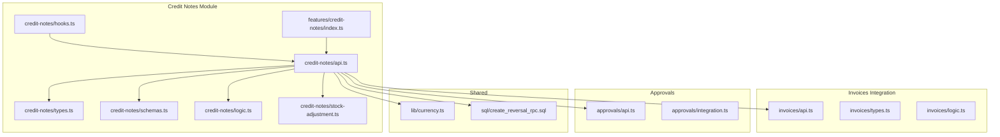
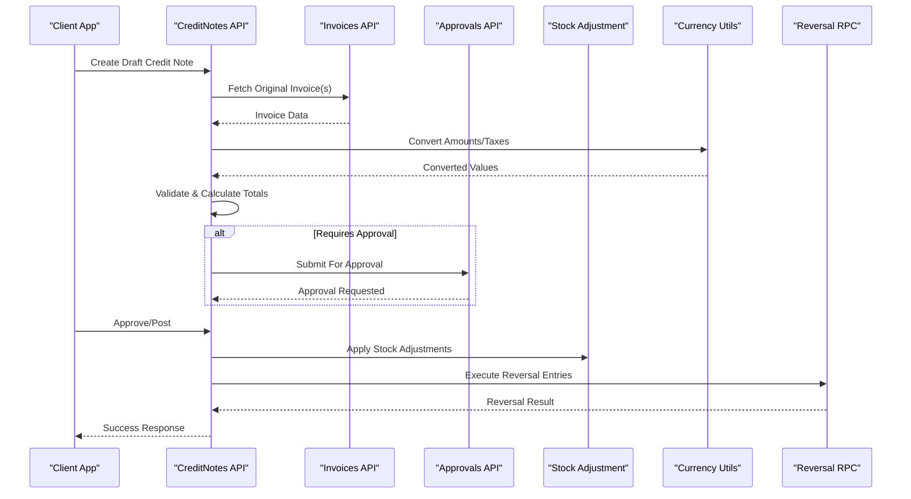
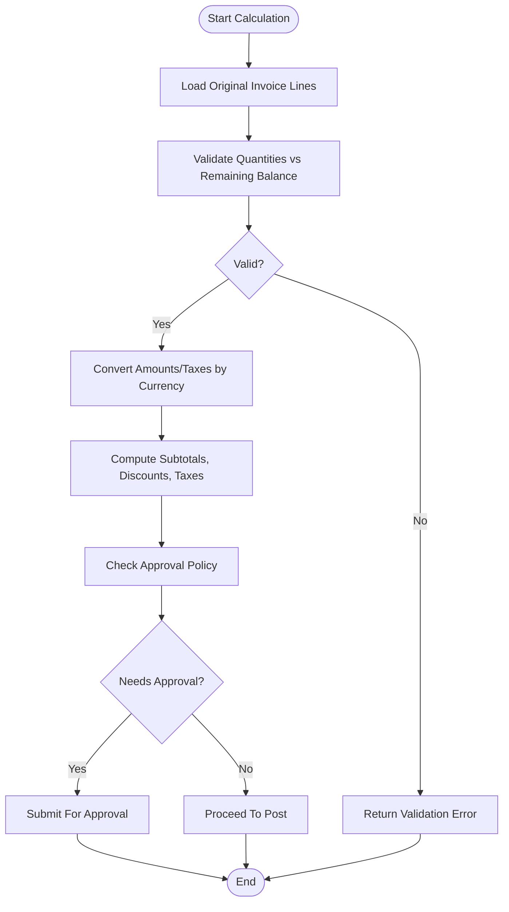
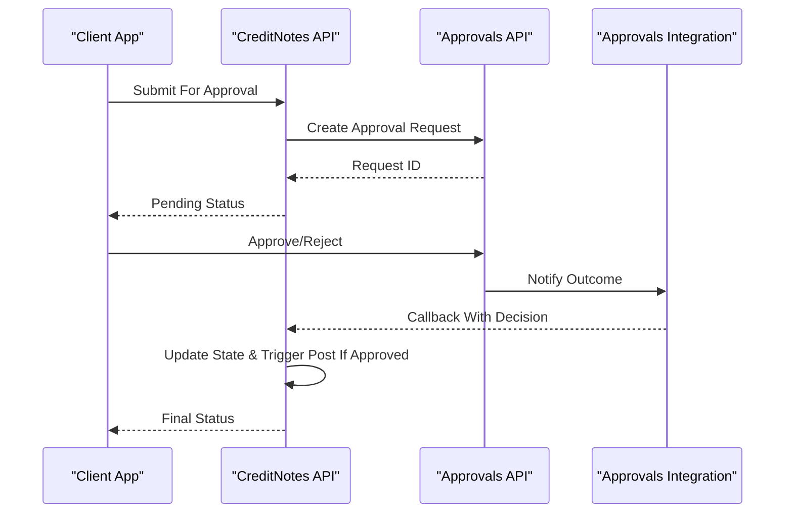
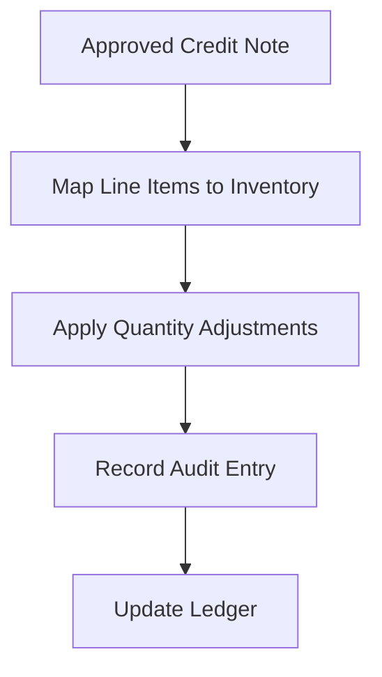
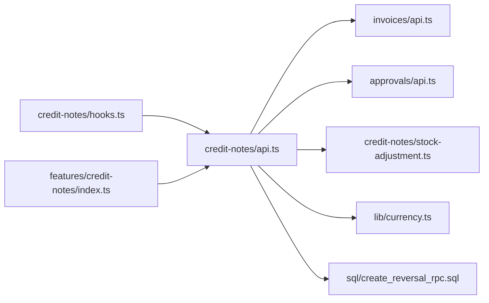

# Credit Notes API

<cite>
**Referenced Files in This Document**
- [credit-notes/api.ts](file://src/credit-notes/api.ts)
- [credit-notes/types.ts](file://src/credit-notes/types.ts)
- [credit-notes/schemas.ts](file://src/credit-notes/schemas.ts)
- [credit-notes/logic.ts](file://src/credit-notes/logic.ts)
- [credit-notes/hooks.ts](file://src/credit-notes/hooks.ts)
- [credit-notes/stock-adjustment.ts](file://src/credit-notes/stock-adjustment.ts)
- [features/credit-notes/index.ts](file://src/features/credit-notes/index.ts)
- [invoices/api.ts](file://src/invoices/api.ts)
- [invoices/types.ts](file://src/invoices/types.ts)
- [invoices/logic.ts](file://src/invoices/logic.ts)
- [approvals/api.ts](file://src/approvals/api.ts)
- [approvals/integration.ts](file://src/approvals/integration.ts)
- [lib/currency.ts](file://src/lib/currency.ts)
- [sql/create_reversal_rpc.sql](file://sql/create_reversal_rpc.sql)
</cite>

## Table of Contents
1. [Introduction](#introduction)
2. [Project Structure](#project-structure)
3. [Core Components](#core-components)
4. [Architecture Overview](#architecture-overview)
5. [Detailed Component Analysis](#detailed-component-analysis)
6. [Dependency Analysis](#dependency-analysis)
7. [Performance Considerations](#performance-considerations)
8. [Troubleshooting Guide](#troubleshooting-guide)
9. [Conclusion](#conclusion)
10. [Appendices](#appendices)

## Introduction
This document provides comprehensive API documentation for credit note management. It covers creation, linking to original invoices, stock adjustments, refund processing, partial credits, multi-currency support, tax reversal calculations, approval workflows, and integrations with inventory systems. It also includes practical examples for return processing, damage claims, and pricing corrections.

## Project Structure
The credit notes feature is implemented as a dedicated module under the application source tree. The key files include:
- API client and hooks for data access
- Type definitions and validation schemas
- Business logic for calculations and validations
- Stock adjustment integration
- Approval workflow integration
- Currency utilities and SQL RPCs for reversals

**Diagram sources**
- [credit-notes/api.ts](file://src/credit-notes/api.ts)
- [credit-notes/types.ts](file://src/credit-notes/types.ts)
- [credit-notes/schemas.ts](file://src/credit-notes/schemas.ts)
- [credit-notes/logic.ts](file://src/credit-notes/logic.ts)
- [credit-notes/hooks.ts](file://src/credit-notes/hooks.ts)
- [credit-notes/stock-adjustment.ts](file://src/credit-notes/stock-adjustment.ts)
- [features/credit-notes/index.ts](file://src/features/credit-notes/index.ts)
- [invoices/api.ts](file://src/invoices/api.ts)
- [invoices/types.ts](file://src/invoices/types.ts)
- [invoices/logic.ts](file://src/invoices/logic.ts)
- [approvals/api.ts](file://src/approvals/api.ts)
- [approvals/integration.ts](file://src/approvals/integration.ts)
- [lib/currency.ts](file://src/lib/currency.ts)
- [sql/create_reversal_rpc.sql](file://sql/create_reversal_rpc.sql)

**Section sources**
- [credit-notes/api.ts](file://src/credit-notes/api.ts)
- [credit-notes/types.ts](file://src/credit-notes/types.ts)
- [credit-notes/schemas.ts](file://src/credit-notes/schemas.ts)
- [credit-notes/logic.ts](file://src/credit-notes/logic.ts)
- [credit-notes/hooks.ts](file://src/credit-notes/hooks.ts)
- [credit-notes/stock-adjustment.ts](file://src/credit-notes/stock-adjustment.ts)
- [features/credit-notes/index.ts](file://src/features/credit-notes/index.ts)
- [invoices/api.ts](file://src/invoices/api.ts)
- [invoices/types.ts](file://src/invoices/types.ts)
- [invoices/logic.ts](file://src/invoices/logic.ts)
- [approvals/api.ts](file://src/approvals/api.ts)
- [approvals/integration.ts](file://src/approvals/integration.ts)
- [lib/currency.ts](file://src/lib/currency.ts)
- [sql/create_reversal_rpc.sql](file://sql/create_reversal_rpc.sql)

## Core Components
- API Client: Provides functions to create, update, list, and manage credit notes; integrates with invoices and approvals.
- Types and Schemas: Define request/response shapes and validation rules for credit notes and line items.
- Logic: Encapsulates business rules such as partial credit limits, tax reversal computations, and currency conversions.
- Stock Adjustment: Coordinates inventory impacts when credit notes are approved or posted.
- Hooks: React hooks that wrap API calls and provide state management for UI components.
- Feature Index: Aggregates exports for the credit notes feature.

Key responsibilities:
- Validate inputs against schemas before submission
- Compute totals, taxes, and currency conversions
- Link credit notes to one or more original invoices
- Trigger approval workflows based on thresholds or policies
- Post stock adjustments upon approval/posting
- Generate reversal entries via SQL RPC where applicable

**Section sources**
- [credit-notes/api.ts](file://src/credit-notes/api.ts)
- [credit-notes/types.ts](file://src/credit-notes/types.ts)
- [credit-notes/schemas.ts](file://src/credit-notes/schemas.ts)
- [credit-notes/logic.ts](file://src/credit-notes/logic.ts)
- [credit-notes/stock-adjustment.ts](file://src/credit-notes/stock-adjustment.ts)
- [credit-notes/hooks.ts](file://src/credit-notes/hooks.ts)
- [features/credit-notes/index.ts](file://src/features/credit-notes/index.ts)

## Architecture Overview
The credit notes system integrates with invoices, approvals, inventory, and currency services. The flow typically involves:
- Client creates a draft credit note (optionally linked to an invoice)
- Validation and calculation occur in logic layer
- Approval workflow may be triggered depending on policy
- Upon approval, stock adjustments and accounting reversals are executed
- Refund processing can be initiated if configured

**Diagram sources**
- [credit-notes/api.ts](file://src/credit-notes/api.ts)
- [invoices/api.ts](file://src/invoices/api.ts)
- [approvals/api.ts](file://src/approvals/api.ts)
- [credit-notes/stock-adjustment.ts](file://src/credit-notes/stock-adjustment.ts)
- [lib/currency.ts](file://src/lib/currency.ts)
- [sql/create_reversal_rpc.sql](file://sql/create_reversal_rpc.sql)

## Detailed Component Analysis

### API Endpoints and Operations
- Create Credit Note
  - Purpose: Create a new credit note, optionally linked to one or more original invoices.
  - Inputs: Header fields, line items, linkage to invoices, reason codes, currency, tax details.
  - Outputs: Created credit note with status and identifiers.
  - Behavior: Validates input, computes totals/taxes, applies currency conversion, checks partial credit constraints, and may submit for approval.
- Update Credit Note
  - Purpose: Modify draft credit notes before approval.
  - Constraints: Cannot modify after approval/posting unless permitted by policy.
- List/Search Credit Notes
  - Purpose: Retrieve credit notes with filters (date range, status, linked invoice IDs).
- Approve/Post Credit Note
  - Purpose: Transition from draft to approved/posted, triggering downstream effects.
  - Effects: Stock adjustments, accounting reversals, ledger updates.
- Cancel/Reject Credit Note
  - Purpose: Abort processing or reject pending approvals.

Integration points:
- Invoices API: Read original invoice data and validate linkage constraints.
- Approvals API: Submit requests and handle outcomes.
- Stock Adjustment: Apply inventory changes for returned/damaged goods.
- Currency Utilities: Normalize amounts across currencies.
- Reversal RPC: Execute tax and amount reversals atomically.

**Section sources**
- [credit-notes/api.ts](file://src/credit-notes/api.ts)
- [invoices/api.ts](file://src/invoices/api.ts)
- [approvals/api.ts](file://src/approvals/api.ts)
- [credit-notes/stock-adjustment.ts](file://src/credit-notes/stock-adjustment.ts)
- [lib/currency.ts](file://src/lib/currency.ts)
- [sql/create_reversal_rpc.sql](file://sql/create_reversal_rpc.sql)

### Data Models and Validation
- Credit Note Header
  - Fields: Unique ID, date, status, linked invoice IDs, reason code, currency, exchange rate, totals, tax summary, remarks.
- Line Items
  - Fields: Item reference, quantity, unit price, discount, tax rates, extended amounts, reversal flags.
- Validation Rules
  - Required fields and formats
  - Partial credit limits relative to original invoice lines
  - Tax reversal consistency with original invoice
  - Multi-currency alignment and rounding behavior

**Section sources**
- [credit-notes/types.ts](file://src/credit-notes/types.ts)
- [credit-notes/schemas.ts](file://src/credit-notes/schemas.ts)

### Business Logic and Calculations
- Partial Credits
  - Enforces that sum of credited quantities per line does not exceed original invoice quantities.
  - Supports multiple credit notes per invoice line up to remaining balance.
- Multi-Currency Support
  - Converts amounts using provided exchange rates.
  - Ensures consistent rounding and reporting in base currency.
- Tax Reversal Calculations
  - Computes reversed tax amounts per line item based on original invoice tax breakdown.
  - Uses SQL RPC to ensure atomicity and auditability.

**Diagram sources**
- [credit-notes/logic.ts](file://src/credit-notes/logic.ts)
- [invoices/api.ts](file://src/invoices/api.ts)
- [lib/currency.ts](file://src/lib/currency.ts)
- [sql/create_reversal_rpc.sql](file://sql/create_reversal_rpc.sql)

**Section sources**
- [credit-notes/logic.ts](file://src/credit-notes/logic.ts)
- [invoices/api.ts](file://src/invoices/api.ts)
- [lib/currency.ts](file://src/lib/currency.ts)
- [sql/create_reversal_rpc.sql](file://sql/create_reversal_rpc.sql)

### Approval Workflows
- Submission
  - When a credit note exceeds thresholds or matches policy rules, it is submitted to the approvals system.
- Review and Decision
  - Approvers review details, linked invoices, and calculated reversals.
  - Actions: Approve, Reject, Request Changes.
- Post-Approval Actions
  - On approval, stock adjustments and reversals are executed.
  - On rejection, the credit note remains in draft or is marked rejected.

**Diagram sources**
- [approvals/api.ts](file://src/approvals/api.ts)
- [approvals/integration.ts](file://src/approvals/integration.ts)
- [credit-notes/api.ts](file://src/credit-notes/api.ts)

**Section sources**
- [approvals/api.ts](file://src/approvals/api.ts)
- [approvals/integration.ts](file://src/approvals/integration.ts)
- [credit-notes/api.ts](file://src/credit-notes/api.ts)

### Inventory Management Integration
- Stock Adjustments
  - On posting, inventory levels are adjusted according to line items and warehouse locations.
  - Supports returns, damages, and restocking scenarios.
- Audit Trail
  - Each adjustment is recorded with references to the credit note and original invoice.

**Diagram sources**
- [credit-notes/stock-adjustment.ts](file://src/credit-notes/stock-adjustment.ts)
- [invoices/types.ts](file://src/invoices/types.ts)

**Section sources**
- [credit-notes/stock-adjustment.ts](file://src/credit-notes/stock-adjustment.ts)
- [invoices/types.ts](file://src/invoices/types.ts)

### Refund Processing
- Refund Initiation
  - After approval, refunds can be initiated if configured.
- Payment Integration
  - Links to payment systems to process refunds to customers.
- Status Tracking
  - Tracks refund status alongside credit note lifecycle.

**Section sources**
- [credit-notes/api.ts](file://src/credit-notes/api.ts)
- [invoices/api.ts](file://src/invoices/api.ts)

### Examples and Use Cases
- Return Processing
  - Create a credit note linked to an invoice line for returned goods.
  - Validate quantities, compute tax reversals, submit for approval if required, post to adjust stock and ledger.
- Damage Claims
  - Mark items as damaged; apply appropriate reason codes and partial credit amounts.
  - Ensure tax reversal reflects damaged portion only.
- Pricing Corrections
  - Issue a credit note to correct overcharged amounts on original invoice lines.
  - Recalculate discounts and taxes; maintain audit trail.

**Section sources**
- [credit-notes/logic.ts](file://src/credit-notes/logic.ts)
- [credit-notes/types.ts](file://src/credit-notes/types.ts)
- [invoices/logic.ts](file://src/invoices/logic.ts)

## Dependency Analysis
The credit notes module depends on several core services:
- Invoices API for reading original invoice data and validating linkages
- Approvals API for workflow orchestration
- Stock Adjustment for inventory impacts
- Currency Utilities for multi-currency handling
- SQL Reversal RPC for atomic tax and amount reversals

**Diagram sources**
- [credit-notes/api.ts](file://src/credit-notes/api.ts)
- [invoices/api.ts](file://src/invoices/api.ts)
- [approvals/api.ts](file://src/approvals/api.ts)
- [credit-notes/stock-adjustment.ts](file://src/credit-notes/stock-adjustment.ts)
- [lib/currency.ts](file://src/lib/currency.ts)
- [sql/create_reversal_rpc.sql](file://sql/create_reversal_rpc.sql)
- [credit-notes/hooks.ts](file://src/credit-notes/hooks.ts)
- [features/credit-notes/index.ts](file://src/features/credit-notes/index.ts)

**Section sources**
- [credit-notes/api.ts](file://src/credit-notes/api.ts)
- [invoices/api.ts](file://src/invoices/api.ts)
- [approvals/api.ts](file://src/approvals/api.ts)
- [credit-notes/stock-adjustment.ts](file://src/credit-notes/stock-adjustment.ts)
- [lib/currency.ts](file://src/lib/currency.ts)
- [sql/create_reversal_rpc.sql](file://sql/create_reversal_rpc.sql)
- [credit-notes/hooks.ts](file://src/credit-notes/hooks.ts)
- [features/credit-notes/index.ts](file://src/features/credit-notes/index.ts)

## Performance Considerations
- Batch Operations
  - Prefer batched submissions for multiple credit notes to reduce network overhead.
- Caching
  - Cache invoice lookups and currency rates where appropriate to minimize repeated calls.
- Validation Early Exit
  - Perform lightweight validations early to fail fast and avoid expensive computations.
- Atomic Reversals
  - Use SQL RPC for reversals to ensure transactional integrity and reduce rollback complexity.

[No sources needed since this section provides general guidance]

## Troubleshooting Guide
Common issues and resolutions:
- Validation Errors
  - Check required fields, quantity limits, and tax consistency.
  - Refer to schema definitions for exact constraints.
- Approval Delays
  - Verify approval policy configuration and reviewer assignments.
  - Inspect approval request status and callbacks.
- Stock Mismatch
  - Confirm warehouse mappings and item availability.
  - Review audit entries for adjustments.
- Currency Conversion Discrepancies
  - Validate exchange rates and rounding rules.
  - Ensure base currency alignment in reports.

**Section sources**
- [credit-notes/schemas.ts](file://src/credit-notes/schemas.ts)
- [approvals/api.ts](file://src/approvals/api.ts)
- [credit-notes/stock-adjustment.ts](file://src/credit-notes/stock-adjustment.ts)
- [lib/currency.ts](file://src/lib/currency.ts)

## Conclusion
The credit notes API provides robust capabilities for managing returns, damage claims, and pricing corrections with strong integration into invoices, approvals, inventory, and currency systems. It supports partial credits, multi-currency operations, and precise tax reversal calculations through atomic SQL RPCs. Proper use of validation, approval workflows, and stock adjustments ensures accurate financial and inventory records.

[No sources needed since this section summarizes without analyzing specific files]

## Appendices

### API Reference Summary
- Create Credit Note
  - Input: Header + Line Items + Linked Invoices + Currency + Tax Details
  - Output: Created Credit Note with Status
- Update Credit Note
  - Input: Modified Draft Fields
  - Output: Updated Credit Note
- List/Search Credit Notes
  - Filters: Date Range, Status, Linked Invoice IDs
  - Output: Paginated List
- Approve/Post Credit Note
  - Input: Approval Action
  - Output: Posted Credit Note with Effects Applied
- Cancel/Reject Credit Note
  - Input: Cancellation/Rejection Reason
  - Output: Updated Status

**Section sources**
- [credit-notes/api.ts](file://src/credit-notes/api.ts)
- [credit-notes/types.ts](file://src/credit-notes/types.ts)
- [credit-notes/schemas.ts](file://src/credit-notes/schemas.ts)