# Financial Documents API

<cite>
**Referenced Files in This Document**
- [invoices/api.ts](file://src/invoices/api.ts)
- [invoices/types.ts](file://src/invoices/types.ts)
- [invoices/schemas.ts](file://src/invoices/schemas.ts)
- [invoices/logic.ts](file://src/invoices/logic.ts)
- [proforma-invoices/api.ts](file://src/proforma-invoices/api.ts)
- [proforma-invoices/types.ts](file://src/proforma-invoices/types.ts)
- [credit-notes/api.ts](file://src/credit-notes/api.ts)
- [credit-notes/types.ts](file://src/credit-notes/types.ts)
- [ledger/api.ts](file://src/ledger/api.ts)
- [ledger/hooks.ts](file://src/ledger/hooks.ts)
- [purchase-inquiries/api.ts](file://src/purchase-inquiries/api.ts)
- [purchase-requisitions/api.ts](file://src/purchase-requisitions/api.ts)
- [lib/quotation-workflow.ts](file://src/lib/quotation-workflow.ts)
- [lib/currency.ts](file://src/lib/currency.ts)
- [approvals/api.ts](file://src/approvals/api.ts)
- [approvals/workflow-engine.ts](file://src/approvals/workflow-engine.ts)
- [hooks/usePDFGeneration.ts](file://src/hooks/usePDFGeneration.ts)
- [pdf/document-generate.ts](file://src/pdf/document-generate.ts)
- [templates/classic-quotation-template.tsx](file://src/templates/classic-quotation-template.tsx)
- [pages/CreatePO.tsx](file://src/pages/CreatePO.tsx)
- [database/database-proforma-invoices.sql](file://src/database/database-proforma-invoices.sql)
- [database/database-quotation-conversions.sql](file://src/database/database-quotation-conversions.sql)
- [database/database-document-series.sql](file://src/database/database-document-series.sql)
</cite>

## Table of Contents
1. [Introduction](#introduction)
2. [Project Structure](#project-structure)
3. [Core Components](#core-components)
4. [Architecture Overview](#architecture-overview)
5. [Detailed Component Analysis](#detailed-component-analysis)
6. [Dependency Analysis](#dependency-analysis)
7. [Performance Considerations](#performance-considerations)
8. [Troubleshooting Guide](#troubleshooting-guide)
9. [Conclusion](#conclusion)
10. [Appendices](#appendices)

## Introduction
This document provides comprehensive API documentation for financial document management endpoints, covering invoices, proforma invoices, credit notes, purchase orders, and ledger operations. It also details payment processing workflows, approval chains, financial calculations, PDF generation, template rendering, and export capabilities. Examples illustrate end-to-end workflows from quotation to payment collection, including tax calculations, currency handling, and compliance requirements.

## Project Structure
The financial documents feature set is organized by domain modules with clear separation between API definitions, types, schemas, business logic, and UI integrations:
- Invoices: API, types, schemas, calculation logic, and PDF generation hooks
- Proforma Invoices: API and type definitions
- Credit Notes: API and type definitions
- Ledger: API and hooks for accounting entries and balances
- Purchase Orders: API for inquiries and requisitions; page integration for creation
- Approvals: API and workflow engine for multi-step approvals
- Quotations: Workflow utilities and conversion helpers
- PDF Generation: Hooks and document generators
- Templates: Classic and professional templates for rendering
- Database: Migrations for document series, conversions, and schema

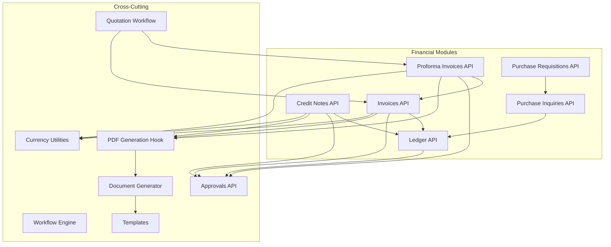

**Diagram sources**
- [invoices/api.ts](file://src/invoices/api.ts)
- [proforma-invoices/api.ts](file://src/proforma-invoices/api.ts)
- [credit-notes/api.ts](file://src/credit-notes/api.ts)
- [ledger/api.ts](file://src/ledger/api.ts)
- [purchase-inquiries/api.ts](file://src/purchase-inquiries/api.ts)
- [purchase-requisitions/api.ts](file://src/purchase-requisitions/api.ts)
- [approvals/api.ts](file://src/approvals/api.ts)
- [approvals/workflow-engine.ts](file://src/approvals/workflow-engine.ts)
- [lib/currency.ts](file://src/lib/currency.ts)
- [lib/quotation-workflow.ts](file://src/lib/quotation-workflow.ts)
- [hooks/usePDFGeneration.ts](file://src/hooks/usePDFGeneration.ts)
- [pdf/document-generate.ts](file://src/pdf/document-generate.ts)
- [templates/classic-quotation-template.tsx](file://src/templates/classic-quotation-template.tsx)

**Section sources**
- [invoices/api.ts](file://src/invoices/api.ts)
- [proforma-invoices/api.ts](file://src/proforma-invoices/api.ts)
- [credit-notes/api.ts](file://src/credit-notes/api.ts)
- [ledger/api.ts](file://src/ledger/api.ts)
- [purchase-inquiries/api.ts](file://src/purchase-inquiries/api.ts)
- [purchase-requisitions/api.ts](file://src/purchase-requisitions/api.ts)
- [approvals/api.ts](file://src/approvals/api.ts)
- [approvals/workflow-engine.ts](file://src/approvals/workflow-engine.ts)
- [lib/currency.ts](file://src/lib/currency.ts)
- [lib/quotation-workflow.ts](file://src/lib/quotation-workflow.ts)
- [hooks/usePDFGeneration.ts](file://src/hooks/usePDFGeneration.ts)
- [pdf/document-generate.ts](file://src/pdf/document-generate.ts)
- [templates/classic-quotation-template.tsx](file://src/templates/classic-quotation-template.tsx)

## Core Components
- Invoices API: Endpoints for creating, updating, listing, and deleting invoices; calculating totals, taxes, discounts; linking to quotations and proforma invoices; generating PDFs; posting ledger entries.
- Proforma Invoices API: Endpoints for creating and converting proforma invoices into invoices; managing terms and validity.
- Credit Notes API: Endpoints for issuing credit notes against invoices or purchases; reversing amounts and adjusting ledgers.
- Ledger API: Endpoints for reading account balances, postings, and generating trial balance reports; integrating with invoice and credit note flows.
- Purchase Inquiries/Requisitions APIs: Endpoints for procurement requests and inquiries; leading to purchase orders and supplier payments.
- Approvals API and Workflow Engine: Multi-step approval processes for high-value transactions; enforcing policies and audit trails.
- Currency Utilities: Rounding, exchange rate application, and currency formatting across all financial documents.
- Quotation Workflow: Conversion helpers from quotations to proforma invoices and invoices.
- PDF Generation: Hooks and document generator for producing standardized PDFs using templates.

**Section sources**
- [invoices/api.ts](file://src/invoices/api.ts)
- [invoices/types.ts](file://src/invoices/types.ts)
- [invoices/schemas.ts](file://src/invoices/schemas.ts)
- [invoices/logic.ts](file://src/invoices/logic.ts)
- [proforma-invoices/api.ts](file://src/proforma-invoices/api.ts)
- [proforma-invoices/types.ts](file://src/proforma-invoices/types.ts)
- [credit-notes/api.ts](file://src/credit-notes/api.ts)
- [credit-notes/types.ts](file://src/credit-notes/types.ts)
- [ledger/api.ts](file://src/ledger/api.ts)
- [ledger/hooks.ts](file://src/ledger/hooks.ts)
- [purchase-inquiries/api.ts](file://src/purchase-inquiries/api.ts)
- [purchase-requisitions/api.ts](file://src/purchase-requisitions/api.ts)
- [approvals/api.ts](file://src/approvals/api.ts)
- [approvals/workflow-engine.ts](file://src/approvals/workflow-engine.ts)
- [lib/currency.ts](file://src/lib/currency.ts)
- [lib/quotation-workflow.ts](file://src/lib/quotation-workflow.ts)
- [hooks/usePDFGeneration.ts](file://src/hooks/usePDFGeneration.ts)
- [pdf/document-generate.ts](file://src/pdf/document-generate.ts)
- [templates/classic-quotation-template.tsx](file://src/templates/classic-quotation-template.tsx)

## Architecture Overview
The system follows a modular architecture where each financial document module exposes REST-like endpoints (via serverless functions or framework routes), enforces validation through schemas, applies business logic for calculations, integrates with the ledger for accounting, and supports approvals and PDF generation.

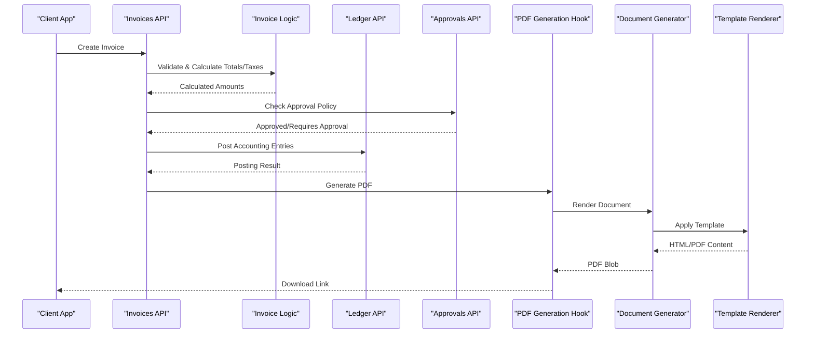

**Diagram sources**
- [invoices/api.ts](file://src/invoices/api.ts)
- [invoices/logic.ts](file://src/invoices/logic.ts)
- [ledger/api.ts](file://src/ledger/api.ts)
- [approvals/api.ts](file://src/approvals/api.ts)
- [hooks/usePDFGeneration.ts](file://src/hooks/usePDFGeneration.ts)
- [pdf/document-generate.ts](file://src/pdf/document-generate.ts)
- [templates/classic-quotation-template.tsx](file://src/templates/classic-quotation-template.tsx)

## Detailed Component Analysis

### Invoices API
- Endpoints:
  - Create Invoice: Validates input via schemas, calculates line totals, discounts, taxes, and currency conversions; optionally triggers approvals; posts ledger entries; returns created invoice and generated PDF link.
  - Update Invoice: Applies changes with revalidation and recalculation; updates ledger postings if necessary.
  - List/Filter Invoices: Supports filters by client, date range, status, project, and currency.
  - Delete/Cancel Invoice: Enforces policy checks and reverses ledger entries when applicable.
- Types and Schemas:
  - Strongly typed request/response models ensure consistent payloads.
  - Validation rules enforce required fields, numeric precision, and tax configurations.
- Business Logic:
  - Calculation engine computes subtotal, discount, taxable amount, tax rates, and grand total.
  - Currency handling uses utility functions for rounding and exchange rate application.
  - Integration with quotations and proforma invoices maintains traceability.
- PDF Generation:
  - Uses PDF generation hook to render documents via templates.

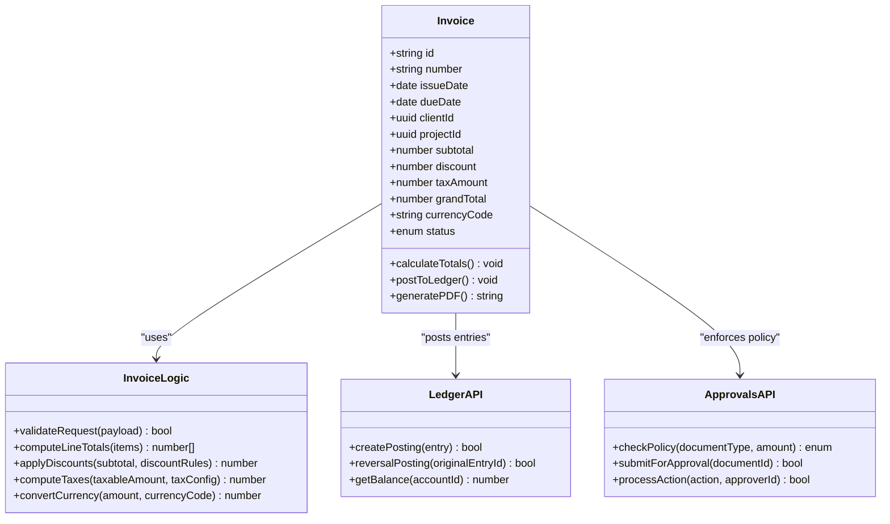

**Diagram sources**
- [invoices/types.ts](file://src/invoices/types.ts)
- [invoices/schemas.ts](file://src/invoices/schemas.ts)
- [invoices/logic.ts](file://src/invoices/logic.ts)
- [ledger/api.ts](file://src/ledger/api.ts)
- [approvals/api.ts](file://src/approvals/api.ts)

**Section sources**
- [invoices/api.ts](file://src/invoices/api.ts)
- [invoices/types.ts](file://src/invoices/types.ts)
- [invoices/schemas.ts](file://src/invoices/schemas.ts)
- [invoices/logic.ts](file://src/invoices/logic.ts)
- [lib/currency.ts](file://src/lib/currency.ts)

### Proforma Invoices API
- Endpoints:
  - Create Proforma Invoice: Stores draft commercial offer with pricing, terms, and validity period.
  - Convert to Invoice: Transforms approved proforma into an invoice, preserving line items and calculations.
  - List/View Proforma Invoices: Filters by client, status, and validity.
- Types:
  - Defines proforma-specific fields such as validity dates and conversion flags.
- Integrations:
  - Links to quotations for source data.
  - Triggers approvals based on thresholds.

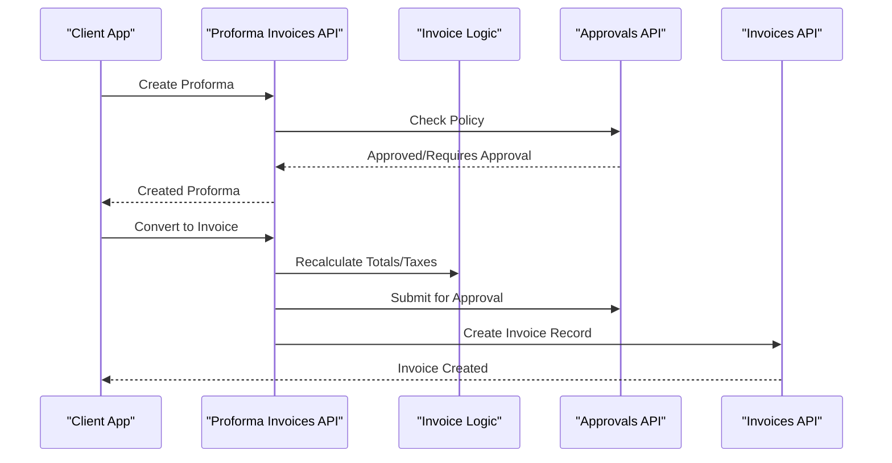

**Diagram sources**
- [proforma-invoices/api.ts](file://src/proforma-invoices/api.ts)
- [proforma-invoices/types.ts](file://src/proforma-invoices/types.ts)
- [invoices/logic.ts](file://src/invoices/logic.ts)
- [approvals/api.ts](file://src/approvals/api.ts)
- [invoices/api.ts](file://src/invoices/api.ts)

**Section sources**
- [proforma-invoices/api.ts](file://src/proforma-invoices/api.ts)
- [proforma-invoices/types.ts](file://src/proforma-invoices/types.ts)
- [lib/quotation-workflow.ts](file://src/lib/quotation-workflow.ts)

### Credit Notes API
- Endpoints:
  - Create Credit Note: Issues credit against invoices or purchases; supports partial/full reversal.
  - Link to Original Document: Maintains audit trail and reconciliation.
  - Post to Ledger: Adjusts receivables/payables and tax accounts.
- Types:
  - Captures reason codes, reference document IDs, and amounts.
- Compliance:
  - Ensures tax adjustments align with jurisdictional rules.

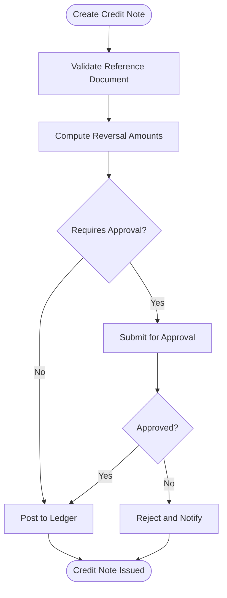

**Diagram sources**
- [credit-notes/api.ts](file://src/credit-notes/api.ts)
- [credit-notes/types.ts](file://src/credit-notes/types.ts)
- [ledger/api.ts](file://src/ledger/api.ts)
- [approvals/api.ts](file://src/approvals/api.ts)

**Section sources**
- [credit-notes/api.ts](file://src/credit-notes/api.ts)
- [credit-notes/types.ts](file://src/credit-notes/types.ts)

### Ledger API
- Endpoints:
  - Read Account Balances: Aggregates postings per account and currency.
  - Query Transactions: Filters by date, account, document type, and reference ID.
  - Reports: Trial balance, receivables aging, payables aging.
- Hooks:
  - Provides React hooks for real-time balance updates and transaction lists.
- Integrations:
  - Receives postings from invoices, credit notes, and purchase orders.

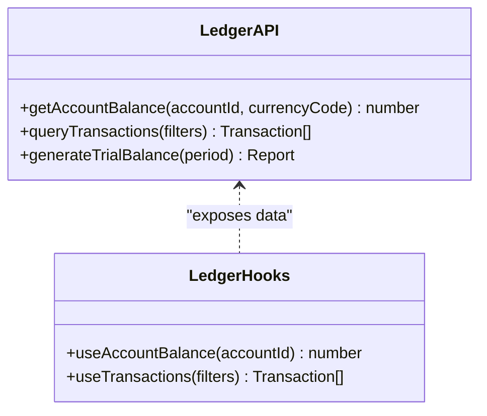

**Diagram sources**
- [ledger/api.ts](file://src/ledger/api.ts)
- [ledger/hooks.ts](file://src/ledger/hooks.ts)

**Section sources**
- [ledger/api.ts](file://src/ledger/api.ts)
- [ledger/hooks.ts](file://src/ledger/hooks.ts)

### Purchase Orders (Inquiries and Requisitions)
- Endpoints:
  - Purchase Inquiries: Create and manage RFQs to suppliers; track responses.
  - Purchase Requisitions: Internal requests for procurement; route for approvals.
  - Page Integration: CreatePO page orchestrates form inputs and submission flow.
- Integrations:
  - Converts approved requisitions into purchase orders; posts to ledger upon receipt/payment.

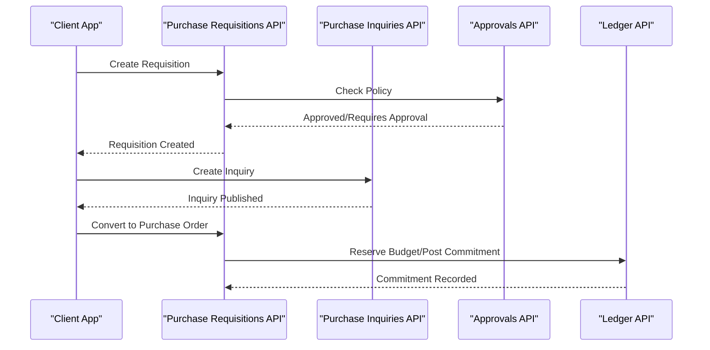

**Diagram sources**
- [purchase-requisitions/api.ts](file://src/purchase-requisitions/api.ts)
- [purchase-inquiries/api.ts](file://src/purchase-inquiries/api.ts)
- [approvals/api.ts](file://src/approvals/api.ts)
- [ledger/api.ts](file://src/ledger/api.ts)
- [pages/CreatePO.tsx](file://src/pages/CreatePO.tsx)

**Section sources**
- [purchase-requisitions/api.ts](file://src/purchase-requisitions/api.ts)
- [purchase-inquiries/api.ts](file://src/purchase-inquiries/api.ts)
- [pages/CreatePO.tsx](file://src/pages/CreatePO.tsx)

### Approvals API and Workflow Engine
- Endpoints:
  - Submit for Approval: Initiates workflow based on document type and amount thresholds.
  - Process Action: Approve, reject, or request changes with comments.
  - Status Queries: Track current stage and history.
- Workflow Engine:
  - Configurable stages, roles, and conditions.
  - Audit logging for compliance.

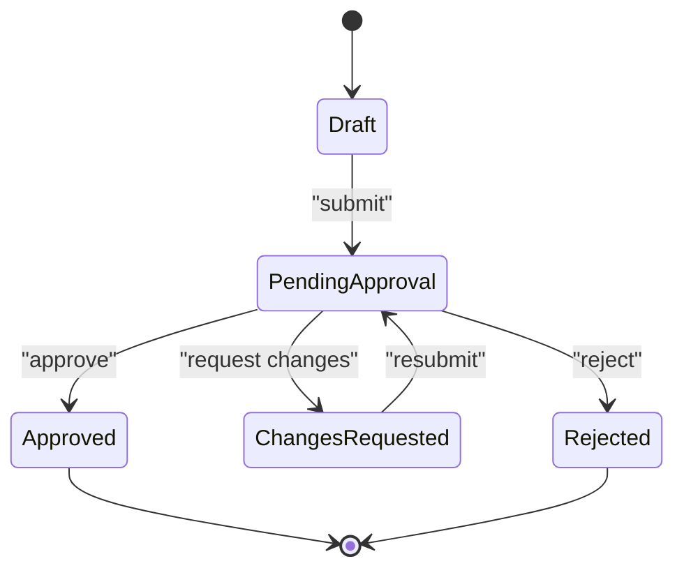

**Diagram sources**
- [approvals/api.ts](file://src/approvals/api.ts)
- [approvals/workflow-engine.ts](file://src/approvals/workflow-engine.ts)

**Section sources**
- [approvals/api.ts](file://src/approvals/api.ts)
- [approvals/workflow-engine.ts](file://src/approvals/workflow-engine.ts)

### PDF Generation and Template Rendering
- Hooks:
  - usePDFGeneration: Orchestrates document rendering and download.
- Generator:
  - document-generate: Builds content from templates and returns PDF blobs.
- Templates:
  - Classic quotation template and other templates for invoices, proforma, and credit notes.

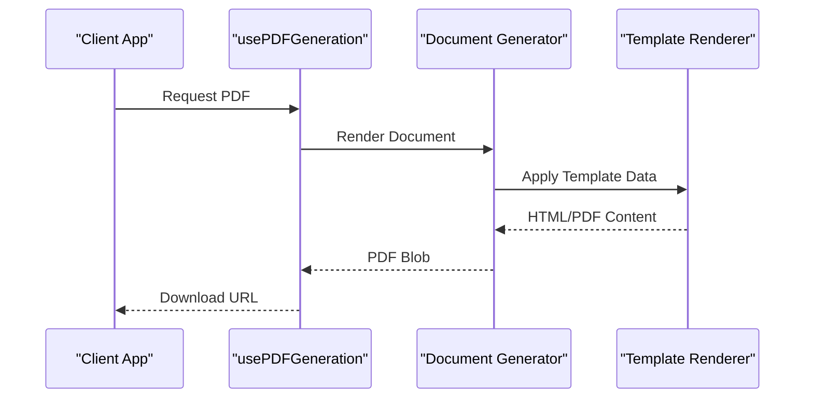

**Diagram sources**
- [hooks/usePDFGeneration.ts](file://src/hooks/usePDFGeneration.ts)
- [pdf/document-generate.ts](file://src/pdf/document-generate.ts)
- [templates/classic-quotation-template.tsx](file://src/templates/classic-quotation-template.tsx)

**Section sources**
- [hooks/usePDFGeneration.ts](file://src/hooks/usePDFGeneration.ts)
- [pdf/document-generate.ts](file://src/pdf/document-generate.ts)
- [templates/classic-quotation-template.tsx](file://src/templates/classic-quotation-template.tsx)

### Tax Calculations and Currency Handling
- Tax Calculations:
  - Applied at line level and aggregated; configurable rates and exemptions.
  - Supports multiple tax jurisdictions and HSN/SAC codes.
- Currency Handling:
  - Exchange rate application and rounding rules.
  - Consistent formatting across documents and reports.

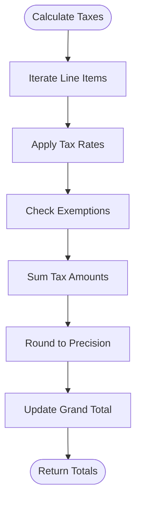

**Diagram sources**
- [invoices/logic.ts](file://src/invoices/logic.ts)
- [lib/currency.ts](file://src/lib/currency.ts)

**Section sources**
- [invoices/logic.ts](file://src/invoices/logic.ts)
- [lib/currency.ts](file://src/lib/currency.ts)

### Complete Financial Workflow Example: Quotation to Payment Collection
- Steps:
  1. Create Quotation: Capture client requirements, items, pricing, and terms.
  2. Convert to Proforma Invoice: Transform quotation into a formal offer with validity.
  3. Approve Proforma: Route through approval workflow if threshold exceeded.
  4. Convert to Invoice: Upon acceptance, create invoice with calculated totals and taxes.
  5. Approve Invoice: Enforce approval policy and post ledger entries.
  6. Generate PDF: Produce invoice PDF for delivery.
  7. Receive Payment: Record payment, reconcile receivables, and update ledger.
  8. Issue Credit Note (if needed): Reverse amounts and adjust taxes.

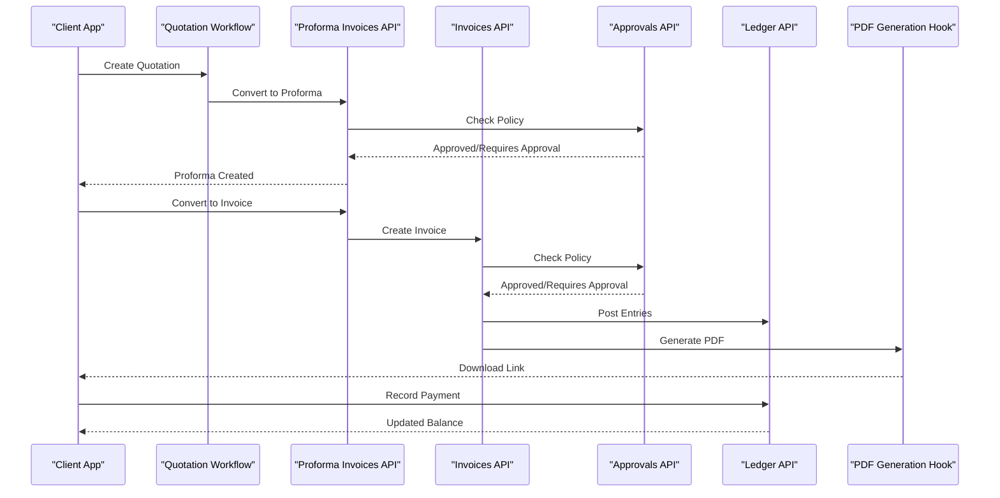

**Diagram sources**
- [lib/quotation-workflow.ts](file://src/lib/quotation-workflow.ts)
- [proforma-invoices/api.ts](file://src/proforma-invoices/api.ts)
- [invoices/api.ts](file://src/invoices/api.ts)
- [approvals/api.ts](file://src/approvals/api.ts)
- [ledger/api.ts](file://src/ledger/api.ts)
- [hooks/usePDFGeneration.ts](file://src/hooks/usePDFGeneration.ts)

**Section sources**
- [lib/quotation-workflow.ts](file://src/lib/quotation-workflow.ts)
- [proforma-invoices/api.ts](file://src/proforma-invoices/api.ts)
- [invoices/api.ts](file://src/invoices/api.ts)
- [approvals/api.ts](file://src/approvals/api.ts)
- [ledger/api.ts](file://src/ledger/api.ts)
- [hooks/usePDFGeneration.ts](file://src/hooks/usePDFGeneration.ts)

## Dependency Analysis
- Module Coupling:
  - Invoices depend on approvals, ledger, and PDF generation.
  - Proforma invoices depend on quotations and approvals.
  - Credit notes depend on ledger and approvals.
  - Purchase orders depend on approvals and ledger.
- External Dependencies:
  - Currency utilities for exchange rates and rounding.
  - Template renderer for PDF output.
- Potential Circular Dependencies:
  - Ensure one-way dependencies from documents to ledger and approvals to avoid cycles.

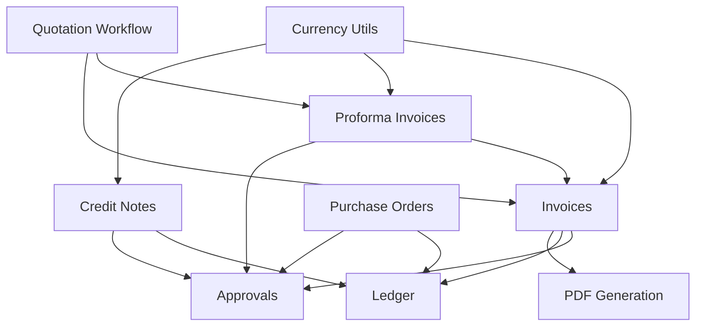

**Diagram sources**
- [invoices/api.ts](file://src/invoices/api.ts)
- [proforma-invoices/api.ts](file://src/proforma-invoices/api.ts)
- [credit-notes/api.ts](file://src/credit-notes/api.ts)
- [ledger/api.ts](file://src/ledger/api.ts)
- [approvals/api.ts](file://src/approvals/api.ts)
- [lib/currency.ts](file://src/lib/currency.ts)
- [lib/quotation-workflow.ts](file://src/lib/quotation-workflow.ts)

**Section sources**
- [invoices/api.ts](file://src/invoices/api.ts)
- [proforma-invoices/api.ts](file://src/proforma-invoices/api.ts)
- [credit-notes/api.ts](file://src/credit-notes/api.ts)
- [ledger/api.ts](file://src/ledger/api.ts)
- [approvals/api.ts](file://src/approvals/api.ts)
- [lib/currency.ts](file://src/lib/currency.ts)
- [lib/quotation-workflow.ts](file://src/lib/quotation-workflow.ts)

## Performance Considerations
- Batch Operations:
  - Use batch endpoints for bulk invoice creation and ledger postings.
- Caching:
  - Cache exchange rates and tax configurations to reduce computation overhead.
- Pagination:
  - Implement pagination for large transaction lists and report queries.
- Asynchronous Processing:
  - Offload PDF generation and approval notifications to background jobs.

[No sources needed since this section provides general guidance]

## Troubleshooting Guide
- Common Errors:
  - Validation failures: Check schema constraints and required fields.
  - Approval denials: Review policy thresholds and approver permissions.
  - Ledger posting errors: Verify account mappings and currency codes.
- Debugging Tools:
  - Enable detailed logs for approval workflows and PDF generation.
  - Use hooks to inspect real-time ledger balances and transaction histories.

**Section sources**
- [approvals/api.ts](file://src/approvals/api.ts)
- [ledger/hooks.ts](file://src/ledger/hooks.ts)
- [hooks/usePDFGeneration.ts](file://src/hooks/usePDFGeneration.ts)

## Conclusion
The financial documents API provides a robust, modular foundation for managing invoices, proforma invoices, credit notes, purchase orders, and ledger operations. With strong validation, approval workflows, accurate tax and currency handling, and integrated PDF generation, it supports complete financial lifecycles from quotation to payment collection while maintaining compliance and auditability.

[No sources needed since this section summarizes without analyzing specific files]

## Appendices

### Database Schema References
- Proforma Invoices Migration: Defines table structures and relationships for proforma invoices.
- Quotation Conversions: Specifies conversion rules and references between quotations and invoices.
- Document Series: Manages numbering sequences and prefixes for financial documents.

**Section sources**
- [database/database-proforma-invoices.sql](file://src/database/database-proforma-invoices.sql)
- [database/database-quotation-conversions.sql](file://src/database/database-quotation-conversions.sql)
- [database/database-document-series.sql](file://src/database/database-document-series.sql)