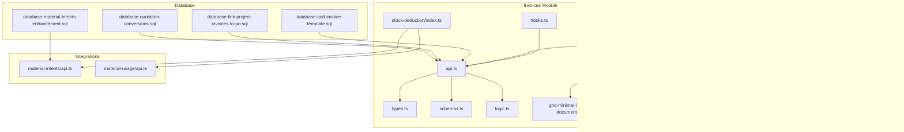
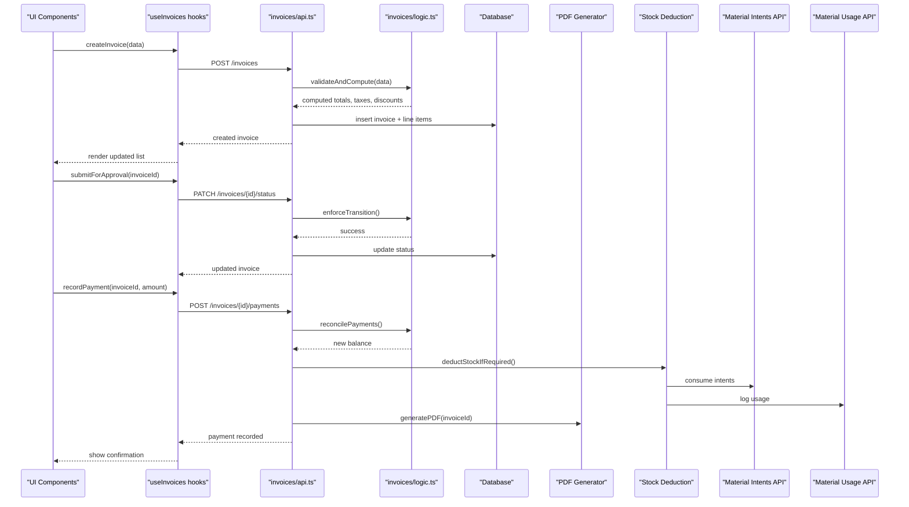
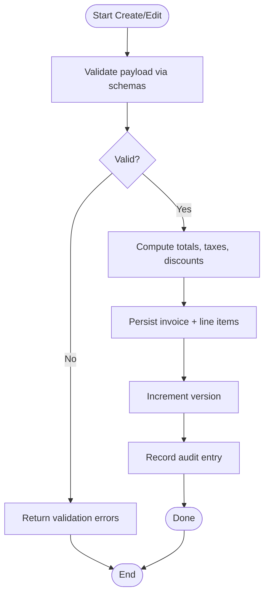
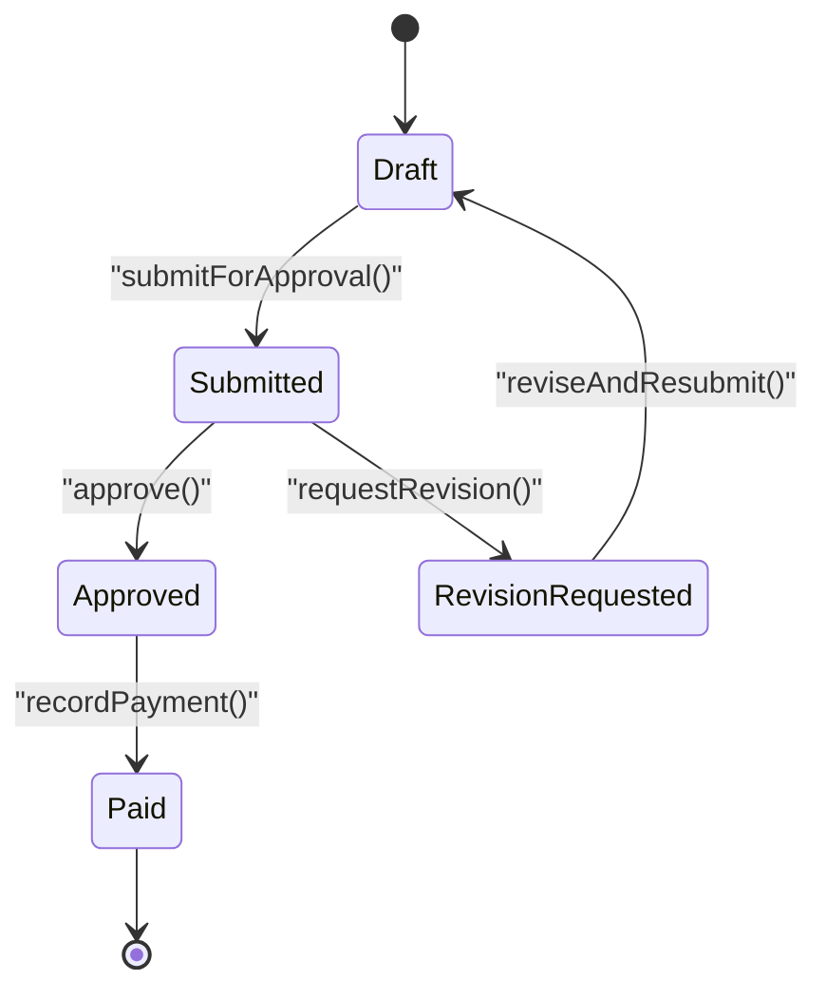
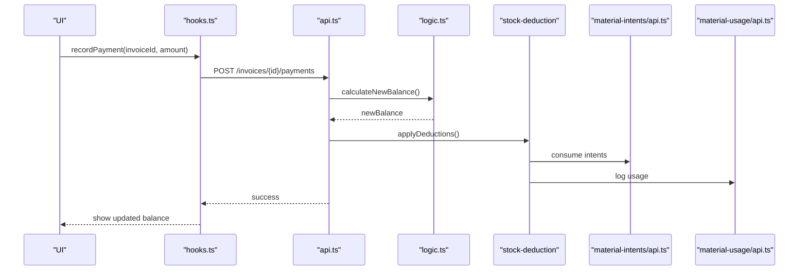
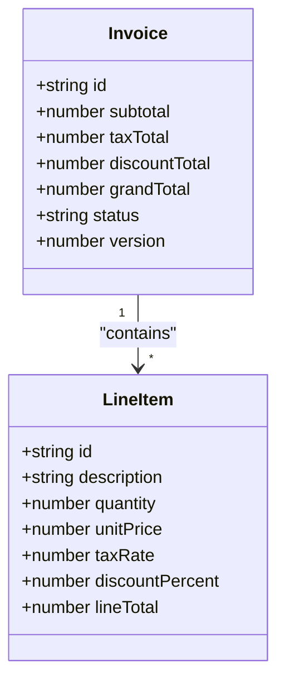
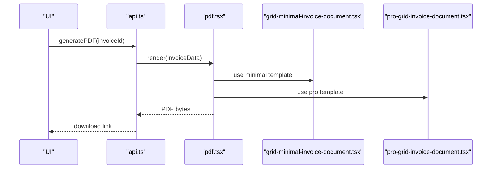
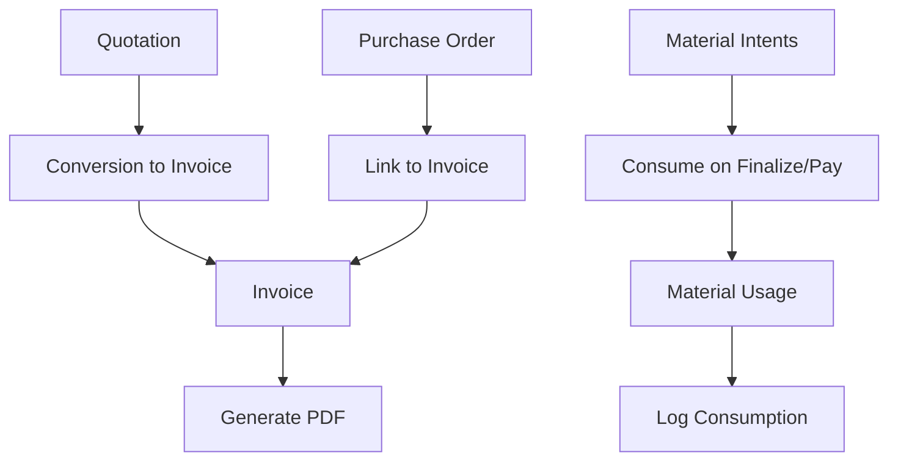
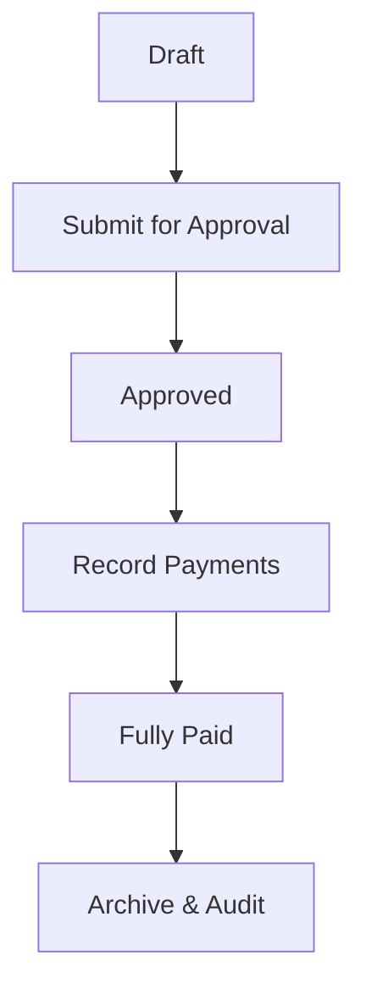
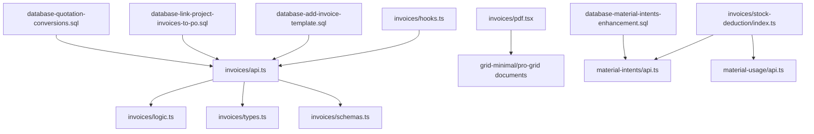

# Invoices API

<cite>
**Referenced Files in This Document**
- [src/invoices/api.ts](file://src/invoices/api.ts)
- [src/invoices/types.ts](file://src/invoices/types.ts)
- [src/invoices/schemas.ts](file://src/invoices/schemas.ts)
- [src/invoices/logic.ts](file://src/invoices/logic.ts)
- [src/invoices/hooks.ts](file://src/invoices/hooks.ts)
- [src/invoices/pdf.tsx](file://src/invoices/pdf.tsx)
- [src/invoices/grid-minimal-invoice-document.tsx](file://src/invoices/grid-minimal-invoice-document.tsx)
- [src/invoices/pro-grid-invoice-document.tsx](file://src/invoices/pro-grid-invoice-document.tsx)
- [src/invoices/stock-deduction/index.ts](file://src/invoices/stock-deduction/index.ts)
- [src/features/invoices/index.ts](file://src/features/invoices/index.ts)
- [src/components/CreateProjectInvoiceModal.tsx](file://src/components/CreateProjectInvoiceModal.tsx)
- [src/pages/InvoiceA4Template.tsx](file://src/pages/InvoiceA4Template.tsx)
- [src/database-add-invoice-template.sql](file://src/database-add-invoice-template.sql)
- [src/database-link-project-invoices-to-po.sql](file://src/database-link-project-invoices-to-po.sql)
- [src/database-quotation-conversions.sql](file://src/database-quotation-conversions.sql)
- [src/database-material-intents-enhancement.sql](file://src/database-material-intents-enhancement.sql)
- [src/material-intents/api.ts](file://src/material-intents/api.ts)
- [src/material-usage/api.ts](file://src/material-usage/api.ts)
</cite>

## Table of Contents
1. [Introduction](#introduction)
2. [Project Structure](#project-structure)
3. [Core Components](#core-components)
4. [Architecture Overview](#architecture-overview)
5. [Detailed Component Analysis](#detailed-component-analysis)
6. [Dependency Analysis](#dependency-analysis)
7. [Performance Considerations](#performance-considerations)
8. [Troubleshooting Guide](#troubleshooting-guide)
9. [Conclusion](#conclusion)
10. [Appendices](#appendices)

## Introduction
This document provides comprehensive API documentation for invoice management endpoints and workflows within the application. It covers invoice creation, editing, status transitions, payment processing, line item management, tax calculations, discount handling, PDF generation, approval workflows, versioning, audit trails, and integrations with quotations, purchase orders, and material consumption tracking. The goal is to enable developers and integrators to implement end-to-end invoice lifecycle flows from draft to payment collection.

## Project Structure
The invoice feature is implemented primarily under src/invoices with supporting UI components, database migrations, and integration modules:
- API layer and types: api.ts, types.ts, schemas.ts
- Business logic: logic.ts
- Client hooks: hooks.ts
- PDF generation: pdf.tsx and template documents
- Stock deduction utilities: stock-deduction/index.ts
- Feature entrypoint: features/invoices/index.ts
- UI components and pages that interact with invoices
- Database migrations for templates, PO linkage, quotation conversions, and material intents

**Diagram sources**
- [src/invoices/api.ts](file://src/invoices/api.ts)
- [src/invoices/types.ts](file://src/invoices/types.ts)
- [src/invoices/schemas.ts](file://src/invoices/schemas.ts)
- [src/invoices/logic.ts](file://src/invoices/logic.ts)
- [src/invoices/hooks.ts](file://src/invoices/hooks.ts)
- [src/invoices/pdf.tsx](file://src/invoices/pdf.tsx)
- [src/invoices/grid-minimal-invoice-document.tsx](file://src/invoices/grid-minimal-invoice-document.tsx)
- [src/invoices/pro-grid-invoice-document.tsx](file://src/invoices/pro-grid-invoice-document.tsx)
- [src/invoices/stock-deduction/index.ts](file://src/invoices/stock-deduction/index.ts)
- [src/material-intents/api.ts](file://src/material-intents/api.ts)
- [src/material-usage/api.ts](file://src/material-usage/api.ts)
- [src/components/CreateProjectInvoiceModal.tsx](file://src/components/CreateProjectInvoiceModal.tsx)
- [src/pages/InvoiceA4Template.tsx](file://src/pages/InvoiceA4Template.tsx)
- [src/database-add-invoice-template.sql](file://src/database-add-invoice-template.sql)
- [src/database-link-project-invoices-to-po.sql](file://src/database-link-project-invoices-to-po.sql)
- [src/database-quotation-conversions.sql](file://src/database-quotation-conversions.sql)
- [src/database-material-intents-enhancement.sql](file://src/database-material-intents-enhancement.sql)

**Section sources**
- [src/invoices/api.ts](file://src/invoices/api.ts)
- [src/invoices/types.ts](file://src/invoices/types.ts)
- [src/invoices/schemas.ts](file://src/invoices/schemas.ts)
- [src/invoices/logic.ts](file://src/invoices/logic.ts)
- [src/invoices/hooks.ts](file://src/invoices/hooks.ts)
- [src/invoices/pdf.tsx](file://src/invoices/pdf.tsx)
- [src/invoices/grid-minimal-invoice-document.tsx](file://src/invoices/grid-minimal-invoice-document.tsx)
- [src/invoices/pro-grid-invoice-document.tsx](file://src/invoices/pro-grid-invoice-document.tsx)
- [src/invoices/stock-deduction/index.ts](file://src/invoices/stock-deduction/index.ts)
- [src/features/invoices/index.ts](file://src/features/invoices/index.ts)
- [src/components/CreateProjectInvoiceModal.tsx](file://src/components/CreateProjectInvoiceModal.tsx)
- [src/pages/InvoiceA4Template.tsx](file://src/pages/InvoiceA4Template.tsx)
- [src/database-add-invoice-template.sql](file://src/database-add-invoice-template.sql)
- [src/database-link-project-invoices-to-po.sql](file://src/database-link-project-invoices-to-po.sql)
- [src/database-quotation-conversions.sql](file://src/database-quotation-conversions.sql)
- [src/database-material-intents-enhancement.sql](file://src/database-material-intents-enhancement.sql)
- [src/material-intents/api.ts](file://src/material-intents/api.ts)
- [src/material-usage/api.ts](file://src/material-usage/api.ts)

## Core Components
- API Layer (src/invoices/api.ts): Exposes functions for CRUD operations on invoices, status transitions, payment recording, and related actions such as PDF generation triggers and stock deductions.
- Types and Schemas (src/invoices/types.ts, src/invoices/schemas.ts): Define data models, validation rules, and request/response shapes used across the module.
- Business Logic (src/invoices/logic.ts): Implements calculations for totals, taxes, discounts, line item aggregation, and state transition validations.
- Hooks (src/invoices/hooks.ts): React hooks that encapsulate data fetching, mutations, caching, and optimistic updates for invoice operations.
- PDF Generation (src/invoices/pdf.tsx and templates): Renders invoice PDFs using provided templates and computed values.
- Stock Deduction (src/invoices/stock-deduction/index.ts): Coordinates inventory adjustments when invoices are finalized or paid.

Key responsibilities:
- Create/Edit: Validate inputs via schemas, persist via API, update local cache via hooks.
- Status Management: Enforce allowed transitions and side effects (e.g., lock edits after submission).
- Payment Processing: Record payments, reconcile amounts, update balances, and trigger downstream processes.
- Line Items: Manage items, quantities, unit prices, taxes, discounts, and totals.
- Tax and Discount Handling: Apply per-line and header-level discounts; compute taxes based on configured rates.
- PDF Generation: Generate printable invoices using templates.
- Integrations: Link to quotations, purchase orders, and material consumption records.

**Section sources**
- [src/invoices/api.ts](file://src/invoices/api.ts)
- [src/invoices/types.ts](file://src/invoices/types.ts)
- [src/invoices/schemas.ts](file://src/invoices/schemas.ts)
- [src/invoices/logic.ts](file://src/invoices/logic.ts)
- [src/invoices/hooks.ts](file://src/invoices/hooks.ts)
- [src/invoices/pdf.tsx](file://src/invoices/pdf.tsx)
- [src/invoices/grid-minimal-invoice-document.tsx](file://src/invoices/grid-minimal-invoice-document.tsx)
- [src/invoices/pro-grid-invoice-document.tsx](file://src/invoices/pro-grid-invoice-document.tsx)
- [src/invoices/stock-deduction/index.ts](file://src/invoices/stock-deduction/index.ts)

## Architecture Overview
The invoice system follows a layered architecture:
- Presentation/UI layers call React hooks to perform mutations and fetch data.
- Hooks invoke API functions which validate payloads and orchestrate business logic.
- Business logic computes totals, applies taxes/discounts, validates state transitions, and coordinates integrations.
- Side effects include PDF generation, stock deductions, and linking to external entities (quotations, POs, material intents).

**Diagram sources**
- [src/invoices/api.ts](file://src/invoices/api.ts)
- [src/invoices/logic.ts](file://src/invoices/logic.ts)
- [src/invoices/hooks.ts](file://src/invoices/hooks.ts)
- [src/invoices/pdf.tsx](file://src/invoices/pdf.tsx)
- [src/invoices/stock-deduction/index.ts](file://src/invoices/stock-deduction/index.ts)
- [src/material-intents/api.ts](file://src/material-intents/api.ts)
- [src/material-usage/api.ts](file://src/material-usage/api.ts)

## Detailed Component Analysis

### Invoice Creation and Editing
- Input Validation: Use schemas to ensure required fields, correct types, and constraints.
- Computation: Calculate subtotal, taxes, discounts, and grand total before persistence.
- Persistence: Create invoice header and line items atomically.
- Versioning: Maintain version increments on edits; preserve history for auditability.
- Audit Trail: Log changes to key fields and totals.

**Diagram sources**
- [src/invoices/schemas.ts](file://src/invoices/schemas.ts)
- [src/invoices/logic.ts](file://src/invoices/logic.ts)
- [src/invoices/api.ts](file://src/invoices/api.ts)

**Section sources**
- [src/invoices/schemas.ts](file://src/invoices/schemas.ts)
- [src/invoices/logic.ts](file://src/invoices/logic.ts)
- [src/invoices/api.ts](file://src/invoices/api.ts)

### Status Management and Approval Workflows
- Allowed Transitions: Enforce state machine rules (e.g., Draft → Submitted → Approved → Paid).
- Submission: Lock editable fields upon submission; notify approvers.
- Approvals: Integrate with approvals subsystem; track reviewer decisions.
- Revisions: Allow revisions post-approval with version control and re-approval if needed.

**Diagram sources**
- [src/invoices/api.ts](file://src/invoices/api.ts)
- [src/invoices/logic.ts](file://src/invoices/logic.ts)

**Section sources**
- [src/invoices/api.ts](file://src/invoices/api.ts)
- [src/invoices/logic.ts](file://src/invoices/logic.ts)

### Payment Processing and Reconciliation
- Recording Payments: Accept partial or full payments; validate against outstanding balance.
- Reconciliation: Update invoice balance, mark fully paid when applicable.
- Side Effects: Trigger stock deduction, generate receipts/PDFs, update ledger entries.

**Diagram sources**
- [src/invoices/api.ts](file://src/invoices/api.ts)
- [src/invoices/logic.ts](file://src/invoices/logic.ts)
- [src/invoices/stock-deduction/index.ts](file://src/invoices/stock-deduction/index.ts)
- [src/material-intents/api.ts](file://src/material-intents/api.ts)
- [src/material-usage/api.ts](file://src/material-usage/api.ts)

**Section sources**
- [src/invoices/api.ts](file://src/invoices/api.ts)
- [src/invoices/logic.ts](file://src/invoices/logic.ts)
- [src/invoices/stock-deduction/index.ts](file://src/invoices/stock-deduction/index.ts)
- [src/material-intents/api.ts](file://src/material-intents/api.ts)
- [src/material-usage/api.ts](file://src/material-usage/api.ts)

### Line Item Management, Taxes, and Discounts
- Line Items: Add/update/remove items; support quantities, unit prices, descriptions, HSN/SAC codes.
- Taxes: Apply per-line tax rates; aggregate to invoice-level tax totals.
- Discounts: Support both per-line and header-level discounts; compute net amounts.
- Totals: Ensure consistent computation across UI and server-side logic.

**Diagram sources**
- [src/invoices/types.ts](file://src/invoices/types.ts)
- [src/invoices/logic.ts](file://src/invoices/logic.ts)

**Section sources**
- [src/invoices/types.ts](file://src/invoices/types.ts)
- [src/invoices/logic.ts](file://src/invoices/logic.ts)

### PDF Generation
- Templates: Use minimal and pro grid invoice documents for rendering.
- Data Binding: Inject computed totals, taxes, discounts, and line items into templates.
- Output: Generate downloadable/printable PDFs for approved invoices.

**Diagram sources**
- [src/invoices/pdf.tsx](file://src/invoices/pdf.tsx)
- [src/invoices/grid-minimal-invoice-document.tsx](file://src/invoices/grid-minimal-invoice-document.tsx)
- [src/invoices/pro-grid-invoice-document.tsx](file://src/invoices/pro-grid-invoice-document.tsx)
- [src/invoices/api.ts](file://src/invoices/api.ts)

**Section sources**
- [src/invoices/pdf.tsx](file://src/invoices/pdf.tsx)
- [src/invoices/grid-minimal-invoice-document.tsx](file://src/invoices/grid-minimal-invoice-document.tsx)
- [src/invoices/pro-grid-invoice-document.tsx](file://src/invoices/pro-grid-invoice-document.tsx)
- [src/invoices/api.ts](file://src/invoices/api.ts)

### Integration with Quotations, Purchase Orders, and Material Consumption
- Quotation Conversion: Convert approved quotations to invoices; carry over items, pricing, and terms.
- Purchase Order Linkage: Link invoices to POs for project billing and reconciliation.
- Material Consumption: Consume material intents and log usage upon payment or finalization.

**Diagram sources**
- [src/database-quotation-conversions.sql](file://src/database-quotation-conversions.sql)
- [src/database-link-project-invoices-to-po.sql](file://src/database-link-project-invoices-to-po.sql)
- [src/database-material-intents-enhancement.sql](file://src/database-material-intents-enhancement.sql)
- [src/material-intents/api.ts](file://src/material-intents/api.ts)
- [src/material-usage/api.ts](file://src/material-usage/api.ts)
- [src/invoices/api.ts](file://src/invoices/api.ts)

**Section sources**
- [src/database-quotation-conversions.sql](file://src/database-quotation-conversions.sql)
- [src/database-link-project-invoices-to-po.sql](file://src/database-link-project-invoices-to-po.sql)
- [src/database-material-intents-enhancement.sql](file://src/database-material-intents-enhancement.sql)
- [src/material-intents/api.ts](file://src/material-intents/api.ts)
- [src/material-usage/api.ts](file://src/material-usage/api.ts)
- [src/invoices/api.ts](file://src/invoices/api.ts)

### Complete Invoice Lifecycle Example
- Draft: Create invoice with line items; compute totals; save without affecting stock.
- Submit for Approval: Transition to submitted; lock edits; notify approvers.
- Approved: Enable payment processing; allow PDF generation.
- Payment Collection: Record payments; reconcile balances; deduct stock; log material usage.
- Completed: Mark fully paid; archive; maintain audit trail and version history.

[No sources needed since this diagram shows conceptual workflow, not actual code structure]

## Dependency Analysis
The invoice module depends on:
- Internal modules: logic, schemas, types, hooks, PDF generation, stock deduction.
- External integrations: material intents and usage APIs.
- Database migrations: invoice templates, PO linkage, quotation conversions, material intents enhancements.

**Diagram sources**
- [src/invoices/api.ts](file://src/invoices/api.ts)
- [src/invoices/logic.ts](file://src/invoices/logic.ts)
- [src/invoices/types.ts](file://src/invoices/types.ts)
- [src/invoices/schemas.ts](file://src/invoices/schemas.ts)
- [src/invoices/hooks.ts](file://src/invoices/hooks.ts)
- [src/invoices/pdf.tsx](file://src/invoices/pdf.tsx)
- [src/invoices/grid-minimal-invoice-document.tsx](file://src/invoices/grid-minimal-invoice-document.tsx)
- [src/invoices/pro-grid-invoice-document.tsx](file://src/invoices/pro-grid-invoice-document.tsx)
- [src/invoices/stock-deduction/index.ts](file://src/invoices/stock-deduction/index.ts)
- [src/material-intents/api.ts](file://src/material-intents/api.ts)
- [src/material-usage/api.ts](file://src/material-usage/api.ts)
- [src/database-add-invoice-template.sql](file://src/database-add-invoice-template.sql)
- [src/database-link-project-invoices-to-po.sql](file://src/database-link-project-invoices-to-po.sql)
- [src/database-quotation-conversions.sql](file://src/database-quotation-conversions.sql)
- [src/database-material-intents-enhancement.sql](file://src/database-material-intents-enhancement.sql)

**Section sources**
- [src/invoices/api.ts](file://src/invoices/api.ts)
- [src/invoices/logic.ts](file://src/invoices/logic.ts)
- [src/invoices/types.ts](file://src/invoices/types.ts)
- [src/invoices/schemas.ts](file://src/invoices/schemas.ts)
- [src/invoices/hooks.ts](file://src/invoices/hooks.ts)
- [src/invoices/pdf.tsx](file://src/invoices/pdf.tsx)
- [src/invoices/grid-minimal-invoice-document.tsx](file://src/invoices/grid-minimal-invoice-document.tsx)
- [src/invoices/pro-grid-invoice-document.tsx](file://src/invoices/pro-grid-invoice-document.tsx)
- [src/invoices/stock-deduction/index.ts](file://src/invoices/stock-deduction/index.ts)
- [src/material-intents/api.ts](file://src/material-intents/api.ts)
- [src/material-usage/api.ts](file://src/material-usage/api.ts)
- [src/database-add-invoice-template.sql](file://src/database-add-invoice-template.sql)
- [src/database-link-project-invoices-to-po.sql](file://src/database-link-project-invoices-to-po.sql)
- [src/database-quotation-conversions.sql](file://src/database-quotation-conversions.sql)
- [src/database-material-intents-enhancement.sql](file://src/database-material-intents-enhancement.sql)

## Performance Considerations
- Batch Operations: Prefer batched mutations for creating multiple line items to reduce round-trips.
- Optimistic Updates: Use hooks to provide immediate UI feedback while background mutations complete.
- Caching: Leverage query client caching to avoid redundant fetches for invoice lists and details.
- PDF Rendering: Generate PDFs asynchronously and store results to minimize blocking during user interactions.
- Inventory Adjustments: Process stock deductions asynchronously to prevent long-running transactions.

[No sources needed since this section provides general guidance]

## Troubleshooting Guide
Common issues and resolutions:
- Validation Errors: Check schema constraints and field types; ensure required fields are present.
- State Transition Failures: Verify current status allows requested transition; review approval settings.
- Payment Reconciliation Discrepancies: Confirm outstanding balance calculations and applied discounts/taxes.
- Stock Deduction Failures: Inspect material intent availability and usage logs; verify permissions.
- PDF Generation Issues: Validate template bindings and computed totals; check output format compatibility.

**Section sources**
- [src/invoices/schemas.ts](file://src/invoices/schemas.ts)
- [src/invoices/logic.ts](file://src/invoices/logic.ts)
- [src/invoices/api.ts](file://src/invoices/api.ts)
- [src/invoices/pdf.tsx](file://src/invoices/pdf.tsx)
- [src/invoices/stock-deduction/index.ts](file://src/invoices/stock-deduction/index.ts)

## Conclusion
The invoice management system provides robust capabilities for creating, editing, approving, and paying invoices with integrated tax and discount computations, PDF generation, and inventory adjustments. It supports versioning and audit trails, and integrates with quotations, purchase orders, and material consumption tracking. By following the documented workflows and leveraging the provided APIs and hooks, developers can implement reliable end-to-end invoice lifecycles.

[No sources needed since this section summarizes without analyzing specific files]

## Appendices

### API Endpoints Summary
- Create Invoice: POST /invoices
- Update Invoice: PATCH /invoices/{id}
- Delete Invoice: DELETE /invoices/{id}
- Get Invoice: GET /invoices/{id}
- List Invoices: GET /invoices
- Submit for Approval: PATCH /invoices/{id}/status
- Approve/Reject: PATCH /approvals/{id}/action
- Record Payment: POST /invoices/{id}/payments
- Generate PDF: GET /invoices/{id}/pdf
- Link to PO: PATCH /invoices/{id}/purchase-order
- Convert from Quotation: POST /invoices/from-quotation

[No sources needed since this section provides general guidance]