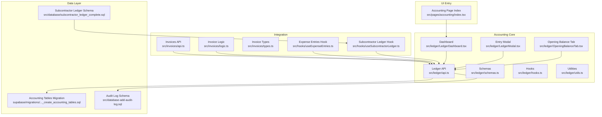
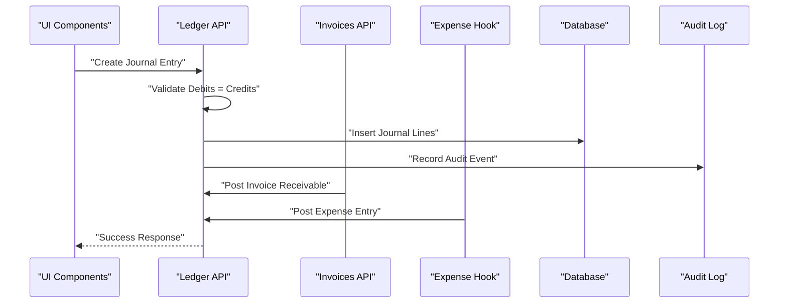
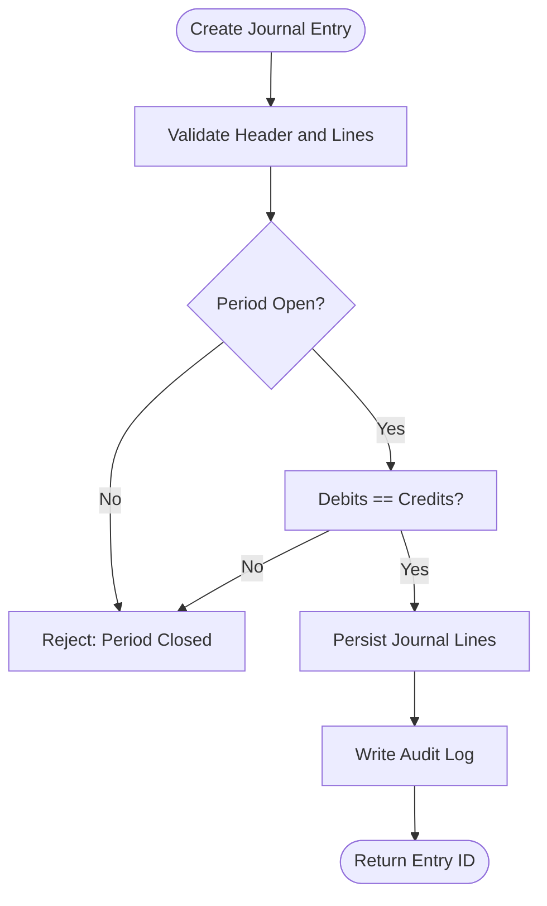
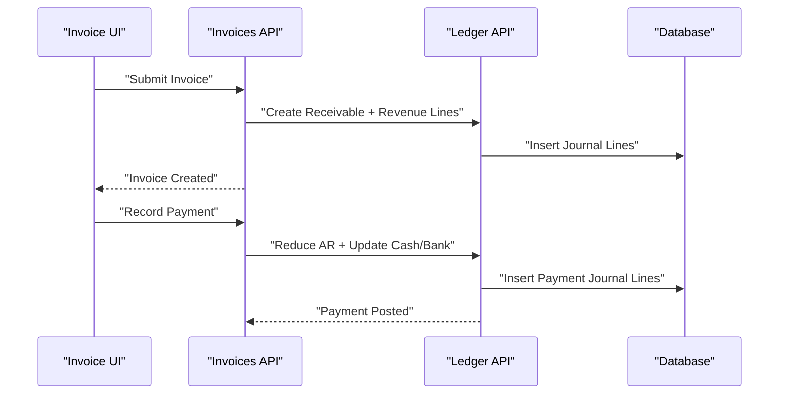
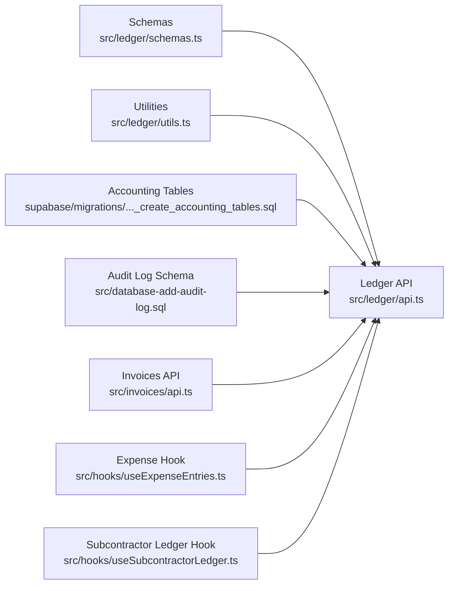

# Ledger & Accounting API

<cite>
**Referenced Files in This Document**
- [ACCOUNTING_COA_DESIGN.md](file://ACCOUNTING_COA_DESIGN.md)
- [src/ledger/api.ts](file://src/ledger/api.ts)
- [src/ledger/hooks.ts](file://src/ledger/hooks.ts)
- [src/ledger/schemas.ts](file://src/ledger/schemas.ts)
- [src/ledger/utils.ts](file://src/ledger/utils.ts)
- [src/ledger/LedgerDashboard.tsx](file://src/ledger/LedgerDashboard.tsx)
- [src/ledger/LedgerModal.tsx](file://src/ledger/LedgerModal.tsx)
- [src/ledger/OpeningBalanceTab.tsx](file://src/ledger/OpeningBalanceTab.tsx)
- [src/pages/accounting/index.tsx](file://src/pages/accounting/index.tsx)
- [src/invoices/api.ts](file://src/invoices/api.ts)
- [src/invoices/logic.ts](file://src/invoices/logic.ts)
- [src/invoices/types.ts](file://src/invoices/types.ts)
- [src/hooks/useExpenseEntries.ts](file://src/hooks/useExpenseEntries.ts)
- [src/hooks/useSubcontractorLedger.ts](file://src/hooks/useSubcontractorLedger.ts)
- [src/database/subcontractor_ledger_complete.sql](file://src/database/subcontractor_ledger_complete.sql)
- [src/database-add-audit-log.sql](file://src/database-add-audit-log.sql)
- [supabase/migrations/20240101_create_accounting_tables.sql](file://supabase/migrations/20240101_create_accounting_tables.sql)
</cite>

## Table of Contents
1. [Introduction](#introduction)
2. [Project Structure](#project-structure)
3. [Core Components](#core-components)
4. [Architecture Overview](#architecture-overview)
5. [Detailed Component Analysis](#detailed-component-analysis)
6. [Dependency Analysis](#dependency-analysis)
7. [Performance Considerations](#performance-considerations)
8. [Troubleshooting Guide](#troubleshooting-guide)
9. [Conclusion](#conclusion)
10. [Appendices](#appendices)

## Introduction
This document provides comprehensive API documentation for the ledger and accounting subsystem, focusing on:
- Chart of Accounts management
- Journal entries (double-entry bookkeeping)
- Trial balance and financial reporting
- Period closing procedures
- Integration with invoices, payments, and expense tracking
- Examples for generating financial statements and maintaining audit trails

The system follows standard double-entry principles where every transaction affects at least two accounts with equal debits and credits. Account hierarchies enable structured reporting by grouping accounts into categories such as Assets, Liabilities, Equity, Revenue, and Expenses.

## Project Structure
The ledger and accounting features are implemented across several modules:
- Core ledger APIs and utilities
- UI components for dashboard, modal entry, and opening balances
- Invoice integration points
- Expense tracking hooks
- Database migrations defining accounting tables
- Audit logging infrastructure

**Diagram sources**
- [src/ledger/api.ts](file://src/ledger/api.ts)
- [src/ledger/hooks.ts](file://src/ledger/hooks.ts)
- [src/ledger/schemas.ts](file://src/ledger/schemas.ts)
- [src/ledger/utils.ts](file://src/ledger/utils.ts)
- [src/ledger/LedgerDashboard.tsx](file://src/ledger/LedgerDashboard.tsx)
- [src/ledger/LedgerModal.tsx](file://src/ledger/LedgerModal.tsx)
- [src/ledger/OpeningBalanceTab.tsx](file://src/ledger/OpeningBalanceTab.tsx)
- [src/invoices/api.ts](file://src/invoices/api.ts)
- [src/invoices/logic.ts](file://src/invoices/logic.ts)
- [src/invoices/types.ts](file://src/invoices/types.ts)
- [src/hooks/useExpenseEntries.ts](file://src/hooks/useExpenseEntries.ts)
- [src/hooks/useSubcontractorLedger.ts](file://src/hooks/useSubcontractorLedger.ts)
- [supabase/migrations/20240101_create_accounting_tables.sql](file://supabase/migrations/20240101_create_accounting_tables.sql)
- [src/database-add-audit-log.sql](file://src/database-add-audit-log.sql)
- [src/database/subcontractor_ledger_complete.sql](file://src/database/subcontractor_ledger_complete.sql)
- [src/pages/accounting/index.tsx](file://src/pages/accounting/index.tsx)

**Section sources**
- [src/ledger/api.ts](file://src/ledger/api.ts)
- [src/ledger/hooks.ts](file://src/ledger/hooks.ts)
- [src/ledger/schemas.ts](file://src/ledger/schemas.ts)
- [src/ledger/utils.ts](file://src/ledger/utils.ts)
- [src/ledger/LedgerDashboard.tsx](file://src/ledger/LedgerDashboard.tsx)
- [src/ledger/LedgerModal.tsx](file://src/ledger/LedgerModal.tsx)
- [src/ledger/OpeningBalanceTab.tsx](file://src/ledger/OpeningBalanceTab.tsx)
- [src/invoices/api.ts](file://src/invoices/api.ts)
- [src/invoices/logic.ts](file://src/invoices/logic.ts)
- [src/invoices/types.ts](file://src/invoices/types.ts)
- [src/hooks/useExpenseEntries.ts](file://src/hooks/useExpenseEntries.ts)
- [src/hooks/useSubcontractorLedger.ts](file://src/hooks/useSubcontractorLedger.ts)
- [supabase/migrations/20240101_create_accounting_tables.sql](file://supabase/migrations/20240101_create_accounting_tables.sql)
- [src/database-add-audit-log.sql](file://src/database-add-audit-log.sql)
- [src/database/subcontractor_ledger_complete.sql](file://src/database/subcontractor_ledger_complete.sql)
- [src/pages/accounting/index.tsx](file://src/pages/accounting/index.tsx)

## Core Components
- Chart of Accounts Management
  - Create, update, and list accounts with hierarchical structure and account types.
  - Validate that postings reference valid accounts and maintain debit/credit rules.
- Journal Entries
  - Post journal lines ensuring total debits equal total credits.
  - Support multiple dimensions (e.g., project, department) for detailed reporting.
- Trial Balance
  - Aggregate account balances per period to verify equality of debits and credits.
- Financial Reporting
  - Generate Profit & Loss, Balance Sheet, and Cash Flow statements from posted entries.
- Period Closing
  - Lock periods to prevent retroactive changes; allow reversals via new entries.
- Integrations
  - Invoices generate AR receivable and revenue postings.
  - Payments reduce cash/bank and clear AR/AP.
  - Expenses post to expense accounts and reduce cash/bank or create AP.

**Section sources**
- [ACCOUNTING_COA_DESIGN.md](file://ACCOUNTING_COA_DESIGN.md)
- [src/ledger/api.ts](file://src/ledger/api.ts)
- [src/ledger/schemas.ts](file://src/ledger/schemas.ts)
- [src/ledger/utils.ts](file://src/ledger/utils.ts)
- [supabase/migrations/20240101_create_accounting_tables.sql](file://supabase/migrations/20240101_create_accounting_tables.sql)

## Architecture Overview
The accounting architecture separates concerns between UI, business logic, data access, and integrations:
- UI layer renders dashboards and entry forms.
- API layer enforces double-entry constraints and period locks.
- Data layer persists accounts, journals, trial balance snapshots, and audit logs.
- Integration layer bridges invoices, payments, and expenses to ledger postings.

**Diagram sources**
- [src/ledger/api.ts](file://src/ledger/api.ts)
- [src/invoices/api.ts](file://src/invoices/api.ts)
- [src/hooks/useExpenseEntries.ts](file://src/hooks/useExpenseEntries.ts)
- [src/database-add-audit-log.sql](file://src/database-add-audit-log.sql)

## Detailed Component Analysis

### Chart of Accounts API
- Endpoints
  - List accounts with hierarchy filters
  - Create/update account metadata and type
  - Delete or archive accounts with validation
- Constraints
  - Enforce account type semantics (Asset, Liability, Equity, Revenue, Expense)
  - Prevent deletion if linked to existing transactions
- Example usage
  - Fetch all active accounts under a parent node
  - Create a new expense account and link it to a category

**Section sources**
- [src/ledger/api.ts](file://src/ledger/api.ts)
- [src/ledger/schemas.ts](file://src/ledger/schemas.ts)
- [ACCOUNTING_COA_DESIGN.md](file://ACCOUNTING_COA_DESIGN.md)

### Journal Entries API
- Endpoints
  - Create journal entry with multiple lines
  - Retrieve entries by date range, account, or dimension
  - Reverse entries by creating reversing lines
- Business Rules
  - Sum of debits must equal sum of credits
  - Posting date must be within open periods
  - Immutable historical entries unless reversed
- Example usage
  - Post an invoice-related receivable and revenue line
  - Record a payment reducing cash and clearing AR

**Diagram sources**
- [src/ledger/api.ts](file://src/ledger/api.ts)
- [src/ledger/schemas.ts](file://src/ledger/schemas.ts)
- [src/database-add-audit-log.sql](file://src/database-add-audit-log.sql)

**Section sources**
- [src/ledger/api.ts](file://src/ledger/api.ts)
- [src/ledger/schemas.ts](file://src/ledger/schemas.ts)
- [src/ledger/utils.ts](file://src/ledger/utils.ts)

### Trial Balance API
- Endpoints
  - Compute trial balance by period
  - Export summary with account-level debits and credits
- Logic
  - Aggregates posted journal lines per account
  - Validates totals match expected zero difference within tolerance
- Example usage
  - Generate monthly trial balance for reporting

**Section sources**
- [src/ledger/api.ts](file://src/ledger/api.ts)
- [supabase/migrations/20240101_create_accounting_tables.sql](file://supabase/migrations/20240101_create_accounting_tables.sql)

### Financial Reporting API
- Endpoints
  - Profit & Loss statement by period
  - Balance Sheet snapshot as of date
  - Cash Flow statement derived from cash movements
- Logic
  - Maps accounts to report categories
  - Applies period filters and currency conversions if applicable
- Example usage
  - Generate Q1 P&L and compare to prior quarter

**Section sources**
- [src/ledger/api.ts](file://src/ledger/api.ts)
- [ACCOUNTING_COA_DESIGN.md](file://ACCOUNTING_COA_DESIGN.md)

### Period Closing Procedures
- Controls
  - Lock periods to prevent edits
  - Allow reversal entries in subsequent open periods
- Workflow
  - Close period after trial balance reconciles
  - Notify stakeholders of closed status
- Example usage
  - Close December period and confirm no further postings allowed

**Section sources**
- [src/ledger/api.ts](file://src/ledger/api.ts)
- [src/ledger/utils.ts](file://src/ledger/utils.ts)

### Integration with Invoices
- Flow
  - Invoice creation triggers AR and revenue postings
  - Payment application reduces AR and updates cash/bank
- Validation
  - Ensure invoice totals map to correct accounts
  - Maintain linkage between invoice IDs and journal entries
- Example usage
  - Post invoice and receive payment, then reconcile cleared lines

**Diagram sources**
- [src/invoices/api.ts](file://src/invoices/api.ts)
- [src/invoices/logic.ts](file://src/invoices/logic.ts)
- [src/invoices/types.ts](file://src/invoices/types.ts)
- [src/ledger/api.ts](file://src/ledger/api.ts)

**Section sources**
- [src/invoices/api.ts](file://src/invoices/api.ts)
- [src/invoices/logic.ts](file://src/invoices/logic.ts)
- [src/invoices/types.ts](file://src/invoices/types.ts)
- [src/ledger/api.ts](file://src/ledger/api.ts)

### Integration with Payments and Expense Tracking
- Payments
  - Apply payments to outstanding invoices or vendor bills
  - Reduce cash/bank and clear corresponding AR/AP
- Expenses
  - Record expense entries against expense accounts
  - Link to projects or cost centers for allocation
- Example usage
  - Pay subcontractor invoice and post expense to project cost

**Section sources**
- [src/hooks/useExpenseEntries.ts](file://src/hooks/useExpenseEntries.ts)
- [src/hooks/useSubcontractorLedger.ts](file://src/hooks/useSubcontractorLedger.ts)
- [src/database/subcontractor_ledger_complete.sql](file://src/database/subcontractor_ledger_complete.sql)

### Audit Trail Maintenance
- Requirements
  - Capture who created/modified entries and when
  - Preserve immutable history for compliance
- Implementation
  - Write audit events on journal creation and reversal
  - Provide query endpoints to retrieve audit history
- Example usage
  - Investigate changes to a specific journal entry

**Section sources**
- [src/database-add-audit-log.sql](file://src/database-add-audit-log.sql)
- [src/ledger/api.ts](file://src/ledger/api.ts)

## Dependency Analysis
The ledger module depends on:
- Schemas for input validation and response shapes
- Utilities for calculations and period checks
- Database migrations defining core accounting tables
- Audit log schema for compliance
- Integration points with invoices and expenses

**Diagram sources**
- [src/ledger/schemas.ts](file://src/ledger/schemas.ts)
- [src/ledger/utils.ts](file://src/ledger/utils.ts)
- [src/ledger/api.ts](file://src/ledger/api.ts)
- [supabase/migrations/20240101_create_accounting_tables.sql](file://supabase/migrations/20240101_create_accounting_tables.sql)
- [src/database-add-audit-log.sql](file://src/database-add-audit-log.sql)
- [src/invoices/api.ts](file://src/invoices/api.ts)
- [src/hooks/useExpenseEntries.ts](file://src/hooks/useExpenseEntries.ts)
- [src/hooks/useSubcontractorLedger.ts](file://src/hooks/useSubcontractorLedger.ts)

**Section sources**
- [src/ledger/schemas.ts](file://src/ledger/schemas.ts)
- [src/ledger/utils.ts](file://src/ledger/utils.ts)
- [src/ledger/api.ts](file://src/ledger/api.ts)
- [supabase/migrations/20240101_create_accounting_tables.sql](file://supabase/migrations/20240101_create_accounting_tables.sql)
- [src/database-add-audit-log.sql](file://src/database-add-audit-log.sql)
- [src/invoices/api.ts](file://src/invoices/api.ts)
- [src/hooks/useExpenseEntries.ts](file://src/hooks/useExpenseEntries.ts)
- [src/hooks/useSubcontractorLedger.ts](file://src/hooks/useSubcontractorLedger.ts)

## Performance Considerations
- Use pagination and filtering for large journal datasets
- Precompute trial balance snapshots for faster reporting
- Index frequently queried columns (date, account_id, period)
- Batch write operations for bulk imports
- Avoid deep recursion in account hierarchy traversal; prefer iterative approaches

[No sources needed since this section provides general guidance]

## Troubleshooting Guide
Common issues and resolutions:
- Debit/Credit mismatch
  - Verify each journal line’s amount and direction
  - Ensure totals balance before submission
- Period closed errors
  - Confirm posting date falls within open periods
  - Use reversal entries for corrections in subsequent periods
- Missing account references
  - Validate account existence and active status
  - Check account type compatibility with transaction nature
- Audit trail gaps
  - Ensure audit events are written on all mutations
  - Review permissions and RLS policies if events are missing

**Section sources**
- [src/ledger/api.ts](file://src/ledger/api.ts)
- [src/ledger/schemas.ts](file://src/ledger/schemas.ts)
- [src/database-add-audit-log.sql](file://src/database-add-audit-log.sql)

## Conclusion
The ledger and accounting subsystem implements robust double-entry bookkeeping with strong validation, auditability, and integration points for invoices, payments, and expenses. By adhering to chart of accounts design principles, enforcing period controls, and providing reliable reporting endpoints, the system supports accurate financial statements and compliance requirements.

[No sources needed since this section summarizes without analyzing specific files]

## Appendices

### Double-Entry Bookkeeping Principles
- Every transaction has equal debits and credits
- Accounts are grouped into categories (Assets, Liabilities, Equity, Revenue, Expenses)
- Transactions affect accounts according to their type and normal balance

**Section sources**
- [ACCOUNTING_COA_DESIGN.md](file://ACCOUNTING_COA_DESIGN.md)

### Account Hierarchies
- Parent-child relationships enable drill-down reporting
- Leaf accounts hold transactional balances; parents aggregate children
- Hierarchy aids in constructing financial statements

**Section sources**
- [ACCOUNTING_COA_DESIGN.md](file://ACCOUNTING_COA_DESIGN.md)

### Period Closing Procedures
- Lock periods after reconciliation
- Allow reversals only in open periods
- Maintain audit trail for all closures and adjustments

**Section sources**
- [src/ledger/api.ts](file://src/ledger/api.ts)
- [src/ledger/utils.ts](file://src/ledger/utils.ts)

### Examples for Financial Statement Generation
- Profit & Loss
  - Filter revenue and expense accounts by period
  - Sum amounts and present by category
- Balance Sheet
  - Snapshot assets, liabilities, and equity as of date
  - Ensure accounting equation holds
- Cash Flow
  - Derive cash movements from cash/bank postings and related accounts

**Section sources**
- [src/ledger/api.ts](file://src/ledger/api.ts)
- [ACCOUNTING_COA_DESIGN.md](file://ACCOUNTING_COA_DESIGN.md)

### Examples for Audit Trail Maintenance
- Record creation, modification, and reversal events
- Include user identity, timestamp, and affected entities
- Provide query endpoints to retrieve full history

**Section sources**
- [src/database-add-audit-log.sql](file://src/database-add-audit-log.sql)
- [src/ledger/api.ts](file://src/ledger/api.ts)