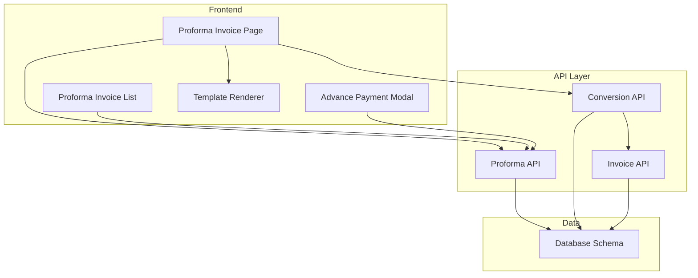
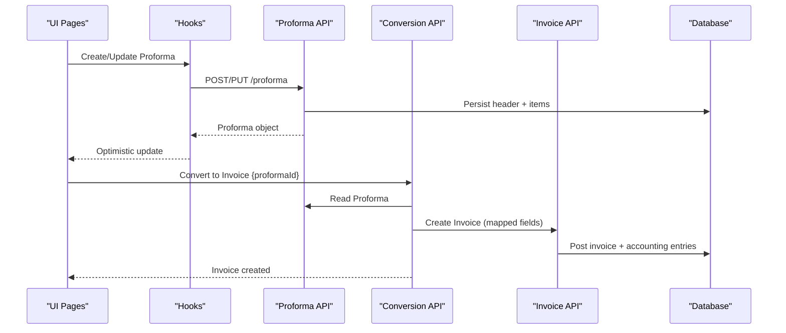
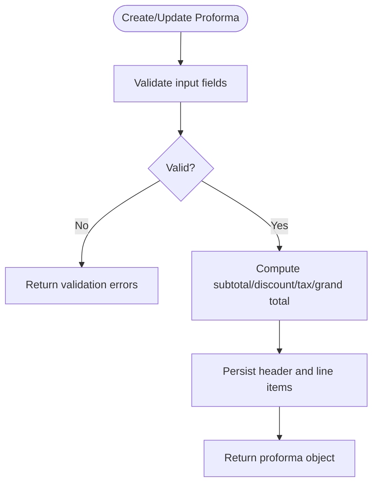
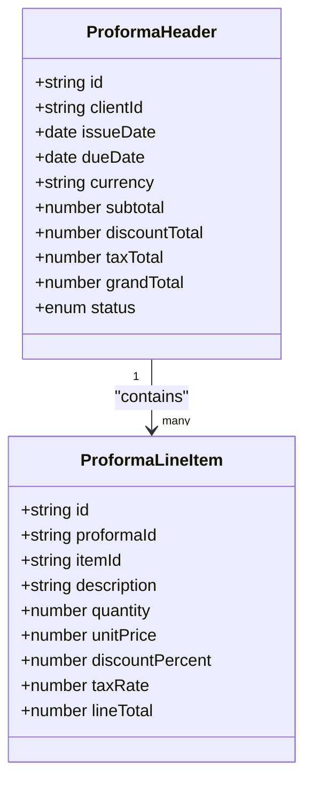
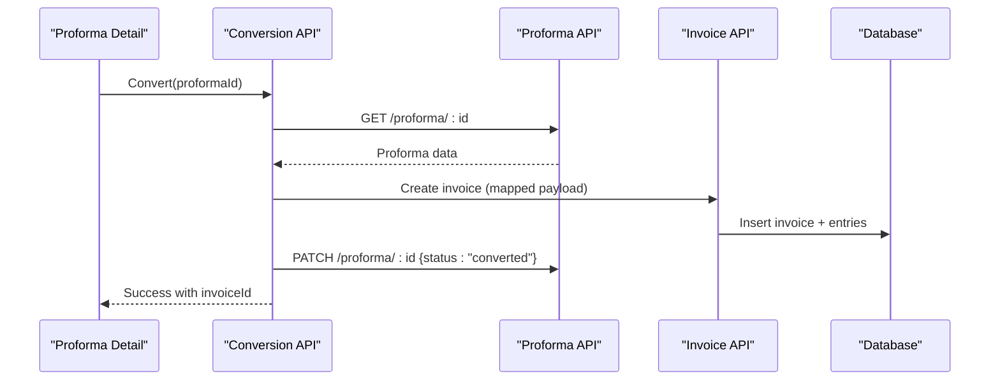
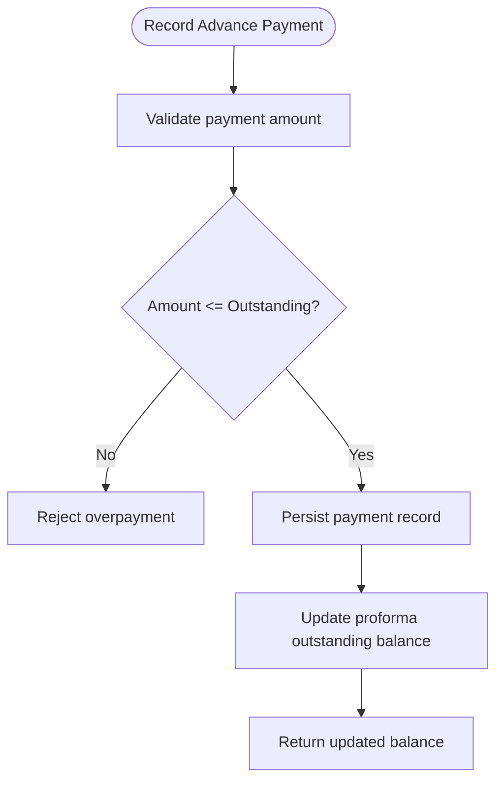
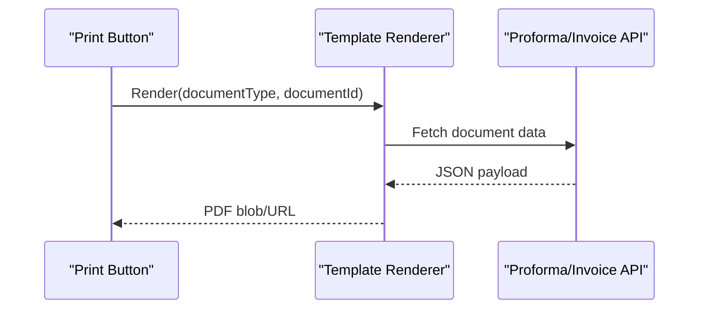
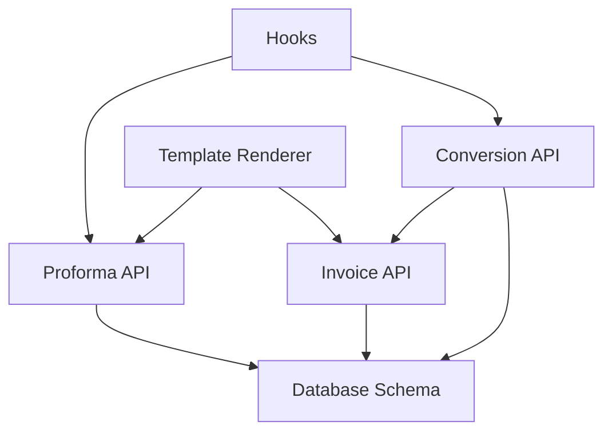

# Proforma Invoices API

<cite>
**Referenced Files in This Document**
- [proforma-invoices.ts](file://src/proforma-invoices/api.ts)
- [useProformaInvoices.ts](file://src/proforma-invoices/hooks.ts)
- [proforma-types.ts](file://src/proforma-invoices/types.ts)
- [database-proforma-invoices.sql](file://src/database-proforma-invoices.sql)
- [proforma-page.tsx](file://src/pages/ProformaInvoicePage.tsx)
- [proforma-list.tsx](file://src/pages/ProformaInvoiceList.tsx)
- [conversion-api.ts](file://src/conversions/api.ts)
- [invoice-api.ts](file://src/invoices/api.ts)
- [advance-payment-modal.tsx](file://src/components/AdvancePaymentModal.tsx)
- [template-renderer.tsx](file://src/pdf/template-renderer.tsx)
</cite>

## Table of Contents
1. [Introduction](#introduction)
2. [Project Structure](#project-structure)
3. [Core Components](#core-components)
4. [Architecture Overview](#architecture-overview)
5. [Detailed Component Analysis](#detailed-component-analysis)
6. [Dependency Analysis](#dependency-analysis)
7. [Performance Considerations](#performance-considerations)
8. [Troubleshooting Guide](#troubleshooting-guide)
9. [Conclusion](#conclusion)

## Introduction
This document provides detailed API documentation for proforma invoice management, including creation, modification, conversion to formal invoices, and advance payment handling. It also covers item management, pricing calculations, template rendering, and the end-to-end workflow from proforma to invoice with financial adjustments. Examples are provided for advance payment scenarios and contract-based billing processes.

## Project Structure
The proforma invoice feature is implemented across dedicated modules:
- API layer for CRUD and conversion operations
- Hooks for client-side data fetching and mutations
- Types for request/response schemas
- Database schema definitions
- UI pages for listing and editing proforma invoices
- Conversion utilities linking proforma to invoices
- Template rendering for PDF generation

**Diagram sources**
- [proforma-page.tsx](file://src/pages/ProformaInvoicePage.tsx)
- [proforma-list.tsx](file://src/pages/ProformaInvoiceList.tsx)
- [advance-payment-modal.tsx](file://src/components/AdvancePaymentModal.tsx)
- [template-renderer.tsx](file://src/pdf/template-renderer.tsx)
- [proforma-invoices.ts](file://src/proforma-invoices/api.ts)
- [conversion-api.ts](file://src/conversions/api.ts)
- [invoice-api.ts](file://src/invoices/api.ts)
- [database-proforma-invoices.sql](file://src/database-proforma-invoices.sql)

**Section sources**
- [proforma-invoices.ts](file://src/proforma-invoices/api.ts)
- [useProformaInvoices.ts](file://src/proforma-invoices/hooks.ts)
- [proforma-types.ts](file://src/proforma-invoices/types.ts)
- [database-proforma-invoices.sql](file://src/database-proforma-invoices.sql)
- [proforma-page.tsx](file://src/pages/ProformaInvoicePage.tsx)
- [proforma-list.tsx](file://src/pages/ProformaInvoiceList.tsx)
- [conversion-api.ts](file://src/conversions/api.ts)
- [invoice-api.ts](file://src/invoices/api.ts)
- [advance-payment-modal.tsx](file://src/components/AdvancePaymentModal.tsx)
- [template-renderer.tsx](file://src/pdf/template-renderer.tsx)

## Core Components
- Proforma API module: exposes endpoints for creating, updating, deleting, and converting proforma invoices; supports item-level operations and totals calculation.
- Hooks: provide typed queries and mutations for efficient state synchronization and optimistic updates.
- Types: define request/response shapes, validation rules, and enums for statuses and tax configurations.
- Database schema: defines tables for proforma headers, line items, payments, and audit fields.
- UI pages: list view for browsing and filtering; edit/create page for building documents.
- Conversion API: orchestrates transformation from proforma to invoice, applying taxes, discounts, and currency conversions.
- Invoice API: creates final invoices and posts accounting entries.
- Advance payment modal: captures partial payments against a proforma and tracks remaining balance.
- Template renderer: generates printable PDFs using configured templates.

**Section sources**
- [proforma-invoices.ts](file://src/proforma-invoices/api.ts)
- [useProformaInvoices.ts](file://src/proforma-invoices/hooks.ts)
- [proforma-types.ts](file://src/proforma-invoices/types.ts)
- [database-proforma-invoices.sql](file://src/database-proforma-invoices.sql)
- [proforma-page.tsx](file://src/pages/ProformaInvoicePage.tsx)
- [proforma-list.tsx](file://src/pages/ProformaInvoiceList.tsx)
- [conversion-api.ts](file://src/conversions/api.ts)
- [invoice-api.ts](file://src/invoices/api.ts)
- [advance-payment-modal.tsx](file://src/components/AdvancePaymentModal.tsx)
- [template-renderer.tsx](file://src/pdf/template-renderer.tsx)

## Architecture Overview
The system follows a layered architecture:
- Presentation layer (pages and modals) interacts with hooks for data access.
- API layer encapsulates business logic and persistence calls.
- Data layer persists entities and maintains referential integrity.
- Conversion pipeline transforms proforma into invoice with financial adjustments.
- Rendering pipeline produces PDF outputs based on templates.

**Diagram sources**
- [proforma-page.tsx](file://src/pages/ProformaInvoicePage.tsx)
- [useProformaInvoices.ts](file://src/proforma-invoices/hooks.ts)
- [proforma-invoices.ts](file://src/proforma-invoices/api.ts)
- [conversion-api.ts](file://src/conversions/api.ts)
- [invoice-api.ts](file://src/invoices/api.ts)
- [database-proforma-invoices.sql](file://src/database-proforma-invoices.sql)

## Detailed Component Analysis

### Proforma Creation and Modification
- Endpoints:
  - Create proforma: POST /proforma
  - Update proforma: PUT /proforma/:id
  - Delete proforma: DELETE /proforma/:id
  - Get proforma: GET /proforma/:id
  - List proformas: GET /proforma?filters
- Request body includes:
  - Header metadata (client, project, dates, currency, terms)
  - Line items (item id, description, qty, unit price, discount, tax rate)
  - Totals computed server-side (subtotal, discount total, tax total, grand total)
- Validation:
  - Required fields enforced at API layer
  - Numeric precision handled consistently
- Response:
  - Full proforma object with computed totals and status

**Diagram sources**
- [proforma-invoices.ts](file://src/proforma-invoices/api.ts)
- [proforma-types.ts](file://src/proforma-invoices/types.ts)

**Section sources**
- [proforma-invoices.ts](file://src/proforma-invoices/api.ts)
- [proforma-types.ts](file://src/proforma-invoices/types.ts)

### Item Management
- Operations:
  - Add item: include in line items array or via dedicated endpoint if supported
  - Remove item: delete by line item id
  - Update item: modify quantity, price, discount, tax
- Pricing:
  - Unit price multiplied by quantity yields line total
  - Discount applied per line or globally
  - Tax calculated on taxable amount after discount
- Inventory linkage:
  - Optional stock reservation when converting to invoice (if enabled)

**Diagram sources**
- [proforma-types.ts](file://src/proforma-invoices/types.ts)
- [database-proforma-invoices.sql](file://src/database-proforma-invoices.sql)

**Section sources**
- [proforma-types.ts](file://src/proforma-invoices/types.ts)
- [database-proforma-invoices.sql](file://src/database-proforma-invoices.sql)

### Conversion Workflow: Proforma to Invoice
- Trigger:
  - User initiates conversion from proforma detail page
- Steps:
  - Read proforma header and items
  - Map fields to invoice schema
  - Apply current tax rules and currency conversion if needed
  - Create invoice record and related accounting entries
  - Update proforma status to converted
- Financial adjustments:
  - Discounts and taxes reflected in invoice totals
  - Advance payments offset invoice balance
  - Audit trail maintained for traceability

**Diagram sources**
- [conversion-api.ts](file://src/conversions/api.ts)
- [proforma-invoices.ts](file://src/proforma-invoices/api.ts)
- [invoice-api.ts](file://src/invoices/api.ts)
- [database-proforma-invoices.sql](file://src/database-proforma-invoices.sql)

**Section sources**
- [conversion-api.ts](file://src/conversions/api.ts)
- [invoice-api.ts](file://src/invoices/api.ts)
- [proforma-invoices.ts](file://src/proforma-invoices/api.ts)

### Advance Payment Handling
- Purpose:
  - Record partial payments against a proforma before conversion
- Operations:
  - Create advance payment: POST /proforma/:id/payments
  - List payments: GET /proforma/:id/payments
  - Update payment: PUT /proforma/payments/:paymentId
  - Delete payment: DELETE /proforma/payments/:paymentId
- Balance calculation:
  - Remaining balance = Grand total - Sum of advance payments
- Conversion impact:
  - Converted invoice reflects paid amount and outstanding balance

**Diagram sources**
- [advance-payment-modal.tsx](file://src/components/AdvancePaymentModal.tsx)
- [proforma-invoices.ts](file://src/proforma-invoices/api.ts)

**Section sources**
- [advance-payment-modal.tsx](file://src/components/AdvancePaymentModal.tsx)
- [proforma-invoices.ts](file://src/proforma-invoices/api.ts)

### Template Rendering
- Functionality:
  - Generate PDF from proforma or invoice using configured HTML/CSS templates
- Inputs:
  - Document data (header, items, totals, client info)
  - Template selection and customization options
- Outputs:
  - Printable PDF stream or URL

**Diagram sources**
- [template-renderer.tsx](file://src/pdf/template-renderer.tsx)
- [proforma-invoices.ts](file://src/proforma-invoices/api.ts)
- [invoice-api.ts](file://src/invoices/api.ts)

**Section sources**
- [template-renderer.tsx](file://src/pdf/template-renderer.tsx)
- [proforma-invoices.ts](file://src/proforma-invoices/api.ts)
- [invoice-api.ts](file://src/invoices/api.ts)

### Examples

#### Example: Create Proforma with Items
- Endpoint: POST /proforma
- Payload includes:
  - Client identifier, issue date, due date, currency
  - Array of line items with quantities, prices, discounts, tax rates
- Server computes totals and returns full proforma object

**Section sources**
- [proforma-invoices.ts](file://src/proforma-invoices/api.ts)
- [proforma-types.ts](file://src/proforma-invoices/types.ts)

#### Example: Convert Proforma to Invoice
- Endpoint: POST /convert/proforma/:id/to-invoice
- Behavior:
  - Maps proforma fields to invoice schema
  - Creates invoice and accounting entries
  - Updates proforma status to converted
- Response includes new invoice identifier

**Section sources**
- [conversion-api.ts](file://src/conversions/api.ts)
- [invoice-api.ts](file://src/invoices/api.ts)

#### Example: Record Advance Payment
- Endpoint: POST /proforma/:id/payments
- Payload includes:
  - Payment amount, date, reference number
- Server validates against outstanding balance and updates records

**Section sources**
- [advance-payment-modal.tsx](file://src/components/AdvancePaymentModal.tsx)
- [proforma-invoices.ts](file://src/proforma-invoices/api.ts)

#### Example: Contract-Based Billing Process
- Steps:
  - Create proforma aligned with contract milestones
  - Record advance payments per milestone
  - Convert proforma to invoice upon milestone completion
  - Render invoice PDF for client delivery
- Notes:
  - Ensure milestone dates and amounts match contract terms
  - Maintain audit trail for compliance

**Section sources**
- [proforma-page.tsx](file://src/pages/ProformaInvoicePage.tsx)
- [conversion-api.ts](file://src/conversions/api.ts)
- [template-renderer.tsx](file://src/pdf/template-renderer.tsx)

## Dependency Analysis
- Frontend components depend on hooks for data operations.
- Hooks call API endpoints defined in the proforma module.
- Conversion API depends on both proforma and invoice APIs.
- Template renderer depends on document data fetched via APIs.
- Database schema underpins all entities and relationships.

**Diagram sources**
- [useProformaInvoices.ts](file://src/proforma-invoices/hooks.ts)
- [proforma-invoices.ts](file://src/proforma-invoices/api.ts)
- [conversion-api.ts](file://src/conversions/api.ts)
- [invoice-api.ts](file://src/invoices/api.ts)
- [template-renderer.tsx](file://src/pdf/template-renderer.tsx)
- [database-proforma-invoices.sql](file://src/database-proforma-invoices.sql)

**Section sources**
- [useProformaInvoices.ts](file://src/proforma-invoices/hooks.ts)
- [proforma-invoices.ts](file://src/proforma-invoices/api.ts)
- [conversion-api.ts](file://src/conversions/api.ts)
- [invoice-api.ts](file://src/invoices/api.ts)
- [template-renderer.tsx](file://src/pdf/template-renderer.tsx)
- [database-proforma-invoices.sql](file://src/database-proforma-invoices.sql)

## Performance Considerations
- Use pagination and filters for listing proformas to reduce payload size.
- Prefer server-side computation of totals to avoid client rounding discrepancies.
- Cache frequently accessed templates to speed up PDF generation.
- Batch updates where possible to minimize network round-trips.
- Optimize database indexes on foreign keys and commonly filtered columns.

[No sources needed since this section provides general guidance]

## Troubleshooting Guide
- Common issues:
  - Validation errors: ensure required fields and numeric formats are correct.
  - Overpayment rejection: verify outstanding balance before recording payments.
  - Conversion failures: check that proforma status allows conversion and mapping fields exist.
  - Template rendering errors: confirm template availability and valid placeholders.
- Debugging tips:
  - Inspect API responses for error messages and stack traces.
  - Verify database constraints and referential integrity.
  - Review audit logs for conversion and payment actions.

**Section sources**
- [proforma-invoices.ts](file://src/proforma-invoices/api.ts)
- [conversion-api.ts](file://src/conversions/api.ts)
- [advance-payment-modal.tsx](file://src/components/AdvancePaymentModal.tsx)
- [template-renderer.tsx](file://src/pdf/template-renderer.tsx)

## Conclusion
The proforma invoice API provides robust capabilities for creating, modifying, and converting proforma documents to invoices, along with advance payment tracking and template-based PDF rendering. The layered architecture ensures clear separation of concerns, while the conversion pipeline guarantees accurate financial adjustments and auditability. Following the examples and guidelines will help implement reliable contract-based billing workflows.