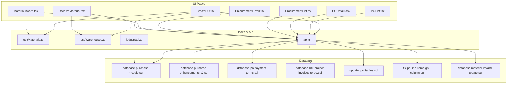
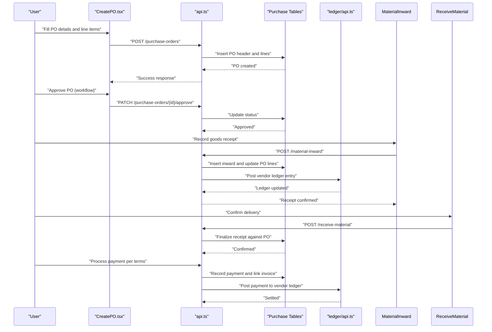
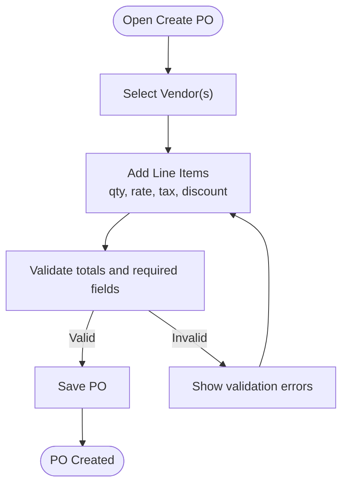
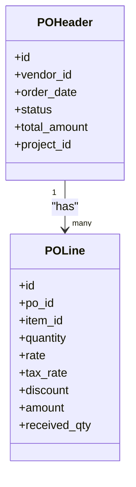
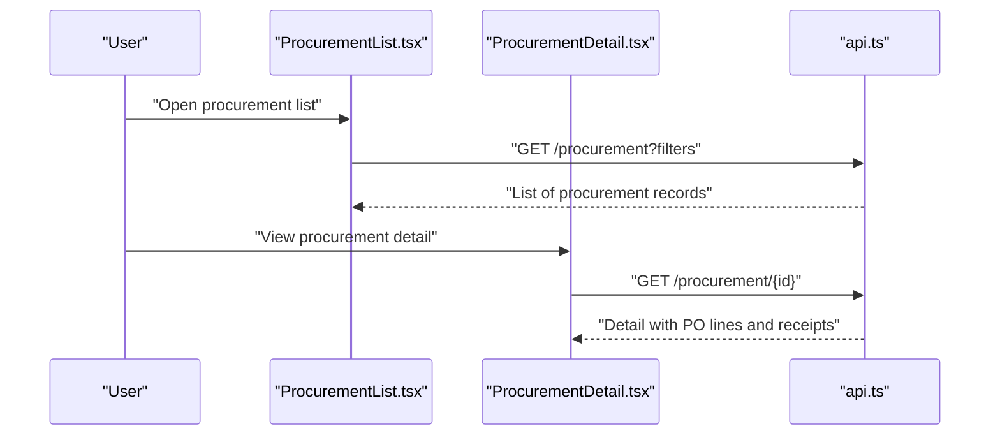
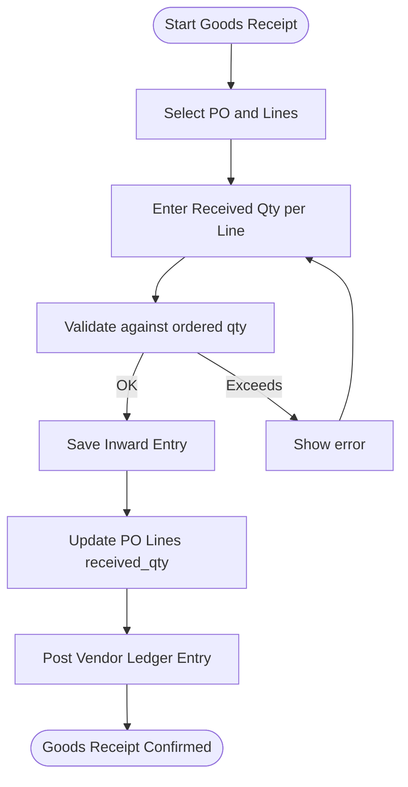
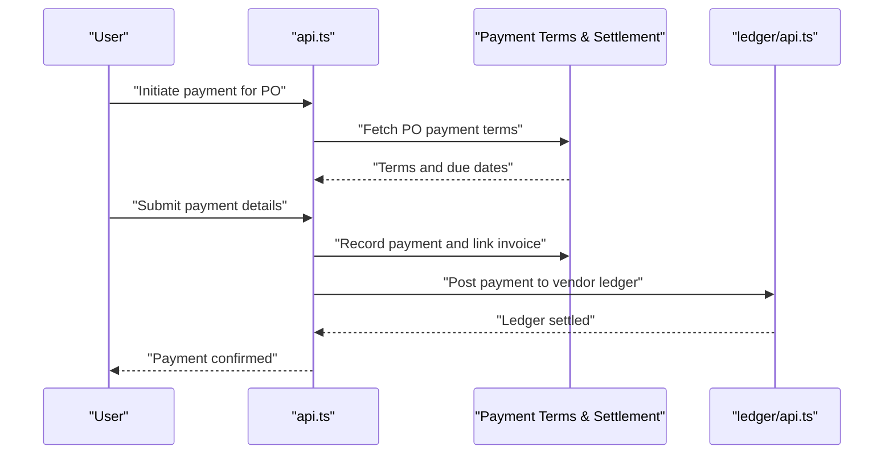
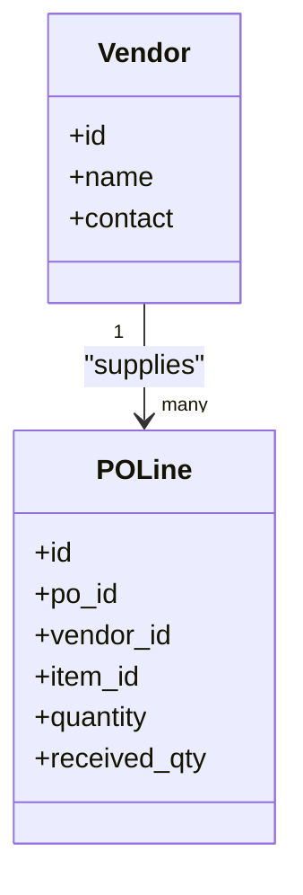
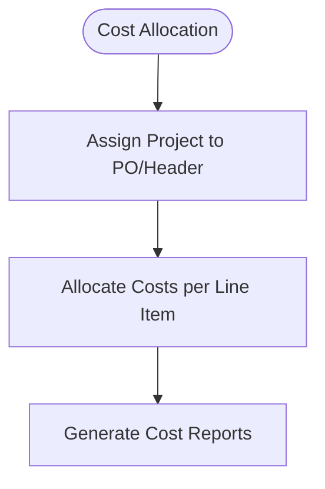
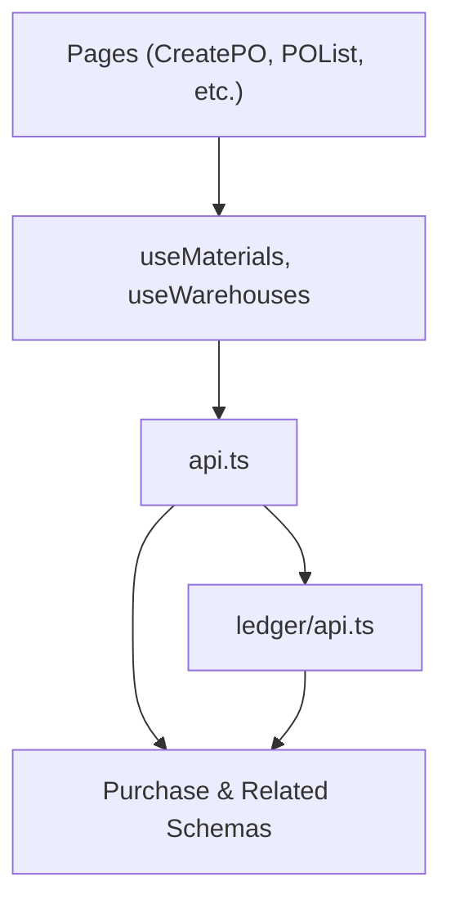

# Purchase Orders API

<cite>
**Referenced Files in This Document**
- [CreatePO.tsx](file://src/pages/CreatePO.tsx)
- [POList.tsx](file://src/pages/POList.tsx)
- [PODetails.tsx](file://src/pages/PODetails.tsx)
- [ProcurementList.tsx](file://src/pages/ProcurementList.tsx)
- [ProcurementDetail.tsx](file://src/pages/ProcurementDetail.tsx)
- [MaterialInward.tsx](file://src/pages/MaterialInward.tsx)
- [ReceiveMaterial.tsx](file://src/pages/ReceiveMaterial.tsx)
- [SubcontractorLedger.tsx](file://src/components/SubcontractorLedger.tsx)
- [ledger/api.ts](file://src/ledger/api.ts)
- [database-purchase-module.sql](file://src/database-purchase-module.sql)
- [database-purchase-enhancements-v2.sql](file://src/database-purchase-enhancements-v2.sql)
- [database-po-payment-terms.sql](file://src/database-po-payment-terms.sql)
- [database-link-project-invoices-to-po.sql](file://src/database-link-project-invoices-to-po.sql)
- [update_po_tables.sql](file://update_po_tables.sql)
- [fix-po-line-items-gst-column.sql](file://src/fix-po-line-items-gst-column.sql)
- [database-material-inward-update.sql](file://src/database-material-inward-update.sql)
- [api.ts](file://src/api.ts)
- [useMaterials.ts](file://src/hooks/useMaterials.ts)
- [useWarehouses.ts](file://src/hooks/useWarehouses.ts)
</cite>

## Table of Contents
1. [Introduction](#introduction)
2. [Project Structure](#project-structure)
3. [Core Components](#core-components)
4. [Architecture Overview](#architecture-overview)
5. [Detailed Component Analysis](#detailed-component-analysis)
6. [Dependency Analysis](#dependency-analysis)
7. [Performance Considerations](#performance-considerations)
8. [Troubleshooting Guide](#troubleshooting-guide)
9. [Conclusion](#conclusion)
10. [Appendices](#appendices)

## Introduction
This document provides detailed API documentation for purchase order management within the application. It covers PO creation, vendor selection, item procurement, approval workflows, goods receipt integration, payment processing, and vendor ledger updates. It also explains multi-vendor orders, partial deliveries, and cost allocation, with examples for complete procurement cycles from requisition to payment settlement.

## Project Structure
The purchase order functionality spans UI pages, hooks, database schemas, and SQL migrations:
- Pages: Create, list, view, and detail screens for POs and procurement; material inward and receiving flows.
- Hooks: Data access for materials and warehouses used by PO creation and goods receipt.
- Database: Core tables and enhancements for POs, payments, and inbound materials.
- Utilities: Ledger APIs and shared API clients.

**Diagram sources**
- [CreatePO.tsx](file://src/pages/CreatePO.tsx)
- [POList.tsx](file://src/pages/POList.tsx)
- [PODetails.tsx](file://src/pages/PODetails.tsx)
- [ProcurementList.tsx](file://src/pages/ProcurementList.tsx)
- [ProcurementDetail.tsx](file://src/pages/ProcurementDetail.tsx)
- [MaterialInward.tsx](file://src/pages/MaterialInward.tsx)
- [ReceiveMaterial.tsx](file://src/pages/ReceiveMaterial.tsx)
- [useMaterials.ts](file://src/hooks/useMaterials.ts)
- [useWarehouses.ts](file://src/hooks/useWarehouses.ts)
- [api.ts](file://src/api.ts)
- [database-purchase-module.sql](file://src/database-purchase-module.sql)
- [database-purchase-enhancements-v2.sql](file://src/database-purchase-enhancements-v2.sql)
- [database-po-payment-terms.sql](file://src/database-po-payment-terms.sql)
- [database-link-project-invoices-to-po.sql](file://src/database-link-project-invoices-to-po.sql)
- [update_po_tables.sql](file://update_po_tables.sql)
- [fix-po-line-items-gst-column.sql](file://src/fix-po-line-items-gst-column.sql)
- [database-material-inward-update.sql](file://src/database-material-inward-update.sql)

**Section sources**
- [CreatePO.tsx](file://src/pages/CreatePO.tsx)
- [POList.tsx](file://src/pages/POList.tsx)
- [PODetails.tsx](file://src/pages/PODetails.tsx)
- [ProcurementList.tsx](file://src/pages/ProcurementList.tsx)
- [ProcurementDetail.tsx](file://src/pages/ProcurementDetail.tsx)
- [MaterialInward.tsx](file://src/pages/MaterialInward.tsx)
- [ReceiveMaterial.tsx](file://src/pages/ReceiveMaterial.tsx)
- [useMaterials.ts](file://src/hooks/useMaterials.ts)
- [useWarehouses.ts](file://src/hooks/useWarehouses.ts)
- [api.ts](file://src/api.ts)
- [database-purchase-module.sql](file://src/database-purchase-module.sql)
- [database-purchase-enhancements-v2.sql](file://src/database-purchase-enhancements-v2.sql)
- [database-po-payment-terms.sql](file://src/database-po-payment-terms.sql)
- [database-link-project-invoices-to-po.sql](file://src/database-link-project-invoices-to-po.sql)
- [update_po_tables.sql](file://update_po_tables.sql)
- [fix-po-line-items-gst-column.sql](file://src/fix-po-line-items-gst-column.sql)
- [database-material-inward-update.sql](file://src/database-material-inward-update.sql)

## Core Components
- PO Creation: UI-driven creation with vendor selection, line items, taxes, and terms.
- PO Listing and Detail: Browse, filter, and inspect POs and their lines.
- Procurement Tracking: List and drill into procurement records linked to POs.
- Goods Receipt: Material inward and receiving flows tied to PO lines.
- Payment Processing: PO payment terms and settlement linkage to invoices.
- Vendor Ledger Updates: Post-receipt and post-payment ledger entries via ledger API.

Key data models (from schema files):
- Purchase Order header and lines
- Vendor master and mappings
- Material inward and receipts
- Payment terms and settlement records
- Linkage to projects and invoices

**Section sources**
- [CreatePO.tsx](file://src/pages/CreatePO.tsx)
- [POList.tsx](file://src/pages/POList.tsx)
- [PODetails.tsx](file://src/pages/PODetails.tsx)
- [ProcurementList.tsx](file://src/pages/ProcurementList.tsx)
- [ProcurementDetail.tsx](file://src/pages/ProcurementDetail.tsx)
- [MaterialInward.tsx](file://src/pages/MaterialInward.tsx)
- [ReceiveMaterial.tsx](file://src/pages/ReceiveMaterial.tsx)
- [database-purchase-module.sql](file://src/database-purchase-module.sql)
- [database-purchase-enhancements-v2.sql](file://src/database-purchase-enhancements-v2.sql)
- [database-po-payment-terms.sql](file://src/database-po-payment-terms.sql)
- [database-link-project-invoices-to-po.sql](file://src/database-link-project-invoices-to-po.sql)

## Architecture Overview
The system follows a layered approach:
- UI layer: Pages orchestrate user interactions and form handling.
- Data layer: Hooks and API client fetch/persist data.
- Persistence: SQL schemas define entities and relationships.
- Integrations: Ledger API updates vendor balances upon goods receipt and payments.

**Diagram sources**
- [CreatePO.tsx](file://src/pages/CreatePO.tsx)
- [MaterialInward.tsx](file://src/pages/MaterialInward.tsx)
- [ReceiveMaterial.tsx](file://src/pages/ReceiveMaterial.tsx)
- [api.ts](file://src/api.ts)
- [ledger/api.ts](file://src/ledger/api.ts)
- [database-purchase-module.sql](file://src/database-purchase-module.sql)
- [database-material-inward-update.sql](file://src/database-material-inward-update.sql)

## Detailed Component Analysis

### PO Creation and Vendor Selection
- Purpose: Capture PO header (vendor, dates, terms), select one or more vendors across lines, add items with quantities, rates, taxes, and project allocations.
- Key behaviors:
  - Vendor selection supports multiple vendors per PO through line-level mapping.
  - Line items include unit pricing, GST fields, discounts, and cost centers.
  - Validation ensures required fields and consistent totals.
- Integration points:
  - Fetches materials and warehouses via hooks.
  - Persists via API client.

**Diagram sources**
- [CreatePO.tsx](file://src/pages/CreatePO.tsx)
- [useMaterials.ts](file://src/hooks/useMaterials.ts)
- [useWarehouses.ts](file://src/hooks/useWarehouses.ts)
- [api.ts](file://src/api.ts)

**Section sources**
- [CreatePO.tsx](file://src/pages/CreatePO.tsx)
- [useMaterials.ts](file://src/hooks/useMaterials.ts)
- [useWarehouses.ts](file://src/hooks/useWarehouses.ts)
- [api.ts](file://src/api.ts)
- [database-purchase-module.sql](file://src/database-purchase-module.sql)
- [fix-po-line-items-gst-column.sql](file://src/fix-po-line-items-gst-column.sql)

### PO Listing and Detail Views
- Purpose: Browse all POs, filter by status/vendor/project, and view detailed line items and history.
- Features:
  - Status tracking (draft, approved, received, closed).
  - Drill-down to procurement detail and goods receipt status.

**Diagram sources**
- [POList.tsx](file://src/pages/POList.tsx)
- [PODetails.tsx](file://src/pages/PODetails.tsx)
- [database-purchase-module.sql](file://src/database-purchase-module.sql)

**Section sources**
- [POList.tsx](file://src/pages/POList.tsx)
- [PODetails.tsx](file://src/pages/PODetails.tsx)

### Procurement Tracking
- Purpose: Track procurement activities linked to POs, including partial deliveries and multi-vendor fulfillment.
- Capabilities:
  - List procurement records with filters.
  - Detail view shows receipt progress and vendor splits.

**Diagram sources**
- [ProcurementList.tsx](file://src/pages/ProcurementList.tsx)
- [ProcurementDetail.tsx](file://src/pages/ProcurementDetail.tsx)
- [api.ts](file://src/api.ts)

**Section sources**
- [ProcurementList.tsx](file://src/pages/ProcurementList.tsx)
- [ProcurementDetail.tsx](file://src/pages/ProcurementDetail.tsx)
- [api.ts](file://src/api.ts)

### Goods Receipt Integration
- Purpose: Record material inward and confirm receipts against PO lines, supporting partial deliveries.
- Workflow:
  - Create inward entries referencing PO lines.
  - Update PO line received quantities.
  - Post vendor ledger entries for goods received.

**Diagram sources**
- [MaterialInward.tsx](file://src/pages/MaterialInward.tsx)
- [ReceiveMaterial.tsx](file://src/pages/ReceiveMaterial.tsx)
- [api.ts](file://src/api.ts)
- [database-material-inward-update.sql](file://src/database-material-inward-update.sql)

**Section sources**
- [MaterialInward.tsx](file://src/pages/MaterialInward.tsx)
- [ReceiveMaterial.tsx](file://src/pages/ReceiveMaterial.tsx)
- [api.ts](file://src/api.ts)
- [database-material-inward-update.sql](file://src/database-material-inward-update.sql)

### Payment Processing and Vendor Ledger Updates
- Purpose: Process payments based on PO payment terms and update vendor ledgers.
- Flow:
  - Retrieve PO payment terms.
  - Create payment entries and link to invoices.
  - Post ledger updates reflecting settlements.

**Diagram sources**
- [database-po-payment-terms.sql](file://src/database-po-payment-terms.sql)
- [database-link-project-invoices-to-po.sql](file://src/database-link-project-invoices-to-po.sql)
- [api.ts](file://src/api.ts)
- [ledger/api.ts](file://src/ledger/api.ts)

**Section sources**
- [database-po-payment-terms.sql](file://src/database-po-payment-terms.sql)
- [database-link-project-invoices-to-po.sql](file://src/database-link-project-invoices-to-po.sql)
- [api.ts](file://src/api.ts)
- [ledger/api.ts](file://src/ledger/api.ts)

### Multi-Vendor Orders and Partial Deliveries
- Multi-vendor:
  - Each PO line can be assigned to a specific vendor, enabling split orders within a single PO.
- Partial deliveries:
  - Goods receipt allows entering received quantities less than ordered.
  - Remaining quantities stay open until fully delivered.

**Diagram sources**
- [database-purchase-module.sql](file://src/database-purchase-module.sql)
- [database-purchase-enhancements-v2.sql](file://src/database-purchase-enhancements-v2.sql)

**Section sources**
- [database-purchase-module.sql](file://src/database-purchase-module.sql)
- [database-purchase-enhancements-v2.sql](file://src/database-purchase-enhancements-v2.sql)

### Cost Allocation
- Cost allocation is supported at PO line level through project linkage and optional cost center fields.
- Enables tracking of procurement costs against projects and departments.

**Diagram sources**
- [database-link-project-invoices-to-po.sql](file://src/database-link-project-invoices-to-po.sql)
- [database-purchase-module.sql](file://src/database-purchase-module.sql)

**Section sources**
- [database-link-project-invoices-to-po.sql](file://src/database-link-project-invoices-to-po.sql)
- [database-purchase-module.sql](file://src/database-purchase-module.sql)

## Dependency Analysis
- UI components depend on hooks for data fetching and mutations.
- API client centralizes HTTP calls to backend endpoints.
- Database schemas define core entities and relationships.
- Ledger API integrates financial updates for vendor balances.

**Diagram sources**
- [CreatePO.tsx](file://src/pages/CreatePO.tsx)
- [POList.tsx](file://src/pages/POList.tsx)
- [useMaterials.ts](file://src/hooks/useMaterials.ts)
- [useWarehouses.ts](file://src/hooks/useWarehouses.ts)
- [api.ts](file://src/api.ts)
- [ledger/api.ts](file://src/ledger/api.ts)
- [database-purchase-module.sql](file://src/database-purchase-module.sql)

**Section sources**
- [CreatePO.tsx](file://src/pages/CreatePO.tsx)
- [POList.tsx](file://src/pages/POList.tsx)
- [useMaterials.ts](file://src/hooks/useMaterials.ts)
- [useWarehouses.ts](file://src/hooks/useWarehouses.ts)
- [api.ts](file://src/api.ts)
- [ledger/api.ts](file://src/ledger/api.ts)
- [database-purchase-module.sql](file://src/database-purchase-module.sql)

## Performance Considerations
- Batch operations: When creating POs with many line items, consider batching requests to reduce network overhead.
- Pagination: Use pagination for PO lists and procurement records to improve load times.
- Indexing: Ensure indexes on frequently queried columns (vendor_id, po_id, status) are present in schemas.
- Caching: Cache vendor and material catalogs to speed up PO creation.

[No sources needed since this section provides general guidance]

## Troubleshooting Guide
Common issues and resolutions:
- Validation errors during PO creation:
  - Check required fields and numeric inputs for quantities and rates.
  - Review GST column fixes if tax calculations fail.
- Goods receipt exceeds ordered quantity:
  - Validate received quantities against PO line quantities.
- Payment not linking to invoice:
  - Ensure invoice linkage steps are executed after payment recording.
- Vendor ledger discrepancies:
  - Verify that goods receipt and payment postings call ledger API correctly.

Relevant files for debugging:
- Schema fixes and updates for PO tables and GST columns.
- Material inward update logic.
- Ledger API usage patterns.

**Section sources**
- [update_po_tables.sql](file://update_po_tables.sql)
- [fix-po-line-items-gst-column.sql](file://src/fix-po-line-items-gst-column.sql)
- [database-material-inward-update.sql](file://src/database-material-inward-update.sql)
- [ledger/api.ts](file://src/ledger/api.ts)

## Conclusion
The Purchase Orders API provides a comprehensive solution for managing procurement from creation to payment settlement. It supports multi-vendor orders, partial deliveries, and cost allocation, with robust integration to goods receipt and vendor ledger updates. By following the documented workflows and leveraging the provided schemas and integrations, teams can implement efficient procurement processes.

[No sources needed since this section summarizes without analyzing specific files]

## Appendices
- Example Procurement Cycle:
  1. Create PO with vendor and line items.
  2. Approve PO via workflow.
  3. Record goods receipt for partial/full delivery.
  4. Confirm receipt and update PO lines.
  5. Process payment per terms and link invoice.
  6. Verify vendor ledger updates.

[No sources needed since this section provides conceptual guidance]