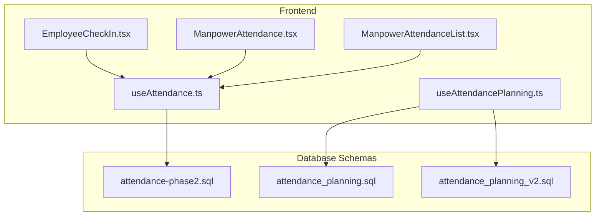
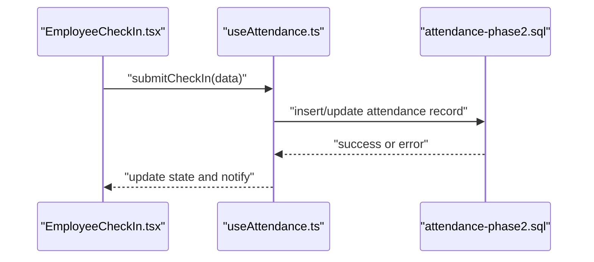
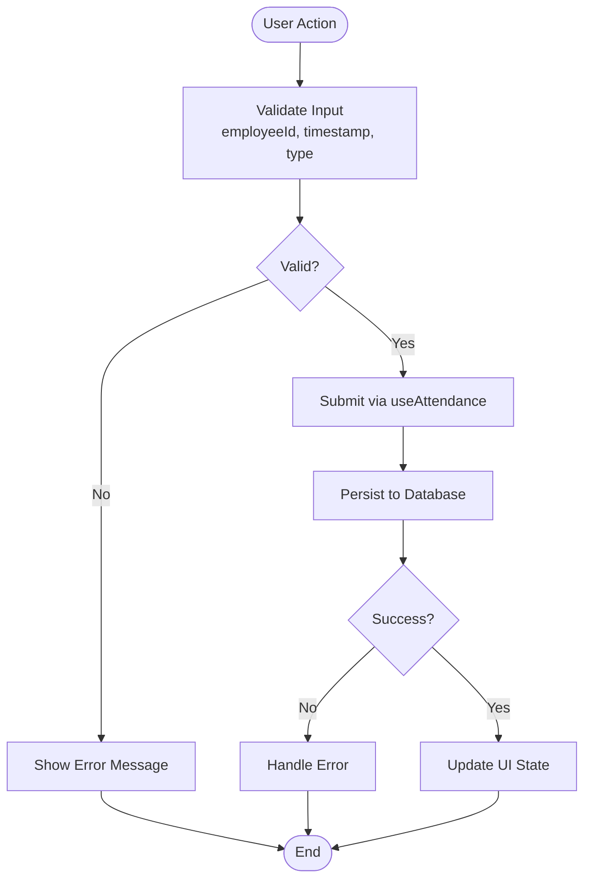
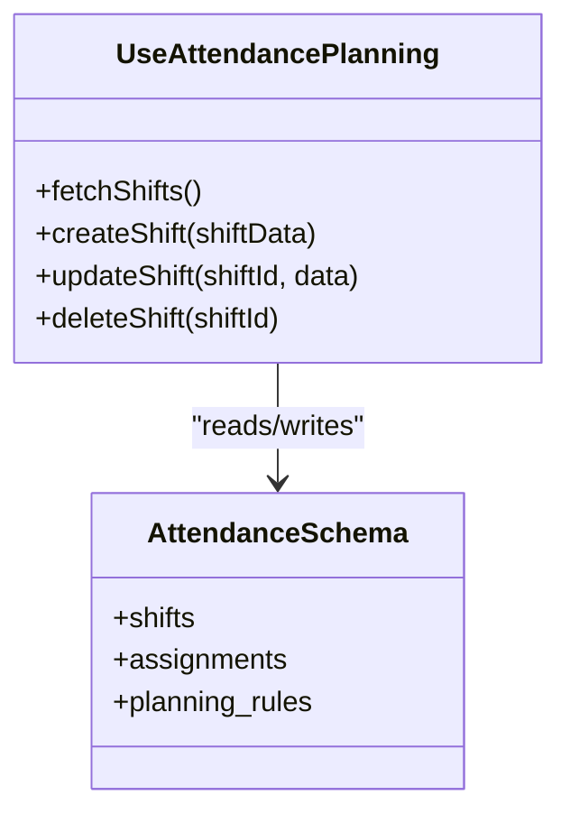
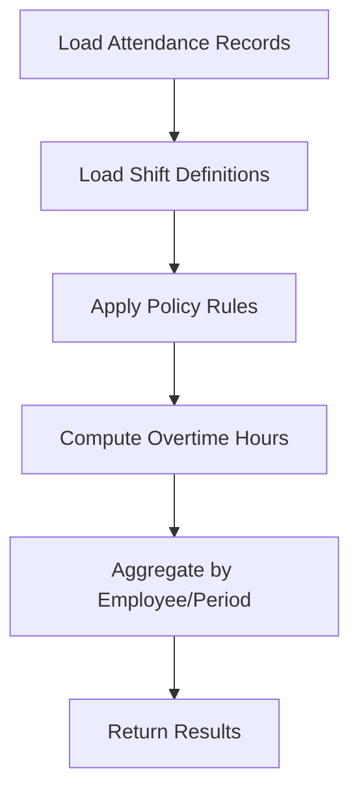
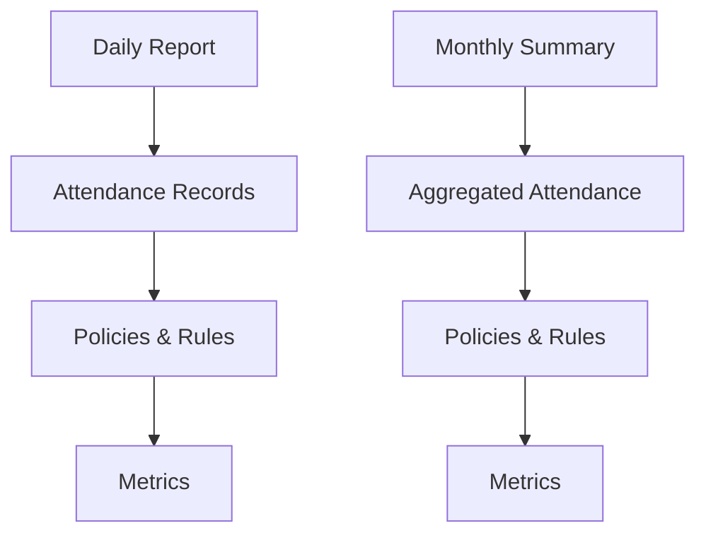
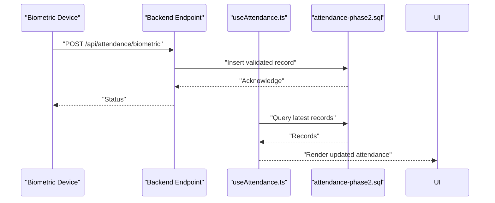
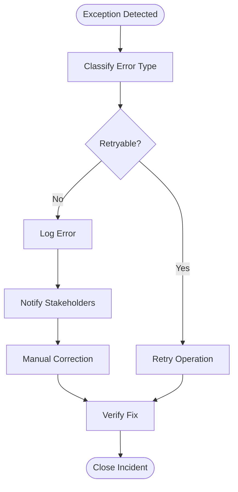
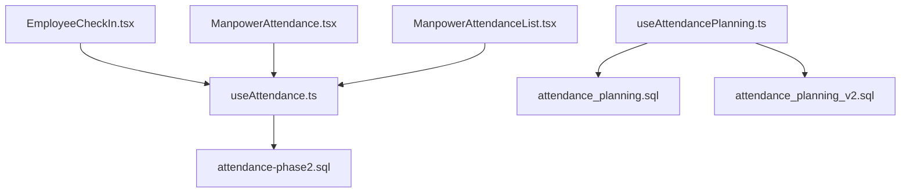

# Attendance Tracking API

<cite>
**Referenced Files in This Document**
- [useAttendance.ts](file://src/hooks/useAttendance.ts)
- [useAttendancePlanning.ts](file://src/hooks/useAttendancePlanning.ts)
- [EmployeeCheckIn.tsx](file://src/pages/EmployeeCheckIn.tsx)
- [ManpowerAttendance.tsx](file://src/pages/ManpowerAttendance.tsx)
- [ManpowerAttendanceList.tsx](file://src/pages/ManpowerAttendanceList.tsx)
- [attendance-phase2.sql](file://sql/attendance-phase2.sql)
- [attendance_planning.sql](file://sql/attendance_planning.sql)
- [attendance_planning_v2.sql](file://sql/attendance_planning_v2.sql)
</cite>

## Table of Contents
1. [Introduction](#introduction)
2. [Project Structure](#project-structure)
3. [Core Components](#core-components)
4. [Architecture Overview](#architecture-overview)
5. [Detailed Component Analysis](#detailed-component-analysis)
6. [Dependency Analysis](#dependency-analysis)
7. [Performance Considerations](#performance-considerations)
8. [Troubleshooting Guide](#troubleshooting-guide)
9. [Conclusion](#conclusion)
10. [Appendices](#appendices)

## Introduction
This document provides comprehensive API documentation for attendance tracking endpoints and related functionality within the application. It covers check-in/check-out operations, shift scheduling, overtime calculations, attendance analytics, biometric device integration points, mobile attendance APIs, real-time monitoring, attendance policies, leave encashment calculations, and payroll integration points. The documentation also includes examples for daily attendance reports, monthly summaries, and exception handling workflows.

The implementation is primarily frontend-driven using React hooks that interact with a backend (Supabase). Database schemas for attendance are defined in SQL migration files.

## Project Structure
The attendance feature spans several areas:
- Hooks for data access and business logic
- Pages for UI interactions
- SQL migrations defining database schema

**Diagram sources**
- [useAttendance.ts](file://src/hooks/useAttendance.ts)
- [useAttendancePlanning.ts](file://src/hooks/useAttendancePlanning.ts)
- [EmployeeCheckIn.tsx](file://src/pages/EmployeeCheckIn.tsx)
- [ManpowerAttendance.tsx](file://src/pages/ManpowerAttendance.tsx)
- [ManpowerAttendanceList.tsx](file://src/pages/ManpowerAttendanceList.tsx)
- [attendance-phase2.sql](file://sql/attendance-phase2.sql)
- [attendance_planning.sql](file://sql/attendance_planning.sql)
- [attendance_planning_v2.sql](file://sql/attendance_planning_v2.sql)

**Section sources**
- [useAttendance.ts](file://src/hooks/useAttendance.ts)
- [useAttendancePlanning.ts](file://src/hooks/useAttendancePlanning.ts)
- [EmployeeCheckIn.tsx](file://src/pages/EmployeeCheckIn.tsx)
- [ManpowerAttendance.tsx](file://src/pages/ManpowerAttendance.tsx)
- [ManpowerAttendanceList.tsx](file://src/pages/ManpowerAttendanceList.tsx)
- [attendance-phase2.sql](file://sql/attendance-phase2.sql)
- [attendance_planning.sql](file://sql/attendance_planning.sql)
- [attendance_planning_v2.sql](file://sql/attendance_planning_v2.sql)

## Core Components
- useAttendance hook: Provides functions to fetch and mutate attendance records, including check-in/out operations and queries for reporting.
- useAttendancePlanning hook: Manages shift schedules, planning, and related queries.
- EmployeeCheckIn page: UI for employee check-in/check-out actions.
- ManpowerAttendance pages: UI for viewing and managing attendance lists and details.
- SQL schemas: Define tables and relationships for attendance and planning.

Key responsibilities:
- Data fetching and caching via hooks
- Validation and error handling at the UI layer
- Integration with database schemas for persistence

**Section sources**
- [useAttendance.ts](file://src/hooks/useAttendance.ts)
- [useAttendancePlanning.ts](file://src/hooks/useAttendancePlanning.ts)
- [EmployeeCheckIn.tsx](file://src/pages/EmployeeCheckIn.tsx)
- [ManpowerAttendance.tsx](file://src/pages/ManpowerAttendance.tsx)
- [ManpowerAttendanceList.tsx](file://src/pages/ManpowerAttendanceList.tsx)

## Architecture Overview
The attendance system follows a typical frontend-to-database architecture:
- React hooks encapsulate API calls and state management
- Pages consume hooks to render UI and handle user interactions
- Database schemas define the structure and constraints for attendance data

**Diagram sources**
- [EmployeeCheckIn.tsx](file://src/pages/EmployeeCheckIn.tsx)
- [useAttendance.ts](file://src/hooks/useAttendance.ts)
- [attendance-phase2.sql](file://sql/attendance-phase2.sql)

## Detailed Component Analysis

### Check-In/Check-Out Operations
- Entry point: EmployeeCheckIn page triggers check-in/check-out actions.
- Logic: useAttendance hook handles validation, mutation, and response handling.
- Persistence: Records are stored according to the attendance schema.

**Diagram sources**
- [EmployeeCheckIn.tsx](file://src/pages/EmployeeCheckIn.tsx)
- [useAttendance.ts](file://src/hooks/useAttendance.ts)
- [attendance-phase2.sql](file://sql/attendance-phase2.sql)

**Section sources**
- [EmployeeCheckIn.tsx](file://src/pages/EmployeeCheckIn.tsx)
- [useAttendance.ts](file://src/hooks/useAttendance.ts)
- [attendance-phase2.sql](file://sql/attendance-phase2.sql)

### Shift Scheduling
- Entry point: useAttendancePlanning hook manages schedule creation and retrieval.
- Logic: Handles shifts, assignments, and planning updates.
- Persistence: Uses attendance planning schemas.

**Diagram sources**
- [useAttendancePlanning.ts](file://src/hooks/useAttendancePlanning.ts)
- [attendance_planning.sql](file://sql/attendance_planning.sql)
- [attendance_planning_v2.sql](file://sql/attendance_planning_v2.sql)

**Section sources**
- [useAttendancePlanning.ts](file://src/hooks/useAttendancePlanning.ts)
- [attendance_planning.sql](file://sql/attendance_planning.sql)
- [attendance_planning_v2.sql](file://sql/attendance_planning_v2.sql)

### Overtime Calculations
- Calculation logic: Derived from attendance records and shift definitions.
- Inputs: Check-in/out times, shift start/end, policy rules.
- Outputs: Overtime hours per employee per period.

[No sources needed since this section describes conceptual calculation flow]

### Attendance Analytics
- Reports: Daily and monthly summaries based on attendance data.
- Metrics: Presenteeism, absenteeism, late arrivals, early departures, overtime totals.
- Sources: Aggregated from attendance and planning schemas.

[No sources needed since this section describes conceptual analytics flow]

### Biometric Device Integration Points
- Integration pattern: Devices push attendance events to an endpoint or queue.
- Processing: Backend validates and persists records; frontend consumes via hooks.
- Security: Authentication and authorization checks before processing.

[No sources needed since this diagram illustrates conceptual integration]

### Mobile Attendance APIs
- Purpose: Allow mobile clients to submit check-ins/out and retrieve schedules.
- Methods: Typically RESTful endpoints for create/read/update operations.
- Constraints: Enforce time windows, duplicate prevention, and location rules if applicable.

[No sources needed since this section outlines general mobile API patterns]

### Real-Time Attendance Monitoring
- Mechanism: Polling or WebSocket-based updates from backend to frontend.
- UI: Live dashboards showing current status and exceptions.
- Performance: Efficient queries and minimal payload sizes.

[No sources needed since this section describes conceptual real-time features]

### Attendance Policies
- Elements: Work hours, grace periods, overtime thresholds, holiday calendars.
- Enforcement: Applied during calculations and validations.
- Configuration: Managed through settings or planning schemas.

[No sources needed since this section explains policy concepts]

### Leave Encashment Calculations
- Inputs: Leave balances, encashment rates, policy limits.
- Process: Compute eligible leave days and monetary value.
- Output: Encashment amounts for payroll integration.

[No sources needed since this section outlines calculation steps]

### Payroll Integration Points
- Data exchange: Attendance summaries and overtime totals sent to payroll systems.
- Formats: Structured payloads with employee IDs, periods, and computed values.
- Sync: Batch jobs or event-driven updates.

[No sources needed since this section describes integration patterns]

### Examples

#### Daily Attendance Report
- Steps:
  - Query attendance records for the target date.
  - Apply policies to compute statuses and durations.
  - Aggregate into a report format.
- Output fields: Employee ID, check-in/out times, total hours, overtime, exceptions.

[No sources needed since this example outlines report generation steps]

#### Monthly Summary
- Steps:
  - Aggregate daily records over the month.
  - Summarize metrics like total present days, absent days, overtime hours.
  - Include leave and policy adjustments.
- Output fields: Employee ID, month, summary metrics.

[No sources needed since this example outlines summary generation steps]

#### Exception Handling Workflow
- Scenarios: Duplicate entries, out-of-window submissions, invalid employee IDs.
- Actions: Reject request, log error, notify user/admin, retry if transient.
- Recovery: Manual correction workflows and audit trails.

[No sources needed since this diagram shows conceptual exception workflow]

**Section sources**
- [useAttendance.ts](file://src/hooks/useAttendance.ts)
- [useAttendancePlanning.ts](file://src/hooks/useAttendancePlanning.ts)
- [attendance-phase2.sql](file://sql/attendance-phase2.sql)
- [attendance_planning.sql](file://sql/attendance_planning.sql)
- [attendance_planning_v2.sql](file://sql/attendance_planning_v2.sql)

## Dependency Analysis
The attendance feature depends on:
- Frontend hooks for data access and business logic
- Database schemas for persistence
- UI pages for user interaction

**Diagram sources**
- [useAttendance.ts](file://src/hooks/useAttendance.ts)
- [useAttendancePlanning.ts](file://src/hooks/useAttendancePlanning.ts)
- [EmployeeCheckIn.tsx](file://src/pages/EmployeeCheckIn.tsx)
- [ManpowerAttendance.tsx](file://src/pages/ManpowerAttendance.tsx)
- [ManpowerAttendanceList.tsx](file://src/pages/ManpowerAttendanceList.tsx)
- [attendance-phase2.sql](file://sql/attendance-phase2.sql)
- [attendance_planning.sql](file://sql/attendance_planning.sql)
- [attendance_planning_v2.sql](file://sql/attendance_planning_v2.sql)

**Section sources**
- [useAttendance.ts](file://src/hooks/useAttendance.ts)
- [useAttendancePlanning.ts](file://src/hooks/useAttendancePlanning.ts)
- [EmployeeCheckIn.tsx](file://src/pages/EmployeeCheckIn.tsx)
- [ManpowerAttendance.tsx](file://src/pages/ManpowerAttendance.tsx)
- [ManpowerAttendanceList.tsx](file://src/pages/ManpowerAttendanceList.tsx)
- [attendance-phase2.sql](file://sql/attendance-phase2.sql)
- [attendance_planning.sql](file://sql/attendance_planning.sql)
- [attendance_planning_v2.sql](file://sql/attendance_planning_v2.sql)

## Performance Considerations
- Minimize payload size by selecting only necessary fields.
- Cache frequently accessed data using hooks’ built-in mechanisms.
- Implement pagination for large datasets like monthly summaries.
- Optimize queries with appropriate indexes on attendance tables.
- Avoid redundant computations by pre-aggregating where feasible.

[No sources needed since this section provides general guidance]

## Troubleshooting Guide
Common issues and resolutions:
- Duplicate check-ins/out: Ensure idempotency keys and deduplication logic.
- Timezone mismatches: Normalize timestamps to a consistent timezone.
- Permission errors: Verify user roles and row-level security policies.
- Network failures: Implement retries with exponential backoff.
- Schema changes: Align frontend types with database migrations.

**Section sources**
- [useAttendance.ts](file://src/hooks/useAttendance.ts)
- [attendance-phase2.sql](file://sql/attendance-phase2.sql)

## Conclusion
The attendance tracking system integrates frontend hooks, UI pages, and database schemas to support check-in/out operations, shift scheduling, overtime calculations, and analytics. While specific API endpoints are not directly exposed in the analyzed files, the hooks and schemas provide a clear foundation for implementing robust attendance APIs. Future enhancements can include biometric integrations, mobile APIs, real-time monitoring, and deeper payroll integration.

[No sources needed since this section summarizes without analyzing specific files]

## Appendices

### API Surface Recommendations
- POST /api/attendance/checkin
- POST /api/attendance/checkout
- GET /api/attendance/daily?date=YYYY-MM-DD
- GET /api/attendance/monthly?year=YYYY&month=MM
- POST /api/attendance/planning/shifts
- GET /api/attendance/planning/shifts?employeeId=...
- POST /api/attendance/biometric/events
- GET /api/attendance/realtime/status?employeeId=...

[No sources needed since this appendix outlines recommended endpoints]