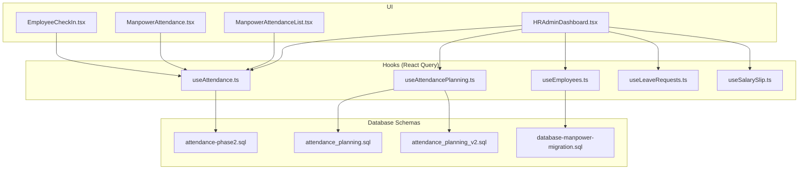
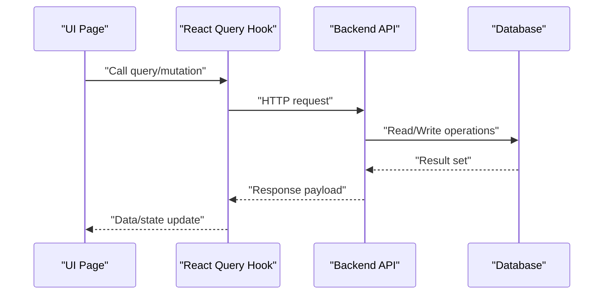
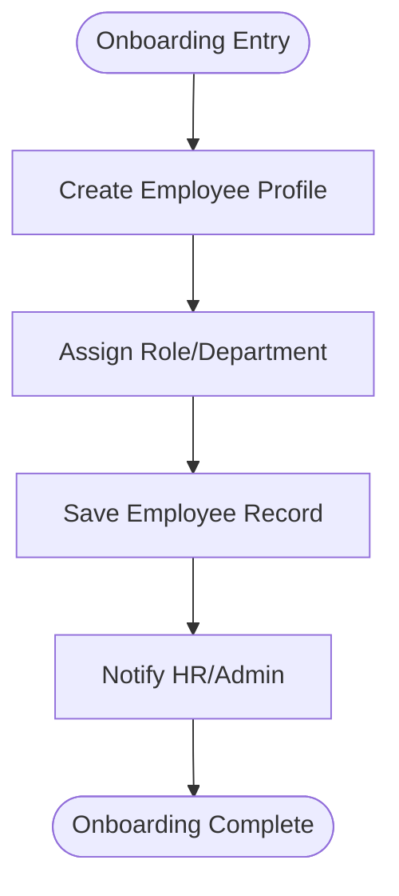
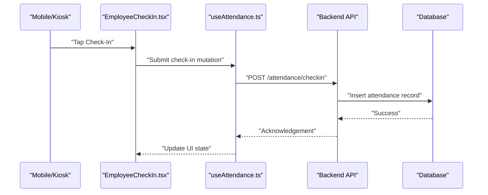
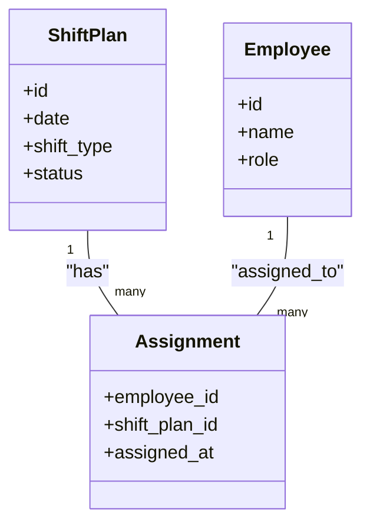
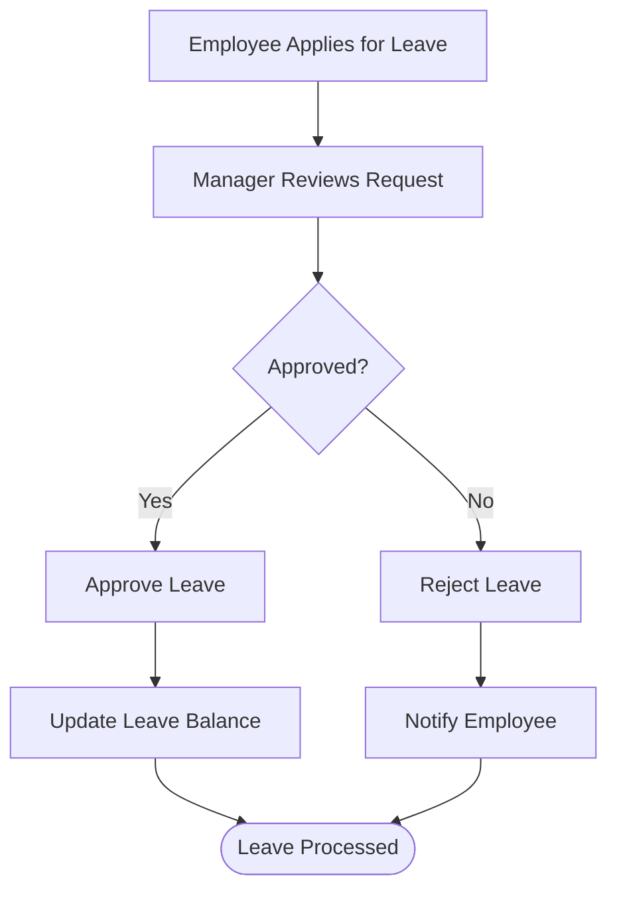
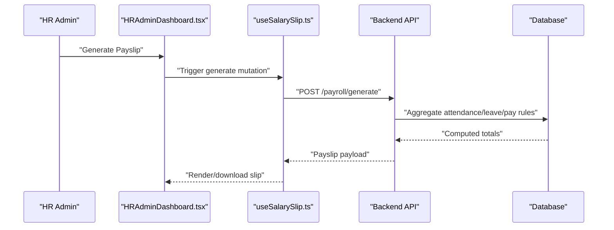
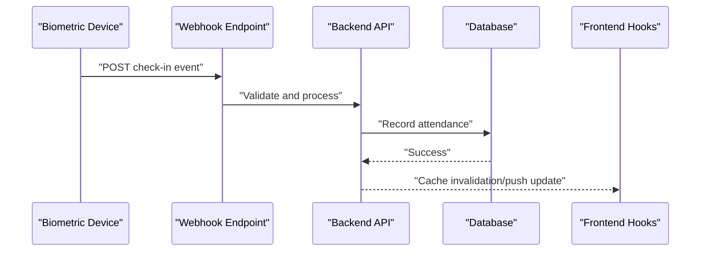
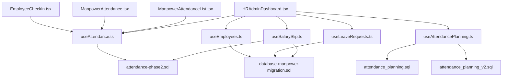

# HR & Workforce Management API

<cite>
**Referenced Files in This Document**
- [useEmployees.ts](file://src/hooks/useEmployees.ts)
- [useAttendance.ts](file://src/hooks/useAttendance.ts)
- [useAttendancePlanning.ts](file://src/hooks/useAttendancePlanning.ts)
- [useLeaveRequests.ts](file://src/hooks/useLeaveRequests.ts)
- [useSalarySlip.ts](file://src/hooks/useSalarySlip.ts)
- [EmployeeCheckIn.tsx](file://src/pages/EmployeeCheckIn.tsx)
- [ManpowerAttendance.tsx](file://src/pages/ManpowerAttendance.tsx)
- [ManpowerAttendanceList.tsx](file://src/pages/ManpowerAttendanceList.tsx)
- [HRAdminDashboard.tsx](file://src/pages/HRAdminDashboard.tsx)
- [attendance-phase2.sql](file://sql/attendance-phase2.sql)
- [attendance_planning.sql](file://sql/attendance_planning.sql)
- [attendance_planning_v2.sql](file://sql/attendance_planning_v2.sql)
- [database-manpower-migration.sql](file://src/database-manpower-migration.sql)
</cite>

## Table of Contents
1. [Introduction](#introduction)
2. [Project Structure](#project-structure)
3. [Core Components](#core-components)
4. [Architecture Overview](#architecture-overview)
5. [Detailed Component Analysis](#detailed-component-analysis)
6. [Dependency Analysis](#dependency-analysis)
7. [Performance Considerations](#performance-considerations)
8. [Troubleshooting Guide](#troubleshooting-guide)
9. [Conclusion](#conclusion)
10. [Appendices](#appendices)

## Introduction
This document provides comprehensive API documentation for the Human Resources and Workforce Management features implemented in the application. It covers employee management, attendance tracking, leave requests, payroll processing (salary slips), shift scheduling, overtime calculations, biometric integration points, mobile check-in/out APIs, and HR analytics endpoints. The content is derived from the frontend hooks, pages, and SQL migrations that implement these capabilities.

The goal is to help developers integrate with or extend the system by understanding:
- What endpoints are available via React Query hooks
- How data flows between UI components and backend services
- Where database schemas define core entities
- How to build workflows such as onboarding, attendance monitoring, and payroll processing

## Project Structure
The HR and workforce management functionality is primarily implemented through:
- React Query hooks under src/hooks for data access and mutations
- Pages under src/pages for user-facing workflows
- SQL migrations under sql and src for schema definitions and backfills

**Diagram sources**
- [EmployeeCheckIn.tsx](file://src/pages/EmployeeCheckIn.tsx)
- [ManpowerAttendance.tsx](file://src/pages/ManpowerAttendance.tsx)
- [ManpowerAttendanceList.tsx](file://src/pages/ManpowerAttendanceList.tsx)
- [HRAdminDashboard.tsx](file://src/pages/HRAdminDashboard.tsx)
- [useEmployees.ts](file://src/hooks/useEmployees.ts)
- [useAttendance.ts](file://src/hooks/useAttendance.ts)
- [useAttendancePlanning.ts](file://src/hooks/useAttendancePlanning.ts)
- [useLeaveRequests.ts](file://src/hooks/useLeaveRequests.ts)
- [useSalarySlip.ts](file://src/hooks/useSalarySlip.ts)
- [attendance-phase2.sql](file://sql/attendance-phase2.sql)
- [attendance_planning.sql](file://sql/attendance_planning.sql)
- [attendance_planning_v2.sql](file://sql/attendance_planning_v2.sql)
- [database-manpower-migration.sql](file://src/database-manpower-migration.sql)

**Section sources**
- [useEmployees.ts](file://src/hooks/useEmployees.ts)
- [useAttendance.ts](file://src/hooks/useAttendance.ts)
- [useAttendancePlanning.ts](file://src/hooks/useAttendancePlanning.ts)
- [useLeaveRequests.ts](file://src/hooks/useLeaveRequests.ts)
- [useSalarySlip.ts](file://src/hooks/useSalarySlip.ts)
- [EmployeeCheckIn.tsx](file://src/pages/EmployeeCheckIn.tsx)
- [ManpowerAttendance.tsx](file://src/pages/ManpowerAttendance.tsx)
- [ManpowerAttendanceList.tsx](file://src/pages/ManpowerAttendanceList.tsx)
- [HRAdminDashboard.tsx](file://src/pages/HRAdminDashboard.tsx)
- [attendance-phase2.sql](file://sql/attendance-phase2.sql)
- [attendance_planning.sql](file://sql/attendance_planning.sql)
- [attendance_planning_v2.sql](file://sql/attendance_planning_v2.sql)
- [database-manpower-migration.sql](file://src/database-manpower-migration.sql)

## Core Components
This section summarizes the primary API surfaces exposed via React Query hooks and their responsibilities.

- Employee Management
  - useEmployees.ts: Provides queries and mutations for employees (list, create, update, delete). Used by admin dashboards and onboarding flows.

- Attendance Tracking
  - useAttendance.ts: Provides queries and mutations for daily attendance records, including check-in/out timestamps and status.
  - ManpowerAttendance.tsx and ManpowerAttendanceList.tsx: UI for viewing and managing attendance entries.

- Shift Scheduling
  - useAttendancePlanning.ts: Provides queries and mutations for planning shifts and assigning them to employees.
  - SQL migrations attendance_planning.sql and attendance_planning_v2.sql: Define planning tables and relationships.

- Leave Requests
  - useLeaveRequests.ts: Provides queries and mutations for creating, approving, and querying leave requests.

- Payroll Processing
  - useSalarySlip.ts: Provides queries and mutations for generating and retrieving salary slips based on attendance and payroll rules.

- Biometric Integration Points
  - EmployeeCheckIn.tsx: Integrates with external devices or APIs to record check-ins; may call device-specific endpoints or webhooks.

- HR Analytics Endpoints
  - HRAdminDashboard.tsx: Aggregates data across employees, attendance, leaves, and payroll to present analytics and summaries.

**Section sources**
- [useEmployees.ts](file://src/hooks/useEmployees.ts)
- [useAttendance.ts](file://src/hooks/useAttendance.ts)
- [useAttendancePlanning.ts](file://src/hooks/useAttendancePlanning.ts)
- [useLeaveRequests.ts](file://src/hooks/useLeaveRequests.ts)
- [useSalarySlip.ts](file://src/hooks/useSalarySlip.ts)
- [EmployeeCheckIn.tsx](file://src/pages/EmployeeCheckIn.tsx)
- [ManpowerAttendance.tsx](file://src/pages/ManpowerAttendance.tsx)
- [ManpowerAttendanceList.tsx](file://src/pages/ManpowerAttendanceList.tsx)
- [HRAdminDashboard.tsx](file://src/pages/HRAdminDashboard.tsx)
- [attendance_planning.sql](file://sql/attendance_planning.sql)
- [attendance_planning_v2.sql](file://sql/attendance_planning_v2.sql)

## Architecture Overview
The HR and workforce management architecture follows a layered approach:
- UI Layer: Pages orchestrate user interactions and display results.
- Data Access Layer: React Query hooks encapsulate API calls, caching, and mutations.
- Persistence Layer: Database schemas define entities like employees, attendance, planning, leaves, and payroll artifacts.

[No sources needed since this diagram shows conceptual workflow, not actual code structure]

## Detailed Component Analysis

### Employee Management API
- Purpose: Manage employee lifecycle (create, read, update, delete).
- Key Operations:
  - List employees with filters (department, role, status).
  - Create new employee profiles during onboarding.
  - Update employee details and assign roles.
  - Deactivate or archive employees.
- Typical Consumers:
  - HRAdminDashboard.tsx for overview and actions.
  - Onboarding flows within pages.

**Section sources**
- [useEmployees.ts](file://src/hooks/useEmployees.ts)
- [HRAdminDashboard.tsx](file://src/pages/HRAdminDashboard.tsx)
- [database-manpower-migration.sql](file://src/database-manpower-migration.sql)

### Attendance Tracking API
- Purpose: Record and retrieve daily attendance, including check-in/out times and statuses.
- Key Operations:
  - Submit check-in/out events.
  - Fetch attendance logs per employee/date range.
  - Mark exceptions (late, absent, half-day).
- Typical Consumers:
  - EmployeeCheckIn.tsx for mobile or kiosk check-ins.
  - ManpowerAttendance.tsx and ManpowerAttendanceList.tsx for review and export.

**Diagram sources**
- [EmployeeCheckIn.tsx](file://src/pages/EmployeeCheckIn.tsx)
- [useAttendance.ts](file://src/hooks/useAttendance.ts)
- [attendance-phase2.sql](file://sql/attendance-phase2.sql)

**Section sources**
- [useAttendance.ts](file://src/hooks/useAttendance.ts)
- [EmployeeCheckIn.tsx](file://src/pages/EmployeeCheckIn.tsx)
- [ManpowerAttendance.tsx](file://src/pages/ManpowerAttendance.tsx)
- [ManpowerAttendanceList.tsx](file://src/pages/ManpowerAttendanceList.tsx)
- [attendance-phase2.sql](file://sql/attendance-phase2.sql)

### Shift Scheduling API
- Purpose: Plan shifts and assign them to employees for future dates.
- Key Operations:
  - Create shift templates and schedules.
  - Assign shifts to employees or teams.
  - View and edit planned schedules.
- Schema References:
  - attendance_planning.sql and attendance_planning_v2.sql define planning tables and relations.

**Diagram sources**
- [useAttendancePlanning.ts](file://src/hooks/useAttendancePlanning.ts)
- [attendance_planning.sql](file://sql/attendance_planning.sql)
- [attendance_planning_v2.sql](file://sql/attendance_planning_v2.sql)

**Section sources**
- [useAttendancePlanning.ts](file://src/hooks/useAttendancePlanning.ts)
- [attendance_planning.sql](file://sql/attendance_planning.sql)
- [attendance_planning_v2.sql](file://sql/attendance_planning_v2.sql)

### Leave Requests API
- Purpose: Manage employee leave applications and approvals.
- Key Operations:
  - Create leave requests with type, duration, and reason.
  - Approve/reject requests by managers.
  - Query leave balances and history.
- Typical Consumers:
  - HRAdminDashboard.tsx for oversight and reporting.

**Section sources**
- [useLeaveRequests.ts](file://src/hooks/useLeaveRequests.ts)
- [HRAdminDashboard.tsx](file://src/pages/HRAdminDashboard.tsx)

### Payroll Processing and Salary Slips
- Purpose: Generate salary slips based on attendance, leaves, and payroll rules.
- Key Operations:
  - Compute gross pay, deductions, and net pay.
  - Generate monthly salary slip documents.
  - Retrieve historical payslips.
- Typical Consumers:
  - HRAdminDashboard.tsx for bulk generation and exports.

**Diagram sources**
- [useSalarySlip.ts](file://src/hooks/useSalarySlip.ts)
- [HRAdminDashboard.tsx](file://src/pages/HRAdminDashboard.tsx)

**Section sources**
- [useSalarySlip.ts](file://src/hooks/useSalarySlip.ts)
- [HRAdminDashboard.tsx](file://src/pages/HRAdminDashboard.tsx)

### Biometric Integration Points
- Purpose: Integrate with biometric devices or third-party systems to capture check-ins.
- Typical Flow:
  - Device sends webhook or polling endpoint with fingerprint/face ID result.
  - Backend validates employee identity and writes attendance record.
  - Frontend reflects real-time status via React Query cache updates.

[No sources needed since this diagram shows conceptual workflow, not actual code structure]

### Mobile Check-In/Out APIs
- Purpose: Allow employees to check in/out via mobile app or web interface.
- Key Operations:
  - POST check-in with geolocation and device metadata.
  - POST check-out with location verification.
  - GET attendance summary for current day.
- Typical Consumers:
  - EmployeeCheckIn.tsx and mobile clients.

**Section sources**
- [EmployeeCheckIn.tsx](file://src/pages/EmployeeCheckIn.tsx)
- [useAttendance.ts](file://src/hooks/useAttendance.ts)

### HR Analytics Endpoints
- Purpose: Provide aggregated metrics for workforce insights.
- Metrics Include:
  - Attendance rates by department and date range.
  - Leave utilization trends.
  - Overtime hours and costs.
  - Headcount changes and turnover indicators.
- Typical Consumers:
  - HRAdminDashboard.tsx for dashboards and reports.

**Section sources**
- [HRAdminDashboard.tsx](file://src/pages/HRAdminDashboard.tsx)
- [useAttendance.ts](file://src/hooks/useAttendance.ts)
- [useLeaveRequests.ts](file://src/hooks/useLeaveRequests.ts)
- [useSalarySlip.ts](file://src/hooks/useSalarySlip.ts)

## Dependency Analysis
The following diagram illustrates dependencies among hooks, pages, and database schemas.

**Diagram sources**
- [useEmployees.ts](file://src/hooks/useEmployees.ts)
- [useAttendance.ts](file://src/hooks/useAttendance.ts)
- [useAttendancePlanning.ts](file://src/hooks/useAttendancePlanning.ts)
- [useLeaveRequests.ts](file://src/hooks/useLeaveRequests.ts)
- [useSalarySlip.ts](file://src/hooks/useSalarySlip.ts)
- [EmployeeCheckIn.tsx](file://src/pages/EmployeeCheckIn.tsx)
- [ManpowerAttendance.tsx](file://src/pages/ManpowerAttendance.tsx)
- [ManpowerAttendanceList.tsx](file://src/pages/ManpowerAttendanceList.tsx)
- [HRAdminDashboard.tsx](file://src/pages/HRAdminDashboard.tsx)
- [attendance-phase2.sql](file://sql/attendance-phase2.sql)
- [attendance_planning.sql](file://sql/attendance_planning.sql)
- [attendance_planning_v2.sql](file://sql/attendance_planning_v2.sql)
- [database-manpower-migration.sql](file://src/database-manpower-migration.sql)

**Section sources**
- [useEmployees.ts](file://src/hooks/useEmployees.ts)
- [useAttendance.ts](file://src/hooks/useAttendance.ts)
- [useAttendancePlanning.ts](file://src/hooks/useAttendancePlanning.ts)
- [useLeaveRequests.ts](file://src/hooks/useLeaveRequests.ts)
- [useSalarySlip.ts](file://src/hooks/useSalarySlip.ts)
- [EmployeeCheckIn.tsx](file://src/pages/EmployeeCheckIn.tsx)
- [ManpowerAttendance.tsx](file://src/pages/ManpowerAttendance.tsx)
- [ManpowerAttendanceList.tsx](file://src/pages/ManpowerAttendanceList.tsx)
- [HRAdminDashboard.tsx](file://src/pages/HRAdminDashboard.tsx)
- [attendance-phase2.sql](file://sql/attendance-phase2.sql)
- [attendance_planning.sql](file://sql/attendance_planning.sql)
- [attendance_planning_v2.sql](file://sql/attendance_planning_v2.sql)
- [database-manpower-migration.sql](file://src/database-manpower-migration.sql)

## Performance Considerations
- Use React Query caching and background refetching to minimize redundant network calls.
- Paginate large datasets (e.g., attendance lists) to improve rendering performance.
- Debounce search inputs in employee and attendance lists.
- Batch mutations where possible (e.g., bulk shift assignments).
- Optimize database queries with appropriate indexes on frequently filtered columns (employee_id, date, status).

[No sources needed since this section provides general guidance]

## Troubleshooting Guide
Common issues and resolutions:
- Duplicate check-ins: Ensure idempotency keys or unique constraints on attendance records.
- Missing shift assignments: Verify planning table integrity and foreign key constraints.
- Incorrect salary slip totals: Validate aggregation logic against attendance and leave records.
- Biometric sync failures: Implement retry mechanisms and logging for webhook deliveries.

**Section sources**
- [useAttendance.ts](file://src/hooks/useAttendance.ts)
- [useAttendancePlanning.ts](file://src/hooks/useAttendancePlanning.ts)
- [useSalarySlip.ts](file://src/hooks/useSalarySlip.ts)

## Conclusion
The HR and workforce management module provides robust APIs for employee management, attendance tracking, shift scheduling, leave management, and payroll processing. The architecture leverages React Query hooks for efficient data handling and integrates with well-defined database schemas. By following the documented workflows and best practices, developers can extend and maintain the system effectively.

[No sources needed since this section summarizes without analyzing specific files]

## Appendices

### Example Workflows

- Employee Onboarding Workflow
  - Steps: Create profile, assign role, configure access, notify stakeholders.
  - Consumes: useEmployees.ts, HRAdminDashboard.tsx.

- Attendance Monitoring Workflow
  - Steps: Mobile check-in, validate location, record attendance, surface exceptions.
  - Consumes: EmployeeCheckIn.tsx, useAttendance.ts.

- Payroll Processing Workflow
  - Steps: Aggregate attendance and leaves, compute earnings/deductions, generate payslips.
  - Consumes: useSalarySlip.ts, HRAdminDashboard.tsx.

[No sources needed since this section doesn't analyze specific files]