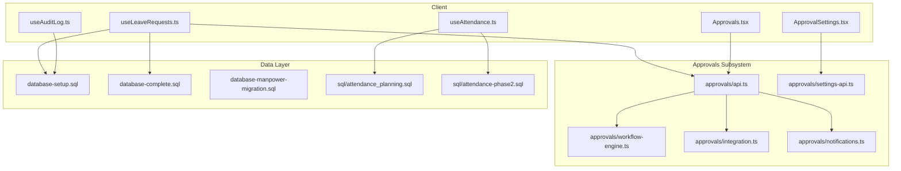
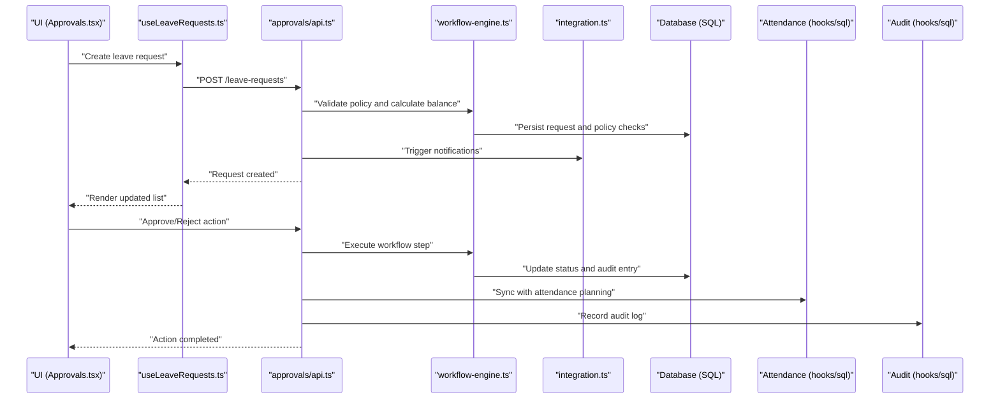
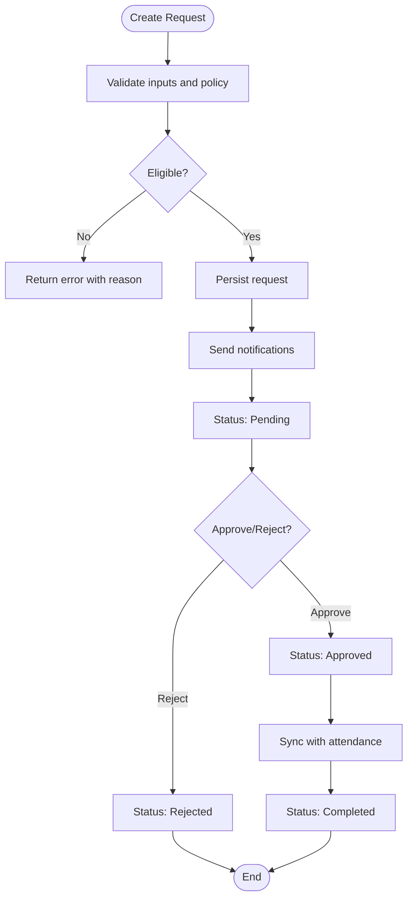
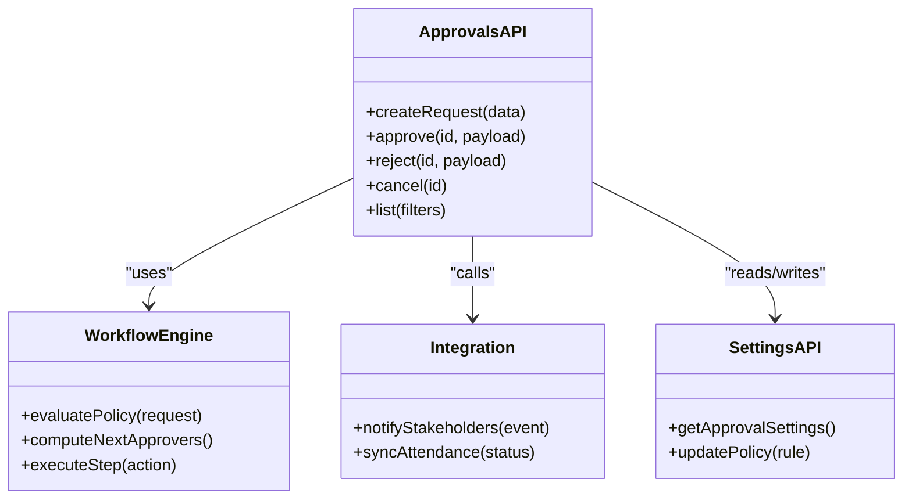
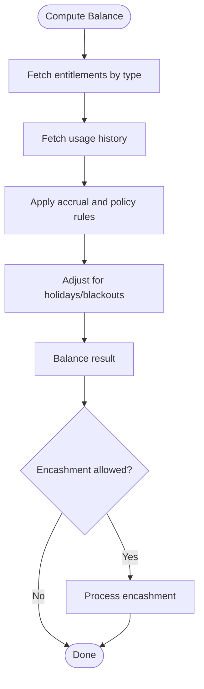
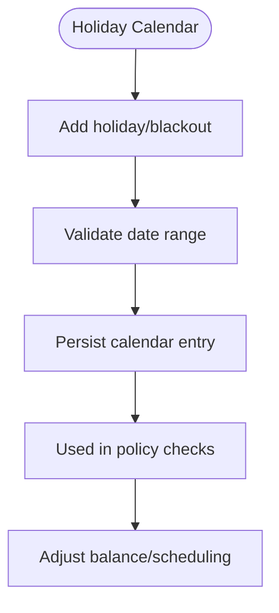
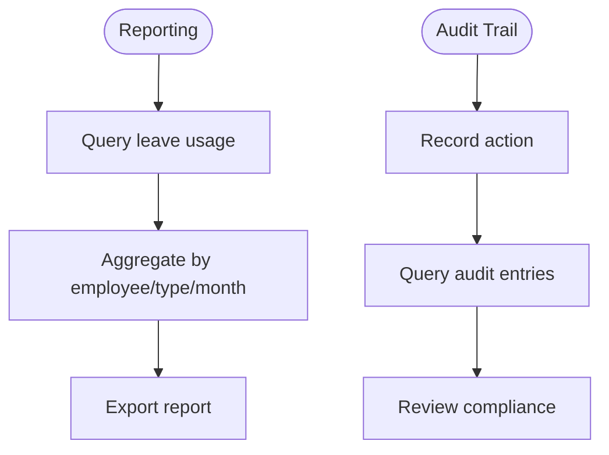
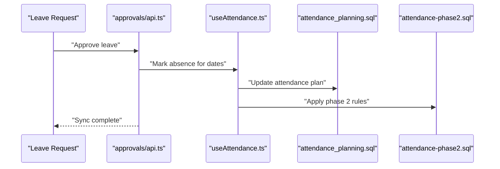
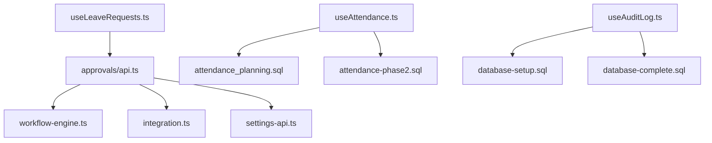

# Leave Management API

<cite>
**Referenced Files in This Document**
- [useLeaveRequests.ts](file://src/hooks/useLeaveRequests.ts)
- [api.ts](file://src/api.ts)
- [database-complete.sql](file://src/database-complete.sql)
- [database-setup.sql](file://src/database-setup.sql)
- [database-manpower-migration.sql](file://src/database-manpower-migration.sql)
- [attendance_planning.sql](file://sql/attendance_planning.sql)
- [attendance-phase2.sql](file://sql/attendance-phase2.sql)
- [useAttendance.ts](file://src/hooks/useAttendance.ts)
- [useAuditLog.ts](file://src/hooks/useAuditLog.ts)
- [Approvals.tsx](file://src/pages/Approvals.tsx)
- [ApprovalSettings.tsx](file://src/pages/ApprovalSettings.tsx)
- [approvals/api.ts](file://src/approvals/api.ts)
- [approvals/workflow-engine.ts](file://src/approvals/workflow-engine.ts)
- [approvals/integration.ts](file://src/approvals/integration.ts)
- [approvals/settings-api.ts](file://src/approvals/settings-api.ts)
- [approvals/notifications.ts](file://src/approvals/notifications.ts)
- [approvals/siteReportApproval.ts](file://src/approvals/siteReportApproval.ts)
</cite>

## Table of Contents
1. [Introduction](#introduction)
2. [Project Structure](#project-structure)
3. [Core Components](#core-components)
4. [Architecture Overview](#architecture-overview)
5. [Detailed Component Analysis](#detailed-component-analysis)
6. [Dependency Analysis](#dependency-analysis)
7. [Performance Considerations](#performance-considerations)
8. [Troubleshooting Guide](#troubleshooting-guide)
9. [Conclusion](#conclusion)
10. [Appendices](#appendices)

## Introduction
This document provides detailed API documentation for leave management endpoints and related workflows, including:
- Leave request creation and lifecycle
- Approval workflows and policy enforcement
- Leave balance calculations and encashment processing
- Holiday calendar management
- Leave reporting, audit trails, and integration with attendance systems
- Examples for approval workflows, balance calculations, and leave history retrieval

The scope covers both client-side hooks and server-side APIs where applicable, as well as database schemas that underpin leave-related features.

## Project Structure
Leave management spans multiple layers:
- Client hooks for data access and UI state (e.g., useLeaveRequests, useAttendance)
- Approvals subsystem for workflow orchestration and notifications
- Database migrations and SQL scripts defining tables and constraints
- Pages and settings for approvals and configuration

**Diagram sources**
- [useLeaveRequests.ts](file://src/hooks/useLeaveRequests.ts)
- [useAttendance.ts](file://src/hooks/useAttendance.ts)
- [useAuditLog.ts](file://src/hooks/useAuditLog.ts)
- [Approvals.tsx](file://src/pages/Approvals.tsx)
- [ApprovalSettings.tsx](file://src/pages/ApprovalSettings.tsx)
- [approvals/api.ts](file://src/approvals/api.ts)
- [approvals/workflow-engine.ts](file://src/approvals/workflow-engine.ts)
- [approvals/integration.ts](file://src/approvals/integration.ts)
- [approvals/notifications.ts](file://src/approvals/notifications.ts)
- [approvals/settings-api.ts](file://src/approvals/settings-api.ts)
- [database-setup.sql](file://src/database-setup.sql)
- [database-complete.sql](file://src/database-complete.sql)
- [database-manpower-migration.sql](file://src/database-manpower-migration.sql)
- [attendance_planning.sql](file://sql/attendance_planning.sql)
- [attendance-phase2.sql](file://sql/attendance-phase2.sql)

**Section sources**
- [useLeaveRequests.ts](file://src/hooks/useLeaveRequests.ts)
- [useAttendance.ts](file://src/hooks/useAttendance.ts)
- [useAuditLog.ts](file://src/hooks/useAuditLog.ts)
- [Approvals.tsx](file://src/pages/Approvals.tsx)
- [ApprovalSettings.tsx](file://src/pages/ApprovalSettings.tsx)
- [approvals/api.ts](file://src/approvals/api.ts)
- [approvals/workflow-engine.ts](file://src/approvals/workflow-engine.ts)
- [approvals/integration.ts](file://src/approvals/integration.ts)
- [approvals/notifications.ts](file://src/approvals/notifications.ts)
- [approvals/settings-api.ts](file://src/approvals/settings-api.ts)
- [database-setup.sql](file://src/database-setup.sql)
- [database-complete.sql](file://src/database-complete.sql)
- [database-manpower-migration.sql](file://src/database-manpower-migration.sql)
- [attendance_planning.sql](file://sql/attendance_planning.sql)
- [attendance-phase2.sql](file://sql/attendance-phase2.sql)

## Core Components
- Leave Requests Hook: Provides CRUD operations, filtering, and pagination for leave requests. It encapsulates API calls and local state for the UI.
- Attendance Integration Hook: Bridges leave data with attendance records to ensure consistency across modules.
- Audit Log Hook: Exposes audit trail queries for compliance and reporting.
- Approvals API and Engine: Orchestrates multi-step approvals, enforces policies, and triggers notifications.
- Settings API: Manages approval configurations and policy rules.

Key responsibilities:
- Create, update, approve, reject, and cancel leave requests
- Compute balances based on leave types and policies
- Enforce holiday calendars and blackout dates
- Integrate with attendance planning and phase 2 logic
- Generate reports and exportable summaries
- Maintain audit logs for all actions

**Section sources**
- [useLeaveRequests.ts](file://src/hooks/useLeaveRequests.ts)
- [useAttendance.ts](file://src/hooks/useAttendance.ts)
- [useAuditLog.ts](file://src/hooks/useAuditLog.ts)
- [approvals/api.ts](file://src/approvals/api.ts)
- [approvals/workflow-engine.ts](file://src/approvals/workflow-engine.ts)
- [approvals/settings-api.ts](file://src/approvals/settings-api.ts)

## Architecture Overview
The leave management system follows a layered architecture:
- Presentation layer: React pages and hooks
- Business logic: Approvals engine and integrations
- Data persistence: Relational schema defined by SQL migrations
- External integrations: Notifications and attendance systems

**Diagram sources**
- [Approvals.tsx](file://src/pages/Approvals.tsx)
- [useLeaveRequests.ts](file://src/hooks/useLeaveRequests.ts)
- [approvals/api.ts](file://src/approvals/api.ts)
- [approvals/workflow-engine.ts](file://src/approvals/workflow-engine.ts)
- [approvals/integration.ts](file://src/approvals/integration.ts)
- [database-setup.sql](file://src/database-setup.sql)
- [database-complete.sql](file://src/database-complete.sql)
- [attendance_planning.sql](file://sql/attendance_planning.sql)
- [useAttendance.ts](file://src/hooks/useAttendance.ts)
- [useAuditLog.ts](file://src/hooks/useAuditLog.ts)

## Detailed Component Analysis

### Leave Request Creation and Lifecycle
- Endpoints and flows are implemented via the approvals API and leave requests hook.
- The lifecycle includes draft, pending, approved, rejected, cancelled, and completed states.
- Policy validation occurs before persisting requests, ensuring eligibility and balance sufficiency.

**Diagram sources**
- [useLeaveRequests.ts](file://src/hooks/useLeaveRequests.ts)
- [approvals/api.ts](file://src/approvals/api.ts)
- [approvals/workflow-engine.ts](file://src/approvals/workflow-engine.ts)
- [approvals/notifications.ts](file://src/approvals/notifications.ts)
- [attendance_planning.sql](file://sql/attendance_planning.sql)

**Section sources**
- [useLeaveRequests.ts](file://src/hooks/useLeaveRequests.ts)
- [approvals/api.ts](file://src/approvals/api.ts)
- [approvals/workflow-engine.ts](file://src/approvals/workflow-engine.ts)
- [approvals/notifications.ts](file://src/approvals/notifications.ts)
- [attendance_planning.sql](file://sql/attendance_planning.sql)

### Approval Workflows and Policy Enforcement
- Multi-step approvals can be configured through settings API.
- Workflow engine evaluates conditions, delegates approvers, and enforces business rules.
- Integrations handle side effects like notifications and attendance updates.

**Diagram sources**
- [approvals/api.ts](file://src/approvals/api.ts)
- [approvals/workflow-engine.ts](file://src/approvals/workflow-engine.ts)
- [approvals/settings-api.ts](file://src/approvals/settings-api.ts)
- [approvals/integration.ts](file://src/approvals/integration.ts)

**Section sources**
- [approvals/api.ts](file://src/approvals/api.ts)
- [approvals/workflow-engine.ts](file://src/approvals/workflow-engine.ts)
- [approvals/settings-api.ts](file://src/approvals/settings-api.ts)
- [approvals/integration.ts](file://src/approvals/integration.ts)

### Leave Balance Calculations and Encashment Processing
- Balances are computed based on leave type entitlements, accrual rules, and usage history.
- Encashment is processed when policy allows conversion of unused leave into compensation.
- Calculations consider holidays, partial days, and overlapping requests.

**Diagram sources**
- [approvals/workflow-engine.ts](file://src/approvals/workflow-engine.ts)
- [database-complete.sql](file://src/database-complete.sql)
- [database-manpower-migration.sql](file://src/database-manpower-migration.sql)

**Section sources**
- [approvals/workflow-engine.ts](file://src/approvals/workflow-engine.ts)
- [database-complete.sql](file://src/database-complete.sql)
- [database-manpower-migration.sql](file://src/database-manpower-migration.sql)

### Holiday Calendar Management
- Holidays and blackout dates affect leave eligibility and balance computations.
- Calendar entries are referenced during policy evaluation and scheduling.

**Diagram sources**
- [database-setup.sql](file://src/database-setup.sql)
- [database-complete.sql](file://src/database-complete.sql)
- [approvals/workflow-engine.ts](file://src/approvals/workflow-engine.ts)

**Section sources**
- [database-setup.sql](file://src/database-setup.sql)
- [database-complete.sql](file://src/database-complete.sql)
- [approvals/workflow-engine.ts](file://src/approvals/workflow-engine.ts)

### Leave Reporting and Audit Trails
- Reports aggregate leave usage, balances, and approvals over time.
- Audit logs capture who performed actions, timestamps, and reasons.

**Diagram sources**
- [useAuditLog.ts](file://src/hooks/useAuditLog.ts)
- [database-setup.sql](file://src/database-setup.sql)
- [database-complete.sql](file://src/database-complete.sql)

**Section sources**
- [useAuditLog.ts](file://src/hooks/useAuditLog.ts)
- [database-setup.sql](file://src/database-setup.sql)
- [database-complete.sql](file://src/database-complete.sql)

### Integration with Attendance Systems
- Leave approvals sync with attendance planning to mark absence and prevent conflicts.
- Phase 2 attendance logic integrates with leave status changes.

**Diagram sources**
- [useAttendance.ts](file://src/hooks/useAttendance.ts)
- [attendance_planning.sql](file://sql/attendance_planning.sql)
- [attendance-phase2.sql](file://sql/attendance-phase2.sql)
- [approvals/api.ts](file://src/approvals/api.ts)

**Section sources**
- [useAttendance.ts](file://src/hooks/useAttendance.ts)
- [attendance_planning.sql](file://sql/attendance_planning.sql)
- [attendance-phase2.sql](file://sql/attendance-phase2.sql)
- [approvals/api.ts](file://src/approvals/api.ts)

## Dependency Analysis
- Client hooks depend on the approvals API for CRUD and workflow operations.
- Approvals API depends on the workflow engine for policy evaluation and on integrations for side effects.
- Attendance hooks depend on SQL schemas for planning and phase 2 logic.
- Audit log hook depends on database setup and complete schema definitions.

**Diagram sources**
- [useLeaveRequests.ts](file://src/hooks/useLeaveRequests.ts)
- [approvals/api.ts](file://src/approvals/api.ts)
- [approvals/workflow-engine.ts](file://src/approvals/workflow-engine.ts)
- [approvals/integration.ts](file://src/approvals/integration.ts)
- [approvals/settings-api.ts](file://src/approvals/settings-api.ts)
- [useAttendance.ts](file://src/hooks/useAttendance.ts)
- [attendance_planning.sql](file://sql/attendance_planning.sql)
- [attendance-phase2.sql](file://sql/attendance-phase2.sql)
- [useAuditLog.ts](file://src/hooks/useAuditLog.ts)
- [database-setup.sql](file://src/database-setup.sql)
- [database-complete.sql](file://src/database-complete.sql)

**Section sources**
- [useLeaveRequests.ts](file://src/hooks/useLeaveRequests.ts)
- [approvals/api.ts](file://src/approvals/api.ts)
- [approvals/workflow-engine.ts](file://src/approvals/workflow-engine.ts)
- [approvals/integration.ts](file://src/approvals/integration.ts)
- [approvals/settings-api.ts](file://src/approvals/settings-api.ts)
- [useAttendance.ts](file://src/hooks/useAttendance.ts)
- [attendance_planning.sql](file://sql/attendance_planning.sql)
- [attendance-phase2.sql](file://sql/attendance-phase2.sql)
- [useAuditLog.ts](file://src/hooks/useAuditLog.ts)
- [database-setup.sql](file://src/database-setup.sql)
- [database-complete.sql](file://src/database-complete.sql)

## Performance Considerations
- Batch operations for bulk approvals to reduce round trips.
- Indexes on frequently queried fields (employee_id, request_date, status).
- Caching of holiday calendars and policy rules to minimize repeated computation.
- Pagination and filtering for large leave histories and reports.
- Async notification dispatch to avoid blocking approval flows.

[No sources needed since this section provides general guidance]

## Troubleshooting Guide
Common issues and resolutions:
- Validation errors: Ensure leave type eligibility and sufficient balance; review policy rules and holiday adjustments.
- Approval failures: Verify approver assignments and workflow steps; check integration connectivity for notifications and attendance sync.
- Balance discrepancies: Inspect usage history and accrual rules; confirm holiday calendar entries and overlap handling.
- Audit gaps: Confirm audit logging is enabled and persisted; verify user context and timestamps.

**Section sources**
- [approvals/api.ts](file://src/approvals/api.ts)
- [approvals/workflow-engine.ts](file://src/approvals/workflow-engine.ts)
- [approvals/notifications.ts](file://src/approvals/notifications.ts)
- [useAuditLog.ts](file://src/hooks/useAuditLog.ts)
- [database-setup.sql](file://src/database-setup.sql)
- [database-complete.sql](file://src/database-complete.sql)

## Conclusion
The leave management API integrates request lifecycle, policy-driven approvals, balance calculations, holiday calendars, reporting, audit trails, and attendance synchronization. By leveraging the approvals engine and hooks, teams can implement robust leave processes with clear visibility and compliance.

[No sources needed since this section summarizes without analyzing specific files]

## Appendices

### Example: Leave Approval Workflow
- Create a leave request via the leave requests hook.
- Submit for approval; the workflow engine evaluates policy and assigns next approver(s).
- Approve or reject; upon approval, attendance is updated and audit log recorded.

**Section sources**
- [useLeaveRequests.ts](file://src/hooks/useLeaveRequests.ts)
- [approvals/api.ts](file://src/approvals/api.ts)
- [approvals/workflow-engine.ts](file://src/approvals/workflow-engine.ts)
- [useAttendance.ts](file://src/hooks/useAttendance.ts)
- [useAuditLog.ts](file://src/hooks/useAuditLog.ts)

### Example: Leave Balance Calculation
- Fetch entitlements and usage history.
- Apply accrual rules and adjust for holidays.
- Return final balance; if encashment is allowed, process accordingly.

**Section sources**
- [approvals/workflow-engine.ts](file://src/approvals/workflow-engine.ts)
- [database-complete.sql](file://src/database-complete.sql)
- [database-manpower-migration.sql](file://src/database-manpower-migration.sql)

### Example: Leave History Retrieval
- Query leave requests with filters (employee, type, date range, status).
- Paginate results and include audit entries for each action.
- Export or render in UI components.

**Section sources**
- [useLeaveRequests.ts](file://src/hooks/useLeaveRequests.ts)
- [useAuditLog.ts](file://src/hooks/useAuditLog.ts)
- [database-setup.sql](file://src/database-setup.sql)
- [database-complete.sql](file://src/database-complete.sql)