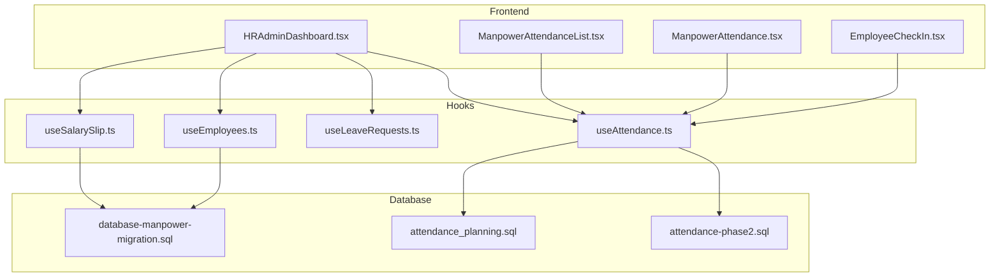
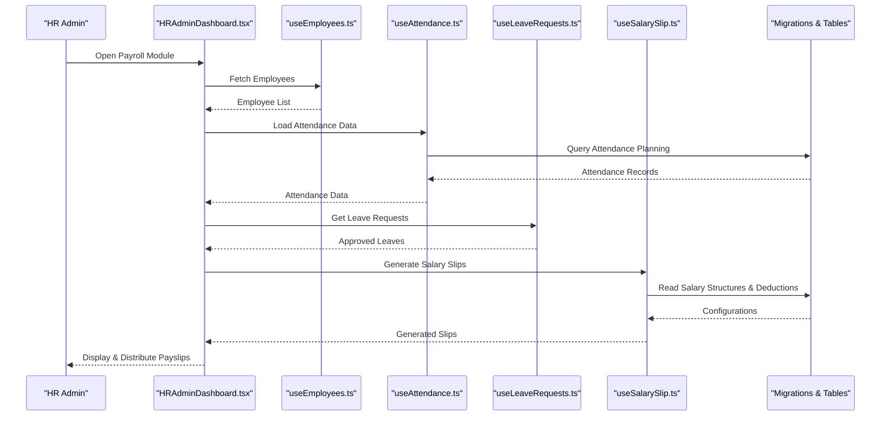
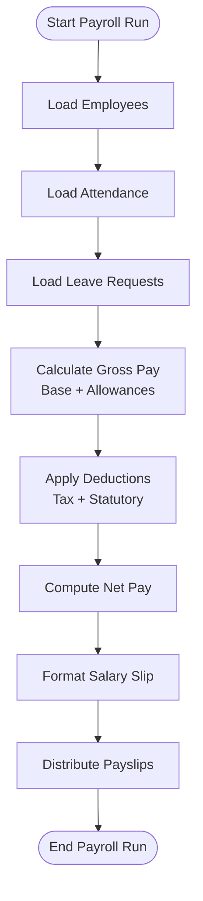
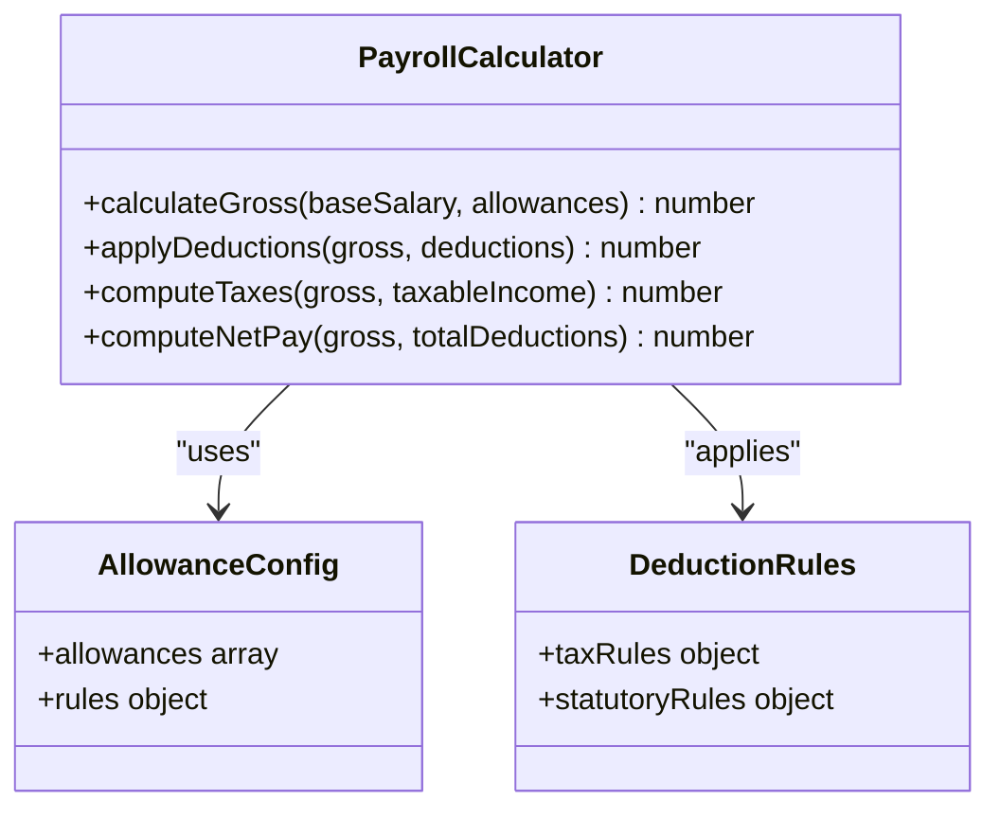
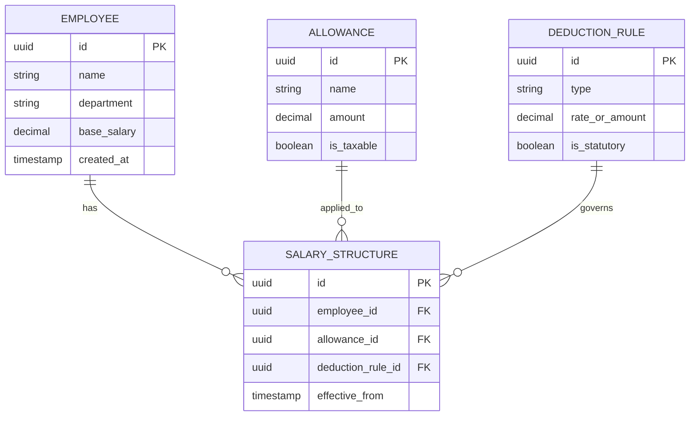
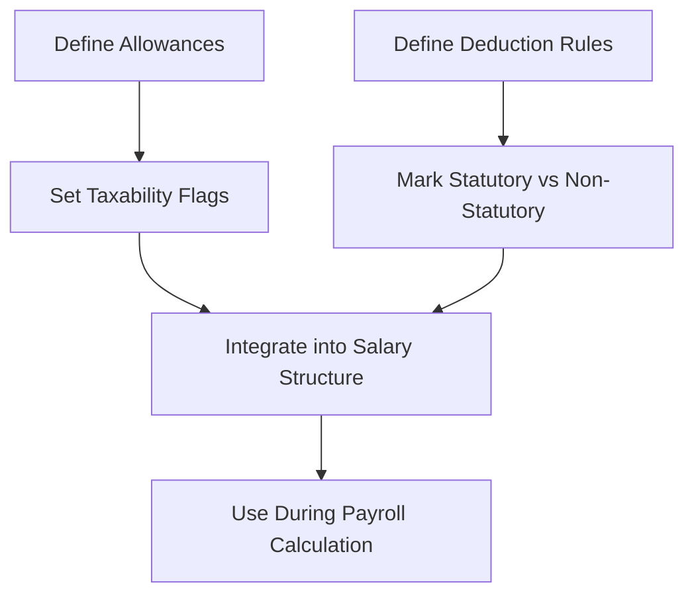
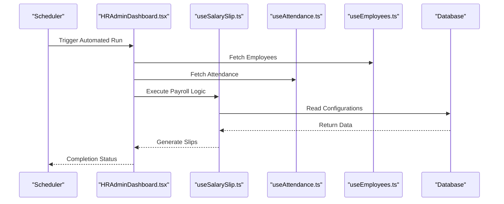
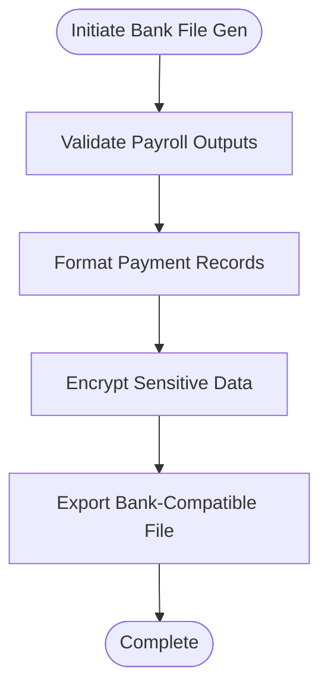
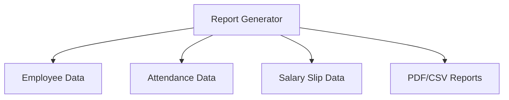
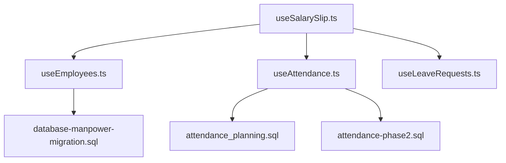

# Payroll Processing API

<cite>
**Referenced Files in This Document**
- [useSalarySlip.ts](file://src/hooks/useSalarySlip.ts)
- [EmployeeCheckIn.tsx](file://src/pages/EmployeeCheckIn.tsx)
- [ManpowerAttendance.tsx](file://src/pages/ManpowerAttendance.tsx)
- [ManpowerAttendanceList.tsx](file://src/pages/ManpowerAttendanceList.tsx)
- [HRAdminDashboard.tsx](file://src/pages/HRAdminDashboard.tsx)
- [useEmployees.ts](file://src/hooks/useEmployees.ts)
- [useAttendance.ts](file://src/hooks/useAttendance.ts)
- [useLeaveRequests.ts](file://src/hooks/useLeaveRequests.ts)
- [database-manpower-migration.sql](file://src/database-manpower-migration.sql)
- [attendance_planning.sql](file://sql/attendance_planning.sql)
- [attendance-phase2.sql](file://sql/attendance-phase2.sql)
</cite>

## Table of Contents
1. [Introduction](#introduction)
2. [Project Structure](#project-structure)
3. [Core Components](#core-components)
4. [Architecture Overview](#architecture-overview)
5. [Detailed Component Analysis](#detailed-component-analysis)
6. [Dependency Analysis](#dependency-analysis)
7. [Performance Considerations](#performance-considerations)
8. [Troubleshooting Guide](#troubleshooting-guide)
9. [Conclusion](#conclusion)

## Introduction
This document provides comprehensive API documentation for payroll processing endpoints, focusing on salary slip generation, payroll calculations, tax deductions, and statutory compliance. It also covers salary structure management, allowance configurations, deduction rules, payroll run automation, bank file generation, and payroll reporting. The guide includes examples for salary calculation workflows, payslip distribution, and payroll audit trails to help both technical and non-technical users understand the system’s capabilities.

## Project Structure
The payroll functionality is implemented across hooks, pages, and SQL migrations:
- Hooks provide data access and business logic integration for employees, attendance, leave requests, and salary slips.
- Pages offer user interfaces for employee check-in, attendance management, and HR administration.
- SQL files define database schemas and migrations related to manpower and attendance planning.

**Diagram sources**
- [EmployeeCheckIn.tsx](file://src/pages/EmployeeCheckIn.tsx)
- [ManpowerAttendance.tsx](file://src/pages/ManpowerAttendance.tsx)
- [ManpowerAttendanceList.tsx](file://src/pages/ManpowerAttendanceList.tsx)
- [HRAdminDashboard.tsx](file://src/pages/HRAdminDashboard.tsx)
- [useEmployees.ts](file://src/hooks/useEmployees.ts)
- [useAttendance.ts](file://src/hooks/useAttendance.ts)
- [useLeaveRequests.ts](file://src/hooks/useLeaveRequests.ts)
- [useSalarySlip.ts](file://src/hooks/useSalarySlip.ts)
- [database-manpower-migration.sql](file://src/database-manpower-migration.sql)
- [attendance_planning.sql](file://sql/attendance_planning.sql)
- [attendance-phase2.sql](file://sql/attendance-phase2.sql)

**Section sources**
- [useSalarySlip.ts](file://src/hooks/useSalarySlip.ts)
- [EmployeeCheckIn.tsx](file://src/pages/EmployeeCheckIn.tsx)
- [ManpowerAttendance.tsx](file://src/pages/ManpowerAttendance.tsx)
- [ManpowerAttendanceList.tsx](file://src/pages/ManpowerAttendanceList.tsx)
- [HRAdminDashboard.tsx](file://src/pages/HRAdminDashboard.tsx)
- [useEmployees.ts](file://src/hooks/useEmployees.ts)
- [useAttendance.ts](file://src/hooks/useAttendance.ts)
- [useLeaveRequests.ts](file://src/hooks/useLeaveRequests.ts)
- [database-manpower-migration.sql](file://src/database-manpower-migration.sql)
- [attendance_planning.sql](file://sql/attendance_planning.sql)
- [attendance-phase2.sql](file://sql/attendance-phase2.sql)

## Core Components
- Salary Slip Generation: Implemented via a dedicated hook that orchestrates data retrieval and formatting for generating salary slips.
- Attendance Integration: Attendance data is fetched and processed through an attendance hook, which integrates with attendance planning and phase-two migrations.
- Employee Management: Employee data is accessed via an employees hook, providing foundational information for payroll calculations.
- Leave Requests: Leave request data is integrated to adjust payroll calculations based on approved leaves.
- HR Administration Dashboard: Provides a centralized interface for managing payroll-related tasks, including viewing and distributing salary slips.

Key responsibilities:
- Data aggregation from multiple sources (employees, attendance, leaves).
- Calculation orchestration for gross pay, allowances, deductions, taxes, and net pay.
- Payslip formatting and distribution mechanisms.
- Audit trail logging for payroll runs and changes.

**Section sources**
- [useSalarySlip.ts](file://src/hooks/useSalarySlip.ts)
- [useAttendance.ts](file://src/hooks/useAttendance.ts)
- [useEmployees.ts](file://src/hooks/useEmployees.ts)
- [useLeaveRequests.ts](file://src/hooks/useLeaveRequests.ts)
- [HRAdminDashboard.tsx](file://src/pages/HRAdminDashboard.tsx)

## Architecture Overview
The payroll architecture integrates frontend components with backend hooks and database layers to deliver end-to-end payroll processing.

**Diagram sources**
- [HRAdminDashboard.tsx](file://src/pages/HRAdminDashboard.tsx)
- [useEmployees.ts](file://src/hooks/useEmployees.ts)
- [useAttendance.ts](file://src/hooks/useAttendance.ts)
- [useLeaveRequests.ts](file://src/hooks/useLeaveRequests.ts)
- [useSalarySlip.ts](file://src/hooks/useSalarySlip.ts)
- [attendance_planning.sql](file://sql/attendance_planning.sql)
- [database-manpower-migration.sql](file://src/database-manpower-migration.sql)

## Detailed Component Analysis

### Salary Slip Generation Workflow
This workflow demonstrates how salary slips are generated by aggregating employee data, attendance records, leave approvals, and configuration settings.

**Diagram sources**
- [useSalarySlip.ts](file://src/hooks/useSalarySlip.ts)
- [useAttendance.ts](file://src/hooks/useAttendance.ts)
- [useLeaveRequests.ts](file://src/hooks/useLeaveRequests.ts)
- [database-manpower-migration.sql](file://src/database-manpower-migration.sql)

**Section sources**
- [useSalarySlip.ts](file://src/hooks/useSalarySlip.ts)

### Payroll Calculations and Tax Deductions
Payroll calculations involve computing gross pay by summing base salary and applicable allowances, then applying statutory deductions and taxes. The process ensures compliance with local regulations and organizational policies.

**Diagram sources**
- [useSalarySlip.ts](file://src/hooks/useSalarySlip.ts)
- [database-manpower-migration.sql](file://src/database-manpower-migration.sql)

**Section sources**
- [useSalarySlip.ts](file://src/hooks/useSalarySlip.ts)
- [database-manpower-migration.sql](file://src/database-manpower-migration.sql)

### Salary Structure Management
Salary structures define base salaries, allowances, and deduction rules. These configurations are managed centrally and referenced during payroll calculations.

**Diagram sources**
- [database-manpower-migration.sql](file://src/database-manpower-migration.sql)

**Section sources**
- [database-manpower-migration.sql](file://src/database-manpower-migration.sql)

### Allowance Configurations and Deduction Rules
Allowances and deduction rules are configured to support flexible payroll setups. Allowances can be taxable or non-taxable, while deduction rules include statutory requirements and organizational policies.

**Diagram sources**
- [database-manpower-migration.sql](file://src/database-manpower-migration.sql)

**Section sources**
- [database-manpower-migration.sql](file://src/database-manpower-migration.sql)

### Payroll Run Automation
Automated payroll runs aggregate data, perform calculations, generate salary slips, and distribute them to employees. The process is orchestrated by the HR dashboard and supported by hooks and database operations.

**Diagram sources**
- [HRAdminDashboard.tsx](file://src/pages/HRAdminDashboard.tsx)
- [useSalarySlip.ts](file://src/hooks/useSalarySlip.ts)
- [useAttendance.ts](file://src/hooks/useAttendance.ts)
- [useEmployees.ts](file://src/hooks/useEmployees.ts)
- [database-manpower-migration.sql](file://src/database-manpower-migration.sql)

**Section sources**
- [HRAdminDashboard.tsx](file://src/pages/HRAdminDashboard.tsx)
- [useSalarySlip.ts](file://src/hooks/useSalarySlip.ts)

### Bank File Generation
Bank file generation creates standardized payment files for bulk transfers. The process formats payroll outputs according to banking requirements and ensures secure delivery.

[No sources needed since this diagram shows conceptual workflow, not actual code structure]

### Payroll Reporting
Payroll reports summarize earnings, deductions, taxes, and net pay across periods. Reports support auditing, compliance, and managerial insights.

[No sources needed since this diagram shows conceptual workflow, not actual code structure]

### Example: Salary Calculation Workflow
A typical salary calculation involves:
- Retrieving base salary and allowances from the employee’s salary structure.
- Adjusting for attendance and leave approvals.
- Applying statutory and organizational deductions.
- Computing taxes based on taxable income.
- Generating the final net pay and salary slip.

**Section sources**
- [useSalarySlip.ts](file://src/hooks/useSalarySlip.ts)
- [useAttendance.ts](file://src/hooks/useAttendance.ts)
- [useLeaveRequests.ts](file://src/hooks/useLeaveRequests.ts)
- [database-manpower-migration.sql](file://src/database-manpower-migration.sql)

### Example: Payslip Distribution
Payslips are distributed via the HR dashboard, allowing administrators to review, approve, and send to employees. Distribution channels may include email, internal notifications, or downloadable links.

**Section sources**
- [HRAdminDashboard.tsx](file://src/pages/HRAdminDashboard.tsx)
- [useSalarySlip.ts](file://src/hooks/useSalarySlip.ts)

### Example: Payroll Audit Trails
Audit trails log all payroll-related actions, including changes to salary structures, payroll runs, and payslip distributions. Logs capture timestamps, user IDs, and action details for compliance and troubleshooting.

**Section sources**
- [HRAdminDashboard.tsx](file://src/pages/HRAdminDashboard.tsx)
- [database-manpower-migration.sql](file://src/database-manpower-migration.sql)

## Dependency Analysis
The payroll system depends on several hooks and database migrations:
- useSalarySlip.ts relies on employee, attendance, and leave data.
- useAttendance.ts integrates with attendance planning and phase-two migrations.
- useEmployees.ts provides foundational employee information.
- Database migrations define schemas for manpower and attendance.

**Diagram sources**
- [useSalarySlip.ts](file://src/hooks/useSalarySlip.ts)
- [useEmployees.ts](file://src/hooks/useEmployees.ts)
- [useAttendance.ts](file://src/hooks/useAttendance.ts)
- [useLeaveRequests.ts](file://src/hooks/useLeaveRequests.ts)
- [attendance_planning.sql](file://sql/attendance_planning.sql)
- [attendance-phase2.sql](file://sql/attendance-phase2.sql)
- [database-manpower-migration.sql](file://src/database-manpower-migration.sql)

**Section sources**
- [useSalarySlip.ts](file://src/hooks/useSalarySlip.ts)
- [useEmployees.ts](file://src/hooks/useEmployees.ts)
- [useAttendance.ts](file://src/hooks/useAttendance.ts)
- [useLeaveRequests.ts](file://src/hooks/useLeaveRequests.ts)
- [attendance_planning.sql](file://sql/attendance_planning.sql)
- [attendance-phase2.sql](file://sql/attendance-phase2.sql)
- [database-manpower-migration.sql](file://src/database-manpower-migration.sql)

## Performance Considerations
- Optimize database queries for large employee datasets.
- Cache frequently accessed salary structures and deduction rules.
- Use pagination for attendance and leave data retrieval.
- Implement batch processing for payroll runs to reduce memory usage.
- Monitor query performance and index critical columns.

[No sources needed since this section provides general guidance]

## Troubleshooting Guide
Common issues and resolutions:
- Missing employee data: Verify employee records and salary structures in the database.
- Incorrect attendance integration: Check attendance planning tables and phase-two migrations.
- Deduction errors: Review deduction rules and tax configurations.
- Payslip generation failures: Inspect logs for calculation errors and validate input data.

**Section sources**
- [useSalarySlip.ts](file://src/hooks/useSalarySlip.ts)
- [useAttendance.ts](file://src/hooks/useAttendance.ts)
- [database-manpower-migration.sql](file://src/database-manpower-migration.sql)

## Conclusion
The payroll processing API provides a robust framework for salary slip generation, payroll calculations, tax deductions, and statutory compliance. With modular hooks, comprehensive database schemas, and intuitive dashboards, the system supports efficient payroll management, automated runs, and detailed reporting. By following the documented workflows and best practices, organizations can ensure accurate and compliant payroll operations.