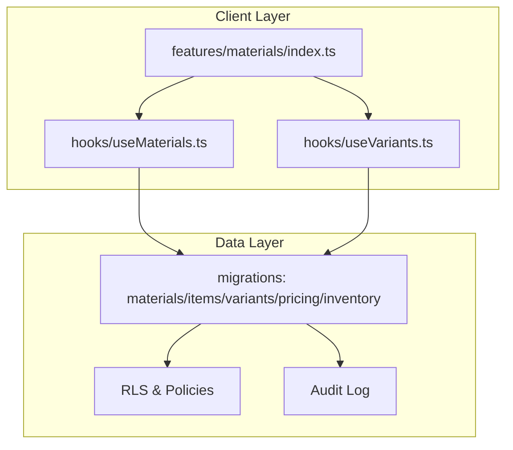
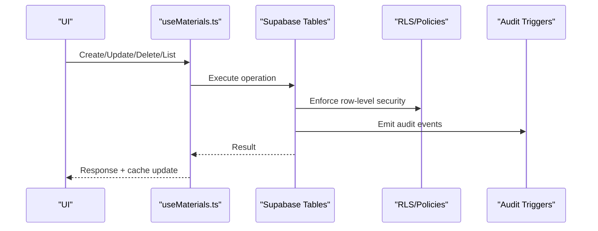
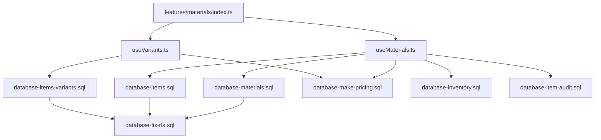
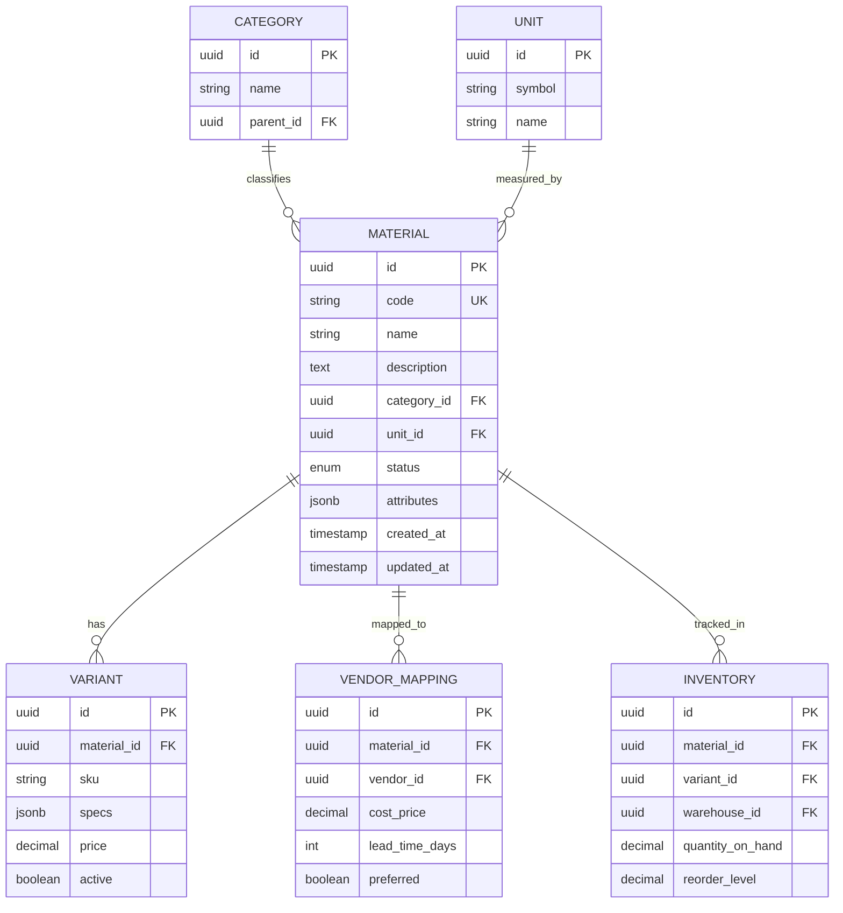

# Material Catalog API

<cite>
**Referenced Files in This Document**
- [useMaterials.ts](file://src/hooks/useMaterials.ts)
- [useVariants.ts](file://src/hooks/useVariants.ts)
- [materials/index.ts](file://src/features/materials/index.ts)
- [database-materials.sql](file://src/database-materials.sql)
- [database-items.sql](file://src/database-items.sql)
- [database-items-variants.sql](file://src/database-items-variants.sql)
- [database-add-variant-id.sql](file://src/database-add-variant-id.sql)
- [database-variant-discount.sql](file://src/database-variant-discount.sql)
- [database-item-audit.sql](file://src/database-item-audit.sql)
- [database-make-pricing.sql](file://src/database-make-pricing.sql)
- [database-inventory.sql](file://src/database-inventory.sql)
- [database-hsn-tax.sql](file://src/database-hsn-tax.sql)
- [database-enhance-item-type.sql](file://src/database-enhance-item-type.sql)
- [database-quick-stock-check.sql](file://src/database-quick-stock-check.sql)
- [database-material-intents-enhancement.sql](file://src/database-material-intents-enhancement.sql)
- [database-material-inward-update.sql](file://src/database-material-inward-update.sql)
- [database-warehouse-purpose.sql](file://src/database-warehouse-purpose.sql)
- [database-setup.sql](file://src/database-setup.sql)
- [database-complete.sql](file://src/database-complete.sql)
- [database-tables.sql](file://src/database-tables.sql)
- [database-fix-rls.sql](file://src/database-fix-rls.sql)
- [database-fix-policies.sql](file://src/database-fix-policies.sql)
- [database-approvals.sql](file://src/database-approvals.sql)
- [database-approval-workflows-rls.sql](file://src/database-approval-workflows-rls.sql)
- [database-document-series.sql](file://src/database-document-series.sql)
- [database-document-settings.sql](file://src/database-document-settings.sql)
- [database-client-mappings.sql](file://src/database-client-mappings.sql)
- [database-variant-to-client-mappings.sql](file://src/database-variant-to-client-mappings.sql)
- [database-erectio-charges.sql](file://src/database-erection-charges.sql)
- [database-bom-setup.sql](file://src/database-bom-setup.sql)
- [database-quotation-revisions.sql](file://src/database-quotation-revisions.sql)
- [database-supabase-setup.sql](file://supabase-setup.sql)
- [database-indexes.sql](file://database-indexes.sql)
- [useAuditLog.ts](file://src/hooks/useAuditLog.ts)
- [usePermissions.ts](file://src/hooks/usePermissions.ts)
</cite>

## Table of Contents
1. [Introduction](#introduction)
2. [Project Structure](#project-structure)
3. [Core Components](#core-components)
4. [Architecture Overview](#architecture-overview)
5. [Detailed Component Analysis](#detailed-component-analysis)
6. [Dependency Analysis](#dependency-analysis)
7. [Performance Considerations](#performance-considerations)
8. [Troubleshooting Guide](#troubleshooting-guide)
9. [Conclusion](#conclusion)
10. [Appendices](#appendices)

## Introduction
This document provides detailed API documentation for material catalog management endpoints, focusing on CRUD operations, categorization, variants, pricing structures, vendor mappings, search and filtering, bulk operations, validation rules, business constraints, and audit trail integration. It is designed to be accessible to both technical and non-technical users while remaining grounded in the repository’s implementation.

## Project Structure
The material catalog functionality spans hooks, feature modules, and database migrations:
- Hooks provide client-side data access patterns and query composition.
- Feature module index files aggregate capabilities and exports.
- Database migrations define schemas, relationships, indexes, and policies that enforce business rules and security.

**Diagram sources**
- [useMaterials.ts](file://src/hooks/useMaterials.ts)
- [useVariants.ts](file://src/hooks/useVariants.ts)
- [materials/index.ts](file://src/features/materials/index.ts)
- [database-materials.sql](file://src/database-materials.sql)
- [database-items.sql](file://src/database-items.sql)
- [database-items-variants.sql](file://src/database-items-variants.sql)
- [database-make-pricing.sql](file://src/database-make-pricing.sql)
- [database-inventory.sql](file://src/database-inventory.sql)
- [database-item-audit.sql](file://src/database-item-audit.sql)
- [database-fix-rls.sql](file://src/database-fix-rls.sql)

**Section sources**
- [useMaterials.ts](file://src/hooks/useMaterials.ts)
- [useVariants.ts](file://src/hooks/useVariants.ts)
- [materials/index.ts](file://src/features/materials/index.ts)
- [database-materials.sql](file://src/database-materials.sql)
- [database-items.sql](file://src/database-items.sql)
- [database-items-variants.sql](file://src/database-items-variants.sql)
- [database-make-pricing.sql](file://src/database-make-pricing.sql)
- [database-inventory.sql](file://src/database-inventory.sql)
- [database-item-audit.sql](file://src/database-item-audit.sql)
- [database-fix-rls.sql](file://src/database-fix-rls.sql)

## Core Components
- Materials Hook: Encapsulates listing, creation, updates, deletion, and bulk operations for materials. Provides filtering and search parameters.
- Variants Hook: Manages variant lifecycle and associations with materials and pricing.
- Materials Feature Index: Aggregates APIs and utilities for material catalog features.

Key responsibilities:
- Data fetching and mutation orchestration
- Query parameter normalization and pagination
- Error handling and retry strategies
- Integration with permissions and audit logging

**Section sources**
- [useMaterials.ts](file://src/hooks/useMaterials.ts)
- [useVariants.ts](file://src/hooks/useVariants.ts)
- [materials/index.ts](file://src/features/materials/index.ts)

## Architecture Overview
The system follows a layered architecture:
- Client layer (hooks) composes queries and mutations.
- Data layer (Supabase tables via migrations) enforces schema, constraints, RLS, and triggers.
- Audit and approvals integrate at the data layer through triggers and policies.

**Diagram sources**
- [useMaterials.ts](file://src/hooks/useMaterials.ts)
- [database-fix-rls.sql](file://src/database-fix-rls.sql)
- [database-item-audit.sql](file://src/database-item-audit.sql)

## Detailed Component Analysis

### Materials CRUD Endpoints
- Create Material
  - Purpose: Add a new material entry with attributes, category, unit, and optional variant linkage.
  - Inputs: Material fields including name, code, description, category_id, unit_id, tax settings, HSN/SAC, dimensions, weight, images, and metadata.
  - Outputs: Created material record with server-generated identifiers and timestamps.
  - Validation: Required fields enforced by schema; unique constraints on codes; numeric validations for prices and dimensions.
  - Business Constraints: Organization scoping via RLS; mandatory category and unit references.
  - Audit: Insertion recorded in audit log.

- Read Material(s)
  - Purpose: Retrieve single or paginated lists with filters and search.
  - Filters: Category, unit, status, price range, tags, vendor mapping, warehouse availability, date ranges, and custom attributes.
  - Search: Full-text or indexed search across name, code, description, and tags.
  - Pagination: Cursor or offset-based with configurable page size.
  - Sorting: By name, created_at, updated_at, price, stock levels.

- Update Material
  - Purpose: Modify existing material properties, pricing, attributes, and variant links.
  - Inputs: Partial payload with only changed fields.
  - Outputs: Updated material record.
  - Validation: Field-specific checks; referential integrity for categories, units, variants.
  - Business Constraints: Price history tracking if applicable; approval workflows may apply for sensitive changes.
  - Audit: Update events captured with before/after snapshots.

- Delete Material
  -Purpose: Remove a material from the catalog.
  - Behavior: Soft delete preferred where supported; hard delete when no dependencies exist.
  - Validation: Check for dependent records (e.g., inventory entries, quotations).
  - Audit: Deletion event logged.

- Bulk Operations
  - Bulk Update: Apply attribute or price updates across multiple materials using IDs or filter criteria.
  - Bulk Import: Upload CSV/JSON to create or update materials in batch.
  - Validation: Row-level validation with error reporting per row.
  - Audit: Batch job tracked with summary outcomes.

Common response structure:
- Success: { data, message }
- Error: { error_code, message, details }

**Section sources**
- [useMaterials.ts](file://src/hooks/useMaterials.ts)
- [database-materials.sql](file://src/database-materials.sql)
- [database-items.sql](file://src/database-items.sql)
- [database-hsn-tax.sql](file://src/database-hsn-tax.sql)
- [database-enhance-item-type.sql](file://src/database-enhance-item-type.sql)
- [database-item-audit.sql](file://src/database-item-audit.sql)

### Categorization and Attributes
- Categories: Hierarchical or flat taxonomy for grouping materials.
- Attributes: Custom key-value pairs or structured fields for product specifications.
- Tags: Free-form labels for discoverability.
- Units: Standardized measurement units with conversion factors.

Constraints:
- Category must exist and be active.
- Unit must be valid and compatible with material type.
- Attribute keys are validated against allowed sets.

**Section sources**
- [database-materials.sql](file://src/database-materials.sql)
- [database-enhance-item-type.sql](file://src/database-enhance-item-type.sql)

### Variant Handling
- Variants represent specific forms of a material (size, color, grade).
- Relationships:
  - Material has many Variants.
  - Variant can have distinct pricing and discount profiles.
- Lifecycle:
  - Create variant linked to a material.
  - Update variant attributes and pricing independently.
  - Delete variant if not referenced elsewhere.

Business Rules:
- At least one active variant required for purchasable materials.
- Variant pricing overrides base material pricing when present.

**Section sources**
- [useVariants.ts](file://src/hooks/useVariants.ts)
- [database-items-variants.sql](file://src/database-items-variants.sql)
- [database-add-variant-id.sql](file://src/database-add-variant-id.sql)
- [database-variant-discount.sql](file://src/database-variant-discount.sql)

### Pricing Structures
- Base Pricing: Default price per unit for the material.
- Variant Pricing: Overrides base price for specific variants.
- Discount Profiles: Percentage or fixed discounts tied to clients or segments.
- Currency Support: Multi-currency fields with exchange rate handling.
- Effective Dates: Time-bound pricing validity.

Validation:
- Non-negative prices.
- Discounts within allowed bounds.
- Effective dates must be ordered correctly.

**Section sources**
- [database-make-pricing.sql](file://src/database-make-pricing.sql)
- [database-variant-discount.sql](file://src/database-variant-discount.sql)

### Vendor Mappings
- Vendor-Material Linkage: Maps vendors to materials with preferred supplier flags.
- Lead Times: Per-vendor lead time configuration.
- Cost Prices: Vendor-specific cost basis for margin calculations.
- Active Status: Enable/disable vendor supply for a material.

Constraints:
- Unique vendor-material pair per organization.
- Preferred vendor flag uniqueness per material.

**Section sources**
- [database-client-mappings.sql](file://src/database-client-mappings.sql)
- [database-variant-to-client-mappings.sql](file://src/database-variant-to-client-mappings.sql)

### Search and Filtering
- Text Search: Name, code, description, tags.
- Faceted Filters: Category, unit, status, price range, vendor, warehouse availability.
- Advanced Queries: Boolean combinations, regex patterns, and custom attribute filters.
- Performance: Indexed columns and full-text search configurations.

Examples:
- Find all copper pipes under a price threshold in a specific category.
- List materials available in a given warehouse with active variants.

**Section sources**
- [database-materials.sql](file://src/database-materials.sql)
- [database-indexes.sql](file://database-indexes.sql)

### Bulk Operations
- Bulk Update: Apply changes to selected materials by IDs or filter set.
- Bulk Import: File upload with row-by-row validation and error summaries.
- Idempotency: Ensure repeated imports do not duplicate records.
- Progress Tracking: Job status and completion reports.

**Section sources**
- [useMaterials.ts](file://src/hooks/useMaterials.ts)

### Data Validation Rules and Business Constraints
- Required Fields: Name, code, category, unit.
- Uniqueness: Code must be unique per organization.
- Referential Integrity: Foreign keys to categories, units, variants, vendors.
- Numeric Bounds: Prices and quantities must be non-negative.
- Approval Workflows: Sensitive changes may require pre-approval.

**Section sources**
- [database-materials.sql](file://src/database-materials.sql)
- [database-items.sql](file://src/database-items.sql)
- [database-approvals.sql](file://src/database-approvals.sql)

### Integration with Audit Trails
- Event Types: Create, Update, Delete, Bulk Update, Import.
- Payloads: Before/after snapshots for updates; affected IDs for deletes.
- Retention: Configurable retention policies.
- Access Control: Restricted read/write based on roles.

**Section sources**
- [database-item-audit.sql](file://src/database-item-audit.sql)
- [useAuditLog.ts](file://src/hooks/useAuditLog.ts)

## Dependency Analysis
The following diagram shows core dependencies between hooks, feature modules, and database layers.

**Diagram sources**
- [useMaterials.ts](file://src/hooks/useMaterials.ts)
- [useVariants.ts](file://src/hooks/useVariants.ts)
- [materials/index.ts](file://src/features/materials/index.ts)
- [database-materials.sql](file://src/database-materials.sql)
- [database-items.sql](file://src/database-items.sql)
- [database-items-variants.sql](file://src/database-items-variants.sql)
- [database-make-pricing.sql](file://src/database-make-pricing.sql)
- [database-inventory.sql](file://src/database-inventory.sql)
- [database-item-audit.sql](file://src/database-item-audit.sql)
- [database-fix-rls.sql](file://src/database-fix-rls.sql)

**Section sources**
- [useMaterials.ts](file://src/hooks/useMaterials.ts)
- [useVariants.ts](file://src/hooks/useVariants.ts)
- [materials/index.ts](file://src/features/materials/index.ts)
- [database-materials.sql](file://src/database-materials.sql)
- [database-items.sql](file://src/database-items.sql)
- [database-items-variants.sql](file://src/database-items-variants.sql)
- [database-make-pricing.sql](file://src/database-make-pricing.sql)
- [database-inventory.sql](file://src/database-inventory.sql)
- [database-item-audit.sql](file://src/database-item-audit.sql)
- [database-fix-rls.sql](file://src/database-fix-rls.sql)

## Performance Considerations
- Indexing Strategy: Ensure indexes on frequently filtered columns (name, code, category_id, unit_id, status).
- Pagination: Use cursor-based pagination for large datasets.
- Caching: Leverage client-side caching for read-heavy operations.
- Query Optimization: Avoid N+1 queries by joining related entities where appropriate.
- Bulk Operations: Process in batches to reduce transaction overhead.

[No sources needed since this section provides general guidance]

## Troubleshooting Guide
Common issues and resolutions:
- Permission Denied: Verify RLS policies and user roles.
- Duplicate Code Error: Ensure unique material codes per organization.
- Missing Category/Unit: Validate foreign key references.
- Audit Log Gaps: Confirm triggers are enabled and accessible.
- Slow Searches: Review indexes and query plans.

**Section sources**
- [database-fix-rls.sql](file://src/database-fix-rls.sql)
- [database-fix-policies.sql](file://src/database-fix-policies.sql)
- [database-item-audit.sql](file://src/database-item-audit.sql)
- [database-indexes.sql](file://database-indexes.sql)

## Conclusion
The Material Catalog API provides comprehensive CRUD operations, robust categorization and variant support, flexible pricing models, vendor mappings, advanced search and filtering, and strong audit trail integration. Adhering to the documented validation rules and business constraints ensures data integrity and operational reliability.

[No sources needed since this section summarizes without analyzing specific files]

## Appendices

### Common Workflows

- Adding a New Material
  - Steps:
    - Validate inputs (name, code, category, unit).
    - Create material via API.
    - Optionally create variants and set variant pricing.
    - Map vendors and set preferred supplier.
    - Confirm audit entry created.

- Updating Prices in Bulk
  - Steps:
    - Select materials by IDs or filters.
    - Submit bulk update payload with new prices.
    - Validate each row and report errors.
    - Record audit events for each change.

- Managing Material Attributes
  - Steps:
    - Define allowed attribute keys.
    - Update attributes via partial payload.
    - Validate attribute values against constraints.
    - Log attribute changes in audit trail.

**Section sources**
- [useMaterials.ts](file://src/hooks/useMaterials.ts)
- [useVariants.ts](file://src/hooks/useVariants.ts)
- [database-item-audit.sql](file://src/database-item-audit.sql)

### Data Models Overview

**Diagram sources**
- [database-materials.sql](file://src/database-materials.sql)
- [database-items.sql](file://src/database-items.sql)
- [database-items-variants.sql](file://src/database-items-variants.sql)
- [database-inventory.sql](file://src/database-inventory.sql)

### Security and Access Control
- Row-Level Security (RLS): Enforces organization-scoped access.
- Role-Based Permissions: Restricts write operations to authorized roles.
- Audit Logging: Immutable records of changes for compliance.

**Section sources**
- [database-fix-rls.sql](file://src/database-fix-rls.sql)
- [database-fix-policies.sql](file://src/database-fix-policies.sql)
- [database-item-audit.sql](file://src/database-item-audit.sql)
- [usePermissions.ts](file://src/hooks/usePermissions.ts)

### Approvals and Document Series
- Approval Workflows: Optional pre-approval for sensitive material changes.
- Document Series: Numbering schemes for generated documents referencing materials.

**Section sources**
- [database-approvals.sql](file://src/database-approvals.sql)
- [database-approval-workflows-rls.sql](file://src/database-approval-workflows-rls.sql)
- [database-document-series.sql](file://src/database-document-series.sql)
- [database-document-settings.sql](file://src/database-document-settings.sql)

### Additional Contextual Migrations
These migrations provide broader context for integrations such as quotation revisions, BOM setup, erection charges, and quick stock checks.

**Section sources**
- [database-quotation-revisions.sql](file://src/database-quotation-revisions.sql)
- [database-bom-setup.sql](file://src/database-bom-setup.sql)
- [database-erection-charges.sql](file://src/database-erection-charges.sql)
- [database-quick-stock-check.sql](file://src/database-quick-stock-check.sql)
- [database-material-intents-enhancement.sql](file://src/database-material-intents-enhancement.sql)
- [database-material-inward-update.sql](file://src/database-material-inward-update.sql)
- [database-warehouse-purpose.sql](file://src/database-warehouse-purpose.sql)
- [database-setup.sql](file://src/database-setup.sql)
- [database-complete.sql](file://src/database-complete.sql)
- [database-tables.sql](file://src/database-tables.sql)
- [database-supabase-setup.sql](file://supabase-setup.sql)