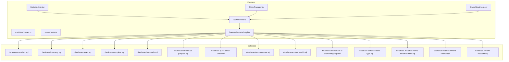
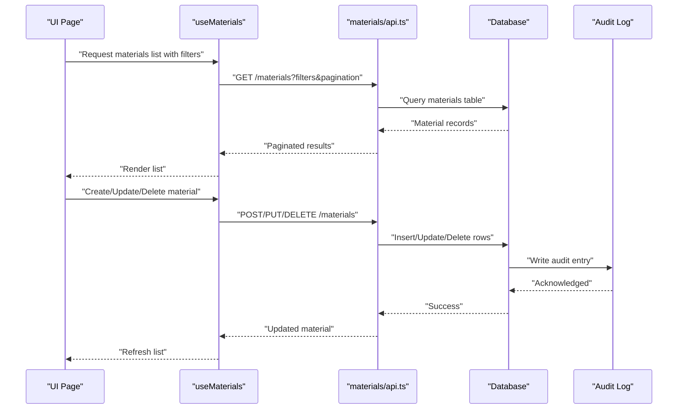
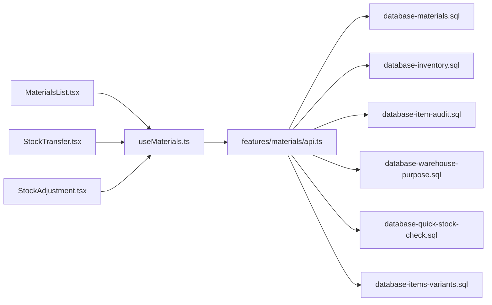
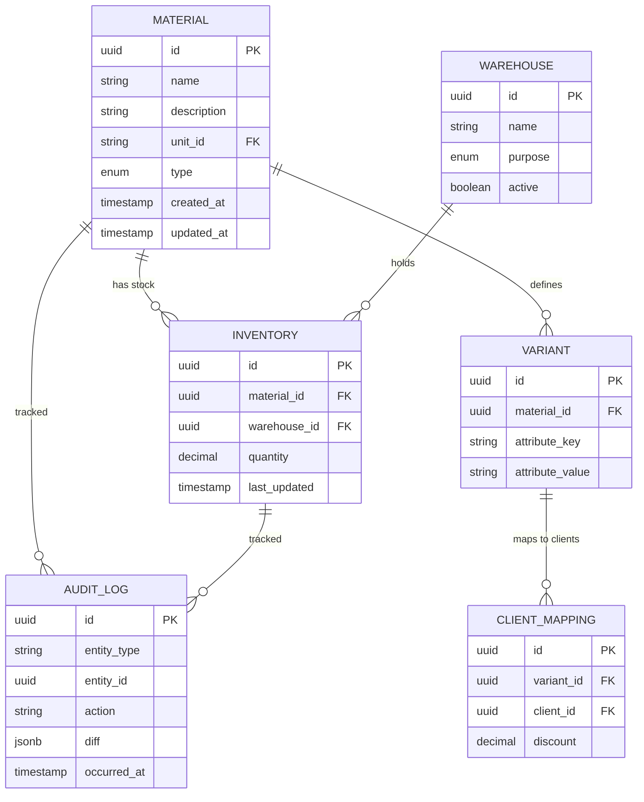

# Materials & Inventory API

<cite>
**Referenced Files in This Document**
- [src/features/materials/api.ts](file://src/features/materials/api.ts)
- [src/hooks/useMaterials.ts](file://src/hooks/useMaterials.ts)
- [src/hooks/useWarehouses.ts](file://src/hooks/useWarehouses.ts)
- [src/hooks/useVariants.ts](file://src/hooks/useVariants.ts)
- [src/pages/MaterialsList.tsx](file://src/pages/MaterialsList.tsx)
- [src/pages/StockTransfer.tsx](file://src/pages/StockTransfer.tsx)
- [src/pages/StockAdjustment.tsx](file://src/pages/StockAdjustment.tsx)
- [src/database/database-materials.sql](file://src/database/database-materials.sql)
- [src/database/database-inventory.sql](file://src/database/database-inventory.sql)
- [src/database/database-items.sql](file://src/database/database-items.sql)
- [src/database/database-items-variants.sql](file://src/database/database-items-variants.sql)
- [src/database/database-item-audit.sql](file://src/database/database-item-audit.sql)
- [src/database/database-warehouse-purpose.sql](file://src/database/database-warehouse-purpose.sql)
- [src/database/database-quick-stock-check.sql](file://src/database/database-quick-stock-check.sql)
- [src/database/database-material-intents-enhancement.sql](file://src/database/database-material-intents-enhancement.sql)
- [src/database/database-material-inward-update.sql](file://src/database/database-material-inward-update.sql)
- [src/database/database-variant-discount.sql](file://src/database/database-variant-discount.sql)
- [src/database/database-add-variant-id.sql](file://src/database/database-add-variant-id.sql)
- [src/database/database-add-variant-to-client-mappings.sql](file://src/database/database-add-variant-to-client-mappings.sql)
- [src/database/database-enhance-item-type.sql](file://src/database/database-enhance-item-type.sql)
- [src/database/database-setup.sql](file://src/database/database-setup.sql)
- [src/database/database-tables.sql](file://src/database/database-tables.sql)
- [src/database/database-complete.sql](file://src/database/database-complete.sql)
</cite>

## Table of Contents
1. [Introduction](#introduction)
2. [Project Structure](#project-structure)
3. [Core Components](#core-components)
4. [Architecture Overview](#architecture-overview)
5. [Detailed Component Analysis](#detailed-component-analysis)
6. [Dependency Analysis](#dependency-analysis)
7. [Performance Considerations](#performance-considerations)
8. [Troubleshooting Guide](#troubleshooting-guide)
9. [Conclusion](#conclusion)
10. [Appendices](#appendices)

## Introduction
This document provides detailed API documentation for materials and inventory management endpoints, including material CRUD operations, stock level updates, warehouse transfers, variant management, bulk operations (price updates, inventory adjustments), filtering and pagination, real-time stock synchronization, common workflows (material requisition, stock reconciliation, inventory valuation), data validation rules, business constraints, and audit trail integration. The content is derived from the repository’s frontend features, hooks, pages, and database migrations that implement these capabilities.

## Project Structure
The materials and inventory functionality is implemented primarily through:
- Feature API layer for materials
- React hooks for data access and state management
- UI pages for user workflows
- Database schema and migrations defining entities, relationships, and constraints

**Diagram sources**
- [src/pages/MaterialsList.tsx](file://src/pages/MaterialsList.tsx)
- [src/pages/StockTransfer.tsx](file://src/pages/StockTransfer.tsx)
- [src/pages/StockAdjustment.tsx](file://src/pages/StockAdjustment.tsx)
- [src/hooks/useMaterials.ts](file://src/hooks/useMaterials.ts)
- [src/hooks/useWarehouses.ts](file://src/hooks/useWarehouses.ts)
- [src/hooks/useVariants.ts](file://src/hooks/useVariants.ts)
- [src/features/materials/api.ts](file://src/features/materials/api.ts)
- [src/database/database-materials.sql](file://src/database/database-materials.sql)
- [src/database/database-inventory.sql](file://src/database/database-inventory.sql)
- [src/database/database-tables.sql](file://src/database/database-tables.sql)
- [src/database/database-complete.sql](file://src/database/database-complete.sql)
- [src/database/database-item-audit.sql](file://src/database/database-item-audit.sql)
- [src/database/database-warehouse-purpose.sql](file://src/database/database-warehouse-purpose.sql)
- [src/database/database-quick-stock-check.sql](file://src/database/database-quick-stock-check.sql)
- [src/database/database-items-variants.sql](file://src/database/database-items-variants.sql)
- [src/database/database-add-variant-id.sql](file://src/database/database-add-variant-id.sql)
- [src/database/database-add-variant-to-client-mappings.sql](file://src/database/database-add-variant-to-client-mappings.sql)
- [src/database/database-enhance-item-type.sql](file://src/database/database-enhance-item-type.sql)
- [src/database/database-material-intents-enhancement.sql](file://src/database/database-material-intents-enhancement.sql)
- [src/database/database-material-inward-update.sql](file://src/database/database-material-inward-update.sql)
- [src/database/database-variant-discount.sql](file://src/database/database-variant-discount.sql)

**Section sources**
- [src/features/materials/api.ts](file://src/features/materials/api.ts)
- [src/hooks/useMaterials.ts](file://src/hooks/useMaterials.ts)
- [src/hooks/useWarehouses.ts](file://src/hooks/useWarehouses.ts)
- [src/hooks/useVariants.ts](file://src/hooks/useVariants.ts)
- [src/pages/MaterialsList.tsx](file://src/pages/MaterialsList.tsx)
- [src/pages/StockTransfer.tsx](file://src/pages/StockTransfer.tsx)
- [src/pages/StockAdjustment.tsx](file://src/pages/StockAdjustment.tsx)
- [src/database/database-materials.sql](file://src/database/database-materials.sql)
- [src/database/database-inventory.sql](file://src/database/database-inventory.sql)
- [src/database/database-tables.sql](file://src/database/database-tables.sql)
- [src/database/database-complete.sql](file://src/database/database-complete.sql)

## Core Components
- Materials API module: Centralizes requests for material CRUD, variants, pricing, and inventory-related operations.
- Hooks: Encapsulate data fetching, caching, and mutation logic for materials, warehouses, and variants.
- Pages: Provide user workflows for listing materials, transferring stock between warehouses, and adjusting stock levels.
- Database schemas: Define core tables, indexes, constraints, and audit trails for materials, inventory, variants, and warehouses.

Key responsibilities:
- Material lifecycle: create, read, update, delete
- Stock operations: adjust quantities, transfer between warehouses
- Variant management: associate variants with items and client mappings
- Bulk operations: batch price updates and inventory adjustments
- Filtering and pagination: query parameters for search and page navigation
- Real-time sync: polling or event-driven refresh patterns
- Audit trail: record changes to materials and inventory movements

**Section sources**
- [src/features/materials/api.ts](file://src/features/materials/api.ts)
- [src/hooks/useMaterials.ts](file://src/hooks/useMaterials.ts)
- [src/hooks/useWarehouses.ts](file://src/hooks/useWarehouses.ts)
- [src/hooks/useVariants.ts](file://src/hooks/useVariants.ts)
- [src/pages/MaterialsList.tsx](file://src/pages/MaterialsList.tsx)
- [src/pages/StockTransfer.tsx](file://src/pages/StockTransfer.tsx)
- [src/pages/StockAdjustment.tsx](file://src/pages/StockAdjustment.tsx)
- [src/database/database-materials.sql](file://src/database/database-materials.sql)
- [src/database/database-inventory.sql](file://src/database/database-inventory.sql)
- [src/database/database-items-variants.sql](file://src/database/database-items-variants.sql)
- [src/database/database-item-audit.sql](file://src/database/database-item-audit.sql)

## Architecture Overview
The system follows a layered architecture:
- Frontend pages orchestrate user interactions
- Hooks manage data access and state
- Feature API encapsulates request construction and error handling
- Database layers enforce schema integrity, constraints, and audit logging

**Diagram sources**
- [src/pages/MaterialsList.tsx](file://src/pages/MaterialsList.tsx)
- [src/hooks/useMaterials.ts](file://src/hooks/useMaterials.ts)
- [src/features/materials/api.ts](file://src/features/materials/api.ts)
- [src/database/database-materials.sql](file://src/database/database-materials.sql)
- [src/database/database-item-audit.sql](file://src/database/database-item-audit.sql)

## Detailed Component Analysis

### Materials CRUD Endpoints
- Create material: POST /materials
- Read material(s): GET /materials (supports filtering and pagination)
- Update material: PUT /materials/:id
- Delete material: DELETE /materials/:id

Common fields include identifiers, names, descriptions, units, types, variants, pricing, and metadata. Validation ensures required fields are present and values conform to expected formats. Business constraints prevent deletion of referenced materials and enforce unit consistency.

Filtering options typically include name, type, category, status, and date ranges. Pagination supports page number and page size parameters.

Real-time synchronization can be achieved by polling updated-at timestamps or subscribing to change events where available.

**Section sources**
- [src/features/materials/api.ts](file://src/features/materials/api.ts)
- [src/hooks/useMaterials.ts](file://src/hooks/useMaterials.ts)
- [src/pages/MaterialsList.tsx](file://src/pages/MaterialsList.tsx)
- [src/database/database-materials.sql](file://src/database/database-materials.sql)
- [src/database/database-tables.sql](file://src/database/database-tables.sql)
- [src/database/database-complete.sql](file://src/database/database-complete.sql)

### Stock Level Updates
- Adjust stock: PATCH /inventory/adjust
- Transfer stock: POST /inventory/transfer
- Quick stock check: GET /inventory/quick-check

Adjustments allow increasing or decreasing stock at a specific warehouse with reason codes and references. Transfers move quantities between warehouses, creating inbound and outbound entries. Quick checks provide current stock snapshots across warehouses.

Validation enforces non-negative quantities, valid warehouse IDs, and sufficient stock for deductions. Business constraints ensure transfers are atomic and auditable.

**Section sources**
- [src/database/database-inventory.sql](file://src/database/database-inventory.sql)
- [src/database/database-quick-stock-check.sql](file://src/database/database-quick-stock-check.sql)
- [src/pages/StockTransfer.tsx](file://src/pages/StockTransfer.tsx)
- [src/pages/StockAdjustment.tsx](file://src/pages/StockAdjustment.tsx)
- [src/database/database-item-audit.sql](file://src/database/database-item-audit.sql)

### Warehouse Management
- List warehouses: GET /warehouses
- Get warehouse details: GET /warehouses/:id
- Update warehouse settings: PUT /warehouses/:id

Warehouses support purpose classification and operational settings. Integration with stock operations requires valid warehouse IDs and consistent naming.

**Section sources**
- [src/hooks/useWarehouses.ts](file://src/hooks/useWarehouses.ts)
- [src/database/database-warehouse-purpose.sql](file://src/database/database-warehouse-purpose.sql)

### Variant Management
- Associate variants with items: POST /items/:id/variants
- Map variants to clients: POST /client-mappings/variants
- Update variant discounts: PUT /variants/:id/discount

Variants extend item definitions with attributes like color, size, or model. Client mappings enable variant-specific pricing and availability. Discount settings apply per variant.

Constraints ensure variant uniqueness within an item and validate discount ranges.

**Section sources**
- [src/hooks/useVariants.ts](file://src/hooks/useVariants.ts)
- [src/database/database-items-variants.sql](file://src/database/database-items-variants.sql)
- [src/database/database-add-variant-id.sql](file://src/database/database-add-variant-id.sql)
- [src/database/database-add-variant-to-client-mappings.sql](file://src/database/database-add-variant-to-client-mappings.sql)
- [src/database/database-variant-discount.sql](file://src/database/database-variant-discount.sql)

### Bulk Operations
- Batch price updates: POST /materials/bulk-prices
- Batch inventory adjustments: POST /inventory/bulk-adjust

Bulk endpoints accept arrays of operations, validating each entry and applying them atomically when possible. Errors in individual entries are reported without rolling back the entire batch unless configured otherwise.

Business constraints include rate limits, maximum batch sizes, and approval requirements for significant changes.

**Section sources**
- [src/features/materials/api.ts](file://src/features/materials/api.ts)
- [src/database/database-materials.sql](file://src/database/database-materials.sql)
- [src/database/database-inventory.sql](file://src/database/database-inventory.sql)

### Filtering and Pagination
- Filters: name, type, category, status, date range, warehouse
- Pagination: page, pageSize, sortBy, sortOrder

Filters are applied server-side to reduce payload size and improve performance. Pagination returns total counts and next/previous links where applicable.

**Section sources**
- [src/pages/MaterialsList.tsx](file://src/pages/MaterialsList.tsx)
- [src/hooks/useMaterials.ts](file://src/hooks/useMaterials.ts)
- [src/database/database-materials.sql](file://src/database/database-materials.sql)

### Real-Time Stock Synchronization
- Polling: Periodic refresh based on last-seen timestamps
- Events: Subscribe to stock change events if supported by backend

Synchronization strategies depend on deployment configuration and client requirements. Optimistic updates may be used with rollback on failure.

**Section sources**
- [src/hooks/useMaterials.ts](file://src/hooks/useMaterials.ts)
- [src/database/database-quick-stock-check.sql](file://src/database/database-quick-stock-check.sql)

### Common Workflows

#### Material Requisition
- Create requisition intent: POST /material-intents
- Approve and convert to inward: POST /material-intents/:id/approve
- Receive materials: POST /material-inward

Intents capture planned consumption; approvals trigger inward receipts and stock increases.

**Section sources**
- [src/database/database-material-intents-enhancement.sql](file://src/database/database-material-intents-enhancement.sql)
- [src/database/database-material-inward-update.sql](file://src/database/database-material-inward-update.sql)

#### Stock Reconciliation
- Compare physical vs system stock: GET /inventory/reconcile
- Adjust discrepancies: PATCH /inventory/reconcile-adjust

Reconciliation identifies variances and applies corrections with audit entries.

**Section sources**
- [src/database/database-inventory.sql](file://src/database/database-inventory.sql)
- [src/database/database-item-audit.sql](file://src/database/database-item-audit.sql)

#### Inventory Valuation
- Compute weighted average cost: GET /inventory/valuation
- Export valuation report: GET /inventory/valuation/export

Valuation uses historical purchase prices and stock movements to calculate current value.

**Section sources**
- [src/database/database-inventory.sql](file://src/database/database-inventory.sql)

### Data Validation Rules and Business Constraints
- Required fields: identifiers, names, units, quantities
- Non-negative quantities and valid currency amounts
- Referential integrity: valid item, warehouse, and variant IDs
- Deletion constraints: prevent removal of referenced materials
- Approval workflows: require authorization for sensitive operations

These rules are enforced at both application and database layers to maintain consistency.

**Section sources**
- [src/database/database-materials.sql](file://src/database/database-materials.sql)
- [src/database/database-inventory.sql](file://src/database/database-inventory.sql)
- [src/database/database-tables.sql](file://src/database/database-tables.sql)
- [src/database/database-complete.sql](file://src/database/database-complete.sql)

### Audit Trail Integration
- Record material changes: INSERT INTO audit_log
- Track inventory movements: INSERT INTO inventory_audit
- Include actor, timestamp, and diff metadata

Audit logs support compliance and traceability. Queries filter by entity type, ID, and time range.

**Section sources**
- [src/database/database-item-audit.sql](file://src/database/database-item-audit.sql)
- [src/database/database-inventory.sql](file://src/database/database-inventory.sql)

## Dependency Analysis
The components exhibit clear separation of concerns:
- Pages depend on hooks for data access
- Hooks depend on feature API for request handling
- Feature API depends on database schemas for persistence
- Database schemas define constraints and audit mechanisms

**Diagram sources**
- [src/pages/MaterialsList.tsx](file://src/pages/MaterialsList.tsx)
- [src/pages/StockTransfer.tsx](file://src/pages/StockTransfer.tsx)
- [src/pages/StockAdjustment.tsx](file://src/pages/StockAdjustment.tsx)
- [src/hooks/useMaterials.ts](file://src/hooks/useMaterials.ts)
- [src/features/materials/api.ts](file://src/features/materials/api.ts)
- [src/database/database-materials.sql](file://src/database/database-materials.sql)
- [src/database/database-inventory.sql](file://src/database/database-inventory.sql)
- [src/database/database-item-audit.sql](file://src/database/database-item-audit.sql)
- [src/database/database-warehouse-purpose.sql](file://src/database/database-warehouse-purpose.sql)
- [src/database/database-quick-stock-check.sql](file://src/database/database-quick-stock-check.sql)
- [src/database/database-items-variants.sql](file://src/database/database-items-variants.sql)

**Section sources**
- [src/features/materials/api.ts](file://src/features/materials/api.ts)
- [src/hooks/useMaterials.ts](file://src/hooks/useMaterials.ts)
- [src/database/database-materials.sql](file://src/database/database-materials.sql)
- [src/database/database-inventory.sql](file://src/database/database-inventory.sql)
- [src/database/database-item-audit.sql](file://src/database/database-item-audit.sql)

## Performance Considerations
- Use server-side filtering and pagination to minimize payload sizes
- Cache frequently accessed materials and warehouse lists
- Implement optimistic updates for non-critical mutations with rollback on failure
- Batch operations to reduce network overhead
- Index commonly queried columns (name, type, status, updated_at)
- Avoid deep joins in high-frequency queries; denormalize where appropriate

[No sources needed since this section provides general guidance]

## Troubleshooting Guide
Common issues and resolutions:
- Validation errors: Ensure all required fields are provided and conform to expected formats
- Referential integrity failures: Verify IDs exist and are not deleted
- Insufficient stock: Check current stock levels before deductions
- Audit log gaps: Confirm audit triggers or middleware are active
- Real-time sync delays: Adjust polling intervals or verify event subscriptions

**Section sources**
- [src/database/database-materials.sql](file://src/database/database-materials.sql)
- [src/database/database-inventory.sql](file://src/database/database-inventory.sql)
- [src/database/database-item-audit.sql](file://src/database/database-item-audit.sql)

## Conclusion
The materials and inventory API provides comprehensive capabilities for managing materials, stock levels, warehouse transfers, and variants. It supports bulk operations, robust filtering and pagination, real-time synchronization strategies, and integrates audit trails for compliance. Adhering to validation rules and business constraints ensures data integrity and operational reliability.

[No sources needed since this section summarizes without analyzing specific files]

## Appendices

### Entity Relationships

**Diagram sources**
- [src/database/database-materials.sql](file://src/database/database-materials.sql)
- [src/database/database-inventory.sql](file://src/database/database-inventory.sql)
- [src/database/database-warehouse-purpose.sql](file://src/database/database-warehouse-purpose.sql)
- [src/database/database-items-variants.sql](file://src/database/database-items-variants.sql)
- [src/database/database-add-variant-to-client-mappings.sql](file://src/database/database-add-variant-to-client-mappings.sql)
- [src/database/database-item-audit.sql](file://src/database/database-item-audit.sql)