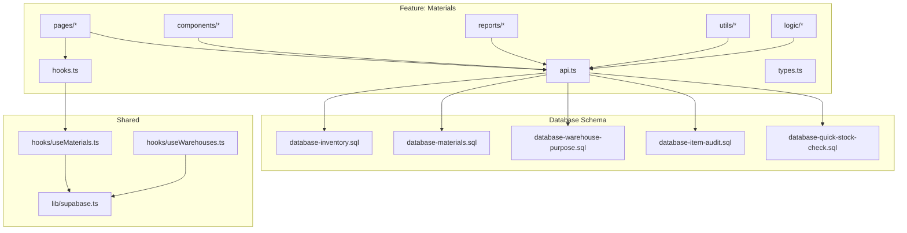
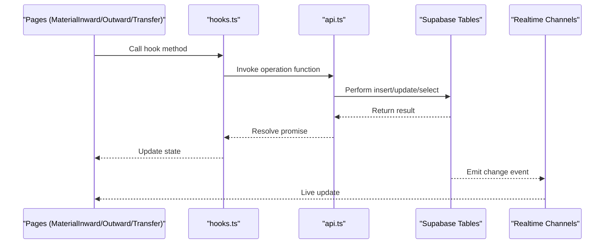
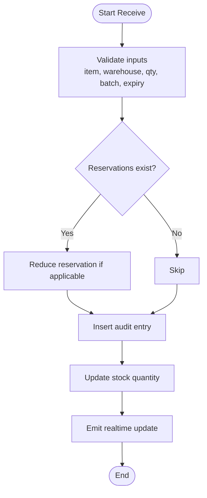
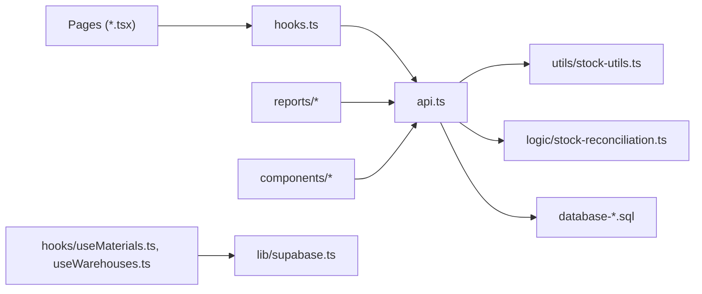
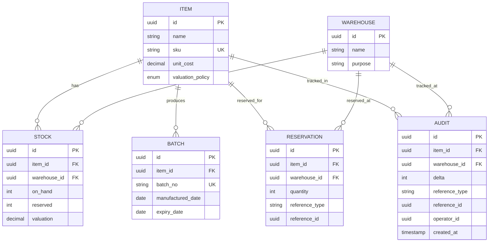

# Stock Management API

<cite>
**Referenced Files in This Document**
- [src/features/materials/api.ts](file://src/features/materials/api.ts)
- [src/features/materials/hooks.ts](file://src/features/materials/hooks.ts)
- [src/features/materials/types.ts](file://src/features/materials/types.ts)
- [src/features/materials/pages/MaterialInward.tsx](file://src/features/materials/pages/MaterialInward.tsx)
- [src/features/materials/pages/MaterialOutward.tsx](file://src/features/materials/pages/MaterialOutward.tsx)
- [src/features/materials/pages/StockTransfer.tsx](file://src/features/materials/pages/StockTransfer.tsx)
- [src/features/materials/pages/StockAdjustment.tsx](file://src/features/materials/pages/StockAdjustment.tsx)
- [src/features/materials/pages/QuickStockCheck.tsx](file://src/features/materials/pages/QuickStockCheck.tsx)
- [src/features/materials/pages/QuickStockCheckList.tsx](file://src/features/materials/pages/QuickStockCheckList.tsx)
- [src/features/materials/utils/stock-utils.ts](file://src/features/materials/utils/stock-utils.ts)
- [src/features/materials/logic/stock-reconciliation.ts](file://src/features/materials/logic/stock-reconciliation.ts)
- [src/features/materials/components/StockReservationModal.tsx](file://src/features/materials/components/StockReservationModal.tsx)
- [src/features/materials/components/BatchTrackingPanel.tsx](file://src/features/materials/components/BatchTrackingPanel.tsx)
- [src/features/materials/components/ExpiryDateManager.tsx](file://src/features/materials/components/ExpiryDateManager.tsx)
- [src/features/materials/reports/inventory-report-generator.ts](file://src/features/materials/reports/inventory-report-generator.ts)
- [src/features/materials/reports/low-stock-alerts.ts](file://src/features/materials/reports/low-stock-alerts.ts)
- [src/database/database-inventory.sql](file://src/database/database-inventory.sql)
- [src/database/database-materials.sql](file://src/database/database-materials.sql)
- [src/database/database-warehouse-purpose.sql](file://src/database/database-warehouse-purpose.sql)
- [src/database/database-item-audit.sql](file://src/database/database-item-audit.sql)
- [src/database/database-quick-stock-check.sql](file://src/database/database-quick-stock-check.sql)
- [src/hooks/useMaterials.ts](file://src/hooks/useMaterials.ts)
- [src/hooks/useWarehouses.ts](file://src/hooks/useWarehouses.ts)
- [src/lib/supabase.ts](file://src/lib/supabase.ts)
</cite>

## Table of Contents
1. [Introduction](#introduction)
2. [Project Structure](#project-structure)
3. [Core Components](#core-components)
4. [Architecture Overview](#architecture-overview)
5. [Detailed Component Analysis](#detailed-component-analysis)
6. [Dependency Analysis](#dependency-analysis)
7. [Performance Considerations](#performance-considerations)
8. [Troubleshooting Guide](#troubleshooting-guide)
9. [Conclusion](#conclusion)
10. [Appendices](#appendices)

## Introduction
This document provides detailed API documentation for stock management and inventory tracking endpoints within the application. It covers stock level updates, inventory adjustments, real-time synchronization, warehouse-specific operations, inter-location transfers, reconciliation processes, transaction history, valuation calculations, low stock alerts, reservations, batch tracking, expiry date management, and common workflows such as receiving goods, issuing materials, conducting stock audits, and generating inventory reports.

The implementation is primarily client-side with Supabase-backed data access patterns. Endpoints are represented by TypeScript functions and hooks that interact with database tables via Supabase clients. The repository also includes SQL migrations defining core schema elements used by these APIs.

## Project Structure
The stock management functionality is organized under a feature-based structure:
- Feature module: src/features/materials
  - API layer: api.ts
  - Hooks: hooks.ts
  - Types: types.ts
  - Pages (UI flows): MaterialInward, MaterialOutward, StockTransfer, StockAdjustment, QuickStockCheck, QuickStockCheckList
  - Utilities and logic: utils/, logic/
  - Components: components/
  - Reports: reports/
- Database schema and migrations: src/database/*.sql
- Shared hooks and utilities: src/hooks/*, src/lib/supabase.ts

**Diagram sources**
- [src/features/materials/api.ts](file://src/features/materials/api.ts)
- [src/features/materials/hooks.ts](file://src/features/materials/hooks.ts)
- [src/features/materials/types.ts](file://src/features/materials/types.ts)
- [src/features/materials/pages/MaterialInward.tsx](file://src/features/materials/pages/MaterialInward.tsx)
- [src/features/materials/pages/MaterialOutward.tsx](file://src/features/materials/pages/MaterialOutward.tsx)
- [src/features/materials/pages/StockTransfer.tsx](file://src/features/materials/pages/StockTransfer.tsx)
- [src/features/materials/pages/StockAdjustment.tsx](file://src/features/materials/pages/StockAdjustment.tsx)
- [src/features/materials/pages/QuickStockCheck.tsx](file://src/features/materials/pages/QuickStockCheck.tsx)
- [src/features/materials/pages/QuickStockCheckList.tsx](file://src/features/materials/pages/QuickStockCheckList.tsx)
- [src/features/materials/utils/stock-utils.ts](file://src/features/materials/utils/stock-utils.ts)
- [src/features/materials/logic/stock-reconciliation.ts](file://src/features/materials/logic/stock-reconciliation.ts)
- [src/features/materials/components/StockReservationModal.tsx](file://src/features/materials/components/StockReservationModal.tsx)
- [src/features/materials/components/BatchTrackingPanel.tsx](file://src/features/materials/components/BatchTrackingPanel.tsx)
- [src/features/materials/components/ExpiryDateManager.tsx](file://src/features/materials/components/ExpiryDateManager.tsx)
- [src/features/materials/reports/inventory-report-generator.ts](file://src/features/materials/reports/inventory-report-generator.ts)
- [src/features/materials/reports/low-stock-alerts.ts](file://src/features/materials/reports/low-stock-alerts.ts)
- [src/database/database-inventory.sql](file://src/database/database-inventory.sql)
- [src/database/database-materials.sql](file://src/database/database-materials.sql)
- [src/database/database-warehouse-purpose.sql](file://src/database/database-warehouse-purpose.sql)
- [src/database/database-item-audit.sql](file://src/database/database-item-audit.sql)
- [src/database/database-quick-stock-check.sql](file://src/database/database-quick-stock-check.sql)
- [src/hooks/useMaterials.ts](file://src/hooks/useMaterials.ts)
- [src/hooks/useWarehouses.ts](file://src/hooks/useWarehouses.ts)
- [src/lib/supabase.ts](file://src/lib/supabase.ts)

**Section sources**
- [src/features/materials/api.ts](file://src/features/materials/api.ts)
- [src/features/materials/hooks.ts](file://src/features/materials/hooks.ts)
- [src/features/materials/types.ts](file://src/features/materials/types.ts)
- [src/database/database-inventory.sql](file://src/database/database-inventory.sql)
- [src/database/database-materials.sql](file://src/database/database-materials.sql)
- [src/database/database-warehouse-purpose.sql](file://src/database/database-warehouse-purpose.sql)
- [src/database/database-item-audit.sql](file://src/database/database-item-audit.sql)
- [src/database/database-quick-stock-check.sql](file://src/database/database-quick-stock-check.sql)
- [src/hooks/useMaterials.ts](file://src/hooks/useMaterials.ts)
- [src/hooks/useWarehouses.ts](file://src/hooks/useWarehouses.ts)
- [src/lib/supabase.ts](file://src/lib/supabase.ts)

## Core Components
- API Layer (api.ts): Centralized functions to perform CRUD and business operations on stock-related entities. These functions encapsulate Supabase queries and orchestrate multi-step transactions where needed.
- Hooks (hooks.ts): React hooks that wrap API calls for UI consumption, providing caching, loading states, and error handling.
- Types (types.ts): Shared TypeScript interfaces and enums for stock items, warehouses, batches, reservations, and audit entries.
- Pages: User-facing flows for inbound/outbound movements, transfers, adjustments, and quick checks.
- Utilities and Logic: Helpers for stock calculations, reconciliation algorithms, and validation rules.
- Components: Reusable UI components for reservations, batch tracking, and expiry management.
- Reports: Functions to generate inventory reports and low stock alerts.

Key responsibilities:
- Stock level updates: Increment/decrement quantities per item and warehouse.
- Inventory adjustments: Record corrections with reasons and approvals.
- Real-time sync: Subscribe to changes using Supabase realtime channels.
- Warehouse-specific operations: Scoped reads/writes by warehouse_id.
- Transfers: Atomic debit from source and credit to destination.
- Reconciliation: Compare system vs physical counts and propose adjustments.
- Transaction history: Append immutable audit records for traceability.
- Valuation: Compute weighted average or FIFO cost based on configured policy.
- Low stock alerts: Threshold-based notifications.
- Reservations: Reserve available quantity against orders or jobs.
- Batch tracking: Track lot/batch identifiers and associated metadata.
- Expiry management: Enforce expiry dates and FEFO issuance.

**Section sources**
- [src/features/materials/api.ts](file://src/features/materials/api.ts)
- [src/features/materials/hooks.ts](file://src/features/materials/hooks.ts)
- [src/features/materials/types.ts](file://src/features/materials/types.ts)
- [src/features/materials/utils/stock-utils.ts](file://src/features/materials/utils/stock-utils.ts)
- [src/features/materials/logic/stock-reconciliation.ts](file://src/features/materials/logic/stock-reconciliation.ts)
- [src/features/materials/reports/inventory-report-generator.ts](file://src/features/materials/reports/inventory-report-generator.ts)
- [src/features/materials/reports/low-stock-alerts.ts](file://src/features/materials/reports/low-stock-alerts.ts)

## Architecture Overview
The architecture follows a layered approach:
- UI pages call hooks which invoke API functions.
- API functions use Supabase client to query/update tables.
- Database schema defines core entities and constraints.
- Realtime subscriptions enable live updates across clients.

**Diagram sources**
- [src/features/materials/pages/MaterialInward.tsx](file://src/features/materials/pages/MaterialInward.tsx)
- [src/features/materials/pages/MaterialOutward.tsx](file://src/features/materials/pages/MaterialOutward.tsx)
- [src/features/materials/pages/StockTransfer.tsx](file://src/features/materials/pages/StockTransfer.tsx)
- [src/features/materials/hooks.ts](file://src/features/materials/hooks.ts)
- [src/features/materials/api.ts](file://src/features/materials/api.ts)
- [src/lib/supabase.ts](file://src/lib/supabase.ts)

## Detailed Component Analysis

### Stock Level Updates
Purpose: Adjust on-hand quantities for an item at a specific warehouse.

Common operations:
- Receive goods: Increase stock with batch/expiry details.
- Issue materials: Decrease stock respecting reservations and expiry policies.
- Transfer stock: Debit source, credit destination atomically.

Request/response model:
- Input fields include item_id, warehouse_id, quantity_delta, reference_type, reference_id, batch_no, expiry_date, reason, operator_id.
- Output includes updated stock snapshot and appended audit entry.

Validation and constraints:
- Non-negative resulting quantity unless negative adjustment is explicitly allowed.
- Reservation availability check before deduction.
- Expiry enforcement for FEFO issuance.

Real-time behavior:
- Subscriptions to stock table changes refresh UI immediately.

Example workflow: Receiving Goods

**Diagram sources**
- [src/features/materials/pages/MaterialInward.tsx](file://src/features/materials/pages/MaterialInward.tsx)
- [src/features/materials/api.ts](file://src/features/materials/api.ts)
- [src/features/materials/utils/stock-utils.ts](file://src/features/materials/utils/stock-utils.ts)
- [src/database/database-inventory.sql](file://src/database/database-inventory.sql)
- [src/database/database-item-audit.sql](file://src/database/database-item-audit.sql)

**Section sources**
- [src/features/materials/api.ts](file://src/features/materials/api.ts)
- [src/features/materials/pages/MaterialInward.tsx](file://src/features/materials/pages/MaterialInward.tsx)
- [src/database/database-inventory.sql](file://src/database/database-inventory.sql)
- [src/database/database-item-audit.sql](file://src/database/database-item-audit.sql)

### Inventory Adjustments
Purpose: Correct stock discrepancies due to damage, shrinkage, or errors.

Workflow:
- Initiate adjustment with reason code and supporting notes.
- Optional approval flow depending on organization settings.
- Post adjustment audit entry and update stock.

Constraints:
- Adjustment type determines sign of delta.
- Audit trail required for all adjustments.

**Section sources**
- [src/features/materials/pages/StockAdjustment.tsx](file://src/features/materials/pages/StockAdjustment.tsx)
- [src/features/materials/api.ts](file://src/features/materials/api.ts)
- [src/database/database-item-audit.sql](file://src/database/database-item-audit.sql)

### Real-time Stock Synchronization
Mechanism:
- Use Supabase realtime channels to subscribe to stock and audit table changes.
- Client-side cache invalidation triggers UI refresh.

Considerations:
- Debounce rapid updates during bulk operations.
- Handle offline scenarios gracefully.

**Section sources**
- [src/features/materials/hooks.ts](file://src/features/materials/hooks.ts)
- [src/lib/supabase.ts](file://src/lib/supabase.ts)

### Warehouse-Specific Operations
Scope:
- All stock operations are scoped by warehouse_id.
- Warehouse metadata and purpose influence availability and reporting.

Access control:
- RLS policies ensure users can only access permitted warehouses.

**Section sources**
- [src/database/database-warehouse-purpose.sql](file://src/database/database-warehouse-purpose.sql)
- [src/hooks/useWarehouses.ts](file://src/hooks/useWarehouses.ts)

### Stock Transfers Between Locations
Atomicity:
- Transfer debits source warehouse and credits destination warehouse within a single transaction.
- Ensures consistency even under concurrent operations.

Data captured:
- Transfer ID, source/destination warehouses, item, quantity, batch/expiry, reason, timestamps.

**Section sources**
- [src/features/materials/pages/StockTransfer.tsx](file://src/features/materials/pages/StockTransfer.tsx)
- [src/features/materials/api.ts](file://src/features/materials/api.ts)
- [src/database/database-inventory.sql](file://src/database/database-inventory.sql)

### Stock Reconciliation Processes
Algorithm:
- Compare system stock vs physical count.
- Generate variance report with suggested adjustments.
- Approve and post adjustments after review.

Outputs:
- Reconciliation summary, variances, recommended actions.

**Section sources**
- [src/features/materials/logic/stock-reconciliation.ts](file://src/features/materials/logic/stock-reconciliation.ts)
- [src/features/materials/pages/QuickStockCheck.tsx](file://src/features/materials/pages/QuickStockCheck.tsx)
- [src/database/database-quick-stock-check.sql](file://src/database/database-quick-stock-check.sql)

### Transaction History Tracking
Design:
- Immutable audit entries record every stock movement.
- Fields include item, warehouse, delta, reference, batch/expiry, operator, timestamp.

Queries:
- Filter by item, warehouse, date range, reference type.

**Section sources**
- [src/database/database-item-audit.sql](file://src/database/database-item-audit.sql)
- [src/features/materials/api.ts](file://src/features/materials/api.ts)

### Stock Valuation Calculations
Policies:
- Weighted Average Cost (WAC) or First-Expired-First-Out (FEFO).
- Valuation computed per item per warehouse.

Inputs:
- Purchase costs, issue costs, current stock layers.

Outputs:
- Current valuation, COGS estimates, inventory value reports.

**Section sources**
- [src/features/materials/utils/stock-utils.ts](file://src/features/materials/utils/stock-utils.ts)
- [src/features/materials/reports/inventory-report-generator.ts](file://src/features/materials/reports/inventory-report-generator.ts)

### Low Stock Alerts
Thresholds:
- Per-item minimum stock levels configurable.
- Alerts triggered when on-hand falls below threshold.

Delivery:
- In-app notifications and optional email/SMS integration.

**Section sources**
- [src/features/materials/reports/low-stock-alerts.ts](file://src/features/materials/reports/low-stock-alerts.ts)

### Stock Reservation System
Concept:
- Reserve available quantity for sales orders, job cards, or internal requests.
- Reduces available-to-reserve without affecting on-hand until issued.

Operations:
- Create, update, release reservations.
- Deduct reserved quantity upon issuance.

**Section sources**
- [src/features/materials/components/StockReservationModal.tsx](file://src/features/materials/components/StockReservationModal.tsx)
- [src/features/materials/api.ts](file://src/features/materials/api.ts)

### Batch Tracking
Features:
- Assign batch/lot numbers to receipts.
- Track batch metadata (manufacturer, PO, receipt date).
- Support FEFO issuance based on expiry.

**Section sources**
- [src/features/materials/components/BatchTrackingPanel.tsx](file://src/features/materials/components/BatchTrackingPanel.tsx)
- [src/database/database-inventory.sql](file://src/database/database-inventory.sql)

### Expiry Date Management
Rules:
- Enforce expiry dates on batches.
- Prevent issuing expired stock.
- Highlight near-expiry items for proactive action.

**Section sources**
- [src/features/materials/components/ExpiryDateManager.tsx](file://src/features/materials/components/ExpiryDateManager.tsx)
- [src/database/database-inventory.sql](file://src/database/database-inventory.sql)

### Common Workflows

#### Receiving Goods
Steps:
- Select item, warehouse, supplier reference.
- Enter quantity, batch number, expiry date.
- Confirm receipt; system updates stock and logs audit.

**Section sources**
- [src/features/materials/pages/MaterialInward.tsx](file://src/features/materials/pages/MaterialInward.tsx)
- [src/features/materials/api.ts](file://src/features/materials/api.ts)

#### Issuing Materials
Steps:
- Choose item, warehouse, request reference.
- System suggests batches by FEFO policy.
- Confirm issue; system deducts stock and logs audit.

**Section sources**
- [src/features/materials/pages/MaterialOutward.tsx](file://src/features/materials/pages/MaterialOutward.tsx)
- [src/features/materials/api.ts](file://src/features/materials/api.ts)

#### Conducting Stock Audits
Steps:
- Initiate quick stock check for selected items/warehouses.
- Record physical counts.
- Review variances and approve adjustments.

**Section sources**
- [src/features/materials/pages/QuickStockCheck.tsx](file://src/features/materials/pages/QuickStockCheck.tsx)
- [src/features/materials/pages/QuickStockCheckList.tsx](file://src/features/materials/pages/QuickStockCheckList.tsx)
- [src/database/database-quick-stock-check.sql](file://src/database/database-quick-stock-check.sql)

#### Generating Inventory Reports
Capabilities:
- On-hand summary by item and warehouse.
- Valuation report by WAC or FEFO.
- Movement history and audit trails.

**Section sources**
- [src/features/materials/reports/inventory-report-generator.ts](file://src/features/materials/reports/inventory-report-generator.ts)
- [src/database/database-materials.sql](file://src/database/database-materials.sql)

## Dependency Analysis
High-level dependencies:
- Features depend on shared hooks and Supabase client.
- Pages depend on hooks and API layer.
- Reports depend on API and utility functions.
- Database schema files define tables and constraints used by API.

**Diagram sources**
- [src/features/materials/pages/MaterialInward.tsx](file://src/features/materials/pages/MaterialInward.tsx)
- [src/features/materials/pages/MaterialOutward.tsx](file://src/features/materials/pages/MaterialOutward.tsx)
- [src/features/materials/pages/StockTransfer.tsx](file://src/features/materials/pages/StockTransfer.tsx)
- [src/features/materials/pages/StockAdjustment.tsx](file://src/features/materials/pages/StockAdjustment.tsx)
- [src/features/materials/pages/QuickStockCheck.tsx](file://src/features/materials/pages/QuickStockCheck.tsx)
- [src/features/materials/pages/QuickStockCheckList.tsx](file://src/features/materials/pages/QuickStockCheckList.tsx)
- [src/features/materials/hooks.ts](file://src/features/materials/hooks.ts)
- [src/features/materials/api.ts](file://src/features/materials/api.ts)
- [src/features/materials/utils/stock-utils.ts](file://src/features/materials/utils/stock-utils.ts)
- [src/features/materials/logic/stock-reconciliation.ts](file://src/features/materials/logic/stock-reconciliation.ts)
- [src/features/materials/reports/inventory-report-generator.ts](file://src/features/materials/reports/inventory-report-generator.ts)
- [src/features/materials/components/StockReservationModal.tsx](file://src/features/materials/components/StockReservationModal.tsx)
- [src/features/materials/components/BatchTrackingPanel.tsx](file://src/features/materials/components/BatchTrackingPanel.tsx)
- [src/features/materials/components/ExpiryDateManager.tsx](file://src/features/materials/components/ExpiryDateManager.tsx)
- [src/database/database-inventory.sql](file://src/database/database-inventory.sql)
- [src/database/database-materials.sql](file://src/database/database-materials.sql)
- [src/database/database-warehouse-purpose.sql](file://src/database/database-warehouse-purpose.sql)
- [src/database/database-item-audit.sql](file://src/database/database-item-audit.sql)
- [src/database/database-quick-stock-check.sql](file://src/database/database-quick-stock-check.sql)
- [src/hooks/useMaterials.ts](file://src/hooks/useMaterials.ts)
- [src/hooks/useWarehouses.ts](file://src/hooks/useWarehouses.ts)
- [src/lib/supabase.ts](file://src/lib/supabase.ts)

**Section sources**
- [src/features/materials/api.ts](file://src/features/materials/api.ts)
- [src/features/materials/hooks.ts](file://src/features/materials/hooks.ts)
- [src/database/database-inventory.sql](file://src/database/database-inventory.sql)
- [src/database/database-materials.sql](file://src/database/database-materials.sql)
- [src/database/database-warehouse-purpose.sql](file://src/database/database-warehouse-purpose.sql)
- [src/database/database-item-audit.sql](file://src/database/database-item-audit.sql)
- [src/database/database-quick-stock-check.sql](file://src/database/database-quick-stock-check.sql)
- [src/hooks/useMaterials.ts](file://src/hooks/useMaterials.ts)
- [src/hooks/useWarehouses.ts](file://src/hooks/useWarehouses.ts)
- [src/lib/supabase.ts](file://src/lib/supabase.ts)

## Performance Considerations
- Prefer batch operations for bulk updates to reduce round trips.
- Use pagination and filtering for large datasets in reports.
- Debounce realtime updates to avoid excessive re-renders.
- Cache frequently accessed master data (items, warehouses) locally.
- Index critical columns (item_id, warehouse_id, created_at) in database schema.

[No sources needed since this section provides general guidance]

## Troubleshooting Guide
Common issues and resolutions:
- Negative stock after issue: Verify reservation availability and FEFO selection logic.
- Transfer inconsistency: Ensure atomic transaction boundaries and retry on conflicts.
- Stale UI data: Confirm realtime subscription setup and cache invalidation.
- Approval failures: Check organization settings and permission policies.

Diagnostic steps:
- Inspect audit trail for the affected item and warehouse.
- Review quick stock check results and variances.
- Validate batch/expiry metadata integrity.

**Section sources**
- [src/features/materials/pages/StockAdjustment.tsx](file://src/features/materials/pages/StockAdjustment.tsx)
- [src/features/materials/pages/StockTransfer.tsx](file://src/features/materials/pages/StockTransfer.tsx)
- [src/features/materials/pages/QuickStockCheck.tsx](file://src/features/materials/pages/QuickStockCheck.tsx)
- [src/database/database-item-audit.sql](file://src/database/database-item-audit.sql)

## Conclusion
The stock management API provides comprehensive capabilities for inventory control, including precise stock updates, robust transfer mechanisms, reconciliation tools, and rich reporting. With built-in support for reservations, batch tracking, and expiry management, it enables accurate and compliant inventory operations. Real-time synchronization ensures consistent views across users, while audit trails maintain full traceability.

[No sources needed since this section summarizes without analyzing specific files]

## Appendices

### Data Models Overview
Core entities involved in stock management:
- Items: Master product definitions.
- Warehouses: Storage locations with purpose and permissions.
- Stock: On-hand quantities per item per warehouse.
- Batches: Lot identifiers with metadata and expiry.
- Reservations: Reserved quantities against requests.
- Audit: Immutable records of all stock movements.

**Diagram sources**
- [src/database/database-materials.sql](file://src/database/database-materials.sql)
- [src/database/database-warehouse-purpose.sql](file://src/database/database-warehouse-purpose.sql)
- [src/database/database-inventory.sql](file://src/database/database-inventory.sql)
- [src/database/database-item-audit.sql](file://src/database/database-item-audit.sql)