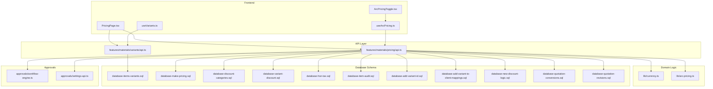
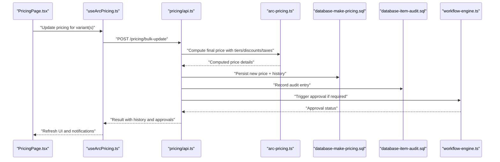
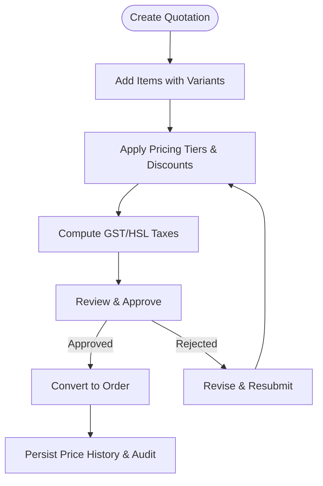
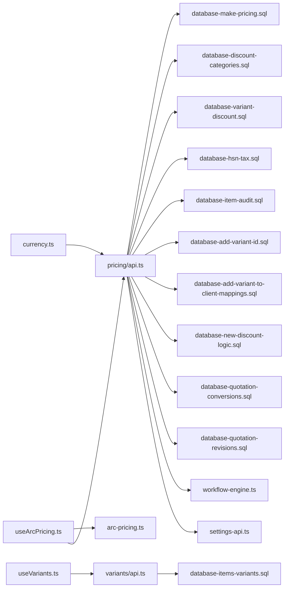

# Variant & Pricing API

<cite>
**Referenced Files in This Document**
- [src/features/materials/variants/api.ts](file://src/features/materials/variants/api.ts)
- [src/features/materials/pricing/api.ts](file://src/features/materials/pricing/api.ts)
- [src/hooks/useVariants.ts](file://src/hooks/useVariants.ts)
- [src/hooks/useArcPricing.ts](file://src/hooks/useArcPricing.ts)
- [src/lib/currency.ts](file://src/lib/currency.ts)
- [src/lib/arc-pricing.ts](file://src/lib/arc-pricing.ts)
- [src/database/database-items-variants.sql](file://src/database/database-items-variants.sql)
- [src/database/database-make-pricing.sql](file://src/database/database-make-pricing.sql)
- [src/database/database-discount-categories.sql](file://src/database/database-discount-categories.sql)
- [src/database/database-variant-discount.sql](file://src/database/database-variant-discount.sql)
- [src/database/database-hsn-tax.sql](file://src/database/database-hsn-tax.sql)
- [src/database/database-item-audit.sql](file://src/database/database-item-audit.sql)
- [src/database/database-add-variant-id.sql](file://src/database/database-add-variant-id.sql)
- [src/database/database-add-variant-to-client-mappings.sql](file://src/database/database-add-variant-to-client-mappings.sql)
- [src/database/database-variant-discount.sql](file://src/database/database-variant-discount.sql)
- [src/database/database-new-discount-logic.sql](file://src/database/database-new-discount-logic.sql)
- [src/database/database-quotation-conversions.sql](file://src/database/database-quotation-conversions.sql)
- [src/database/database-quotation-revisions.sql](file://src/database/database-quotation-revisions.sql)
- [src/database/database-approval-workflows-rls.sql](file://src/database/database-approval-workflows-rls.sql)
- [src/approvals/workflow-engine.ts](file://src/approvals/workflow-engine.ts)
- [src/approvals/settings-api.ts](file://src/approvals/settings-api.ts)
- [src/pages/PricingPage.tsx](file://src/pages/PricingPage.tsx)
- [src/components/ArcPricingToggle.tsx](file://src/components/ArcPricingToggle.tsx)
</cite>

## Table of Contents
1. [Introduction](#introduction)
2. [Project Structure](#project-structure)
3. [Core Components](#core-components)
4. [Architecture Overview](#architecture-overview)
5. [Detailed Component Analysis](#detailed-component-analysis)
6. [Dependency Analysis](#dependency-analysis)
7. [Performance Considerations](#performance-considerations)
8. [Troubleshooting Guide](#troubleshooting-guide)
9. [Conclusion](#conclusion)
10. [Appendices](#appendices)

## Introduction
This document provides detailed API documentation for material variants and pricing management. It covers variant creation, pricing strategies, discount hierarchies, GST tax calculations, currency support, price history tracking, bulk pricing updates, variant-specific stock levels, customer-specific pricing, approval workflows, audit trails, and integration with quotation systems. The goal is to enable developers to implement consistent, auditable, and scalable pricing across the application.

## Project Structure
The variant and pricing features are implemented across dedicated modules:
- Variants API and hooks under src/features/materials/variants and src/hooks
- Pricing API and logic under src/features/materials/pricing and src/lib
- Database schema definitions under src/database
- Approval workflow integration under src/approvals
- UI entry points and toggles under src/pages and src/components

**Diagram sources**
- [src/pages/PricingPage.tsx](file://src/pages/PricingPage.tsx)
- [src/components/ArcPricingToggle.tsx](file://src/components/ArcPricingToggle.tsx)
- [src/hooks/useVariants.ts](file://src/hooks/useVariants.ts)
- [src/hooks/useArcPricing.ts](file://src/hooks/useArcPricing.ts)
- [src/features/materials/variants/api.ts](file://src/features/materials/variants/api.ts)
- [src/features/materials/pricing/api.ts](file://src/features/materials/pricing/api.ts)
- [src/lib/currency.ts](file://src/lib/currency.ts)
- [src/lib/arc-pricing.ts](file://src/lib/arc-pricing.ts)
- [src/database/database-items-variants.sql](file://src/database/database-items-variants.sql)
- [src/database/database-make-pricing.sql](file://src/database/database-make-pricing.sql)
- [src/database/database-discount-categories.sql](file://src/database/database-discount-categories.sql)
- [src/database/database-variant-discount.sql](file://src/database/database-variant-discount.sql)
- [src/database/database-hsn-tax.sql](file://src/database/database-hsn-tax.sql)
- [src/database/database-item-audit.sql](file://src/database/database-item-audit.sql)
- [src/database/database-add-variant-id.sql](file://src/database/database-add-variant-id.sql)
- [src/database/database-add-variant-to-client-mappings.sql](file://src/database/database-add-variant-to-client-mappings.sql)
- [src/database/database-new-discount-logic.sql](file://src/database/database-new-discount-logic.sql)
- [src/database/database-quotation-conversions.sql](file://src/database/database-quotation-conversions.sql)
- [src/database/database-quotation-revisions.sql](file://src/database/database-quotation-revisions.sql)
- [src/approvals/workflow-engine.ts](file://src/approvals/workflow-engine.ts)
- [src/approvals/settings-api.ts](file://src/approvals/settings-api.ts)

**Section sources**
- [src/features/materials/variants/api.ts](file://src/features/materials/variants/api.ts)
- [src/features/materials/pricing/api.ts](file://src/features/materials/pricing/api.ts)
- [src/hooks/useVariants.ts](file://src/hooks/useVariants.ts)
- [src/hooks/useArcPricing.ts](file://src/hooks/useArcPricing.ts)
- [src/lib/currency.ts](file://src/lib/currency.ts)
- [src/lib/arc-pricing.ts](file://src/lib/arc-pricing.ts)
- [src/database/database-items-variants.sql](file://src/database/database-items-variants.sql)
- [src/database/database-make-pricing.sql](file://src/database/database-make-pricing.sql)
- [src/database/database-discount-categories.sql](file://src/database/database-discount-categories.sql)
- [src/database/database-variant-discount.sql](file://src/database/database-variant-discount.sql)
- [src/database/database-hsn-tax.sql](file://src/database/database-hsn-tax.sql)
- [src/database/database-item-audit.sql](file://src/database/database-item-audit.sql)
- [src/database/database-add-variant-id.sql](file://src/database/database-add-variant-id.sql)
- [src/database/database-add-variant-to-client-mappings.sql](file://src/database/database-add-variant-to-client-mappings.sql)
- [src/database/database-new-discount-logic.sql](file://src/database/database-new-discount-logic.sql)
- [src/database/database-quotation-conversions.sql](file://src/database/database-quotation-conversions.sql)
- [src/database/database-quotation-revisions.sql](file://src/database/database-quotation-revisions.sql)
- [src/approvals/workflow-engine.ts](file://src/approvals/workflow-engine.ts)
- [src/approvals/settings-api.ts](file://src/approvals/settings-api.ts)
- [src/pages/PricingPage.tsx](file://src/pages/PricingPage.tsx)
- [src/components/ArcPricingToggle.tsx](file://src/components/ArcPricingToggle.tsx)

## Core Components
- Variants API: Provides endpoints to create, update, list, and delete product variants; supports variant-specific attributes and associations.
- Pricing API: Manages base prices, tiered pricing, discounts, taxes (GST/HSL), currency conversions, and price history.
- Arc Pricing Hook: Encapsulates pricing calculation rules, including discount hierarchies and rounding behavior.
- Currency Utility: Normalizes currency codes, formats amounts, and handles precision per currency.
- Approval Integration: Routes sensitive pricing changes through configurable approval workflows and records audit entries.

Key responsibilities:
- Enforce business rules for discount precedence and applicability
- Maintain immutable price history and audit logs
- Support bulk operations for efficient updates
- Provide variant-level stock linkage for availability checks

**Section sources**
- [src/features/materials/variants/api.ts](file://src/features/materials/variants/api.ts)
- [src/features/materials/pricing/api.ts](file://src/features/materials/pricing/api.ts)
- [src/hooks/useArcPricing.ts](file://src/hooks/useArcPricing.ts)
- [src/lib/arc-pricing.ts](file://src/lib/arc-pricing.ts)
- [src/lib/currency.ts](file://src/lib/currency.ts)

## Architecture Overview
The system follows a layered architecture:
- Presentation layer: Pages and components trigger actions via hooks
- Hooks layer: useVariants and useArcPricing orchestrate API calls and local state
- API layer: REST endpoints encapsulate domain logic and persistence
- Domain logic: arc-pricing and currency utilities enforce rules and formatting
- Data layer: SQL migrations define schemas for variants, pricing, discounts, taxes, audits, and quotations

**Diagram sources**
- [src/pages/PricingPage.tsx](file://src/pages/PricingPage.tsx)
- [src/hooks/useArcPricing.ts](file://src/hooks/useArcPricing.ts)
- [src/features/materials/pricing/api.ts](file://src/features/materials/pricing/api.ts)
- [src/lib/arc-pricing.ts](file://src/lib/arc-pricing.ts)
- [src/database/database-make-pricing.sql](file://src/database/database-make-pricing.sql)
- [src/database/database-item-audit.sql](file://src/database/database-item-audit.sql)
- [src/approvals/workflow-engine.ts](file://src/approvals/workflow-engine.ts)

## Detailed Component Analysis

### Variants Management
- Create variant: Associate a new variant with a parent item, set attributes, and initialize default pricing if applicable.
- Update variant: Modify attributes, link to discount categories, and adjust variant-specific stock levels.
- List variants: Filter by parent item, category, or status; include pricing snapshots for display.
- Delete variant: Prevent deletion if referenced by active quotations or inventory transactions.

Common workflows:
- Creating product variants: Use the variants API to add multiple variants at once; ensure each has a unique identifier and valid parent reference.
- Setting up variant-specific stock levels: Update stock counts per warehouse and variant; validate against minimum thresholds.

**Section sources**
- [src/features/materials/variants/api.ts](file://src/features/materials/variants/api.ts)
- [src/hooks/useVariants.ts](file://src/hooks/useVariants.ts)
- [src/database/database-items-variants.sql](file://src/database/database-items-variants.sql)
- [src/database/database-add-variant-id.sql](file://src/database/database-add-variant-id.sql)

### Pricing Strategies and Discount Hierarchies
- Base pricing: Define base price per variant and currency; store effective date ranges.
- Tiered pricing: Configure quantity-based tiers; compute discounted rates based on order quantity.
- Discount categories: Assign discount categories to variants; apply hierarchical precedence rules.
- Customer-specific pricing: Link client mappings to variants; override base or tiered prices per customer segment.

Discount hierarchy:
- Precedence order: Catalog discount > Category discount > Customer-specific discount > Promotional discount
- Conflict resolution: Highest precedence wins; fallback to base price if no applicable discount
- Rounding and precision: Apply currency-specific rounding after all discounts and taxes

Bulk pricing updates:
- Accept batch payloads with variant IDs, new base prices, tier definitions, and effective dates
- Validate constraints before applying; record individual audit entries per change

**Section sources**
- [src/features/materials/pricing/api.ts](file://src/features/materials/pricing/api.ts)
- [src/lib/arc-pricing.ts](file://src/lib/arc-pricing.ts)
- [src/database/database-make-pricing.sql](file://src/database/database-make-pricing.sql)
- [src/database/database-discount-categories.sql](file://src/database/database-discount-categories.sql)
- [src/database/database-variant-discount.sql](file://src/database/database-variant-discount.sql)
- [src/database/database-add-variant-to-client-mappings.sql](file://src/database/database-add-variant-to-client-mappings.sql)
- [src/database/database-new-discount-logic.sql](file://src/database/database-new-discount-logic.sql)

### GST Tax Calculations and Currency Support
- GST/HSL configuration: Map HSN/SAC codes to tax rates; compute inclusive/exclusive tax amounts.
- Currency normalization: Standardize currency codes; format amounts with correct decimal places.
- Multi-currency pricing: Store base currency and conversion rates; derive displayed prices per client currency.

Tax computation flow:
- Determine applicable tax rate from HSN/SAC mapping
- Calculate tax amount based on whether price is inclusive or exclusive
- Aggregate taxes across line items for totals

Currency handling:
- Normalize input currency codes
- Round according to currency rules
- Preserve original base currency for reporting

**Section sources**
- [src/database/database-hsn-tax.sql](file://src/database/database-hsn-tax.sql)
- [src/lib/currency.ts](file://src/lib/currency.ts)
- [src/features/materials/pricing/api.ts](file://src/features/materials/pricing/api.ts)

### Price History Tracking and Audit Trails
- Immutable history: Each price change creates a new history record with effective dates and user context.
- Audit entries: Record who changed what, when, and why; link to approval decisions.
- Rollback support: Maintain previous versions to allow reverting to prior states safely.

Workflow:
- On price update, persist new price and append history row
- Generate audit log entry with metadata (user, IP, reason)
- If required, route through approval workflow before activation

**Section sources**
- [src/database/database-item-audit.sql](file://src/database/database-item-audit.sql)
- [src/features/materials/pricing/api.ts](file://src/features/materials/pricing/api.ts)
- [src/approvals/workflow-engine.ts](file://src/approvals/workflow-engine.ts)

### Bulk Pricing Updates
- Batch endpoint: Accept array of variant pricing updates with validation and error aggregation.
- Atomicity: Group updates within a transaction; rollback on partial failure.
- Feedback: Return per-item results with success/failure and reasons.

Operational considerations:
- Rate limiting and pagination for large batches
- Idempotency keys to prevent duplicate submissions
- Background processing for very large datasets

**Section sources**
- [src/features/materials/pricing/api.ts](file://src/features/materials/pricing/api.ts)
- [src/database/database-make-pricing.sql](file://src/database/database-make-pricing.sql)

### Variant-Specific Stock Levels
- Per-variant inventory: Track stock quantities per variant and warehouse.
- Availability checks: Compute available-to-sell considering reservations and backorders.
- Alerts: Notify when stock falls below configured thresholds.

Integration points:
- Quotation lines consume reserved stock upon approval
- Inward/outward movements update variant stock atomically

**Section sources**
- [src/database/database-items-variants.sql](file://src/database/database-items-variants.sql)
- [src/features/materials/variants/api.ts](file://src/features/materials/variants/api.ts)

### Customer-Specific Pricing
- Client mappings: Associate clients or segments with variant pricing overrides.
- Priority rules: Resolve conflicts between catalog, category, and customer-specific prices.
- Visibility: Ensure only authorized users can view or edit customer-specific pricing.

**Section sources**
- [src/database/database-add-variant-to-client-mappings.sql](file://src/database/database-add-variant-to-client-mappings.sql)
- [src/features/materials/pricing/api.ts](file://src/features/materials/pricing/api.ts)

### Pricing Approval Workflows
- Trigger conditions: Changes exceeding thresholds or requiring managerial sign-off.
- Settings API: Configure approvers, steps, and escalation rules.
- Status tracking: Pending, approved, rejected; with comments and timestamps.

Sequence:
- Submit pricing change request
- Route to designated approver(s)
- Approve/reject with rationale
- Activate or revert changes accordingly

**Section sources**
- [src/approvals/workflow-engine.ts](file://src/approvals/workflow-engine.ts)
- [src/approvals/settings-api.ts](file://src/approvals/settings-api.ts)
- [src/database/database-approval-workflows-rls.sql](file://src/database/database-approval-workflows-rls.sql)

### Integration with Quotation Systems
- Quotation conversions: Convert approved quotes to orders while preserving pricing snapshots.
- Revisions: Track quote revisions and associated pricing changes.
- Line item linkage: Tie quotation lines to variant IDs and applied discounts/taxes.

**Diagram sources**
- [src/database/database-quotation-conversions.sql](file://src/database/database-quotation-conversions.sql)
- [src/database/database-quotation-revisions.sql](file://src/database/database-quotation-revisions.sql)
- [src/features/materials/pricing/api.ts](file://src/features/materials/pricing/api.ts)

## Dependency Analysis
The following diagram shows key dependencies among modules and data layers:

**Diagram sources**
- [src/features/materials/variants/api.ts](file://src/features/materials/variants/api.ts)
- [src/features/materials/pricing/api.ts](file://src/features/materials/pricing/api.ts)
- [src/hooks/useVariants.ts](file://src/hooks/useVariants.ts)
- [src/hooks/useArcPricing.ts](file://src/hooks/useArcPricing.ts)
- [src/lib/arc-pricing.ts](file://src/lib/arc-pricing.ts)
- [src/lib/currency.ts](file://src/lib/currency.ts)
- [src/database/database-items-variants.sql](file://src/database/database-items-variants.sql)
- [src/database/database-make-pricing.sql](file://src/database/database-make-pricing.sql)
- [src/database/database-discount-categories.sql](file://src/database/database-discount-categories.sql)
- [src/database/database-variant-discount.sql](file://src/database/database-variant-discount.sql)
- [src/database/database-hsn-tax.sql](file://src/database/database-hsn-tax.sql)
- [src/database/database-item-audit.sql](file://src/database/database-item-audit.sql)
- [src/database/database-add-variant-id.sql](file://src/database/database-add-variant-id.sql)
- [src/database/database-add-variant-to-client-mappings.sql](file://src/database/database-add-variant-to-client-mappings.sql)
- [src/database/database-new-discount-logic.sql](file://src/database/database-new-discount-logic.sql)
- [src/database/database-quotation-conversions.sql](file://src/database/database-quotation-conversions.sql)
- [src/database/database-quotation-revisions.sql](file://src/database/database-quotation-revisions.sql)
- [src/approvals/workflow-engine.ts](file://src/approvals/workflow-engine.ts)
- [src/approvals/settings-api.ts](file://src/approvals/settings-api.ts)

**Section sources**
- [src/features/materials/variants/api.ts](file://src/features/materials/variants/api.ts)
- [src/features/materials/pricing/api.ts](file://src/features/materials/pricing/api.ts)
- [src/hooks/useVariants.ts](file://src/hooks/useVariants.ts)
- [src/hooks/useArcPricing.ts](file://src/hooks/useArcPricing.ts)
- [src/lib/arc-pricing.ts](file://src/lib/arc-pricing.ts)
- [src/lib/currency.ts](file://src/lib/currency.ts)
- [src/database/database-items-variants.sql](file://src/database/database-items-variants.sql)
- [src/database/database-make-pricing.sql](file://src/database/database-make-pricing.sql)
- [src/database/database-discount-categories.sql](file://src/database/database-discount-categories.sql)
- [src/database/database-variant-discount.sql](file://src/database/database-variant-discount.sql)
- [src/database/database-hsn-tax.sql](file://src/database/database-hsn-tax.sql)
- [src/database/database-item-audit.sql](file://src/database/database-item-audit.sql)
- [src/database/database-add-variant-id.sql](file://src/database/database-add-variant-id.sql)
- [src/database/database-add-variant-to-client-mappings.sql](file://src/database/database-add-variant-to-client-mappings.sql)
- [src/database/database-new-discount-logic.sql](file://src/database/database-new-discount-logic.sql)
- [src/database/database-quotation-conversions.sql](file://src/database/database-quotation-conversions.sql)
- [src/database/database-quotation-revisions.sql](file://src/database/database-quotation-revisions.sql)
- [src/approvals/workflow-engine.ts](file://src/approvals/workflow-engine.ts)
- [src/approvals/settings-api.ts](file://src/approvals/settings-api.ts)

## Performance Considerations
- Batch operations: Prefer bulk endpoints for large-scale updates to reduce round trips.
- Indexing: Ensure database indexes on variant IDs, effective dates, and client mappings for fast queries.
- Caching: Cache computed pricing for read-heavy scenarios; invalidate on write events.
- Pagination: Implement cursor-based pagination for large variant lists and price histories.
- Concurrency: Use optimistic locking or version fields to prevent conflicting updates.

[No sources needed since this section provides general guidance]

## Troubleshooting Guide
Common issues and resolutions:
- Validation errors on bulk updates: Check payload structure, variant existence, and constraint violations; review per-item error messages.
- Discount precedence conflicts: Verify category and customer-specific mappings; confirm hierarchy rules in arc-pricing logic.
- Tax calculation mismatches: Confirm HSN/SAC mappings and inclusive/exclusive flags; validate currency rounding settings.
- Approval bottlenecks: Inspect workflow settings and approver assignments; check audit logs for rejection reasons.
- Quotation conversion failures: Ensure pricing snapshots exist and approvals are complete; verify line item variant references.

Debugging tips:
- Enable detailed logging around pricing computations and approval transitions
- Compare price history entries to identify unintended changes
- Cross-check variant-stock linkage when availability discrepancies occur

**Section sources**
- [src/features/materials/pricing/api.ts](file://src/features/materials/pricing/api.ts)
- [src/lib/arc-pricing.ts](file://src/lib/arc-pricing.ts)
- [src/database/database-item-audit.sql](file://src/database/database-item-audit.sql)
- [src/approvals/workflow-engine.ts](file://src/approvals/workflow-engine.ts)

## Conclusion
The Variant & Pricing API provides a robust foundation for managing product variants, complex pricing strategies, and compliant tax calculations. With strong audit trails, approval workflows, and quotation integrations, it ensures accuracy, traceability, and scalability. Adhering to the documented patterns and best practices will help maintain consistency and reliability across the platform.

[No sources needed since this section summarizes without analyzing specific files]

## Appendices

### Example Workflows

- Creating product variants:
  - Call the variants API to create one or more variants linked to a parent item
  - Initialize default pricing and assign discount categories if needed
  - Set initial stock levels per warehouse

- Setting up pricing tiers:
  - Define base price and quantity breakpoints
  - Attach discount categories and customer-specific overrides
  - Submit for approval if thresholds require it

- Managing discount categories:
  - Create or update discount categories with precedence rules
  - Map categories to variants and customers
  - Validate conflict resolution and test calculations

- Integrating with quotations:
  - Add items with selected variants to a quotation
  - Apply pricing tiers, discounts, and taxes
  - Approve and convert to an order, preserving price snapshots

[No sources needed since this section provides conceptual examples]