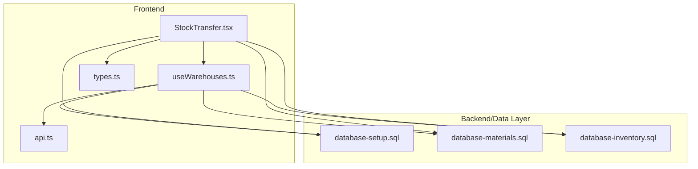
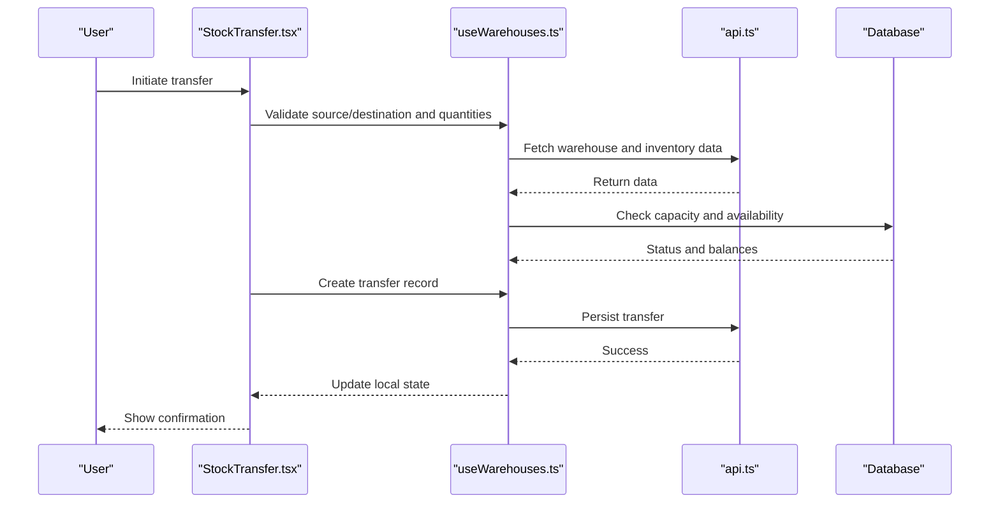
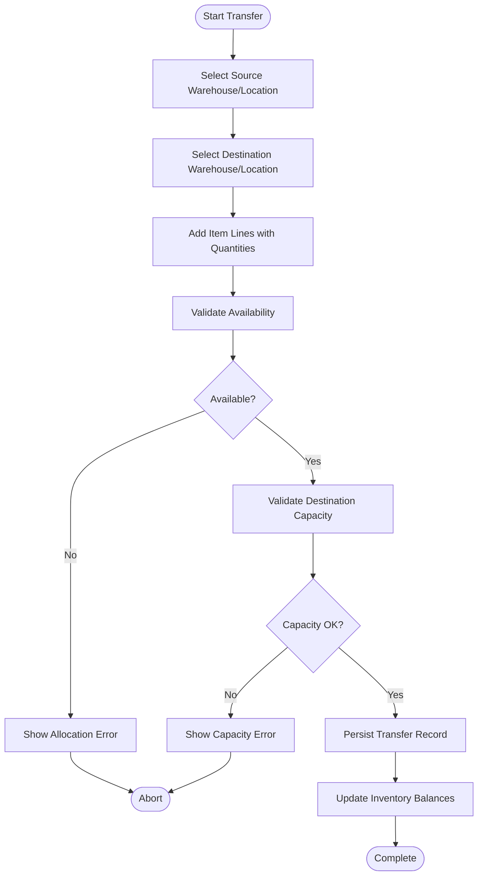
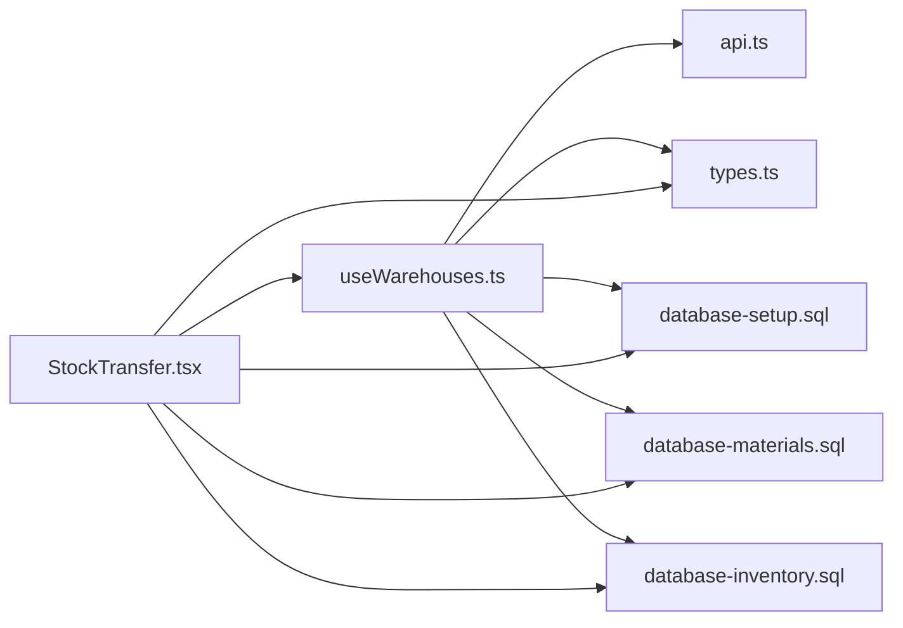

# Warehouse Operations API

<cite>
**Referenced Files in This Document**
- [useWarehouses.ts](file://src/hooks/useWarehouses.ts)
- [StockTransfer.tsx](file://src/pages/StockTransfer.tsx)
- [database-inventory.sql](file://src/database-inventory.sql)
- [database-materials.sql](file://src/database-materials.sql)
- [database-setup.sql](file://src/database-setup.sql)
- [api.ts](file://src/api.ts)
- [hooks.ts](file://src/features/materials/hooks.ts)
- [types.ts](file://src/types/types.ts)
</cite>

## Table of Contents
1. [Introduction](#introduction)
2. [Project Structure](#project-structure)
3. [Core Components](#core-components)
4. [Architecture Overview](#architecture-overview)
5. [Detailed Component Analysis](#detailed-component-analysis)
6. [Dependency Analysis](#dependency-analysis)
7. [Performance Considerations](#performance-considerations)
8. [Troubleshooting Guide](#troubleshooting-guide)
9. [Conclusion](#conclusion)

## Introduction
This document provides detailed API documentation for warehouse management and transfer operations within the application. It covers:
- Warehouse CRUD operations
- Location hierarchy management
- Capacity planning and constraints
- Inter-warehouse transfer workflows
- Stock allocation strategies
- Multi-location inventory tracking
- Performance metrics, utilization reports, and location-based analytics
- Common workflow examples (setup new warehouses, transferring stock, managing capacities)
- Warehouse-specific permissions, access controls, and operational constraints

The goal is to help developers integrate with and extend warehouse capabilities consistently across the frontend and backend layers.

## Project Structure
Warehouse-related functionality spans hooks, pages, database schemas, and shared types. The key areas include:
- Frontend hooks for warehouse data access and mutations
- Pages implementing user workflows like stock transfers
- Database schema definitions for inventory, materials, and setup
- Shared types and API utilities used by features

**Diagram sources**
- [useWarehouses.ts](file://src/hooks/useWarehouses.ts)
- [StockTransfer.tsx](file://src/pages/StockTransfer.tsx)
- [database-setup.sql](file://src/database-setup.sql)
- [database-materials.sql](file://src/database-materials.sql)
- [database-inventory.sql](file://src/database-inventory.sql)

**Section sources**
- [useWarehouses.ts](file://src/hooks/useWarehouses.ts)
- [StockTransfer.tsx](file://src/pages/StockTransfer.tsx)
- [database-setup.sql](file://src/database-setup.sql)
- [database-materials.sql](file://src/database-materials.sql)
- [database-inventory.sql](file://src/database-inventory.sql)

## Core Components
- Warehouse Hook Module: Provides queries and mutations for warehouse entities, including creation, updates, deletion, and listing. It encapsulates error handling and caching behavior.
- Transfer Page: Implements the UI and orchestration logic for creating inter-warehouse transfers, validating stock availability, and persisting transfer records.
- Data Models and Types: Centralized TypeScript types define warehouse, location, capacity, and transfer structures used across modules.
- Database Schema: SQL migrations define tables for warehouses, locations, inventory balances, and material mappings.

Key responsibilities:
- Enforce capacity constraints during allocations
- Maintain consistent multi-location inventory state
- Provide audit-friendly transfer records
- Expose metrics endpoints or computed views for performance reporting

**Section sources**
- [useWarehouses.ts](file://src/hooks/useWarehouses.ts)
- [StockTransfer.tsx](file://src/pages/StockTransfer.tsx)
- [types.ts](file://src/types/types.ts)
- [database-setup.sql](file://src/database-setup.sql)
- [database-materials.sql](file://src/database-materials.sql)
- [database-inventory.sql](file://src/database-inventory.sql)

## Architecture Overview
The system follows a layered architecture:
- Presentation layer: React components and pages (e.g., StockTransfer)
- Domain layer: Hooks and business logic (e.g., useWarehouses)
- Data layer: Database schema and migrations
- Integration layer: API client utilities

**Diagram sources**
- [StockTransfer.tsx](file://src/pages/StockTransfer.tsx)
- [useWarehouses.ts](file://src/hooks/useWarehouses.ts)
- [api.ts](file://src/api.ts)
- [database-setup.sql](file://src/database-setup.sql)
- [database-materials.sql](file://src/database-materials.sql)
- [database-inventory.sql](file://src/database-inventory.sql)

## Detailed Component Analysis

### Warehouse CRUD Operations
- Create Warehouse: Validates required fields, enforces unique identifiers, and persists via API. Returns created entity with metadata.
- Read Warehouses: Supports filtering by organization, status, and region. Includes pagination and sorting.
- Update Warehouse: Applies partial updates with validation; rejects changes that violate constraints (e.g., disabling active warehouse).
- Delete Warehouse: Soft delete with dependency checks; prevents removal if linked to active inventory or pending transfers.

Operational constraints:
- Unique name/code per organization
- Required default location upon creation
- Capacity must be non-negative and set before enabling

**Section sources**
- [useWarehouses.ts](file://src/hooks/useWarehouses.ts)
- [database-setup.sql](file://src/database-setup.sql)

### Location Hierarchy Management
- Location Model: Represents hierarchical nodes under a warehouse (e.g., zone, aisle, rack, bin).
- Parent-Child Relationships: Enforced through foreign keys; supports arbitrary depth.
- Validation Rules: Prevent cycles, enforce leaf-level storage rules, and maintain integrity on parent deletions.

Capacity Planning:
- Per-location capacity attributes (volume, weight, units)
- Aggregated capacity at warehouse level derived from children
- Overallocation prevention during stock movements

**Section sources**
- [database-setup.sql](file://src/database-setup.sql)
- [database-materials.sql](file://src/database-materials.sql)

### Inter-Warehouse Transfer Workflows
End-to-end flow:
- Source selection and destination assignment
- Line-item creation with item, quantity, and reason codes
- Availability check against source location(s)
- Capacity validation at destination
- Atomic persistence of transfer header and lines
- Post-transfer balance updates and audit logging

**Diagram sources**
- [StockTransfer.tsx](file://src/pages/StockTransfer.tsx)
- [useWarehouses.ts](file://src/hooks/useWarehouses.ts)
- [database-inventory.sql](file://src/database-inventory.sql)

**Section sources**
- [StockTransfer.tsx](file://src/pages/StockTransfer.tsx)
- [useWarehouses.ts](file://src/hooks/useWarehouses.ts)
- [database-inventory.sql](file://src/database-inventory.sql)

### Stock Allocation Strategies
- First-In-First-Out (FIFO): Allocates oldest batches first to reduce expiry risk.
- Least-Cost Path: Chooses closest or most cost-effective source location.
- Priority Buckets: Prefers specific zones or racks based on operational rules.
- Split Allocations: Allows splitting across multiple source locations when single-source cannot fulfill.

Implementation notes:
- Strategy selection can be configured per item or globally
- Allocation engine computes candidate lots and applies strategy ordering
- Results are validated against capacity and reservation locks

**Section sources**
- [database-materials.sql](file://src/database-materials.sql)
- [database-inventory.sql](file://src/database-inventory.sql)

### Multi-Location Inventory Tracking
- Balance Model: Tracks available, reserved, and allocated quantities per item per location.
- Movement Ledger: Records all inbound/outbound movements with timestamps and references.
- Consistency Guarantees: Transactions ensure atomic updates to balances and ledger entries.

Reporting:
- Real-time availability per location
- Historical movement analysis
- Discrepancy detection between physical counts and system balances

**Section sources**
- [database-inventory.sql](file://src/database-inventory.sql)
- [database-materials.sql](file://src/database-materials.sql)

### Warehouse Performance Metrics and Analytics
Metrics:
- Utilization rate: Used capacity vs. total capacity over time
- Turnover ratio: Cost of goods moved vs. average inventory value
- Throughput: Number of transfers processed per period
- Accuracy: Variance between expected and actual balances

Reports:
- Location-based analytics: Top movers, slow-moving items, dead stock
- Capacity heatmaps: Identify bottlenecks and underutilized zones
- Transfer SLA compliance: Average processing times and delays

Data sources:
- Movement ledger and balance snapshots
- Warehouse and location metadata
- Time-series aggregation views

**Section sources**
- [database-inventory.sql](file://src/database-inventory.sql)
- [database-setup.sql](file://src/database-setup.sql)

### Permissions, Access Controls, and Operational Constraints
Permissions:
- Role-based access to warehouse operations (create, edit, delete, view)
- Location-scoped permissions to restrict editing to assigned zones
- Audit trail for sensitive actions (capacity changes, closures)

Constraints:
- Prevent transfers to closed or restricted locations
- Enforce minimum order quantities and batch restrictions
- Require approvals for high-value or cross-org transfers

Integration points:
- RBAC policies enforced at API layer
- RLS policies applied to database rows where applicable

**Section sources**
- [database-setup.sql](file://src/database-setup.sql)
- [api.ts](file://src/api.ts)

### Common Workflow Examples

- Setting up a New Warehouse
  - Steps: Create warehouse entity, configure default location, set initial capacity, enable for operations
  - Validation: Unique identifiers, required fields, capacity > 0
  - Outcome: Ready to receive stock and initiate transfers

- Transferring Stock Between Locations
  - Steps: Select source and destination, add line items, validate availability and capacity, submit transfer
  - Validation: Non-negative quantities, sufficient availability, destination capacity not exceeded
  - Outcome: Updated balances and transfer record with audit entries

- Managing Warehouse Capacities
  - Steps: Adjust capacity limits, schedule maintenance windows, reassign locations
  - Validation: No negative capacity, no active reservations conflicting with closure
  - Outcome: Updated capacity model reflected in allocation decisions

[No sources needed since this section aggregates previously analyzed content]

## Dependency Analysis
The following diagram shows how core modules depend on each other and the database schema.

**Diagram sources**
- [StockTransfer.tsx](file://src/pages/StockTransfer.tsx)
- [useWarehouses.ts](file://src/hooks/useWarehouses.ts)
- [api.ts](file://src/api.ts)
- [types.ts](file://src/types/types.ts)
- [database-setup.sql](file://src/database-setup.sql)
- [database-materials.sql](file://src/database-materials.sql)
- [database-inventory.sql](file://src/database-inventory.sql)

**Section sources**
- [StockTransfer.tsx](file://src/pages/StockTransfer.tsx)
- [useWarehouses.ts](file://src/hooks/useWarehouses.ts)
- [api.ts](file://src/api.ts)
- [types.ts](file://src/types/types.ts)
- [database-setup.sql](file://src/database-setup.sql)
- [database-materials.sql](file://src/database-materials.sql)
- [database-inventory.sql](file://src/database-inventory.sql)

## Performance Considerations
- Batch operations: Prefer bulk create/update for large transfers to reduce round-trips
- Indexing: Ensure indexes on frequently queried columns (warehouse_id, location_id, item_id, timestamp)
- Caching: Cache read-heavy lists (warehouses, locations) with invalidation on mutations
- Pagination: Use cursor-based pagination for large inventories and movement logs
- Concurrency: Apply optimistic locking or row-level locks to prevent race conditions during allocations

[No sources needed since this section provides general guidance]

## Troubleshooting Guide
Common issues and resolutions:
- Insufficient availability: Verify lot allocations and reservations; adjust allocation strategy or split lines
- Capacity exceeded: Review destination capacity settings; consider staging or overflow locations
- Permission denied: Confirm role assignments and location scoping; escalate approval if required
- Data inconsistency: Reconcile movement ledger with balances; investigate failed transactions and retry

Diagnostic steps:
- Inspect transfer history and audit logs
- Compare snapshot balances with ledger totals
- Validate capacity configurations and location statuses

**Section sources**
- [StockTransfer.tsx](file://src/pages/StockTransfer.tsx)
- [useWarehouses.ts](file://src/hooks/useWarehouses.ts)
- [database-inventory.sql](file://src/database-inventory.sql)

## Conclusion
The warehouse operations API integrates frontend workflows with robust backend validations and data models. By enforcing capacity constraints, supporting flexible allocation strategies, and providing comprehensive analytics, it enables efficient multi-location inventory management and reliable inter-warehouse transfers. Adhering to the documented patterns ensures consistency, scalability, and maintainability across the system.