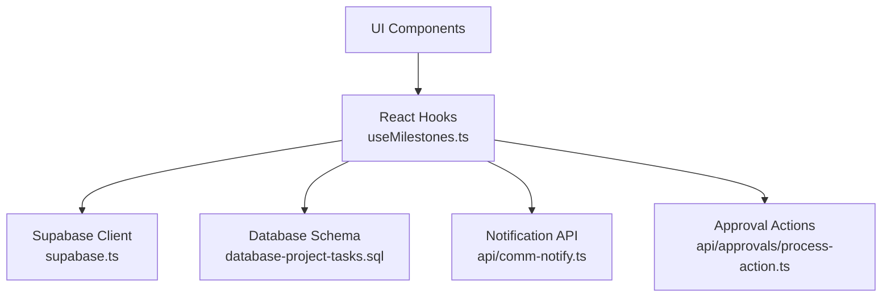
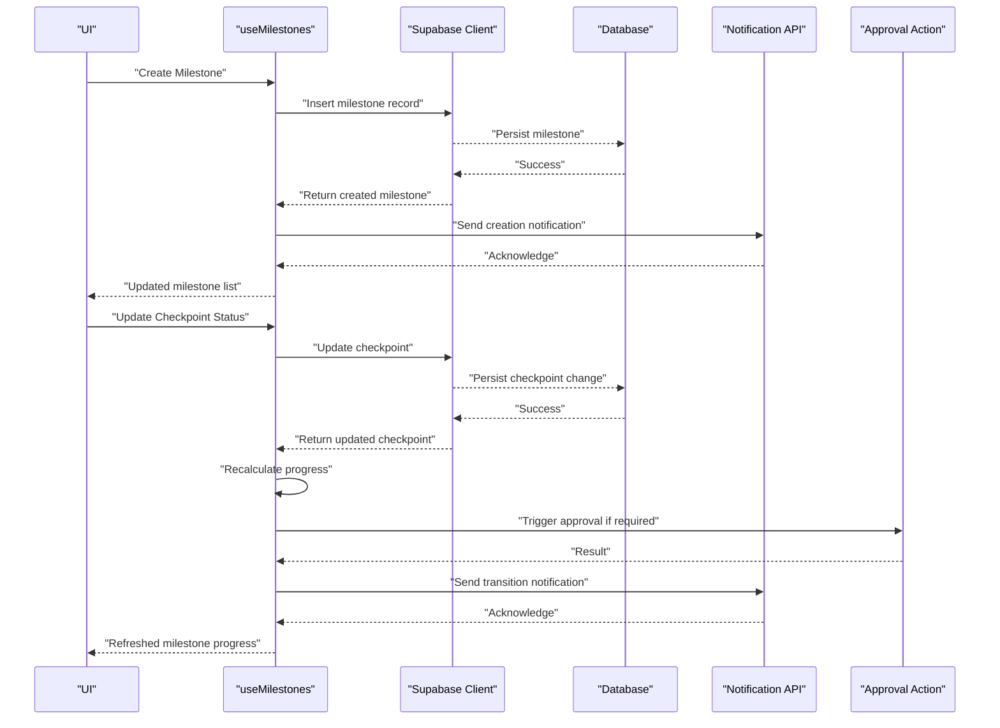
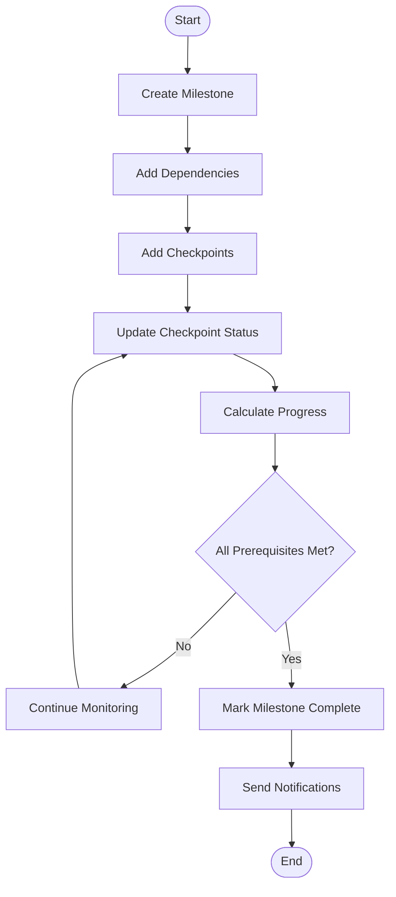
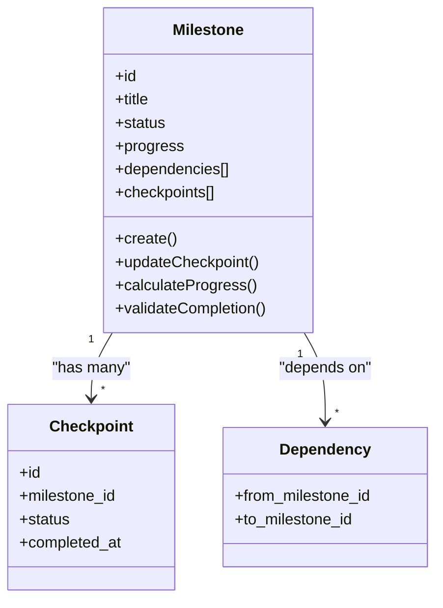
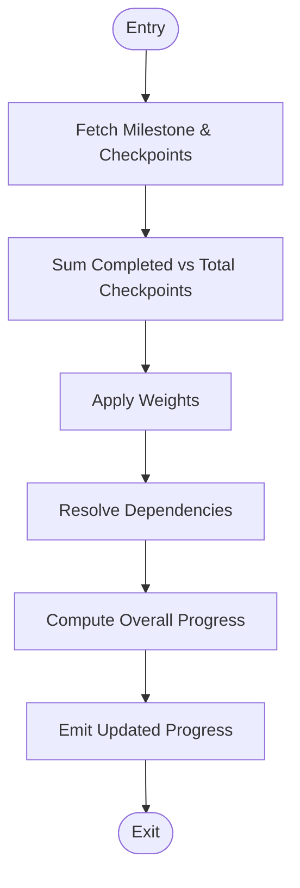
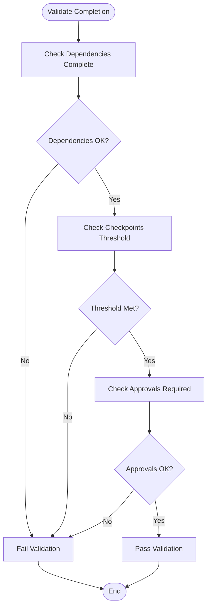
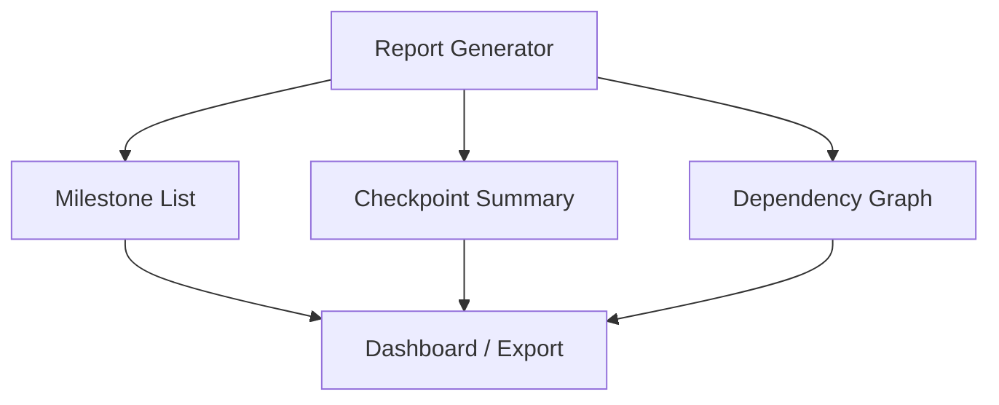
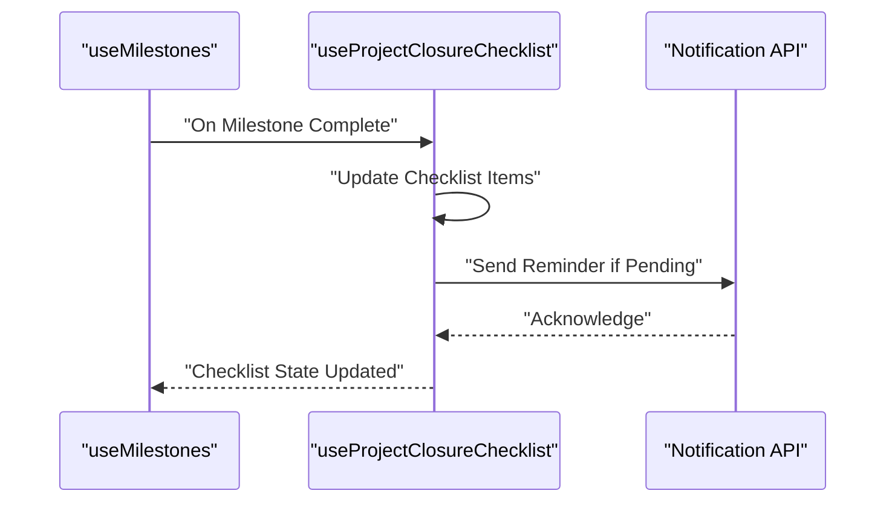
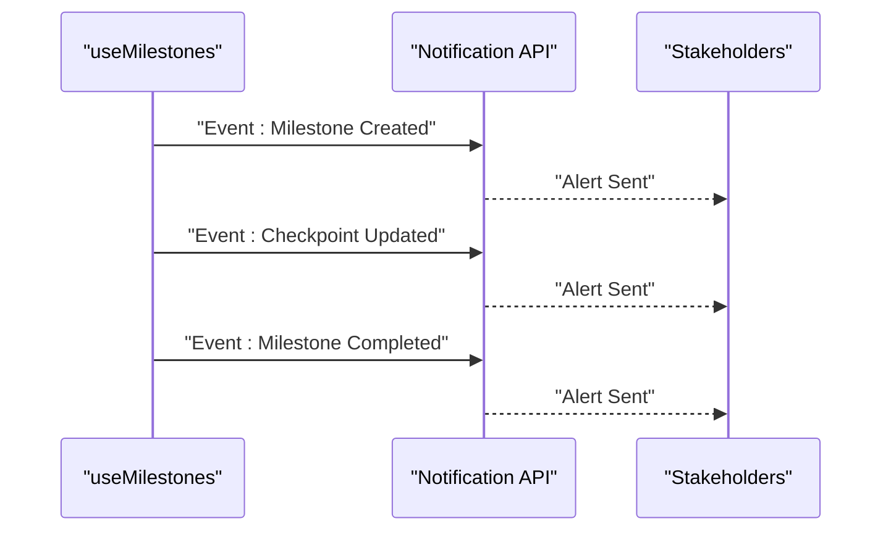
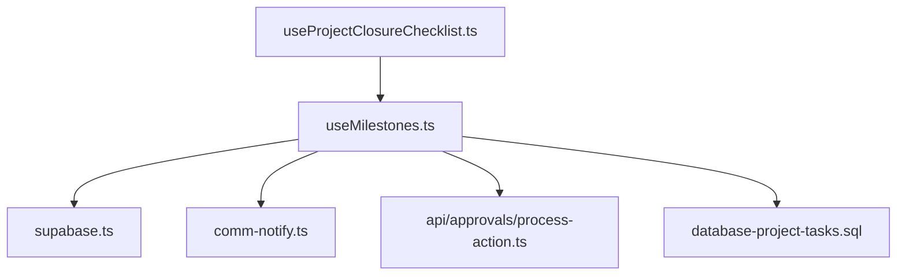

# Milestone Tracking API

<cite>
**Referenced Files in This Document**
- [useMilestones.ts](file://src/hooks/useMilestones.ts)
- [useProjectClosureChecklist.ts](file://src/hooks/useProjectClosureChecklist.ts)
- [api.ts (approvals)](file://src/api/approvals/process-action.ts)
- [comm-notify.ts](file://api/comm-notify.ts)
- [database-project-tasks.sql](file://src/database-project-tasks.sql)
- [supabase.ts](file://src/supabase.ts)
</cite>

## Table of Contents
1. [Introduction](#introduction)
2. [Project Structure](#project-structure)
3. [Core Components](#core-components)
4. [Architecture Overview](#architecture-overview)
5. [Detailed Component Analysis](#detailed-component-analysis)
6. [Dependency Analysis](#dependency-analysis)
7. [Performance Considerations](#performance-considerations)
8. [Troubleshooting Guide](#troubleshooting-guide)
9. [Conclusion](#conclusion)
10. [Appendices](#appendices)

## Introduction
This document provides detailed API documentation for milestone and checkpoint management within the project module. It covers:
- Milestone creation, progress monitoring, and completion validation
- Dependency tracking between milestones
- Automated progress calculations and reporting capabilities
- Integration with project closure checklists and automated notifications
- Practical examples for planning milestones, tracking progress, and completing workflows

The goal is to enable developers and product teams to implement consistent milestone lifecycle operations across the application while ensuring reliable data flows and user feedback.

## Project Structure
Milestone-related functionality spans hooks, API utilities, database schema definitions, and notification integrations:
- Frontend hooks encapsulate data fetching, mutations, and state synchronization
- API endpoints handle business logic such as approvals and notifications
- Database migrations define core entities and relationships
- Supabase client configuration centralizes backend connectivity

**Diagram sources**
- [useMilestones.ts](file://src/hooks/useMilestones.ts)
- [supabase.ts](file://src/supabase.ts)
- [database-project-tasks.sql](file://src/database-project-tasks.sql)
- [comm-notify.ts](file://api/comm-notify.ts)
- [api.ts (approvals)](file://src/api/approvals/process-action.ts)

**Section sources**
- [useMilestones.ts](file://src/hooks/useMilestones.ts)
- [supabase.ts](file://src/supabase.ts)
- [database-project-tasks.sql](file://src/database-project-tasks.sql)
- [comm-notify.ts](file://api/comm-notify.ts)
- [api.ts (approvals)](file://src/api/approvals/process-action.ts)

## Core Components
- Milestone Hook: Provides CRUD operations, dependency resolution, progress calculation, and completion validation.
- Closure Checklist Hook: Integrates milestone completion with project closure requirements.
- Notification Service: Sends automated alerts on milestone transitions and checklist updates.
- Approval Action Handler: Coordinates approval-driven milestone progression where applicable.

Key responsibilities:
- Create milestones with dependencies and checkpoints
- Compute progress based on dependent items and checkpoints
- Validate completion conditions before marking milestones complete
- Trigger notifications and update related project artifacts

**Section sources**
- [useMilestones.ts](file://src/hooks/useMilestones.ts)
- [useProjectClosureChecklist.ts](file://src/hooks/useProjectClosureChecklist.ts)
- [comm-notify.ts](file://api/comm-notify.ts)
- [api.ts (approvals)](file://src/api/approvals/process-action.ts)

## Architecture Overview
The milestone system follows a layered architecture:
- Presentation layer: UI components consume React hooks for reactive state
- Business logic layer: Hooks orchestrate data operations and validations
- Data access layer: Supabase client interacts with database tables
- Integration layer: Notifications and approvals are invoked as side effects

**Diagram sources**
- [useMilestones.ts](file://src/hooks/useMilestones.ts)
- [supabase.ts](file://src/supabase.ts)
- [database-project-tasks.sql](file://src/database-project-tasks.sql)
- [comm-notify.ts](file://api/comm-notify.ts)
- [api.ts (approvals)](file://src/api/approvals/process-action.ts)

## Detailed Component Analysis

### Milestone Lifecycle Operations
- Creation: Define milestone metadata, assign dependencies, and create initial checkpoints.
- Progress Monitoring: Aggregate checkpoint statuses and dependency states to compute overall progress.
- Completion Validation: Ensure all prerequisites and checkpoints satisfy completion criteria before finalizing.

**Diagram sources**
- [useMilestones.ts](file://src/hooks/useMilestones.ts)
- [database-project-tasks.sql](file://src/database-project-tasks.sql)

**Section sources**
- [useMilestones.ts](file://src/hooks/useMilestones.ts)
- [database-project-tasks.sql](file://src/database-project-tasks.sql)

### Dependency Tracking Between Milestones
- Dependencies are modeled as directed edges linking milestones.
- A milestone cannot be marked complete until all upstream dependencies are complete.
- The hook resolves dependency graphs to enforce ordering and prevent invalid transitions.

**Diagram sources**
- [useMilestones.ts](file://src/hooks/useMilestones.ts)
- [database-project-tasks.sql](file://src/database-project-tasks.sql)

**Section sources**
- [useMilestones.ts](file://src/hooks/useMilestones.ts)
- [database-project-tasks.sql](file://src/database-project-tasks.sql)

### Automated Progress Calculations
- Progress is computed from checkpoint completion ratios and dependency fulfillment.
- Weighting can be applied per checkpoint or dependency to reflect relative importance.
- Real-time updates propagate changes to dependent milestones.

**Diagram sources**
- [useMilestones.ts](file://src/hooks/useMilestones.ts)

**Section sources**
- [useMilestones.ts](file://src/hooks/useMilestones.ts)

### Completion Validation Rules
- All direct dependencies must be complete.
- All checkpoints must meet defined thresholds.
- Optional approval gates may require explicit action before completion.

**Diagram sources**
- [useMilestones.ts](file://src/hooks/useMilestones.ts)
- [api.ts (approvals)](file://src/api/approvals/process-action.ts)

**Section sources**
- [useMilestones.ts](file://src/hooks/useMilestones.ts)
- [api.ts (approvals)](file://src/api/approvals/process-action.ts)

### Reporting Capabilities
- Aggregated views of milestone status and progress across projects.
- Drill-down into individual milestone details including checkpoints and dependencies.
- Exportable summaries for stakeholder reviews.

[No diagram sources since this diagram shows conceptual reporting structure]

**Section sources**
- [useMilestones.ts](file://src/hooks/useMilestones.ts)

### Integration with Project Closure Checklists
- Milestone completion triggers checklist item updates.
- Closure checklist ensures all critical milestones are finalized before project closure.
- Automated reminders notify responsible parties when checklist items remain incomplete.

**Diagram sources**
- [useMilestones.ts](file://src/hooks/useMilestones.ts)
- [useProjectClosureChecklist.ts](file://src/hooks/useProjectClosureChecklist.ts)
- [comm-notify.ts](file://api/comm-notify.ts)

**Section sources**
- [useMilestones.ts](file://src/hooks/useMilestones.ts)
- [useProjectClosureChecklist.ts](file://src/hooks/useProjectClosureChecklist.ts)
- [comm-notify.ts](file://api/comm-notify.ts)

### Automated Notifications
- Events include milestone creation, checkpoint updates, and completion transitions.
- Notifications are routed via the communication API to relevant stakeholders.
- Configurable channels support email, in-app alerts, and other integrations.

**Diagram sources**
- [useMilestones.ts](file://src/hooks/useMilestones.ts)
- [comm-notify.ts](file://api/comm-notify.ts)

**Section sources**
- [useMilestones.ts](file://src/hooks/useMilestones.ts)
- [comm-notify.ts](file://api/comm-notify.ts)

## Dependency Analysis
- useMilestones depends on supabase client for persistence and on notification and approval services for side effects.
- useProjectClosureChecklist integrates with milestone completion events to maintain closure readiness.
- Database schema defines milestone, checkpoint, and dependency structures used by the hooks.

**Diagram sources**
- [useMilestones.ts](file://src/hooks/useMilestones.ts)
- [supabase.ts](file://src/supabase.ts)
- [comm-notify.ts](file://api/comm-notify.ts)
- [api.ts (approvals)](file://src/api/approvals/process-action.ts)
- [database-project-tasks.sql](file://src/database-project-tasks.sql)
- [useProjectClosureChecklist.ts](file://src/hooks/useProjectClosureChecklist.ts)

**Section sources**
- [useMilestones.ts](file://src/hooks/useMilestones.ts)
- [useProjectClosureChecklist.ts](file://src/hooks/useProjectClosureChecklist.ts)
- [supabase.ts](file://src/supabase.ts)
- [comm-notify.ts](file://api/comm-notify.ts)
- [api.ts (approvals)](file://src/api/approvals/process-action.ts)
- [database-project-tasks.sql](file://src/database-project-tasks.sql)

## Performance Considerations
- Batch updates: Group multiple checkpoint updates to reduce network calls.
- Lazy loading: Load milestone details and dependencies on demand.
- Caching: Cache aggregated progress metrics to minimize recomputation.
- Optimistic updates: Provide immediate UI feedback while awaiting server confirmation.

[No sources needed since this section provides general guidance]

## Troubleshooting Guide
Common issues and resolutions:
- Dependency cycles: Detect and report circular dependencies during validation.
- Incomplete checkpoints: Ensure all required checkpoints are present and correctly weighted.
- Approval delays: Monitor pending approvals and surface blockers in the UI.
- Notification failures: Log and retry failed notification sends; provide fallback channels.

**Section sources**
- [useMilestones.ts](file://src/hooks/useMilestones.ts)
- [api.ts (approvals)](file://src/api/approvals/process-action.ts)
- [comm-notify.ts](file://api/comm-notify.ts)

## Conclusion
The milestone tracking API offers a robust framework for managing project milestones and checkpoints. With dependency tracking, automated progress calculations, completion validation, and integrated notifications, it supports comprehensive milestone planning and execution. Integration with project closure checklists ensures that milestones contribute directly to successful project handover.

[No sources needed since this section summarizes without analyzing specific files]

## Appendices

### Example Workflows

#### Milestone Planning
- Define milestone objectives and scope.
- Identify dependencies on prior milestones.
- Create checkpoints aligned with deliverables.

#### Progress Tracking
- Update checkpoint statuses as work progresses.
- Review aggregated progress and dependency health.
- Address blockers and adjust plans as needed.

#### Completion Workflow
- Validate completion criteria and approvals.
- Mark milestone complete and trigger notifications.
- Update project closure checklist accordingly.

[No sources needed since this section provides conceptual examples]