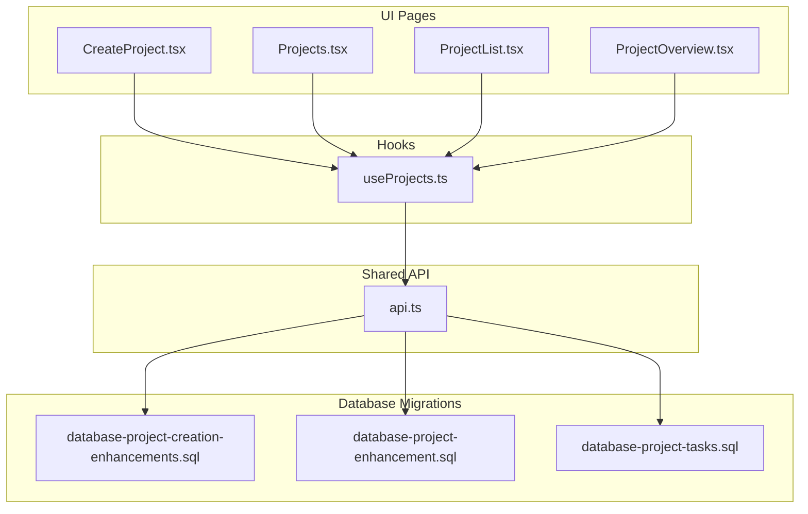
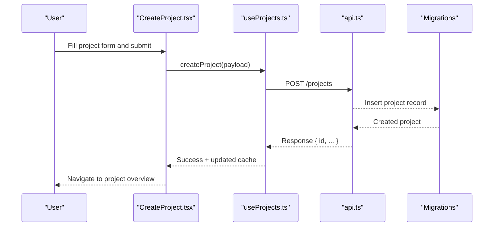
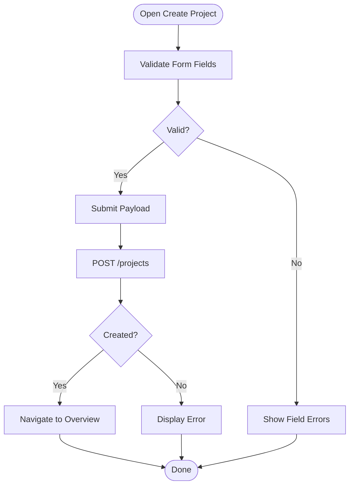
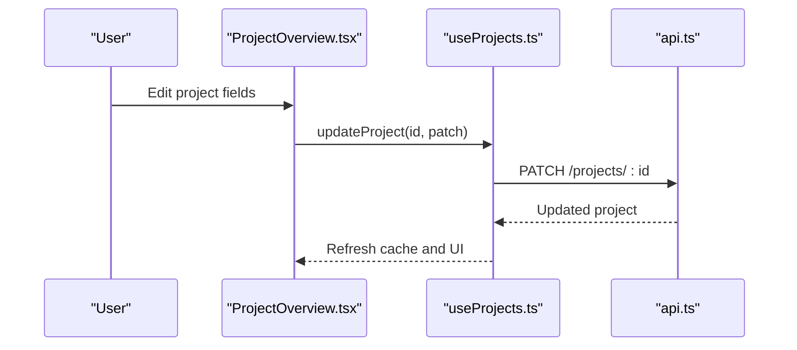
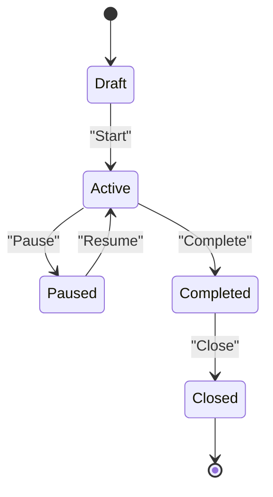
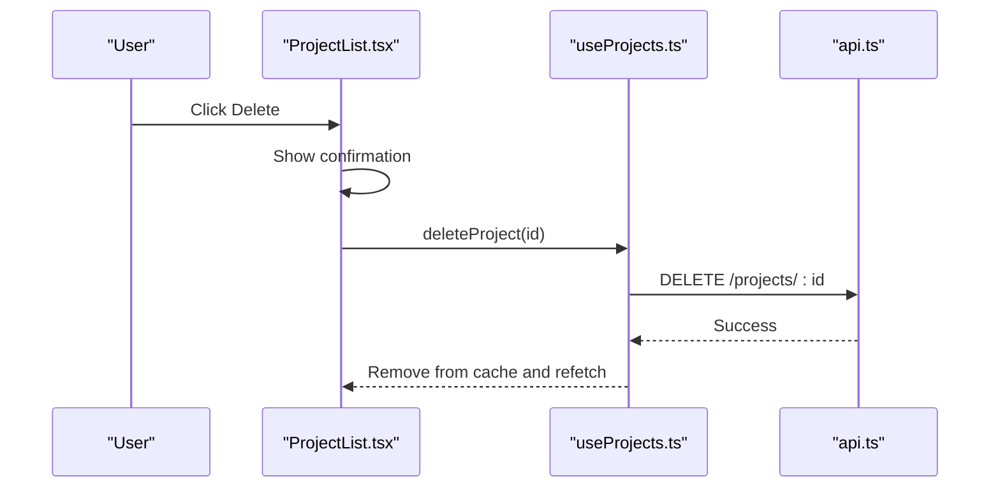
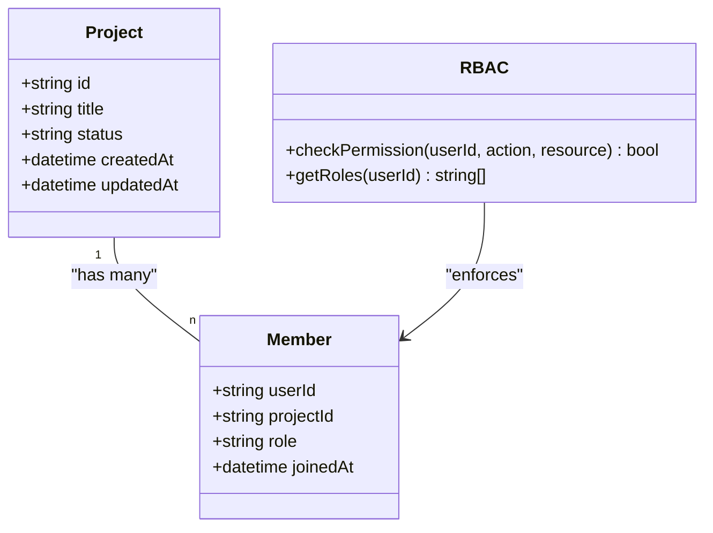
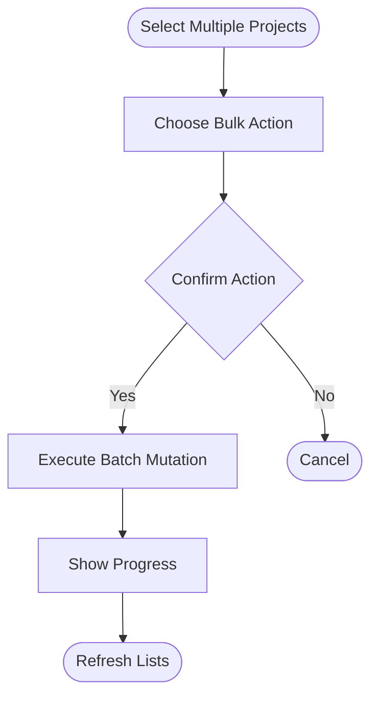
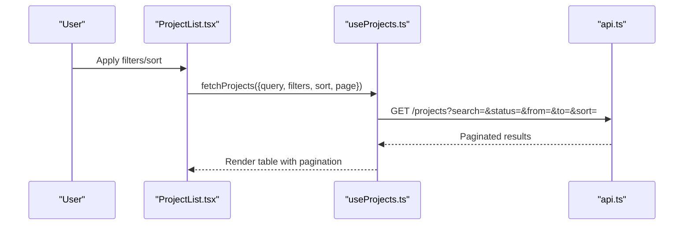
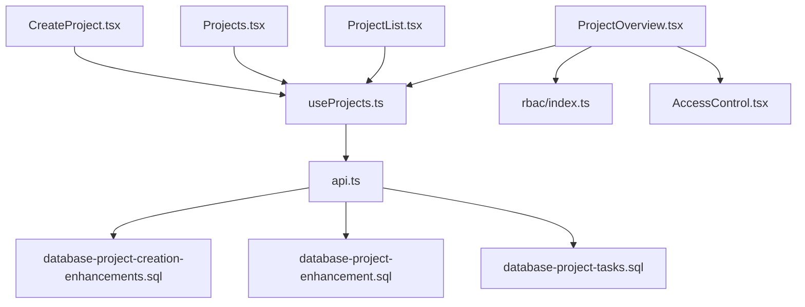

# Project Lifecycle API

<cite>
**Referenced Files in This Document**
- [CreateProject.tsx](file://src/pages/CreateProject.tsx)
- [Projects.tsx](file://src/pages/Projects.tsx)
- [ProjectList.tsx](file://src/pages/ProjectList.tsx)
- [ProjectOverview.tsx](file://src/pages/ProjectOverview.tsx)
- [useProjects.ts](file://src/hooks/useProjects.ts)
- [api.ts](file://src/api.ts)
- [database-project-creation-enhancements.sql](file://src/database-project-creation-enhancements.sql)
- [database-project-enhancement.sql](file://src/database-project-enhancement.sql)
- [database-project-tasks.sql](file://src/database-project-tasks.sql)
- [AccessControl.tsx](file://src/pages/AccessControl.tsx)
- [rbac/index.ts](file://src/rbac/index.ts)
</cite>

## Table of Contents
1. [Introduction](#introduction)
2. [Project Structure](#project-structure)
3. [Core Components](#core-components)
4. [Architecture Overview](#architecture-overview)
5. [Detailed Component Analysis](#detailed-component-analysis)
6. [Dependency Analysis](#dependency-analysis)
7. [Performance Considerations](#performance-considerations)
8. [Troubleshooting Guide](#troubleshooting-guide)
9. [Conclusion](#conclusion)

## Introduction
This document provides detailed API documentation for project lifecycle management endpoints and their client-side integration. It covers project creation, updates, status transitions, deletion, metadata management, team member assignment, access control, template usage, bulk operations, and search/filter capabilities. It also includes example workflows for project initialization, status management, and team collaboration features.

## Project Structure
The project lifecycle is implemented across UI pages, hooks, shared API utilities, and database schema migrations:
- Pages handle user interactions and orchestrate API calls.
- Hooks encapsulate data fetching, caching, mutations, and state synchronization.
- Shared API utilities centralize HTTP requests and error handling.
- Database migrations define the project entity, relationships, and constraints.



**Diagram sources**
- [CreateProject.tsx](file://src/pages/CreateProject.tsx)
- [Projects.tsx](file://src/pages/Projects.tsx)
- [ProjectList.tsx](file://src/pages/ProjectList.tsx)
- [ProjectOverview.tsx](file://src/pages/ProjectOverview.tsx)
- [useProjects.ts](file://src/hooks/useProjects.ts)
- [api.ts](file://src/api.ts)
- [database-project-creation-enhancements.sql](file://src/database-project-creation-enhancements.sql)
- [database-project-enhancement.sql](file://src/database-project-enhancement.sql)
- [database-project-tasks.sql](file://src/database-project-tasks.sql)

**Section sources**
- [CreateProject.tsx](file://src/pages/CreateProject.tsx)
- [Projects.tsx](file://src/pages/Projects.tsx)
- [ProjectList.tsx](file://src/pages/ProjectList.tsx)
- [ProjectOverview.tsx](file://src/pages/ProjectOverview.tsx)
- [useProjects.ts](file://src/hooks/useProjects.ts)
- [api.ts](file://src/api.ts)
- [database-project-creation-enhancements.sql](file://src/database-project-creation-enhancements.sql)
- [database-project-enhancement.sql](file://src/database-project-enhancement.sql)
- [database-project-tasks.sql](file://src/database-project-tasks.sql)

## Core Components
- Project Creation Page: Orchestrates form inputs, validation, and submission to create a new project.
- Projects List Page: Displays paginated projects with filters and actions (edit, delete).
- Project Overview Page: Shows details, status, members, tasks, and related resources.
- useProjects Hook: Encapsulates queries and mutations for CRUD operations, filtering, and pagination.
- Shared API Utility: Centralizes HTTP calls, headers, and error normalization.

Key responsibilities:
- Create: Validate payload, call create endpoint, handle success/error, refresh lists.
- Read: Fetch single project or list with filters; cache results; support pagination.
- Update: Patch fields like title, description, status, metadata; optimistic updates where applicable.
- Delete: Confirm action, call delete endpoint, remove from cache, navigate away.
- Team Management: Add/remove members, update roles, enforce RBAC checks.
- Status Transitions: Enforce allowed transitions and persist changes.
- Search/Filter: Apply query parameters for text search, status, date ranges, tags.
- Templates: Initialize project from a template by copying default structure and settings.

**Section sources**
- [CreateProject.tsx](file://src/pages/CreateProject.tsx)
- [Projects.tsx](file://src/pages/Projects.tsx)
- [ProjectList.tsx](file://src/pages/ProjectList.tsx)
- [ProjectOverview.tsx](file://src/pages/ProjectOverview.tsx)
- [useProjects.ts](file://src/hooks/useProjects.ts)
- [api.ts](file://src/api.ts)

## Architecture Overview
The client-side architecture follows a layered approach:
- UI Layer: React pages render forms and tables, dispatch actions via hooks.
- Data Layer: useProjects hook manages queries/mutations using a request manager.
- API Layer: api.ts sends HTTP requests to backend services.
- Persistence Layer: Database schemas define entities and constraints.



**Diagram sources**
- [CreateProject.tsx](file://src/pages/CreateProject.tsx)
- [useProjects.ts](file://src/hooks/useProjects.ts)
- [api.ts](file://src/api.ts)
- [database-project-creation-enhancements.sql](file://src/database-project-creation-enhancements.sql)

## Detailed Component Analysis

### Project Creation Workflow
- Inputs: Title, description, start/end dates, budget, currency, tags, template selection.
- Validation: Required fields, date ordering, numeric ranges.
- Submission: Calls create endpoint; on success, navigates to overview.
- Error Handling: Displays server errors and field-level issues.



**Diagram sources**
- [CreateProject.tsx](file://src/pages/CreateProject.tsx)
- [useProjects.ts](file://src/hooks/useProjects.ts)
- [api.ts](file://src/api.ts)

**Section sources**
- [CreateProject.tsx](file://src/pages/CreateProject.tsx)
- [useProjects.ts](file://src/hooks/useProjects.ts)
- [api.ts](file://src/api.ts)

### Project Updates and Metadata Management
- Supported fields: Title, description, status, dates, budget, currency, tags, custom metadata.
- Optimistic Updates: UI reflects changes immediately; rollback on failure.
- Conflict Resolution: Last-write-wins with server validation; show conflict prompts if needed.



**Diagram sources**
- [ProjectOverview.tsx](file://src/pages/ProjectOverview.tsx)
- [useProjects.ts](file://src/hooks/useProjects.ts)
- [api.ts](file://src/api.ts)

**Section sources**
- [ProjectOverview.tsx](file://src/pages/ProjectOverview.tsx)
- [useProjects.ts](file://src/hooks/useProjects.ts)
- [api.ts](file://src/api.ts)

### Status Transitions
- Allowed transitions are enforced by server-side rules; client displays valid next states.
- Transition actions include starting, pausing, resuming, completing, and closing projects.
- Audit trail: Each transition logs actor, timestamp, and reason.



**Diagram sources**
- [database-project-enhancement.sql](file://src/database-project-enhancement.sql)
- [useProjects.ts](file://src/hooks/useProjects.ts)

**Section sources**
- [database-project-enhancement.sql](file://src/database-project-enhancement.sql)
- [useProjects.ts](file://src/hooks/useProjects.ts)

### Deletion Operations
- Soft delete preferred: Mark project as deleted without removing records.
- Confirmation dialog required before deletion.
- Cascading effects: Archive dependent items or prevent deletion if constraints exist.



**Diagram sources**
- [ProjectList.tsx](file://src/pages/ProjectList.tsx)
- [useProjects.ts](file://src/hooks/useProjects.ts)
- [api.ts](file://src/api.ts)

**Section sources**
- [ProjectList.tsx](file://src/pages/ProjectList.tsx)
- [useProjects.ts](file://src/hooks/useProjects.ts)
- [api.ts](file://src/api.ts)

### Team Member Assignment and Access Control
- Assign members with roles (e.g., owner, admin, editor, viewer).
- Role-based access control (RBAC) gates sensitive actions.
- Invitation flow: Invite users by email; accept invitation to join.



**Diagram sources**
- [AccessControl.tsx](file://src/pages/AccessControl.tsx)
- [rbac/index.ts](file://src/rbac/index.ts)
- [database-project-enhancement.sql](file://src/database-project-enhancement.sql)

**Section sources**
- [AccessControl.tsx](file://src/pages/AccessControl.tsx)
- [rbac/index.ts](file://src/rbac/index.ts)
- [database-project-enhancement.sql](file://src/database-project-enhancement.sql)

### Template Usage
- Select a template during creation to pre-populate fields, milestones, and default tasks.
- Template application copies baseline data into the new project.
- Versioning: Templates can be versioned to ensure consistency over time.

```mermaid
sequenceDiagram
participant User as "User"
participant Create as "CreateProject.tsx"
participant Hook as "useProjects.ts"
participant API as "api.ts"
User->>Create : Choose template
Create->>Hook : createFromTemplate(templateId, baseData)
Hook->>API : POST /projects/from-template
API-->>Hook : New project with templated data
Hook-->>Create : Success and navigate
```

**Diagram sources**
- [CreateProject.tsx](file://src/pages/CreateProject.tsx)
- [useProjects.ts](file://src/hooks/useProjects.ts)
- [api.ts](file://src/api.ts)

**Section sources**
- [CreateProject.tsx](file://src/pages/CreateProject.tsx)
- [useProjects.ts](file://src/hooks/useProjects.ts)
- [api.ts](file://src/api.ts)

### Bulk Operations
- Bulk status change: Select multiple projects and apply a status transition.
- Bulk assign: Add/remove members across selected projects.
- Batch confirmations and progress indicators for large sets.



**Diagram sources**
- [ProjectList.tsx](file://src/pages/ProjectList.tsx)
- [useProjects.ts](file://src/hooks/useProjects.ts)
- [api.ts](file://src/api.ts)

**Section sources**
- [ProjectList.tsx](file://src/pages/ProjectList.tsx)
- [useProjects.ts](file://src/hooks/useProjects.ts)
- [api.ts](file://src/api.ts)

### Search and Filter Capabilities
- Text search: By title, description, tags.
- Filters: Status, date range, creator, assigned members.
- Sorting: By created date, updated date, title.
- Pagination: Server-side pagination with page size controls.



**Diagram sources**
- [ProjectList.tsx](file://src/pages/ProjectList.tsx)
- [useProjects.ts](file://src/hooks/useProjects.ts)
- [api.ts](file://src/api.ts)

**Section sources**
- [ProjectList.tsx](file://src/pages/ProjectList.tsx)
- [useProjects.ts](file://src/hooks/useProjects.ts)
- [api.ts](file://src/api.ts)

### Example Workflows

#### Project Initialization Workflow
- Steps:
  - Open Create Project page.
  - Fill required fields and select optional template.
  - Submit form; handle success and navigation.
  - On error, display messages and allow corrections.

**Section sources**
- [CreateProject.tsx](file://src/pages/CreateProject.tsx)
- [useProjects.ts](file://src/hooks/useProjects.ts)
- [api.ts](file://src/api.ts)

#### Status Management Workflow
- Steps:
  - View current status in Project Overview.
  - Choose allowed next status based on rules.
  - Confirm transition; persist change; update audit log.

**Section sources**
- [ProjectOverview.tsx](file://src/pages/ProjectOverview.tsx)
- [useProjects.ts](file://src/hooks/useProjects.ts)
- [database-project-enhancement.sql](file://src/database-project-enhancement.sql)

#### Team Collaboration Workflow
- Steps:
  - Open Project Overview > Members tab.
  - Invite new member by email or add existing user.
  - Assign role; verify permissions via RBAC.
  - Manage roles and remove members as needed.

**Section sources**
- [ProjectOverview.tsx](file://src/pages/ProjectOverview.tsx)
- [AccessControl.tsx](file://src/pages/AccessControl.tsx)
- [rbac/index.ts](file://src/rbac/index.ts)

## Dependency Analysis
- UI components depend on hooks for data operations.
- Hooks depend on shared API utilities for HTTP requests.
- API layer interacts with database schemas defined in migrations.
- RBAC module enforces permissions across project-related actions.



**Diagram sources**
- [CreateProject.tsx](file://src/pages/CreateProject.tsx)
- [Projects.tsx](file://src/pages/Projects.tsx)
- [ProjectList.tsx](file://src/pages/ProjectList.tsx)
- [ProjectOverview.tsx](file://src/pages/ProjectOverview.tsx)
- [useProjects.ts](file://src/hooks/useProjects.ts)
- [api.ts](file://src/api.ts)
- [database-project-creation-enhancements.sql](file://src/database-project-creation-enhancements.sql)
- [database-project-enhancement.sql](file://src/database-project-enhancement.sql)
- [database-project-tasks.sql](file://src/database-project-tasks.sql)
- [AccessControl.tsx](file://src/pages/AccessControl.tsx)
- [rbac/index.ts](file://src/rbac/index.ts)

**Section sources**
- [useProjects.ts](file://src/hooks/useProjects.ts)
- [api.ts](file://src/api.ts)
- [database-project-creation-enhancements.sql](file://src/database-project-creation-enhancements.sql)
- [database-project-enhancement.sql](file://src/database-project-enhancement.sql)
- [database-project-tasks.sql](file://src/database-project-tasks.sql)
- [AccessControl.tsx](file://src/pages/AccessControl.tsx)
- [rbac/index.ts](file://src/rbac/index.ts)

## Performance Considerations
- Use server-side pagination and filtering to reduce payload sizes.
- Cache frequently accessed project lists and details; invalidate on mutations.
- Debounce search input to minimize network requests.
- Implement optimistic updates for non-critical edits to improve perceived performance.
- Monitor and log slow queries; consider indexing commonly filtered columns.

[No sources needed since this section provides general guidance]

## Troubleshooting Guide
Common issues and resolutions:
- Validation failures: Ensure all required fields are present and correctly formatted.
- Permission denied: Verify user roles and RBAC policies for the requested action.
- Network errors: Check connectivity and retry logic; inspect response codes and messages.
- State inconsistencies: Refetch data after mutations; clear stale cache entries.

**Section sources**
- [useProjects.ts](file://src/hooks/useProjects.ts)
- [api.ts](file://src/api.ts)
- [AccessControl.tsx](file://src/pages/AccessControl.tsx)

## Conclusion
The project lifecycle API integrates UI pages, hooks, shared API utilities, and database schemas to provide robust CRUD operations, status management, team collaboration, templates, bulk actions, and search/filter capabilities. Adhering to RBAC and enforcing server-side validations ensures secure and consistent behavior across the application.

[No sources needed since this section summarizes without analyzing specific files]