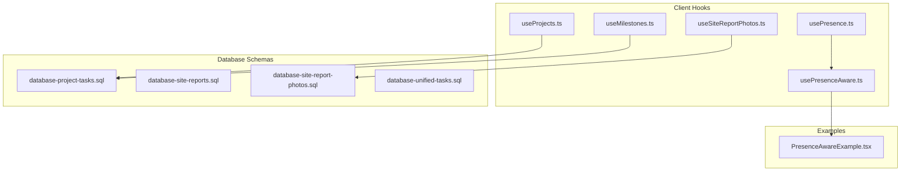
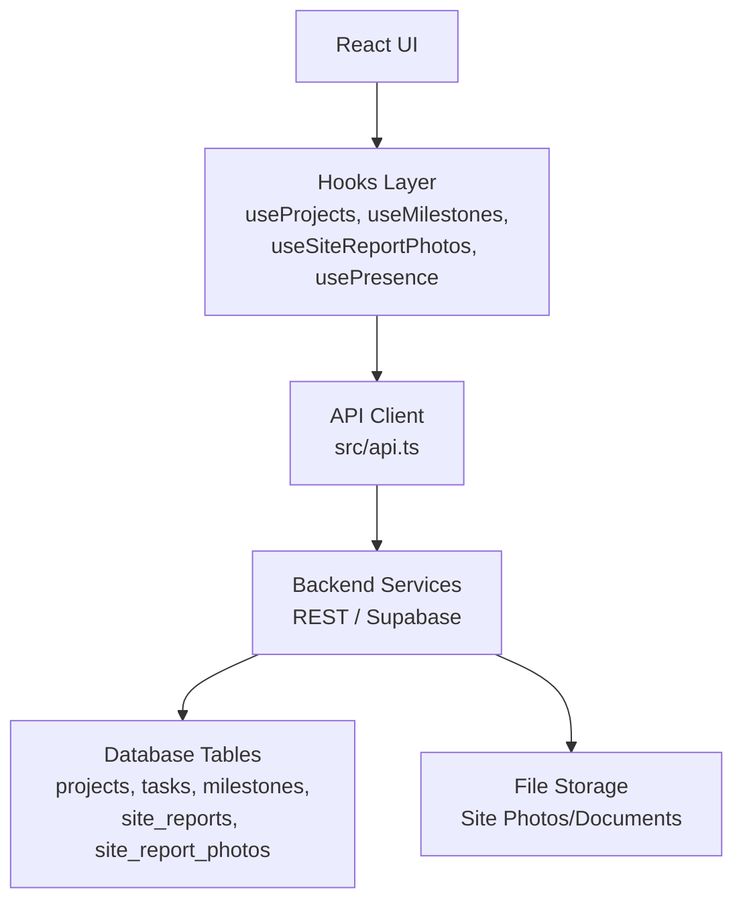
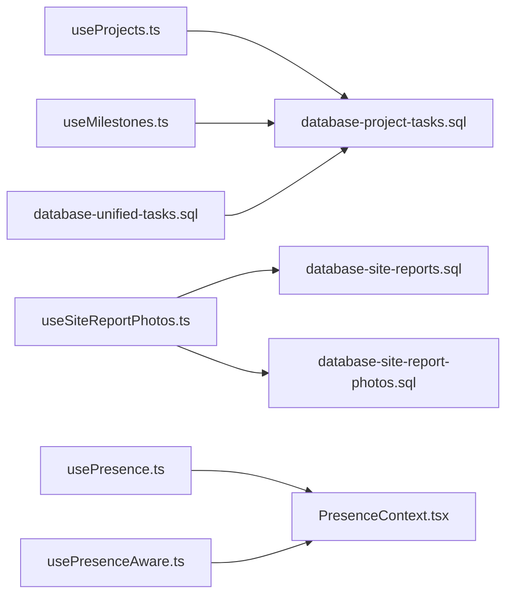

# Projects & Tasks API

<cite>
**Referenced Files in This Document**
- [useProjects.ts](file://src/hooks/useProjects.ts)
- [useMilestones.ts](file://src/hooks/useMilestones.ts)
- [useSiteReportPhotos.ts](file://src/hooks/useSiteReportPhotos.ts)
- [usePresence.ts](file://src/hooks/usePresence.ts)
- [PresenceContext.tsx](file://src/contexts/PresenceContext.tsx)
- [usePresenceAware.ts](file://src/hooks/usePresenceAware.ts)
- [PresenceAwareExample.tsx](file://src/examples/PresenceAwareExample.tsx)
- [api.ts](file://src/api.ts)
- [database-project-tasks.sql](file://src/database-project-tasks.sql)
- [database-site-reports.sql](file://src/database-site-reports.sql)
- [database-site-report-photos.sql](file://src/database-site-report-photos.sql)
- [database-unified-tasks.sql](file://src/database-unified-tasks.sql)
</cite>

## Table of Contents
1. [Introduction](#introduction)
2. [Project Structure](#project-structure)
3. [Core Components](#core-components)
4. [Architecture Overview](#architecture-overview)
5. [Detailed Component Analysis](#detailed-component-analysis)
6. [Dependency Analysis](#dependency-analysis)
7. [Performance Considerations](#performance-considerations)
8. [Troubleshooting Guide](#troubleshooting-guide)
9. [Conclusion](#conclusion)
10. [Appendices](#appendices)

## Introduction
This document provides comprehensive API documentation for project management and task coordination features, including:
- Project lifecycle operations (create, update, list, archive)
- Task assignment and tracking
- Milestone management
- Site report submissions and photo uploads
- Real-time collaboration with presence awareness and conflict resolution
- File upload capabilities for site photos and documents
- Progress tracking metrics and reporting endpoints
- Practical examples for project setup, task delegation, and progress monitoring workflows

The implementation is client-side focused using React hooks that wrap HTTP calls to a backend (Supabase or REST). The repository exposes typed hooks and database schema definitions that define the data model and relationships.

## Project Structure
Key areas relevant to this API documentation:
- Hooks for projects, milestones, site reports, and presence
- Database schemas defining entities and relationships
- Example usage demonstrating presence-aware collaboration

**Diagram sources**
- [useProjects.ts](file://src/hooks/useProjects.ts)
- [useMilestones.ts](file://src/hooks/useMilestones.ts)
- [useSiteReportPhotos.ts](file://src/hooks/useSiteReportPhotos.ts)
- [usePresence.ts](file://src/hooks/usePresence.ts)
- [usePresenceAware.ts](file://src/hooks/usePresenceAware.ts)
- [database-project-tasks.sql](file://src/database-project-tasks.sql)
- [database-site-reports.sql](file://src/database-site-reports.sql)
- [database-site-report-photos.sql](file://src/database-site-report-photos.sql)
- [database-unified-tasks.sql](file://src/database-unified-tasks.sql)
- [PresenceAwareExample.tsx](file://src/examples/PresenceAwareExample.tsx)

**Section sources**
- [useProjects.ts](file://src/hooks/useProjects.ts)
- [useMilestones.ts](file://src/hooks/useMilestones.ts)
- [useSiteReportPhotos.ts](file://src/hooks/useSiteReportPhotos.ts)
- [usePresence.ts](file://src/hooks/usePresence.ts)
- [usePresenceAware.ts](file://src/hooks/usePresenceAware.ts)
- [PresenceAwareExample.tsx](file://src/examples/PresenceAwareExample.tsx)
- [database-project-tasks.sql](file://src/database-project-tasks.sql)
- [database-site-reports.sql](file://src/database-site-reports.sql)
- [database-site-report-photos.sql](file://src/database-site-report-photos.sql)
- [database-unified-tasks.sql](file://src/database-unified-tasks.sql)

## Core Components
- Projects API: CRUD operations for projects, listing, filtering, and archiving via useProjects hook.
- Milestones API: Create, update, delete, and list milestones tied to projects via useMilestones hook.
- Site Reports API: Submit site reports and manage associated photos via useSiteReportPhotos hook.
- Presence & Collaboration: Presence context and hooks for real-time user presence and conflict resolution patterns.
- Data Models: SQL schemas define tables and relationships for tasks, milestones, site reports, and photos.

**Section sources**
- [useProjects.ts](file://src/hooks/useProjects.ts)
- [useMilestones.ts](file://src/hooks/useMilestones.ts)
- [useSiteReportPhotos.ts](file://src/hooks/useSiteReportPhotos.ts)
- [usePresence.ts](file://src/hooks/usePresence.ts)
- [usePresenceAware.ts](file://src/hooks/usePresenceAware.ts)
- [database-project-tasks.sql](file://src/database-project-tasks.sql)
- [database-site-reports.sql](file://src/database-site-reports.sql)
- [database-site-report-photos.sql](file://src/database-site-report-photos.sql)
- [database-unified-tasks.sql](file://src/database-unified-tasks.sql)

## Architecture Overview
High-level architecture showing how client hooks interact with backend services and storage:

[No sources needed since this diagram shows conceptual workflow, not actual code structure]

## Detailed Component Analysis

### Projects API
Operations:
- List projects with filters (status, search, pagination)
- Get project by ID
- Create project
- Update project fields
- Archive or restore project
- Assign team members and roles

Data Model Highlights:
- Project entity includes identifiers, metadata, status, dates, and links to tasks/milestones.
- Relationships defined in database schema ensure referential integrity.

Usage Patterns:
- useProjects hook provides methods like fetchList, getById, create, update, archive.
- Typical flow: initialize query, handle loading/error states, mutate on success.

Progress Metrics:
- Aggregate task completion percentage per project.
- Milestone completion indicators.

**Section sources**
- [useProjects.ts](file://src/hooks/useProjects.ts)
- [database-project-tasks.sql](file://src/database-project-tasks.sql)

### Milestones API
Operations:
- Create milestone linked to a project
- Update milestone details (title, due date, status)
- Delete milestone
- List milestones filtered by project and status

Data Model Highlights:
- Milestone entity references project_id and tracks order/status.
- Supports ordering and dependency flags if present in schema.

Usage Patterns:
- useMilestones hook provides CRUD methods and list queries.
- Combine with project view to show timeline and progress.

**Section sources**
- [useMilestones.ts](file://src/hooks/useMilestones.ts)
- [database-project-tasks.sql](file://src/database-project-tasks.sql)

### Site Reports API
Operations:
- Submit site report entries (observations, notes, status)
- Upload site photos and documents
- Retrieve report history and attachments
- Link reports to specific projects and sites

Data Model Highlights:
- site_reports table stores report metadata and associations.
- site_report_photos table stores file references and metadata.

Usage Patterns:
- useSiteReportPhotos hook manages photo uploads and retrieval.
- Integrate with form submission flows for report creation.

**Section sources**
- [useSiteReportPhotos.ts](file://src/hooks/useSiteReportPhotos.ts)
- [database-site-reports.sql](file://src/database-site-reports.sql)
- [database-site-report-photos.sql](file://src/database-site-report-photos.sql)

### Presence & Real-Time Collaboration
Features:
- Presence context maintains active users and their session info.
- Presence-aware hooks enable collaborative editing and conflict detection.
- Conflict resolution strategies include last-write-wins with versioning or optimistic updates with rollback.

Usage Patterns:
- Use PresenceContext to subscribe to presence changes.
- Apply usePresenceAware to components needing live updates.
- Implement conflict resolution logic when concurrent edits occur.

**Section sources**
- [usePresence.ts](file://src/hooks/usePresence.ts)
- [PresenceContext.tsx](file://src/contexts/PresenceContext.tsx)
- [usePresenceAware.ts](file://src/hooks/usePresenceAware.ts)
- [PresenceAwareExample.tsx](file://src/examples/PresenceAwareExample.tsx)

### Unified Tasks API
Operations:
- Create, update, assign, and track tasks across projects.
- Manage task statuses, priorities, and due dates.
- Query tasks by assignee, project, or status.

Data Model Highlights:
- Unified tasks schema centralizes task records and relationships.
- Supports linking to milestones and site reports as applicable.

Usage Patterns:
- Use existing hooks or extend useProjects/useMilestones to integrate task operations.
- Provide task delegation workflows with notifications.

**Section sources**
- [database-unified-tasks.sql](file://src/database-unified-tasks.sql)
- [database-project-tasks.sql](file://src/database-project-tasks.sql)

## Dependency Analysis
Relationships between hooks and database schemas:

**Diagram sources**
- [useProjects.ts](file://src/hooks/useProjects.ts)
- [useMilestones.ts](file://src/hooks/useMilestones.ts)
- [useSiteReportPhotos.ts](file://src/hooks/useSiteReportPhotos.ts)
- [usePresence.ts](file://src/hooks/usePresence.ts)
- [usePresenceAware.ts](file://src/hooks/usePresenceAware.ts)
- [PresenceContext.tsx](file://src/contexts/PresenceContext.tsx)
- [database-project-tasks.sql](file://src/database-project-tasks.sql)
- [database-site-reports.sql](file://src/database-site-reports.sql)
- [database-site-report-photos.sql](file://src/database-site-report-photos.sql)
- [database-unified-tasks.sql](file://src/database-unified-tasks.sql)

**Section sources**
- [useProjects.ts](file://src/hooks/useProjects.ts)
- [useMilestones.ts](file://src/hooks/useMilestones.ts)
- [useSiteReportPhotos.ts](file://src/hooks/useSiteReportPhotos.ts)
- [usePresence.ts](file://src/hooks/usePresence.ts)
- [usePresenceAware.ts](file://src/hooks/usePresenceAware.ts)
- [PresenceContext.tsx](file://src/contexts/PresenceContext.tsx)
- [database-project-tasks.sql](file://src/database-project-tasks.sql)
- [database-site-reports.sql](file://src/database-site-reports.sql)
- [database-site-report-photos.sql](file://src/database-site-report-photos.sql)
- [database-unified-tasks.sql](file://src/database-unified-tasks.sql)

## Performance Considerations
- Prefer paginated lists and selective field fetching to reduce payload sizes.
- Cache frequently accessed project and milestone data; invalidate on mutations.
- Debounce search inputs and filter changes to minimize network requests.
- For presence updates, throttle events and batch updates where possible.
- Optimize photo uploads with compression and chunked transfers.

[No sources needed since this section provides general guidance]

## Troubleshooting Guide
Common issues and resolutions:
- Network errors: Check API client configuration and authentication headers.
- Schema mismatches: Ensure database migrations are applied and match hook expectations.
- Presence drift: Re-sync presence state on reconnect; implement retry/backoff.
- Photo upload failures: Validate file size/type; retry failed chunks; log server responses.

**Section sources**
- [api.ts](file://src/api.ts)
- [usePresence.ts](file://src/hooks/usePresence.ts)
- [useSiteReportPhotos.ts](file://src/hooks/useSiteReportPhotos.ts)

## Conclusion
The Projects & Tasks API provides robust capabilities for managing projects, tasks, milestones, and site reports with real-time collaboration support. By leveraging typed hooks and well-defined database schemas, teams can implement efficient workflows for project setup, task delegation, and progress monitoring while maintaining data integrity and performance.

[No sources needed since this section summarizes without analyzing specific files]

## Appendices

### Example Workflows

#### Project Setup Workflow
- Initialize project via create operation.
- Add milestones and assign owners.
- Invite team members and set permissions.
- Monitor initial progress through task completion metrics.

**Section sources**
- [useProjects.ts](file://src/hooks/useProjects.ts)
- [useMilestones.ts](file://src/hooks/useMilestones.ts)

#### Task Delegation Workflow
- Create tasks linked to milestones.
- Assign tasks to team members with due dates.
- Track status transitions and send notifications.
- Resolve conflicts using presence-aware updates.

**Section sources**
- [database-unified-tasks.sql](file://src/database-unified-tasks.sql)
- [usePresenceAware.ts](file://src/hooks/usePresenceAware.ts)

#### Progress Monitoring Workflow
- Aggregate task completion percentages.
- Visualize milestone progress and overdue items.
- Generate periodic reports and export summaries.

**Section sources**
- [useProjects.ts](file://src/hooks/useProjects.ts)
- [useMilestones.ts](file://src/hooks/useMilestones.ts)