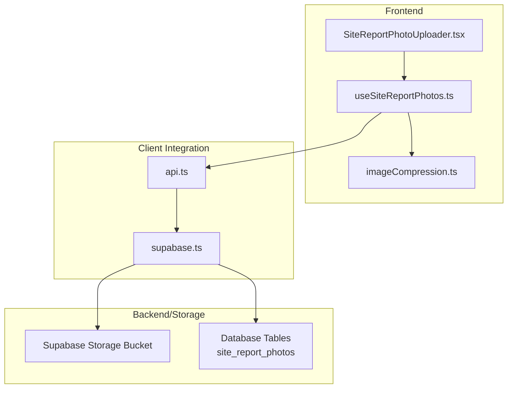
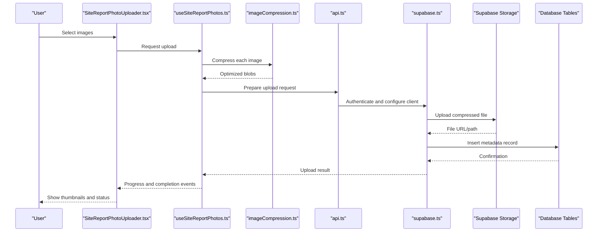
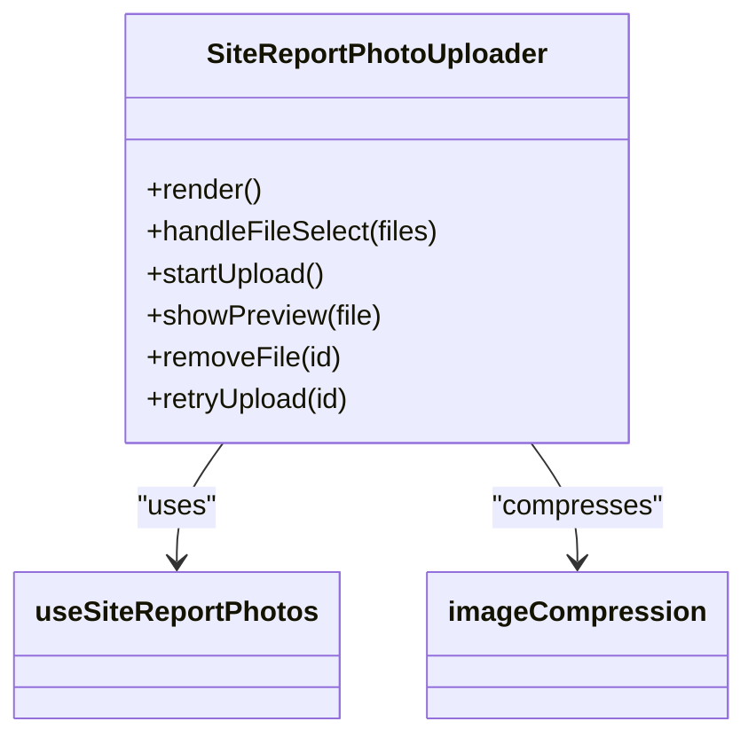
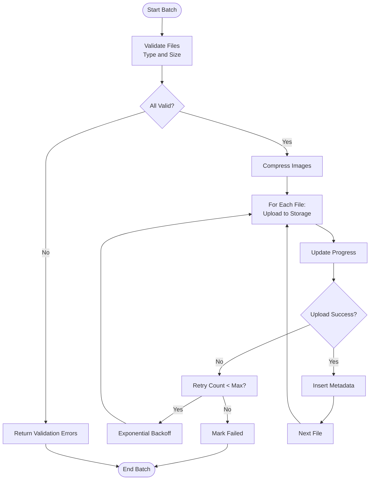
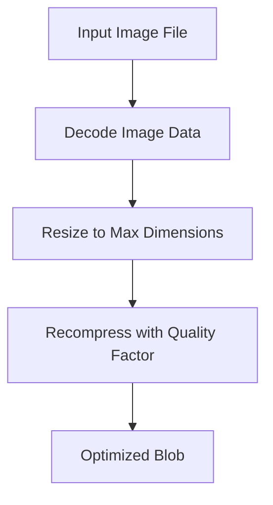
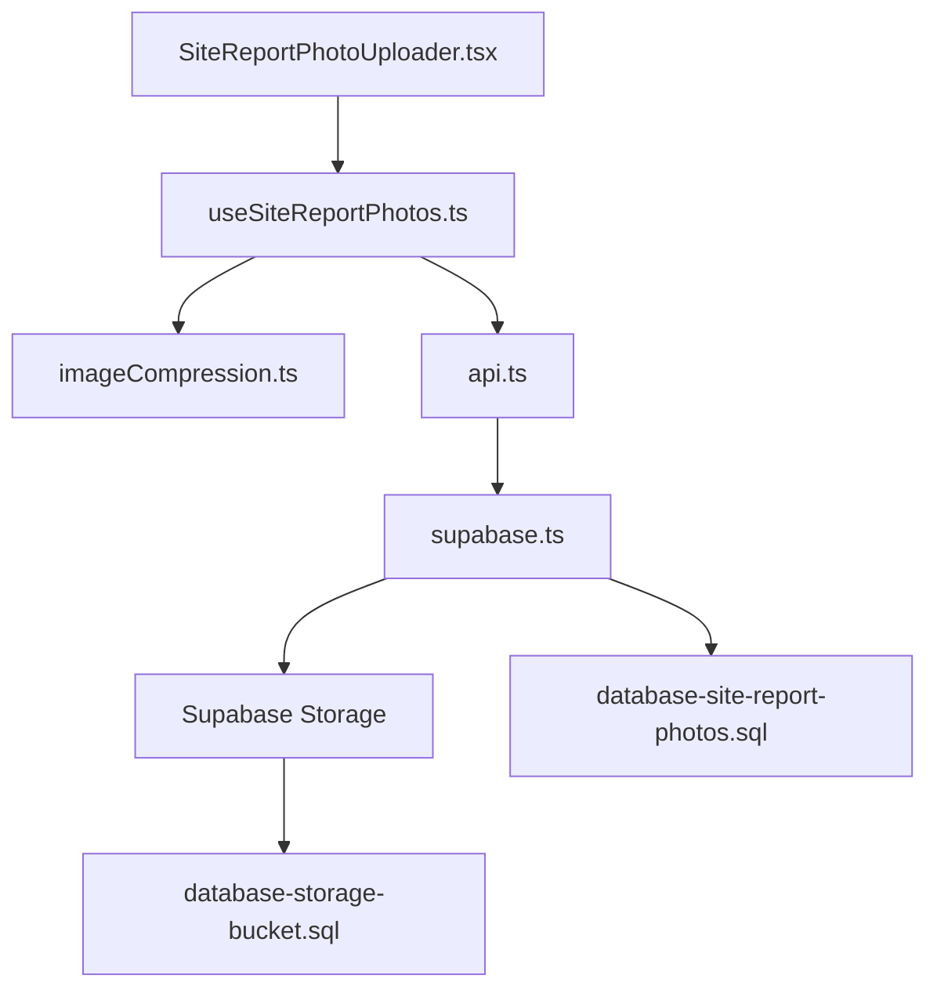

# Photo Upload & Media Management

<cite>
**Referenced Files in This Document**
- [SiteReportPhotoUploader.tsx](file://src/components/SiteReportPhotoUploader.tsx)
- [useSiteReportPhotos.ts](file://src/hooks/useSiteReportPhotos.ts)
- [imageCompression.ts](file://src/lib/imageCompression.ts)
- [database-site-report-photos.sql](file://src/database-site-report-photos.sql)
- [database-storage-bucket.sql](file://src/database-storage-bucket.sql)
- [api.ts](file://src/api.ts)
- [supabase.ts](file://src/supabase.ts)
</cite>

## Table of Contents
1. [Introduction](#introduction)
2. [Project Structure](#project-structure)
3. [Core Components](#core-components)
4. [Architecture Overview](#architecture-overview)
5. [Detailed Component Analysis](#detailed-component-analysis)
6. [Dependency Analysis](#dependency-analysis)
7. [Performance Considerations](#performance-considerations)
8. [Troubleshooting Guide](#troubleshooting-guide)
9. [Conclusion](#conclusion)
10. [Appendices](#appendices)

## Introduction
This document provides comprehensive API documentation for photo upload and media management within site reports. It covers file upload endpoints, supported formats, size limitations, compression algorithms, image processing capabilities, thumbnail generation, storage optimization, batch uploads, progress tracking, error recovery, metadata handling, and access control for uploaded media files. The goal is to enable developers to integrate robust photo upload workflows into site report features with clear guidance on implementation patterns and best practices.

## Project Structure
The photo upload and media management functionality spans UI components, hooks, client libraries, database schemas, and Supabase storage configuration:

- UI component for selecting and uploading photos from site reports
- Hook for managing site report photos (upload state, progress, errors)
- Image compression utility for client-side optimization
- Database schema for storing photo metadata and relationships
- Storage bucket setup for object storage
- API client integration for interacting with backend services
- Supabase client initialization for authenticated requests

**Diagram sources**
- [SiteReportPhotoUploader.tsx](file://src/components/SiteReportPhotoUploader.tsx)
- [useSiteReportPhotos.ts](file://src/hooks/useSiteReportPhotos.ts)
- [imageCompression.ts](file://src/lib/imageCompression.ts)
- [api.ts](file://src/api.ts)
- [supabase.ts](file://src/supabase.ts)
- [database-site-report-photos.sql](file://src/database-site-report-photos.sql)
- [database-storage-bucket.sql](file://src/database-storage-bucket.sql)

**Section sources**
- [SiteReportPhotoUploader.tsx](file://src/components/SiteReportPhotoUploader.tsx)
- [useSiteReportPhotos.ts](file://src/hooks/useSiteReportPhotos.ts)
- [imageCompression.ts](file://src/lib/imageCompression.ts)
- [database-site-report-photos.sql](file://src/database-site-report-photos.sql)
- [database-storage-bucket.sql](file://src/database-storage-bucket.sql)
- [api.ts](file://src/api.ts)
- [supabase.ts](file://src/supabase.ts)

## Core Components
- SiteReportPhotoUploader: Provides the user interface for selecting images, previewing them, initiating uploads, and displaying progress and errors. It integrates with the hook for state management and uses the compression utility before upload.
- useSiteReportPhotos: Manages the lifecycle of photo uploads including batching, progress tracking, retry logic, and error handling. It coordinates with the API client and Supabase client for storage operations.
- imageCompression: Performs client-side image compression and resizing to reduce payload sizes and improve upload performance. Supports common image formats and configurable quality settings.
- Database Schema (site_report_photos): Defines tables and relationships for storing photo metadata, linking photos to site reports, and maintaining audit fields.
- Storage Bucket Setup: Configures Supabase storage buckets, policies, and naming conventions for organizing site report media.
- API Client (api.ts): Centralizes HTTP request utilities, headers, authentication, and error normalization.
- Supabase Client (supabase.ts): Initializes the Supabase client with environment configuration and auth context.

Key responsibilities:
- Validate file types and sizes before upload
- Compress images to optimize storage and bandwidth
- Upload files to Supabase storage with secure paths
- Persist metadata to the database
- Provide progress updates and error recovery
- Enforce access control via RLS policies

**Section sources**
- [SiteReportPhotoUploader.tsx](file://src/components/SiteReportPhotoUploader.tsx)
- [useSiteReportPhotos.ts](file://src/hooks/useSiteReportPhotos.ts)
- [imageCompression.ts](file://src/lib/imageCompression.ts)
- [database-site-report-photos.sql](file://src/database-site-report-photos.sql)
- [database-storage-bucket.sql](file://src/database-storage-bucket.sql)
- [api.ts](file://src/api.ts)
- [supabase.ts](file://src/supabase.ts)

## Architecture Overview
The photo upload workflow involves client-side validation and compression, authenticated upload to Supabase storage, and metadata persistence to the database. Access control is enforced through Supabase policies and application-level checks.

**Diagram sources**
- [SiteReportPhotoUploader.tsx](file://src/components/SiteReportPhotoUploader.tsx)
- [useSiteReportPhotos.ts](file://src/hooks/useSiteReportPhotos.ts)
- [imageCompression.ts](file://src/lib/imageCompression.ts)
- [api.ts](file://src/api.ts)
- [supabase.ts](file://src/supabase.ts)
- [database-site-report-photos.sql](file://src/database-site-report-photos.sql)
- [database-storage-bucket.sql](file://src/database-storage-bucket.sql)

## Detailed Component Analysis

### SiteReportPhotoUploader Component
Responsibilities:
- Render file input and preview thumbnails
- Trigger upload via the hook
- Display per-file progress and overall batch progress
- Surface validation errors and network failures
- Allow retry or removal of failed uploads

Integration points:
- Uses useSiteReportPhotos for state and actions
- Consumes imageCompression for pre-upload optimization
- Displays messages based on API responses

**Diagram sources**
- [SiteReportPhotoUploader.tsx](file://src/components/SiteReportPhotoUploader.tsx)
- [useSiteReportPhotos.ts](file://src/hooks/useSiteReportPhotos.ts)
- [imageCompression.ts](file://src/lib/imageCompression.ts)

**Section sources**
- [SiteReportPhotoUploader.tsx](file://src/components/SiteReportPhotoUploader.tsx)
- [useSiteReportPhotos.ts](file://src/hooks/useSiteReportPhotos.ts)
- [imageCompression.ts](file://src/lib/imageCompression.ts)

### useSiteReportPhotos Hook
Responsibilities:
- Manage queue of files to upload
- Track per-file and aggregate progress
- Handle retries with exponential backoff
- Normalize errors and provide actionable messages
- Coordinate metadata insertion after successful storage upload

State model:
- files: array of upload items with id, name, type, size, status, progress, error
- batchStatus: idle, uploading, completed, failed
- lastError: normalized error object

Operations:
- addFiles(files): validate and enqueue
- startBatch(): initiate uploads
- retryFile(id): reattempt a single file
- removeFile(id): cancel and remove
- reset(): clear state

**Diagram sources**
- [useSiteReportPhotos.ts](file://src/hooks/useSiteReportPhotos.ts)
- [imageCompression.ts](file://src/lib/imageCompression.ts)
- [api.ts](file://src/api.ts)
- [supabase.ts](file://src/supabase.ts)
- [database-site-report-photos.sql](file://src/database-site-report-photos.sql)

**Section sources**
- [useSiteReportPhotos.ts](file://src/hooks/useSiteReportPhotos.ts)
- [imageCompression.ts](file://src/lib/imageCompression.ts)
- [api.ts](file://src/api.ts)
- [supabase.ts](file://src/supabase.ts)
- [database-site-report-photos.sql](file://src/database-site-report-photos.sql)

### imageCompression Utility
Responsibilities:
- Accept image files and options (quality, max width/height)
- Decode, resize, and recompress using browser APIs
- Return optimized Blob objects ready for upload

Supported formats:
- JPEG, PNG, WebP (browser-dependent)

Configuration:
- Quality factor (0–1)
- Maximum dimensions to prevent oversized uploads
- Target MIME type selection

Complexity:
- Time complexity proportional to image resolution and chosen quality
- Memory usage scales with decoded image buffers; consider streaming for very large images

**Diagram sources**
- [imageCompression.ts](file://src/lib/imageCompression.ts)

**Section sources**
- [imageCompression.ts](file://src/lib/imageCompression.ts)

### Database Schema: site_report_photos
Responsibilities:
- Store photo metadata linked to site reports
- Maintain creation/update timestamps and user references
- Support indexing for efficient queries

Key fields (conceptual):
- id: primary key
- site_report_id: foreign key to site reports
- file_path: reference to storage location
- original_name: original filename
- mime_type: content type
- size_bytes: file size
- width, height: image dimensions
- created_at, updated_at: timestamps
- created_by: user reference

Indexes:
- site_report_id for fast retrieval by report
- created_at for chronological listing

**Section sources**
- [database-site-report-photos.sql](file://src/database-site-report-photos.sql)

### Storage Bucket Setup
Responsibilities:
- Define storage bucket for site report photos
- Configure path structure (e.g., org/project/report/photo-id)
- Set up Row Level Security (RLS) policies for read/write access

Access control:
- Only authenticated users can upload
- Scoped access by organization and project
- Read access restricted to authorized roles

**Section sources**
- [database-storage-bucket.sql](file://src/database-storage-bucket.sql)

### API Client Integration
Responsibilities:
- Centralize HTTP calls and error normalization
- Attach authentication headers
- Provide retry wrappers for transient failures

Integration points:
- useSiteReportPhotos calls API helpers for metadata persistence
- supabase client handles storage uploads directly

**Section sources**
- [api.ts](file://src/api.ts)
- [supabase.ts](file://src/supabase.ts)

## Dependency Analysis
The following diagram illustrates dependencies among core modules involved in photo upload and media management:

**Diagram sources**
- [SiteReportPhotoUploader.tsx](file://src/components/SiteReportPhotoUploader.tsx)
- [useSiteReportPhotos.ts](file://src/hooks/useSiteReportPhotos.ts)
- [imageCompression.ts](file://src/lib/imageCompression.ts)
- [api.ts](file://src/api.ts)
- [supabase.ts](file://src/supabase.ts)
- [database-site-report-photos.sql](file://src/database-site-report-photos.sql)
- [database-storage-bucket.sql](file://src/database-storage-bucket.sql)

**Section sources**
- [SiteReportPhotoUploader.tsx](file://src/components/SiteReportPhotoUploader.tsx)
- [useSiteReportPhotos.ts](file://src/hooks/useSiteReportPhotos.ts)
- [imageCompression.ts](file://src/lib/imageCompression.ts)
- [api.ts](file://src/api.ts)
- [supabase.ts](file://src/supabase.ts)
- [database-site-report-photos.sql](file://src/database-site-report-photos.sql)
- [database-storage-bucket.sql](file://src/database-storage-bucket.sql)

## Performance Considerations
- Client-side compression reduces bandwidth and storage costs; tune quality and dimensions based on typical device capabilities.
- Use chunked uploads for large files if supported by storage backend.
- Implement parallel uploads with concurrency limits to balance throughput and server load.
- Cache thumbnails locally when possible to reduce repeated downloads.
- Monitor memory usage during decoding and compression; avoid holding multiple large images in memory simultaneously.
- Index frequently queried fields in the database to speed up listing and filtering.

[No sources needed since this section provides general guidance]

## Troubleshooting Guide
Common issues and resolutions:
- Invalid file type: Ensure only supported image formats are accepted; show clear error messages.
- File too large: Enforce maximum size limits and prompt users to compress or select smaller images.
- Network errors: Implement retry with exponential backoff; surface persistent failures to users.
- Authentication failures: Verify token validity and refresh flow; log detailed errors for debugging.
- Storage policy violations: Confirm RLS policies allow uploads for the current user’s organization and project scope.
- Metadata mismatch: Validate that database records match storage paths and file attributes.

Operational tips:
- Log upload events with correlation IDs for traceability.
- Provide user-facing progress indicators and actionable error messages.
- Offer retry controls for individual failed files.

**Section sources**
- [useSiteReportPhotos.ts](file://src/hooks/useSiteReportPhotos.ts)
- [api.ts](file://src/api.ts)
- [supabase.ts](file://src/supabase.ts)
- [database-storage-bucket.sql](file://src/database-storage-bucket.sql)

## Conclusion
The photo upload and media management system integrates a responsive UI, robust stateful hooks, client-side compression, and secure storage with strict access control. By adhering to the outlined workflows, configurations, and best practices, teams can deliver reliable, performant, and secure photo attachment capabilities for site reports.

[No sources needed since this section summarizes without analyzing specific files]

## Appendices

### Supported Formats and Size Limitations
- Supported formats: JPEG, PNG, WebP (subject to browser support)
- Recommended maximum file size: enforce at the client and server layers
- Compression settings: adjust quality and dimensions to balance fidelity and performance

**Section sources**
- [imageCompression.ts](file://src/lib/imageCompression.ts)
- [database-site-report-photos.sql](file://src/database-site-report-photos.sql)

### Thumbnail Generation
- Generate thumbnails on the client side post-compression for previews
- Optionally create server-side thumbnails for consistent rendering across devices
- Store thumbnail references alongside full-size file metadata

**Section sources**
- [imageCompression.ts](file://src/lib/imageCompression.ts)
- [database-site-report-photos.sql](file://src/database-site-report-photos.sql)

### Access Control and Security
- Enforce authentication for all upload and read operations
- Apply RLS policies scoped by organization and project
- Validate file types and sanitize filenames to prevent path traversal

**Section sources**
- [database-storage-bucket.sql](file://src/database-storage-bucket.sql)
- [supabase.ts](file://src/supabase.ts)

### Example Workflows
- Single photo upload: select image, compress, upload, persist metadata, display thumbnail
- Batch upload: queue multiple images, track per-file progress, handle partial failures, retry individually
- Error recovery: detect transient errors, retry with backoff, notify user, allow manual retry

**Section sources**
- [SiteReportPhotoUploader.tsx](file://src/components/SiteReportPhotoUploader.tsx)
- [useSiteReportPhotos.ts](file://src/hooks/useSiteReportPhotos.ts)
- [api.ts](file://src/api.ts)
- [supabase.ts](file://src/supabase.ts)
- [database-site-report-photos.sql](file://src/database-site-report-photos.sql)