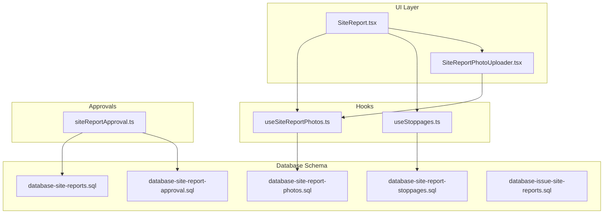
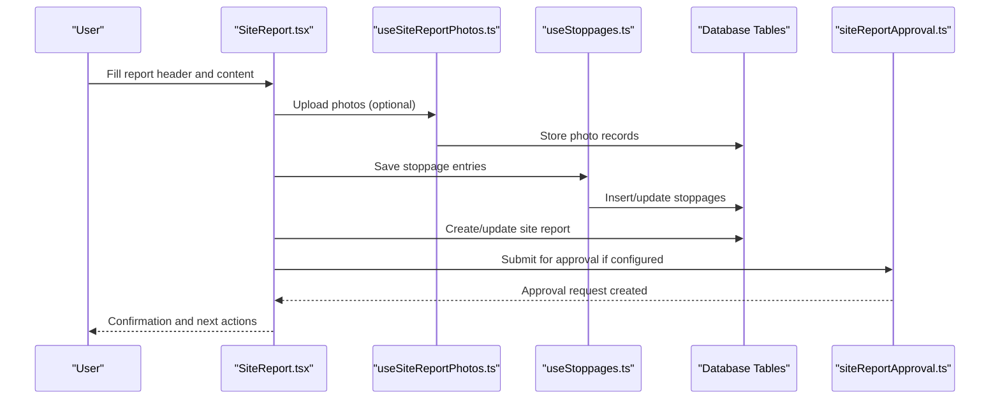
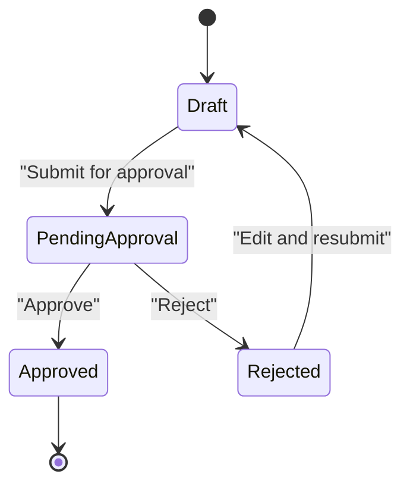
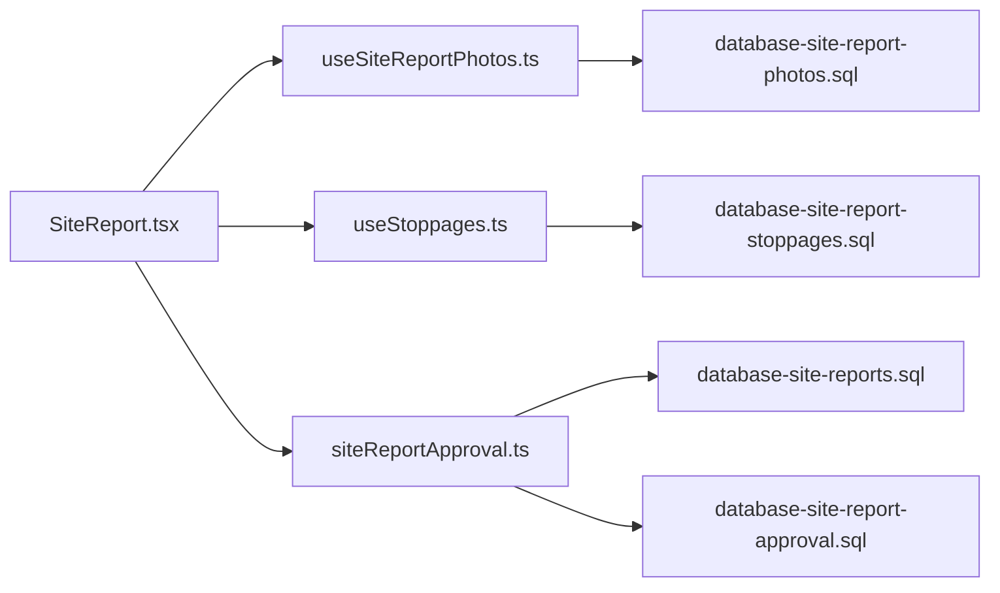

# Site Report Creation & Management

<cite>
**Referenced Files in This Document**
- [SiteReport.tsx](file://src/pages/SiteReport.tsx)
- [useSiteReportPhotos.ts](file://src/hooks/useSiteReportPhotos.ts)
- [SiteReportPhotoUploader.tsx](file://src/components/SiteReportPhotoUploader.tsx)
- [siteReportApproval.ts](file://src/approvals/siteReportApproval.ts)
- [database-site-reports.sql](file://src/database/database-site-reports.sql)
- [database-site-report-stoppages.sql](file://src/database/database-site-report-stoppages.sql)
- [database-site-report-photos.sql](file://src/database/database-site-report-photos.sql)
- [database-site-report-approval.sql](file://src/database/database-site-report-approval.sql)
- [database-issue-site-reports.sql](file://src/database/database-issue-site-reports.sql)
- [useStoppages.ts](file://src/hooks/useStoppages.ts)
- [api.ts](file://src/api.ts)
</cite>

## Table of Contents
1. [Introduction](#introduction)
2. [Project Structure](#project-structure)
3. [Core Components](#core-components)
4. [Architecture Overview](#architecture-overview)
5. [Detailed Component Analysis](#detailed-component-analysis)
6. [Dependency Analysis](#dependency-analysis)
7. [Performance Considerations](#performance-considerations)
8. [Troubleshooting Guide](#troubleshooting-guide)
9. [Conclusion](#conclusion)

## Introduction
This document provides detailed API documentation for site report creation and management endpoints, focusing on the complete workflow for creating daily site reports. It covers report headers, content sections, stoppage tracking, progress updates, request/response schemas, validation rules, error handling, approval workflows, status transitions, audit trail functionality, and optional attachments such as photos.

The goal is to enable developers and integrators to implement robust client-side or server-side flows that create, update, approve, and audit site reports consistently with the application’s data model and business logic.

## Project Structure
The site report feature spans UI pages, hooks, components, approvals, and database migrations:
- UI page for creating/editing site reports
- Hooks for fetching/updating reports and managing stoppages
- Photo upload component and hook for attachments
- Approval integration for workflow processing
- Database schema definitions for reports, stoppages, photos, and approvals

**Diagram sources**
- [SiteReport.tsx](file://src/pages/SiteReport.tsx)
- [SiteReportPhotoUploader.tsx](file://src/components/SiteReportPhotoUploader.tsx)
- [useSiteReportPhotos.ts](file://src/hooks/useSiteReportPhotos.ts)
- [useStoppages.ts](file://src/hooks/useStoppages.ts)
- [siteReportApproval.ts](file://src/approvals/siteReportApproval.ts)
- [database-site-reports.sql](file://src/database/database-site-reports.sql)
- [database-site-report-stoppages.sql](file://src/database/database-site-report-stoppages.sql)
- [database-site-report-photos.sql](file://src/database/database-site-report-photos.sql)
- [database-site-report-approval.sql](file://src/database/database-site-report-approval.sql)
- [database-issue-site-reports.sql](file://src/database/database-issue-site-reports.sql)

**Section sources**
- [SiteReport.tsx](file://src/pages/SiteReport.tsx)
- [useSiteReportPhotos.ts](file://src/hooks/useSiteReportPhotos.ts)
- [SiteReportPhotoUploader.tsx](file://src/components/SiteReportPhotoUploader.tsx)
- [siteReportApproval.ts](file://src/approvals/siteReportApproval.ts)
- [database-site-reports.sql](file://src/database/database-site-reports.sql)
- [database-site-report-stoppages.sql](file://src/database/database-site-report-stoppages.sql)
- [database-site-report-photos.sql](file://src/database/database-site-report-photos.sql)
- [database-site-report-approval.sql](file://src/database/database-site-report-approval.sql)
- [database-issue-site-reports.sql](file://src/database/database-issue-site-reports.sql)

## Core Components
- Site report header and content sections: The main page orchestrates form fields for project, date, weather, manpower, equipment, work completed, issues, and next steps.
- Stoppage tracking: Dedicated section to log planned/unplanned stoppages with start/end times, reasons, and impacts.
- Progress updates: Fields to capture percentage completion per activity or overall site progress.
- Attachments: Photo uploads linked to a report via a dedicated table and uploader component.
- Approvals: Integration with the approval engine to submit reports for review and track decisions.

Key responsibilities:
- Validate mandatory fields before submission
- Persist report data and related entities (stoppages, photos)
- Trigger approval requests when required
- Provide read-only views and history/audit trails

**Section sources**
- [SiteReport.tsx](file://src/pages/SiteReport.tsx)
- [useStoppages.ts](file://src/hooks/useStoppages.ts)
- [SiteReportPhotoUploader.tsx](file://src/components/SiteReportPhotoUploader.tsx)
- [useSiteReportPhotos.ts](file://src/hooks/useSiteReportPhotos.ts)
- [siteReportApproval.ts](file://src/approvals/siteReportApproval.ts)

## Architecture Overview
The site report workflow involves UI interactions, data persistence, attachment storage, and approval processing.

**Diagram sources**
- [SiteReport.tsx](file://src/pages/SiteReport.tsx)
- [useSiteReportPhotos.ts](file://src/hooks/useSiteReportPhotos.ts)
- [useStoppages.ts](file://src/hooks/useStoppages.ts)
- [siteReportApproval.ts](file://src/approvals/siteReportApproval.ts)
- [database-site-reports.sql](file://src/database/database-site-reports.sql)
- [database-site-report-stoppages.sql](file://src/database/database-site-report-stoppages.sql)
- [database-site-report-photos.sql](file://src/database/database-site-report-photos.sql)
- [database-site-report-approval.sql](file://src/database/database-site-report-approval.sql)

## Detailed Component Analysis

### Site Report Header and Content Sections
- Purpose: Capture core metadata and narrative content for each daily report.
- Typical fields:
  - Project identifier
  - Report date
  - Weather conditions
  - Manpower counts by trade
  - Equipment deployed
  - Work completed summary
  - Issues and risks
  - Next day plan
- Validation:
  - Mandatory: project, report date, at least one content section
  - Optional: weather, manpower/equipment details, notes
- Submission:
  - Creates a new report record
  - Returns success confirmation and report ID for subsequent operations

Request schema (example):
- project_id: string (required)
- report_date: date (required)
- weather: string (optional)
- manpower: object (optional)
- equipment: array (optional)
- work_completed: text (optional)
- issues_risks: text (optional)
- next_day_plan: text (optional)

Response schema (example):
- id: string
- status: enum
- created_at: timestamp
- updated_at: timestamp

**Section sources**
- [SiteReport.tsx](file://src/pages/SiteReport.tsx)
- [database-site-reports.sql](file://src/database/database-site-reports.sql)

### Stoppage Tracking
- Purpose: Record planned or unplanned stoppages affecting productivity.
- Typical fields:
  - Start time
  - End time
  - Duration calculation
  - Reason category
  - Impact description
  - Linked activities/tasks (optional)
- Validation:
  - Start time must precede end time
  - Reason category must be selected
- Persistence:
  - Stored in a dedicated stoppages table linked to the report

Request schema (example):
- report_id: string (required)
- start_time: datetime (required)
- end_time: datetime (required)
- reason_category: enum (required)
- impact_description: text (optional)

Response schema (example):
- id: string
- duration_minutes: number
- status: enum

**Section sources**
- [useStoppages.ts](file://src/hooks/useStoppages.ts)
- [database-site-report-stoppages.sql](file://src/database/database-site-report-stoppages.sql)

### Progress Updates
- Purpose: Track percentage completion for activities or overall site progress.
- Typical fields:
  - Activity identifier
  - Planned vs actual progress
  - Notes explaining variances
- Validation:
  - Percentage within valid range
  - Activity must exist and be linked to the project/report context

Request schema (example):
- report_id: string (required)
- activity_id: string (required)
- progress_percent: number (required)
- variance_notes: text (optional)

Response schema (example):
- id: string
- progress_percent: number
- updated_at: timestamp

**Section sources**
- [SiteReport.tsx](file://src/pages/SiteReport.tsx)
- [database-site-reports.sql](file://src/database/database-site-reports.sql)

### Attachments (Photos)
- Purpose: Attach images to support report evidence.
- Workflow:
  - Select files via uploader component
  - Upload to storage bucket
  - Link uploaded file URLs to the report
- Validation:
  - File size limits
  - Allowed formats
  - Maximum count per report

Request schema (example):
- report_id: string (required)
- files: array of file objects (required)

Response schema (example):
- ids: array of attachment IDs
- urls: array of public URLs

**Section sources**
- [SiteReportPhotoUploader.tsx](file://src/components/SiteReportPhotoUploader.tsx)
- [useSiteReportPhotos.ts](file://src/hooks/useSiteReportPhotos.ts)
- [database-site-report-photos.sql](file://src/database/database-site-report-photos.sql)

### Approval Workflow
- Purpose: Route reports for review and capture decisions.
- Flow:
  - On submission, determine if approval is required based on configuration
  - Create an approval request tied to the report
  - Allow approvers to accept/reject with comments
  - Update report status accordingly
- Status transitions:
  - Draft -> Pending Approval -> Approved/Rejected
  - Rejected can return to Draft for edits

**Diagram sources**
- [siteReportApproval.ts](file://src/approvals/siteReportApproval.ts)
- [database-site-report-approval.sql](file://src/database/database-site-report-approval.sql)

**Section sources**
- [siteReportApproval.ts](file://src/approvals/siteReportApproval.ts)
- [database-site-report-approval.sql](file://src/database/database-site-report-approval.sql)

### Audit Trail
- Purpose: Maintain immutable records of changes and actions.
- Capabilities:
  - Log creation, updates, approvals, rejections
  - Capture actor identity and timestamps
  - Support querying historical states

Audit events typically include:
- Created
- Updated
- Submitted for approval
- Approved
- Rejected
- Resubmitted

**Section sources**
- [database-issue-site-reports.sql](file://src/database/database-issue-site-reports.sql)
- [database-site-report-approval.sql](file://src/database/database-site-report-approval.sql)

## Dependency Analysis
The following diagram shows how components depend on each other and on database tables.

**Diagram sources**
- [SiteReport.tsx](file://src/pages/SiteReport.tsx)
- [useSiteReportPhotos.ts](file://src/hooks/useSiteReportPhotos.ts)
- [useStoppages.ts](file://src/hooks/useStoppages.ts)
- [siteReportApproval.ts](file://src/approvals/siteReportApproval.ts)
- [database-site-reports.sql](file://src/database/database-site-reports.sql)
- [database-site-report-stoppages.sql](file://src/database/database-site-report-stoppages.sql)
- [database-site-report-photos.sql](file://src/database/database-site-report-photos.sql)
- [database-site-report-approval.sql](file://src/database/database-site-report-approval.sql)

**Section sources**
- [SiteReport.tsx](file://src/pages/SiteReport.tsx)
- [useSiteReportPhotos.ts](file://src/hooks/useSiteReportPhotos.ts)
- [useStoppages.ts](file://src/hooks/useStoppages.ts)
- [siteReportApproval.ts](file://src/approvals/siteReportApproval.ts)
- [database-site-reports.sql](file://src/database/database-site-reports.sql)
- [database-site-report-stoppages.sql](file://src/database/database-site-report-stoppages.sql)
- [database-site-report-photos.sql](file://src/database/database-site-report-photos.sql)
- [database-site-report-approval.sql](file://src/database/database-site-report-approval.sql)

## Performance Considerations
- Batch uploads: Group multiple photo uploads into a single transaction where possible to reduce round trips.
- Lazy loading: Load stoppages and attachments only when needed to improve initial render performance.
- Pagination: For large datasets (e.g., historical reports), implement pagination and filtering.
- Compression: Compress images before upload to minimize bandwidth and storage usage.
- Indexes: Ensure database indexes on frequently queried columns (report_date, project_id, status).

[No sources needed since this section provides general guidance]

## Troubleshooting Guide
Common issues and resolutions:
- Missing mandatory fields: Validate all required fields before submission; provide clear error messages.
- Invalid date/time ranges: Ensure start_time precedes end_time for stoppages; normalize timezone handling.
- Attachment failures: Check file size/format constraints; retry failed uploads with exponential backoff.
- Approval routing errors: Verify approval settings are configured for the project/report type; fallback to default workflow if needed.
- Audit logs missing: Confirm audit triggers or middleware are enabled; verify permissions for write access.

Error response patterns:
- Validation errors: Return structured error payloads listing field-level issues.
- Server errors: Include correlation IDs for tracing; avoid exposing sensitive stack traces.
- Permission errors: Indicate insufficient roles and suggest corrective actions.

**Section sources**
- [SiteReport.tsx](file://src/pages/SiteReport.tsx)
- [useSiteReportPhotos.ts](file://src/hooks/useSiteReportPhotos.ts)
- [useStoppages.ts](file://src/hooks/useStoppages.ts)
- [siteReportApproval.ts](file://src/approvals/siteReportApproval.ts)

## Conclusion
This documentation outlines the end-to-end workflow for creating and managing daily site reports, including headers, content sections, stoppage tracking, progress updates, attachments, approvals, and audit trails. By adhering to the provided schemas, validation rules, and error handling strategies, integrators can build reliable client or server flows that align with the application’s architecture and business requirements.

[No sources needed since this section summarizes without analyzing specific files]