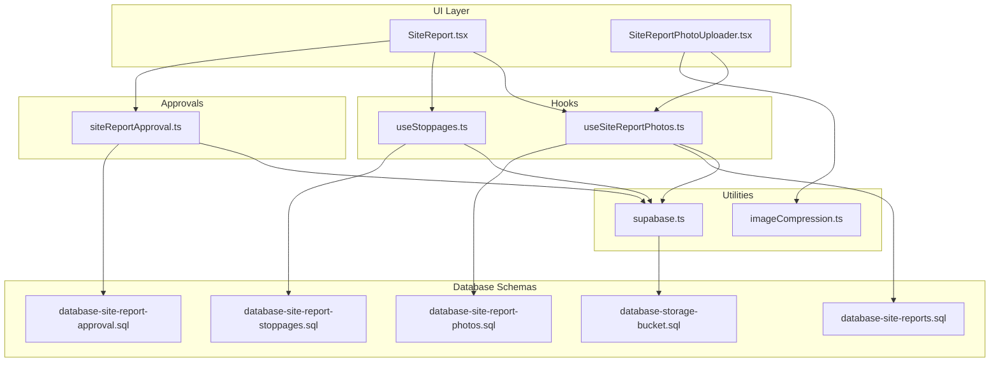
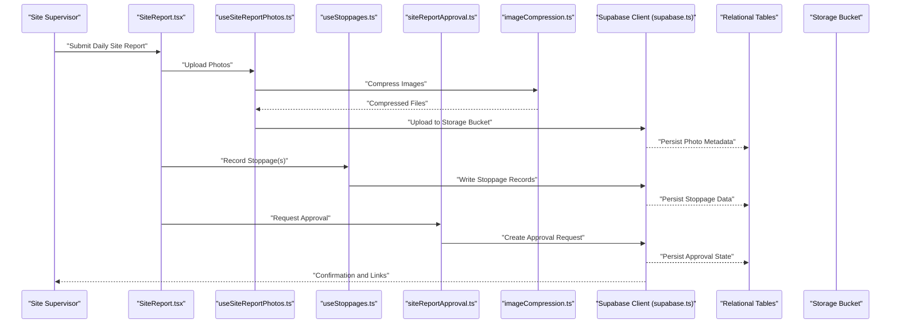
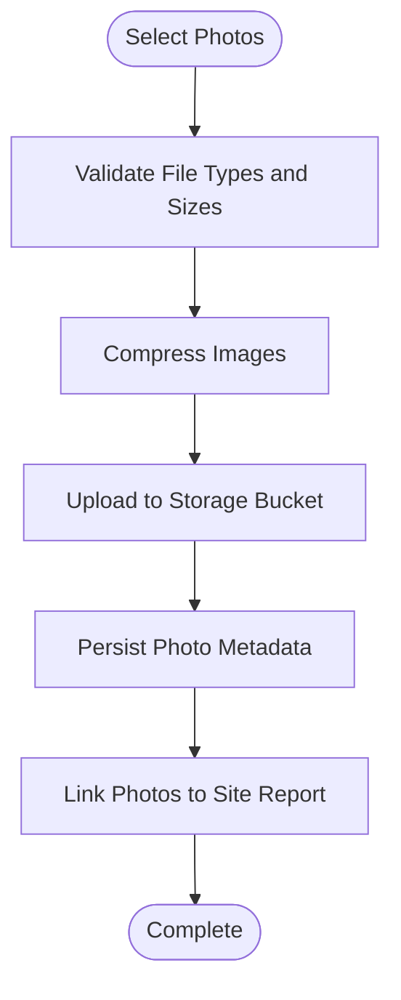
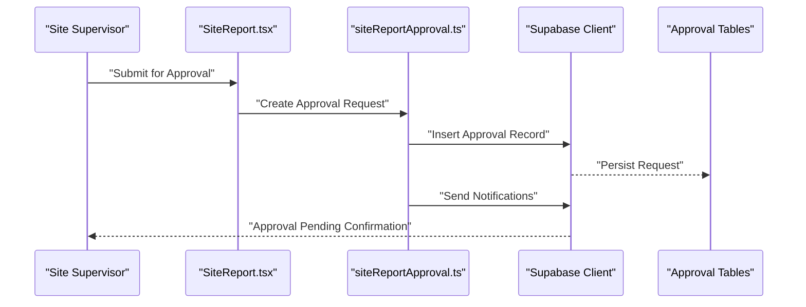
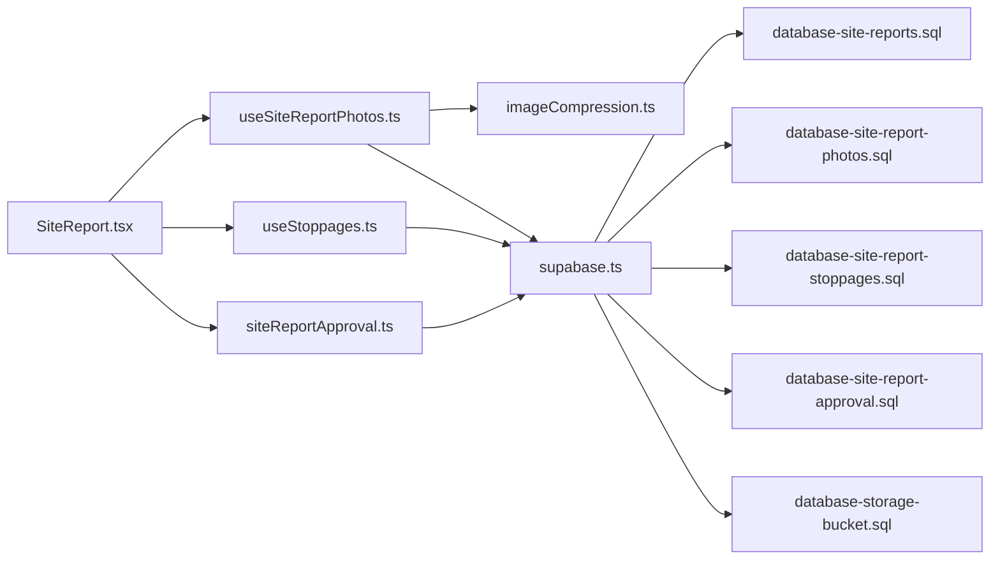

# Site Reports API

<cite>
**Referenced Files in This Document**
- [SiteReport.tsx](file://src/pages/SiteReport.tsx)
- [SiteReportPhotoUploader.tsx](file://src/components/SiteReportPhotoUploader.tsx)
- [useSiteReportPhotos.ts](file://src/hooks/useSiteReportPhotos.ts)
- [useStoppages.ts](file://src/hooks/useStoppages.ts)
- [siteReportApproval.ts](file://src/approvals/siteReportApproval.ts)
- [database-site-reports.sql](file://src/database-site-reports.sql)
- [database-site-report-photos.sql](file://src/database-site-report-photos.sql)
- [database-site-report-stoppages.sql](file://src/database-site-report-stoppages.sql)
- [database-site-report-approval.sql](file://src/database-site-report-approval.sql)
- [imageCompression.ts](file://src/lib/imageCompression.ts)
- [database-storage-bucket.sql](file://src/database-storage-bucket.sql)
- [supabase.ts](file://src/supabase.ts)
</cite>

## Table of Contents
1. [Introduction](#introduction)
2. [Project Structure](#project-structure)
3. [Core Components](#core-components)
4. [Architecture Overview](#architecture-overview)
5. [Detailed Component Analysis](#detailed-component-analysis)
6. [Dependency Analysis](#dependency-analysis)
7. [Performance Considerations](#performance-considerations)
8. [Troubleshooting Guide](#troubleshooting-guide)
9. [Conclusion](#conclusion)

## Introduction
This document provides comprehensive API documentation for site report submission and management, including daily site reports, photo uploads, stoppage tracking, progress documentation, file upload capabilities, image compression, storage management, report templates, approval workflows, and distribution mechanisms. It also includes practical examples for site supervisor workflows, photo documentation, and progress reporting processes.

## Project Structure
The site reports feature spans UI pages, hooks, components, approvals, database schemas, and utilities:
- Pages: Site report entry and navigation
- Components: Photo uploader for site reports
- Hooks: Data access for photos and stoppages
- Approvals: Approval workflow integration for site reports
- Database: Schemas for reports, photos, stoppages, approvals, and storage buckets
- Utilities: Image compression and Supabase client configuration

**Diagram sources**
- [SiteReport.tsx](file://src/pages/SiteReport.tsx)
- [SiteReportPhotoUploader.tsx](file://src/components/SiteReportPhotoUploader.tsx)
- [useSiteReportPhotos.ts](file://src/hooks/useSiteReportPhotos.ts)
- [useStoppages.ts](file://src/hooks/useStoppages.ts)
- [siteReportApproval.ts](file://src/approvals/siteReportApproval.ts)
- [database-site-reports.sql](file://src/database-site-reports.sql)
- [database-site-report-photos.sql](file://src/database-site-report-photos.sql)
- [database-site-report-stoppages.sql](file://src/database-site-report-stoppages.sql)
- [database-site-report-approval.sql](file://src/database-site-report-approval.sql)
- [database-storage-bucket.sql](file://src/database-storage-bucket.sql)
- [imageCompression.ts](file://src/lib/imageCompression.ts)
- [supabase.ts](file://src/supabase.ts)

**Section sources**
- [SiteReport.tsx](file://src/pages/SiteReport.tsx)
- [SiteReportPhotoUploader.tsx](file://src/components/SiteReportPhotoUploader.tsx)
- [useSiteReportPhotos.ts](file://src/hooks/useSiteReportPhotos.ts)
- [useStoppages.ts](file://src/hooks/useStoppages.ts)
- [siteReportApproval.ts](file://src/approvals/siteReportApproval.ts)
- [database-site-reports.sql](file://src/database-site-reports.sql)
- [database-site-report-photos.sql](file://src/database-site-report-photos.sql)
- [database-site-report-stoppages.sql](file://src/database-site-report-stoppages.sql)
- [database-site-report-approval.sql](file://src/database-site-report-approval.sql)
- [database-storage-bucket.sql](file://src/database-storage-bucket.sql)
- [imageCompression.ts](file://src/lib/imageCompression.ts)
- [supabase.ts](file://src/supabase.ts)

## Core Components
- Daily Site Reports: Entry and management of daily site reports with fields for progress, manpower, materials, weather, and notes.
- Photo Uploads: Upload and associate photos with site reports; supports compression before upload.
- Stoppage Tracking: Record planned/unplanned stoppages with reasons, durations, and impacts.
- Progress Documentation: Track work completed, milestones achieved, and next-day plans.
- File Upload Capabilities: General file handling via storage bucket integration.
- Image Compression: Client-side compression to reduce payload size and improve performance.
- Storage Management: Organized storage buckets for images and documents with RLS policies.
- Report Templates: Reusable structures for consistent daily reports.
- Approval Workflows: Submit reports for review and approval with notifications.
- Distribution Mechanisms: Share approved reports with stakeholders via links or exports.

**Section sources**
- [SiteReport.tsx](file://src/pages/SiteReport.tsx)
- [SiteReportPhotoUploader.tsx](file://src/components/SiteReportPhotoUploader.tsx)
- [useSiteReportPhotos.ts](file://src/hooks/useSiteReportPhotos.ts)
- [useStoppages.ts](file://src/hooks/useStoppages.ts)
- [siteReportApproval.ts](file://src/approvals/siteReportApproval.ts)
- [database-site-reports.sql](file://src/database-site-reports.sql)
- [database-site-report-photos.sql](file://src/database-site-report-photos.sql)
- [database-site-report-stoppages.sql](file://src/database-site-report-stoppages.sql)
- [database-site-report-approval.sql](file://src/database-site-report-approval.sql)
- [database-storage-bucket.sql](file://src/database-storage-bucket.sql)
- [imageCompression.ts](file://src/lib/imageCompression.ts)
- [supabase.ts](file://src/supabase.ts)

## Architecture Overview
The system integrates UI components with hooks that call the Supabase client to persist data into relational tables and storage buckets. Approval workflows are orchestrated through an approval service that interacts with the same client.

**Diagram sources**
- [SiteReport.tsx](file://src/pages/SiteReport.tsx)
- [useSiteReportPhotos.ts](file://src/hooks/useSiteReportPhotos.ts)
- [useStoppages.ts](file://src/hooks/useStoppages.ts)
- [siteReportApproval.ts](file://src/approvals/siteReportApproval.ts)
- [imageCompression.ts](file://src/lib/imageCompression.ts)
- [supabase.ts](file://src/supabase.ts)
- [database-site-reports.sql](file://src/database-site-reports.sql)
- [database-site-report-photos.sql](file://src/database-site-report-photos.sql)
- [database-site-report-stoppages.sql](file://src/database-site-report-stoppages.sql)
- [database-site-report-approval.sql](file://src/database-site-report-approval.sql)
- [database-storage-bucket.sql](file://src/database-storage-bucket.sql)

## Detailed Component Analysis

### Daily Site Reports
- Purpose: Capture daily site activities, progress, manpower, materials, weather, and notes.
- Key operations:
  - Create new daily report entries linked to a project/site.
  - Update existing reports with progress changes.
  - Query reports by date range, site, or status.
- Data model highlights:
  - Fields include date, site/project identifiers, progress summaries, manpower counts, material usage, weather conditions, and remarks.
- Validation and constraints:
  - Required fields enforced at the schema level.
  - Date uniqueness per site/day may be enforced to avoid duplicates.

**Section sources**
- [database-site-reports.sql](file://src/database-site-reports.sql)
- [SiteReport.tsx](file://src/pages/SiteReport.tsx)

### Photo Uploads and Image Compression
- Purpose: Attach photographic evidence to site reports with optimized payloads.
- Workflow:
  - Select images from device.
  - Compress images client-side to reduce size.
  - Upload compressed files to storage bucket.
  - Persist metadata linking photos to specific reports.
- Storage management:
  - Dedicated bucket for site report photos.
  - RLS policies ensure only authorized users can read/write.
- Performance considerations:
  - Compression reduces bandwidth and storage costs.
  - Batch uploads supported for multiple photos.

**Diagram sources**
- [SiteReportPhotoUploader.tsx](file://src/components/SiteReportPhotoUploader.tsx)
- [useSiteReportPhotos.ts](file://src/hooks/useSiteReportPhotos.ts)
- [imageCompression.ts](file://src/lib/imageCompression.ts)
- [database-storage-bucket.sql](file://src/database-storage-bucket.sql)
- [database-site-report-photos.sql](file://src/database-site-report-photos.sql)

**Section sources**
- [SiteReportPhotoUploader.tsx](file://src/components/SiteReportPhotoUploader.tsx)
- [useSiteReportPhotos.ts](file://src/hooks/useSiteReportPhotos.ts)
- [imageCompression.ts](file://src/lib/imageCompression.ts)
- [database-storage-bucket.sql](file://src/database-storage-bucket.sql)
- [database-site-report-photos.sql](file://src/database-site-report-photos.sql)

### Stoppage Tracking
- Purpose: Record planned and unplanned stoppages with reasons, durations, and impacts on schedule.
- Key operations:
  - Create stoppage entries associated with a site report.
  - Update stoppage status (ongoing, resolved).
  - Query stoppages by date, reason, or impact category.
- Data model highlights:
  - Fields include start/end times, reason codes, responsible parties, duration, and impact notes.

**Section sources**
- [useStoppages.ts](file://src/hooks/useStoppages.ts)
- [database-site-report-stoppages.sql](file://src/database-site-report-stoppages.sql)

### Approval Workflows
- Purpose: Route site reports for review and approval with auditability.
- Workflow:
  - Submit report for approval.
  - Notify approvers.
  - Approve or reject with comments.
  - Distribute approved reports.
- Integration points:
  - Uses Supabase client for persistence.
  - Stores approval state and history.

**Diagram sources**
- [siteReportApproval.ts](file://src/approvals/siteReportApproval.ts)
- [database-site-report-approval.sql](file://src/database-site-report-approval.sql)
- [supabase.ts](file://src/supabase.ts)

**Section sources**
- [siteReportApproval.ts](file://src/approvals/siteReportApproval.ts)
- [database-site-report-approval.sql](file://src/database-site-report-approval.sql)

### Storage Management
- Purpose: Manage organized storage for images and documents related to site reports.
- Features:
  - Bucket creation and naming conventions.
  - Access control via RLS policies.
  - Lifecycle rules for cleanup/archival.

**Section sources**
- [database-storage-bucket.sql](file://src/database-storage-bucket.sql)
- [supabase.ts](file://src/supabase.ts)

## Dependency Analysis
- UI dependencies:
  - SiteReport page depends on hooks for photos and stoppages, and on approval service.
- Hook dependencies:
  - useSiteReportPhotos uses image compression utility and Supabase client.
  - useStoppages uses Supabase client for CRUD operations.
- Approval service:
  - Depends on Supabase client and approval schema.
- Database schemas:
  - Interlinked via foreign keys between reports, photos, stoppages, and approvals.

**Diagram sources**
- [SiteReport.tsx](file://src/pages/SiteReport.tsx)
- [useSiteReportPhotos.ts](file://src/hooks/useSiteReportPhotos.ts)
- [useStoppages.ts](file://src/hooks/useStoppages.ts)
- [siteReportApproval.ts](file://src/approvals/siteReportApproval.ts)
- [imageCompression.ts](file://src/lib/imageCompression.ts)
- [supabase.ts](file://src/supabase.ts)
- [database-site-reports.sql](file://src/database-site-reports.sql)
- [database-site-report-photos.sql](file://src/database-site-report-photos.sql)
- [database-site-report-stoppages.sql](file://src/database-site-report-stoppages.sql)
- [database-site-report-approval.sql](file://src/database-site-report-approval.sql)
- [database-storage-bucket.sql](file://src/database-storage-bucket.sql)

**Section sources**
- [SiteReport.tsx](file://src/pages/SiteReport.tsx)
- [useSiteReportPhotos.ts](file://src/hooks/useSiteReportPhotos.ts)
- [useStoppages.ts](file://src/hooks/useStoppages.ts)
- [siteReportApproval.ts](file://src/approvals/siteReportApproval.ts)
- [imageCompression.ts](file://src/lib/imageCompression.ts)
- [supabase.ts](file://src/supabase.ts)
- [database-site-reports.sql](file://src/database-site-reports.sql)
- [database-site-report-photos.sql](file://src/database-site-report-photos.sql)
- [database-site-report-stoppages.sql](file://src/database-site-report-stoppages.sql)
- [database-site-report-approval.sql](file://src/database-site-report-approval.sql)
- [database-storage-bucket.sql](file://src/database-storage-bucket.sql)

## Performance Considerations
- Image compression reduces upload time and storage consumption.
- Batch operations for multiple photos minimize network overhead.
- Efficient queries with appropriate indexes on date, site, and status fields.
- Lazy loading of large photo galleries improves UI responsiveness.
- Caching strategies for frequently accessed reports and metadata.

[No sources needed since this section provides general guidance]

## Troubleshooting Guide
- Upload failures:
  - Verify storage bucket permissions and RLS policies.
  - Check file type and size limits enforced by compression utility.
- Approval issues:
  - Ensure approval records exist and user has required roles.
  - Confirm notification delivery and approver assignments.
- Data consistency:
  - Validate foreign key relationships between reports, photos, and stoppages.
  - Use audit logs to trace modifications and errors.

**Section sources**
- [database-storage-bucket.sql](file://src/database-storage-bucket.sql)
- [database-site-report-photos.sql](file://src/database-site-report-photos.sql)
- [database-site-report-approval.sql](file://src/database-site-report-approval.sql)

## Conclusion
The Site Reports API provides a robust framework for capturing daily site activities, attaching photographic evidence, tracking stoppages, and managing approvals. With client-side image compression, organized storage, and clear approval workflows, it supports efficient site supervision and stakeholder communication.

[No sources needed since this section summarizes without analyzing specific files]