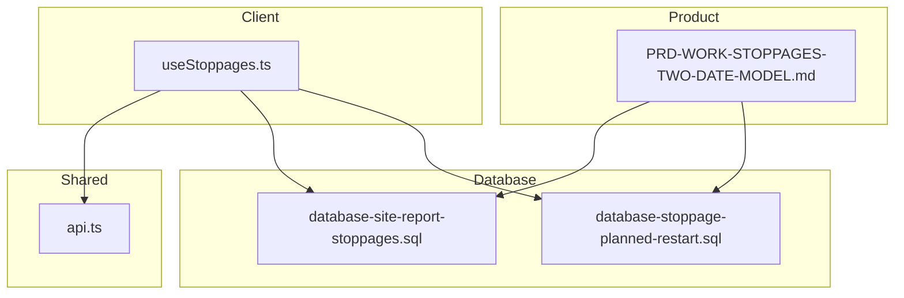
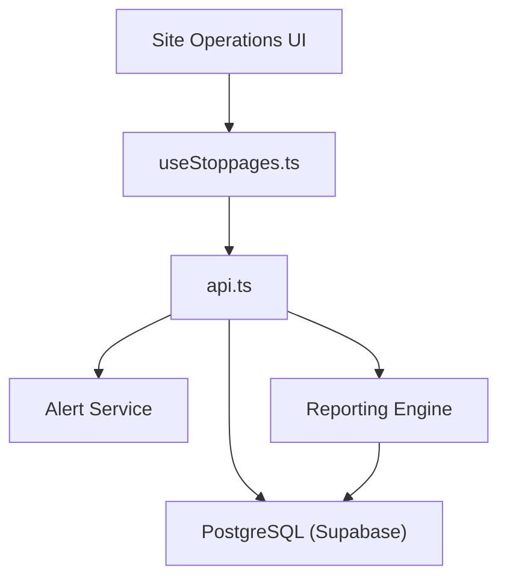
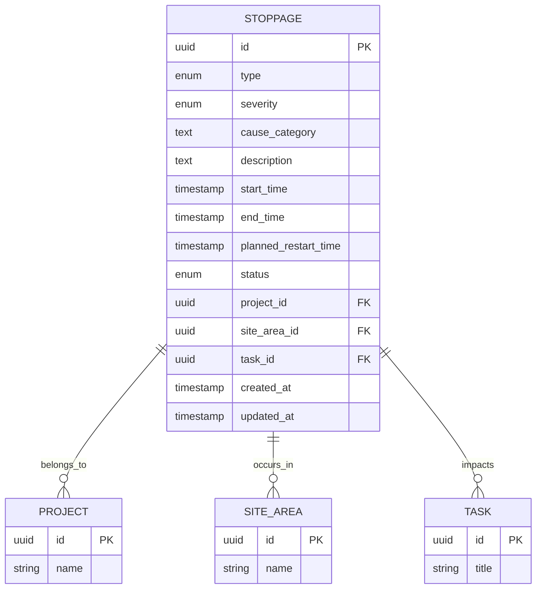
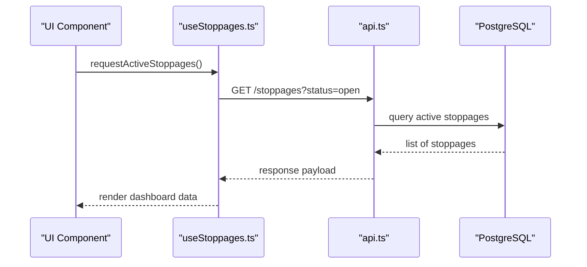
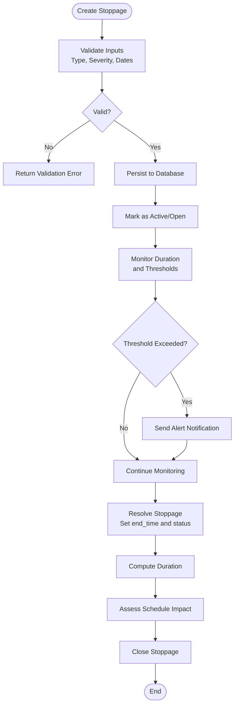
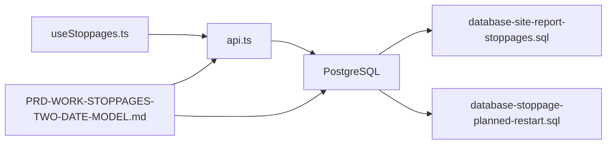

# Stoppage Tracking & Monitoring

<cite>
**Referenced Files in This Document**
- [PRD-WORK-STOPPAGES-TWO-DATE-MODEL.md](file://docs/PRD-WORK-STOPPAGES-TWO-DATE-MODEL.md)
- [database-site-report-stoppages.sql](file://src/database-site-report-stoppages.sql)
- [database-stoppage-planned-restart.sql](file://src/database-stoppage-planned-restart.sql)
- [useStoppages.ts](file://src/hooks/useStoppages.ts)
- [api.ts](file://src/api.ts)
</cite>

## Table of Contents
1. [Introduction](#introduction)
2. [Project Structure](#project-structure)
3. [Core Components](#core-components)
4. [Architecture Overview](#architecture-overview)
5. [Detailed Component Analysis](#detailed-component-analysis)
6. [Dependency Analysis](#dependency-analysis)
7. [Performance Considerations](#performance-considerations)
8. [Troubleshooting Guide](#troubleshooting-guide)
9. [Conclusion](#conclusion)
10. [Appendices](#appendices)

## Introduction
This document provides detailed API documentation for construction stoppage tracking and monitoring. It covers the creation, categorization, duration tracking, and impact assessment of stoppages; real-time monitoring endpoints; alert notifications; reporting capabilities; stoppage types (planned vs unplanned); severity levels; resolution workflows; examples of logging and automated notifications; and integration points with project scheduling systems.

The system is designed to:
- Record planned and unplanned work stoppages with precise start/end timestamps
- Classify stoppages by type and severity
- Compute durations and assess downstream impacts on schedules
- Provide real-time dashboards and alerts
- Generate reports for analysis and compliance

## Project Structure
Stoppage-related functionality spans product requirements, database schema, client hooks, and shared API utilities:
- Product Requirements: PRD defining two-date model and business rules
- Database Schema: SQL migrations for stoppage tables and planned restart logic
- Client Integration: React hook for fetching and managing stoppage data
- Shared API Utilities: Centralized API helpers used across modules

**Diagram sources**
- [PRD-WORK-STOPPAGES-TWO-DATE-MODEL.md](file://docs/PRD-WORK-STOPPAGES-TWO-DATE-MODEL.md)
- [database-site-report-stoppages.sql](file://src/database-site-report-stoppages.sql)
- [database-stoppage-planned-restart.sql](file://src/database-stoppage-planned-restart.sql)
- [useStoppages.ts](file://src/hooks/useStoppages.ts)
- [api.ts](file://src/api.ts)

**Section sources**
- [PRD-WORK-STOPPAGES-TWO-DATE-MODEL.md](file://docs/PRD-WORK-STOPPAGES-TWO-DATE-MODEL.md)
- [database-site-report-stoppages.sql](file://src/database-site-report-stoppages.sql)
- [database-stoppage-planned-restart.sql](file://src/database-stoppage-planned-restart.sql)
- [useStoppages.ts](file://src/hooks/useStoppages.ts)
- [api.ts](file://src/api.ts)

## Core Components
- Stoppage Event Model
  - Represents a single stoppage instance with fields for type, severity, cause, affected areas, and timestamps
  - Supports both planned and unplanned categories
  - Includes planned restart date/time when applicable
- Duration and Impact Tracking
  - Computes actual duration from start to end or current time if ongoing
  - Links to schedule tasks or milestones to quantify delay impact
- Real-Time Monitoring
  - Polling or streaming endpoints to surface active stoppages and updates
- Alert Notifications
  - Automated triggers based on thresholds (e.g., duration exceeded, high severity)
- Reporting
  - Aggregates stoppages by project, area, type, severity, and time windows
  - Exports summaries for management review

**Section sources**
- [PRD-WORK-STOPPAGES-TWO-DATE-MODEL.md](file://docs/PRD-WORK-STOPPAGES-TWO-DATE-MODEL.md)
- [database-site-report-stoppages.sql](file://src/database-site-report-stoppages.sql)
- [database-stoppage-planned-restart.sql](file://src/database-stoppage-planned-restart.sql)

## Architecture Overview
High-level architecture for stoppage tracking and monitoring:

**Diagram sources**
- [useStoppages.ts](file://src/hooks/useStoppages.ts)
- [api.ts](file://src/api.ts)
- [database-site-report-stoppages.sql](file://src/database-site-report-stoppages.sql)
- [database-stoppage-planned-restart.sql](file://src/database-stoppage-planned-restart.sql)

## Detailed Component Analysis

### Stoppage Data Model and Schema
- Tables and relationships are defined in SQL migrations:
  - Site report stoppages table for core event storage
  - Planned restart extension for scheduled resumption handling
- Key attributes include:
  - Type: planned vs unplanned
  - Severity: low, medium, high, critical
  - Cause category: weather, labor shortage, material delay, safety incident, etc.
  - Affected scope: site area, trade, task IDs
  - Timestamps: start_time, end_time, planned_restart_time
  - Status: open, resolved, closed
  - Notes and attachments for context

**Diagram sources**
- [database-site-report-stoppages.sql](file://src/database-site-report-stoppages.sql)
- [database-stoppage-planned-restart.sql](file://src/database-stoppage-planned-restart.sql)

**Section sources**
- [database-site-report-stoppages.sql](file://src/database-site-report-stoppages.sql)
- [database-stoppage-planned-restart.sql](file://src/database-stoppage-planned-restart.sql)

### Client Integration: useStoppages Hook
- Purpose: Provides React components with stoppage data access, including listing, filtering, creating, updating, and resolving events
- Typical operations:
  - Fetch active stoppages for real-time dashboards
  - Create new stoppage entries with validation
  - Update end_time and status upon resolution
  - Filter by project, area, type, severity, and date range
- Integration points:
  - Uses shared API utilities for HTTP calls
  - Consumes database schema via Supabase queries

**Diagram sources**
- [useStoppages.ts](file://src/hooks/useStoppages.ts)
- [api.ts](file://src/api.ts)
- [database-site-report-stoppages.sql](file://src/database-site-report-stoppages.sql)

**Section sources**
- [useStoppages.ts](file://src/hooks/useStoppages.ts)
- [api.ts](file://src/api.ts)

### API Endpoints
- Create Stoppage
  - Method: POST
  - Path: /stoppages
  - Body: type, severity, cause_category, description, start_time, planned_restart_time (optional), project_id, site_area_id, task_id
  - Response: created stoppage object with id and timestamps
- List Active Stoppages
  - Method: GET
  - Path: /stoppages
  - Query params: status=open, project_id, site_area_id, type, severity, date_from, date_to
  - Response: paginated list of stoppages
- Update Stoppage
  - Method: PATCH
  - Path: /stoppages/{id}
  - Body: end_time, status=resolved/closed, notes
  - Response: updated stoppage object
- Resolve Stoppage
  - Method: PUT
  - Path: /stoppages/{id}/resolve
  - Body: end_time, status=resolved, resolution_notes
  - Response: resolved stoppage with computed duration
- Report Generation
  - Method: GET
  - Path: /reports/stoppages
  - Query params: group_by=type|severity|area|trade, date_from, date_to
  - Response: aggregated metrics and counts

Note: The exact endpoint paths and parameters should be validated against the implementation in api.ts and any route definitions not included here.

**Section sources**
- [api.ts](file://src/api.ts)
- [database-site-report-stoppages.sql](file://src/database-site-report-stoppages.sql)

### Business Rules and Workflows
- Two-Date Model
  - Start time marks the onset of the stoppage
  - Planned restart time indicates expected resumption for planned stoppages
  - Actual end time records completion for unplanned stoppages
- Severity Levels
  - Low: minimal impact, short duration
  - Medium: noticeable impact, moderate duration
  - High: significant impact, long duration
  - Critical: major disruption, immediate escalation required
- Resolution Workflow
  - Open -> Resolved -> Closed
  - Automatic computation of duration upon resolution
  - Optional post-resolution review and notes

**Diagram sources**
- [PRD-WORK-STOPPAGES-TWO-DATE-MODEL.md](file://docs/PRD-WORK-STOPPAGES-TWO-DATE-MODEL.md)
- [database-site-report-stoppages.sql](file://src/database-site-report-stoppages.sql)
- [database-stoppage-planned-restart.sql](file://src/database-stoppage-planned-restart.sql)

**Section sources**
- [PRD-WORK-STOPPAGES-TWO-DATE-MODEL.md](file://docs/PRD-WORK-STOPPAGES-TWO-DATE-MODEL.md)
- [database-site-report-stoppages.sql](file://src/database-site-report-stoppages.sql)
- [database-stoppage-planned-restart.sql](file://src/database-stoppage-planned-restart.sql)

### Real-Time Monitoring and Alerts
- Real-Time Monitoring
  - Polling interval configurable for active stoppages
  - Dashboard displays live updates for open events
- Alert Notifications
  - Triggered by severity and duration thresholds
  - Channels: in-app notifications, email, or messaging integrations
  - Escalation rules for critical events

**Section sources**
- [useStoppages.ts](file://src/hooks/useStoppages.ts)
- [api.ts](file://src/api.ts)

### Reporting Capabilities
- Metrics
  - Total stoppages by type and severity
  - Average and maximum durations
  - Impact on scheduled tasks and milestones
- Filters
  - Date ranges, projects, areas, trades
- Export
  - CSV/PDF exports for management reviews

**Section sources**
- [database-site-report-stoppages.sql](file://src/database-site-report-stoppages.sql)
- [database-stoppage-planned-restart.sql](file://src/database-stoppage-planned-restart.sql)

### Examples

#### Example: Logging a Stoppage
- Steps:
  - Collect inputs: type, severity, cause, description, start_time, planned_restart_time (if planned), project_id, site_area_id, task_id
  - Call create endpoint
  - Receive confirmation and ID
  - Display in active stoppages list

**Section sources**
- [api.ts](file://src/api.ts)
- [database-site-report-stoppages.sql](file://src/database-site-report-stoppages.sql)

#### Example: Automated Notification
- Conditions:
  - Severity=critical OR duration exceeds threshold
- Actions:
  - Send alert to stakeholders
  - Log notification event
  - Optionally escalate to supervisor

**Section sources**
- [api.ts](file://src/api.ts)
- [database-site-report-stoppages.sql](file://src/database-site-report-stoppages.sql)

#### Example: Integration with Project Scheduling
- Link stoppages to tasks/milestones
- Compute delay impact by comparing planned restart vs actual end
- Update schedule buffers and notify planners

**Section sources**
- [database-site-report-stoppages.sql](file://src/database-site-report-stoppages.sql)
- [database-stoppage-planned-restart.sql](file://src/database-stoppage-planned-restart.sql)

## Dependency Analysis
- Client-to-API dependency:
  - useStoppages.ts depends on api.ts for HTTP requests
- API-to-Database dependency:
  - api.ts executes queries against PostgreSQL using schema defined in SQL migrations
- Business Rules dependency:
  - PRD defines constraints and workflows enforced by API and database

**Diagram sources**
- [useStoppages.ts](file://src/hooks/useStoppages.ts)
- [api.ts](file://src/api.ts)
- [database-site-report-stoppages.sql](file://src/database-site-report-stoppages.sql)
- [database-stoppage-planned-restart.sql](file://src/database-stoppage-planned-restart.sql)
- [PRD-WORK-STOPPAGES-TWO-DATE-MODEL.md](file://docs/PRD-WORK-STOPPAGES-TWO-DATE-MODEL.md)

**Section sources**
- [useStoppages.ts](file://src/hooks/useStoppages.ts)
- [api.ts](file://src/api.ts)
- [database-site-report-stoppages.sql](file://src/database-site-report-stoppages.sql)
- [database-stoppage-planned-restart.sql](file://src/database-stoppage-planned-restart.sql)
- [PRD-WORK-STOPPAGES-TWO-DATE-MODEL.md](file://docs/PRD-WORK-STOPPAGES-TWO-DATE-MODEL.md)

## Performance Considerations
- Indexing
  - Ensure indexes on frequently filtered columns: status, project_id, site_area_id, type, severity, start_time, end_time
- Pagination
  - Implement server-side pagination for large lists
- Caching
  - Cache read-only reports and dashboards where appropriate
- Batch Updates
  - Use batch operations for bulk resolutions or imports
- Connection Pooling
  - Configure connection pooling for high concurrency

[No sources needed since this section provides general guidance]

## Troubleshooting Guide
- Common Issues
  - Missing required fields: validate inputs before persisting
  - Invalid timestamps: ensure start_time <= end_time and planned_restart_time consistency
  - Duplicate entries: enforce unique constraints or deduplication logic
  - Performance degradation: check query plans and add indexes
- Debugging Steps
  - Inspect API logs for errors
  - Verify database constraints and policies
  - Confirm client-side validation matches server-side rules

**Section sources**
- [database-site-report-stoppages.sql](file://src/database-site-report-stoppages.sql)
- [database-stoppage-planned-restart.sql](file://src/database-stoppage-planned-restart.sql)
- [api.ts](file://src/api.ts)

## Conclusion
The stoppage tracking and monitoring system provides a robust foundation for capturing, analyzing, and responding to construction work stoppages. By adhering to the two-date model, enforcing clear severity and type classifications, and integrating with scheduling systems, teams can minimize delays and improve operational visibility. Real-time monitoring and automated alerts further enhance responsiveness, while comprehensive reporting supports continuous improvement.

[No sources needed since this section summarizes without analyzing specific files]

## Appendices

### Appendix A: Stoppage Types and Severity Definitions
- Types
  - Planned: Scheduled maintenance, inspections, permits
  - Unplanned: Weather, labor shortages, equipment failure, safety incidents
- Severity Levels
  - Low: Minor impact, short duration
  - Medium: Noticeable impact, moderate duration
  - High: Significant impact, long duration
  - Critical: Major disruption, immediate escalation

**Section sources**
- [PRD-WORK-STOPPAGES-TWO-DATE-MODEL.md](file://docs/PRD-WORK-STOPPAGES-TWO-DATE-MODEL.md)

### Appendix B: Field Reference
- Core Fields
  - type, severity, cause_category, description
  - start_time, end_time, planned_restart_time
  - status, project_id, site_area_id, task_id
  - created_at, updated_at

**Section sources**
- [database-site-report-stoppages.sql](file://src/database-site-report-stoppages.sql)
- [database-stoppage-planned-restart.sql](file://src/database-stoppage-planned-restart.sql)