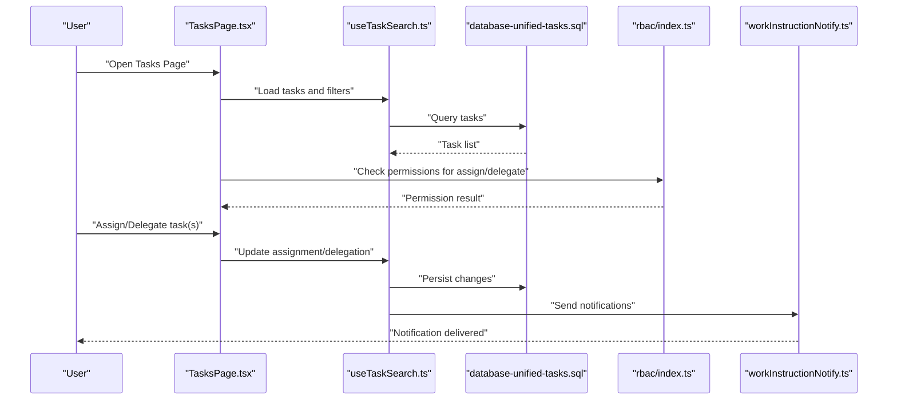
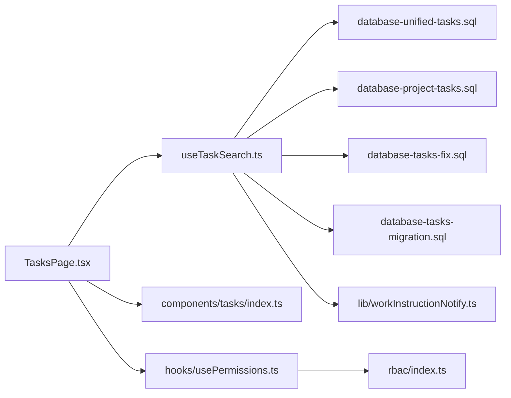

# Task Assignment API

<cite>
**Referenced Files in This Document**
- [TasksPage.tsx](file://src/pages/TasksPage.tsx)
- [useTaskSearch.ts](file://src/hooks/useTaskSearch.ts)
- [database-unified-tasks.sql](file://src/database-unified-tasks.sql)
- [database-project-tasks.sql](file://src/database-project-tasks.sql)
- [database-tasks-fix.sql](file://src/database-tasks-fix.sql)
- [database-tasks-migration.sql](file://src/database-tasks-migration.sql)
- [components/tasks/index.ts](file://src/components/tasks/index.ts)
- [rbac/index.ts](file://src/rbac/index.ts)
- [hooks/usePermissions.ts](file://src/hooks/usePermissions.ts)
- [lib/workInstructionNotify.ts](file://src/lib/workInstructionNotify.ts)
</cite>

## Table of Contents
1. [Introduction](#introduction)
2. [Project Structure](#project-structure)
3. [Core Components](#core-components)
4. [Architecture Overview](#architecture-overview)
5. [Detailed Component Analysis](#detailed-component-analysis)
6. [Dependency Analysis](#dependency-analysis)
7. [Performance Considerations](#performance-considerations)
8. [Troubleshooting Guide](#troubleshooting-guide)
9. [Conclusion](#conclusion)
10. [Appendices](#appendices)

## Introduction
This document provides comprehensive API documentation for task assignment and delegation operations. It covers user assignment workflows, role-based permissions, team coordination features, task reassignment, delegation patterns, and notification systems. It also includes examples for assigning tasks to multiple users, establishing ownership hierarchies, and managing transfers between team members, along with permission checks and access control mechanisms.

## Project Structure
The task assignment functionality spans UI components, hooks, database schemas, and RBAC utilities:
- UI entry point for the Tasks page
- Hooks for searching and interacting with tasks
- Database schema definitions and migrations for tasks
- RBAC module for permissions and access control
- Notification utilities for task-related alerts

```mermaid
graph TB
subgraph "UI"
TP["TasksPage.tsx"]
CT["components/tasks/index.ts"]
end
subgraph "Hooks"
UTS["useTaskSearch.ts"]
UP["usePermissions.ts"]
end
subgraph "RBAC"
RBAC["rbac/index.ts"]
end
subgraph "Database"
DUT["database-unified-tasks.sql"]
DPT["database-project-tasks.sql"]
DTF["database-tasks-fix.sql"]
DTM["database-tasks-migration.sql"]
end
subgraph "Notifications"
WIN["lib/workInstructionNotify.ts"]
end
TP --> UTS
TP --> CT
UTS --> DUT
UTS --> DPT
UTS --> DTF
UTS --> DTM
TP --> UP
UP --> RBAC
TP --> WIN
```

**Diagram sources**
- [TasksPage.tsx](file://src/pages/TasksPage.tsx)
- [useTaskSearch.ts](file://src/hooks/useTaskSearch.ts)
- [database-unified-tasks.sql](file://src/database-unified-tasks.sql)
- [database-project-tasks.sql](file://src/database-project-tasks.sql)
- [database-tasks-fix.sql](file://src/database-tasks-fix.sql)
- [database-tasks-migration.sql](file://src/database-tasks-migration.sql)
- [components/tasks/index.ts](file://src/components/tasks/index.ts)
- [hooks/usePermissions.ts](file://src/hooks/usePermissions.ts)
- [rbac/index.ts](file://src/rbac/index.ts)
- [lib/workInstructionNotify.ts](file://src/lib/workInstructionNotify.ts)

**Section sources**
- [TasksPage.tsx](file://src/pages/TasksPage.tsx)
- [useTaskSearch.ts](file://src/hooks/useTaskSearch.ts)
- [database-unified-tasks.sql](file://src/database-unified-tasks.sql)
- [database-project-tasks.sql](file://src/database-project-tasks.sql)
- [database-tasks-fix.sql](file://src/database-tasks-fix.sql)
- [database-tasks-migration.sql](file://src/database-tasks-migration.sql)
- [components/tasks/index.ts](file://src/components/tasks/index.ts)
- [hooks/usePermissions.ts](file://src/hooks/usePermissions.ts)
- [rbac/index.ts](file://src/rbac/index.ts)
- [lib/workInstructionNotify.ts](file://src/lib/workInstructionNotify.ts)

## Core Components
- Tasks Page: Entry point for viewing and managing tasks; orchestrates search, filters, and actions such as assignment and delegation.
- Task Search Hook: Encapsulates querying, filtering, and updating tasks; integrates with database schemas and RBAC checks.
- Task Components: Reusable UI elements for task lists, assignment modals, and delegation controls.
- Permissions Hook: Provides role-based checks used by the Tasks Page and hooks to gate assignment/delegation actions.
- Notifications Utility: Emits notifications when tasks are assigned or reassigned.

Key responsibilities:
- Validate user permissions before performing assignments or delegations.
- Enforce team context (e.g., project membership) when assigning tasks.
- Support single and multi-user assignments.
- Maintain an ownership hierarchy via assignee and delegate fields.
- Trigger notifications upon successful assignment or transfer.

**Section sources**
- [TasksPage.tsx](file://src/pages/TasksPage.tsx)
- [useTaskSearch.ts](file://src/hooks/useTaskSearch.ts)
- [components/tasks/index.ts](file://src/components/tasks/index.ts)
- [hooks/usePermissions.ts](file://src/hooks/usePermissions.ts)
- [lib/workInstructionNotify.ts](file://src/lib/workInstructionNotify.ts)

## Architecture Overview
The task assignment flow involves the UI layer invoking hooks that perform permission checks, query updates, and emit notifications. The database layer defines the task model and constraints necessary for assignment and delegation.



**Diagram sources**
- [TasksPage.tsx](file://src/pages/TasksPage.tsx)
- [useTaskSearch.ts](file://src/hooks/useTaskSearch.ts)
- [database-unified-tasks.sql](file://src/database-unified-tasks.sql)
- [rbac/index.ts](file://src/rbac/index.ts)
- [lib/workInstructionNotify.ts](file://src/lib/workInstructionNotify.ts)

## Detailed Component Analysis

### Tasks Page
Responsibilities:
- Renders task list and action panels.
- Invokes assignment and delegation flows.
- Integrates permission checks before allowing modifications.
- Displays feedback and triggers notifications.

Operational notes:
- Uses the task search hook to fetch and update tasks.
- Applies RBAC checks to restrict assignment/delegation based on roles.
- Supports batch operations for multi-user assignments.

**Section sources**
- [TasksPage.tsx](file://src/pages/TasksPage.tsx)
- [useTaskSearch.ts](file://src/hooks/useTaskSearch.ts)
- [hooks/usePermissions.ts](file://src/hooks/usePermissions.ts)
- [rbac/index.ts](file://src/rbac/index.ts)

### Task Search Hook
Responsibilities:
- Provides functions to search, filter, assign, and delegate tasks.
- Validates inputs and enforces business rules.
- Persists changes through database operations.
- Emits notifications after successful mutations.

Key behaviors:
- Single-user assignment: set primary assignee.
- Multi-user assignment: add collaborators or secondary assignees.
- Delegation: temporarily transfer responsibility while preserving original owner.
- Reassignment: move ownership from one user to another.

**Section sources**
- [useTaskSearch.ts](file://src/hooks/useTaskSearch.ts)
- [database-unified-tasks.sql](file://src/database-unified-tasks.sql)
- [database-project-tasks.sql](file://src/database-project-tasks.sql)
- [database-tasks-fix.sql](file://src/database-tasks-fix.sql)
- [database-tasks-migration.sql](file://src/database-tasks-migration.sql)
- [lib/workInstructionNotify.ts](file://src/lib/workInstructionNotify.ts)

### Task Components
Responsibilities:
- Provide reusable UI for task rows, assignment dialogs, and delegation controls.
- Surface validation errors and success states.
- Integrate with the Tasks Page and hooks for data binding.

**Section sources**
- [components/tasks/index.ts](file://src/components/tasks/index.ts)
- [TasksPage.tsx](file://src/pages/TasksPage.tsx)

### Permissions Hook and RBAC
Responsibilities:
- Expose role-based checks for task operations.
- Gate assignment and delegation actions based on user roles and team membership.
- Return structured results for UI gating and error messaging.

Common checks:
- CanAssignTask: determines if a user can assign tasks within a project/team context.
- CanDelegateTask: determines if a user can delegate tasks they own or manage.
- CanReassignTask: determines if a user can transfer ownership to another member.

**Section sources**
- [hooks/usePermissions.ts](file://src/hooks/usePermissions.ts)
- [rbac/index.ts](file://src/rbac/index.ts)

### Notifications Utility
Responsibilities:
- Emit notifications when tasks are assigned, delegated, or reassigned.
- Provide consistent user feedback across the application.

Integration points:
- Called by the task search hook after successful mutations.
- Consumed by the Tasks Page for immediate feedback.

**Section sources**
- [lib/workInstructionNotify.ts](file://src/lib/workInstructionNotify.ts)
- [useTaskSearch.ts](file://src/hooks/useTaskSearch.ts)

## Dependency Analysis
The following diagram shows how components depend on each other and on shared modules:



**Diagram sources**
- [TasksPage.tsx](file://src/pages/TasksPage.tsx)
- [useTaskSearch.ts](file://src/hooks/useTaskSearch.ts)
- [database-unified-tasks.sql](file://src/database-unified-tasks.sql)
- [database-project-tasks.sql](file://src/database-project-tasks.sql)
- [database-tasks-fix.sql](file://src/database-tasks-fix.sql)
- [database-tasks-migration.sql](file://src/database-tasks-migration.sql)
- [components/tasks/index.ts](file://src/components/tasks/index.ts)
- [hooks/usePermissions.ts](file://src/hooks/usePermissions.ts)
- [rbac/index.ts](file://src/rbac/index.ts)
- [lib/workInstructionNotify.ts](file://src/lib/workInstructionNotify.ts)

**Section sources**
- [TasksPage.tsx](file://src/pages/TasksPage.tsx)
- [useTaskSearch.ts](file://src/hooks/useTaskSearch.ts)
- [database-unified-tasks.sql](file://src/database-unified-tasks.sql)
- [database-project-tasks.sql](file://src/database-project-tasks.sql)
- [database-tasks-fix.sql](file://src/database-tasks-fix.sql)
- [database-tasks-migration.sql](file://src/database-tasks-migration.sql)
- [components/tasks/index.ts](file://src/components/tasks/index.ts)
- [hooks/usePermissions.ts](file://src/hooks/usePermissions.ts)
- [rbac/index.ts](file://src/rbac/index.ts)
- [lib/workInstructionNotify.ts](file://src/lib/workInstructionNotify.ts)

## Performance Considerations
- Batch operations: Prefer bulk assignment and delegation to reduce round trips.
- Filtering and indexing: Ensure database indexes support common filters (e.g., assignee, project_id).
- Caching: Cache frequently accessed task lists where appropriate to minimize repeated queries.
- Validation at the edge: Perform input validation early to avoid unnecessary server calls.

[No sources needed since this section provides general guidance]

## Troubleshooting Guide
Common issues and resolutions:
- Permission denied when assigning tasks: Verify RBAC checks and ensure the user has the required role and team membership.
- Delegation not reflected immediately: Confirm that the task search hook persists changes and refreshes the local state.
- Notifications not received: Check the notifications utility integration and ensure it is invoked after successful mutations.
- Multi-user assignment failures: Validate that all target users belong to the same project/team context and have read/write access.

**Section sources**
- [hooks/usePermissions.ts](file://src/hooks/usePermissions.ts)
- [rbac/index.ts](file://src/rbac/index.ts)
- [useTaskSearch.ts](file://src/hooks/useTaskSearch.ts)
- [lib/workInstructionNotify.ts](file://src/lib/workInstructionNotify.ts)

## Conclusion
The Task Assignment API integrates UI, hooks, RBAC, and database layers to provide robust assignment and delegation capabilities. It supports single and multi-user assignments, ownership hierarchies, and team coordination features, with clear permission checks and notification delivery. By adhering to the documented flows and best practices, teams can reliably manage task ownership and collaboration.

[No sources needed since this section summarizes without analyzing specific files]

## Appendices

### Assignment Workflows
- Assign to single user: Set primary assignee; validate user belongs to project/team; trigger notification.
- Assign to multiple users: Add collaborators or secondary assignees; ensure all users have required permissions; notify all assignees.
- Delegate task: Temporarily transfer responsibility while preserving original owner; allow reversion; notify delegate and original owner.
- Reassign task: Transfer ownership permanently; update audit trail; notify previous and new owners.

**Section sources**
- [useTaskSearch.ts](file://src/hooks/useTaskSearch.ts)
- [database-unified-tasks.sql](file://src/database-unified-tasks.sql)
- [database-project-tasks.sql](file://src/database-project-tasks.sql)
- [database-tasks-fix.sql](file://src/database-tasks-fix.sql)
- [database-tasks-migration.sql](file://src/database-tasks-migration.sql)
- [lib/workInstructionNotify.ts](file://src/lib/workInstructionNotify.ts)

### Ownership Hierarchy Patterns
- Primary owner: The main responsible user.
- Secondary assignees: Additional users who collaborate on the task.
- Delegate: Temporary owner during absence or workload balancing.
- Escalation path: Manager or lead who can override assignments when necessary.

**Section sources**
- [database-unified-tasks.sql](file://src/database-unified-tasks.sql)
- [database-project-tasks.sql](file://src/database-project-tasks.sql)
- [hooks/usePermissions.ts](file://src/hooks/usePermissions.ts)
- [rbac/index.ts](file://src/rbac/index.ts)

### Access Control Mechanisms
- Role-based checks: Use RBAC to determine allowed operations.
- Team context enforcement: Ensure assignments are limited to project/team members.
- Auditability: Record assignment and delegation changes for traceability.

**Section sources**
- [hooks/usePermissions.ts](file://src/hooks/usePermissions.ts)
- [rbac/index.ts](file://src/rbac/index.ts)
- [database-unified-tasks.sql](file://src/database-unified-tasks.sql)