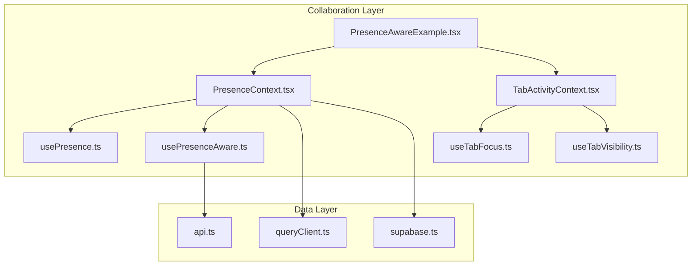
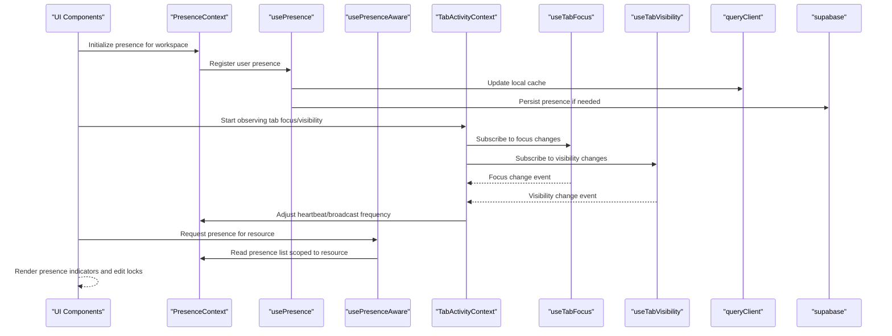
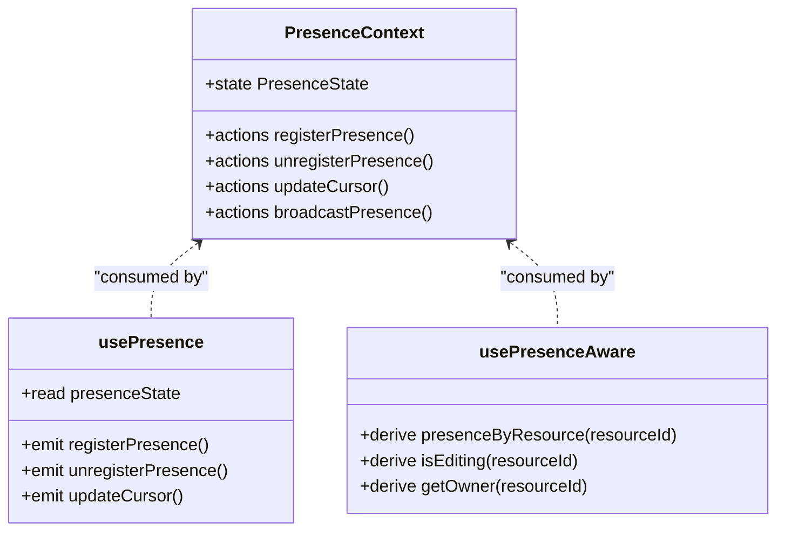
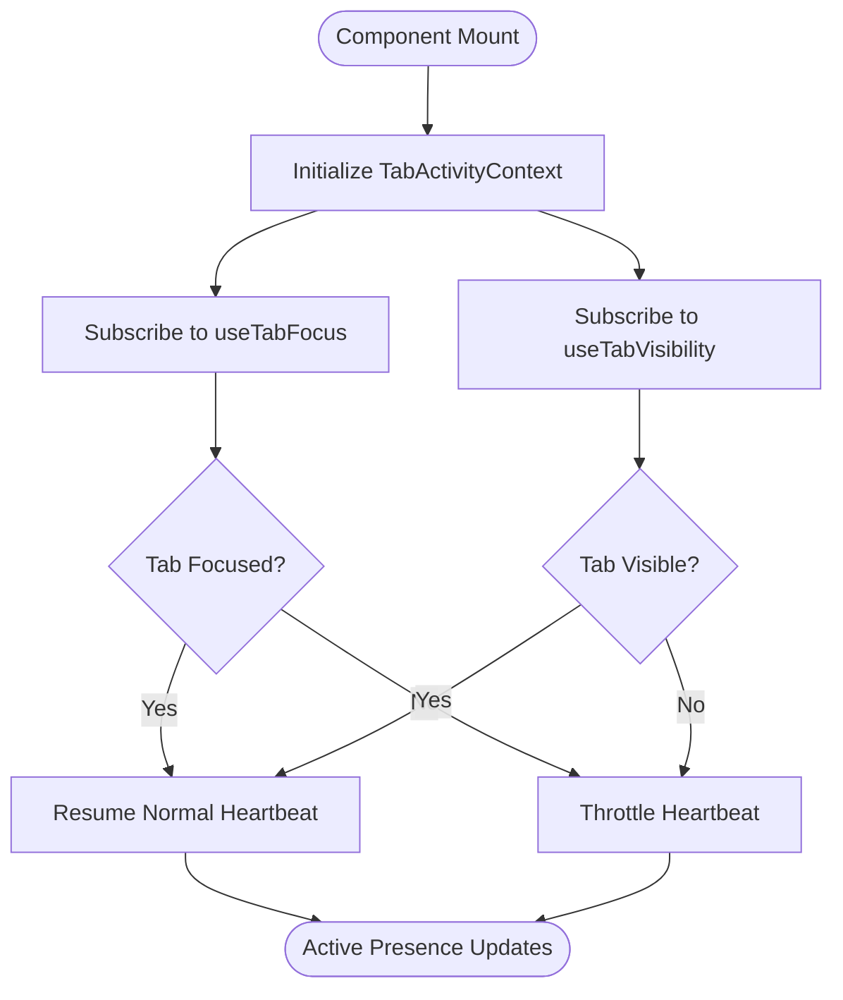
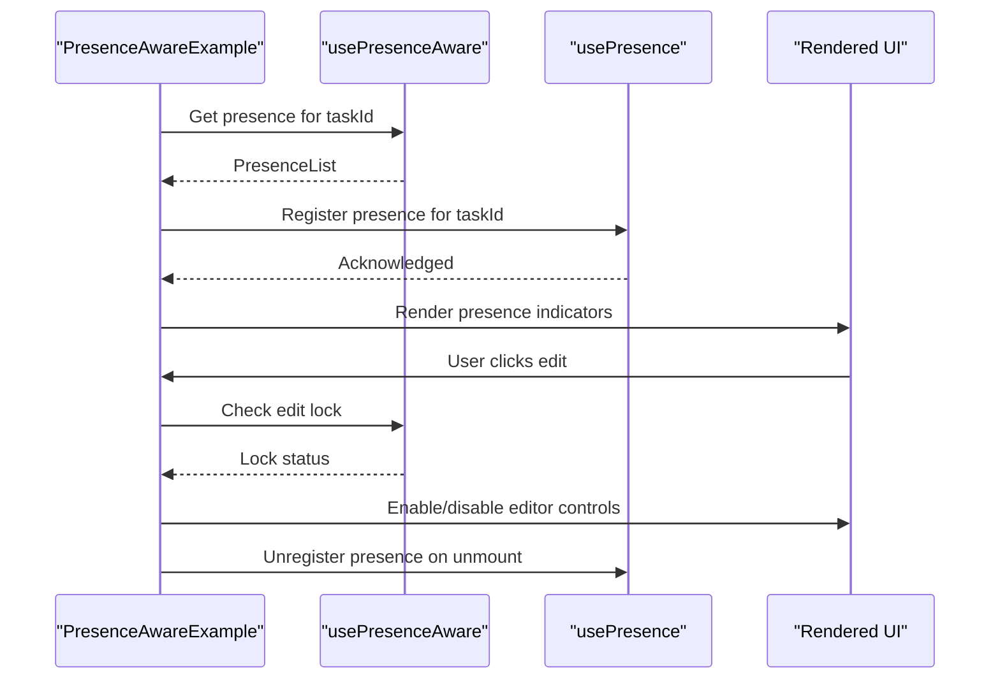
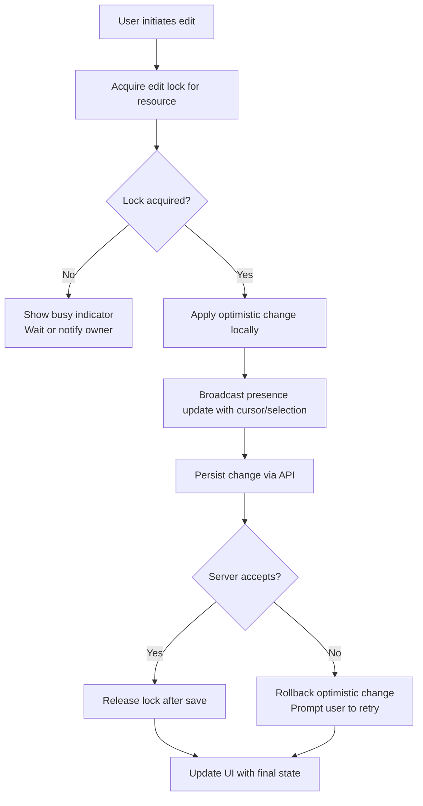
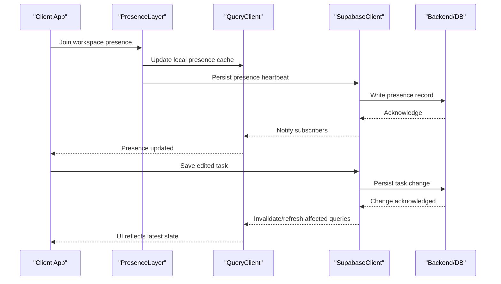
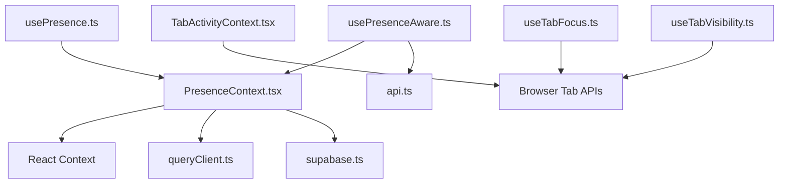

# Task Collaboration API

<cite>
**Referenced Files in This Document**
- [PresenceContext.tsx](file://src/contexts/PresenceContext.tsx)
- [usePresence.ts](file://src/hooks/usePresence.ts)
- [usePresenceAware.ts](file://src/hooks/usePresenceAware.ts)
- [PresenceAwareExample.tsx](file://src/examples/PresenceAwareExample.tsx)
- [TabActivityContext.tsx](file://src/hooks/TabActivityContext.tsx)
- [useTabFocus.ts](file://src/hooks/useTabFocus.ts)
- [useTabVisibility.ts](file://src/hooks/useTabVisibility.ts)
- [api.ts](file://src/api.ts)
- [queryClient.ts](file://src/queryClient.ts)
- [supabase.ts](file://src/supabase.ts)
</cite>

## Table of Contents
1. [Introduction](#introduction)
2. [Project Structure](#project-structure)
3. [Core Components](#core-components)
4. [Architecture Overview](#architecture-overview)
5. [Detailed Component Analysis](#detailed-component-analysis)
6. [Dependency Analysis](#dependency-analysis)
7. [Performance Considerations](#performance-considerations)
8. [Troubleshooting Guide](#troubleshooting-guide)
9. [Conclusion](#conclusion)
10. [Appendices](#appendices)

## Introduction
This document provides comprehensive API documentation for real-time collaboration features in task management, focusing on presence awareness, concurrent editing patterns, conflict resolution strategies, and real-time synchronization. It explains how user presence is detected, how collaborative editing is coordinated, and how changes are merged to avoid conflicts. It also covers WebSocket connections, event broadcasting, and offline sync capabilities where applicable.

The goal is to help developers implement:
- Real-time updates across clients
- User presence indicators (who is viewing/editing what)
- Collaborative workspaces with safe concurrent edits
- Robust merge strategies for conflicting changes
- Reliable connection handling and offline recovery

## Project Structure
The collaboration features are implemented primarily through React Contexts and hooks that manage presence state, tab visibility/focus, and integration with the data layer. The key areas include:
- Presence context and hooks for managing active users and their activities
- Tab activity and visibility hooks to detect when a workspace is in focus or visible
- Example usage demonstrating presence-aware components
- Data layer integration via query client and Supabase client for persistence and potential real-time channels

**Diagram sources**
- [PresenceContext.tsx](file://src/contexts/PresenceContext.tsx)
- [usePresence.ts](file://src/hooks/usePresence.ts)
- [usePresenceAware.ts](file://src/hooks/usePresenceAware.ts)
- [TabActivityContext.tsx](file://src/hooks/TabActivityContext.tsx)
- [useTabFocus.ts](file://src/hooks/useTabFocus.ts)
- [useTabVisibility.ts](file://src/hooks/useTabVisibility.ts)
- [PresenceAwareExample.tsx](file://src/examples/PresenceAwareExample.tsx)
- [api.ts](file://src/api.ts)
- [queryClient.ts](file://src/queryClient.ts)
- [supabase.ts](file://src/supabase.ts)

**Section sources**
- [PresenceContext.tsx](file://src/contexts/PresenceContext.tsx)
- [usePresence.ts](file://src/hooks/usePresence.ts)
- [usePresenceAware.ts](file://src/hooks/usePresenceAware.ts)
- [TabActivityContext.tsx](file://src/hooks/TabActivityContext.tsx)
- [useTabFocus.ts](file://src/hooks/useTabFocus.ts)
- [useTabVisibility.ts](file://src/hooks/useTabVisibility.ts)
- [PresenceAwareExample.tsx](file://src/examples/PresenceAwareExample.tsx)
- [api.ts](file://src/api.ts)
- [queryClient.ts](file://src/queryClient.ts)
- [supabase.ts](file://src/supabase.ts)

## Core Components
- Presence Context: Provides global presence state and actions for registering/unregistering users, tracking cursor positions, and broadcasting presence events.
- usePresence Hook: Consumes presence context to read current presence and emit presence-related actions.
- usePresenceAware Hook: Higher-level hook that combines presence with resource scope (e.g., workspace/task) to derive per-resource presence lists and editing locks.
- Tab Activity Context: Manages tab-level activity signals such as focus and visibility to optimize presence heartbeat and reduce unnecessary broadcasts.
- useTabFocus and useTabVisibility Hooks: Lightweight utilities to observe browser tab focus and visibility changes.
- PresenceAwareExample: Demonstrates how to render presence indicators and handle collaborative editing interactions.

These components together enable:
- Detection of who is currently active in a workspace
- Broadcasting of presence events to other clients
- Coordinated editing by marking ownership or locks
- Efficient updates based on tab visibility/focus

**Section sources**
- [PresenceContext.tsx](file://src/contexts/PresenceContext.tsx)
- [usePresence.ts](file://src/hooks/usePresence.ts)
- [usePresenceAware.ts](file://src/hooks/usePresenceAware.ts)
- [TabActivityContext.tsx](file://src/hooks/TabActivityContext.tsx)
- [useTabFocus.ts](file://src/hooks/useTabFocus.ts)
- [useTabVisibility.ts](file://src/hooks/useTabVisibility.ts)
- [PresenceAwareExample.tsx](file://src/examples/PresenceAwareExample.tsx)

## Architecture Overview
The collaboration architecture centers around a presence layer that coordinates user activity and integrates with the data layer for persistence and potential real-time channels.

**Diagram sources**
- [PresenceContext.tsx](file://src/contexts/PresenceContext.tsx)
- [usePresence.ts](file://src/hooks/usePresence.ts)
- [usePresenceAware.ts](file://src/hooks/usePresenceAware.ts)
- [TabActivityContext.tsx](file://src/hooks/TabActivityContext.tsx)
- [useTabFocus.ts](file://src/hooks/useTabFocus.ts)
- [useTabVisibility.ts](file://src/hooks/useTabVisibility.ts)
- [queryClient.ts](file://src/queryClient.ts)
- [supabase.ts](file://src/supabase.ts)

## Detailed Component Analysis

### Presence Context and Hooks
The presence system exposes a context and hooks to manage user presence within a workspace or resource scope. It supports:
- Registration and unregistration of presence
- Heartbeat mechanisms to keep presence alive
- Broadcasting presence events to peers
- Scoping presence to specific resources (tasks, documents)

**Diagram sources**
- [PresenceContext.tsx](file://src/contexts/PresenceContext.tsx)
- [usePresence.ts](file://src/hooks/usePresence.ts)
- [usePresenceAware.ts](file://src/hooks/usePresenceAware.ts)

**Section sources**
- [PresenceContext.tsx](file://src/contexts/PresenceContext.tsx)
- [usePresence.ts](file://src/hooks/usePresence.ts)
- [usePresenceAware.ts](file://src/hooks/usePresenceAware.ts)

### Tab Activity and Visibility Integration
To optimize presence heartbeats and reduce network overhead, the system integrates with tab focus and visibility detection. When a tab loses focus or becomes hidden, presence updates can be throttled; when focused, they resume at normal frequency.

**Diagram sources**
- [TabActivityContext.tsx](file://src/hooks/TabActivityContext.tsx)
- [useTabFocus.ts](file://src/hooks/useTabFocus.ts)
- [useTabVisibility.ts](file://src/hooks/useTabVisibility.ts)

**Section sources**
- [TabActivityContext.tsx](file://src/hooks/TabActivityContext.tsx)
- [useTabFocus.ts](file://src/hooks/useTabFocus.ts)
- [useTabVisibility.ts](file://src/hooks/useTabVisibility.ts)

### Example Usage: Presence-Aware Components
The example demonstrates how to render presence indicators and coordinate editing behavior using the presence hooks. It shows:
- Reading presence for a given resource
- Displaying avatars or cursors for active users
- Enforcing edit locks to prevent conflicting writes
- Handling presence lifecycle (join/leave)

**Diagram sources**
- [PresenceAwareExample.tsx](file://src/examples/PresenceAwareExample.tsx)
- [usePresenceAware.ts](file://src/hooks/usePresenceAware.ts)
- [usePresence.ts](file://src/hooks/usePresence.ts)

**Section sources**
- [PresenceAwareExample.tsx](file://src/examples/PresenceAwareExample.tsx)
- [usePresenceAware.ts](file://src/hooks/usePresenceAware.ts)
- [usePresence.ts](file://src/hooks/usePresence.ts)

### Concurrent Editing Patterns and Conflict Resolution
Concurrent editing is managed by combining presence with lightweight locking and optimistic updates:
- Ownership: The first user to request an edit lock becomes the owner until release.
- Optimistic UI: Changes are applied locally immediately and synced later.
- Merge Strategy: For non-destructive edits (e.g., appending text), apply last-write-wins with version stamps; for destructive edits (e.g., overwriting fields), require explicit lock acquisition and server-side validation.
- Conflict Detection: If multiple users attempt conflicting edits, the server resolves by rejecting out-of-date versions and prompting the client to refresh and re-apply changes.

[No sources needed since this diagram shows conceptual workflow, not actual code structure]

### Real-Time Synchronization and Offline Sync
Real-time synchronization relies on:
- Presence broadcasting to reflect live user activity
- Event-driven updates from the data layer (via query client and Supabase client)
- Offline resilience: queue local changes and reconcile when connectivity resumes

**Diagram sources**
- [queryClient.ts](file://src/queryClient.ts)
- [supabase.ts](file://src/supabase.ts)
- [api.ts](file://src/api.ts)

**Section sources**
- [queryClient.ts](file://src/queryClient.ts)
- [supabase.ts](file://src/supabase.ts)
- [api.ts](file://src/api.ts)

## Dependency Analysis
The collaboration layer depends on:
- React Context for state distribution
- Browser APIs for tab focus/visibility
- Query client for caching and invalidation
- Supabase client for persistence and potential real-time channels

**Diagram sources**
- [PresenceContext.tsx](file://src/contexts/PresenceContext.tsx)
- [usePresence.ts](file://src/hooks/usePresence.ts)
- [usePresenceAware.ts](file://src/hooks/usePresenceAware.ts)
- [TabActivityContext.tsx](file://src/hooks/TabActivityContext.tsx)
- [useTabFocus.ts](file://src/hooks/useTabFocus.ts)
- [useTabVisibility.ts](file://src/hooks/useTabVisibility.ts)
- [queryClient.ts](file://src/queryClient.ts)
- [supabase.ts](file://src/supabase.ts)
- [api.ts](file://src/api.ts)

**Section sources**
- [PresenceContext.tsx](file://src/contexts/PresenceContext.tsx)
- [usePresence.ts](file://src/hooks/usePresence.ts)
- [usePresenceAware.ts](file://src/hooks/usePresenceAware.ts)
- [TabActivityContext.tsx](file://src/hooks/TabActivityContext.tsx)
- [useTabFocus.ts](file://src/hooks/useTabFocus.ts)
- [useTabVisibility.ts](file://src/hooks/useTabVisibility.ts)
- [queryClient.ts](file://src/queryClient.ts)
- [supabase.ts](file://src/supabase.ts)
- [api.ts](file://src/api.ts)

## Performance Considerations
- Throttle presence heartbeats based on tab visibility/focus to reduce network load.
- Scope presence to specific resources to minimize broadcast size.
- Use optimistic updates to improve perceived responsiveness while ensuring eventual consistency.
- Debounce frequent cursor/selection updates to avoid excessive broadcasts.
- Implement backoff strategies for failed persistence attempts.

[No sources needed since this section provides general guidance]

## Troubleshooting Guide
Common issues and resolutions:
- Presence not updating: Verify tab focus/visibility subscriptions and ensure heartbeat is running when the tab is focused.
- Stale presence after disconnect: Implement cleanup on unmount and rely on server-side timeouts to expire stale entries.
- Conflicting edits: Ensure edit locks are enforced and that clients roll back optimistic changes when server rejects them.
- Offline mode: Queue local changes and reconcile upon reconnect; invalidate relevant queries to refresh UI.

**Section sources**
- [TabActivityContext.tsx](file://src/hooks/TabActivityContext.tsx)
- [usePresence.ts](file://src/hooks/usePresence.ts)
- [usePresenceAware.ts](file://src/hooks/usePresenceAware.ts)
- [queryClient.ts](file://src/queryClient.ts)
- [supabase.ts](file://src/supabase.ts)

## Conclusion
The collaboration API leverages presence contexts, tab activity detection, and robust data-layer integration to deliver real-time updates, concurrent editing safeguards, and resilient synchronization. By following the patterns outlined—ownership-based locks, optimistic updates, and careful heartbeat management—you can build responsive, conflict-free collaborative experiences for tasks and workspaces.

[No sources needed since this section summarizes without analyzing specific files]

## Appendices

### API Surface Summary
- Presence registration/unregistration
- Cursor/selection broadcasting
- Resource-scoped presence queries
- Edit lock acquisition/release
- Heartbeat control tied to tab visibility/focus

**Section sources**
- [PresenceContext.tsx](file://src/contexts/PresenceContext.tsx)
- [usePresence.ts](file://src/hooks/usePresence.ts)
- [usePresenceAware.ts](file://src/hooks/usePresenceAware.ts)
- [TabActivityContext.tsx](file://src/hooks/TabActivityContext.tsx)
- [useTabFocus.ts](file://src/hooks/useTabFocus.ts)
- [useTabVisibility.ts](file://src/hooks/useTabVisibility.ts)