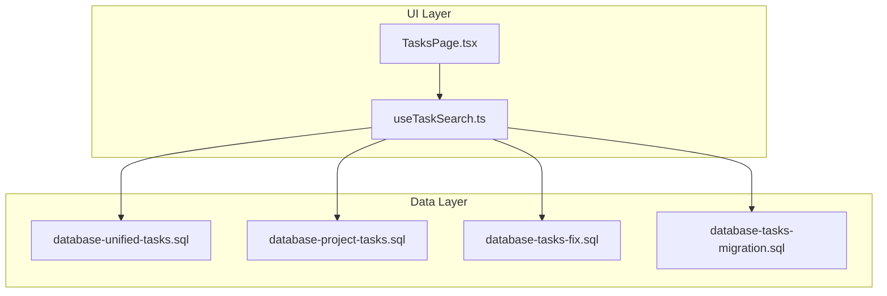
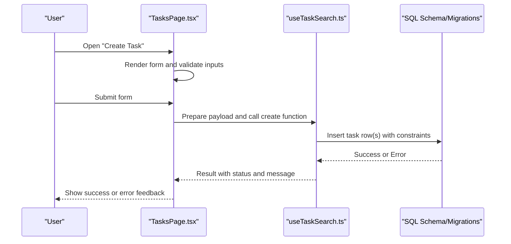
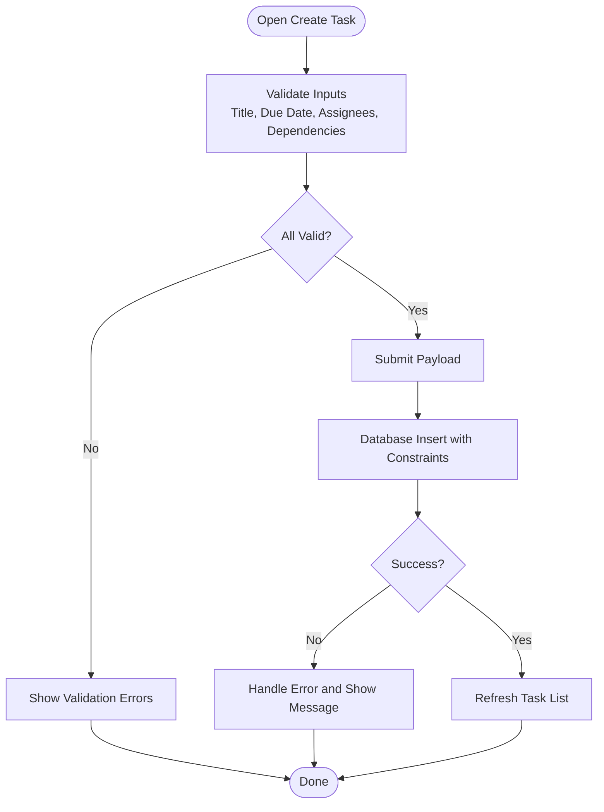
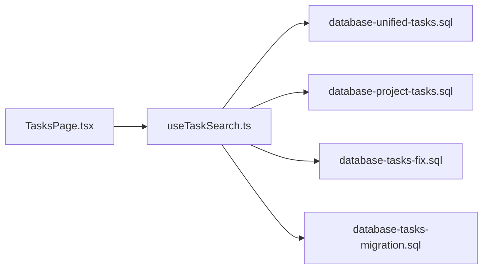

# Task Creation API

<cite>
**Referenced Files in This Document**
- [TasksPage.tsx](file://src/pages/TasksPage.tsx)
- [useTaskSearch.ts](file://src/hooks/useTaskSearch.ts)
- [database-unified-tasks.sql](file://src/database-unified-tasks.sql)
- [database-project-tasks.sql](file://src/database-project-tasks.sql)
- [database-tasks-fix.sql](file://src/database-tasks-fix.sql)
- [database-tasks-migration.sql](file://src/database-tasks-migration.sql)
</cite>

## Table of Contents
1. [Introduction](#introduction)
2. [Project Structure](#project-structure)
3. [Core Components](#core-components)
4. [Architecture Overview](#architecture-overview)
5. [Detailed Component Analysis](#detailed-component-analysis)
6. [Dependency Analysis](#dependency-analysis)
7. [Performance Considerations](#performance-considerations)
8. [Troubleshooting Guide](#troubleshooting-guide)
9. [Conclusion](#conclusion)

## Introduction
This document describes the task creation workflow and API surface exposed by the application for creating tasks, including form validation, data submission, error handling, and supported properties such as title, description, priority, due dates, assignees, and dependencies. It also covers bulk creation patterns and template-based generation where applicable.

## Project Structure
The task feature is implemented primarily through:
- A page-level component that hosts the task list and creation UI
- Hooks for searching and interacting with tasks
- Database schema definitions and migrations that define the task model and constraints

**Diagram sources**
- [TasksPage.tsx](file://src/pages/TasksPage.tsx)
- [useTaskSearch.ts](file://src/hooks/useTaskSearch.ts)
- [database-unified-tasks.sql](file://src/database-unified-tasks.sql)
- [database-project-tasks.sql](file://src/database-project-tasks.sql)
- [database-tasks-fix.sql](file://src/database-tasks-fix.sql)
- [database-tasks-migration.sql](file://src/database-tasks-migration.sql)

**Section sources**
- [TasksPage.tsx](file://src/pages/TasksPage.tsx)
- [useTaskSearch.ts](file://src/hooks/useTaskSearch.ts)
- [database-unified-tasks.sql](file://src/database-unified-tasks.sql)
- [database-project-tasks.sql](file://src/database-project-tasks.sql)
- [database-tasks-fix.sql](file://src/database-tasks-fix.sql)
- [database-tasks-migration.sql](file://src/database-tasks-migration.sql)

## Core Components
- TasksPage: Hosts the task list view and provides the entry point to create new tasks via a modal or drawer. It orchestrates user interactions, displays validation feedback, and triggers creation flows.
- useTaskSearch: Provides hooks and utilities for querying and managing tasks. It may be used to validate uniqueness, check availability of assignees, and support search/filtering around newly created tasks.

Key responsibilities:
- Presenting the task creation form with fields for title, description, priority, due date/time, assignees, and dependencies
- Performing client-side validation before submission
- Submitting the task payload to the backend (via Supabase RPC or direct table operations defined in SQL)
- Handling success and error states and surfacing messages to the user

**Section sources**
- [TasksPage.tsx](file://src/pages/TasksPage.tsx)
- [useTaskSearch.ts](file://src/hooks/useTaskSearch.ts)

## Architecture Overview
The task creation flow follows a typical frontend-to-database pattern:
- The UI collects and validates input
- The hook layer prepares the request payload
- The database layer enforces schema constraints and business rules
- Errors are propagated back to the UI for display

**Diagram sources**
- [TasksPage.tsx](file://src/pages/TasksPage.tsx)
- [useTaskSearch.ts](file://src/hooks/useTaskSearch.ts)
- [database-unified-tasks.sql](file://src/database-unified-tasks.sql)
- [database-project-tasks.sql](file://src/database-project-tasks.sql)
- [database-tasks-fix.sql](file://src/database-tasks-fix.sql)
- [database-tasks-migration.sql](file://src/database-tasks-migration.sql)

## Detailed Component Analysis

### Task Model and Properties
The task entity supports the following core properties:
- Title: Short descriptive name for the task
- Description: Optional detailed text explaining the task
- Priority: Numeric or enumerated level indicating urgency
- Due Date/Time: Deadline for completion; may include timezone considerations
- Assignees: One or more users responsible for completing the task
- Dependencies: References to other tasks that must be completed first

Constraints and validation rules:
- Title is required and typically has a maximum length limit
- Due date must be a valid future date/time when set
- Assignee IDs must reference existing users
- Dependency IDs must reference existing tasks and must not introduce cycles
- Priority values must fall within an allowed range

These rules are enforced both on the client side (for immediate feedback) and server side (in the database schema/migrations).

**Section sources**
- [database-unified-tasks.sql](file://src/database-unified-tasks.sql)
- [database-project-tasks.sql](file://src/database-project-tasks.sql)
- [database-tasks-fix.sql](file://src/database-tasks-fix.sql)
- [database-tasks-migration.sql](file://src/database-tasks-migration.sql)

### Single Task Creation Workflow
End-to-end sequence for creating one task:
- User opens the creation form
- Client validates fields (title presence, due date validity, assignee existence)
- Payload is sent to the database layer
- Database applies constraints (not null, foreign keys, checks)
- UI shows success or error based on response

**Diagram sources**
- [TasksPage.tsx](file://src/pages/TasksPage.tsx)
- [useTaskSearch.ts](file://src/hooks/useTaskSearch.ts)
- [database-unified-tasks.sql](file://src/database-unified-tasks.sql)
- [database-project-tasks.sql](file://src/database-project-tasks.sql)
- [database-tasks-fix.sql](file://src/database-tasks-fix.sql)
- [database-tasks-migration.sql](file://src/database-tasks-migration.sql)

### Bulk Task Creation
Bulk creation allows inserting multiple tasks in a single operation:
- Collect an array of task payloads from the form or imported data
- Perform per-item validation (e.g., required fields, valid references)
- Send batch insert to the database layer
- Aggregate results and report partial failures if any
- Update UI accordingly

Considerations:
- Use transactions to ensure atomicity when possible
- Limit batch size to avoid timeouts
- Provide clear feedback for items that failed validation or insertion

**Section sources**
- [useTaskSearch.ts](file://src/hooks/useTaskSearch.ts)
- [database-unified-tasks.sql](file://src/database-unified-tasks.sql)
- [database-project-tasks.sql](file://src/database-project-tasks.sql)
- [database-tasks-fix.sql](file://src/database-tasks-fix.sql)
- [database-tasks-migration.sql](file://src/database-tasks-migration.sql)

### Template-Based Task Generation
Template-based generation creates tasks from predefined templates:
- Select a template that defines default values (title, description, priority, due date offsets, assignees, dependencies)
- Apply overrides provided by the user
- Validate the merged payload
- Submit to the database layer

Benefits:
- Reduces repetitive data entry
- Ensures consistency across similar tasks
- Supports project-specific workflows

**Section sources**
- [TasksPage.tsx](file://src/pages/TasksPage.tsx)
- [useTaskSearch.ts](file://src/hooks/useTaskSearch.ts)
- [database-unified-tasks.sql](file://src/database-unified-tasks.sql)
- [database-project-tasks.sql](file://src/database-project-tasks.sql)
- [database-tasks-fix.sql](file://src/database-tasks-fix.sql)
- [database-tasks-migration.sql](file://src/database-tasks-migration.sql)

### Form Validation Rules
Common validation rules applied before submission:
- Required fields: title must be present and non-empty
- Data types: due date must be a valid date/time
- Referential integrity: assignee IDs and dependency IDs must exist
- Business constraints: no circular dependencies; priority within allowed range
- Length limits: title and description within maximum lengths

Client-side validation improves UX by providing immediate feedback. Server-side validation ensures data integrity.

**Section sources**
- [TasksPage.tsx](file://src/pages/TasksPage.tsx)
- [useTaskSearch.ts](file://src/hooks/useTaskSearch.ts)
- [database-unified-tasks.sql](file://src/database-unified-tasks.sql)
- [database-project-tasks.sql](file://src/database-project-tasks.sql)
- [database-tasks-fix.sql](file://src/database-tasks-fix.sql)
- [database-tasks-migration.sql](file://src/database-tasks-migration.sql)

### Error Handling
Error scenarios and handling strategies:
- Network errors: Retry with exponential backoff or prompt user to retry
- Validation errors: Display field-specific messages and prevent submission
- Constraint violations: Show actionable messages (e.g., invalid assignee ID)
- Partial failures in bulk: Report which items succeeded/failed and allow resubmission

Best practices:
- Normalize error responses into user-friendly messages
- Log detailed errors for debugging while keeping UI concise
- Provide recovery actions (edit, retry, skip)

**Section sources**
- [TasksPage.tsx](file://src/pages/TasksPage.tsx)
- [useTaskSearch.ts](file://src/hooks/useTaskSearch.ts)
- [database-unified-tasks.sql](file://src/database-unified-tasks.sql)
- [database-project-tasks.sql](file://src/database-project-tasks.sql)
- [database-tasks-fix.sql](file://src/database-tasks-fix.sql)
- [database-tasks-migration.sql](file://src/database-tasks-migration.sql)

## Dependency Analysis
The task creation feature depends on:
- UI components for rendering forms and displaying feedback
- Hooks for data access and validation logic
- Database schema and migrations defining constraints and relationships

**Diagram sources**
- [TasksPage.tsx](file://src/pages/TasksPage.tsx)
- [useTaskSearch.ts](file://src/hooks/useTaskSearch.ts)
- [database-unified-tasks.sql](file://src/database-unified-tasks.sql)
- [database-project-tasks.sql](file://src/database-project-tasks.sql)
- [database-tasks-fix.sql](file://src/database-tasks-fix.sql)
- [database-tasks-migration.sql](file://src/database-tasks-migration.sql)

**Section sources**
- [TasksPage.tsx](file://src/pages/TasksPage.tsx)
- [useTaskSearch.ts](file://src/hooks/useTaskSearch.ts)
- [database-unified-tasks.sql](file://src/database-unified-tasks.sql)
- [database-project-tasks.sql](file://src/database-project-tasks.sql)
- [database-tasks-fix.sql](file://src/database-tasks-fix.sql)
- [database-tasks-migration.sql](file://src/database-tasks-migration.sql)

## Performance Considerations
- Batch inserts: Prefer bulk creation for large sets of tasks to reduce round trips
- Indexes: Ensure indexes on frequently filtered columns (assignee_id, due_date, priority)
- Pagination: Load task lists incrementally to improve responsiveness
- Debounce: Avoid excessive re-renders during typing by debouncing input handlers
- Caching: Cache lookup data (users, templates) to minimize repeated queries

[No sources needed since this section provides general guidance]

## Troubleshooting Guide
Common issues and resolutions:
- Missing required fields: Ensure title is provided and meets length requirements
- Invalid assignee or dependency IDs: Verify referenced entities exist
- Circular dependencies: Remove cycles among task dependencies
- Due date in the past: Adjust due date to a valid future time if required
- Network or permission errors: Check authentication and permissions for task creation

Debugging steps:
- Inspect client-side validation logs
- Review server-side constraint violations
- Confirm database schema matches expected structure
- Reproduce with minimal payload to isolate issues

**Section sources**
- [TasksPage.tsx](file://src/pages/TasksPage.tsx)
- [useTaskSearch.ts](file://src/hooks/useTaskSearch.ts)
- [database-unified-tasks.sql](file://src/database-unified-tasks.sql)
- [database-project-tasks.sql](file://src/database-project-tasks.sql)
- [database-tasks-fix.sql](file://src/database-tasks-fix.sql)
- [database-tasks-migration.sql](file://src/database-tasks-migration.sql)

## Conclusion
The task creation API integrates a robust UI layer with strong database constraints to ensure reliable and consistent task management. By enforcing validation at multiple layers, supporting bulk and template-based creation, and providing clear error handling, the system delivers a smooth experience for users creating tasks with various configurations.

[No sources needed since this section summarizes without analyzing specific files]