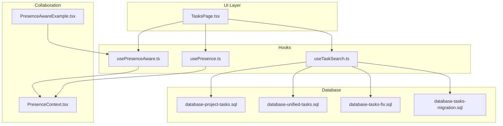
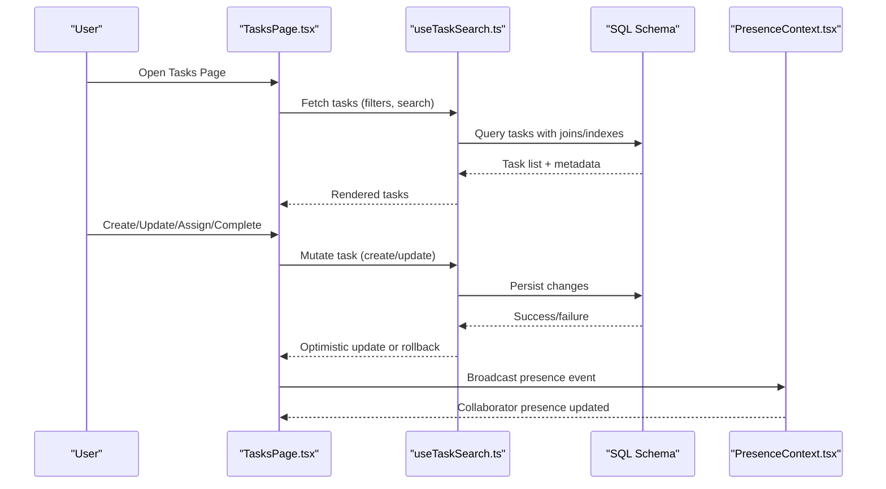
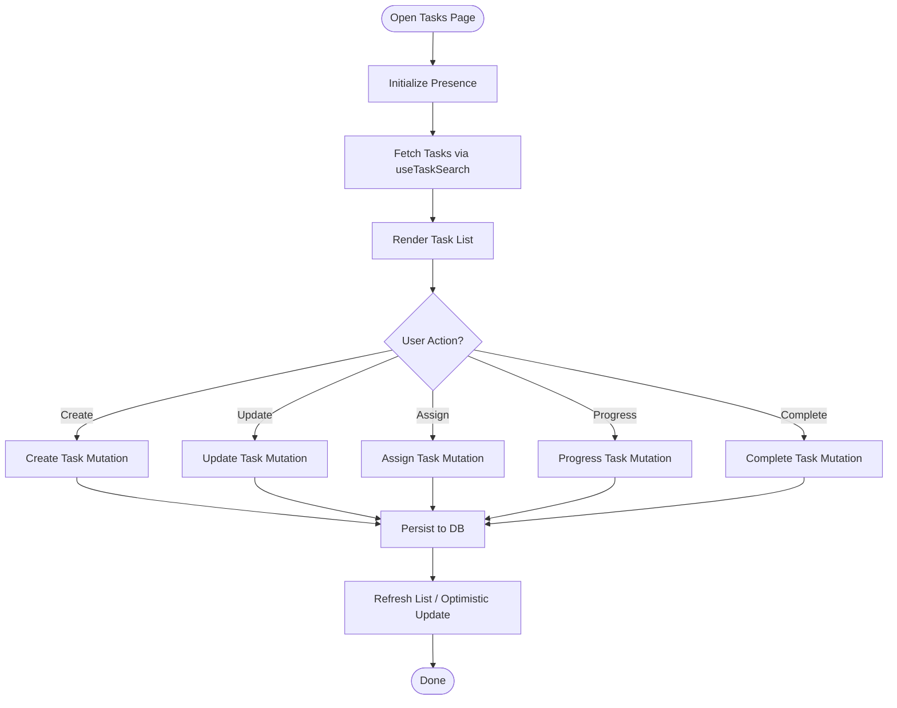
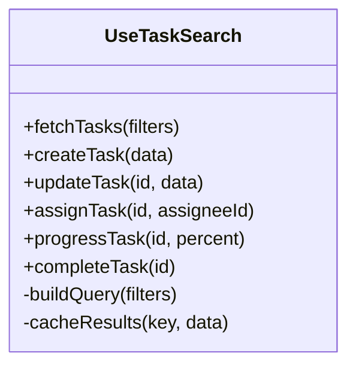
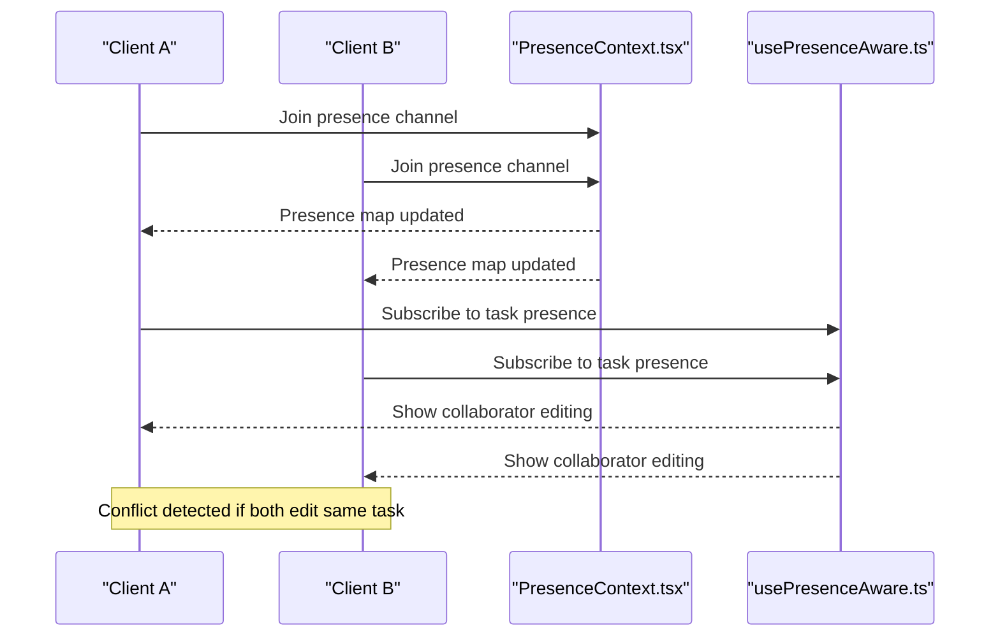
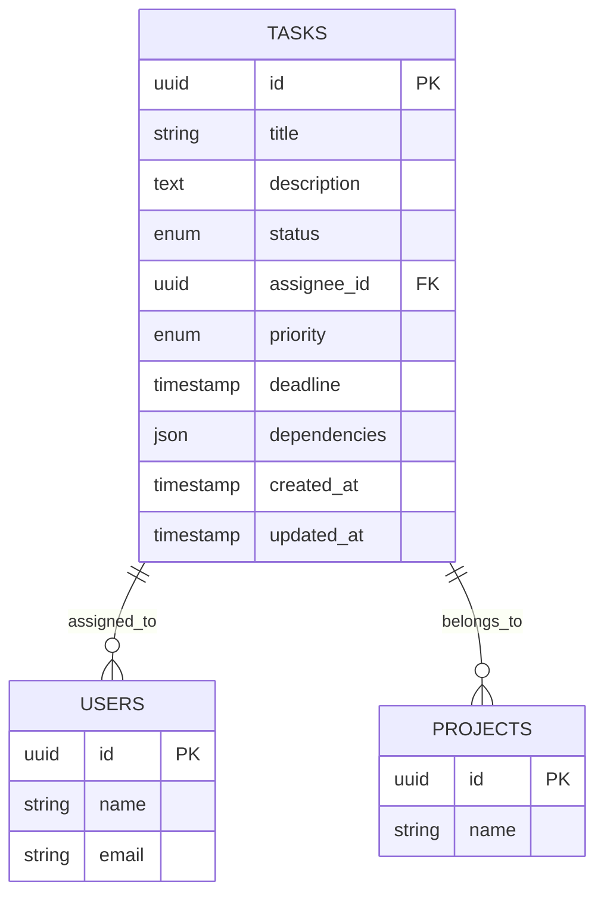
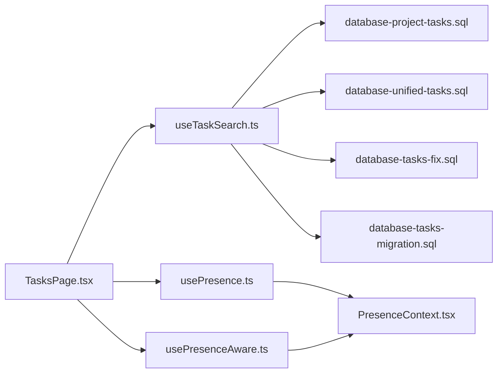

# Task Management API

<cite>
**Referenced Files in This Document**
- [TasksPage.tsx](file://src/pages/TasksPage.tsx)
- [useTaskSearch.ts](file://src/hooks/useTaskSearch.ts)
- [database-project-tasks.sql](file://src/database-project-tasks.sql)
- [database-unified-tasks.sql](file://src/database-unified-tasks.sql)
- [database-tasks-fix.sql](file://src/database-tasks-fix.sql)
- [database-tasks-migration.sql](file://src/database-tasks-migration.sql)
- [PresenceContext.tsx](file://src/contexts/PresenceContext.tsx)
- [usePresence.ts](file://src/hooks/usePresence.ts)
- [usePresenceAware.ts](file://src/hooks/usePresenceAware.ts)
- [PresenceAwareExample.tsx](file://src/examples/PresenceAwareExample.tsx)
</cite>

## Table of Contents
1. [Introduction](#introduction)
2. [Project Structure](#project-structure)
3. [Core Components](#core-components)
4. [Architecture Overview](#architecture-overview)
5. [Detailed Component Analysis](#detailed-component-analysis)
6. [Dependency Analysis](#dependency-analysis)
7. [Performance Considerations](#performance-considerations)
8. [Troubleshooting Guide](#troubleshooting-guide)
9. [Conclusion](#conclusion)
10. [Appendices](#appendices)

## Introduction
This document provides comprehensive API documentation for task management operations, including creation, assignment, progress tracking, completion workflows, dependencies, priority management, and deadline handling. It also covers real-time collaboration features such as presence awareness and conflict resolution for concurrent editing, with examples for delegation, progress updates, and team coordination patterns.

## Project Structure
The task management feature spans UI pages, hooks, database migrations, and presence/collaboration utilities:
- UI entry point for tasks is implemented in a page component that orchestrates search, filters, and rendering.
- Search and filtering logic are encapsulated in a dedicated hook.
- Database schema and migrations define the task model, relationships, and constraints.
- Presence and collaboration utilities provide real-time user presence and awareness.

**Diagram sources**
- [TasksPage.tsx](file://src/pages/TasksPage.tsx)
- [useTaskSearch.ts](file://src/hooks/useTaskSearch.ts)
- [database-project-tasks.sql](file://src/database-project-tasks.sql)
- [database-unified-tasks.sql](file://src/database-unified-tasks.sql)
- [database-tasks-fix.sql](file://src/database-tasks-fix.sql)
- [database-tasks-migration.sql](file://src/database-tasks-migration.sql)
- [PresenceContext.tsx](file://src/contexts/PresenceContext.tsx)
- [usePresence.ts](file://src/hooks/usePresence.ts)
- [usePresenceAware.ts](file://src/hooks/usePresenceAware.ts)
- [PresenceAwareExample.tsx](file://src/examples/PresenceAwareExample.tsx)

**Section sources**
- [TasksPage.tsx](file://src/pages/TasksPage.tsx)
- [useTaskSearch.ts](file://src/hooks/useTaskSearch.ts)
- [database-project-tasks.sql](file://src/database-project-tasks.sql)
- [database-unified-tasks.sql](file://src/database-unified-tasks.sql)
- [database-tasks-fix.sql](file://src/database-tasks-fix.sql)
- [database-tasks-migration.sql](file://src/database-tasks-migration.sql)
- [PresenceContext.tsx](file://src/contexts/PresenceContext.tsx)
- [usePresence.ts](file://src/hooks/usePresence.ts)
- [usePresenceAware.ts](file://src/hooks/usePresenceAware.ts)
- [PresenceAwareExample.tsx](file://src/examples/PresenceAwareExample.tsx)

## Core Components
- Tasks Page: Orchestrates task listing, search, filters, and interactions. It integrates with hooks for data retrieval and presence information.
- Task Search Hook: Encapsulates query building, filtering, pagination, and caching strategies for efficient task retrieval.
- Presence Context and Hooks: Provide real-time presence state and awareness utilities to support collaborative editing and conflict resolution.
- Database Migrations: Define task schema, indexes, constraints, and evolution over time.

Key responsibilities:
- Creation: Validate inputs, persist new tasks, and return identifiers.
- Assignment: Update assignee fields with authorization checks.
- Progress Tracking: Update status and percentage fields atomically.
- Completion: Transition states with validation and auditability.
- Dependencies: Enforce referential integrity and cascade behaviors.
- Priority and Deadlines: Manage ordering and due date enforcement.
- Real-time Collaboration: Track active users and resolve conflicts on concurrent edits.

**Section sources**
- [TasksPage.tsx](file://src/pages/TasksPage.tsx)
- [useTaskSearch.ts](file://src/hooks/useTaskSearch.ts)
- [PresenceContext.tsx](file://src/contexts/PresenceContext.tsx)
- [usePresence.ts](file://src/hooks/usePresence.ts)
- [usePresenceAware.ts](file://src/hooks/usePresenceAware.ts)
- [database-project-tasks.sql](file://src/database-project-tasks.sql)
- [database-unified-tasks.sql](file://src/database-unified-tasks.sql)
- [database-tasks-fix.sql](file://src/database-tasks-fix.sql)
- [database-tasks-migration.sql](file://src/database-tasks-migration.sql)

## Architecture Overview
The task management architecture follows a layered approach:
- UI Layer: The tasks page renders lists and forms, delegates actions to hooks.
- Data Access Layer: Hooks build queries and manage caching, interacting with the database via SQL migrations.
- Collaboration Layer: Presence context maintains live user presence; awareness hooks integrate presence into task editing flows.
- Persistence Layer: Database tables store tasks, assignments, dependencies, priorities, deadlines, and audit metadata.

**Diagram sources**
- [TasksPage.tsx](file://src/pages/TasksPage.tsx)
- [useTaskSearch.ts](file://src/hooks/useTaskSearch.ts)
- [database-project-tasks.sql](file://src/database-project-tasks.sql)
- [database-unified-tasks.sql](file://src/database-unified-tasks.sql)
- [PresenceContext.tsx](file://src/contexts/PresenceContext.tsx)

## Detailed Component Analysis

### Tasks Page
Responsibilities:
- Display task lists with search and filters.
- Trigger create, update, assign, progress, and complete operations.
- Integrate presence indicators for collaborators.

Operational flow:
- On mount, initialize presence and fetch tasks using the search hook.
- Handle user interactions by invoking mutation functions from the search hook.
- Reflect presence changes in the UI (e.g., showing who is editing).

**Diagram sources**
- [TasksPage.tsx](file://src/pages/TasksPage.tsx)
- [useTaskSearch.ts](file://src/hooks/useTaskSearch.ts)

**Section sources**
- [TasksPage.tsx](file://src/pages/TasksPage.tsx)
- [useTaskSearch.ts](file://src/hooks/useTaskSearch.ts)

### Task Search Hook
Responsibilities:
- Build queries based on filters (status, assignee, priority, deadline).
- Implement pagination and caching.
- Expose mutations for create, update, assign, progress, and complete.

Data flow:
- Input parameters include search terms, filters, and pagination options.
- Output includes task records, total counts, and loading/error states.
- Mutations trigger optimistic updates and handle rollbacks on failure.

**Diagram sources**
- [useTaskSearch.ts](file://src/hooks/useTaskSearch.ts)

**Section sources**
- [useTaskSearch.ts](file://src/hooks/useTaskSearch.ts)

### Presence and Awareness
Responsibilities:
- Maintain global presence state (who is online, what they are editing).
- Provide awareness hooks to subscribe to presence changes.
- Support conflict detection and resolution during concurrent edits.

Integration points:
- Tasks page subscribes to presence to show active editors.
- Awareness hook merges presence with task edit sessions.

**Diagram sources**
- [PresenceContext.tsx](file://src/contexts/PresenceContext.tsx)
- [usePresence.ts](file://src/hooks/usePresence.ts)
- [usePresenceAware.ts](file://src/hooks/usePresenceAware.ts)
- [PresenceAwareExample.tsx](file://src/examples/PresenceAwareExample.tsx)

**Section sources**
- [PresenceContext.tsx](file://src/contexts/PresenceContext.tsx)
- [usePresence.ts](file://src/hooks/usePresence.ts)
- [usePresenceAware.ts](file://src/hooks/usePresenceAware.ts)
- [PresenceAwareExample.tsx](file://src/examples/PresenceAwareExample.tsx)

### Database Schema and Migrations
Responsibilities:
- Define task entities, relationships, and constraints.
- Provide indexes for performance-critical queries.
- Ensure schema evolution through migrations.

Key aspects:
- Task table includes fields for title, description, status, assignee, priority, deadline, dependencies, and timestamps.
- Indexes on status, assignee, priority, and deadline improve filter performance.
- Constraints enforce valid states and referential integrity for dependencies.

**Diagram sources**
- [database-project-tasks.sql](file://src/database-project-tasks.sql)
- [database-unified-tasks.sql](file://src/database-unified-tasks.sql)
- [database-tasks-fix.sql](file://src/database-tasks-fix.sql)
- [database-tasks-migration.sql](file://src/database-tasks-migration.sql)

**Section sources**
- [database-project-tasks.sql](file://src/database-project-tasks.sql)
- [database-unified-tasks.sql](file://src/database-unified-tasks.sql)
- [database-tasks-fix.sql](file://src/database-tasks-fix.sql)
- [database-tasks-migration.sql](file://src/database-tasks-migration.sql)

## Dependency Analysis
- UI depends on hooks for data access and presence integration.
- Hooks depend on database schema defined by migrations.
- Presence context is independent but consumed by UI and awareness hooks.

**Diagram sources**
- [TasksPage.tsx](file://src/pages/TasksPage.tsx)
- [useTaskSearch.ts](file://src/hooks/useTaskSearch.ts)
- [usePresence.ts](file://src/hooks/usePresence.ts)
- [usePresenceAware.ts](file://src/hooks/usePresenceAware.ts)
- [PresenceContext.tsx](file://src/contexts/PresenceContext.tsx)
- [database-project-tasks.sql](file://src/database-project-tasks.sql)
- [database-unified-tasks.sql](file://src/database-unified-tasks.sql)
- [database-tasks-fix.sql](file://src/database-tasks-fix.sql)
- [database-tasks-migration.sql](file://src/database-tasks-migration.sql)

**Section sources**
- [TasksPage.tsx](file://src/pages/TasksPage.tsx)
- [useTaskSearch.ts](file://src/hooks/useTaskSearch.ts)
- [usePresence.ts](file://src/hooks/usePresence.ts)
- [usePresenceAware.ts](file://src/hooks/usePresenceAware.ts)
- [PresenceContext.tsx](file://src/contexts/PresenceContext.tsx)
- [database-project-tasks.sql](file://src/database-project-tasks.sql)
- [database-unified-tasks.sql](file://src/database-unified-tasks.sql)
- [database-tasks-fix.sql](file://src/database-tasks-fix.sql)
- [database-tasks-migration.sql](file://src/database-tasks-migration.sql)

## Performance Considerations
- Indexing: Ensure indexes exist on frequently filtered columns (status, assignee, priority, deadline).
- Pagination: Use cursor-based or offset pagination to limit payload size.
- Caching: Cache search results keyed by filters and invalidate on mutations.
- Optimistic Updates: Apply client-side updates immediately and revert on server errors.
- Presence Throttling: Debounce presence broadcasts to reduce network overhead.

[No sources needed since this section provides general guidance]

## Troubleshooting Guide
Common issues and resolutions:
- Missing indexes causing slow queries: Verify migration scripts have applied required indexes.
- State inconsistencies after concurrent edits: Use presence-aware conflict resolution and version checks.
- Authorization failures when assigning tasks: Confirm role-based permissions are enforced at the API layer.
- Presence not updating: Check presence channel initialization and error handling.

**Section sources**
- [database-project-tasks.sql](file://src/database-project-tasks.sql)
- [database-unified-tasks.sql](file://src/database-unified-tasks.sql)
- [database-tasks-fix.sql](file://src/database-tasks-fix.sql)
- [database-tasks-migration.sql](file://src/database-tasks-migration.sql)
- [PresenceContext.tsx](file://src/contexts/PresenceContext.tsx)
- [usePresence.ts](file://src/hooks/usePresence.ts)
- [usePresenceAware.ts](file://src/hooks/usePresenceAware.ts)

## Conclusion
The task management API provides robust capabilities for creating, assigning, tracking, and completing tasks, with strong support for dependencies, priorities, deadlines, and real-time collaboration. By leveraging presence awareness and careful database design, teams can coordinate effectively while maintaining data integrity and performance.

[No sources needed since this section summarizes without analyzing specific files]

## Appendices

### Examples

#### Task Delegation
- Create a task and assign it to a team member.
- Update assignee dynamically as responsibilities change.
- Notify stakeholders via presence indicators.

**Section sources**
- [TasksPage.tsx](file://src/pages/TasksPage.tsx)
- [useTaskSearch.ts](file://src/hooks/useTaskSearch.ts)
- [usePresence.ts](file://src/hooks/usePresence.ts)

#### Progress Updates
- Incrementally update progress percentages.
- Validate transitions to ensure logical progression.
- Reflect changes in real-time across collaborators.

**Section sources**
- [TasksPage.tsx](file://src/pages/TasksPage.tsx)
- [useTaskSearch.ts](file://src/hooks/useTaskSearch.ts)
- [usePresenceAware.ts](file://src/hooks/usePresenceAware.ts)

#### Team Coordination Patterns
- Monitor active editors per task.
- Resolve conflicts by merging non-overlapping changes.
- Maintain an audit trail of modifications.

**Section sources**
- [PresenceContext.tsx](file://src/contexts/PresenceContext.tsx)
- [usePresenceAware.ts](file://src/hooks/usePresenceAware.ts)
- [PresenceAwareExample.tsx](file://src/examples/PresenceAwareExample.tsx)