# Task Progress Tracking API

<cite>
**Referenced Files in This Document**
- [database-project-tasks.sql](file://src/database-project-tasks.sql)
- [database-unified-tasks.sql](file://src/database-unified-tasks.sql)
- [database-tasks-fix.sql](file://src/database-tasks-fix.sql)
- [database-tasks-migration.sql](file://src/database-tasks-migration.sql)
- [useMilestones.ts](file://src/hooks/useMilestones.ts)
- [useTaskSearch.ts](file://src/hooks/useTaskSearch.ts)
- [TasksPage.tsx](file://src/pages/TasksPage.tsx)
- [components/tasks/index.tsx](file://src/components/tasks/index.tsx)
</cite>

## Table of Contents
1. [Introduction](#introduction)
2. [Project Structure](#project-structure)
3. [Core Components](#core-components)
4. [Architecture Overview](#architecture-overview)
5. [Detailed Component Analysis](#detailed-component-analysis)
6. [Dependency Analysis](#dependency-analysis)
7. [Performance Considerations](#performance-considerations)
8. [Troubleshooting Guide](#troubleshooting-guide)
9. [Conclusion](#conclusion)

## Introduction
This document provides detailed API documentation for task progress tracking and status management. It covers state transitions, progress updates, completion workflows, milestone tracking, progress indicators, audit trails, change history, and analytics integration points. The focus is on how tasks are modeled, updated, and observed within the application, with emphasis on durable schema design and client-side hooks that drive UI behavior.

## Project Structure
The task progress feature spans database migrations (schema), hooks (data access and caching), and pages/components (UI). Key areas:
- Database schema and migrations define task entities, statuses, milestones, comments, time logs, and audit fields.
- Hooks provide typed data access, search, and milestone operations.
- Pages and components orchestrate user interactions such as updating status, marking completion, adding comments, and logging time.

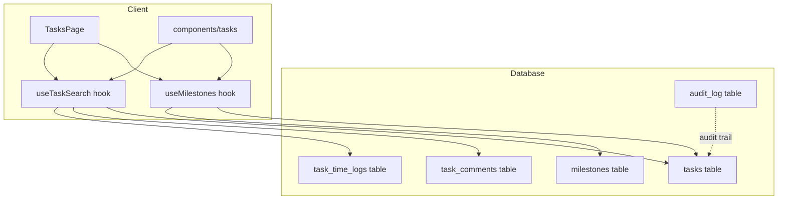

**Diagram sources**
- [database-project-tasks.sql](file://src/database-project-tasks.sql)
- [database-unified-tasks.sql](file://src/database-unified-tasks.sql)
- [database-tasks-fix.sql](file://src/database-tasks-fix.sql)
- [database-tasks-migration.sql](file://src/database-tasks-migration.sql)
- [useMilestones.ts](file://src/hooks/useMilestones.ts)
- [useTaskSearch.ts](file://src/hooks/useTaskSearch.ts)
- [TasksPage.tsx](file://src/pages/TasksPage.tsx)
- [components/tasks/index.tsx](file://src/components/tasks/index.tsx)

**Section sources**
- [database-project-tasks.sql](file://src/database-project-tasks.sql)
- [database-unified-tasks.sql](file://src/database-unified-tasks.sql)
- [database-tasks-fix.sql](file://src/database-tasks-fix.sql)
- [database-tasks-migration.sql](file://src/database-tasks-migration.sql)
- [useMilestones.ts](file://src/hooks/useMilestones.ts)
- [useTaskSearch.ts](file://src/hooks/useTaskSearch.ts)
- [TasksPage.tsx](file://src/pages/TasksPage.tsx)
- [components/tasks/index.tsx](file://src/components/tasks/index.tsx)

## Core Components
- Task entity and lifecycle states:
  - Status values include draft, open, in_progress, blocked, completed, cancelled.
  - Completion requires a completion timestamp and optional reason or notes.
  - Time spent is tracked via dedicated time log entries linked to tasks.
- Milestones:
  - Tasks can be associated with milestones; milestone completion contributes to overall task progress.
  - Milestone progress is computed from child items or percentage fields.
- Comments and audit trail:
  - Task comments capture contextual updates.
  - Audit log records changes to key fields for traceability.

Operational capabilities exposed by hooks and UI:
- Update task status and completion.
- Add progress comments.
- Log time spent per task.
- Search and filter tasks by status, assignee, project, and keywords.
- Observe milestone progress and completion.

**Section sources**
- [database-project-tasks.sql](file://src/database-project-tasks.sql)
- [database-unified-tasks.sql](file://src/database-unified-tasks.sql)
- [database-tasks-fix.sql](file://src/database-tasks-fix.sql)
- [database-tasks-migration.sql](file://src/database-tasks-migration.sql)
- [useMilestones.ts](file://src/hooks/useMilestones.ts)
- [useTaskSearch.ts](file://src/hooks/useTaskSearch.ts)
- [TasksPage.tsx](file://src/pages/TasksPage.tsx)
- [components/tasks/index.tsx](file://src/components/tasks/index.tsx)

## Architecture Overview
The system follows a layered architecture:
- Data layer: Relational tables store tasks, milestones, comments, time logs, and audit events.
- Access layer: Client hooks encapsulate queries and mutations for tasks and milestones.
- Presentation layer: Pages and components render task lists, detail views, and progress indicators.

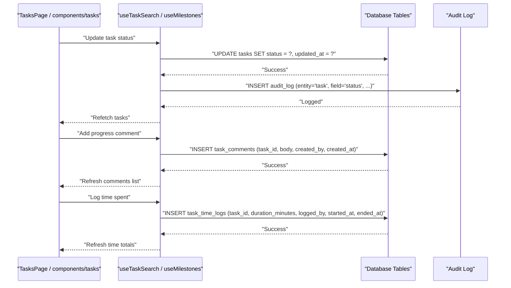

**Diagram sources**
- [useTaskSearch.ts](file://src/hooks/useTaskSearch.ts)
- [useMilestones.ts](file://src/hooks/useMilestones.ts)
- [database-project-tasks.sql](file://src/database-project-tasks.sql)
- [database-unified-tasks.sql](file://src/database-unified-tasks.sql)
- [database-tasks-fix.sql](file://src/database-tasks-fix.sql)
- [database-tasks-migration.sql](file://src/database-tasks-migration.sql)

## Detailed Component Analysis

### Task State Machine and Transitions
Valid transitions ensure consistent lifecycle progression:
- Draft -> Open
- Open -> In Progress
- In Progress -> Blocked
- In Progress -> Completed
- Any -> Cancelled (with appropriate permissions)

Completion workflow:
- Set status to completed and record completion timestamp.
- Optionally attach completion notes or reason.
- Ensure all required milestones are marked complete if enforced.

Progress indicators:
- Derived from milestone completion percentages or explicit progress fields.
- Aggregated at task level for dashboards and lists.

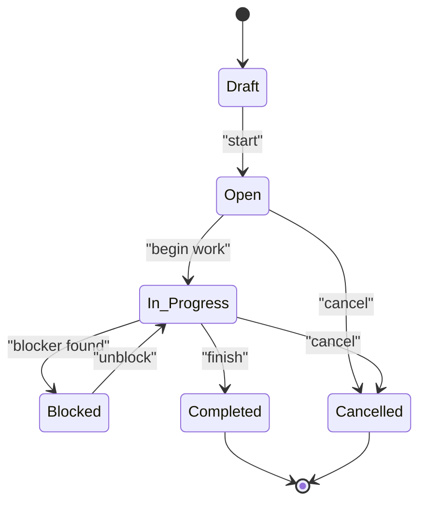

**Diagram sources**
- [database-project-tasks.sql](file://src/database-project-tasks.sql)
- [database-unified-tasks.sql](file://src/database-unified-tasks.sql)
- [database-tasks-fix.sql](file://src/database-tasks-fix.sql)

**Section sources**
- [database-project-tasks.sql](file://src/database-project-tasks.sql)
- [database-unified-tasks.sql](file://src/database-unified-tasks.sql)
- [database-tasks-fix.sql](file://src/database-tasks-fix.sql)

### Milestones and Progress Calculation
Milestones contribute to task-level progress:
- Each milestone has a completion flag or percentage.
- Task progress aggregates milestone completion across related items.
- Milestone completion may trigger downstream actions (e.g., enabling next phases).

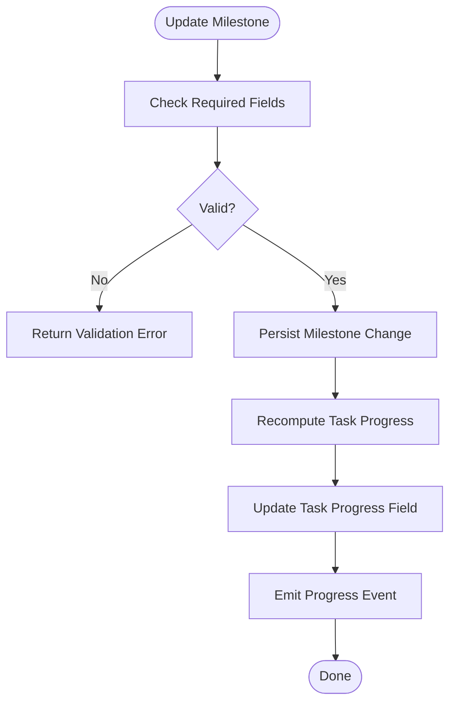

**Diagram sources**
- [useMilestones.ts](file://src/hooks/useMilestones.ts)
- [database-unified-tasks.sql](file://src/database-unified-tasks.sql)

**Section sources**
- [useMilestones.ts](file://src/hooks/useMilestones.ts)
- [database-unified-tasks.sql](file://src/database-unified-tasks.sql)

### Updating Task Status
Typical flow:
- UI triggers status update action.
- Hook validates allowed transitions and required fields.
- Database updates task status and timestamps.
- Audit log records the change.
- Client refetches task data to reflect new state.

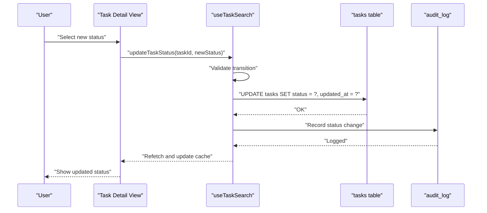

**Diagram sources**
- [useTaskSearch.ts](file://src/hooks/useTaskSearch.ts)
- [database-project-tasks.sql](file://src/database-project-tasks.sql)
- [database-tasks-fix.sql](file://src/database-tasks-fix.sql)

**Section sources**
- [useTaskSearch.ts](file://src/hooks/useTaskSearch.ts)
- [database-project-tasks.sql](file://src/database-project-tasks.sql)
- [database-tasks-fix.sql](file://src/database-tasks-fix.sql)

### Marking Task Completion
Completion workflow:
- Validate completion prerequisites (e.g., required milestones).
- Set status to completed and record completion timestamp.
- Optionally add completion notes.
- Log audit event and refresh UI.

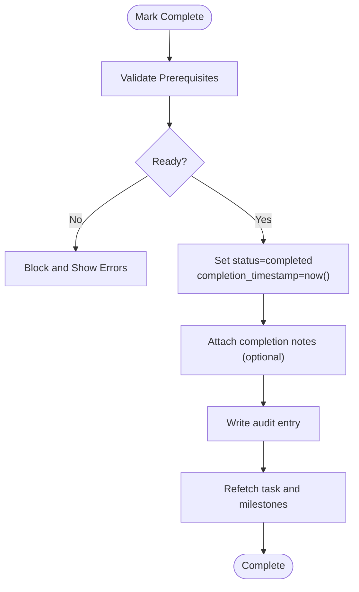

**Diagram sources**
- [useTaskSearch.ts](file://src/hooks/useTaskSearch.ts)
- [database-project-tasks.sql](file://src/database-project-tasks.sql)

**Section sources**
- [useTaskSearch.ts](file://src/hooks/useTaskSearch.ts)
- [database-project-tasks.sql](file://src/database-project-tasks.sql)

### Adding Progress Comments
Comments capture contextual updates:
- Create comment entries linked to tasks.
- Include author and timestamp metadata.
- Display chronological comment threads in task details.

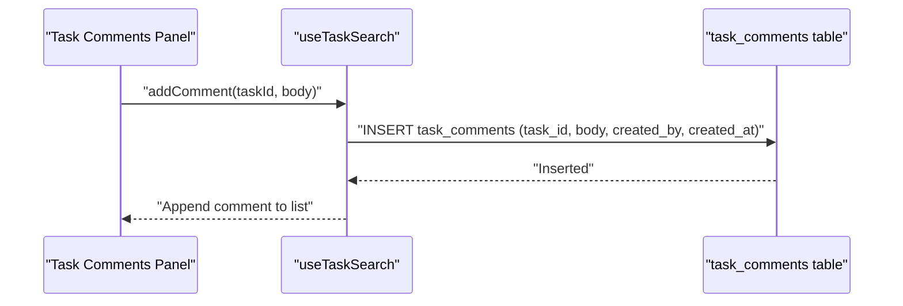

**Diagram sources**
- [useTaskSearch.ts](file://src/hooks/useTaskSearch.ts)
- [database-unified-tasks.sql](file://src/database-unified-tasks.sql)

**Section sources**
- [useTaskSearch.ts](file://src/hooks/useTaskSearch.ts)
- [database-unified-tasks.sql](file://src/database-unified-tasks.sql)

### Tracking Time Spent
Time logs record effort per task:
- Entries include duration, start/end times, and author.
- Totals can be aggregated for reporting and analytics.
- Time logs integrate with progress analytics dashboards.

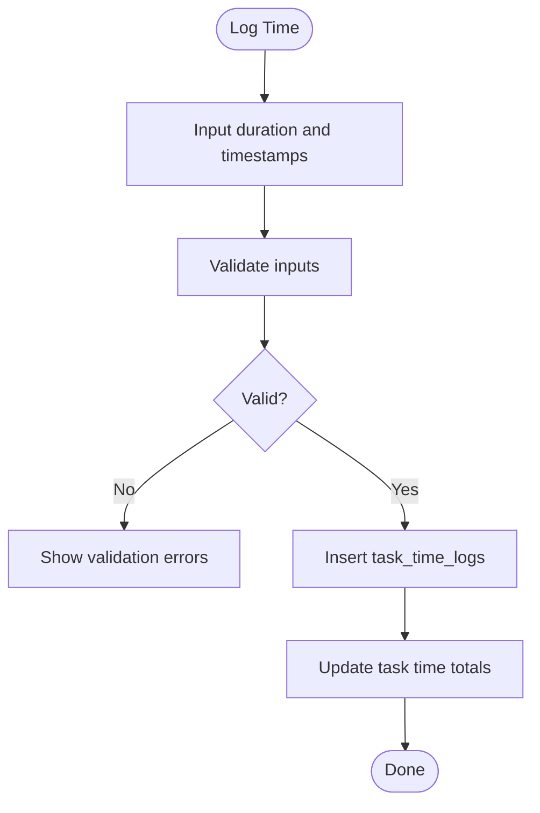

**Diagram sources**
- [useTaskSearch.ts](file://src/hooks/useTaskSearch.ts)
- [database-unified-tasks.sql](file://src/database-unified-tasks.sql)

**Section sources**
- [useTaskSearch.ts](file://src/hooks/useTaskSearch.ts)
- [database-unified-tasks.sql](file://src/database-unified-tasks.sql)

### Audit Trails and Change History
Audit logging captures critical changes:
- Records entity type, field changed, old/new values, actor, and timestamp.
- Enables compliance and debugging.
- Integrates with history panels in task details.

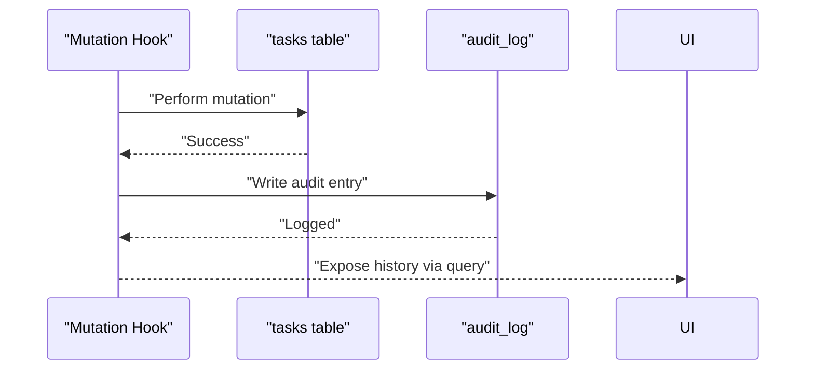

**Diagram sources**
- [database-project-tasks.sql](file://src/database-project-tasks.sql)
- [database-tasks-fix.sql](file://src/database-tasks-fix.sql)

**Section sources**
- [database-project-tasks.sql](file://src/database-project-tasks.sql)
- [database-tasks-fix.sql](file://src/database-tasks-fix.sql)

### Progress Analytics Integration
Analytics surfaces derived metrics:
- Task completion rate over time.
- Average time-to-complete by status.
- Milestone adherence and delays.
- Time spent vs planned estimates.

Integration points:
- Queries aggregate task statuses and timestamps.
- Milestone completion feeds into progress curves.
- Time logs feed into productivity metrics.

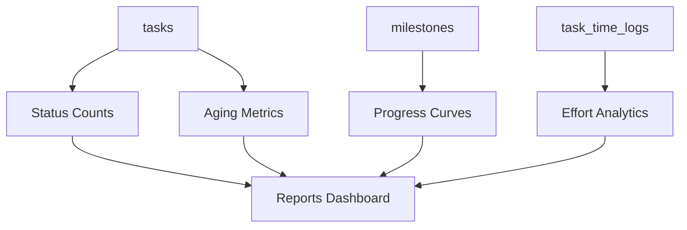

**Diagram sources**
- [database-project-tasks.sql](file://src/database-project-tasks.sql)
- [database-unified-tasks.sql](file://src/database-unified-tasks.sql)
- [database-tasks-migration.sql](file://src/database-tasks-migration.sql)

**Section sources**
- [database-project-tasks.sql](file://src/database-project-tasks.sql)
- [database-unified-tasks.sql](file://src/database-unified-tasks.sql)
- [database-tasks-migration.sql](file://src/database-tasks-migration.sql)

## Dependency Analysis
Key dependencies between components:
- TasksPage and components/tasks depend on hooks for data access.
- Hooks depend on database schema defined in migrations.
- Audit log depends on mutations performed through hooks.

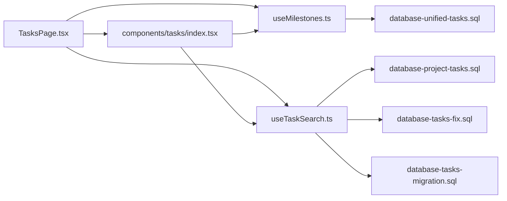

**Diagram sources**
- [TasksPage.tsx](file://src/pages/TasksPage.tsx)
- [components/tasks/index.tsx](file://src/components/tasks/index.tsx)
- [useMilestones.ts](file://src/hooks/useMilestones.ts)
- [useTaskSearch.ts](file://src/hooks/useTaskSearch.ts)
- [database-project-tasks.sql](file://src/database-project-tasks.sql)
- [database-unified-tasks.sql](file://src/database-unified-tasks.sql)
- [database-tasks-fix.sql](file://src/database-tasks-fix.sql)
- [database-tasks-migration.sql](file://src/database-tasks-migration.sql)

**Section sources**
- [TasksPage.tsx](file://src/pages/TasksPage.tsx)
- [components/tasks/index.tsx](file://src/components/tasks/index.tsx)
- [useMilestones.ts](file://src/hooks/useMilestones.ts)
- [useTaskSearch.ts](file://src/hooks/useTaskSearch.ts)
- [database-project-tasks.sql](file://src/database-project-tasks.sql)
- [database-unified-tasks.sql](file://src/database-unified-tasks.sql)
- [database-tasks-fix.sql](file://src/database-tasks-fix.sql)
- [database-tasks-migration.sql](file://src/database-tasks-migration.sql)

## Performance Considerations
- Use efficient queries and indexes on frequently filtered columns (status, assignee, project_id).
- Cache task lists and milestone data to reduce network overhead.
- Batch updates where possible to minimize round trips.
- Paginate large task lists and comments to improve rendering performance.
- Avoid recomputing progress unnecessarily; debounce updates when multiple changes occur rapidly.

## Troubleshooting Guide
Common issues and resolutions:
- Invalid status transitions:
  - Validate allowed transitions before persisting changes.
  - Surface clear error messages indicating valid next steps.
- Missing completion prerequisites:
  - Enforce required milestones and fields prior to completion.
  - Provide guidance to users on what is missing.
- Audit log gaps:
  - Ensure every mutation writes an audit entry.
  - Verify audit log permissions and write paths.
- Time log inconsistencies:
  - Validate duration and timestamps.
  - Reconcile totals after bulk imports or edits.

**Section sources**
- [useTaskSearch.ts](file://src/hooks/useTaskSearch.ts)
- [useMilestones.ts](file://src/hooks/useMilestones.ts)
- [database-project-tasks.sql](file://src/database-project-tasks.sql)
- [database-tasks-fix.sql](file://src/database-tasks-fix.sql)

## Conclusion
The task progress tracking system provides robust state management, milestone-driven progress calculation, comprehensive audit trails, and analytics-ready data structures. By adhering to defined state transitions and leveraging hooks for data access, teams can reliably update task status, mark completion, add progress comments, and track time spent while maintaining full visibility into change history and performance metrics.