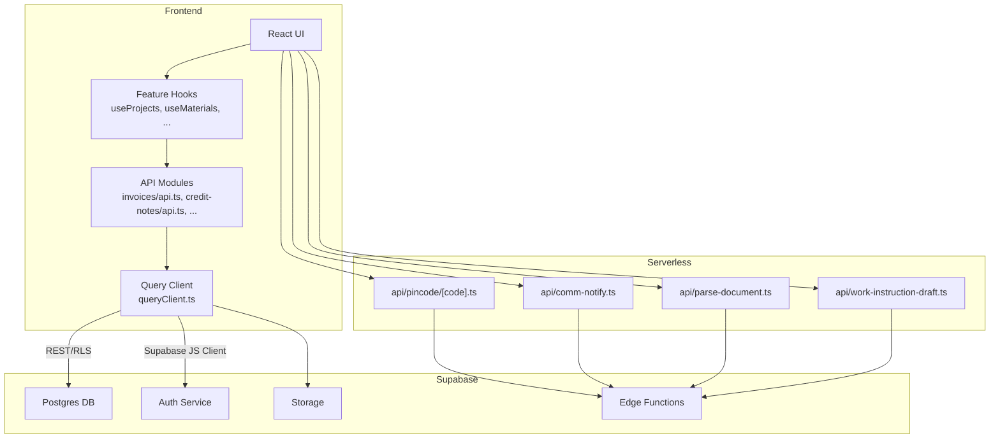
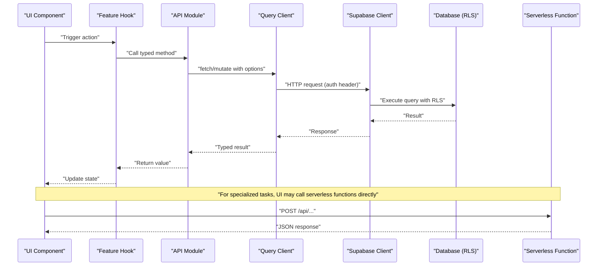
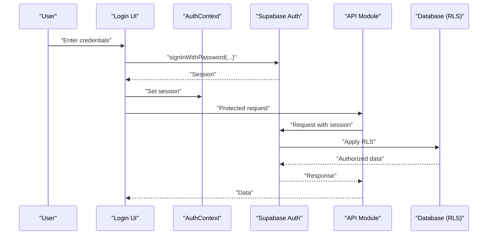
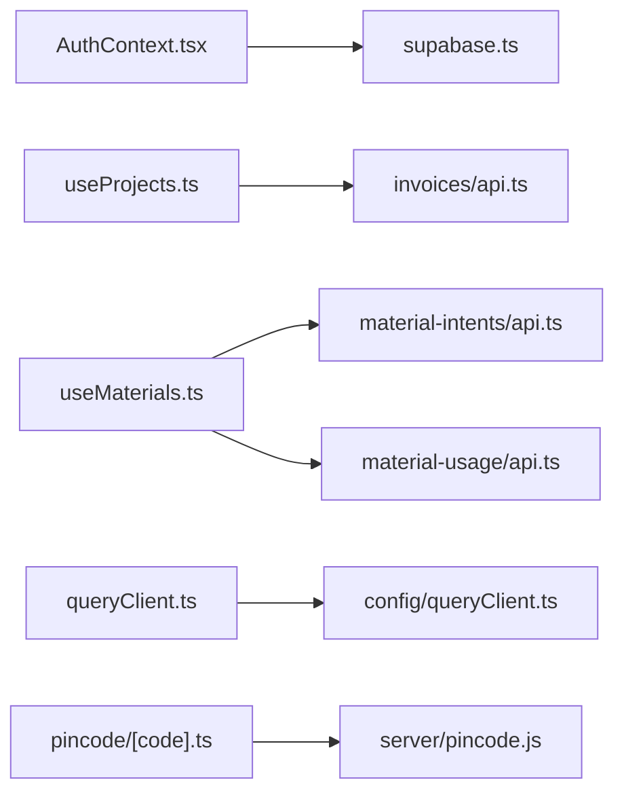

# REST API Endpoints

<cite>
**Referenced Files in This Document**
- [api.ts](file://src/api.ts)
- [supabase.ts](file://src/supabase.ts)
- [AuthContext.tsx](file://src/contexts/AuthContext.tsx)
- [useProjects.ts](file://src/hooks/useProjects.ts)
- [useMaterials.ts](file://src/hooks/useMaterials.ts)
- [invoices/api.ts](file://src/invoices/api.ts)
- [credit-notes/api.ts](file://src/credit-notes/api.ts)
- [material-intents/api.ts](file://src/material-intents/api.ts)
- [material-usage/api.ts](file://src/material-usage/api.ts)
- [ledger/api.ts](file://src/ledger/api.ts)
- [approvals/api.ts](file://src/approvals/api.ts)
- [follow-up/api.ts](file://src/follow-up/api.ts)
- [conversions/api.ts](file://src/conversions/api.ts)
- [pincode/[code].ts](file://api/pincode/[code].ts)
- [comm-notify.ts](file://api/comm-notify.ts)
- [parse-document.ts](file://api/parse-document.ts)
- [work-instruction-draft.ts](file://api/work-instruction-draft.ts)
- [server/pincode.js](file://server/pincode.js)
- [queryClient.ts](file://src/queryClient.ts)
- [config/queryClient.ts](file://src/config/queryClient.ts)
</cite>

## Table of Contents
1. [Introduction](#introduction)
2. [Project Structure](#project-structure)
3. [Core Components](#core-components)
4. [Architecture Overview](#architecture-overview)
5. [Detailed Component Analysis](#detailed-component-analysis)
6. [Dependency Analysis](#dependency-analysis)
7. [Performance Considerations](#performance-considerations)
8. [Troubleshooting Guide](#troubleshooting-guide)
9. [Conclusion](#conclusion)
10. [Appendices](#appendices)

## Introduction
This document provides comprehensive REST API documentation for the MEP Project ERP system. It covers HTTP endpoints, Supabase REST integration patterns, query parameters, filtering, pagination, authentication, TypeScript client usage, error handling, retry mechanisms, rate limiting, caching strategies, and performance optimization. Practical examples are included for material management, project updates, invoice processing, and user authentication. The guide also addresses API versioning, backward compatibility, and migration guidance.

## Project Structure
The application is a frontend-heavy SPA that primarily interacts with Supabase via its JavaScript client and exposes a small set of serverless functions for specialized tasks. Key areas:
- Shared API client and Supabase configuration
- Feature-scoped API modules (projects, materials, invoices, credit notes, approvals, etc.)
- Serverless functions for edge operations (pincode lookup, communication notifications, document parsing, work instruction drafts)
- React Query-based data fetching and caching

**Diagram sources**
- [api.ts](file://src/api.ts)
- [supabase.ts](file://src/supabase.ts)
- [queryClient.ts](file://src/queryClient.ts)
- [config/queryClient.ts](file://src/config/queryClient.ts)
- [invoices/api.ts](file://src/invoices/api.ts)
- [credit-notes/api.ts](file://src/credit-notes/api.ts)
- [material-intents/api.ts](file://src/material-intents/api.ts)
- [material-usage/api.ts](file://src/material-usage/api.ts)
- [ledger/api.ts](file://src/ledger/api.ts)
- [approvals/api.ts](file://src/approvals/api.ts)
- [follow-up/api.ts](file://src/follow-up/api.ts)
- [conversions/api.ts](file://src/conversions/api.ts)
- [pincode/[code].ts](file://api/pincode/[code].ts)
- [comm-notify.ts](file://api/comm-notify.ts)
- [parse-document.ts](file://api/parse-document.ts)
- [work-instruction-draft.ts](file://api/work-instruction-draft.ts)

**Section sources**
- [api.ts](file://src/api.ts)
- [supabase.ts](file://src/supabase.ts)
- [queryClient.ts](file://src/queryClient.ts)
- [config/queryClient.ts](file://src/config/queryClient.ts)

## Core Components
- Authentication context and session management
- Supabase client initialization and configuration
- Feature-scoped API modules encapsulating CRUD operations
- React Query client for caching, retries, and background refetching
- Serverless functions for specialized integrations

Key responsibilities:
- Centralize auth state and token propagation
- Provide typed helpers for Supabase queries and mutations
- Implement consistent error handling and retry policies
- Expose clear interfaces for UI hooks to consume

**Section sources**
- [AuthContext.tsx](file://src/contexts/AuthContext.tsx)
- [supabase.ts](file://src/supabase.ts)
- [queryClient.ts](file://src/queryClient.ts)
- [config/queryClient.ts](file://src/config/queryClient.ts)

## Architecture Overview
The system uses a layered approach:
- UI layer calls feature hooks
- Hooks call API modules
- API modules use the Supabase client or fetch wrappers
- Supabase enforces Row-Level Security (RLS) and business logic via database policies and functions
- Serverless functions handle external integrations and heavy processing

**Diagram sources**
- [useProjects.ts](file://src/hooks/useProjects.ts)
- [invoices/api.ts](file://src/invoices/api.ts)
- [supabase.ts](file://src/supabase.ts)
- [queryClient.ts](file://src/queryClient.ts)
- [pincode/[code].ts](file://api/pincode/[code].ts)

## Detailed Component Analysis

### Authentication and Authorization
- Session and user context are provided by the auth context component
- Supabase client is configured centrally and used across API modules
- RLS policies enforce row-level access at the database level

Typical flow:
- User logs in via Supabase Auth
- Session stored and propagated to subsequent requests
- API calls include session tokens automatically via Supabase client

**Diagram sources**
- [AuthContext.tsx](file://src/contexts/AuthContext.tsx)
- [supabase.ts](file://src/supabase.ts)
- [invoices/api.ts](file://src/invoices/api.ts)

**Section sources**
- [AuthContext.tsx](file://src/contexts/AuthContext.tsx)
- [supabase.ts](file://src/supabase.ts)

### Projects API
- Primary operations: list, get, create, update, delete projects
- Filtering by organization, status, date ranges
- Pagination via limit and offset or cursor-based if supported by schema

Example operations:
- GET /projects?org_id=...&status=active&limit=50&offset=0
- POST /projects with body { name, description, org_id, ... }
- PUT /projects/:id with partial update fields
- DELETE /projects/:id

Type safety:
- Use typed schemas from feature types
- Ensure consistent field names across requests/responses

Error handling:
- Normalize network errors and validation failures
- Surface user-friendly messages

**Section sources**
- [useProjects.ts](file://src/hooks/useProjects.ts)
- [supabase.ts](file://src/supabase.ts)

### Materials API
- Operations: list items, create/update items, manage units, stock adjustments
- Filtering by category, warehouse, availability
- Bulk operations where applicable

Common endpoints:
- GET /materials?category=...&warehouse=...&available=true
- POST /materials
- PUT /materials/:id
- PATCH /materials/:id/stock-adjustment

Pagination and sorting:
- Support limit, offset, sort_by, order direction

**Section sources**
- [useMaterials.ts](file://src/hooks/useMaterials.ts)
- [material-intents/api.ts](file://src/material-intents/api.ts)
- [material-usage/api.ts](file://src/material-usage/api.ts)

### Invoices API
- Create, read, update, delete invoices
- Link invoices to projects and purchase orders
- Generate PDFs and export formats

Endpoints:
- GET /invoices?project_id=...&status=paid
- POST /invoices with line items and totals
- PUT /invoices/:id
- DELETE /invoices/:id
- GET /invoices/:id/pdf

Status transitions:
- Draft -> Sent -> Paid
- Cancellation and credit note linkage

**Section sources**
- [invoices/api.ts](file://src/invoices/api.ts)

### Credit Notes API
- Create credit notes linked to invoices
- Adjust balances and inventory impacts
- Audit trail for reversals

Endpoints:
- POST /credit-notes
- GET /credit-notes?invoice_id=...
- PUT /credit-notes/:id
- DELETE /credit-notes/:id

**Section sources**
- [credit-notes/api.ts](file://src/credit-notes/api.ts)

### Approvals API
- Submit approval workflows
- Approve/reject actions with comments
- Track audit logs

Endpoints:
- POST /approvals
- GET /approvals?entity_type=...&entity_id=...
- POST /approvals/process-action with payload { action, comment }

**Section sources**
- [approvals/api.ts](file://src/approvals/api.ts)

### Follow-up and Leads API
- Manage follow-ups and leads lifecycle
- Assignees, statuses, reminders

Endpoints:
- GET /follow-ups?assignee=...&status=open
- POST /follow-ups
- PUT /follow-ups/:id
- GET /leads?source=...

**Section sources**
- [follow-up/api.ts](file://src/follow-up/api.ts)

### Ledger API
- View financial ledgers and transactions
- Filters by account, date range, entity type

Endpoints:
- GET /ledger?account=...&from_date=...&to_date=...
- POST /ledger/entries
- GET /ledger/summary?group_by=month

**Section sources**
- [ledger/api.ts](file://src/ledger/api.ts)

### Conversions API
- Convert quotations to invoices or other documents
- Maintain lineage and auditability

Endpoints:
- POST /conversions?type=quotation_to_invoice
- GET /conversions?source_id=...

**Section sources**
- [conversions/api.ts](file://src/conversions/api.ts)

### Serverless Functions
Specialized operations exposed as REST endpoints:
- Pincode lookup: GET /api/pincode/{code}
- Communication notifications: POST /api/comm-notify
- Document parsing: POST /api/parse-document
- Work instruction draft: POST /api/work-instruction-draft

These functions integrate with external services or perform heavy processing off the main thread.

**Section sources**
- [pincode/[code].ts](file://api/pincode/[code].ts)
- [comm-notify.ts](file://api/comm-notify.ts)
- [parse-document.ts](file://api/parse-document.ts)
- [work-instruction-draft.ts](file://api/work-instruction-draft.ts)
- [server/pincode.js](file://server/pincode.js)

## Dependency Analysis
- API modules depend on the Supabase client for authenticated requests
- React Query client centralizes caching, retries, and background updates
- Feature hooks encapsulate domain-specific logic and compose API modules
- Serverless functions are independent but may rely on environment variables and secrets

**Diagram sources**
- [AuthContext.tsx](file://src/contexts/AuthContext.tsx)
- [supabase.ts](file://src/supabase.ts)
- [useProjects.ts](file://src/hooks/useProjects.ts)
- [useMaterials.ts](file://src/hooks/useMaterials.ts)
- [invoices/api.ts](file://src/invoices/api.ts)
- [material-intents/api.ts](file://src/material-intents/api.ts)
- [material-usage/api.ts](file://src/material-usage/api.ts)
- [queryClient.ts](file://src/queryClient.ts)
- [config/queryClient.ts](file://src/config/queryClient.ts)
- [pincode/[code].ts](file://api/pincode/[code].ts)
- [server/pincode.js](file://server/pincode.js)

**Section sources**
- [queryClient.ts](file://src/queryClient.ts)
- [config/queryClient.ts](file://src/config/queryClient.ts)

## Performance Considerations
- Use React Query caching to avoid redundant network calls
- Implement optimistic updates for fast UI feedback
- Apply pagination and selective field projection to reduce payload sizes
- Debounce search inputs and filter changes
- Batch mutations where possible
- Leverage Supabase indexes and RLS policies to minimize server load
- Cache static assets and templates at CDN level

[No sources needed since this section provides general guidance]

## Troubleshooting Guide
Common issues and resolutions:
- Authentication failures: verify session validity and token refresh
- Network errors: implement retry with exponential backoff
- Validation errors: normalize error responses and display actionable messages
- Rate limiting: respect server headers and back off accordingly
- Data inconsistencies: check RLS policies and audit logs

Operational tips:
- Log request IDs and timestamps for tracing
- Use structured logging for API calls
- Monitor cache hit ratios and stale-while-revalidate behavior

**Section sources**
- [queryClient.ts](file://src/queryClient.ts)
- [config/queryClient.ts](file://src/config/queryClient.ts)

## Conclusion
The MEP Project ERP system leverages Supabase for secure, scalable data access with strong RLS enforcement. The frontend uses typed API modules and React Query for robust data synchronization, caching, and error handling. Serverless functions extend capabilities for specialized tasks. Following the patterns outlined here ensures consistency, reliability, and maintainability across features.

[No sources needed since this section summarizes without analyzing specific files]

## Appendices

### Authentication Requirements
- All protected endpoints require a valid Supabase session
- Include session token automatically via Supabase client
- For serverless functions, pass appropriate headers as required by function implementation

### Request/Response Schemas
- Use TypeScript types defined in feature modules for request/response payloads
- Validate inputs on both client and server sides
- Return standardized error objects with codes and messages

### Query Parameters, Filtering, and Pagination
- Common params: limit, offset, sort_by, order
- Filter by entity attributes using URL query strings
- Prefer cursor-based pagination for large datasets when available

### Error Handling and Retry Mechanisms
- Implement retry with exponential backoff for transient errors
- Distinguish between client and server errors
- Surface meaningful messages to users

### Rate Limiting Policies
- Respect server-provided rate limits
- Implement client-side throttling for high-frequency operations
- Use caching to reduce repeated requests

### Caching Strategies
- Enable React Query caching with appropriate stale times
- Use background refetching for critical data
- Invalidate caches on mutations to keep UI consistent

### API Versioning and Backward Compatibility
- Version APIs via path prefix (e.g., /v1/) when necessary
- Deprecate endpoints gradually with migration guides
- Maintain backward-compatible responses during transition periods

### Migration Guides
- Document breaking changes and new fields
- Provide scripts or instructions for data migrations
- Communicate deprecation timelines and alternatives

[No sources needed since this section provides general guidance]