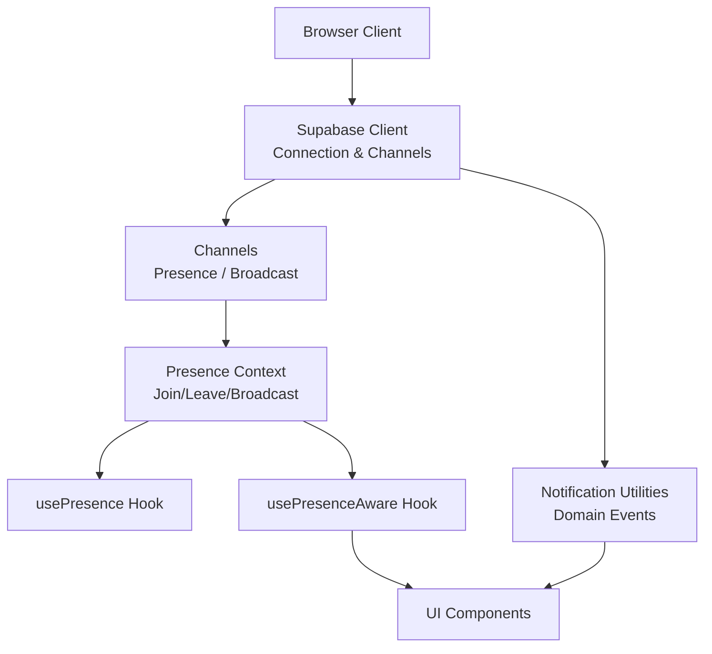
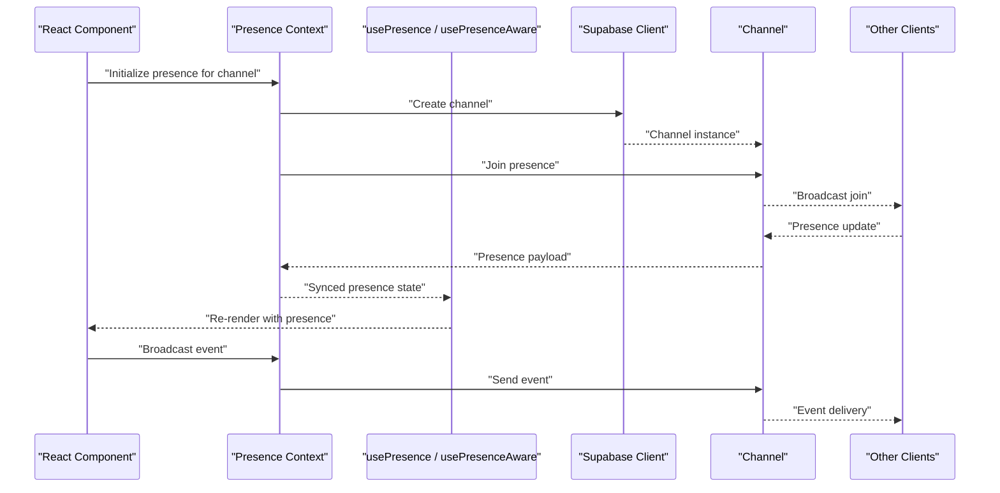
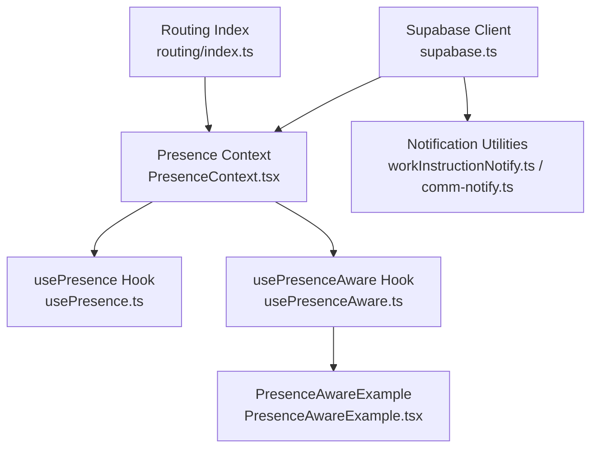

# Real-time WebSocket API

<cite>
**Referenced Files in This Document**
- [supabase.ts](file://src/supabase.ts)
- [PresenceContext.tsx](file://src/contexts/PresenceContext.tsx)
- [usePresence.ts](file://src/hooks/usePresence.ts)
- [usePresenceAware.ts](file://src/hooks/usePresenceAware.ts)
- [PresenceAwareExample.tsx](file://src/examples/PresenceAwareExample.tsx)
- [workInstructionNotify.ts](file://src/lib/workInstructionNotify.ts)
- [comm-notify.ts](file://api/comm-notify.ts)
- [index.ts](file://src/app/routing/index.ts)
</cite>

## Table of Contents
1. [Introduction](#introduction)
2. [Project Structure](#project-structure)
3. [Core Components](#core-components)
4. [Architecture Overview](#architecture-overview)
5. [Detailed Component Analysis](#detailed-component-analysis)
6. [Dependency Analysis](#dependency-analysis)
7. [Performance Considerations](#performance-considerations)
8. [Troubleshooting Guide](#troubleshooting-guide)
9. [Conclusion](#conclusion)
10. [Appendices](#appendices)

## Introduction
This document provides detailed API documentation for real-time communication endpoints using Supabase Realtime within the application. It covers connection establishment, channel subscriptions, event broadcasting patterns, presence awareness features, collaborative editing synchronization, and conflict resolution mechanisms. It also defines message formats, event types, error handling strategies, and includes examples for implementing real-time notifications, live collaboration features, and status updates across connected clients.

The implementation leverages a centralized Supabase client to manage connections and channels, with hooks and contexts providing presence-aware capabilities and utilities for notifications and cross-tab activity.

## Project Structure
Real-time functionality is implemented primarily through:
- A shared Supabase client that initializes the Realtime transport and exposes helpers for channel management.
- Presence context and hooks that encapsulate presence lifecycle (join, leave, broadcast).
- Notification utilities for emitting and listening to domain-specific events.
- Example components demonstrating presence usage.

[No sources needed since this diagram shows conceptual workflow, not actual code structure]

## Core Components
- Supabase client initialization and configuration for Realtime connectivity.
- Presence context providing join/leave/broadcast semantics and state synchronization.
- Hooks for consuming presence data and awareness signals in React components.
- Notification utilities for emitting and subscribing to custom events.

Key responsibilities:
- Connection management: Establish and maintain a persistent Realtime connection.
- Channel subscriptions: Subscribe to channels scoped by resource or feature.
- Presence tracking: Track active users and their metadata per channel.
- Event broadcasting: Emit and receive typed messages across clients.
- Error handling: Reconnect on failures, surface errors to consumers.

**Section sources**
- [supabase.ts](file://src/supabase.ts)
- [PresenceContext.tsx](file://src/contexts/PresenceContext.tsx)
- [usePresence.ts](file://src/hooks/usePresence.ts)
- [usePresenceAware.ts](file://src/hooks/usePresenceAware.ts)
- [workInstructionNotify.ts](file://src/lib/workInstructionNotify.ts)
- [comm-notify.ts](file://api/comm-notify.ts)

## Architecture Overview
The system uses a layered approach:
- Transport layer: Supabase Realtime client manages WebSocket connections.
- Channel layer: Feature-scoped channels handle presence and broadcasts.
- Application layer: Presence context and hooks expose APIs to components.
- Domain layer: Notification utilities emit and listen to business events.

**Diagram sources**
- [PresenceContext.tsx](file://src/contexts/PresenceContext.tsx)
- [usePresence.ts](file://src/hooks/usePresence.ts)
- [usePresenceAware.ts](file://src/hooks/usePresenceAware.ts)
- [supabase.ts](file://src/supabase.ts)

## Detailed Component Analysis

### Supabase Client and Channel Management
Responsibilities:
- Initialize Supabase client with Realtime configuration.
- Provide helper functions to create and manage channels.
- Centralize error handling and reconnection logic.

Usage patterns:
- Create a channel scoped by resource ID or feature name.
- Attach presence listeners and broadcast handlers.
- Ensure cleanup on unmount to prevent leaks.

**Section sources**
- [supabase.ts](file://src/supabase.ts)

### Presence Context
Responsibilities:
- Manage presence lifecycle: join, leave, broadcast.
- Maintain local presence state and synchronize with remote peers.
- Expose methods for joining channels and broadcasting events.

Data model:
- Presence map keyed by user/session identifiers.
- Metadata attached to each presence entry (e.g., user info, cursor position).

Lifecycle:
- On mount: Join presence for the specified channel.
- On update: Broadcast changes if necessary.
- On unmount: Leave presence and clean up listeners.

**Section sources**
- [PresenceContext.tsx](file://src/contexts/PresenceContext.tsx)

### Presence Hooks
- usePresence: Provides access to presence state and actions for a given channel.
- usePresenceAware: Offers awareness signals such as active editors and cursors.

Integration:
- Consume presence state in components to render collaborators.
- Use awareness signals to implement collaborative editing features.

**Section sources**
- [usePresence.ts](file://src/hooks/usePresence.ts)
- [usePresenceAware.ts](file://src/hooks/usePresenceAware.ts)

### Notification Utilities
Responsibilities:
- Emit domain-specific events (e.g., work instruction updates, communication notifications).
- Subscribe to events and route them to appropriate handlers.

Patterns:
- Define event schemas for consistency.
- Use channel names aligned with resources (e.g., work-instruction:{id}).

**Section sources**
- [workInstructionNotify.ts](file://src/lib/workInstructionNotify.ts)
- [comm-notify.ts](file://api/comm-notify.ts)

### Example Usage
PresenceAwareExample demonstrates how to integrate presence into a component:
- Initialize presence for a channel.
- Render collaborator indicators based on presence state.
- Handle leave events gracefully.

**Section sources**
- [PresenceAwareExample.tsx](file://src/examples/PresenceAwareExample.tsx)

### Routing Integration
Routing index may initialize real-time modules or register presence-aware routes.

**Section sources**
- [index.ts](file://src/app/routing/index.ts)

## Dependency Analysis
The following diagram illustrates dependencies among core real-time components:

**Diagram sources**
- [supabase.ts](file://src/supabase.ts)
- [PresenceContext.tsx](file://src/contexts/PresenceContext.tsx)
- [usePresence.ts](file://src/hooks/usePresence.ts)
- [usePresenceAware.ts](file://src/hooks/usePresenceAware.ts)
- [workInstructionNotify.ts](file://src/lib/workInstructionNotify.ts)
- [comm-notify.ts](file://api/comm-notify.ts)
- [PresenceAwareExample.tsx](file://src/examples/PresenceAwareExample.tsx)
- [index.ts](file://src/app/routing/index.ts)

**Section sources**
- [supabase.ts](file://src/supabase.ts)
- [PresenceContext.tsx](file://src/contexts/PresenceContext.tsx)
- [usePresence.ts](file://src/hooks/usePresence.ts)
- [usePresenceAware.ts](file://src/hooks/usePresenceAware.ts)
- [workInstructionNotify.ts](file://src/lib/workInstructionNotify.ts)
- [comm-notify.ts](file://api/comm-notify.ts)
- [PresenceAwareExample.tsx](file://src/examples/PresenceAwareExample.tsx)
- [index.ts](file://src/app/routing/index.ts)

## Performance Considerations
- Minimize channel scope: Use specific channel names per resource to reduce broadcast volume.
- Debounce heavy broadcasts: For frequent updates (e.g., cursor movement), debounce before sending.
- Coalesce presence updates: Batch presence changes to avoid excessive re-renders.
- Clean up listeners: Always unsubscribe on unmount to prevent memory leaks.
- Prefer lightweight payloads: Keep presence metadata minimal; attach only essential fields.

[No sources needed since this section provides general guidance]

## Troubleshooting Guide
Common issues and strategies:
- Connection failures: Implement exponential backoff and retry logic; log errors for diagnostics.
- Duplicate presence entries: Ensure unique session IDs and proper leave handling.
- Stale state: Periodically reconcile presence state with server; force refresh on reconnect.
- Event ordering: Use timestamps or sequence numbers to order events when necessary.
- Cross-tab conflicts: Use optimistic updates with conflict resolution via last-write-wins or operational transforms.

Error handling patterns:
- Wrap channel operations in try/catch blocks.
- Surface actionable errors to UI (e.g., “Reconnecting…”).
- Log structured error details including channel name and event type.

**Section sources**
- [PresenceContext.tsx](file://src/contexts/PresenceContext.tsx)
- [usePresence.ts](file://src/hooks/usePresence.ts)
- [usePresenceAware.ts](file://src/hooks/usePresenceAware.ts)
- [workInstructionNotify.ts](file://src/lib/workInstructionNotify.ts)
- [comm-notify.ts](file://api/comm-notify.ts)

## Conclusion
The real-time architecture leverages Supabase Realtime to provide robust presence awareness and event broadcasting. The presence context and hooks abstract complexity, enabling components to focus on user experience. Notification utilities support domain-specific messaging, while example implementations guide integration. By adhering to best practices around scoping, debouncing, and cleanup, the system remains performant and reliable under load.

[No sources needed since this section summarizes without analyzing specific files]

## Appendices

### Message Formats and Event Types
- Presence events:
  - join: Emitted when a client joins a channel.
  - leave: Emitted when a client leaves a channel.
  - sync: Full presence state reconciliation after reconnect.
- Broadcast events:
  - Custom domain events (e.g., work-instruction-updated, communication-notified).
  - Payloads should include resource identifiers, actor metadata, and timestamps.

Recommendations:
- Define strict JSON schemas for all events.
- Include versioning fields to evolve payloads safely.
- Use correlation IDs to trace related events across clients.

[No sources needed since this section provides general guidance]

### Collaborative Editing Synchronization
Patterns:
- Optimistic updates: Apply local changes immediately, then confirm with server.
- Conflict resolution:
  - Last-write-wins for non-critical fields.
  - Operational transforms or CRDTs for complex content edits.
- Cursor and selection sharing:
  - Broadcast cursor positions with throttling.
  - Display remote cursors with user colors and names.

[No sources needed since this section provides general guidance]

### Examples for Real-time Notifications, Live Collaboration, and Status Updates
- Real-time notifications:
  - Emit notification events on relevant resource changes.
  - Subscribe to notification channels and display in-app alerts.
- Live collaboration:
  - Use presence to show active collaborators.
  - Broadcast edit deltas and merge on server.
- Status updates:
  - Publish status transitions via broadcast events.
  - Reflect changes instantly across clients.

[No sources needed since this section provides general guidance]