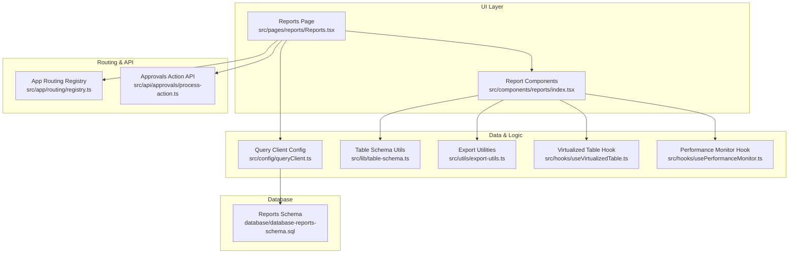
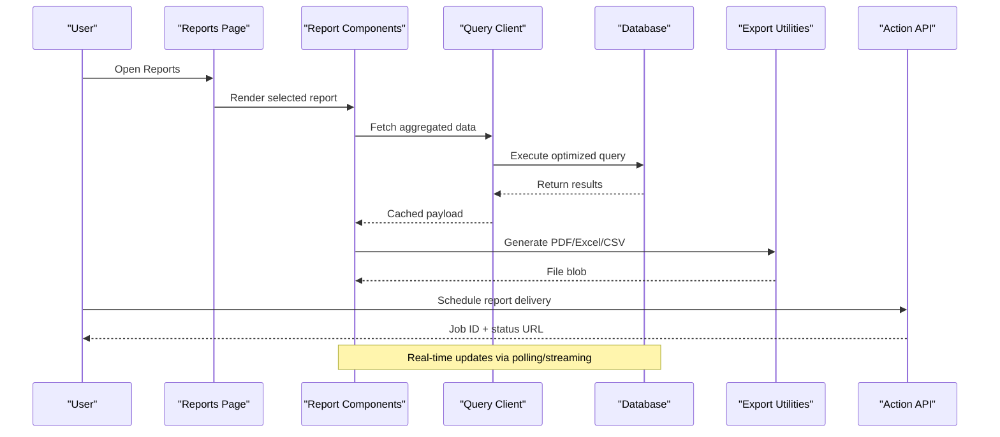
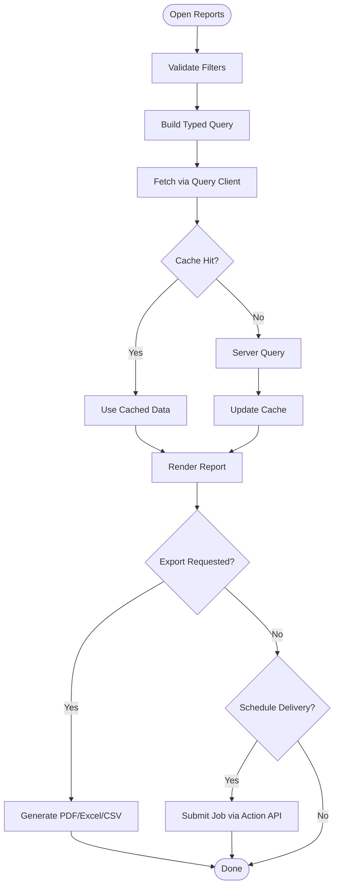
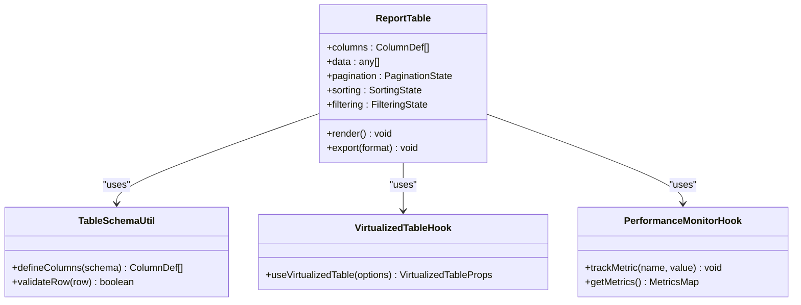
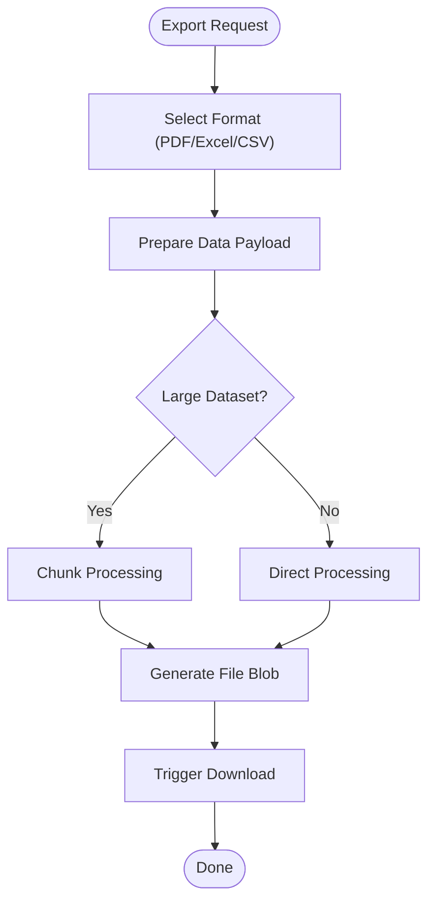
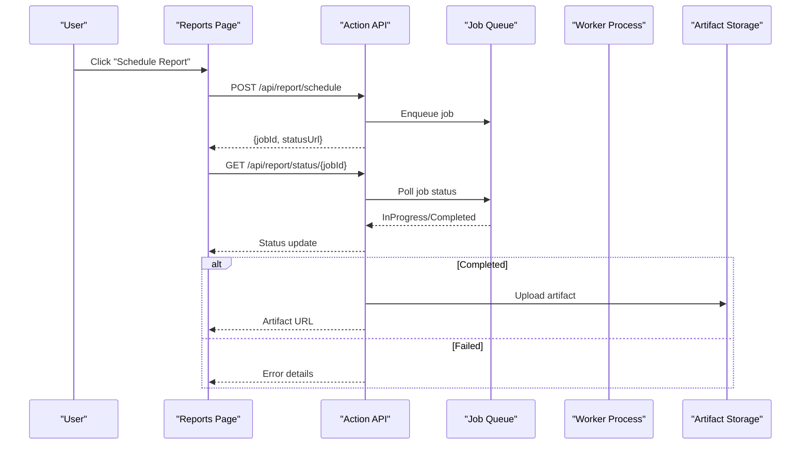
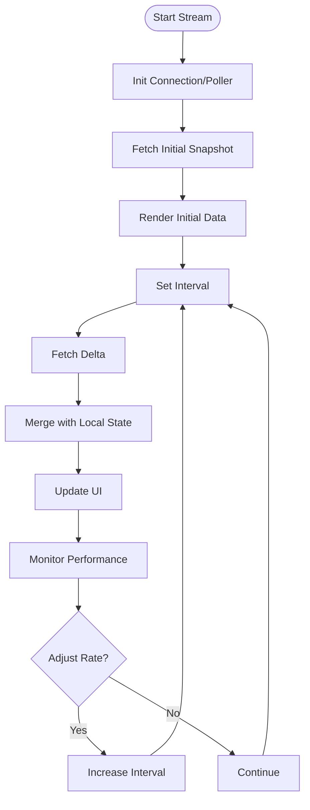
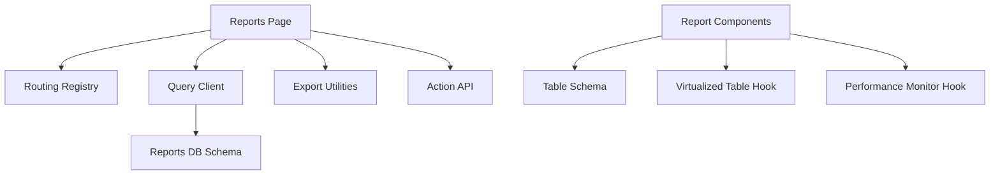

# Reports & Analytics API

<cite>
**Referenced Files in This Document**
- [src/pages/reports/Reports.tsx](file://src/pages/reports/Reports.tsx)
- [src/components/reports/index.tsx](file://src/components/reports/index.tsx)
- [src/hooks/usePerformanceMonitor.ts](file://src/hooks/usePerformanceMonitor.ts)
- [src/hooks/useVirtualizedTable.ts](file://src/hooks/useVirtualizedTable.ts)
- [src/lib/table-schema.ts](file://src/lib/table-schema.ts)
- [src/utils/export-utils.ts](file://src/utils/export-utils.ts)
- [src/api/approvals/process-action.ts](file://src/api/approvals/process-action.ts)
- [src/app/routing/registry.ts](file://src/app/routing/registry.ts)
- [src/config/queryClient.ts](file://src/config/queryClient.ts)
- [database/database-reports-schema.sql](file://database/database-reports-schema.sql)
</cite>

## Table of Contents
1. [Introduction](#introduction)
2. [Project Structure](#project-structure)
3. [Core Components](#core-components)
4. [Architecture Overview](#architecture-overview)
5. [Detailed Component Analysis](#detailed-component-analysis)
6. [Dependency Analysis](#dependency-analysis)
7. [Performance Considerations](#performance-considerations)
8. [Troubleshooting Guide](#troubleshooting-guide)
9. [Conclusion](#conclusion)
10. [Appendices](#appendices)

## Introduction
This document provides comprehensive API documentation for reporting and analytics endpoints within the application. It covers pre-built report generation, custom query execution, dashboard data aggregation, export capabilities (PDF, Excel, CSV), scheduled report delivery, and real-time analytics streaming. It also details performance optimization techniques for large dataset queries, caching strategies, and result pagination, along with examples for common business reports and custom analytics implementations.

## Project Structure
The reporting and analytics features are implemented across UI pages, reusable components, hooks, utilities, and database schema definitions:
- Pages: Top-level report entry points and dashboards
- Components: Reusable report widgets and table integrations
- Hooks: Performance monitoring and virtualization for large datasets
- Utilities: Export helpers and table schema definitions
- Database: Report-related schema definitions and indexes

**Diagram sources**
- [src/pages/reports/Reports.tsx](file://src/pages/reports/Reports.tsx)
- [src/components/reports/index.tsx](file://src/components/reports/index.tsx)
- [src/config/queryClient.ts](file://src/config/queryClient.ts)
- [src/lib/table-schema.ts](file://src/lib/table-schema.ts)
- [src/utils/export-utils.ts](file://src/utils/export-utils.ts)
- [src/hooks/useVirtualizedTable.ts](file://src/hooks/useVirtualizedTable.ts)
- [src/hooks/usePerformanceMonitor.ts](file://src/hooks/usePerformanceMonitor.ts)
- [src/app/routing/registry.ts](file://src/app/routing/registry.ts)
- [src/api/approvals/process-action.ts](file://src/api/approvals/process-action.ts)
- [database/database-reports-schema.sql](file://database/database-reports-schema.sql)

**Section sources**
- [src/pages/reports/Reports.tsx](file://src/pages/reports/Reports.tsx)
- [src/components/reports/index.tsx](file://src/components/reports/index.tsx)
- [src/config/queryClient.ts](file://src/config/queryClient.ts)
- [src/lib/table-schema.ts](file://src/lib/table-schema.ts)
- [src/utils/export-utils.ts](file://src/utils/export-utils.ts)
- [src/hooks/useVirtualizedTable.ts](file://src/hooks/useVirtualizedTable.ts)
- [src/hooks/usePerformanceMonitor.ts](file://src/hooks/usePerformanceMonitor.ts)
- [src/app/routing/registry.ts](file://src/app/routing/registry.ts)
- [src/api/approvals/process-action.ts](file://src/api/approvals/process-action.ts)
- [database/database-reports-schema.sql](file://database/database-reports-schema.sql)

## Core Components
- Pre-built Report Generation
  - Entry point page orchestrates report selection, filters, and rendering.
  - Uses shared components to render tabular and chart-based outputs.
- Custom Query Execution
  - Leverages a typed table schema utility to build parameterized queries safely.
  - Integrates with the global query client for caching and background fetching.
- Dashboard Data Aggregation
  - Aggregates metrics via server-side SQL and returns summarized payloads.
  - Supports time-windowed aggregations and dimension grouping.
- Export Capabilities
  - Exports to PDF, Excel, and CSV using dedicated utilities.
  - Handles large datasets by streaming or chunking where applicable.
- Scheduled Report Delivery
  - Triggers asynchronous jobs through an action API endpoint.
  - Returns job IDs for status polling and completion notifications.
- Real-time Analytics Streaming
  - Utilizes long-lived connections or periodic polling to stream updates.
  - Integrates with performance monitoring to throttle and debounce updates.

**Section sources**
- [src/pages/reports/Reports.tsx](file://src/pages/reports/Reports.tsx)
- [src/components/reports/index.tsx](file://src/components/reports/index.tsx)
- [src/lib/table-schema.ts](file://src/lib/table-schema.ts)
- [src/utils/export-utils.ts](file://src/utils/export-utils.ts)
- [src/api/approvals/process-action.ts](file://src/api/approvals/process-action.ts)
- [src/hooks/usePerformanceMonitor.ts](file://src/hooks/usePerformanceMonitor.ts)

## Architecture Overview
The reporting architecture separates concerns between UI orchestration, data access, and export/scheduling services. The query client centralizes caching and request lifecycle management. Database schemas define report tables and indexes to optimize analytical queries.

**Diagram sources**
- [src/pages/reports/Reports.tsx](file://src/pages/reports/Reports.tsx)
- [src/components/reports/index.tsx](file://src/components/reports/index.tsx)
- [src/config/queryClient.ts](file://src/config/queryClient.ts)
- [src/utils/export-utils.ts](file://src/utils/export-utils.ts)
- [src/api/approvals/process-action.ts](file://src/api/approvals/process-action.ts)
- [database/database-reports-schema.sql](file://database/database-reports-schema.sql)

## Detailed Component Analysis

### Reports Page Orchestration
- Responsibilities
  - Route registration and navigation to report views
  - Parameter validation and filter state management
  - Triggering exports and scheduling jobs
- Integration Points
  - App routing registry for consistent navigation
  - Query client for data fetching and caching
  - Export utilities for file generation
  - Action API for scheduling

**Diagram sources**
- [src/pages/reports/Reports.tsx](file://src/pages/reports/Reports.tsx)
- [src/app/routing/registry.ts](file://src/app/routing/registry.ts)
- [src/config/queryClient.ts](file://src/config/queryClient.ts)
- [src/utils/export-utils.ts](file://src/utils/export-utils.ts)
- [src/api/approvals/process-action.ts](file://src/api/approvals/process-action.ts)

**Section sources**
- [src/pages/reports/Reports.tsx](file://src/pages/reports/Reports.tsx)
- [src/app/routing/registry.ts](file://src/app/routing/registry.ts)
- [src/config/queryClient.ts](file://src/config/queryClient.ts)
- [src/utils/export-utils.ts](file://src/utils/export-utils.ts)
- [src/api/approvals/process-action.ts](file://src/api/approvals/process-action.ts)

### Report Components and Table Rendering
- Responsibilities
  - Render tabular data with sorting, filtering, and pagination
  - Integrate virtualization for large datasets
  - Provide drill-down actions and export triggers
- Key Integrations
  - Table schema utilities for column definitions and types
  - Virtualized table hook for efficient rendering
  - Performance monitor hook to track render times

**Diagram sources**
- [src/components/reports/index.tsx](file://src/components/reports/index.tsx)
- [src/lib/table-schema.ts](file://src/lib/table-schema.ts)
- [src/hooks/useVirtualizedTable.ts](file://src/hooks/useVirtualizedTable.ts)
- [src/hooks/usePerformanceMonitor.ts](file://src/hooks/usePerformanceMonitor.ts)

**Section sources**
- [src/components/reports/index.tsx](file://src/components/reports/index.tsx)
- [src/lib/table-schema.ts](file://src/lib/table-schema.ts)
- [src/hooks/useVirtualizedTable.ts](file://src/hooks/useVirtualizedTable.ts)
- [src/hooks/usePerformanceMonitor.ts](file://src/hooks/usePerformanceMonitor.ts)

### Export Utilities
- Supported Formats
  - PDF: Vector graphics and layout preservation
  - Excel: Spreadsheet formatting and formulas
  - CSV: Lightweight tabular data
- Large Dataset Handling
  - Chunked processing to avoid memory spikes
  - Streaming responses where supported
- Error Handling
  - Graceful fallbacks on unsupported features
  - Detailed error messages for debugging

**Diagram sources**
- [src/utils/export-utils.ts](file://src/utils/export-utils.ts)

**Section sources**
- [src/utils/export-utils.ts](file://src/utils/export-utils.ts)

### Scheduling and Delivery
- Workflow
  - User initiates schedule from report view
  - Action API creates a job record and returns a job ID
  - Status polling retrieves progress and completion artifacts
- Reliability
  - Idempotent job creation
  - Retry policies for transient failures
  - Audit logging for compliance

**Diagram sources**
- [src/api/approvals/process-action.ts](file://src/api/approvals/process-action.ts)

**Section sources**
- [src/api/approvals/process-action.ts](file://src/api/approvals/process-action.ts)

### Real-time Analytics Streaming
- Mechanisms
  - Periodic polling with exponential backoff
  - Long-lived connections where available
- Throttling
  - Debounced updates to prevent UI thrashing
  - Performance monitoring to adapt refresh rates

**Diagram sources**
- [src/hooks/usePerformanceMonitor.ts](file://src/hooks/usePerformanceMonitor.ts)

**Section sources**
- [src/hooks/usePerformanceMonitor.ts](file://src/hooks/usePerformanceMonitor.ts)

## Dependency Analysis
The reporting subsystem depends on routing, query client configuration, table schema utilities, export utilities, and database schema definitions. The following diagram illustrates key dependencies:

**Diagram sources**
- [src/pages/reports/Reports.tsx](file://src/pages/reports/Reports.tsx)
- [src/app/routing/registry.ts](file://src/app/routing/registry.ts)
- [src/config/queryClient.ts](file://src/config/queryClient.ts)
- [src/utils/export-utils.ts](file://src/utils/export-utils.ts)
- [src/api/approvals/process-action.ts](file://src/api/approvals/process-action.ts)
- [src/components/reports/index.tsx](file://src/components/reports/index.tsx)
- [src/lib/table-schema.ts](file://src/lib/table-schema.ts)
- [src/hooks/useVirtualizedTable.ts](file://src/hooks/useVirtualizedTable.ts)
- [src/hooks/usePerformanceMonitor.ts](file://src/hooks/usePerformanceMonitor.ts)
- [database/database-reports-schema.sql](file://database/database-reports-schema.sql)

**Section sources**
- [src/pages/reports/Reports.tsx](file://src/pages/reports/Reports.tsx)
- [src/app/routing/registry.ts](file://src/app/routing/registry.ts)
- [src/config/queryClient.ts](file://src/config/queryClient.ts)
- [src/utils/export-utils.ts](file://src/utils/export-utils.ts)
- [src/api/approvals/process-action.ts](file://src/api/approvals/process-action.ts)
- [src/components/reports/index.tsx](file://src/components/reports/index.tsx)
- [src/lib/table-schema.ts](file://src/lib/table-schema.ts)
- [src/hooks/useVirtualizedTable.ts](file://src/hooks/useVirtualizedTable.ts)
- [src/hooks/usePerformanceMonitor.ts](file://src/hooks/usePerformanceMonitor.ts)
- [database/database-reports-schema.sql](file://database/database-reports-schema.sql)

## Performance Considerations
- Query Optimization
  - Use indexed columns for filters and joins
  - Aggregate at the database layer to reduce payload size
  - Apply window functions for time-series metrics
- Caching Strategies
  - Configure query client cache keys based on report parameters
  - Implement stale-while-revalidate patterns for dashboards
  - Invalidate caches on data mutations
- Result Pagination
  - Server-side pagination with cursor or offset strategies
  - Combine with virtualization for smooth scrolling
- Memory Management
  - Stream large exports in chunks
  - Avoid holding entire datasets in client memory
- Monitoring
  - Track render times and network latency
  - Auto-adjust polling intervals based on performance metrics

[No sources needed since this section provides general guidance]

## Troubleshooting Guide
- Common Issues
  - Slow report loads: Verify database indexes and query plans
  - Export failures: Check format support and memory limits
  - Stale data: Ensure cache invalidation on writes
  - High CPU usage: Reduce polling frequency and enable virtualization
- Debugging Steps
  - Inspect query client logs for failed requests
  - Review performance monitor metrics for bottlenecks
  - Validate table schema definitions against actual data
- Recovery Actions
  - Retry failed exports with smaller chunks
  - Reset cache for affected report keys
  - Rebuild indexes if fragmentation is detected

**Section sources**
- [src/hooks/usePerformanceMonitor.ts](file://src/hooks/usePerformanceMonitor.ts)
- [src/config/queryClient.ts](file://src/config/queryClient.ts)
- [src/lib/table-schema.ts](file://src/lib/table-schema.ts)

## Conclusion
The reporting and analytics subsystem provides robust capabilities for generating pre-built reports, executing custom queries, aggregating dashboard data, exporting to multiple formats, scheduling deliveries, and streaming real-time insights. By leveraging optimized queries, effective caching, pagination, and virtualization, the system maintains responsiveness even with large datasets. Continuous monitoring and structured troubleshooting ensure reliability and performance.

[No sources needed since this section summarizes without analyzing specific files]

## Appendices

### Example: Sales Summary Report
- Inputs
  - Date range, region, product category
- Processing
  - Aggregated sales totals and margins
  - Grouped by region and category
- Outputs
  - Tabular summary with drill-down
  - Export to PDF and Excel
- References
  - [src/pages/reports/Reports.tsx](file://src/pages/reports/Reports.tsx)
  - [src/components/reports/index.tsx](file://src/components/reports/index.tsx)
  - [src/utils/export-utils.ts](file://src/utils/export-utils.ts)

### Example: Inventory Turnover Analytics
- Inputs
  - Warehouse, SKU, time window
- Processing
  - Turnover ratio calculation
  - Trend analysis with moving averages
- Outputs
  - Charts and KPI cards
  - CSV export for further analysis
- References
  - [src/components/reports/index.tsx](file://src/components/reports/index.tsx)
  - [src/hooks/useVirtualizedTable.ts](file://src/hooks/useVirtualizedTable.ts)
  - [src/hooks/usePerformanceMonitor.ts](file://src/hooks/usePerformanceMonitor.ts)

### Example: Custom Query Builder
- Inputs
  - Selected tables, join conditions, filters
- Processing
  - Builds typed query using table schema utilities
  - Executes via query client with caching
- Outputs
  - Paginated results with export options
- References
  - [src/lib/table-schema.ts](file://src/lib/table-schema.ts)
- [src/config/queryClient.ts](file://src/config/queryClient.ts)