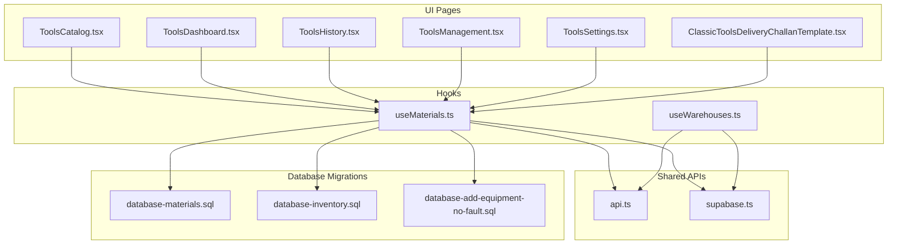
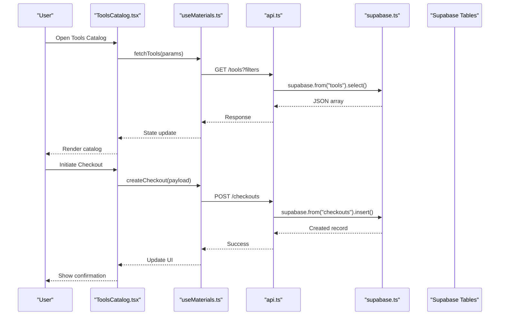
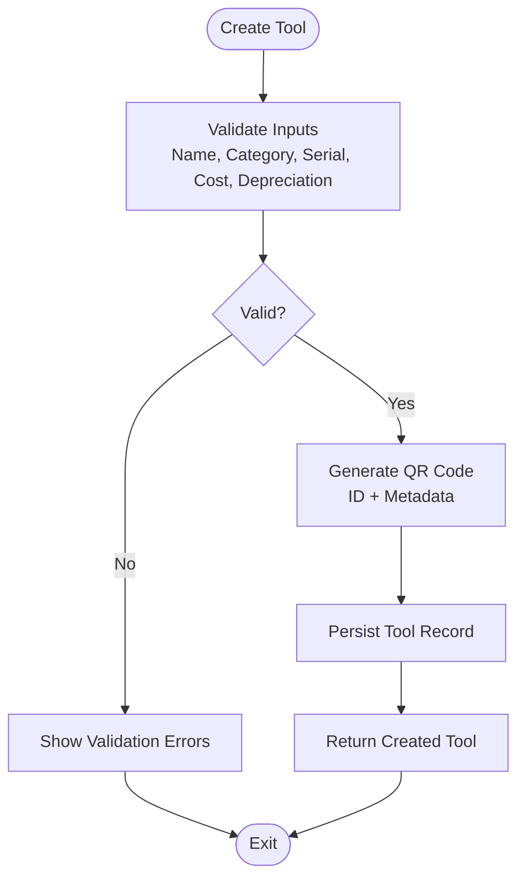
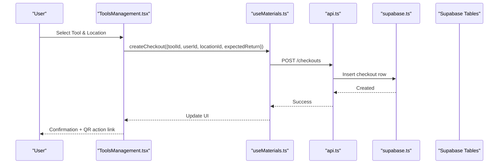
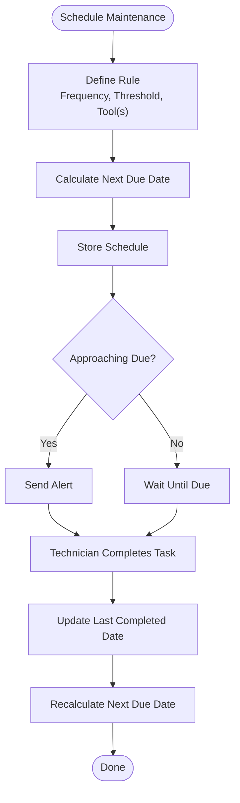
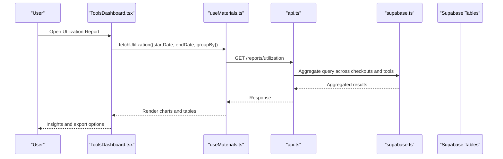
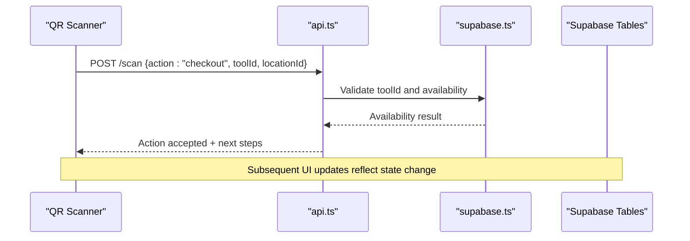
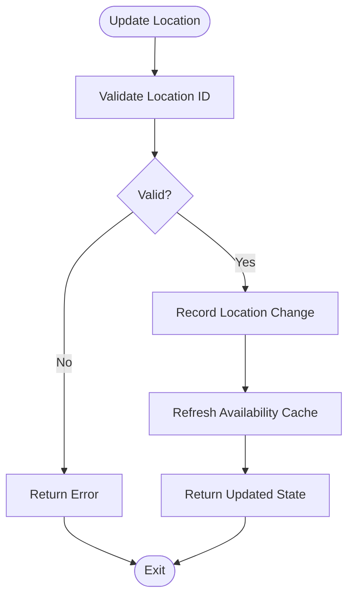
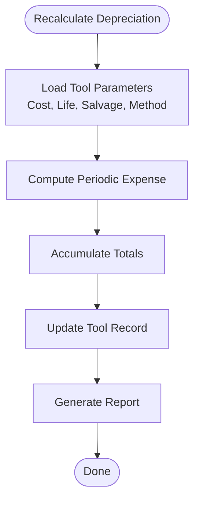
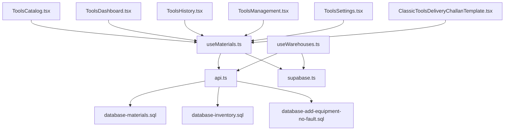

# Tools & Equipment API

<cite>
**Referenced Files in This Document**
- [ToolsCatalog.tsx](file://src/pages/ToolsCatalog.tsx)
- [ToolsDashboard.tsx](file://src/pages/ToolsDashboard.tsx)
- [ToolsHistory.tsx](file://src/pages/ToolsHistory.tsx)
- [ToolsManagement.tsx](file://src/pages/ToolsManagement.tsx)
- [ToolsSettings.tsx](file://src/pages/ToolsSettings.tsx)
- [ClassicToolsDeliveryChallanTemplate.tsx](file://src/pages/ClassicToolsDeliveryChallanTemplate.tsx)
- [useMaterials.ts](file://src/hooks/useMaterials.ts)
- [useWarehouses.ts](file://src/hooks/useWarehouses.ts)
- [api.ts](file://src/api.ts)
- [supabase.ts](file://src/supabase.ts)
- [database-add-equipment-no-fault.sql](file://src/database-add-equipment-no-fault.sql)
- [database-materials.sql](file://src/database-materials.sql)
- [database-inventory.sql](file://src/database-inventory.sql)
</cite>

## Table of Contents
1. [Introduction](#introduction)
2. [Project Structure](#project-structure)
3. [Core Components](#core-components)
4. [Architecture Overview](#architecture-overview)
5. [Detailed Component Analysis](#detailed-component-analysis)
6. [Dependency Analysis](#dependency-analysis)
7. [Performance Considerations](#performance-considerations)
8. [Troubleshooting Guide](#troubleshooting-guide)
9. [Conclusion](#conclusion)
10. [Appendices](#appendices)

## Introduction
This document provides detailed API documentation for tools and equipment management endpoints, focusing on:
- Tool catalog management (create, read, update, delete)
- Issuance and return tracking (checkouts, returns, status transitions)
- Maintenance scheduling and repair history
- Utilization reporting and analytics
- QR code integration for identification, location tracking, and condition monitoring
- Depreciation calculations and maintenance alerts

The scope includes both the frontend pages that drive these features and the underlying data layer via Supabase. Where applicable, example flows are provided to illustrate checkout processes, maintenance alerts, and utilization analytics.

## Project Structure
The tools and equipment feature spans several UI pages, hooks, and database migrations. The primary entry points are the Tools pages under src/pages, with supporting hooks and shared API utilities.

**Diagram sources**
- [ToolsCatalog.tsx](file://src/pages/ToolsCatalog.tsx)
- [ToolsDashboard.tsx](file://src/pages/ToolsDashboard.tsx)
- [ToolsHistory.tsx](file://src/pages/ToolsHistory.tsx)
- [ToolsManagement.tsx](file://src/pages/ToolsManagement.tsx)
- [ToolsSettings.tsx](file://src/pages/ToolsSettings.tsx)
- [ClassicToolsDeliveryChallanTemplate.tsx](file://src/pages/ClassicToolsDeliveryChallanTemplate.tsx)
- [useMaterials.ts](file://src/hooks/useMaterials.ts)
- [useWarehouses.ts](file://src/hooks/useWarehouses.ts)
- [api.ts](file://src/api.ts)
- [supabase.ts](file://src/supabase.ts)
- [database-materials.sql](file://src/database-materials.sql)
- [database-inventory.sql](file://src/database-inventory.sql)
- [database-add-equipment-no-fault.sql](file://src/database-add-equipment-no-fault.sql)

**Section sources**
- [ToolsCatalog.tsx](file://src/pages/ToolsCatalog.tsx)
- [ToolsDashboard.tsx](file://src/pages/ToolsDashboard.tsx)
- [ToolsHistory.tsx](file://src/pages/ToolsHistory.tsx)
- [ToolsManagement.tsx](file://src/pages/ToolsManagement.tsx)
- [ToolsSettings.tsx](file://src/pages/ToolsSettings.tsx)
- [ClassicToolsDeliveryChallanTemplate.tsx](file://src/pages/ClassicToolsDeliveryChallanTemplate.tsx)
- [useMaterials.ts](file://src/hooks/useMaterials.ts)
- [useWarehouses.ts](file://src/hooks/useWarehouses.ts)
- [api.ts](file://src/api.ts)
- [supabase.ts](file://src/supabase.ts)
- [database-materials.sql](file://src/database-materials.sql)
- [database-inventory.sql](file://src/database-inventory.sql)
- [database-add-equipment-no-fault.sql](file://src/database-add-equipment-no-fault.sql)

## Core Components
- Tools Catalog Management
  - Create, update, archive, and list tool items with attributes such as name, category, serial number, QR code, purchase date, cost, depreciation method, and current condition.
  - Supports bulk import/export and search/filter by category, location, and status.
- Issuance and Return Tracking
  - Checkout workflow assigns a tool to a user/project/location with timestamps and expected return date.
  - Return workflow updates condition, logs usage hours, and closes the issuance record.
- Maintenance Scheduling and Repair History
  - Schedule preventive maintenance tasks per tool or batch; track repairs with dates, costs, parts used, and technician notes.
  - Generate maintenance alerts when due dates approach or overdue conditions are detected.
- Utilization Reporting
  - Aggregates checkouts, idle time, mean time between failures, and total usage hours per tool and period.
  - Exports reports for dashboards and analytics.
- QR Code Integration
  - Each tool has a unique QR code encoding an identifier and optional metadata (e.g., location, last known condition).
  - Scanning triggers quick actions: view details, initiate checkout/return, log maintenance, update condition.
- Location Tracking and Condition Monitoring
  - Track current and historical locations; maintain condition states (e.g., good, fair, poor, out-of-service).
  - Integrate with barcode/QR scanners for real-time updates.
- Depreciation Calculations
  - Straight-line or declining-balance methods applied over useful life; calculate book value and accumulated depreciation.
  - Periodic recalculation based on actual usage or schedule changes.

**Section sources**
- [ToolsCatalog.tsx](file://src/pages/ToolsCatalog.tsx)
- [ToolsManagement.tsx](file://src/pages/ToolsManagement.tsx)
- [ToolsHistory.tsx](file://src/pages/ToolsHistory.tsx)
- [ToolsDashboard.tsx](file://src/pages/ToolsDashboard.tsx)
- [useMaterials.ts](file://src/hooks/useMaterials.ts)
- [database-materials.sql](file://src/database-materials.sql)
- [database-inventory.sql](file://src/database-inventory.sql)
- [database-add-equipment-no-fault.sql](file://src/database-add-equipment-no-fault.sql)

## Architecture Overview
The system follows a layered architecture:
- UI Layer: React pages for catalog, dashboard, history, management, settings, and printable templates.
- Hooks Layer: Data access abstractions (e.g., useMaterials, useWarehouses) encapsulating API calls and state.
- Shared API Layer: Centralized HTTP/Supabase client utilities.
- Database Layer: Supabase tables and migrations defining materials, inventory movements, maintenance records, and related entities.

**Diagram sources**
- [ToolsCatalog.tsx](file://src/pages/ToolsCatalog.tsx)
- [useMaterials.ts](file://src/hooks/useMaterials.ts)
- [api.ts](file://src/api.ts)
- [supabase.ts](file://src/supabase.ts)
- [database-materials.sql](file://src/database-materials.sql)

## Detailed Component Analysis

### Tools Catalog Management
Responsibilities:
- CRUD operations for tools with fields like id, name, category, serial_number, qr_code, purchase_date, cost, depreciation_method, useful_life_years, current_condition, location_id, is_active.
- Search and filter by category, location, status, and availability.
- Bulk import/export and validation.

Key endpoints (conceptual):
- GET /tools: List tools with pagination and filters
- POST /tools: Create new tool
- PUT /tools/:id: Update tool details
- DELETE /tools/:id: Archive or remove tool
- POST /tools/import: Bulk import from CSV/JSON
- GET /tools/:id/qr: Retrieve QR code image or data

Example flow:
- User creates a tool with QR code generation.
- System persists tool and associates QR metadata.
- Catalog page renders updated list with QR preview.

**Diagram sources**
- [ToolsCatalog.tsx](file://src/pages/ToolsCatalog.tsx)
- [useMaterials.ts](file://src/hooks/useMaterials.ts)
- [api.ts](file://src/api.ts)
- [supabase.ts](file://src/supabase.ts)
- [database-materials.sql](file://src/database-materials.sql)

**Section sources**
- [ToolsCatalog.tsx](file://src/pages/ToolsCatalog.tsx)
- [useMaterials.ts](file://src/hooks/useMaterials.ts)
- [api.ts](file://src/api.ts)
- [supabase.ts](file://src/supabase.ts)
- [database-materials.sql](file://src/database-materials.sql)

### Issuance and Return Tracking
Responsibilities:
- Checkout: assign tool to user/project/location, set expected return date, capture initial condition.
- Return: update final condition, record usage hours, close issuance, trigger depreciation adjustment if needed.
- Status transitions: issued, returned, overdue, lost/damaged.

Key endpoints (conceptual):
- POST /checkouts: Create checkout record
- GET /checkouts: List active/past checkouts with filters
- PUT /checkouts/:id/return: Submit return with condition and usage metrics
- GET /checkouts/:id/history: View issuance history for a tool

Example checkout process:
- User selects tool and target location/user.
- System validates availability and creates checkout.
- QR scan confirms identity and logs timestamp.
- Dashboard shows active checkouts and upcoming returns.

**Diagram sources**
- [ToolsManagement.tsx](file://src/pages/ToolsManagement.tsx)
- [useMaterials.ts](file://src/hooks/useMaterials.ts)
- [api.ts](file://src/api.ts)
- [supabase.ts](file://src/supabase.ts)
- [database-inventory.sql](file://src/database-inventory.sql)

**Section sources**
- [ToolsManagement.tsx](file://src/pages/ToolsManagement.tsx)
- [useMaterials.ts](file://src/hooks/useMaterials.ts)
- [api.ts](file://src/api.ts)
- [supabase.ts](file://src/supabase.ts)
- [database-inventory.sql](file://src/database-inventory.sql)

### Maintenance Scheduling and Repair History
Responsibilities:
- Schedule preventive maintenance tasks per tool with frequency and next_due_date.
- Log repairs with dates, costs, parts, technician notes, and outcomes.
- Generate alerts for upcoming or overdue maintenance.

Key endpoints (conceptual):
- POST /maintenance/schedules: Create schedule rule
- GET /maintenance/schedules: List schedules with filters
- POST /maintenance/repairs: Log repair event
- GET /maintenance/repairs: Query repair history by tool/date range
- GET /maintenance/alerts: Fetch upcoming/overdue maintenance

Maintenance workflow:
- System calculates next_due_date based on schedule rule and last completed date.
- Alerts are generated when approaching threshold.
- Technicians complete tasks and update status; system recalculates next due date.

**Diagram sources**
- [ToolsHistory.tsx](file://src/pages/ToolsHistory.tsx)
- [useMaterials.ts](file://src/hooks/useMaterials.ts)
- [api.ts](file://src/api.ts)
- [supabase.ts](file://src/supabase.ts)
- [database-add-equipment-no-fault.sql](file://src/database-add-equipment-no-fault.sql)

**Section sources**
- [ToolsHistory.tsx](file://src/pages/ToolsHistory.tsx)
- [useMaterials.ts](file://src/hooks/useMaterials.ts)
- [api.ts](file://src/api.ts)
- [supabase.ts](file://src/supabase.ts)
- [database-add-equipment-no-fault.sql](file://src/database-add-equipment-no-fault.sql)

### Utilization Reporting and Analytics
Responsibilities:
- Aggregate checkout durations, idle time, failure counts, and usage hours.
- Compute KPIs: utilization rate, MTBF, downtime percentage.
- Export reports and visualize trends.

Key endpoints (conceptual):
- GET /reports/utilization: Summarize usage by tool, project, period
- GET /reports/depreciation: Book value and accumulated depreciation
- POST /reports/export: Generate CSV/PDF export

Utilization analytics example:
- Dashboard queries active checkouts and completion times.
- Calculates average usage hours per week and identifies high-utilization tools.
- Highlights underutilized assets for redistribution.

**Diagram sources**
- [ToolsDashboard.tsx](file://src/pages/ToolsDashboard.tsx)
- [useMaterials.ts](file://src/hooks/useMaterials.ts)
- [api.ts](file://src/api.ts)
- [supabase.ts](file://src/supabase.ts)
- [database-materials.sql](file://src/database-materials.sql)
- [database-inventory.sql](file://src/database-inventory.sql)

**Section sources**
- [ToolsDashboard.tsx](file://src/pages/ToolsDashboard.tsx)
- [useMaterials.ts](file://src/hooks/useMaterials.ts)
- [api.ts](file://src/api.ts)
- [supabase.ts](file://src/supabase.ts)
- [database-materials.sql](file://src/database-materials.sql)
- [database-inventory.sql](file://src/database-inventory.sql)

### QR Code Integration
Responsibilities:
- Generate unique QR codes per tool with encoded identifiers and optional metadata.
- Provide scanning endpoints to quickly perform actions (view, checkout, return, log maintenance).
- Maintain QR metadata synchronization with tool records.

Key endpoints (conceptual):
- GET /tools/:id/qr: Retrieve QR image/data
- POST /scan: Process QR scan payload (action, toolId, context)
- GET /tools/qr/search: Resolve QR content to tool details

QR workflow:
- Scanner reads QR and sends payload to /scan.
- Backend resolves toolId and executes requested action.
- UI updates with relevant details and next steps.

**Diagram sources**
- [ClassicToolsDeliveryChallanTemplate.tsx](file://src/pages/ClassicToolsDeliveryChallanTemplate.tsx)
- [api.ts](file://src/api.ts)
- [supabase.ts](file://src/supabase.ts)
- [database-materials.sql](file://src/database-materials.sql)

**Section sources**
- [ClassicToolsDeliveryChallanTemplate.tsx](file://src/pages/ClassicToolsDeliveryChallanTemplate.tsx)
- [api.ts](file://src/api.ts)
- [supabase.ts](file://src/supabase.ts)
- [database-materials.sql](file://src/database-materials.sql)

### Location Tracking and Condition Monitoring
Responsibilities:
- Track current and historical locations for each tool.
- Monitor condition states and update upon returns or inspections.
- Provide location-based availability checks.

Key endpoints (conceptual):
- GET /tools/:id/location-history: Historical locations
- PUT /tools/:id/location: Update current location
- GET /tools/availability?locationId: Check availability by location
- PUT /tools/:id/condition: Update condition state

Location workflow:
- On checkout, set locationId and timestamp.
- On return, record previous location and update condition.
- Reports aggregate availability and movement patterns.

**Diagram sources**
- [useWarehouses.ts](file://src/hooks/useWarehouses.ts)
- [api.ts](file://src/api.ts)
- [supabase.ts](file://src/supabase.ts)
- [database-inventory.sql](file://src/database-inventory.sql)

**Section sources**
- [useWarehouses.ts](file://src/hooks/useWarehouses.ts)
- [api.ts](file://src/api.ts)
- [supabase.ts](file://src/supabase.ts)
- [database-inventory.sql](file://src/database-inventory.sql)

### Depreciation Calculations
Responsibilities:
- Apply depreciation methods (straight-line, declining-balance) based on purchase cost, useful life, and salvage value.
- Compute accumulated depreciation and book value periodically.
- Adjust for usage intensity or schedule changes.

Key endpoints (conceptual):
- GET /tools/:id/depreciation: Current depreciation schedule
- POST /depreciation/recalculate: Trigger recalculation for selected tools
- GET /reports/depreciation: Summary report

Depreciation calculation flow:
- Input parameters: cost, useful_life_years, salvage_value, method.
- Compute periodic depreciation expense and cumulative totals.
- Update tool record with book value and last_recalc_date.

**Diagram sources**
- [ToolsCatalog.tsx](file://src/pages/ToolsCatalog.tsx)
- [useMaterials.ts](file://src/hooks/useMaterials.ts)
- [api.ts](file://src/api.ts)
- [supabase.ts](file://src/supabase.ts)
- [database-materials.sql](file://src/database-materials.sql)

**Section sources**
- [ToolsCatalog.tsx](file://src/pages/ToolsCatalog.tsx)
- [useMaterials.ts](file://src/hooks/useMaterials.ts)
- [api.ts](file://src/api.ts)
- [supabase.ts](file://src/supabase.ts)
- [database-materials.sql](file://src/database-materials.sql)

## Dependency Analysis
The components interact through hooks and shared APIs, which communicate with Supabase tables defined in migrations.

**Diagram sources**
- [ToolsCatalog.tsx](file://src/pages/ToolsCatalog.tsx)
- [ToolsDashboard.tsx](file://src/pages/ToolsDashboard.tsx)
- [ToolsHistory.tsx](file://src/pages/ToolsHistory.tsx)
- [ToolsManagement.tsx](file://src/pages/ToolsManagement.tsx)
- [ToolsSettings.tsx](file://src/pages/ToolsSettings.tsx)
- [ClassicToolsDeliveryChallanTemplate.tsx](file://src/pages/ClassicToolsDeliveryChallanTemplate.tsx)
- [useMaterials.ts](file://src/hooks/useMaterials.ts)
- [useWarehouses.ts](file://src/hooks/useWarehouses.ts)
- [api.ts](file://src/api.ts)
- [supabase.ts](file://src/supabase.ts)
- [database-materials.sql](file://src/database-materials.sql)
- [database-inventory.sql](file://src/database-inventory.sql)
- [database-add-equipment-no-fault.sql](file://src/database-add-equipment-no-fault.sql)

**Section sources**
- [useMaterials.ts](file://src/hooks/useMaterials.ts)
- [useWarehouses.ts](file://src/hooks/useWarehouses.ts)
- [api.ts](file://src/api.ts)
- [supabase.ts](file://src/supabase.ts)
- [database-materials.sql](file://src/database-materials.sql)
- [database-inventory.sql](file://src/database-inventory.sql)
- [database-add-equipment-no-fault.sql](file://src/database-add-equipment-no-fault.sql)

## Performance Considerations
- Pagination and filtering: Use server-side pagination and targeted filters to reduce payload sizes.
- Caching: Cache frequent reads (catalog lists, availability) with short TTLs; invalidate on mutations.
- Batch operations: Prefer bulk imports/updates for efficiency.
- Indexing: Ensure database indexes on frequently queried columns (serial_number, location_id, created_at).
- QR processing: Generate QR images asynchronously and store references to avoid blocking UI.
- Depreciation recalculation: Run off-peak and paginate large datasets.

[No sources needed since this section provides general guidance]

## Troubleshooting Guide
Common issues and resolutions:
- QR scan fails to resolve toolId: Verify QR payload format and ensure tool exists and is active.
- Checkout rejected due to unavailability: Check current location and existing active checkouts.
- Maintenance alert not triggered: Confirm schedule rules and thresholds; validate next_due_date calculations.
- Depreciation mismatch: Re-run recalculation and compare against manual computations; review input parameters.
- Location updates not reflected: Ensure locationId is valid and availability cache is refreshed.

Operational tips:
- Enable logging around API calls and Supabase interactions.
- Use audit logs to trace state changes for tools, checkouts, and maintenance events.
- Validate inputs at both UI and API layers to prevent inconsistent states.

**Section sources**
- [api.ts](file://src/api.ts)
- [supabase.ts](file://src/supabase.ts)
- [database-materials.sql](file://src/database-materials.sql)
- [database-inventory.sql](file://src/database-inventory.sql)
- [database-add-equipment-no-fault.sql](file://src/database-add-equipment-no-fault.sql)

## Conclusion
The Tools & Equipment API integrates catalog management, issuance/returns, maintenance scheduling, utilization analytics, QR code workflows, and depreciation calculations into a cohesive system. By leveraging structured endpoints, robust hooks, and well-defined database schemas, teams can efficiently manage tools across locations and projects while maintaining accurate financial and operational insights.

[No sources needed since this section summarizes without analyzing specific files]

## Appendices

### Example: Tool Checkout Process
- Steps:
  - Select tool and target location/user.
  - Validate availability and create checkout.
  - Confirm via QR scan.
  - Receive confirmation and next steps.
- Expected outcomes:
  - Tool marked as issued with location and timestamps.
  - Dashboard reflects active checkouts and upcoming returns.

**Section sources**
- [ToolsManagement.tsx](file://src/pages/ToolsManagement.tsx)
- [useMaterials.ts](file://src/hooks/useMaterials.ts)
- [api.ts](file://src/api.ts)
- [supabase.ts](file://src/supabase.ts)
- [database-inventory.sql](file://src/database-inventory.sql)

### Example: Maintenance Alerts
- Steps:
  - Define schedule rule and thresholds.
  - System calculates next due date and monitors proximity.
  - Alerts sent when approaching or overdue.
  - Technician completes task and updates status.
- Expected outcomes:
  - Reduced downtime and improved compliance.
  - Accurate maintenance history and next due date recalculation.

**Section sources**
- [ToolsHistory.tsx](file://src/pages/ToolsHistory.tsx)
- [useMaterials.ts](file://src/hooks/useMaterials.ts)
- [api.ts](file://src/api.ts)
- [supabase.ts](file://src/supabase.ts)
- [database-add-equipment-no-fault.sql](file://src/database-add-equipment-no-fault.sql)

### Example: Utilization Analytics
- Steps:
  - Query active and completed checkouts within a date range.
  - Aggregate usage hours and idle time per tool.
  - Compute KPIs and render charts.
- Expected outcomes:
  - Visibility into high/low utilization tools.
  - Informed decisions on asset allocation and procurement.

**Section sources**
- [ToolsDashboard.tsx](file://src/pages/ToolsDashboard.tsx)
- [useMaterials.ts](file://src/hooks/useMaterials.ts)
- [api.ts](file://src/api.ts)
- [supabase.ts](file://src/supabase.ts)
- [database-materials.sql](file://src/database-materials.sql)
- [database-inventory.sql](file://src/database-inventory.sql)