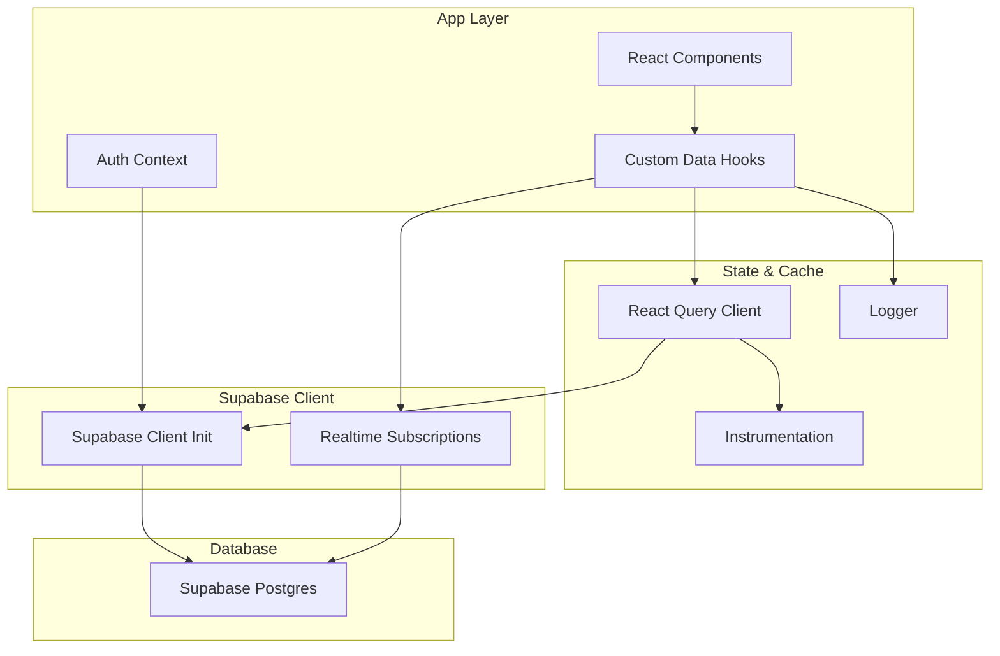
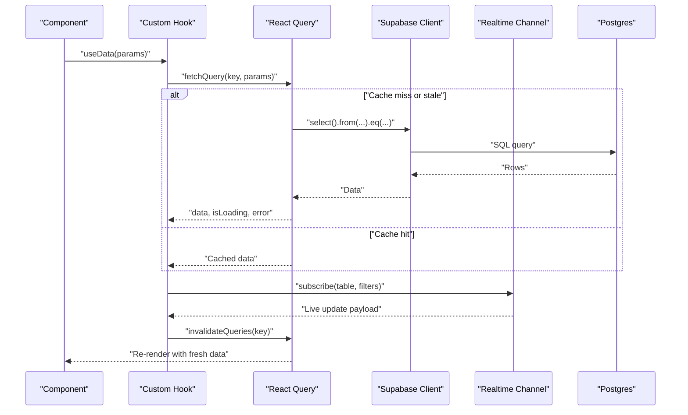
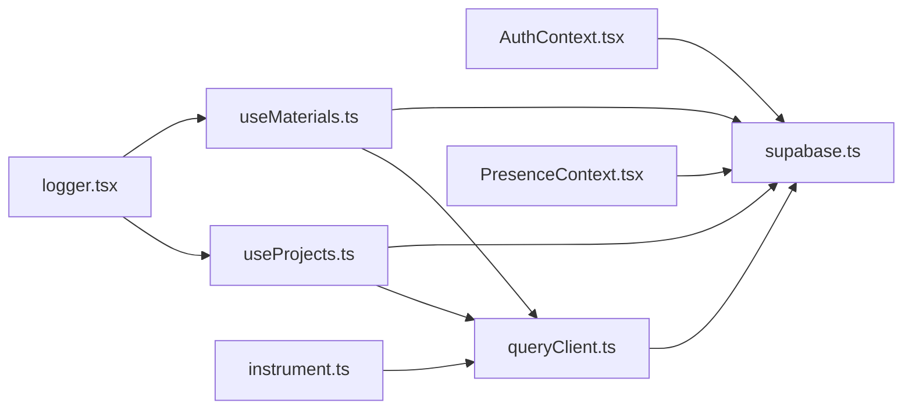

# Supabase Client Integration

<cite>
**Referenced Files in This Document**
- [supabase.ts](file://src/lib/supabase.ts)
- [AuthContext.tsx](file://src/contexts/AuthContext.tsx)
- [queryClient.ts](file://src/config/queryClient.ts)
- [useProjects.ts](file://src/hooks/useProjects.ts)
- [useMaterials.ts](file://src/hooks/useMaterials.ts)
- [PresenceContext.tsx](file://src/hooks/PresenceContext.tsx)
- [logger.tsx](file://src/lib/logger.tsx)
- [instrument.ts](file://src/instrument.ts)
- [database-setup.sql](file://src/database-setup.sql)
- [supabase-setup.sql](file://supabase-setup.sql)
</cite>

## Table of Contents
1. [Introduction](#introduction)
2. [Project Structure](#project-structure)
3. [Core Components](#core-components)
4. [Architecture Overview](#architecture-overview)
5. [Detailed Component Analysis](#detailed-component-analysis)
6. [Dependency Analysis](#dependency-analysis)
7. [Performance Considerations](#performance-considerations)
8. [Troubleshooting Guide](#troubleshooting-guide)
9. [Conclusion](#conclusion)

## Introduction
This document explains how the MEP Project ERP integrates with Supabase on the web client. It covers client configuration, authentication setup, connection management, React Query integration for server state and caching, optimistic updates, custom hooks patterns, real-time subscriptions, query optimization and indexing strategies, complex queries and aggregates, error handling and retry logic, offline-first considerations, and debugging and monitoring approaches. The goal is to provide a clear, practical guide for developers working with database operations across the application.

## Project Structure
The Supabase integration spans several layers:
- Client initialization and environment configuration
- Authentication context and session management
- React Query client configuration and cache policies
- Feature-specific data hooks (queries, mutations, subscriptions)
- Real-time presence and live updates
- Logging and instrumentation for observability
- Database schema and indexes

**Diagram sources**
- [supabase.ts](file://src/lib/supabase.ts)
- [AuthContext.tsx](file://src/contexts/AuthContext.tsx)
- [queryClient.ts](file://src/config/queryClient.ts)
- [useProjects.ts](file://src/hooks/useProjects.ts)
- [useMaterials.ts](file://src/hooks/useMaterials.ts)
- [PresenceContext.tsx](file://src/hooks/PresenceContext.tsx)
- [logger.tsx](file://src/lib/logger.tsx)
- [instrument.ts](file://src/instrument.ts)

**Section sources**
- [supabase.ts](file://src/lib/supabase.ts)
- [AuthContext.tsx](file://src/contexts/AuthContext.tsx)
- [queryClient.ts](file://src/config/queryClient.ts)
- [useProjects.ts](file://src/hooks/useProjects.ts)
- [useMaterials.ts](file://src/hooks/useMaterials.ts)
- [PresenceContext.tsx](file://src/hooks/PresenceContext.tsx)
- [logger.tsx](file://src/lib/logger.tsx)
- [instrument.ts](file://src/instrument.ts)

## Core Components
- Supabase client initialization and environment configuration
- Authentication context wrapping auth state and helpers
- React Query client configured for caching, retries, and background refresh
- Custom hooks encapsulating queries, mutations, and real-time subscriptions
- Presence and real-time utilities for live collaboration features
- Logging and instrumentation for performance and error tracking

Key responsibilities:
- Centralize Supabase client creation and reuse across the app
- Provide typed accessors and helper methods for common operations
- Manage user sessions and propagate auth state to components
- Configure React Query for efficient server state synchronization
- Implement reusable hooks that abstract Supabase calls and caching
- Subscribe to realtime events for live updates
- Log and instrument critical operations for debugging and monitoring

**Section sources**
- [supabase.ts](file://src/lib/supabase.ts)
- [AuthContext.tsx](file://src/contexts/AuthContext.tsx)
- [queryClient.ts](file://src/config/queryClient.ts)
- [useProjects.ts](file://src/hooks/useProjects.ts)
- [useMaterials.ts](file://src/hooks/useMaterials.ts)
- [PresenceContext.tsx](file://src/hooks/PresenceContext.tsx)
- [logger.tsx](file://src/lib/logger.tsx)
- [instrument.ts](file://src/instrument.ts)

## Architecture Overview
The client architecture follows a layered approach:
- Presentation layer consumes custom hooks
- State layer uses React Query for caching and lifecycle
- Data layer wraps Supabase client calls
- Realtime layer subscribes to channel events
- Observability layer logs and instruments operations

**Diagram sources**
- [useProjects.ts](file://src/hooks/useProjects.ts)
- [useMaterials.ts](file://src/hooks/useMaterials.ts)
- [queryClient.ts](file://src/config/queryClient.ts)
- [supabase.ts](file://src/lib/supabase.ts)
- [PresenceContext.tsx](file://src/hooks/PresenceContext.tsx)

## Detailed Component Analysis

### Supabase Client Initialization
Responsibilities:
- Load environment variables for project URL and anon key
- Create a single shared client instance
- Attach default headers and options
- Expose typed table accessors where applicable

Patterns:
- Singleton client to avoid multiple connections
- Environment-driven configuration for dev/prod parity
- Optional middleware for logging and tracing

Optimization tips:
- Reuse the same client instance globally
- Avoid per-request client instantiation
- Use typed schemas to catch errors at compile time

**Section sources**
- [supabase.ts](file://src/lib/supabase.ts)

### Authentication Setup and Session Management
Responsibilities:
- Initialize auth provider with Supabase client
- Persist session across reloads
- Provide login, logout, and session state to the app
- Guard routes based on authenticated state

Patterns:
- Context-based auth state distribution
- Automatic token refresh via Supabase SDK
- Error boundaries around auth flows

Security notes:
- Never expose service role keys in the browser
- Enforce Row Level Security policies on the server

**Section sources**
- [AuthContext.tsx](file://src/contexts/AuthContext.tsx)
- [supabase.ts](file://src/lib/supabase.ts)

### React Query Integration and Caching Strategy
Responsibilities:
- Configure global retry behavior and stale times
- Define cache keys and invalidation rules
- Enable background refetching and pagination support
- Integrate optimistic updates for mutations

Patterns:
- Centralized QueryClient configuration
- Consistent cache policies per feature area
- Mutation callbacks to invalidate dependent queries

Tuning guidance:
- Set appropriate staleTime and gcTime per resource
- Prefer precise invalidation over broad cache resets
- Use placeholderData for perceived performance improvements

**Section sources**
- [queryClient.ts](file://src/config/queryClient.ts)

### Custom Hooks Patterns for Queries, Mutations, and Realtime
Responsibilities:
- Encapsulate data fetching with useQuery-like APIs
- Wrap mutations with optimistic updates and rollback
- Manage realtime subscriptions and local state sync

Patterns:
- Feature-scoped hooks returning { data, loading, error, mutate }
- Separate concerns between read paths and write paths
- Combine query invalidation with realtime events

Examples by feature:
- Projects hook for list/detail views and mutations
- Materials hook for inventory operations and stock adjustments

**Section sources**
- [useProjects.ts](file://src/hooks/useProjects.ts)
- [useMaterials.ts](file://src/hooks/useMaterials.ts)

### Real-Time Subscriptions and Presence
Responsibilities:
- Subscribe to table changes and broadcast events
- Maintain presence state for collaborative editing
- Debounce and coalesce incoming updates

Patterns:
- Channel-per-resource subscription model
- Local diffing to minimize re-renders
- Graceful reconnect and backoff

**Section sources**
- [PresenceContext.tsx](file://src/hooks/PresenceContext.tsx)

### Logging and Instrumentation
Responsibilities:
- Emit structured logs for API calls and errors
- Track latency and failure rates
- Correlate logs with user sessions and requests

Patterns:
- Decorator-style wrappers around network calls
- Sampling for high-volume events
- Integration with external telemetry systems

**Section sources**
- [logger.tsx](file://src/lib/logger.tsx)
- [instrument.ts](file://src/instrument.ts)

## Dependency Analysis
High-level dependencies among core modules:

**Diagram sources**
- [AuthContext.tsx](file://src/contexts/AuthContext.tsx)
- [supabase.ts](file://src/lib/supabase.ts)
- [queryClient.ts](file://src/config/queryClient.ts)
- [useProjects.ts](file://src/hooks/useProjects.ts)
- [useMaterials.ts](file://src/hooks/useMaterials.ts)
- [PresenceContext.tsx](file://src/hooks/PresenceContext.tsx)
- [logger.tsx](file://src/lib/logger.tsx)
- [instrument.ts](file://src/instrument.ts)

**Section sources**
- [AuthContext.tsx](file://src/contexts/AuthContext.tsx)
- [supabase.ts](file://src/lib/supabase.ts)
- [queryClient.ts](file://src/config/queryClient.ts)
- [useProjects.ts](file://src/hooks/useProjects.ts)
- [useMaterials.ts](file://src/hooks/useMaterials.ts)
- [PresenceContext.tsx](file://src/hooks/PresenceContext.tsx)
- [logger.tsx](file://src/lib/logger.tsx)
- [instrument.ts](file://src/instrument.ts)

## Performance Considerations

### Database Query Optimization
- Prefer selective column projection to reduce payload size
- Use filters early in the chain to limit rows before joins
- Leverage Supabase’s built-in pagination and cursors for large lists
- Batch related reads when possible using RPC functions

Indexing Strategies
- Add B-tree indexes on frequently filtered columns (e.g., org_id, status, created_at)
- Composite indexes for multi-column predicates commonly used together
- Partial indexes for hot subsets (e.g., active records only)
- Monitor slow queries and add targeted indexes based on actual usage

Aggregate Operations
- Use SQL aggregates and window functions within Supabase RPCs for heavy computations
- Denormalize frequently accessed summaries where appropriate
- Cache aggregate results in materialized views refreshed periodically

Caching and Network Efficiency
- Tune staleTime and gcTime per resource shape
- Use optimistic updates to improve perceived responsiveness
- Deduplicate identical queries via consistent cache keys
- Employ background refetch intervals sparingly and only for essential live data

Connection Management
- Keep a single Supabase client instance
- Respect Supabase SDK’s automatic reconnection and token refresh
- Avoid creating channels per component; scope channels to resources

[No sources needed since this section provides general guidance]

## Troubleshooting Guide

Common Issues and Resolutions
- Authentication failures: verify environment variables and RLS policies
- Stale data: ensure proper invalidation after mutations
- Excessive re-renders: refine cache keys and debounce realtime updates
- Slow queries: analyze execution plans and add missing indexes
- Offline behavior: implement local fallbacks and queue writes for later sync

Debugging Tools and Techniques
- Structured logging around queries and mutations
- Request tracing with correlation IDs
- React Query Devtools for cache inspection
- Supabase dashboard for query performance and realtime metrics

Monitoring Approaches
- Track latency percentiles and error rates
- Alert on failed mutations and repeated retries
- Observe realtime channel health and reconnect frequency

**Section sources**
- [logger.tsx](file://src/lib/logger.tsx)
- [instrument.ts](file://src/instrument.ts)

## Conclusion
By centralizing Supabase client configuration, standardizing authentication, leveraging React Query for robust server state, and adopting consistent patterns for queries, mutations, and realtime subscriptions, the MEP Project ERP achieves reliable, performant, and maintainable data access. Indexing, caching, and observability practices further enhance scalability and operational visibility.