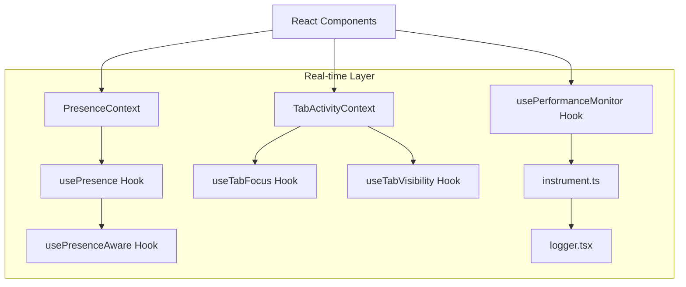
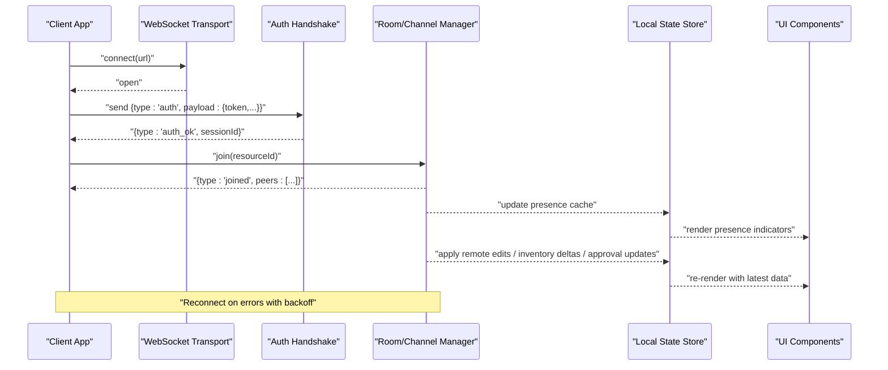
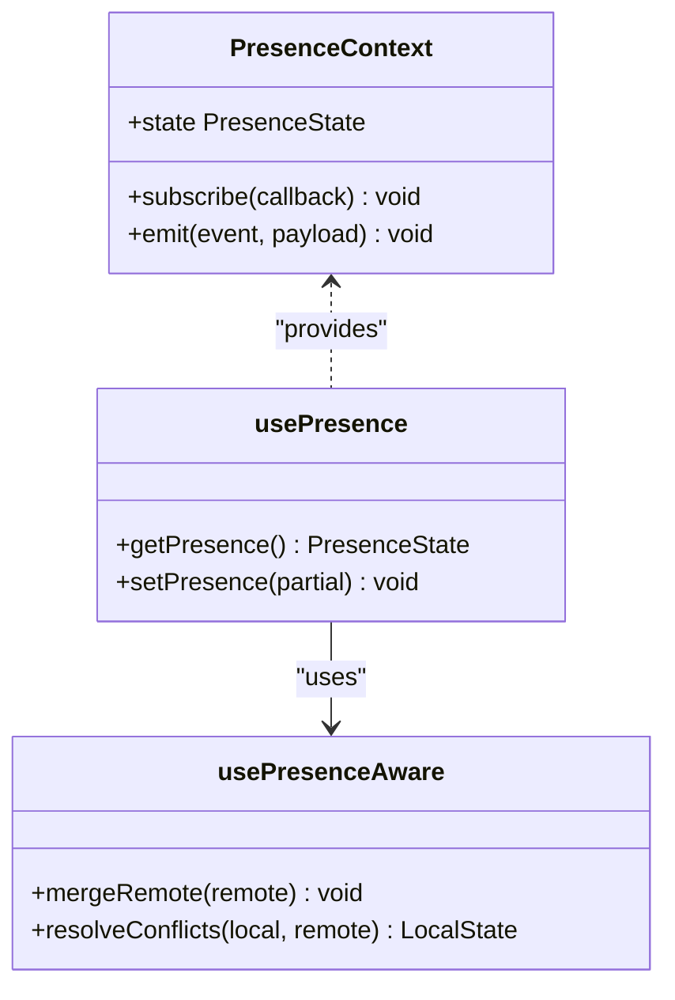
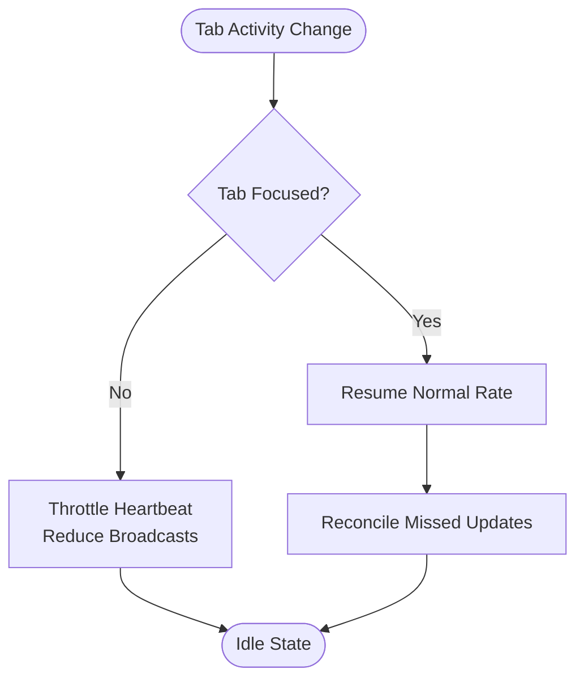
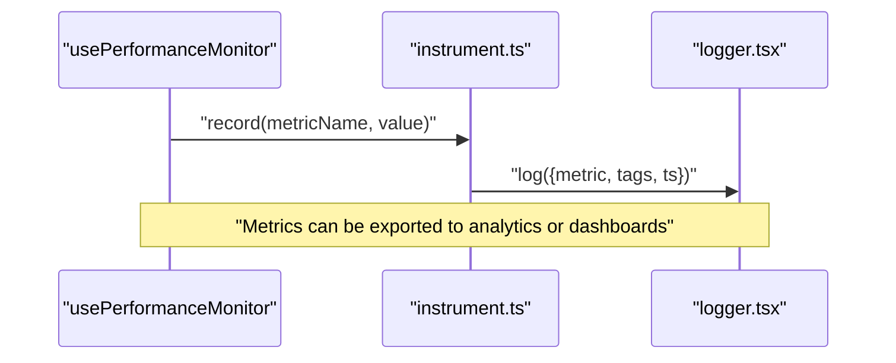
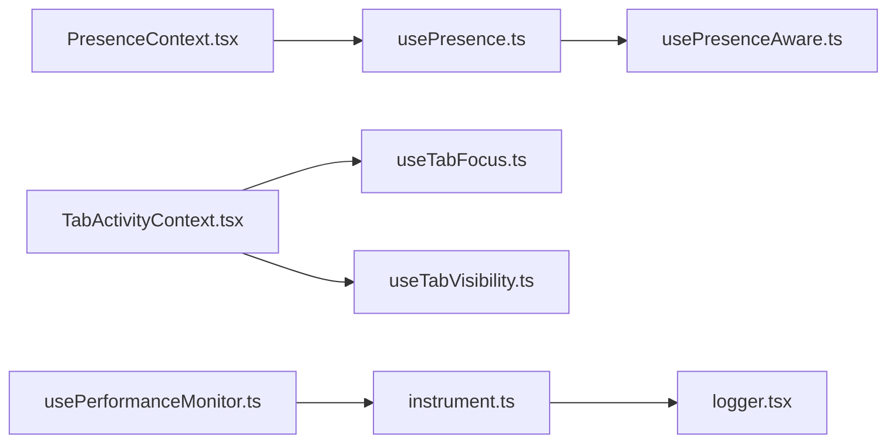

# WebSocket Events & Real-time APIs

<cite>
**Referenced Files in This Document**
- [PresenceContext.tsx](file://src/contexts/PresenceContext.tsx)
- [usePresence.ts](file://src/hooks/usePresence.ts)
- [usePresenceAware.ts](file://src/hooks/usePresenceAware.ts)
- [PresenceAwareExample.tsx](file://src/examples/PresenceAwareExample.tsx)
- [TabActivityContext.tsx](file://src/hooks/TabActivityContext.tsx)
- [useTabFocus.ts](file://src/hooks/useTabFocus.ts)
- [useTabVisibility.ts](file://src/hooks/useTabVisibility.ts)
- [usePerformanceMonitor.ts](file://src/hooks/usePerformanceMonitor.ts)
- [instrument.ts](file://src/instrument.ts)
- [logger.tsx](file://src/lib/logger.tsx)
</cite>

## Table of Contents
1. [Introduction](#introduction)
2. [Project Structure](#project-structure)
3. [Core Components](#core-components)
4. [Architecture Overview](#architecture-overview)
5. [Detailed Component Analysis](#detailed-component-analysis)
6. [Dependency Analysis](#dependency-analysis)
7. [Performance Considerations](#performance-considerations)
8. [Troubleshooting Guide](#troubleshooting-guide)
9. [Conclusion](#conclusion)
10. [Appendices](#appendices)

## Introduction
This document specifies the real-time event model and client-side implementation patterns for the MEP Project ERP system’s presence and collaboration features. It focuses on connection establishment, authentication handshake, session management, and event subscription patterns for presence notifications, collaborative editing, live inventory updates, and approval workflow status changes. It also provides TypeScript-oriented guidance for building robust WebSocket clients with reconnection logic, error handling, and state synchronization, along with performance considerations for high-concurrency scenarios.

Where applicable, this document references concrete source files that implement or support these capabilities.

## Project Structure
The real-time features are primarily implemented as React hooks and contexts that manage presence, tab activity, and performance instrumentation. The following diagram shows how these components relate to each other at a conceptual level:

[No sources needed since this diagram shows conceptual relationships without mapping to specific code structures]

## Core Components
- Presence context and hooks: Provide user presence state, awareness of active collaborators, and utilities for subscribing to presence events.
- Tab activity context and hooks: Track browser tab focus and visibility to infer user engagement and optimize real-time behavior.
- Performance monitoring hook and instrumentation: Emit metrics and logs for connection lifecycle, message throughput, and latency.

These components collectively enable presence notifications, cursor positioning, change propagation, and live updates across modules such as inventory and approvals.

**Section sources**
- [PresenceContext.tsx](file://src/contexts/PresenceContext.tsx)
- [usePresence.ts](file://src/hooks/usePresence.ts)
- [usePresenceAware.ts](file://src/hooks/usePresenceAware.ts)
- [TabActivityContext.tsx](file://src/hooks/TabActivityContext.tsx)
- [useTabFocus.ts](file://src/hooks/useTabFocus.ts)
- [useTabVisibility.ts](file://src/hooks/useTabVisibility.ts)
- [usePerformanceMonitor.ts](file://src/hooks/usePerformanceMonitor.ts)
- [instrument.ts](file://src/instrument.ts)
- [logger.tsx](file://src/lib/logger.tsx)

## Architecture Overview
The real-time architecture centers around a presence layer that coordinates user sessions, tracks active collaborators, and surfaces events to UI components. A typical flow includes:
- Establishing a persistent connection (WebSocket or compatible transport).
- Performing an authentication handshake using credentials or tokens.
- Managing sessions by joining rooms/channels scoped to resources (e.g., documents, inventory items, approval workflows).
- Subscribing to typed events (presence, edits, inventory deltas, approval status changes).
- Reconnecting on failures with exponential backoff and jitter.
- Synchronizing local state with server authoritative state.

[No sources needed since this diagram shows conceptual workflow, not actual code structure]

## Detailed Component Analysis

### Presence Context and Hooks
The presence subsystem exposes:
- A context providing current presence state and helpers to subscribe to presence events.
- A hook to read presence data and emit local presence signals.
- An awareness hook that merges remote presence into local state and reconciles conflicts.

Typical responsibilities:
- Maintain a map of users to their presence attributes (e.g., cursor position, edit locks).
- Broadcast local presence updates when the user interacts.
- Handle peer join/leave events and update the UI accordingly.
- Integrate with tab focus/visibility to suppress unnecessary updates when inactive.

**Diagram sources**
- [PresenceContext.tsx](file://src/contexts/PresenceContext.tsx)
- [usePresence.ts](file://src/hooks/usePresence.ts)
- [usePresenceAware.ts](file://src/hooks/usePresenceAware.ts)

**Section sources**
- [PresenceContext.tsx](file://src/contexts/PresenceContext.tsx)
- [usePresence.ts](file://src/hooks/usePresence.ts)
- [usePresenceAware.ts](file://src/hooks/usePresenceAware.ts)
- [PresenceAwareExample.tsx](file://src/examples/PresenceAwareExample.tsx)

### Tab Activity and Visibility
Tab activity influences presence behavior:
- When the tab loses focus or becomes invisible, reduce heartbeat frequency and throttle presence broadcasts.
- On regain focus, resume normal operation and reconcile any missed updates.

**Diagram sources**
- [TabActivityContext.tsx](file://src/hooks/TabActivityContext.tsx)
- [useTabFocus.ts](file://src/hooks/useTabFocus.ts)
- [useTabVisibility.ts](file://src/hooks/useTabVisibility.ts)

**Section sources**
- [TabActivityContext.tsx](file://src/hooks/TabActivityContext.tsx)
- [useTabFocus.ts](file://src/hooks/useTabFocus.ts)
- [useTabVisibility.ts](file://src/hooks/useTabVisibility.ts)

### Performance Monitoring and Instrumentation
Monitoring hooks and utilities provide:
- Connection lifecycle metrics (connect, reconnect, disconnect).
- Message throughput and latency tracking.
- Error rates and retry counts.
- Optional sampling strategies to avoid overhead under high concurrency.

**Diagram sources**
- [usePerformanceMonitor.ts](file://src/hooks/usePerformanceMonitor.ts)
- [instrument.ts](file://src/instrument.ts)
- [logger.tsx](file://src/lib/logger.tsx)

**Section sources**
- [usePerformanceMonitor.ts](file://src/hooks/usePerformanceMonitor.ts)
- [instrument.ts](file://src/instrument.ts)
- [logger.tsx](file://src/lib/logger.tsx)

## Dependency Analysis
The real-time layer depends on:
- React contexts and hooks for state and side effects.
- Browser APIs for tab focus and visibility.
- Logging and instrumentation utilities for observability.

**Diagram sources**
- [PresenceContext.tsx](file://src/contexts/PresenceContext.tsx)
- [usePresence.ts](file://src/hooks/usePresence.ts)
- [usePresenceAware.ts](file://src/hooks/usePresenceAware.ts)
- [TabActivityContext.tsx](file://src/hooks/TabActivityContext.tsx)
- [useTabFocus.ts](file://src/hooks/useTabFocus.ts)
- [useTabVisibility.ts](file://src/hooks/useTabVisibility.ts)
- [usePerformanceMonitor.ts](file://src/hooks/usePerformanceMonitor.ts)
- [instrument.ts](file://src/instrument.ts)
- [logger.tsx](file://src/lib/logger.tsx)

**Section sources**
- [PresenceContext.tsx](file://src/contexts/PresenceContext.tsx)
- [usePresence.ts](file://src/hooks/usePresence.ts)
- [usePresenceAware.ts](file://src/hooks/usePresenceAware.ts)
- [TabActivityContext.tsx](file://src/hooks/TabActivityContext.tsx)
- [useTabFocus.ts](file://src/hooks/useTabFocus.ts)
- [useTabVisibility.ts](file://src/hooks/useTabVisibility.ts)
- [usePerformanceMonitor.ts](file://src/hooks/usePerformanceMonitor.ts)
- [instrument.ts](file://src/instrument.ts)
- [logger.tsx](file://src/lib/logger.tsx)

## Performance Considerations
- Connection pooling:
  - Reuse a single WebSocket per resource scope to minimize overhead.
  - Implement room/channel joins rather than multiple connections.
- Backpressure and batching:
  - Batch presence updates and edits; coalesce rapid changes.
  - Debounce input-driven events (e.g., typing) before broadcasting.
- Heartbeats and keep-alives:
  - Adjust heartbeat intervals based on tab visibility/focus.
  - Detect stale peers and prune presence entries.
- Conflict resolution:
  - Prefer operational transforms or CRDTs for collaborative editing.
  - Apply server-authoritative reconciliation for inventory and approvals.
- Sampling and telemetry:
  - Sample metrics under high load to reduce logging overhead.
  - Export key metrics to dashboards for monitoring.

[No sources needed since this section provides general guidance]

## Troubleshooting Guide
Common issues and diagnostics:
- Authentication failures:
  - Verify token validity and expiration handling.
  - Inspect auth handshake responses and retry policies.
- Frequent reconnects:
  - Check network stability and server availability.
  - Tune backoff parameters and jitter.
- Stale presence:
  - Ensure heartbeats are sent and peers are pruned on disconnect.
  - Validate room join/leave flows.
- High CPU/memory usage:
  - Reduce broadcast frequency when tab is inactive.
  - Limit payload sizes and batch updates.
- Observability:
  - Use performance monitor hooks and logger to capture connection and message metrics.
  - Correlate errors with timestamps and resource IDs.

**Section sources**
- [usePerformanceMonitor.ts](file://src/hooks/usePerformanceMonitor.ts)
- [instrument.ts](file://src/instrument.ts)
- [logger.tsx](file://src/lib/logger.tsx)

## Conclusion
The MEP Project ERP system’s real-time capabilities are built around a presence layer that integrates with tab activity and performance monitoring. By adopting robust connection management, structured event types, and conflict resolution strategies, teams can deliver responsive collaborative experiences for editing, inventory, and approvals. The referenced hooks and contexts provide a solid foundation for implementing WebSocket clients with reconnection logic, error handling, and state synchronization.

[No sources needed since this section summarizes without analyzing specific files]

## Appendices

### Event Types and Payload Structures
- Authentication handshake:
  - type: "auth"
  - payload: { token, userId, orgId }
  - response: { type: "auth_ok", sessionId }
- Presence:
  - type: "presence_update"
  - payload: { userId, roomId, attrs: { cursor, selection, lock } }
  - response: { type: "presence_ack", version }
- Collaborative editing:
  - type: "edit_delta"
  - payload: { docId, op, version, authorId }
  - response: { type: "edit_ack", acceptedVersion }
- Live inventory updates:
  - type: "inventory_delta"
  - payload: { itemId, warehouseId, deltaQty, reason, timestamp }
  - response: { type: "inventory_ack", newStock }
- Approval workflow status changes:
  - type: "approval_status"
  - payload: { requestId, status, reviewerId, comment }
  - response: { type: "approval_ack", updatedWorkflow }

[No sources needed since this section defines conceptual payloads]

### Subscription Patterns
- Join a room/channel for a resource:
  - send: { type: "join", resourceId }
  - receive: { type: "joined", peers: [...] }
- Subscribe to typed events:
  - send: { type: "subscribe", events: ["presence_update","edit_delta","inventory_delta","approval_status"] }
  - receive: event messages matching subscribed types
- Unsubscribe and leave:
  - send: { type: "unsubscribe", events: [...] }
  - send: { type: "leave", resourceId }

[No sources needed since this section defines conceptual patterns]

### TypeScript Client Implementation Guidance
- Connection lifecycle:
  - Initialize WebSocket with URL and headers.
  - On open, perform authentication handshake.
  - On auth success, join required rooms and subscribe to events.
- Reconnection logic:
  - Implement exponential backoff with jitter.
  - Preserve subscriptions and attempt to rejoin rooms after reconnect.
- Error handling:
  - Distinguish between transient and fatal errors.
  - Surface errors to UI with actionable messages.
- State synchronization:
  - Maintain a local store keyed by resource ID.
  - Apply server authoritative updates and resolve conflicts deterministically.
- Cursor positioning and change propagation:
  - Normalize positions and selections across clients.
  - Coalesce rapid edits and apply diffs efficiently.

[No sources needed since this section provides general implementation guidance]