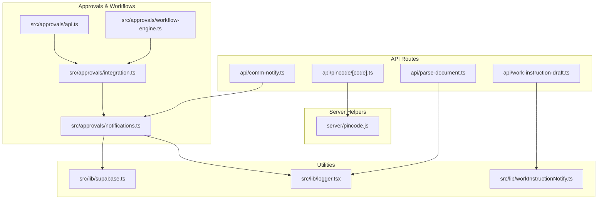
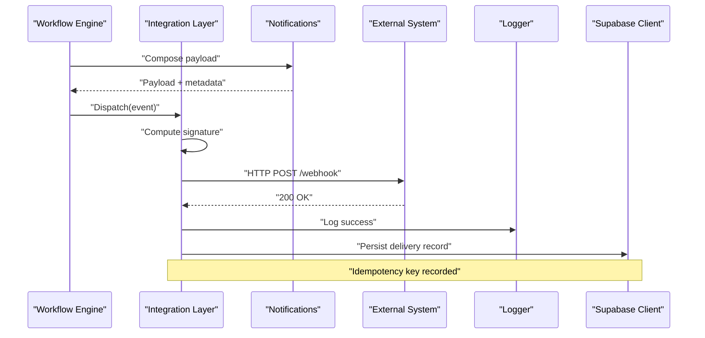
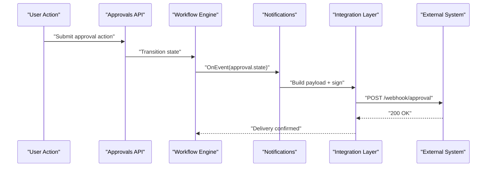
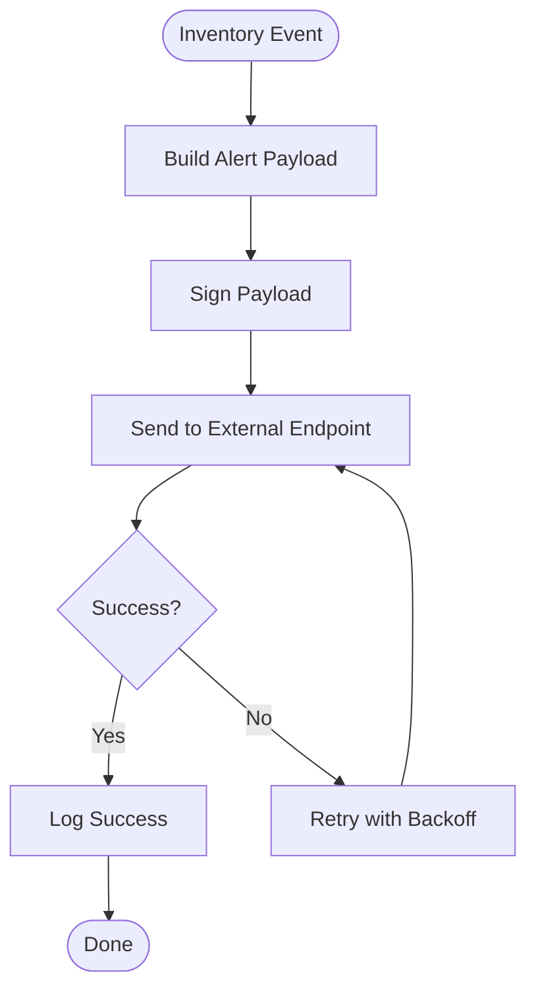
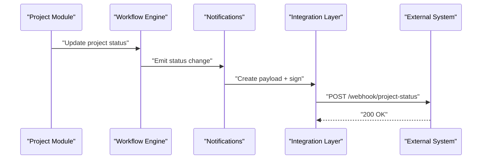
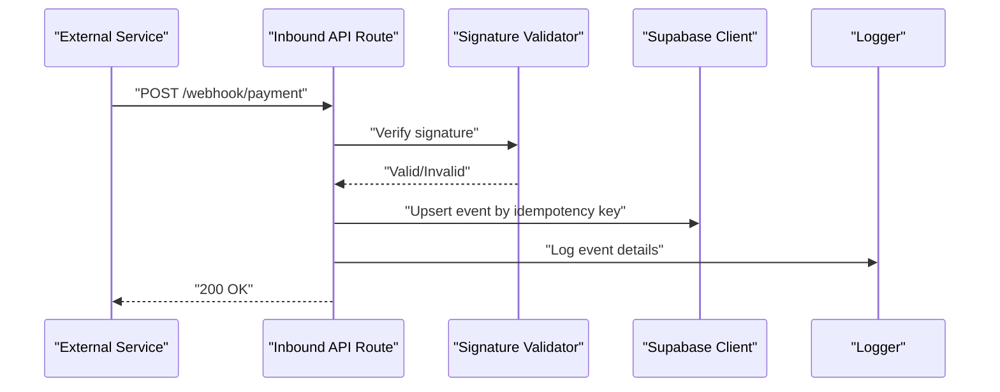
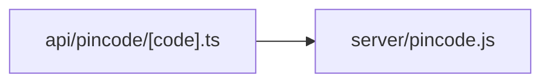
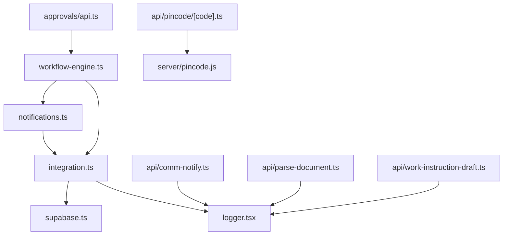

# Webhook Integrations

<cite>
**Referenced Files in This Document**
- [api/comm-notify.ts](file://api/comm-notify.ts)
- [src/approvals/api.ts](file://src/approvals/api.ts)
- [src/approvals/integration.ts](file://src/approvals/integration.ts)
- [src/approvals/notifications.ts](file://src/approvals/notifications.ts)
- [src/approvals/workflow-engine.ts](file://src/approvals/workflow-engine.ts)
- [src/lib/logger.tsx](file://src/lib/logger.tsx)
- [src/lib/supabase.ts](file://src/lib/supabase.ts)
- [src/lib/workInstructionNotify.ts](file://src/lib/workInstructionNotify.ts)
- [server/pincode.js](file://server/pincode.js)
- [api/pincode/[code].ts](file://api/pincode/[code].ts)
- [api/parse-document.ts](file://api/parse-document.ts)
- [api/work-instruction-draft.ts](file://api/work-instruction-draft.ts)
</cite>

## Table of Contents
1. [Introduction](#introduction)
2. [Project Structure](#project-structure)
3. [Core Components](#core-components)
4. [Architecture Overview](#architecture-overview)
5. [Detailed Component Analysis](#detailed-component-analysis)
6. [Dependency Analysis](#dependency-analysis)
7. [Performance Considerations](#performance-considerations)
8. [Troubleshooting Guide](#troubleshooting-guide)
9. [Conclusion](#conclusion)
10. [Appendices](#appendices)

## Introduction
This document provides comprehensive guidance for integrating webhooks into the MEP Project ERP system. It covers:
- Outbound webhook endpoints and payload formats for approval workflows, inventory alerts, and project status changes
- Signature verification mechanisms and security considerations
- Inbound webhook patterns for receiving events from payment gateways, email services, and third-party integrations
- Retry policies, error handling, idempotency, versioning, and backward compatibility strategies
- Testing, debugging, monitoring, and operational best practices

The goal is to enable reliable, secure, and maintainable integrations with external systems while preserving data consistency and auditability.

## Project Structure
Webhook-related functionality spans API routes, approvals integration, notifications, utilities, and server-side helpers. The following diagram maps key files involved in webhook flows.

**Diagram sources**
- [api/comm-notify.ts](file://api/comm-notify.ts)
- [api/pincode/[code].ts](file://api/pincode/[code].ts)
- [api/parse-document.ts](file://api/parse-document.ts)
- [api/work-instruction-draft.ts](file://api/work-instruction-draft.ts)
- [src/approvals/api.ts](file://src/approvals/api.ts)
- [src/approvals/integration.ts](file://src/approvals/integration.ts)
- [src/approvals/notifications.ts](file://src/approvals/notifications.ts)
- [src/approvals/workflow-engine.ts](file://src/approvals/workflow-engine.ts)
- [src/lib/logger.tsx](file://src/lib/logger.tsx)
- [src/lib/supabase.ts](file://src/lib/supabase.ts)
- [src/lib/workInstructionNotify.ts](file://src/lib/workInstructionNotify.ts)
- [server/pincode.js](file://server/pincode.js)

**Section sources**
- [api/comm-notify.ts](file://api/comm-notify.ts)
- [src/approvals/api.ts](file://src/approvals/api.ts)
- [src/approvals/integration.ts](file://src/approvals/integration.ts)
- [src/approvals/notifications.ts](file://src/approvals/notifications.ts)
- [src/approvals/workflow-engine.ts](file://src/approvals/workflow-engine.ts)
- [src/lib/logger.tsx](file://src/lib/logger.tsx)
- [src/lib/supabase.ts](file://src/lib/supabase.ts)
- [src/lib/workInstructionNotify.ts](file://src/lib/workInstructionNotify.ts)
- [server/pincode.js](file://server/pincode.js)
- [api/pincode/[code].ts](file://api/pincode/[code].ts)
- [api/parse-document.ts](file://api/parse-document.ts)
- [api/work-instruction-draft.ts](file://api/work-instruction-draft.ts)

## Core Components
- Approval workflow engine: orchestrates state transitions and triggers outbound notifications via integration and notification modules.
- Integration layer: abstracts outbound delivery (e.g., HTTP calls) and signature generation/validation.
- Notifications module: composes payloads and dispatches them through configured channels.
- Logger: centralizes structured logging for observability and debugging.
- Supabase client: used for persistence and event sourcing where applicable.
- Utility notify functions: domain-specific helpers (e.g., work instruction notifications).
- API routes: expose endpoints that may act as inbound webhook receivers or trigger outbound events.

Key responsibilities:
- Payload construction and versioning
- Signature computation and verification
- Idempotent processing and deduplication
- Retry scheduling and backoff
- Error classification and alerting
- Audit trail and correlation IDs

**Section sources**
- [src/approvals/workflow-engine.ts](file://src/approvals/workflow-engine.ts)
- [src/approvals/integration.ts](file://src/approvals/integration.ts)
- [src/approvals/notifications.ts](file://src/approvals/notifications.ts)
- [src/lib/logger.tsx](file://src/lib/logger.tsx)
- [src/lib/supabase.ts](file://src/lib/supabase.ts)
- [src/lib/workInstructionNotify.ts](file://src/lib/workInstructionNotify.ts)

## Architecture Overview
The webhook architecture separates concerns between workflow orchestration, integration delivery, and notifications. Outbound webhooks are generated by the workflow engine and dispatched via the integration layer, which handles signing and retries. Notifications compose payloads and route them to channels. Inbound webhooks are handled by API routes that validate signatures, enforce idempotency, and persist events.

**Diagram sources**
- [src/approvals/workflow-engine.ts](file://src/approvals/workflow-engine.ts)
- [src/approvals/integration.ts](file://src/approvals/integration.ts)
- [src/approvals/notifications.ts](file://src/approvals/notifications.ts)
- [src/lib/logger.tsx](file://src/lib/logger.tsx)
- [src/lib/supabase.ts](file://src/lib/supabase.ts)

## Detailed Component Analysis

### Approval Workflow Webhooks
Approval events drive outbound notifications when requests move through states such as pending, approved, or rejected. The workflow engine triggers notifications, which build payloads and delegate delivery to the integration layer.

Implementation references:
- Workflow orchestration and event triggers
- Integration abstraction for outbound delivery
- Notification composition and channel routing

**Diagram sources**
- [src/approvals/api.ts](file://src/approvals/api.ts)
- [src/approvals/workflow-engine.ts](file://src/approvals/workflow-engine.ts)
- [src/approvals/notifications.ts](file://src/approvals/notifications.ts)
- [src/approvals/integration.ts](file://src/approvals/integration.ts)

**Section sources**
- [src/approvals/api.ts](file://src/approvals/api.ts)
- [src/approvals/workflow-engine.ts](file://src/approvals/workflow-engine.ts)
- [src/approvals/notifications.ts](file://src/approvals/notifications.ts)
- [src/approvals/integration.ts](file://src/approvals/integration.ts)

### Inventory Alerts Webhooks
Inventory alerts are emitted when stock levels cross thresholds or anomalies are detected. The notifications module constructs alert payloads and dispatches them via the integration layer.

**Diagram sources**
- [src/approvals/notifications.ts](file://src/approvals/notifications.ts)
- [src/approvals/integration.ts](file://src/approvals/integration.ts)

**Section sources**
- [src/approvals/notifications.ts](file://src/approvals/notifications.ts)
- [src/approvals/integration.ts](file://src/approvals/integration.ts)

### Project Status Change Webhooks
When a project transitions to new statuses (e.g., active, on-hold, completed), the workflow engine emits events that result in outbound webhooks to subscribed systems.

**Diagram sources**
- [src/approvals/workflow-engine.ts](file://src/approvals/workflow-engine.ts)
- [src/approvals/notifications.ts](file://src/approvals/notifications.ts)
- [src/approvals/integration.ts](file://src/approvals/integration.ts)

**Section sources**
- [src/approvals/workflow-engine.ts](file://src/approvals/workflow-engine.ts)
- [src/approvals/notifications.ts](file://src/approvals/notifications.ts)
- [src/approvals/integration.ts](file://src/approvals/integration.ts)

### Inbound Webhooks: Payment Gateways, Email Services, Third Parties
Inbound webhooks are received via API routes. Each endpoint should:
- Validate request origin and signature
- Parse and normalize payload
- Enforce idempotency using unique event IDs
- Persist events and trigger downstream actions
- Return appropriate HTTP status codes

Example inbound endpoints:
- Payment confirmation handler
- Email delivery status callback
- Third-party integration callbacks

**Diagram sources**
- [api/comm-notify.ts](file://api/comm-notify.ts)
- [api/parse-document.ts](file://api/parse-document.ts)
- [api/work-instruction-draft.ts](file://api/work-instruction-draft.ts)
- [src/lib/supabase.ts](file://src/lib/supabase.ts)
- [src/lib/logger.tsx](file://src/lib/logger.tsx)

**Section sources**
- [api/comm-notify.ts](file://api/comm-notify.ts)
- [api/parse-document.ts](file://api/parse-document.ts)
- [api/work-instruction-draft.ts](file://api/work-instruction-draft.ts)
- [src/lib/supabase.ts](file://src/lib/supabase.ts)
- [src/lib/logger.tsx](file://src/lib/logger.tsx)

### Pincode Utilities and Server Helper
Pincode-related endpoints and server helper provide utility functions that can be leveraged by webhook handlers for validation or enrichment.

**Diagram sources**
- [api/pincode/[code].ts](file://api/pincode/[code].ts)
- [server/pincode.js](file://server/pincode.js)

**Section sources**
- [api/pincode/[code].ts](file://api/pincode/[code].ts)
- [server/pincode.js](file://server/pincode.js)

## Dependency Analysis
The following diagram shows dependencies among core components involved in webhook operations.

**Diagram sources**
- [src/approvals/workflow-engine.ts](file://src/approvals/workflow-engine.ts)
- [src/approvals/integration.ts](file://src/approvals/integration.ts)
- [src/approvals/notifications.ts](file://src/approvals/notifications.ts)
- [src/approvals/api.ts](file://src/approvals/api.ts)
- [src/lib/logger.tsx](file://src/lib/logger.tsx)
- [src/lib/supabase.ts](file://src/lib/supabase.ts)
- [api/comm-notify.ts](file://api/comm-notify.ts)
- [api/parse-document.ts](file://api/parse-document.ts)
- [api/work-instruction-draft.ts](file://api/work-instruction-draft.ts)
- [api/pincode/[code].ts](file://api/pincode/[code].ts)
- [server/pincode.js](file://server/pincode.js)

**Section sources**
- [src/approvals/workflow-engine.ts](file://src/approvals/workflow-engine.ts)
- [src/approvals/integration.ts](file://src/approvals/integration.ts)
- [src/approvals/notifications.ts](file://src/approvals/notifications.ts)
- [src/approvals/api.ts](file://src/approvals/api.ts)
- [src/lib/logger.tsx](file://src/lib/logger.tsx)
- [src/lib/supabase.ts](file://src/lib/supabase.ts)
- [api/comm-notify.ts](file://api/comm-notify.ts)
- [api/parse-document.ts](file://api/parse-document.ts)
- [api/work-instruction-draft.ts](file://api/work-instruction-draft.ts)
- [api/pincode/[code].ts](file://api/pincode/[code].ts)
- [server/pincode.js](file://server/pincode.js)

## Performance Considerations
- Batch outbound deliveries where possible to reduce network overhead.
- Use asynchronous queues for long-running webhook processing.
- Implement exponential backoff with jitter for retries.
- Cache frequently accessed configuration (e.g., secrets, endpoints) securely.
- Monitor latency and throughput; set timeouts and circuit breakers for external calls.
- Avoid synchronous database writes inside tight loops; prefer batched inserts.

[No sources needed since this section provides general guidance]

## Troubleshooting Guide
Common issues and resolutions:
- Signature mismatch: verify secret configuration and timestamp skew handling.
- Duplicate processing: ensure idempotency keys are enforced at ingestion and delivery layers.
- Delivery failures: inspect logs, retry counts, and external service health.
- Payload parsing errors: validate schema and handle malformed JSON gracefully.
- Rate limiting: implement client-side throttling and respect external limits.

Operational tips:
- Centralize logging with correlation IDs across request boundaries.
- Maintain an event replay mechanism for failed deliveries.
- Provide admin dashboards to inspect webhook history and reprocess events.

**Section sources**
- [src/lib/logger.tsx](file://src/lib/logger.tsx)
- [src/lib/supabase.ts](file://src/lib/supabase.ts)

## Conclusion
By separating workflow orchestration, integration delivery, and notifications, the MEP Project ERP system achieves robust, secure, and scalable webhook integrations. Adhering to signature verification, idempotency, retry policies, and versioning ensures reliability and backward compatibility. Comprehensive logging, testing, and monitoring complete the operational foundation for dependable external connectivity.

[No sources needed since this section summarizes without analyzing specific files]

## Appendices

### Security Considerations
- Payload validation: enforce strict schemas and reject unknown fields.
- Signature verification: compute HMAC over canonicalized payload and headers; compare with provided signature.
- Timestamp validation: reject requests older than a configurable window to prevent replay attacks.
- Access control: restrict webhook endpoints to known origins and require authentication tokens where applicable.
- Rate limiting: apply per-client rate limits and return appropriate responses when exceeded.
- Secrets management: store webhook secrets in environment variables or secret managers; rotate regularly.

[No sources needed since this section provides general guidance]

### Versioning and Backward Compatibility
- Include a version field in all payloads.
- Support multiple versions simultaneously during transition periods.
- Deprecate old versions with advance notice and migration guides.
- Maintain stable core fields; add optional fields for new features.
- Test backward compatibility in staging before production rollout.

[No sources needed since this section provides general guidance]

### Testing Strategies
- Unit tests for payload builders and signature computations.
- Contract tests against external service stubs.
- Chaos testing for retries and failure scenarios.
- Load testing to validate throughput and latency under stress.
- End-to-end tests simulating full inbound/outbound flows.

[No sources needed since this section provides general guidance]

### Debugging Tools and Monitoring
- Structured logs with correlation IDs and context.
- Metrics for delivery success rates, latency percentiles, and error categories.
- Alerting on sustained failures and signature mismatches.
- Dashboards for webhook activity and backlog size.
- Replay tools for reprocessing failed events.

**Section sources**
- [src/lib/logger.tsx](file://src/lib/logger.tsx)