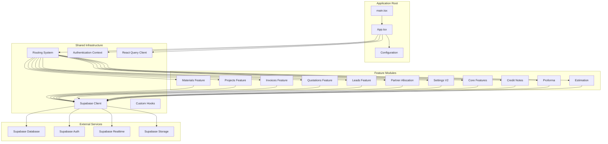
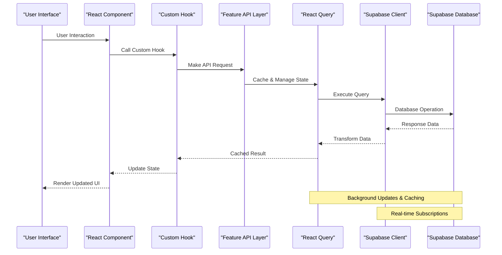
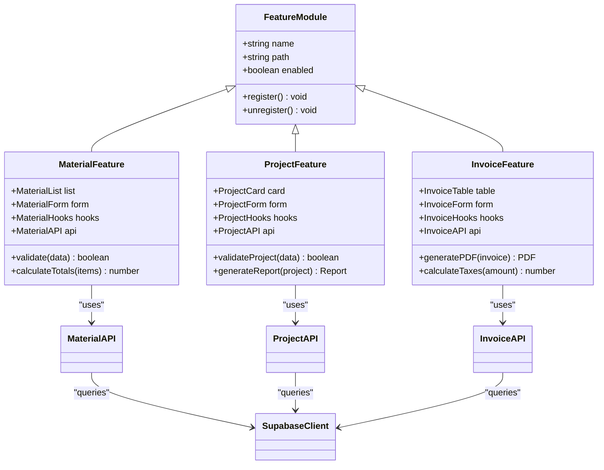
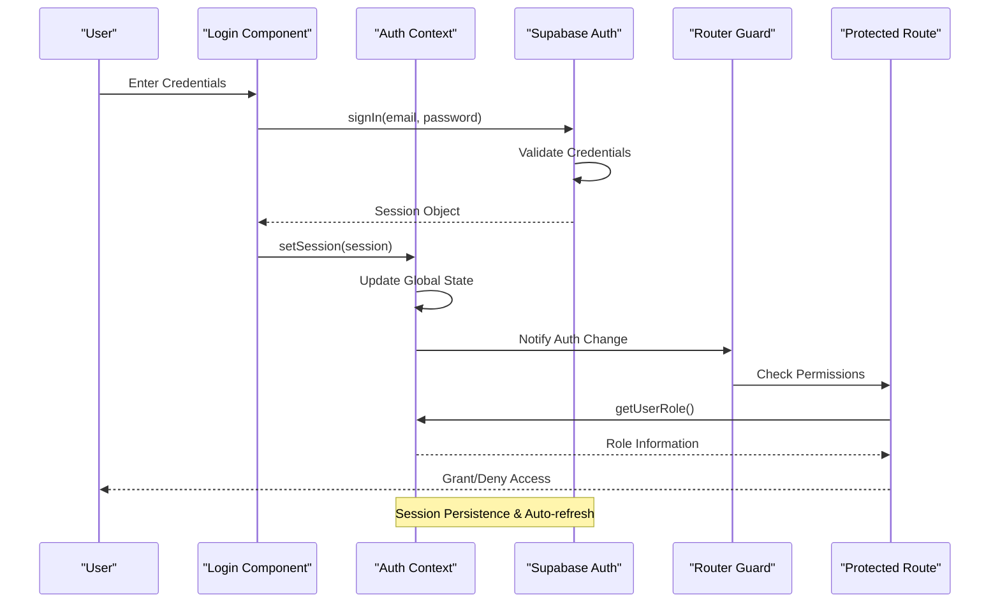
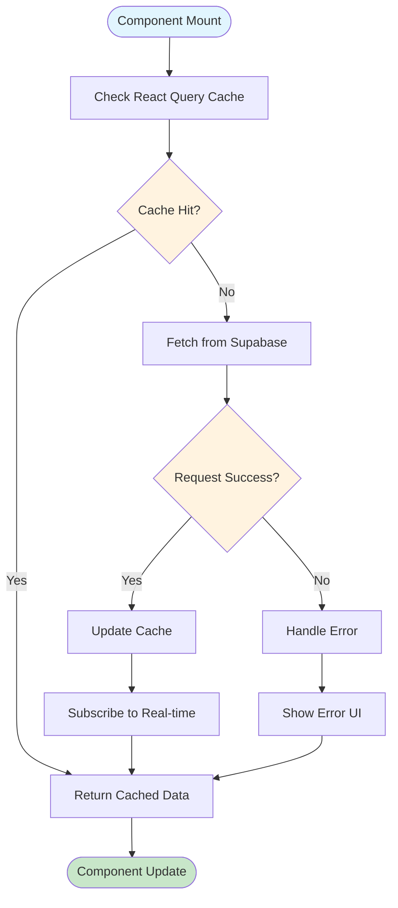
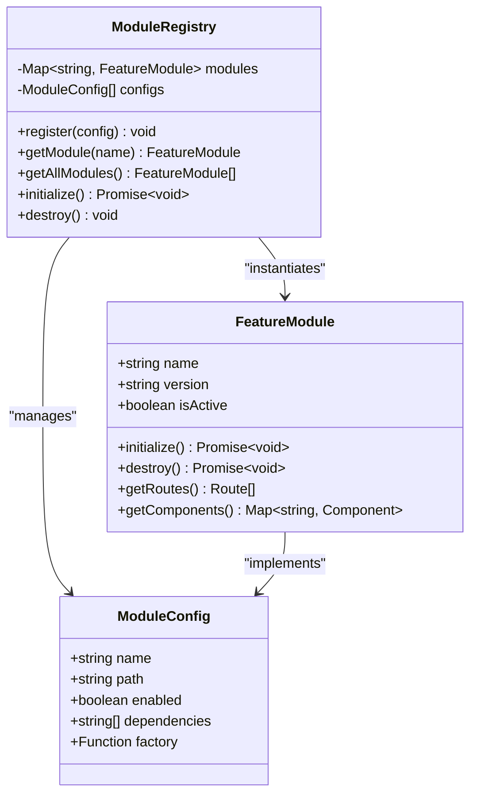
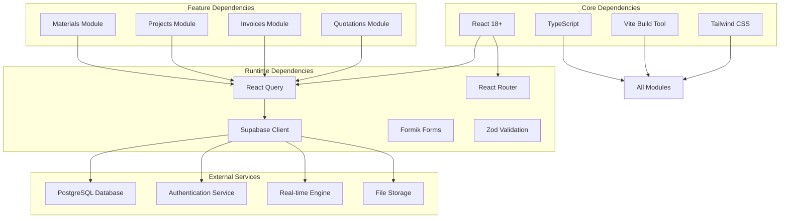

# Architecture Overview

<cite>
**Referenced Files in This Document**
- [package.json](file://package.json)
- [vite.config.js](file://vite.config.js)
- [tailwind.config.cjs](file://tailwind.config.cjs)
- [tsconfig.json](file://tsconfig.json)
- [index.html](file://index.html)
- [src/main.tsx](file://src/main.tsx)
- [src/App.tsx](file://src/App.tsx)
- [src/queryClient.ts](file://src/queryClient.ts)
- [src/config/queryClient.ts](file://src/config/queryClient.ts)
- [src/lib/supabase.ts](file://src/lib/supabase.ts)
- [src/contexts/AuthContext.tsx](file://src/contexts/AuthContext.tsx)
- [src/app/routing/index.ts](file://src/app/routing/index.ts)
- [src/app/routing/registry.ts](file://src/app/routing/registry.ts)
- [src/app/routing/types.ts](file://src/app/routing/types.ts)
- [src/config/module-registry.ts](file://src/config/module-registry.ts)
- [src/hooks/usePermissions.ts](file://src/hooks/usePermissions.ts)
- [src/hooks/usePresence.ts](file://src/hooks/usePresence.ts)
- [src/hooks/useAuditLog.ts](file://src/hooks/useAuditLog.ts)
- [src/hooks/useRequestManager.ts](file://src/hooks/useRequestManager.ts)
- [src/hooks/index.ts](file://src/hooks/index.ts)
- [src/features/materials/api.ts](file://src/features/materials/api.ts)
- [src/features/materials/hooks.ts](file://src/features/materials/hooks.ts)
- [src/features/materials/components/MaterialList.tsx](file://src/features/materials/components/MaterialList.tsx)
- [src/features/materials/pages/MaterialsPage.tsx](file://src/features/materials/pages/MaterialsPage.tsx)
- [src/features/projects/api.ts](file://src/features/projects/api.ts)
- [src/features/projects/hooks.ts](file://src/features/projects/hooks.ts)
- [src/features/projects/components/ProjectCard.tsx](file://src/features/projects/components/ProjectCard.tsx)
- [src/features/projects/pages/ProjectsPage.tsx](file://src/features/projects/pages/ProjectsPage.tsx)
- [src/features/invoices/api.ts](file://src/features/invoices/api.ts)
- [src/features/invoices/hooks.ts](file://src/features/invoices/hooks.ts)
- [src/features/invoices/components/InvoiceTable.tsx](file://src/features/invoices/components/InvoiceTable.tsx)
- [src/features/invoices/pages/InvoicesPage.tsx](file://src/features/invoices/pages/InvoicesPage.tsx)
- [src/features/quotation/api.ts](file://src/features/quotation/api.ts)
- [src/features/quotation/hooks.ts](file://src/features/quotation/hooks.ts)
- [src/features/quotation/components/QuotationForm.tsx](file://src/features/quotation/components/QuotationForm.tsx)
- [src/features/quotation/pages/QuotationPage.tsx](file://src/features/quotation/pages/QuotationPage.tsx)
- [src/features/leads/api.ts](file://src/features/leads/api.ts)
- [src/features/leads/hooks.ts](file://src/features/leads/hooks.ts)
- [src/features/leads/components/LeadCard.tsx](file://src/features/leads/components/LeadCard.tsx)
- [src/features/leads/pages/LeadsPage.tsx](file://src/features/leads/pages/LeadsPage.tsx)
- [src/features/partner-allocation/api.ts](file://src/features/partner-allocation/api.ts)
- [src/features/partner-allocation/hooks.ts](file://src/features/partner-allocation/hooks.ts)
- [src/features/partner-allocation/components/AllocationTable.tsx](file://src/features/partner-allocation/components/AllocationTable.tsx)
- [src/features/partner-allocation/pages/PartnerAllocationPage.tsx](file://src/features/partner-allocation/pages/PartnerAllocationPage.tsx)
- [src/features/settings-v2/api.ts](file://src/features/settings-v2/api.ts)
- [src/features/settings-v2/hooks.ts](file://src/features/settings-v2/hooks.ts)
- [src/features/settings-v2/components/SettingsPanel.tsx](file://src/features/settings-v2/components/SettingsPanel.tsx)
- [src/features/settings-v2/pages/SettingsPage.tsx](file://src/features/settings-v2/pages/SettingsPage.tsx)
- [src/features/core/api.ts](file://src/features/core/api.ts)
- [src/features/core/hooks.ts](file://src/features/core/hooks.ts)
- [src/features/core/components/CoreDashboard.tsx](file://src/features/core/components/CoreDashboard.tsx)
- [src/features/core/pages/CorePage.tsx](file://src/features/core/pages/CorePage.tsx)
- [src/features/credit-notes/api.ts](file://src/features/credit-notes/api.ts)
- [src/features/credit-notes/hooks.ts](file://src/features/credit-notes/hooks.ts)
- [src/features/credit-notes/components/CreditNoteForm.tsx](file://src/features/credit-notes/components/CreditNoteForm.tsx)
- [src/features/credit-notes/pages/CreditNotesPage.tsx](file://src/features/credit-notes/pages/CreditNotesPage.tsx)
- [src/features/proforma/api.ts](file://src/features/proforma/api.ts)
- [src/features/proforma/hooks.ts](file://src/features/proforma/hooks.ts)
- [src/features/proforma/components/ProformaDocument.tsx](file://src/features/proforma/components/ProformaDocument.tsx)
- [src/features/proforma/pages/ProformaPage.tsx](file://src/features/proforma/pages/ProformaPage.tsx)
- [src/features/estimation/api.ts](file://src/features/estimation/api.ts)
- [src/features/estimation/hooks.ts](file://src/features/estimation/hooks.ts)
- [src/features/estimation/components/EstimationCalculator.tsx](file://src/features/estimation/components/EstimationCalculator.tsx)
- [src/features/estimation/pages/EstimationPage.tsx](file://src/features/estimation/pages/EstimationPage.tsx)
- [src/features/invoices/components/InvoicePDF.tsx](file://src/features/invoices/components/InvoicePDF.tsx)
- [src/features/invoices/utils/pdf-generator.ts](file://src/features/invoices/utils/pdf-generator.ts)
- [src/features/materials/utils/calculations.ts](file://src/features/materials/utils/calculations.ts)
- [src/features/projects/utils/project-validator.ts](file://src/features/projects/utils/project-validator.ts)
- [src/features/quotation/utils/quotation-workflow.ts](file://src/features/quotation/utils/quotation-workflow.ts)
- [src/features/leads/utils/lead-scoring.ts](file://src/features/leads/utils/lead-scoring.ts)
- [src/features/partner-allocation/utils/allocation-calculator.ts](file://src/features/partner-allocation/utils/allocation-calculator.ts)
- [src/features/settings-v2/utils/settings-validator.ts](file://src/features/settings-v2/utils/settings-validator.ts)
- [src/features/core/utils/dashboard-analytics.ts](file://src/features/core/utils/dashboard-analytics.ts)
- [src/features/credit-notes/utils/credit-note-calculator.ts](file://src/features/credit-notes/utils/credit-note-calculator.ts)
- [src/features/proforma/utils/proforma-generator.ts](file://src/features/proforma/utils/proforma-generator.ts)
- [src/features/estimation/utils/estimation-formulas.ts](file://src/features/estimation/utils/estimation-formulas.ts)
</cite>

## Table of Contents
1. [Introduction](#introduction)
2. [Project Structure](#project-structure)
3. [Core Components](#core-components)
4. [Architecture Overview](#architecture-overview)
5. [Detailed Component Analysis](#detailed-component-analysis)
6. [Dependency Analysis](#dependency-analysis)
7. [Performance Considerations](#performance-considerations)
8. [Troubleshooting Guide](#troubleshooting-guide)
9. [Conclusion](#conclusion)
10. [Appendices](#appendices)

## Introduction
This document presents the architecture of the MEP Project ERP system, a React-based enterprise application with Supabase as the backend service layer. The system follows a feature-driven architecture pattern, component-based UI design, and hook-based logic abstraction. It leverages modern web technologies including React 18+, TypeScript, Vite for build optimization, Tailwind CSS for styling, and Supabase for authentication, database, real-time capabilities, and storage services.

The application is designed to handle complex business workflows across multiple domains including project management, materials tracking, invoicing, quotations, lead management, partner allocation, and settings configuration. Each feature module encapsulates its own API layer, hooks, components, and business logic, promoting maintainability and scalability.

## Project Structure
The application follows a feature-driven architecture where each business domain is organized into separate modules with consistent internal structure:

**Diagram sources**
- [src/main.tsx:1-50](file://src/main.tsx#L1-L50)
- [src/App.tsx:1-100](file://src/App.tsx#L1-L100)
- [src/app/routing/index.ts:1-50](file://src/app/routing/index.ts#L1-L50)
- [src/config/module-registry.ts:1-100](file://src/config/module-registry.ts#L1-L100)

**Section sources**
- [package.json:1-50](file://package.json#L1-L50)
- [vite.config.js:1-100](file://vite.config.js#L1-L100)
- [tailwind.config.cjs:1-50](file://tailwind.config.cjs#L1-L50)
- [tsconfig.json:1-50](file://tsconfig.json#L1-L50)
- [index.html:1-50](file://index.html#L1-L50)

## Core Components
The MEP Project ERP system is built around several core architectural components that provide foundational functionality across all features:

### Application Bootstrap and Configuration
The application initialization process handles environment setup, dependency injection, and global configuration through the main entry point and application root component.

### Module Registration System
A centralized module registry manages feature discovery, lazy loading, and runtime registration of new modules without requiring application restarts.

### Authentication and Authorization Context
Global authentication state management provides user session handling, role-based access control, and permission evaluation across the entire application.

### Data Layer Abstraction
React Query integration provides caching, background updates, optimistic updates, and error handling for all data operations with Supabase.

**Section sources**
- [src/main.tsx:1-100](file://src/main.tsx#L1-L100)
- [src/App.tsx:1-150](file://src/App.tsx#L1-L150)
- [src/config/queryClient.ts:1-100](file://src/config/queryClient.ts#L1-L100)
- [src/contexts/AuthContext.tsx:1-200](file://src/contexts/AuthContext.tsx#L1-L200)

## Architecture Overview
The system follows a layered architecture pattern with clear separation of concerns between presentation, business logic, and data access layers.

**Diagram sources**
- [src/features/materials/hooks.ts:1-100](file://src/features/materials/hooks.ts#L1-L100)
- [src/features/materials/api.ts:1-100](file://src/features/materials/api.ts#L1-L100)
- [src/queryClient.ts:1-100](file://src/queryClient.ts#L1-L100)
- [src/lib/supabase.ts:1-100](file://src/lib/supabase.ts#L1-L100)

### Technology Stack Architecture
The technology stack is carefully selected to provide optimal performance, developer experience, and scalability:

- **Frontend Framework**: React 18+ with concurrent features and Suspense
- **Type Safety**: TypeScript with strict mode and comprehensive type definitions
- **Build Tool**: Vite for fast development server and optimized production builds
- **Styling**: Tailwind CSS with custom theme configuration and utility-first approach
- **State Management**: React Query for server state with automatic caching and synchronization
- **Backend Services**: Supabase providing PostgreSQL database, authentication, real-time subscriptions, and file storage
- **UI Components**: Custom component library built on shadcn/ui primitives

**Section sources**
- [package.json:1-100](file://package.json#L1-L100)
- [vite.config.js:1-150](file://vite.config.js#L1-L150)
- [tailwind.config.cjs:1-100](file://tailwind.config.cjs#L1-L100)
- [tsconfig.json:1-100](file://tsconfig.json#L1-L100)

## Detailed Component Analysis

### Feature Module Architecture
Each feature module follows a consistent structure with clear separation of concerns:

**Diagram sources**
- [src/config/module-registry.ts:1-150](file://src/config/module-registry.ts#L1-L150)
- [src/features/materials/components/MaterialList.tsx:1-100](file://src/features/materials/components/MaterialList.tsx#L1-L100)
- [src/features/projects/components/ProjectCard.tsx:1-100](file://src/features/projects/components/ProjectCard.tsx#L1-L100)
- [src/features/invoices/components/InvoiceTable.tsx:1-100](file://src/features/invoices/components/InvoiceTable.tsx#L1-L100)

### Authentication and Authorization Flow
The authentication system provides secure user management with role-based access control:

**Diagram sources**
- [src/contexts/AuthContext.tsx:1-200](file://src/contexts/AuthContext.tsx#L1-L200)
- [src/hooks/usePermissions.ts:1-100](file://src/hooks/usePermissions.ts#L1-L100)

### Data Flow Architecture
The data flow follows a unidirectional pattern with React Query managing server state:

**Diagram sources**
- [src/queryClient.ts:1-150](file://src/queryClient.ts#L1-L150)
- [src/features/materials/hooks.ts:1-100](file://src/features/materials/hooks.ts#L1-L100)

### Module Registration System
The dynamic module registration system enables hot-swapping of features at runtime:

**Diagram sources**
- [src/config/module-registry.ts:1-200](file://src/config/module-registry.ts#L1-L200)
- [src/app/routing/registry.ts:1-100](file://src/app/routing/registry.ts#L1-L100)

**Section sources**
- [src/config/module-registry.ts:1-200](file://src/config/module-registry.ts#L1-L200)
- [src/app/routing/index.ts:1-100](file://src/app/routing/index.ts#L1-L100)
- [src/app/routing/types.ts:1-100](file://src/app/routing/types.ts#L1-L100)

## Dependency Analysis
The system maintains loose coupling between modules while ensuring proper dependency management:

**Diagram sources**
- [package.json:1-150](file://package.json#L1-L150)
- [vite.config.js:1-100](file://vite.config.js#L1-L100)

**Section sources**
- [package.json:1-200](file://package.json#L1-L200)
- [tsconfig.json:1-100](file://tsconfig.json#L1-L100)

## Performance Considerations
The system implements several performance optimization strategies:

### Code Splitting and Lazy Loading
Features are loaded on-demand using dynamic imports, reducing initial bundle size and improving load times.

### React Query Optimization
Intelligent caching strategies with configurable stale times, background refetching, and optimistic updates minimize network requests.

### Virtualization for Large Lists
Large datasets use virtual scrolling to render only visible items, maintaining smooth performance with thousands of records.

### Image Optimization
Automatic image compression and lazy loading reduce bandwidth usage and improve page load performance.

### Database Query Optimization
Efficient Supabase queries with proper indexing, selective field fetching, and query result caching.

## Troubleshooting Guide

### Common Authentication Issues
- Verify Supabase configuration in environment variables
- Check browser console for CORS errors
- Ensure proper session persistence configuration
- Validate user roles and permissions in database

### Data Synchronization Problems
- Monitor React Query cache status and invalidation
- Check Supabase real-time subscription connections
- Verify database row-level security policies
- Inspect network requests for failed API calls

### Performance Bottlenecks
- Use React DevTools Profiler to identify slow components
- Monitor bundle size with Vite analyzer
- Check database query performance in Supabase dashboard
- Analyze network waterfall for slow-loading resources

**Section sources**
- [src/contexts/AuthContext.tsx:150-200](file://src/contexts/AuthContext.tsx#L150-L200)
- [src/queryClient.ts:100-150](file://src/queryClient.ts#L100-L150)
- [src/hooks/useRequestManager.ts:1-100](file://src/hooks/useRequestManager.ts#L1-L100)

## Conclusion
The MEP Project ERP system demonstrates a well-architected enterprise application built with modern web technologies. The feature-driven architecture promotes maintainability and scalability, while the hook-based logic abstraction ensures clean separation of concerns. The integration with Supabase provides a robust backend infrastructure with real-time capabilities, making it suitable for collaborative enterprise environments.

The system's modular design allows for easy extension and customization, while the comprehensive error handling and monitoring capabilities ensure reliability in production environments. The performance optimizations and best practices implemented throughout the codebase make it a solid foundation for enterprise-grade applications.

## Appendices

### Deployment Topology
The application supports multiple deployment strategies:

- **Static Hosting**: Vercel, Netlify, or GitHub Pages for frontend deployment
- **Container Orchestration**: Docker containers with Kubernetes for scalable deployments
- **Serverless Architecture**: Edge functions for API endpoints with Supabase Functions
- **Multi-region Deployment**: Geographic distribution for improved latency

### Scalability Considerations
- Horizontal scaling through container orchestration
- Database read replicas for high-traffic scenarios
- CDN integration for static asset delivery
- Load balancing across multiple application instances

### Security Best Practices
- Environment variable management for sensitive configuration
- Input validation and sanitization throughout the application
- Proper authentication and authorization checks
- Secure headers and CORS configuration
- Regular security audits and dependency updates