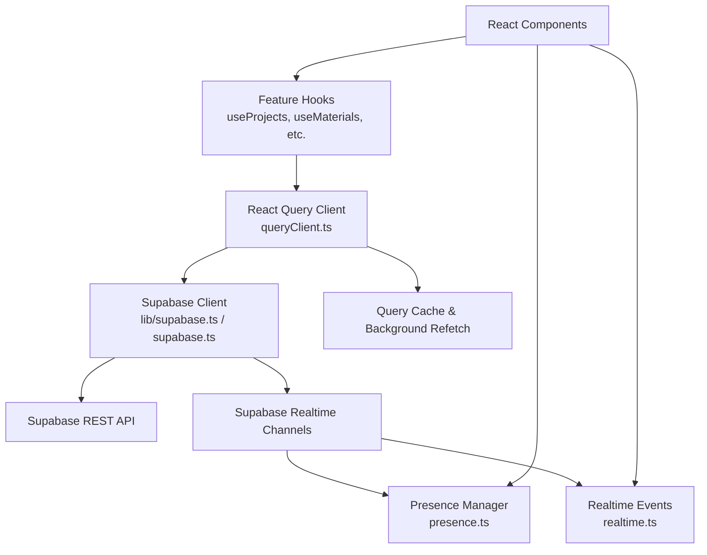
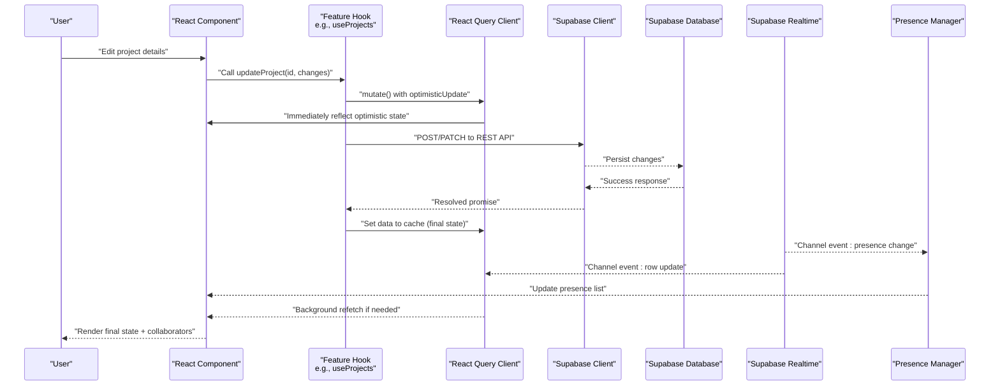
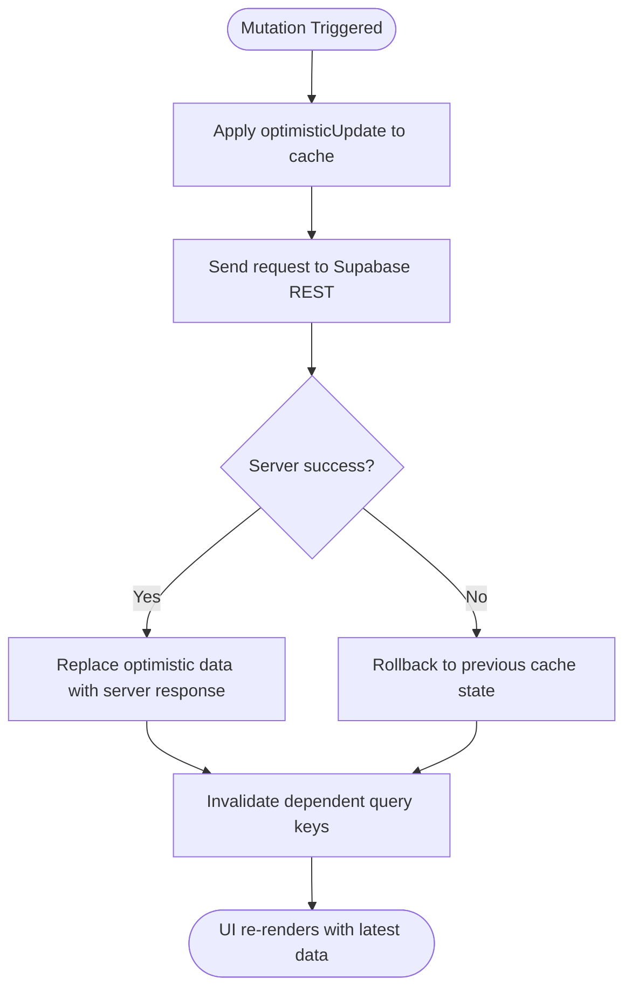
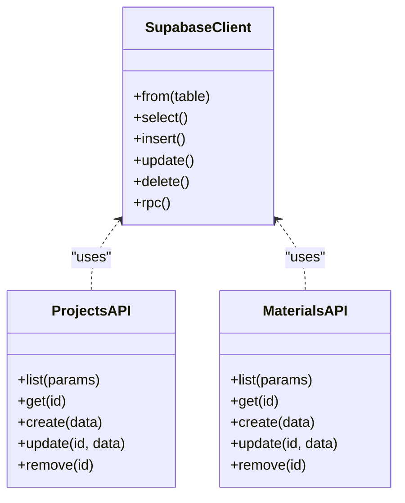
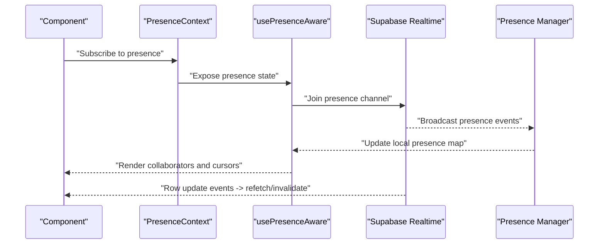
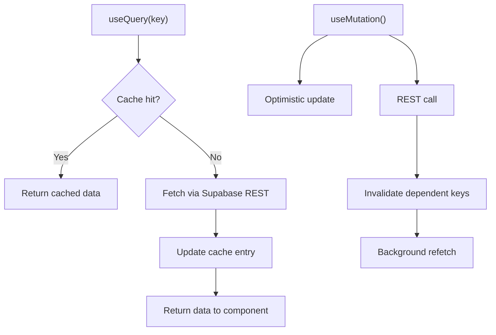
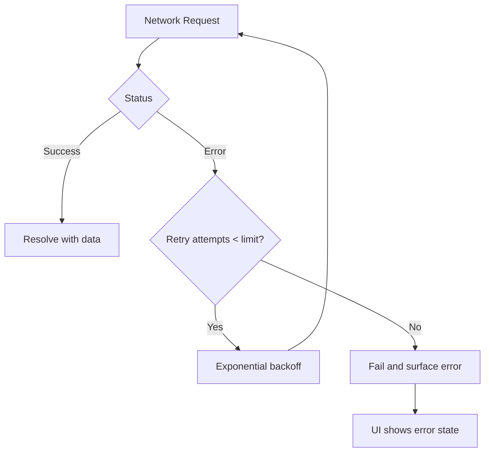
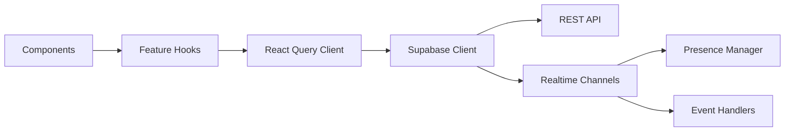

# Data Flow Architecture

<cite>
**Referenced Files in This Document**
- [queryClient.ts](file://src/queryClient.ts)
- [config/queryClient.ts](file://src/config/queryClient.ts)
- [lib/supabase.ts](file://src/lib/supabase.ts)
- [supabase.ts](file://src/supabase.ts)
- [hooks/usePresence.ts](file://src/hooks/usePresence.ts)
- [hooks/PresenceContext.tsx](file://src/hooks/PresenceContext.tsx)
- [hooks/usePresenceAware.ts](file://src/hooks/usePresenceAware.ts)
- [examples/PresenceAwareExample.tsx](file://src/examples/PresenceAwareExample.tsx)
- [hooks/index.ts](file://src/hooks/index.ts)
- [hooks/useProjects.ts](file://src/hooks/useProjects.ts)
- [hooks/useMaterials.ts](file://src/hooks/useMaterials.ts)
- [hooks/useMeasurementSheets.ts](file://src/hooks/useMeasurementSheets.ts)
- [api.ts](file://src/api.ts)
- [features/projects/hooks.ts](file://src/features/projects/hooks.ts)
- [features/materials/hooks.ts](file://src/features/materials/hooks.ts)
- [subscriptions/presence.ts](file://src/subscriptions/presence.ts)
- [subscriptions/realtime.ts](file://src/subscriptions/realtime.ts)
</cite>

## Table of Contents
1. [Introduction](#introduction)
2. [Project Structure](#project-structure)
3. [Core Components](#core-components)
4. [Architecture Overview](#architecture-overview)
5. [Detailed Component Analysis](#detailed-component-analysis)
6. [Dependency Analysis](#dependency-analysis)
7. [Performance Considerations](#performance-considerations)
8. [Troubleshooting Guide](#troubleshooting-guide)
9. [Conclusion](#conclusion)

## Introduction
This document explains the data flow architecture of the MEP Project system with a focus on how client-server communication, caching, real-time collaboration, and error handling work together to deliver responsive, consistent user experiences. The system uses Supabase as the backend (REST API and real-time channels), React Query for client-side caching and background updates, and presence-aware hooks to enable collaborative editing and awareness features.

## Project Structure
The data layer is organized around:
- A centralized React Query configuration and provider setup
- Supabase client initialization and typed helpers
- Feature-scoped hooks that encapsulate queries and mutations
- Real-time subscriptions and presence management utilities
- Example components demonstrating usage patterns

**Diagram sources**
- [queryClient.ts](file://src/queryClient.ts)
- [config/queryClient.ts](file://src/config/queryClient.ts)
- [lib/supabase.ts](file://src/lib/supabase.ts)
- [supabase.ts](file://src/supabase.ts)
- [hooks/usePresence.ts](file://src/hooks/usePresence.ts)
- [hooks/PresenceContext.tsx](file://src/hooks/PresenceContext.tsx)
- [hooks/usePresenceAware.ts](file://src/hooks/usePresenceAware.ts)
- [examples/PresenceAwareExample.tsx](file://src/examples/PresenceAwareExample.tsx)
- [hooks/index.ts](file://src/hooks/index.ts)
- [hooks/useProjects.ts](file://src/hooks/useProjects.ts)
- [hooks/useMaterials.ts](file://src/hooks/useMaterials.ts)
- [hooks/useMeasurementSheets.ts](file://src/hooks/useMeasurementSheets.ts)
- [api.ts](file://src/api.ts)
- [features/projects/hooks.ts](file://src/features/projects/hooks.ts)
- [features/materials/hooks.ts](file://src/features/materials/hooks.ts)
- [subscriptions/presence.ts](file://src/subscriptions/presence.ts)
- [subscriptions/realtime.ts](file://src/subscriptions/realtime.ts)

**Section sources**
- [queryClient.ts](file://src/queryClient.ts)
- [config/queryClient.ts](file://src/config/queryClient.ts)
- [lib/supabase.ts](file://src/lib/supabase.ts)
- [supabase.ts](file://src/supabase.ts)
- [hooks/index.ts](file://src/hooks/index.ts)

## Core Components
- React Query Client: Centralized configuration for caching, retries, refetch intervals, and optimistic updates.
- Supabase Client: Typed client used by feature hooks to perform REST calls and subscribe to real-time events.
- Feature Hooks: Encapsulated query and mutation logic per domain (projects, materials, measurement sheets).
- Real-time Subscriptions: Presence and channel-based event listeners for live updates.
- Presence Management: Context and hooks to track active collaborators and cursor states.

Key responsibilities:
- Caching and background updates via React Query
- Optimistic UI updates with rollback strategies
- Real-time synchronization through Supabase channels
- Error boundaries and retry policies at the query level

**Section sources**
- [queryClient.ts](file://src/queryClient.ts)
- [config/queryClient.ts](file://src/config/queryClient.ts)
- [hooks/useProjects.ts](file://src/hooks/useProjects.ts)
- [hooks/useMaterials.ts](file://src/hooks/useMaterials.ts)
- [hooks/useMeasurementSheets.ts](file://src/hooks/useMeasurementSheets.ts)
- [hooks/usePresence.ts](file://src/hooks/usePresence.ts)
- [hooks/PresenceContext.tsx](file://src/hooks/PresenceContext.tsx)
- [hooks/usePresenceAware.ts](file://src/hooks/usePresenceAware.ts)
- [examples/PresenceAwareExample.tsx](file://src/examples/PresenceAwareExample.tsx)
- [subscriptions/presence.ts](file://src/subscriptions/presence.ts)
- [subscriptions/realtime.ts](file://src/subscriptions/realtime.ts)

## Architecture Overview
End-to-end data flow from user interactions to database updates and back to UI rendering:

**Diagram sources**
- [hooks/useProjects.ts](file://src/hooks/useProjects.ts)
- [hooks/useMaterials.ts](file://src/hooks/useMaterials.ts)
- [hooks/useMeasurementSheets.ts](file://src/hooks/useMeasurementSheets.ts)
- [queryClient.ts](file://src/queryClient.ts)
- [lib/supabase.ts](file://src/lib/supabase.ts)
- [supabase.ts](file://src/supabase.ts)
- [hooks/usePresence.ts](file://src/hooks/usePresence.ts)
- [hooks/PresenceContext.tsx](file://src/hooks/PresenceContext.tsx)
- [hooks/usePresenceAware.ts](file://src/hooks/usePresenceAware.ts)
- [examples/PresenceAwareExample.tsx](file://src/examples/PresenceAwareExample.tsx)
- [subscriptions/presence.ts](file://src/subscriptions/presence.ts)
- [subscriptions/realtime.ts](file://src/subscriptions/realtime.ts)

## Detailed Component Analysis

### React Query Integration
- Configuration: Global defaults for stale time, cache time, retry count, and refetch behavior are set in the React Query client.
- Caching: Queries are cached by key; background refetches occur based on configured intervals or triggers.
- Optimistic Updates: Mutations apply an immediate optimistic result to the cache, then reconcile with server responses. On failure, the cache is rolled back to the previous state.
- Cache Invalidation: After successful mutations, dependent keys are invalidated to trigger refetches across related views.

**Diagram sources**
- [queryClient.ts](file://src/queryClient.ts)
- [config/queryClient.ts](file://src/config/queryClient.ts)
- [hooks/useProjects.ts](file://src/hooks/useProjects.ts)
- [hooks/useMaterials.ts](file://src/hooks/useMaterials.ts)
- [hooks/useMeasurementSheets.ts](file://src/hooks/useMeasurementSheets.ts)

**Section sources**
- [queryClient.ts](file://src/queryClient.ts)
- [config/queryClient.ts](file://src/config/queryClient.ts)
- [hooks/useProjects.ts](file://src/hooks/useProjects.ts)
- [hooks/useMaterials.ts](file://src/hooks/useMaterials.ts)
- [hooks/useMeasurementSheets.ts](file://src/hooks/useMeasurementSheets.ts)

### Supabase REST API Usage
- Client Initialization: The Supabase client is created and exported for use across the app.
- Typed Helpers: Feature hooks call typed methods to fetch lists, get single records, and perform mutations.
- Authentication: Requests include session context automatically via the client.

**Diagram sources**
- [lib/supabase.ts](file://src/lib/supabase.ts)
- [supabase.ts](file://src/supabase.ts)
- [hooks/useProjects.ts](file://src/hooks/useProjects.ts)
- [hooks/useMaterials.ts](file://src/hooks/useMaterials.ts)
- [api.ts](file://src/api.ts)

**Section sources**
- [lib/supabase.ts](file://src/lib/supabase.ts)
- [supabase.ts](file://src/supabase.ts)
- [hooks/useProjects.ts](file://src/hooks/useProjects.ts)
- [hooks/useMaterials.ts](file://src/hooks/useMaterials.ts)
- [api.ts](file://src/api.ts)

### Real-time Collaboration and Presence
- Presence Awareness: Users join presence channels to broadcast their identity and cursor state. Other clients receive presence joins/leaves and can update the UI accordingly.
- Live Edits: Realtime channels listen to row-level changes and broadcast them to subscribers, enabling concurrent editing without manual refresh.
- Contextual Hooks: Presence context provides access to current users and cursors; presence-aware hooks simplify integration into components.

**Diagram sources**
- [hooks/PresenceContext.tsx](file://src/hooks/PresenceContext.tsx)
- [hooks/usePresence.ts](file://src/hooks/usePresence.ts)
- [hooks/usePresenceAware.ts](file://src/hooks/usePresenceAware.ts)
- [examples/PresenceAwareExample.tsx](file://src/examples/PresenceAwareExample.tsx)
- [subscriptions/presence.ts](file://src/subscriptions/presence.ts)
- [subscriptions/realtime.ts](file://src/subscriptions/realtime.ts)

**Section sources**
- [hooks/PresenceContext.tsx](file://src/hooks/PresenceContext.tsx)
- [hooks/usePresence.ts](file://src/hooks/usePresence.ts)
- [hooks/usePresenceAware.ts](file://src/hooks/usePresenceAware.ts)
- [examples/PresenceAwareExample.tsx](file://src/examples/PresenceAwareExample.tsx)
- [subscriptions/presence.ts](file://src/subscriptions/presence.ts)
- [subscriptions/realtime.ts](file://src/subscriptions/realtime.ts)

### Data Fetching Strategies
- Query Hooks: Each feature exposes hooks that wrap React Query’s useQuery for reading data. Keys are composed to ensure precise invalidation.
- Mutations: useMutation-based hooks handle create/update/delete operations with optimistic updates and automatic cache invalidation.
- Cache Invalidation Patterns: After mutations, related query keys are invalidated to keep lists and detail views consistent.

**Diagram sources**
- [hooks/useProjects.ts](file://src/hooks/useProjects.ts)
- [hooks/useMaterials.ts](file://src/hooks/useMaterials.ts)
- [hooks/useMeasurementSheets.ts](file://src/hooks/useMeasurementSheets.ts)
- [features/projects/hooks.ts](file://src/features/projects/hooks.ts)
- [features/materials/hooks.ts](file://src/features/materials/hooks.ts)

**Section sources**
- [hooks/useProjects.ts](file://src/hooks/useProjects.ts)
- [hooks/useMaterials.ts](file://src/hooks/useMaterials.ts)
- [hooks/useMeasurementSheets.ts](file://src/hooks/useMeasurementSheets.ts)
- [features/projects/hooks.ts](file://src/features/projects/hooks.ts)
- [features/materials/hooks.ts](file://src/features/materials/hooks.ts)

### Error Handling, Retries, and Offline Support
- Retry Policies: React Query retry options control exponential backoff and retry counts for failed requests.
- Error Boundaries: Components can consume error states from hooks and display user-friendly messages.
- Offline Considerations: While not fully implemented here, offline support can be layered using service workers and local storage caches keyed by React Query keys.

**Diagram sources**
- [queryClient.ts](file://src/queryClient.ts)
- [config/queryClient.ts](file://src/config/queryClient.ts)

**Section sources**
- [queryClient.ts](file://src/queryClient.ts)
- [config/queryClient.ts](file://src/config/queryClient.ts)

## Dependency Analysis
High-level dependencies between core modules:

**Diagram sources**
- [hooks/index.ts](file://src/hooks/index.ts)
- [hooks/useProjects.ts](file://src/hooks/useProjects.ts)
- [hooks/useMaterials.ts](file://src/hooks/useMaterials.ts)
- [hooks/useMeasurementSheets.ts](file://src/hooks/useMeasurementSheets.ts)
- [queryClient.ts](file://src/queryClient.ts)
- [lib/supabase.ts](file://src/lib/supabase.ts)
- [supabase.ts](file://src/supabase.ts)
- [hooks/usePresence.ts](file://src/hooks/usePresence.ts)
- [hooks/PresenceContext.tsx](file://src/hooks/PresenceContext.tsx)
- [hooks/usePresenceAware.ts](file://src/hooks/usePresenceAware.ts)
- [examples/PresenceAwareExample.tsx](file://src/examples/PresenceAwareExample.tsx)
- [subscriptions/presence.ts](file://src/subscriptions/presence.ts)
- [subscriptions/realtime.ts](file://src/subscriptions/realtime.ts)

**Section sources**
- [hooks/index.ts](file://src/hooks/index.ts)
- [hooks/useProjects.ts](file://src/hooks/useProjects.ts)
- [hooks/useMaterials.ts](file://src/hooks/useMaterials.ts)
- [hooks/useMeasurementSheets.ts](file://src/hooks/useMeasurementSheets.ts)
- [queryClient.ts](file://src/queryClient.ts)
- [lib/supabase.ts](file://src/lib/supabase.ts)
- [supabase.ts](file://src/supabase.ts)
- [hooks/usePresence.ts](file://src/hooks/usePresence.ts)
- [hooks/PresenceContext.tsx](file://src/hooks/PresenceContext.tsx)
- [hooks/usePresenceAware.ts](file://src/hooks/usePresenceAware.ts)
- [examples/PresenceAwareExample.tsx](file://src/examples/PresenceAwareExample.tsx)
- [subscriptions/presence.ts](file://src/subscriptions/presence.ts)
- [subscriptions/realtime.ts](file://src/subscriptions/realtime.ts)

## Performance Considerations
- Pagination: Use page-based or cursor-based pagination in query hooks to reduce payload sizes and improve initial render times.
- Lazy Loading: Load heavy resources (images, large documents) on demand and defer non-critical data until visible.
- Data Normalization: Normalize entities in the React Query cache to avoid duplication and simplify updates.
- Selective Fields: Request only necessary fields from Supabase to minimize network overhead.
- Debounced Input: For search/filter inputs, debounce to reduce excessive refetches.
- Virtualization: For large tables, consider virtualized rendering to maintain smooth scrolling performance.

[No sources needed since this section provides general guidance]

## Troubleshooting Guide
Common issues and resolutions:
- Stale Data: Ensure dependent query keys are invalidated after mutations. Verify that realtime events trigger appropriate invalidations.
- Duplicate Entries: Check normalization strategy and unique keys in the cache.
- Excessive Refetches: Tune staleTime and refetchInterval to balance freshness and performance.
- Presence Drift: Validate presence channel lifecycle and cleanup on unmount to prevent ghost users.
- Network Errors: Inspect retry settings and error surfaces in hooks; add user feedback for transient failures.

**Section sources**
- [queryClient.ts](file://src/queryClient.ts)
- [config/queryClient.ts](file://src/config/queryClient.ts)
- [hooks/usePresence.ts](file://src/hooks/usePresence.ts)
- [hooks/PresenceContext.tsx](file://src/hooks/PresenceContext.tsx)
- [hooks/usePresenceAware.ts](file://src/hooks/usePresenceAware.ts)
- [examples/PresenceAwareExample.tsx](file://src/examples/PresenceAwareExample.tsx)
- [subscriptions/presence.ts](file://src/subscriptions/presence.ts)
- [subscriptions/realtime.ts](file://src/subscriptions/realtime.ts)

## Conclusion
The MEP Project system leverages a robust data flow architecture combining Supabase REST and real-time capabilities with React Query for efficient caching and background updates. Feature-scoped hooks encapsulate data access patterns, while presence management enables collaborative editing. With careful attention to cache invalidation, retry policies, and performance optimizations, the application delivers a responsive and consistent user experience.