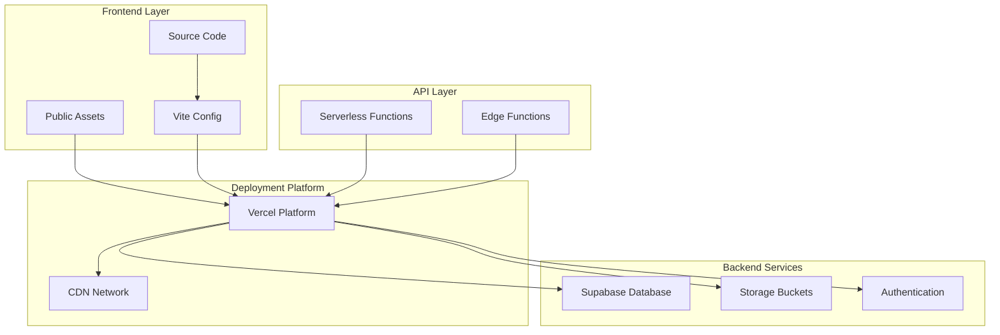
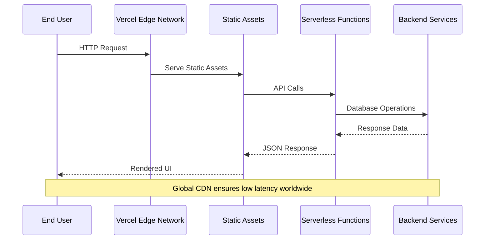
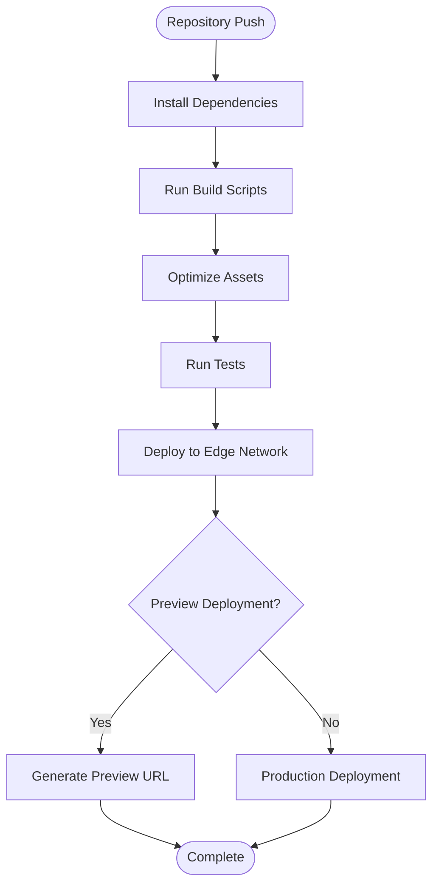
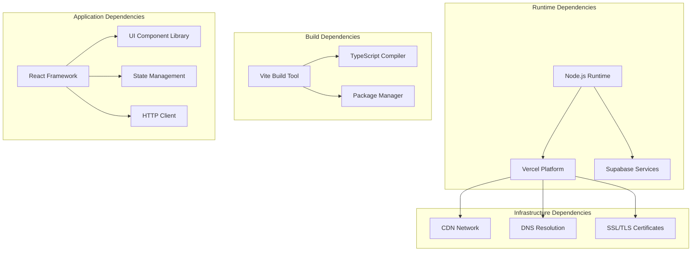

# Deployment Architecture

<cite>
**Referenced Files in This Document**
- [vercel.json](file://vercel.json)
- [vite.config.js](file://vite.config.js)
- [package.json](file://package.json)
- [supabase/config.toml](file://supabase/config.toml)
- [src/lib/supabase.ts](file://src/lib/supabase.ts)
- [api/pincode/[code].ts](file://api/pincode/[code].ts)
- [api/comm-notify.ts](file://api/comm-notify.ts)
- [api/parse-document.ts](file://api/parse-document.ts)
- [api/work-instruction-draft.ts](file://api/work-instruction-draft.ts)
- [server/pincode.js](file://server/pincode.js)
</cite>

## Table of Contents
1. [Introduction](#introduction)
2. [Project Structure](#project-structure)
3. [Core Components](#core-components)
4. [Architecture Overview](#architecture-overview)
5. [Detailed Component Analysis](#detailed-component-analysis)
6. [Dependency Analysis](#dependency-analysis)
7. [Performance Considerations](#performance-considerations)
8. [Troubleshooting Guide](#troubleshooting-guide)
9. [Conclusion](#conclusion)
10. [Appendices](#appendices)

## Introduction

The MEP Project is a comprehensive enterprise resource planning application designed for mechanical, electrical, and plumbing industries. The deployment architecture leverages modern cloud-native technologies including Vercel for frontend hosting and serverless functions, Vite for build optimization, and Supabase for backend services including database, authentication, storage, and edge functions.

This document provides a comprehensive overview of the deployment strategy, infrastructure configuration, and operational considerations for production environments.

## Project Structure

The project follows a modular architecture with clear separation between frontend assets, API routes, and configuration files:



**Diagram sources**
- [vercel.json:1-50](file://vercel.json#L1-L50)
- [vite.config.js:1-100](file://vite.config.js#L1-L100)
- [package.json:1-50](file://package.json#L1-L50)

**Section sources**
- [vercel.json:1-50](file://vercel.json#L1-L50)
- [vite.config.js:1-100](file://vite.config.js#L1-L100)
- [package.json:1-50](file://package.json#L1-L50)

## Core Components

### Vercel Deployment Configuration

The Vercel deployment is configured through `vercel.json` which defines build processes, environment variables, routing rules, and serverless function configurations. Key aspects include:

- **Build Commands**: Custom build scripts for Vite compilation and asset optimization
- **Environment Variables**: Secure management of API keys, database credentials, and service endpoints
- **Routing Rules**: URL rewrites, redirects, and header configurations
- **Serverless Functions**: Configuration for API endpoints and edge functions
- **Preview Deployments**: Branch-based deployment strategies for development and testing

### Vite Build Configuration

The Vite configuration (`vite.config.js`) optimizes the build process for production deployments:

- **Bundle Splitting**: Automatic code splitting for better caching and load performance
- **Asset Optimization**: Image compression, CSS minification, and JavaScript bundling
- **Environment Integration**: Runtime environment variable injection
- **Plugin System**: Custom plugins for build optimizations and asset processing
- **Development Server**: Hot module replacement and debugging capabilities

### Supabase Integration

The Supabase client configuration in `src/lib/supabase.ts` manages database connections, authentication, and real-time subscriptions:

- **Client Initialization**: Environment-aware configuration for different deployment targets
- **Authentication Flow**: OAuth providers and session management
- **Database Client**: Type-safe query execution with Row Level Security
- **Storage Client**: File upload and retrieval operations
- **Real-time Features**: WebSocket connections for live data updates

**Section sources**
- [vercel.json:1-50](file://vercel.json#L1-L50)
- [vite.config.js:1-100](file://vite.config.js#L1-L100)
- [src/lib/supabase.ts:1-100](file://src/lib/supabase.ts#L1-L100)

## Architecture Overview

The deployment architecture follows a modern serverless-first approach with global CDN distribution:



**Diagram sources**
- [vercel.json:1-50](file://vercel.json#L1-L50)
- [src/lib/supabase.ts:1-100](file://src/lib/supabase.ts#L1-L100)

## Detailed Component Analysis

### Vercel Build Process

The build process is orchestrated through Vercel's platform integration:



**Diagram sources**
- [vercel.json:1-50](file://vercel.json#L1-L50)
- [package.json:1-50](file://package.json#L1-L50)

### Static Asset Optimization

Vite implements sophisticated asset optimization strategies:

- **Code Splitting**: Automatic chunking by route and dependency analysis
- **Tree Shaking**: Removal of unused code during build
- **Asset Hashing**: Cache-busting filenames for optimal browser caching
- **Image Optimization**: Automatic format conversion and compression
- **CSS Optimization**: Minification and critical CSS extraction

### API Route Architecture

The API layer consists of serverless functions deployed to Vercel's edge network:

```mermaid
classDiagram
class PincodeAPI {
+GET /api/pincode/{code}
+validatePincode()
+fetchLocationData()
}
class CommunicationAPI {
+POST /api/comm-notify
+sendNotification()
+formatMessage()
}
class DocumentAPI {
+POST /api/parse-document
+extractText()
+processContent()
}
class WorkInstructionAPI {
+POST /api/work-instruction-draft
+generateDraft()
+validateTemplate()
}
PincodeAPI --> Supabase : "database queries"
CommunicationAPI --> Supabase : "user notifications"
DocumentAPI --> Storage : "file processing"
WorkInstructionAPI --> Templates : "document generation"
```

**Diagram sources**
- [api/pincode/[code].ts:1-50](file://api/pincode/[code].ts#L1-L50)
- [api/comm-notify.ts:1-50](file://api/comm-notify.ts#L1-L50)
- [api/parse-document.ts:1-50](file://api/parse-document.ts#L1-L50)
- [api/work-instruction-draft.ts:1-50](file://api/work-instruction-draft.ts#L1-L50)

### Supabase Project Setup

The Supabase configuration includes database migrations, storage buckets, and edge functions:

#### Database Migrations
- **Schema Management**: Version-controlled SQL migrations for database evolution
- **Row Level Security**: Fine-grained access control policies
- **Indexes and Performance**: Optimized query performance through strategic indexing
- **Backup Strategy**: Automated backups with point-in-time recovery

#### Storage Buckets
- **File Organization**: Structured bucket hierarchy for different asset types
- **Access Policies**: Secure file access through RLS policies
- **CDN Integration**: Global content delivery for uploaded assets
- **Lifecycle Management**: Automated cleanup and archival policies

#### Edge Functions
- **Low Latency Processing**: Functions deployed close to users globally
- **Event-driven Architecture**: Trigger-based processing workflows
- **Security Isolation**: Sandboxed execution environment
- **Monitoring and Logging**: Comprehensive observability features

**Section sources**
- [api/pincode/[code].ts:1-50](file://api/pincode/[code].ts#L1-L50)
- [api/comm-notify.ts:1-50](file://api/comm-notify.ts#L1-L50)
- [api/parse-document.ts:1-50](file://api/parse-document.ts#L1-L50)
- [api/work-instruction-draft.ts:1-50](file://api/work-instruction-draft.ts#L1-L50)
- [src/lib/supabase.ts:1-100](file://src/lib/supabase.ts#L1-L100)

## Dependency Analysis

The deployment dependencies follow a layered architecture with clear separation of concerns:



**Diagram sources**
- [package.json:1-100](file://package.json#L1-L100)
- [vite.config.js:1-100](file://vite.config.js#L1-L100)

**Section sources**
- [package.json:1-100](file://package.json#L1-L100)
- [vite.config.js:1-100](file://vite.config.js#L1-L100)

## Performance Considerations

### Global CDN Configuration
- **Edge Caching**: Static assets cached at 300+ edge locations worldwide
- **Compression**: Brotli and gzip compression for optimal transfer sizes
- **HTTP/3 Support**: Latest protocol support for improved connection performance
- **Cache Headers**: Strategic cache-control headers for optimal caching behavior

### Database Performance
- **Connection Pooling**: Efficient database connection management
- **Query Optimization**: Indexed queries and optimized data fetching
- **Caching Strategies**: Multi-level caching with Redis and browser cache
- **Read Replicas**: Horizontal scaling for read-heavy workloads

### Bundle Optimization
- **Lazy Loading**: Route-based code splitting for faster initial loads
- **Tree Shaking**: Elimination of unused code from production bundles
- **Asset Optimization**: Automatic image and font optimization
- **Critical CSS**: Inlining of above-the-fold styles for faster rendering

## Troubleshooting Guide

### Common Deployment Issues
- **Build Failures**: Check Node.js version compatibility and dependency resolution
- **Environment Variables**: Verify secret management and variable scoping
- **API Errors**: Monitor serverless function logs and error tracking
- **Database Connections**: Validate connection strings and permission policies

### Monitoring and Logging
- **Application Performance**: Real user monitoring and synthetic transactions
- **Error Tracking**: Centralized error collection and alerting
- **Database Metrics**: Query performance and connection utilization
- **API Analytics**: Request volume, latency, and error rate monitoring

### Backup and Disaster Recovery
- **Automated Backups**: Daily database snapshots with retention policies
- **Point-in-Time Recovery**: Restore to specific timestamps
- **Cross-region Replication**: Geographic redundancy for disaster scenarios
- **Asset Backup**: Regular backup of uploaded files and generated documents

## Conclusion

The MEP Project's deployment architecture leverages modern cloud-native technologies to deliver a scalable, performant, and maintainable enterprise application. The combination of Vercel's edge computing platform, Vite's optimized build pipeline, and Supabase's comprehensive backend services creates a robust foundation for global deployment.

Key architectural strengths include:
- **Global Scalability**: Edge-first deployment with automatic horizontal scaling
- **Developer Experience**: Streamlined CI/CD pipeline with preview deployments
- **Performance Optimization**: Multi-layered caching and asset optimization
- **Operational Excellence**: Comprehensive monitoring, logging, and backup strategies

This architecture provides a solid foundation for the MEP Project's growth while maintaining high standards for reliability, performance, and security.

## Appendices

### Environment Management

#### Development Environment
- Local development server with hot reload
- Mock API responses for offline development
- Debug tooling and logging enabled

#### Staging Environment
- Mirror of production configuration
- Automated testing pipeline
- Performance regression detection

#### Production Environment
- High availability with multi-region deployment
- Advanced monitoring and alerting
- Automated scaling and failover

### Security Considerations
- **Secrets Management**: Encrypted environment variables and secrets rotation
- **Access Control**: Role-based permissions and audit logging
- **Data Protection**: Encryption at rest and in transit
- **Compliance**: GDPR and industry-specific compliance requirements