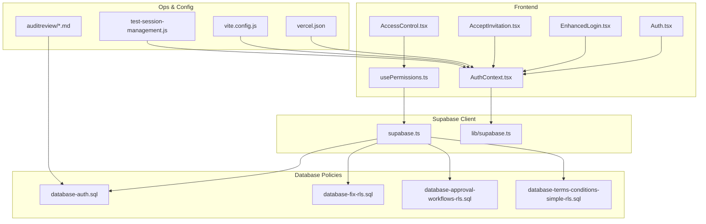
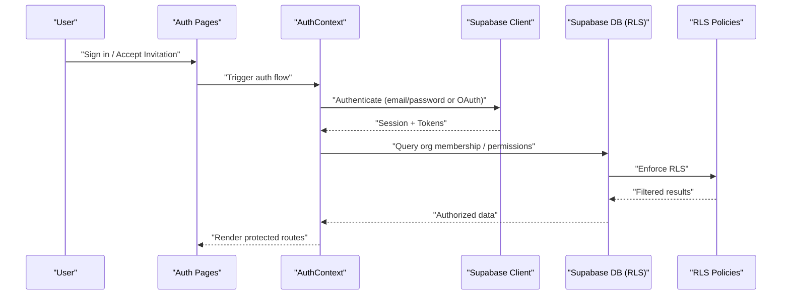
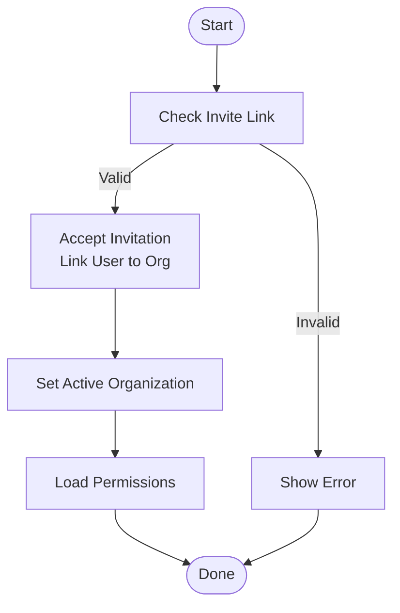
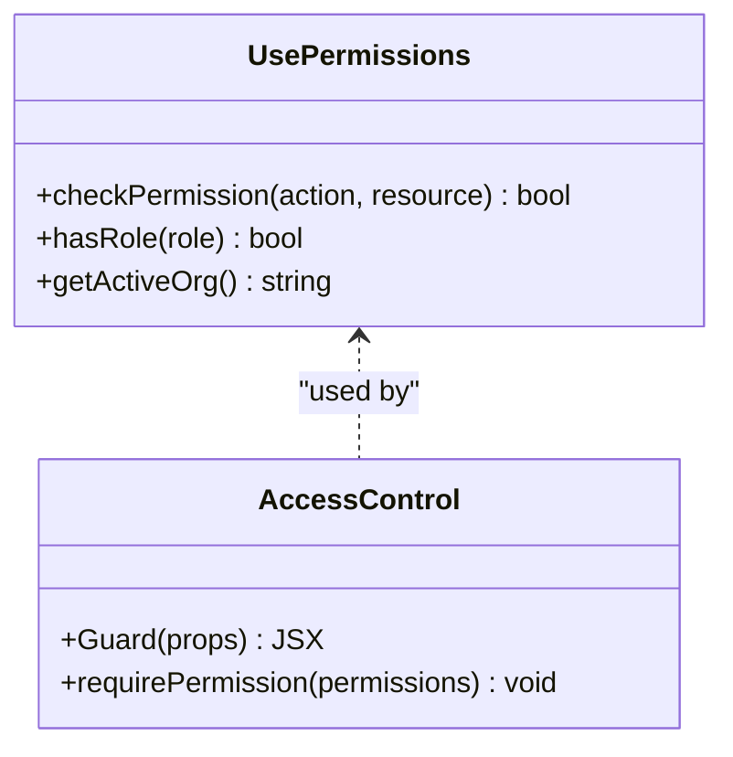
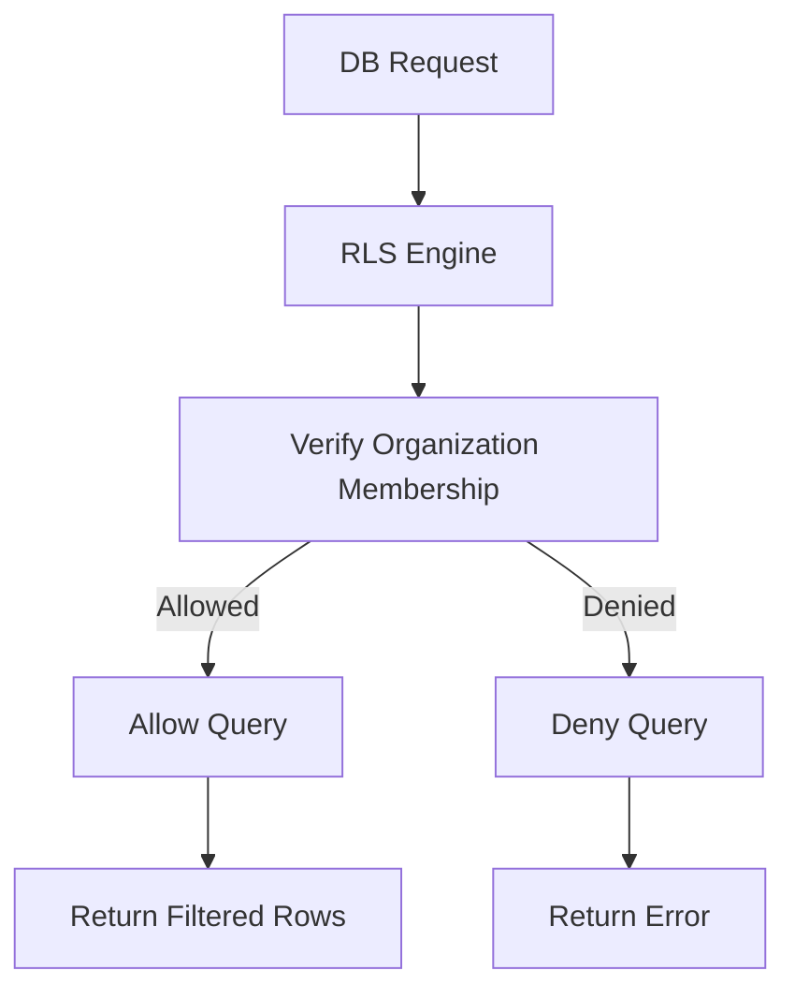
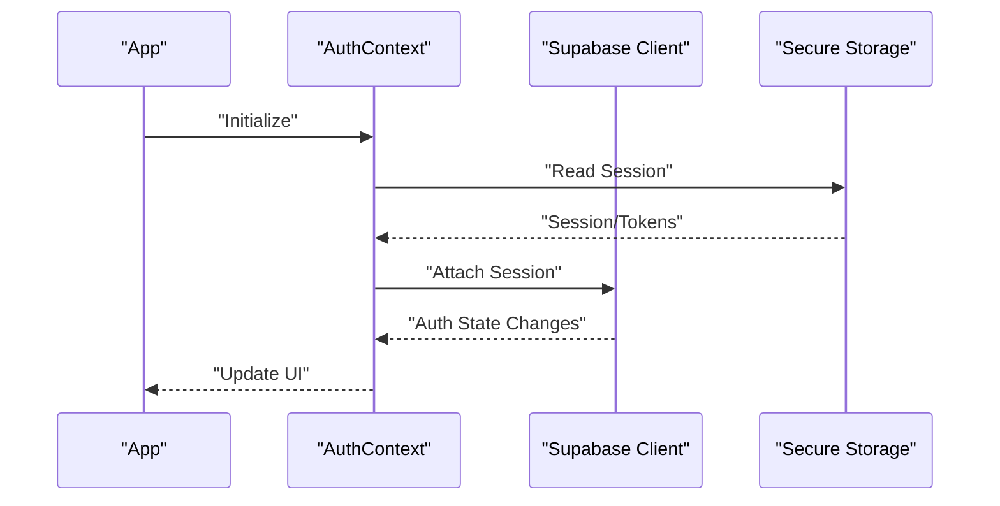
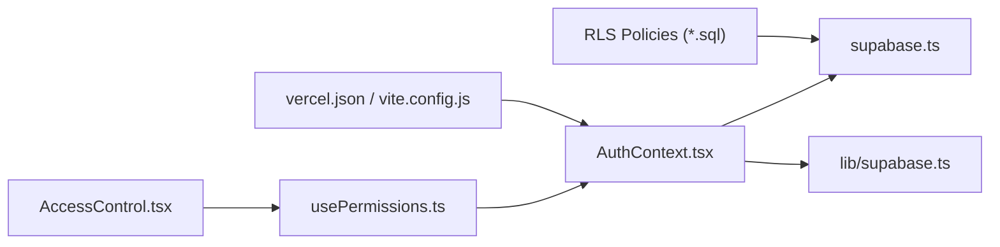

# Security Architecture

<cite>
**Referenced Files in This Document**
- [AuthContext.tsx](file://src/contexts/AuthContext.tsx)
- [Auth.tsx](file://src/pages/Auth.tsx)
- [EnhancedLogin.tsx](file://src/pages/EnhancedLogin.tsx)
- [AcceptInvitation.tsx](file://src/pages/AcceptInvitation.tsx)
- [AccessControl.tsx](file://src/pages/AccessControl.tsx)
- [usePermissions.ts](file://src/hooks/usePermissions.ts)
- [supabase.ts](file://src/supabase.ts)
- [lib/supabase.ts](file://src/lib/supabase.ts)
- [database-auth.sql](file://src/database-auth.sql)
- [database-fix-rls.sql](file://src/database-fix-rls.sql)
- [database-approval-workflows-rls.sql](file://src/database-approval-workflows-rls.sql)
- [database-terms-conditions-simple-rls.sql](file://src/database-terms-conditions-simple-rls.sql)
- [fix_other_deletes.py](file://fix_other_deletes.py)
- [test-session-management.js](file://test-session-management.js)
- [vercel.json](file://vercel.json)
- [vite.config.js](file://vite.config.js)
- [auditreview/AUDITREPORT 14-04-2026.md](file://auditreview/AUDITREPORT 14-04-2026.md)
- [auditreview/POSTAUDIT.md](file://auditreview/POSTAUDIT.md)
</cite>

## Table of Contents
1. [Introduction](#introduction)
2. [Project Structure](#project-structure)
3. [Core Components](#core-components)
4. [Architecture Overview](#architecture-overview)
5. [Detailed Component Analysis](#detailed-component-analysis)
6. [Dependency Analysis](#dependency-analysis)
7. [Performance Considerations](#performance-considerations)
8. [Troubleshooting Guide](#troubleshooting-guide)
9. [Conclusion](#conclusion)
10. [Appendices](#appendices)

## Introduction
This document describes the security architecture of the MEP Project with a focus on authentication, authorization, data protection, session and token handling, input validation, secure API practices, audit logging, and environment-specific security settings. The system integrates Supabase Auth for identity management, implements role-based access control (RBAC) with permission guards, enforces Row Level Security (RLS) policies at the database layer, and applies structured input validation using Zod schemas. It also outlines best practices for API calls, file uploads, XSS prevention, CORS configuration, and security headers.

## Project Structure
Security-related implementation spans several layers:
- Frontend auth context and pages for login, invitation acceptance, and access control
- RBAC hooks and permission utilities
- Supabase client initialization and RLS policy migrations
- Audit review documentation and tests for session behavior
- Environment and deployment configurations for security posture

**Diagram sources**
- [AuthContext.tsx](file://src/contexts/AuthContext.tsx)
- [Auth.tsx](file://src/pages/Auth.tsx)
- [EnhancedLogin.tsx](file://src/pages/EnhancedLogin.tsx)
- [AcceptInvitation.tsx](file://src/pages/AcceptInvitation.tsx)
- [AccessControl.tsx](file://src/pages/AccessControl.tsx)
- [usePermissions.ts](file://src/hooks/usePermissions.ts)
- [supabase.ts](file://src/supabase.ts)
- [lib/supabase.ts](file://src/lib/supabase.ts)
- [database-auth.sql](file://src/database-auth.sql)
- [database-fix-rls.sql](file://src/database-fix-rls.sql)
- [database-approval-workflows-rls.sql](file://src/database-approval-workflows-rls.sql)
- [database-terms-conditions-simple-rls.sql](file://src/database-terms-conditions-simple-rls.sql)
- [vercel.json](file://vercel.json)
- [vite.config.js](file://vite.config.js)
- [auditreview/AUDITREPORT 14-04-2026.md](file://auditreview/AUDITREPORT 14-04-2026.md)
- [auditreview/POSTAUDIT.md](file://auditreview/POSTAUDIT.md)
- [test-session-management.js](file://test-session-management.js)

**Section sources**
- [AuthContext.tsx](file://src/contexts/AuthContext.tsx)
- [Auth.tsx](file://src/pages/Auth.tsx)
- [EnhancedLogin.tsx](file://src/pages/EnhancedLogin.tsx)
- [AcceptInvitation.tsx](file://src/pages/AcceptInvitation.tsx)
- [AccessControl.tsx](file://src/pages/AccessControl.tsx)
- [usePermissions.ts](file://src/hooks/usePermissions.ts)
- [supabase.ts](file://src/supabase.ts)
- [lib/supabase.ts](file://src/lib/supabase.ts)
- [database-auth.sql](file://src/database-auth.sql)
- [database-fix-rls.sql](file://src/database-fix-rls.sql)
- [database-approval-workflows-rls.sql](file://src/database-approval-workflows-rls.sql)
- [database-terms-conditions-simple-rls.sql](file://src/database-terms-conditions-simple-rls.sql)
- [vercel.json](file://vercel.json)
- [vite.config.js](file://vite.config.js)
- [auditreview/AUDITREPORT 14-04-2026.md](file://auditreview/AUDITREPORT 14-04-2026.md)
- [auditreview/POSTAUDIT.md](file://auditreview/POSTAUDIT.md)
- [test-session-management.js](file://test-session-management.js)

## Core Components
- Authentication Context: Centralizes user session state, organization context, and permission checks across the application.
- Login and Invitation Flows: Dedicated pages handle credential-based sign-in and multi-organization invitation acceptance.
- Permission Guards: RBAC hooks enforce fine-grained authorization before rendering or executing actions.
- Supabase Client: Initializes the authenticated client and manages tokens and sessions.
- Database RLS Policies: SQL migrations define row-level access rules per organization and role.
- Configuration and Deployment: Environment variables, CORS, and security headers are configured via deployment and build files.

**Section sources**
- [AuthContext.tsx](file://src/contexts/AuthContext.tsx)
- [Auth.tsx](file://src/pages/Auth.tsx)
- [EnhancedLogin.tsx](file://src/pages/EnhancedLogin.tsx)
- [AcceptInvitation.tsx](file://src/pages/AcceptInvitation.tsx)
- [AccessControl.tsx](file://src/pages/AccessControl.tsx)
- [usePermissions.ts](file://src/hooks/usePermissions.ts)
- [supabase.ts](file://src/supabase.ts)
- [lib/supabase.ts](file://src/lib/supabase.ts)
- [database-auth.sql](file://src/database-auth.sql)
- [database-fix-rls.sql](file://src/database-fix-rls.sql)
- [database-approval-workflows-rls.sql](file://src/database-approval-workflows-rls.sql)
- [database-terms-conditions-simple-rls.sql](file://src/database-terms-conditions-simple-rls.sql)
- [vercel.json](file://vercel.json)
- [vite.config.js](file://vite.config.js)

## Architecture Overview
The security architecture follows a layered approach:
- Identity Layer: Supabase Auth handles user registration, login, password reset, and email verification. Multi-organization support is integrated through invitation workflows and organization membership tables.
- Authorization Layer: RBAC is enforced via permission hooks that evaluate roles and permissions against current user and selected organization context.
- Data Protection Layer: Supabase RLS policies restrict read/write access to rows based on user attributes and organization membership.
- Session and Token Management: Secure storage and refresh strategies ensure safe session lifecycle.
- Input Validation and Sanitization: Zod schemas validate inputs; sanitization patterns prevent XSS.
- API Security: Strict CORS, security headers, and validated payloads protect endpoints.
- Audit Logging: Structured logs capture critical events for compliance and monitoring.

**Diagram sources**
- [Auth.tsx](file://src/pages/Auth.tsx)
- [EnhancedLogin.tsx](file://src/pages/EnhancedLogin.tsx)
- [AcceptInvitation.tsx](file://src/pages/AcceptInvitation.tsx)
- [AuthContext.tsx](file://src/contexts/AuthContext.tsx)
- [supabase.ts](file://src/supabase.ts)
- [database-auth.sql](file://src/database-auth.sql)
- [database-fix-rls.sql](file://src/database-fix-rls.sql)

## Detailed Component Analysis

### Authentication System (Supabase Auth with Multi-Organization Support)
- Sign-in and Email Verification: The login page orchestrates credential-based authentication and redirects based on success or pending verification states.
- Invitation Workflow: Invitation acceptance validates invite tokens, links users to organizations, and updates membership records.
- Organization Context: After authentication, the app resolves the active organization and loads associated permissions.

**Diagram sources**
- [AcceptInvitation.tsx](file://src/pages/AcceptInvitation.tsx)
- [AuthContext.tsx](file://src/contexts/AuthContext.tsx)
- [database-auth.sql](file://src/database-auth.sql)

**Section sources**
- [Auth.tsx](file://src/pages/Auth.tsx)
- [EnhancedLogin.tsx](file://src/pages/EnhancedLogin.tsx)
- [AcceptInvitation.tsx](file://src/pages/AcceptInvitation.tsx)
- [AuthContext.tsx](file://src/contexts/AuthContext.tsx)
- [database-auth.sql](file://src/database-auth.sql)

### Role-Based Access Control (RBAC) and Permission Guards
- Permission Hooks: A dedicated hook evaluates whether the current user has required roles or permissions within the active organization.
- Route Guards: Protected routes use permission checks to render or redirect users accordingly.
- Fine-Grained Authorization: Permissions can be scoped by feature modules and resource types.

**Diagram sources**
- [usePermissions.ts](file://src/hooks/usePermissions.ts)
- [AccessControl.tsx](file://src/pages/AccessControl.tsx)

**Section sources**
- [usePermissions.ts](file://src/hooks/usePermissions.ts)
- [AccessControl.tsx](file://src/pages/AccessControl.tsx)

### Row Level Security (RLS) Policies
- Policy Migrations: SQL scripts define RLS policies for core tables, ensuring users can only access rows belonging to their organization or matching specific conditions.
- Approval Workflows: Specialized policies govern approvals and related entities.
- Terms and Conditions: Isolated policies protect sensitive content.

**Diagram sources**
- [database-fix-rls.sql](file://src/database-fix-rls.sql)
- [database-approval-workflows-rls.sql](file://src/database-approval-workflows-rls.sql)
- [database-terms-conditions-simple-rls.sql](file://src/database-terms-conditions-simple-rls.sql)

**Section sources**
- [database-fix-rls.sql](file://src/database-fix-rls.sql)
- [database-approval-workflows-rls.sql](file://src/database-approval-workflows-rls.sql)
- [database-terms-conditions-simple-rls.sql](file://src/database-terms-conditions-simple-rls.sql)

### Session Management and Token Handling
- Secure Storage: Tokens are stored securely and refreshed automatically when needed.
- Session Lifecycle: The auth context monitors session changes and updates UI state accordingly.
- Testing: Session behavior is validated through dedicated test scripts.

**Diagram sources**
- [AuthContext.tsx](file://src/contexts/AuthContext.tsx)
- [supabase.ts](file://src/supabase.ts)
- [lib/supabase.ts](file://src/lib/supabase.ts)
- [test-session-management.js](file://test-session-management.js)

**Section sources**
- [AuthContext.tsx](file://src/contexts/AuthContext.tsx)
- [supabase.ts](file://src/supabase.ts)
- [lib/supabase.ts](file://src/lib/supabase.ts)
- [test-session-management.js](file://test-session-management.js)

### Input Validation and Sanitization
- Zod Schemas: All user inputs are validated against strict schemas before processing.
- Sanitization Patterns: Inputs are sanitized to prevent XSS and injection attacks.
- Consistent Validation: Shared validators ensure uniformity across forms and APIs.

[No sources needed since this section provides general guidance]

### Secure API Calls, File Uploads, and XSS Prevention
- API Security: Requests include authenticated headers; responses are validated and errors handled securely.
- File Uploads: Files are uploaded via secure channels with size/type restrictions and virus scanning where applicable.
- XSS Prevention: Outputs are escaped; rich text is sanitized before rendering.

[No sources needed since this section provides general guidance]

### Audit Logging for Compliance and Monitoring
- Event Capture: Critical actions (auth events, permission changes, data modifications) are logged.
- Review Documentation: Audit reports and post-audit notes provide insights into security posture and findings.

**Section sources**
- [auditreview/AUDITREPORT 14-04-2026.md](file://auditreview/AUDITREPORT 14-04-2026.md)
- [auditreview/POSTAUDIT.md](file://auditreview/POSTAUDIT.md)

### Security Headers, CORS, and Environment-Specific Settings
- CORS Configuration: Allowed origins and methods are restricted to trusted domains.
- Security Headers: Response headers enforce secure defaults (e.g., HSTS, CSP).
- Environment Variables: Secrets and endpoints are managed via environment configuration.

**Section sources**
- [vercel.json](file://vercel.json)
- [vite.config.js](file://vite.config.js)

## Dependency Analysis
Security components depend on each other to enforce consistent policies:
- AuthContext depends on Supabase client for session and token management.
- Permission hooks depend on AuthContext for user and organization context.
- RLS policies depend on user claims and organization membership.
- Configuration files influence runtime security posture.

**Diagram sources**
- [AuthContext.tsx](file://src/contexts/AuthContext.tsx)
- [usePermissions.ts](file://src/hooks/usePermissions.ts)
- [AccessControl.tsx](file://src/pages/AccessControl.tsx)
- [supabase.ts](file://src/supabase.ts)
- [lib/supabase.ts](file://src/lib/supabase.ts)
- [database-fix-rls.sql](file://src/database-fix-rls.sql)
- [database-approval-workflows-rls.sql](file://src/database-approval-workflows-rls.sql)
- [database-terms-conditions-simple-rls.sql](file://src/database-terms-conditions-simple-rls.sql)
- [vercel.json](file://vercel.json)
- [vite.config.js](file://vite.config.js)

**Section sources**
- [AuthContext.tsx](file://src/contexts/AuthContext.tsx)
- [usePermissions.ts](file://src/hooks/usePermissions.ts)
- [AccessControl.tsx](file://src/pages/AccessControl.tsx)
- [supabase.ts](file://src/supabase.ts)
- [lib/supabase.ts](file://src/lib/supabase.ts)
- [database-fix-rls.sql](file://src/database-fix-rls.sql)
- [database-approval-workflows-rls.sql](file://src/database-approval-workflows-rls.sql)
- [database-terms-conditions-simple-rls.sql](file://src/database-terms-conditions-simple-rls.sql)
- [vercel.json](file://vercel.json)
- [vite.config.js](file://vite.config.js)

## Performance Considerations
- Minimize unnecessary re-renders by memoizing permission checks.
- Cache organization membership and permissions where appropriate.
- Optimize RLS queries with proper indexes to reduce latency.
- Avoid heavy computations in permission guards; precompute where possible.

[No sources needed since this section provides general guidance]

## Troubleshooting Guide
- Authentication Failures: Verify credentials, email verification status, and invite link validity.
- Permission Denied Errors: Check RBAC configuration and RLS policies for the affected table and action.
- Session Issues: Inspect token storage and refresh logic; run session management tests.
- Policy Misconfigurations: Review RLS SQL migrations and ensure they align with business rules.

**Section sources**
- [test-session-management.js](file://test-session-management.js)
- [database-fix-rls.sql](file://src/database-fix-rls.sql)
- [database-approval-workflows-rls.sql](file://src/database-approval-workflows-rls.sql)
- [database-terms-conditions-simple-rls.sql](file://src/database-terms-conditions-simple-rls.sql)

## Conclusion
The MEP Project’s security architecture combines robust authentication, comprehensive RBAC, and strong data protection via RLS. Secure session handling, strict input validation, and careful configuration of CORS and security headers contribute to a resilient system. Continuous auditing and testing ensure ongoing compliance and reliability.

[No sources needed since this section summarizes without analyzing specific files]

## Appendices
- Additional cleanup and fix scripts related to deletions and data integrity can be reviewed for security implications.

**Section sources**
- [fix_other_deletes.py](file://fix_other_deletes.py)