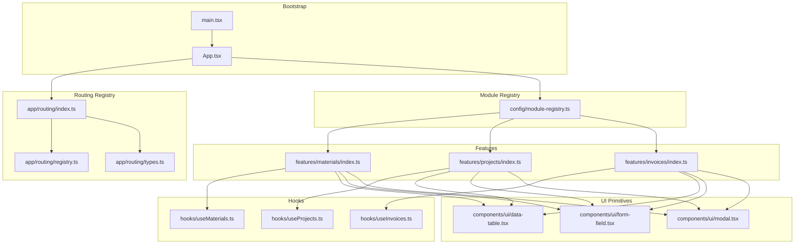
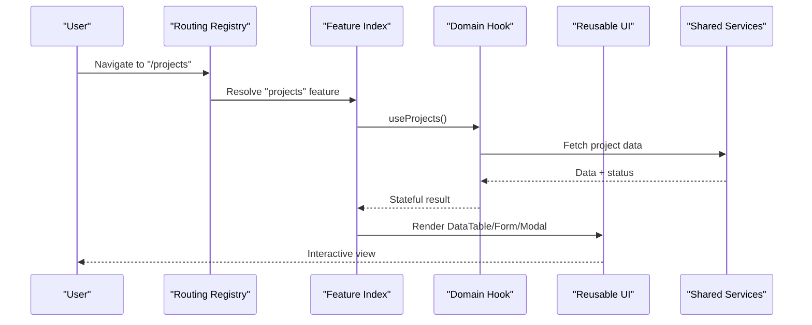
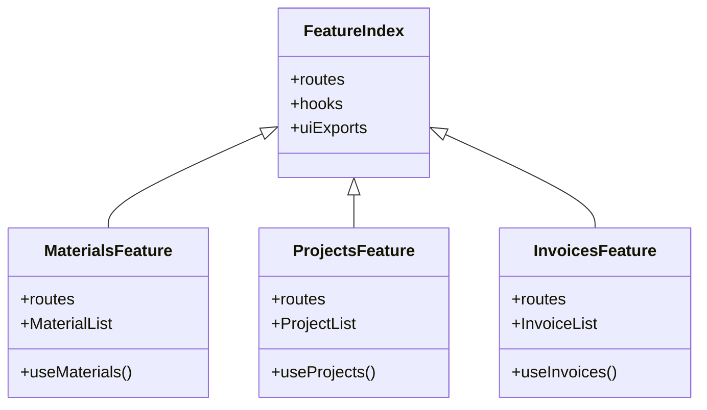
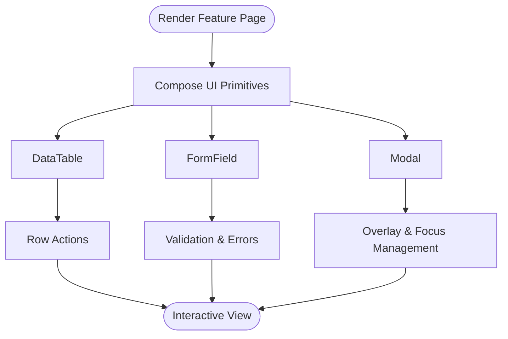
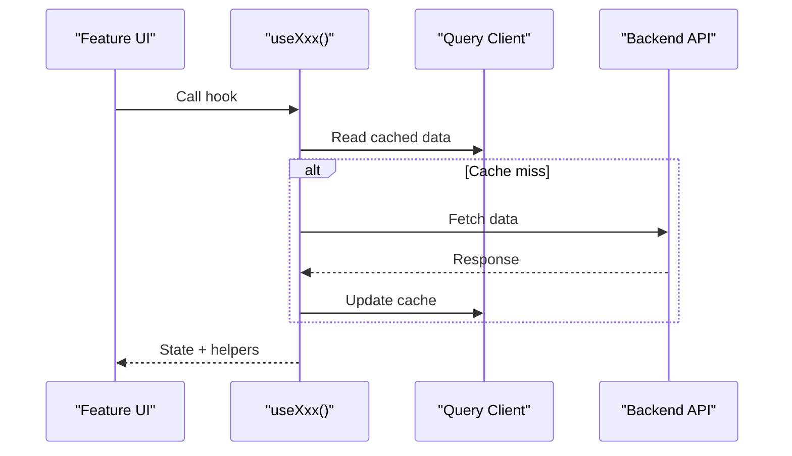
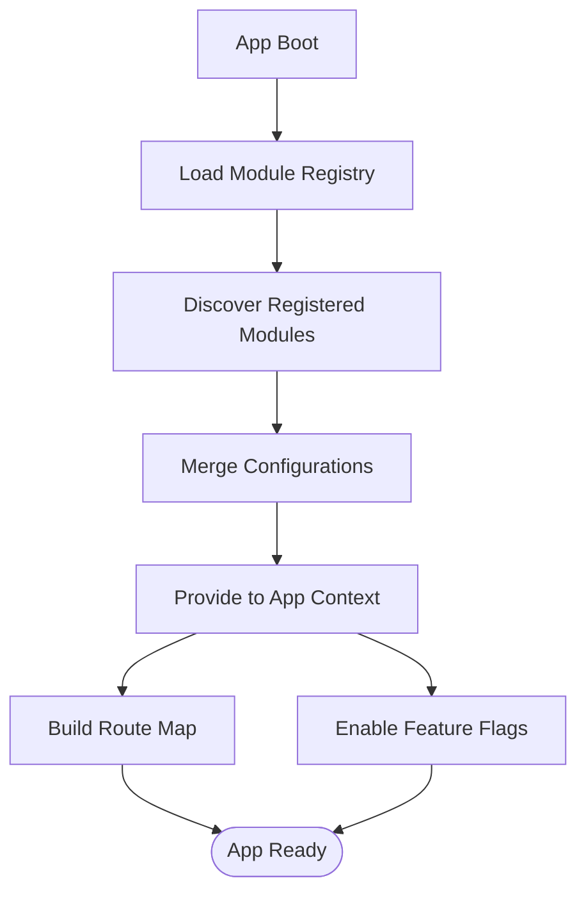
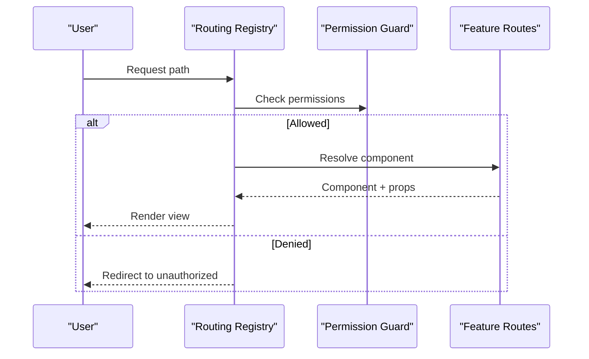
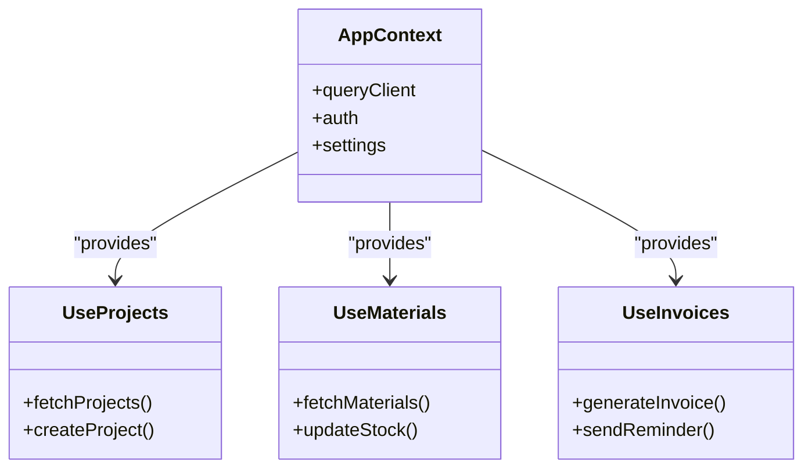
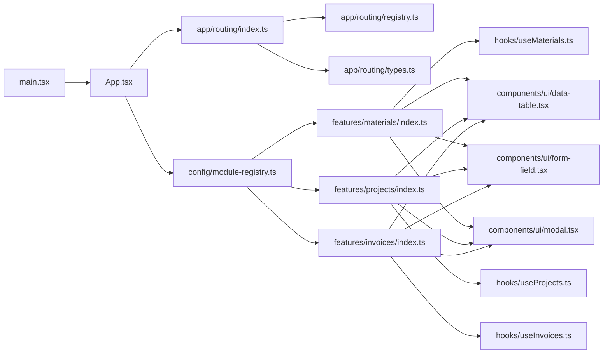

# System Design Patterns

<cite>
**Referenced Files in This Document**
- [src/app/routing/registry.ts](file://src/app/routing/registry.ts)
- [src/app/routing/index.ts](file://src/app/routing/index.ts)
- [src/app/routing/types.ts](file://src/app/routing/types.ts)
- [src/config/module-registry.ts](file://src/config/module-registry.ts)
- [src/features/materials/index.ts](file://src/features/materials/index.ts)
- [src/features/projects/index.ts](file://src/features/projects/index.ts)
- [src/features/invoices/index.ts](file://src/features/invoices/index.ts)
- [src/hooks/useProjects.ts](file://src/hooks/useProjects.ts)
- [src/hooks/useMaterials.ts](file://src/hooks/useMaterials.ts)
- [src/hooks/useInvoices.ts](file://src/hooks/useInvoices.ts)
- [src/components/ui/data-table.tsx](file://src/components/ui/data-table.tsx)
- [src/components/ui/form-field.tsx](file://src/components/ui/form-field.tsx)
- [src/components/ui/modal.tsx](file://src/components/ui/modal.tsx)
- [src/App.tsx](file://src/App.tsx)
- [src/main.tsx](file://src/main.tsx)
</cite>

## Table of Contents
1. [Introduction](#introduction)
2. [Project Structure](#project-structure)
3. [Core Components](#core-components)
4. [Architecture Overview](#architecture-overview)
5. [Detailed Component Analysis](#detailed-component-analysis)
6. [Dependency Analysis](#dependency-analysis)
7. [Performance Considerations](#performance-considerations)
8. [Troubleshooting Guide](#troubleshooting-guide)
9. [Conclusion](#conclusion)

## Introduction
This document explains the system design patterns used in the MEP Project’s web application with a focus on:
- Feature-driven architecture where each business domain is encapsulated in separate modules with clear boundaries
- Component-based UI design using React with reusable components and composition patterns
- Hook-based logic abstraction that separates business logic from UI presentation
- Module registration system enabling dynamic feature loading and plugin-like extensibility
- Routing registry for navigation between different application sections
- Dependency injection patterns used throughout the application

The goal is to provide both high-level architectural understanding and practical examples grounded in the codebase, including Materials, Projects, and Invoices features.

## Project Structure
At a high level, the application follows a feature-driven layout:
- Features are organized under src/features/<feature-name>, each exposing an index entry point that registers routes, hooks, and UI components
- Shared UI primitives live under src/components/ui and are composed into feature-specific pages and forms
- Business logic is abstracted via hooks under src/hooks, which encapsulate data fetching, state management, and side effects
- The routing registry under src/app/routing centralizes route definitions and navigation behavior
- A module registry under src/config/module-registry.ts enables dynamic feature loading and plugin-style extension points
- Application bootstrap wires everything together in src/main.tsx and src/App.tsx

**Diagram sources**
- [src/main.tsx](file://src/main.tsx)
- [src/App.tsx](file://src/App.tsx)
- [src/app/routing/index.ts](file://src/app/routing/index.ts)
- [src/app/routing/registry.ts](file://src/app/routing/registry.ts)
- [src/app/routing/types.ts](file://src/app/routing/types.ts)
- [src/config/module-registry.ts](file://src/config/module-registry.ts)
- [src/features/materials/index.ts](file://src/features/materials/index.ts)
- [src/features/projects/index.ts](file://src/features/projects/index.ts)
- [src/features/invoices/index.ts](file://src/features/invoices/index.ts)
- [src/hooks/useProjects.ts](file://src/hooks/useProjects.ts)
- [src/hooks/useMaterials.ts](file://src/hooks/useMaterials.ts)
- [src/hooks/useInvoices.ts](file://src/hooks/useInvoices.ts)
- [src/components/ui/data-table.tsx](file://src/components/ui/data-table.tsx)
- [src/components/ui/form-field.tsx](file://src/components/ui/form-field.tsx)
- [src/components/ui/modal.tsx](file://src/components/ui/modal.tsx)

**Section sources**
- [src/main.tsx](file://src/main.tsx)
- [src/App.tsx](file://src/App.tsx)
- [src/app/routing/index.ts](file://src/app/routing/index.ts)
- [src/app/routing/registry.ts](file://src/app/routing/registry.ts)
- [src/app/routing/types.ts](file://src/app/routing/types.ts)
- [src/config/module-registry.ts](file://src/config/module-registry.ts)

## Core Components
- Feature Indexes: Each feature exposes an index file that centralizes its routes, hooks, and UI exports. This enforces clear boundaries and makes it easy to register or disable features.
- Hooks: Domain-specific hooks encapsulate API calls, caching, and state transitions. They are consumed by feature pages and shared across components.
- UI Primitives: Reusable components (data tables, form fields, modals) provide consistent UX and reduce duplication across features.
- Routing Registry: Centralized route definitions and navigation utilities ensure consistent URL structure and guard access based on permissions.
- Module Registry: A runtime registry allows features to be dynamically loaded, enabling plugin-like extensibility and optional modules.

**Section sources**
- [src/features/materials/index.ts](file://src/features/materials/index.ts)
- [src/features/projects/index.ts](file://src/features/projects/index.ts)
- [src/features/invoices/index.ts](file://src/features/invoices/index.ts)
- [src/hooks/useProjects.ts](file://src/hooks/useProjects.ts)
- [src/hooks/useMaterials.ts](file://src/hooks/useMaterials.ts)
- [src/hooks/useInvoices.ts](file://src/hooks/useInvoices.ts)
- [src/components/ui/data-table.tsx](file://src/components/ui/data-table.tsx)
- [src/components/ui/form-field.tsx](file://src/components/ui/form-field.tsx)
- [src/components/ui/modal.tsx](file://src/components/ui/modal.tsx)
- [src/app/routing/registry.ts](file://src/app/routing/registry.ts)
- [src/config/module-registry.ts](file://src/config/module-registry.ts)

## Architecture Overview
The application uses a layered, feature-driven architecture:
- Bootstrap layer initializes providers and bootstraps the app
- Routing layer resolves paths to feature modules
- Feature layer composes UI and logic through hooks and components
- Infrastructure layer provides shared services (API clients, query client, auth context)

**Diagram sources**
- [src/app/routing/index.ts](file://src/app/routing/index.ts)
- [src/app/routing/registry.ts](file://src/app/routing/registry.ts)
- [src/features/projects/index.ts](file://src/features/projects/index.ts)
- [src/hooks/useProjects.ts](file://src/hooks/useProjects.ts)
- [src/components/ui/data-table.tsx](file://src/components/ui/data-table.tsx)
- [src/components/ui/form-field.tsx](file://src/components/ui/form-field.tsx)
- [src/components/ui/modal.tsx](file://src/components/ui/modal.tsx)

## Detailed Component Analysis

### Feature-Driven Architecture Pattern
Each business domain is encapsulated in a dedicated feature folder with a clear index entry point. This pattern ensures:
- Cohesion within features and loose coupling between them
- Easy enable/disable of features via the module registry
- Consistent structure across domains (routes, hooks, UI, types)

Practical examples:
- Materials feature index defines routes and exports hooks and UI
- Projects feature index mirrors the same structure
- Invoices feature index follows the same pattern

**Diagram sources**
- [src/features/materials/index.ts](file://src/features/materials/index.ts)
- [src/features/projects/index.ts](file://src/features/projects/index.ts)
- [src/features/invoices/index.ts](file://src/features/invoices/index.ts)

**Section sources**
- [src/features/materials/index.ts](file://src/features/materials/index.ts)
- [src/features/projects/index.ts](file://src/features/projects/index.ts)
- [src/features/invoices/index.ts](file://src/features/invoices/index.ts)

### Component-Based UI Design with Composition
The UI layer relies on small, focused primitives composed into feature-specific views:
- Data table component handles pagination, sorting, filtering, and row actions
- Form field component standardizes input validation and error display
- Modal component manages overlay state and accessibility

Composition example:
- A feature page composes DataTable, FormField, and Modal to implement list/create/edit flows
- Reusability reduces duplication and improves consistency

**Diagram sources**
- [src/components/ui/data-table.tsx](file://src/components/ui/data-table.tsx)
- [src/components/ui/form-field.tsx](file://src/components/ui/form-field.tsx)
- [src/components/ui/modal.tsx](file://src/components/ui/modal.tsx)

**Section sources**
- [src/components/ui/data-table.tsx](file://src/components/ui/data-table.tsx)
- [src/components/ui/form-field.tsx](file://src/components/ui/form-field.tsx)
- [src/components/ui/modal.tsx](file://src/components/ui/modal.tsx)

### Hook-Based Logic Abstraction
Business logic is abstracted into hooks that encapsulate:
- Data fetching and caching
- Mutations and optimistic updates
- Error handling and retry strategies
- Derived state and memoization

Examples:
- useProjects encapsulates project CRUD operations and list queries
- useMaterials encapsulates material inventory operations
- useInvoices encapsulates invoice lifecycle and calculations

**Diagram sources**
- [src/hooks/useProjects.ts](file://src/hooks/useProjects.ts)
- [src/hooks/useMaterials.ts](file://src/hooks/useMaterials.ts)
- [src/hooks/useInvoices.ts](file://src/hooks/useInvoices.ts)

**Section sources**
- [src/hooks/useProjects.ts](file://src/hooks/useProjects.ts)
- [src/hooks/useMaterials.ts](file://src/hooks/useMaterials.ts)
- [src/hooks/useInvoices.ts](file://src/hooks/useInvoices.ts)

### Module Registration System (Dynamic Feature Loading)
The module registry centralizes feature discovery and initialization:
- Features declare capabilities (routes, settings, permissions)
- The registry aggregates and exposes them to the app at runtime
- Optional modules can be enabled/disabled without changing core logic

**Diagram sources**
- [src/config/module-registry.ts](file://src/config/module-registry.ts)
- [src/features/materials/index.ts](file://src/features/materials/index.ts)
- [src/features/projects/index.ts](file://src/features/projects/index.ts)
- [src/features/invoices/index.ts](file://src/features/invoices/index.ts)

**Section sources**
- [src/config/module-registry.ts](file://src/config/module-registry.ts)

### Routing Registry System
The routing registry manages navigation and route resolution:
- Centralized route definitions with metadata (title, icon, permissions)
- Dynamic route building based on registered features
- Guards and redirects based on user roles and feature flags

**Diagram sources**
- [src/app/routing/index.ts](file://src/app/routing/index.ts)
- [src/app/routing/registry.ts](file://src/app/routing/registry.ts)
- [src/app/routing/types.ts](file://src/app/routing/types.ts)

**Section sources**
- [src/app/routing/index.ts](file://src/app/routing/index.ts)
- [src/app/routing/registry.ts](file://src/app/routing/registry.ts)
- [src/app/routing/types.ts](file://src/app/routing/types.ts)

### Dependency Injection Patterns
The application uses dependency injection to decouple concerns:
- Services (API clients, query client, auth context) are provided at the top level
- Hooks consume dependencies via context or parameters
- Features depend on abstractions rather than concrete implementations

**Diagram sources**
- [src/App.tsx](file://src/App.tsx)
- [src/hooks/useProjects.ts](file://src/hooks/useProjects.ts)
- [src/hooks/useMaterials.ts](file://src/hooks/useMaterials.ts)
- [src/hooks/useInvoices.ts](file://src/hooks/useInvoices.ts)

**Section sources**
- [src/App.tsx](file://src/App.tsx)
- [src/hooks/useProjects.ts](file://src/hooks/useProjects.ts)
- [src/hooks/useMaterials.ts](file://src/hooks/useMaterials.ts)
- [src/hooks/useInvoices.ts](file://src/hooks/useInvoices.ts)

## Dependency Analysis
The following diagram shows key dependencies among core modules:

**Diagram sources**
- [src/main.tsx](file://src/main.tsx)
- [src/App.tsx](file://src/App.tsx)
- [src/app/routing/index.ts](file://src/app/routing/index.ts)
- [src/app/routing/registry.ts](file://src/app/routing/registry.ts)
- [src/app/routing/types.ts](file://src/app/routing/types.ts)
- [src/config/module-registry.ts](file://src/config/module-registry.ts)
- [src/features/materials/index.ts](file://src/features/materials/index.ts)
- [src/features/projects/index.ts](file://src/features/projects/index.ts)
- [src/features/invoices/index.ts](file://src/features/invoices/index.ts)
- [src/hooks/useMaterials.ts](file://src/hooks/useMaterials.ts)
- [src/hooks/useProjects.ts](file://src/hooks/useProjects.ts)
- [src/hooks/useInvoices.ts](file://src/hooks/useInvoices.ts)
- [src/components/ui/data-table.tsx](file://src/components/ui/data-table.tsx)
- [src/components/ui/form-field.tsx](file://src/components/ui/form-field.tsx)
- [src/components/ui/modal.tsx](file://src/components/ui/modal.tsx)

**Section sources**
- [src/main.tsx](file://src/main.tsx)
- [src/App.tsx](file://src/App.tsx)
- [src/app/routing/index.ts](file://src/app/routing/index.ts)
- [src/app/routing/registry.ts](file://src/app/routing/registry.ts)
- [src/app/routing/types.ts](file://src/app/routing/types.ts)
- [src/config/module-registry.ts](file://src/config/module-registry.ts)
- [src/features/materials/index.ts](file://src/features/materials/index.ts)
- [src/features/projects/index.ts](file://src/features/projects/index.ts)
- [src/features/invoices/index.ts](file://src/features/invoices/index.ts)
- [src/hooks/useMaterials.ts](file://src/hooks/useMaterials.ts)
- [src/hooks/useProjects.ts](file://src/hooks/useProjects.ts)
- [src/hooks/useInvoices.ts](file://src/hooks/useInvoices.ts)
- [src/components/ui/data-table.tsx](file://src/components/ui/data-table.tsx)
- [src/components/ui/form-field.tsx](file://src/components/ui/form-field.tsx)
- [src/components/ui/modal.tsx](file://src/components/ui/modal.tsx)

## Performance Considerations
- Prefer lazy-loading feature modules to reduce initial bundle size
- Memoize expensive computations in hooks and components
- Use virtualized lists for large datasets in data tables
- Debounce search inputs and throttle frequent mutations
- Leverage query client caching and background refetch strategies

[No sources needed since this section provides general guidance]

## Troubleshooting Guide
Common issues and resolutions:
- Missing feature routes: Ensure the feature index registers routes and the module registry includes the feature
- Hook errors: Validate API responses and handle network failures gracefully; check query client configuration
- UI inconsistencies: Verify that shared UI primitives receive correct props and that feature pages compose them properly
- Permission denials: Confirm that routing guards align with user roles and feature flags

**Section sources**
- [src/app/routing/registry.ts](file://src/app/routing/registry.ts)
- [src/config/module-registry.ts](file://src/config/module-registry.ts)
- [src/hooks/useProjects.ts](file://src/hooks/useProjects.ts)
- [src/hooks/useMaterials.ts](file://src/hooks/useMaterials.ts)
- [src/hooks/useInvoices.ts](file://src/hooks/useInvoices.ts)

## Conclusion
The MEP Project employs a robust, scalable architecture built around feature-driven modules, reusable UI components, and hook-based logic abstraction. The module and routing registries enable dynamic loading and consistent navigation, while dependency injection keeps the system loosely coupled and testable. These patterns collectively support maintainability, extensibility, and performance across complex business domains like Materials, Projects, and Invoices.