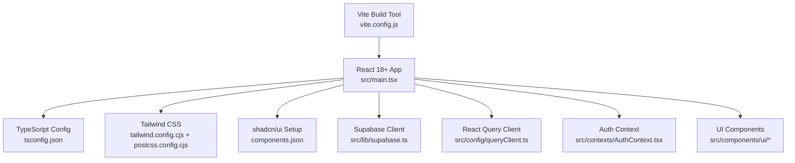
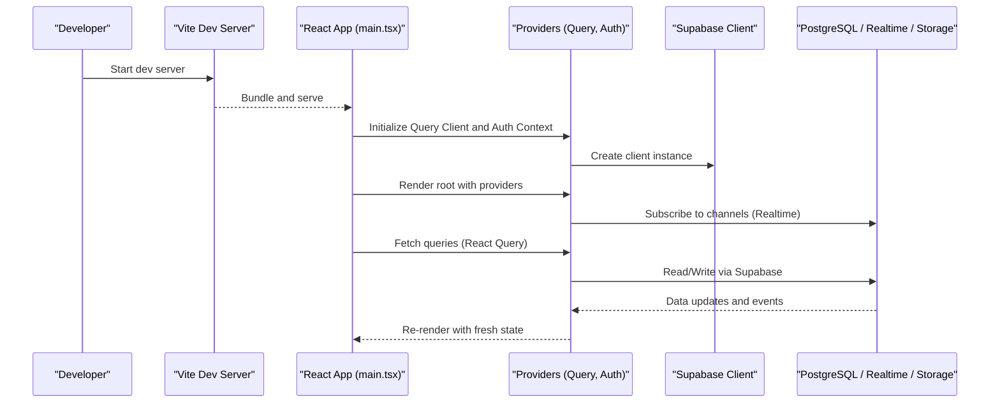
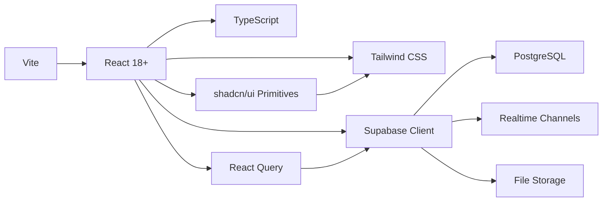

# Technology Stack

<cite>
**Referenced Files in This Document**
- [package.json](file://package.json)
- [vite.config.js](file://vite.config.js)
- [tailwind.config.cjs](file://tailwind.config.cjs)
- [postcss.config.cjs](file://postcss.config.cjs)
- [tsconfig.json](file://tsconfig.json)
- [eslint.config.js](file://eslint.config.js)
- [components.json](file://components.json)
- [src/main.tsx](file://src/main.tsx)
- [src/index.css](file://src/index.css)
- [src/config/queryClient.ts](file://src/config/queryClient.ts)
- [src/lib/supabase.ts](file://src/lib/supabase.ts)
- [src/contexts/AuthContext.tsx](file://src/contexts/AuthContext.tsx)
- [src/hooks/usePresence.ts](file://src/hooks/usePresence.ts)
- [src/hooks/usePresenceAware.ts](file://src/hooks/usePresenceAware.ts)
- [src/components/ui/button.tsx](file://src/components/ui/button.tsx)
- [src/components/ui/dialog.tsx](file://src/components/ui/dialog.tsx)
- [src/components/ui/table.tsx](file://src/components/ui/table.tsx)
</cite>

## Table of Contents
1. [Introduction](#introduction)
2. [Project Structure](#project-structure)
3. [Core Components](#core-components)
4. [Architecture Overview](#architecture-overview)
5. [Detailed Component Analysis](#detailed-component-analysis)
6. [Dependency Analysis](#dependency-analysis)
7. [Performance Considerations](#performance-considerations)
8. [Troubleshooting Guide](#troubleshooting-guide)
9. [Conclusion](#conclusion)
10. [Appendices](#appendices)

## Introduction
This document describes the MEP Project’s technology stack with a focus on frontend frameworks, build tooling, styling, backend integration via Supabase, state management patterns, component library usage, testing and linting tools, and development utilities. It also provides version compatibility matrices and upgrade considerations to guide maintenance and evolution of the stack.

## Project Structure
The project is a modern React application built with TypeScript and Vite, styled with Tailwind CSS, and integrated with Supabase for database, authentication, real-time subscriptions, and storage. The UI leverages shadcn/ui components with custom extensions.

**Diagram sources**
- [vite.config.js:1-200](file://vite.config.js#L1-L200)
- [src/main.tsx:1-200](file://src/main.tsx#L1-L200)
- [tsconfig.json:1-200](file://tsconfig.json#L1-L200)
- [tailwind.config.cjs:1-200](file://tailwind.config.cjs#L1-L200)
- [postcss.config.cjs:1-200](file://postcss.config.cjs#L1-L200)
- [components.json:1-200](file://components.json#L1-L200)
- [src/lib/supabase.ts:1-200](file://src/lib/supabase.ts#L1-L200)
- [src/config/queryClient.ts:1-200](file://src/config/queryClient.ts#L1-L200)
- [src/contexts/AuthContext.tsx:1-200](file://src/contexts/AuthContext.tsx#L1-L200)
- [src/components/ui/button.tsx:1-200](file://src/components/ui/button.tsx#L1-L200)
- [src/components/ui/dialog.tsx:1-200](file://src/components/ui/dialog.tsx#L1-L200)
- [src/components/ui/table.tsx:1-200](file://src/components/ui/table.tsx#L1-L200)

**Section sources**
- [package.json:1-200](file://package.json#L1-L200)
- [vite.config.js:1-200](file://vite.config.js#L1-L200)
- [tailwind.config.cjs:1-200](file://tailwind.config.cjs#L1-L200)
- [postcss.config.cjs:1-200](file://postcss.config.cjs#L1-L200)
- [tsconfig.json:1-200](file://tsconfig.json#L1-L200)
- [components.json:1-200](file://components.json#L1-L200)
- [src/main.tsx:1-200](file://src/main.tsx#L1-L200)

## Core Components
- Frontend Framework: React 18+ with TypeScript for type safety and modern concurrency features.
- Build Tooling: Vite for fast builds and development server.
- Styling: Tailwind CSS with PostCSS for utility-first styling and theme configuration.
- Backend Integration: Supabase client configured for PostgreSQL, Auth, Realtime, and Storage.
- State Management: React Query (TanStack Query) for server state; local state managed via React hooks and contexts.
- Component Library: shadcn/ui with custom components under src/components/ui.
- Linting and Formatting: ESLint configured at project root.
- Development Utilities: Vite plugins and environment configuration.

Key implementation references:
- Application entrypoint and provider setup: [src/main.tsx](file://src/main.tsx)
- TypeScript configuration: [tsconfig.json](file://tsconfig.json)
- Vite configuration: [vite.config.js](file://vite.config.js)
- Tailwind and PostCSS: [tailwind.config.cjs](file://tailwind.config.cjs), [postcss.config.cjs](file://postcss.config.cjs)
- shadcn/ui registry: [components.json](file://components.json)
- Supabase client: [src/lib/supabase.ts](file://src/lib/supabase.ts)
- React Query client: [src/config/queryClient.ts](file://src/config/queryClient.ts)
- Authentication context: [src/contexts/AuthContext.tsx](file://src/contexts/AuthContext.tsx)
- Presence and realtime hooks: [src/hooks/usePresence.ts](file://src/hooks/usePresence.ts), [src/hooks/usePresenceAware.ts](file://src/hooks/usePresenceAware.ts)
- UI components: [src/components/ui/button.tsx](file://src/components/ui/button.tsx), [src/components/ui/dialog.tsx](file://src/components/ui/dialog.tsx), [src/components/ui/table.tsx](file://src/components/ui/table.tsx)

**Section sources**
- [src/main.tsx:1-200](file://src/main.tsx#L1-L200)
- [tsconfig.json:1-200](file://tsconfig.json#L1-L200)
- [vite.config.js:1-200](file://vite.config.js#L1-L200)
- [tailwind.config.cjs:1-200](file://tailwind.config.cjs#L1-L200)
- [postcss.config.cjs:1-200](file://postcss.config.cjs#L1-L200)
- [components.json:1-200](file://components.json#L1-L200)
- [src/lib/supabase.ts:1-200](file://src/lib/supabase.ts#L1-L200)
- [src/config/queryClient.ts:1-200](file://src/config/queryClient.ts#L1-L200)
- [src/contexts/AuthContext.tsx:1-200](file://src/contexts/AuthContext.tsx#L1-L200)
- [src/hooks/usePresence.ts:1-200](file://src/hooks/usePresence.ts#L1-L200)
- [src/hooks/usePresenceAware.ts:1-200](file://src/hooks/usePresenceAware.ts#L1-L200)
- [src/components/ui/button.tsx:1-200](file://src/components/ui/button.tsx#L1-L200)
- [src/components/ui/dialog.tsx:1-200](file://src/components/ui/dialog.tsx#L1-L200)
- [src/components/ui/table.tsx:1-200](file://src/components/ui/table.tsx#L1-L200)

## Architecture Overview
The application bootstraps React with providers for routing, auth, and data fetching. Supabase client is initialized early and used across services and hooks. React Query manages server state caching and synchronization. Tailwind styles are applied globally and extended via configuration. shadcn/ui components are composed into feature-specific UIs.

**Diagram sources**
- [src/main.tsx:1-200](file://src/main.tsx#L1-L200)
- [src/config/queryClient.ts:1-200](file://src/config/queryClient.ts#L1-L200)
- [src/contexts/AuthContext.tsx:1-200](file://src/contexts/AuthContext.tsx#L1-L200)
- [src/lib/supabase.ts:1-200](file://src/lib/supabase.ts#L1-L200)
- [src/hooks/usePresence.ts:1-200](file://src/hooks/usePresence.ts#L1-L200)

## Detailed Component Analysis

### Frontend Framework and Build Tooling
- React 18+: Provides concurrent rendering, improved hydration, and Suspense support.
- TypeScript: Enforces strong typing across components, hooks, and API contracts.
- Vite: Fast dev server and optimized production builds with plugin ecosystem.

Configuration and entry points:
- Entry point and provider composition: [src/main.tsx](file://src/main.tsx)
- TypeScript settings: [tsconfig.json](file://tsconfig.json)
- Vite configuration: [vite.config.js](file://vite.config.js)

Upgrade considerations:
- React 19: Review deprecations and new APIs; ensure third-party libraries are compatible.
- Vite 6: Validate plugin compatibility and update import maps if used.
- TypeScript 5.x: Leverage new features like const type parameters and improved inference.

**Section sources**
- [src/main.tsx:1-200](file://src/main.tsx#L1-L200)
- [tsconfig.json:1-200](file://tsconfig.json#L1-L200)
- [vite.config.js:1-200](file://vite.config.js#L1-L200)

### Styling System (Tailwind CSS)
- Utility-first CSS framework with PostCSS pipeline.
- Theme customization via Tailwind config and global styles.

References:
- Tailwind configuration: [tailwind.config.cjs](file://tailwind.config.cjs)
- PostCSS configuration: [postcss.config.cjs](file://postcss.config.cjs)
- Global styles: [src/index.css](file://src/index.css)

Upgrade considerations:
- Tailwind v4: Evaluate new engine changes and migration steps.
- PostCSS plugins: Ensure compatibility with latest versions.

**Section sources**
- [tailwind.config.cjs:1-200](file://tailwind.config.cjs#L1-L200)
- [postcss.config.cjs:1-200](file://postcss.config.cjs#L1-L200)
- [src/index.css:1-200](file://src/index.css#L1-L200)

### Backend Integration (Supabase)
- Supabase client initialization and usage for database operations, authentication, real-time subscriptions, and file storage.
- Centralized client module ensures consistent configuration across the app.

References:
- Supabase client: [src/lib/supabase.ts](file://src/lib/supabase.ts)
- Authentication context: [src/contexts/AuthContext.tsx](file://src/contexts/AuthContext.tsx)
- Presence and realtime hooks: [src/hooks/usePresence.ts](file://src/hooks/usePresence.ts), [src/hooks/usePresenceAware.ts](file://src/hooks/usePresenceAware.ts)

Upgrade considerations:
- Supabase JS SDK: Keep aligned with server-side migrations and RLS policies.
- Realtime channels: Monitor channel limits and optimize subscription scopes.

**Section sources**
- [src/lib/supabase.ts:1-200](file://src/lib/supabase.ts#L1-L200)
- [src/contexts/AuthContext.tsx:1-200](file://src/contexts/AuthContext.tsx#L1-L200)
- [src/hooks/usePresence.ts:1-200](file://src/hooks/usePresence.ts#L1-L200)
- [src/hooks/usePresenceAware.ts:1-200](file://src/hooks/usePresenceAware.ts#L1-L200)

### State Management (Server State and Local State)
- Server state: Managed by React Query client configured centrally.
- Local state: Managed using React hooks and contexts where appropriate.

References:
- React Query client: [src/config/queryClient.ts](file://src/config/queryClient.ts)
- Auth context (local state): [src/contexts/AuthContext.tsx](file://src/contexts/AuthContext.tsx)

Upgrade considerations:
- React Query v5: Review cache configuration options and performance improvements.
- Context usage: Prefer granular contexts to avoid unnecessary re-renders.

**Section sources**
- [src/config/queryClient.ts:1-200](file://src/config/queryClient.ts#L1-L200)
- [src/contexts/AuthContext.tsx:1-200](file://src/contexts/AuthContext.tsx#L1-L200)

### Component Library (shadcn/ui and Custom Components)
- shadcn/ui provides accessible, customizable primitives.
- Custom components extend base primitives for domain-specific needs.

References:
- shadcn/ui registry: [components.json](file://components.json)
- Button primitive: [src/components/ui/button.tsx](file://src/components/ui/button.tsx)
- Dialog primitive: [src/components/ui/dialog.tsx](file://src/components/ui/dialog.tsx)
- Table primitive: [src/components/ui/table.tsx](file://src/components/ui/table.tsx)

Upgrade considerations:
- shadcn/ui updates: Track breaking changes in props and behavior.
- Radix primitives: Ensure peer dependencies align with shadcn/ui requirements.

**Section sources**
- [components.json:1-200](file://components.json#L1-L200)
- [src/components/ui/button.tsx:1-200](file://src/components/ui/button.tsx#L1-L200)
- [src/components/ui/dialog.tsx:1-200](file://src/components/ui/dialog.tsx#L1-L200)
- [src/components/ui/table.tsx:1-200](file://src/components/ui/table.tsx#L1-L200)

### Testing, Linting, and Development Utilities
- Linting: ESLint configured at project root for code quality and consistency.
- Development utilities: Vite plugins and environment variables streamline workflows.

References:
- ESLint configuration: [eslint.config.js](file://eslint.config.js)
- Vite configuration: [vite.config.js](file://vite.config.js)

Upgrade considerations:
- ESLint flat config: Ensure rules and plugins are up-to-date.
- Vite plugins: Verify compatibility and remove deprecated plugins.

**Section sources**
- [eslint.config.js:1-200](file://eslint.config.js#L1-L200)
- [vite.config.js:1-200](file://vite.config.js#L1-L200)

## Dependency Analysis
The following diagram shows key runtime dependencies and their relationships within the application.

**Diagram sources**
- [package.json:1-200](file://package.json#L1-L200)
- [vite.config.js:1-200](file://vite.config.js#L1-L200)
- [tailwind.config.cjs:1-200](file://tailwind.config.cjs#L1-L200)
- [src/config/queryClient.ts:1-200](file://src/config/queryClient.ts#L1-L200)
- [src/lib/supabase.ts:1-200](file://src/lib/supabase.ts#L1-L200)
- [components.json:1-200](file://components.json#L1-L200)

**Section sources**
- [package.json:1-200](file://package.json#L1-L200)
- [vite.config.js:1-200](file://vite.config.js#L1-L200)
- [tailwind.config.cjs:1-200](file://tailwind.config.cjs#L1-L200)
- [src/config/queryClient.ts:1-200](file://src/config/queryClient.ts#L1-L200)
- [src/lib/supabase.ts:1-200](file://src/lib/supabase.ts#L1-L200)
- [components.json:1-200](file://components.json#L1-L200)

## Performance Considerations
- Use React Query’s caching and background refetch strategies to minimize network overhead.
- Optimize Tailwind class usage and purge unused styles in production builds.
- Leverage Vite’s code splitting and lazy loading for large modules.
- Minimize context re-renders by scoping state and using memoization where appropriate.
- Tune Supabase Realtime subscriptions to specific channels and rows to reduce bandwidth.

[No sources needed since this section provides general guidance]

## Troubleshooting Guide
- Authentication issues: Verify Supabase client configuration and session handling in the auth context.
- Realtime connectivity: Check channel subscriptions and error handling in presence hooks.
- Build errors: Inspect Vite plugin logs and Tailwind configuration for missing classes or paths.
- Type errors: Ensure TypeScript strictness aligns with library updates and refactor types accordingly.

**Section sources**
- [src/contexts/AuthContext.tsx:1-200](file://src/contexts/AuthContext.tsx#L1-L200)
- [src/hooks/usePresence.ts:1-200](file://src/hooks/usePresence.ts#L1-L200)
- [vite.config.js:1-200](file://vite.config.js#L1-L200)
- [tailwind.config.cjs:1-200](file://tailwind.config.cjs#L1-L200)
- [tsconfig.json:1-200](file://tsconfig.json#L1-L200)

## Conclusion
The MEP Project employs a modern, high-performance stack centered on React 18+, TypeScript, Vite, Tailwind CSS, and Supabase. React Query handles server state efficiently, while shadcn/ui accelerates UI development with accessible primitives. The architecture supports scalable real-time features and robust data management. Regularly review dependency upgrades and configuration alignment to maintain stability and performance.

[No sources needed since this section summarizes without analyzing specific files]

## Appendices

### Version Compatibility Matrix and Upgrade Considerations
- React 18+
  - Compatible with TypeScript 5.x and Vite 5.x/6.x.
  - Upgrade path: Test concurrent features and Suspense boundaries; audit third-party libraries.
- TypeScript
  - Strong typing improves reliability; enable strict mode and incremental builds.
  - Upgrade path: Review new language features and adjust tsconfig settings.
- Vite
  - Fast dev server and optimized builds; supports modern plugins.
  - Upgrade path: Validate plugin compatibility and update import maps if applicable.
- Tailwind CSS
  - Utility-first styling with PostCSS pipeline.
  - Upgrade path: Evaluate Tailwind v4 changes and migrate configurations.
- Supabase
  - Database, Auth, Realtime, Storage unified service.
  - Upgrade path: Align JS SDK with server migrations; monitor Realtime limits.
- React Query
  - Robust server state caching and synchronization.
  - Upgrade path: Review cache options and performance improvements in newer versions.
- shadcn/ui
  - Accessible primitives built on Radix; customizable via Tailwind.
  - Upgrade path: Track breaking changes and peer dependency updates.
- ESLint
  - Code quality and consistency enforcement.
  - Upgrade path: Update rules and plugins; adopt flat config best practices.

[No sources needed since this section provides general guidance]