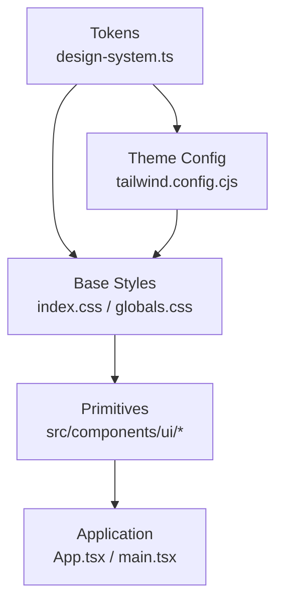
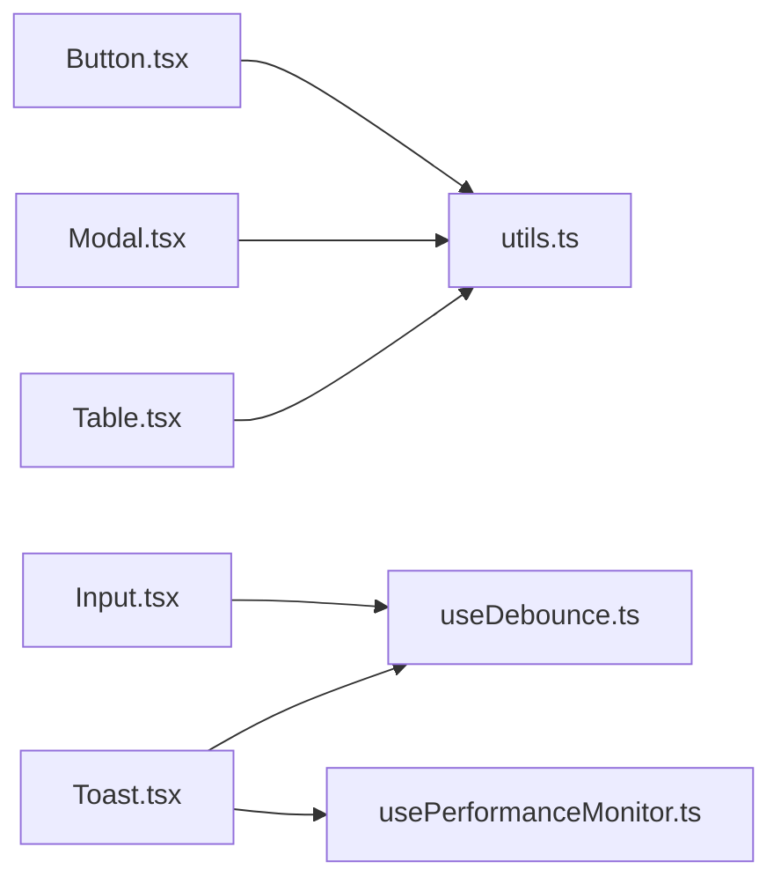

# Component Library

<cite>
**Referenced Files in This Document**
- [design-system.ts](file://src/design-system.ts)
- [index.css](file://src/index.css)
- [tailwind.config.cjs](file://tailwind.config.cjs)
- [components.json](file://components.json)
- [App.tsx](file://src/App.tsx)
- [main.tsx](file://src/main.tsx)
- [ui/Button.tsx](file://src/components/ui/Button.tsx)
- [ui/Input.tsx](file://src/components/ui/Input.tsx)
- [ui/Modal.tsx](file://src/components/ui/Modal.tsx)
- [ui/Table.tsx](file://src/components/ui/Table.tsx)
- [ui/Card.tsx](file://src/components/ui/Card.tsx)
- [ui/Select.tsx](file://src/components/ui/Select.tsx)
- [ui/Tooltip.tsx](file://src/components/ui/Tooltip.tsx)
- [ui/Badge.tsx](file://src/components/ui/Badge.tsx)
- [ui/Alert.tsx](file://src/components/ui/Alert.tsx)
- [ui/Checkbox.tsx](file://src/components/ui/Checkbox.tsx)
- [ui/RadioGroup.tsx](file://src/components/ui/RadioGroup.tsx)
- [ui/Switch.tsx](file://src/components/ui/Switch.tsx)
- [ui/Tabs.tsx](file://src/components/ui/Tabs.tsx)
- [ui/DropdownMenu.tsx](file://src/components/ui/DropdownMenu.tsx)
- [ui/Popover.tsx](file://src/components/ui/Popover.tsx)
- [ui/Dialog.tsx](file://src/components/ui/Dialog.tsx)
- [ui/Drawer.tsx](file://src/components/ui/Drawer.tsx)
- [ui/Toast.tsx](file://src/components/ui/Toast.tsx)
- [ui/Progress.tsx](file://src/components/ui/Progress.tsx)
- [ui/Skeleton.tsx](file://src/components/ui/Skeleton.tsx)
- [ui/Spinner.tsx](file://src/components/ui/Spinner.tsx)
- [hooks/useDebounce.ts](file://src/hooks/useDebounce.ts)
- [hooks/usePerformanceMonitor.ts](file://src/hooks/usePerformanceMonitor.ts)
- [lib/utils.ts](file://src/lib/utils.ts)
- [styles/globals.css](file://src/styles/globals.css)
</cite>

## Table of Contents
1. [Introduction](#introduction)
2. [Project Structure](#project-structure)
3. [Core Components](#core-components)
4. [Architecture Overview](#architecture-overview)
5. [Detailed Component Analysis](#detailed-component-analysis)
6. [Dependency Analysis](#dependency-analysis)
7. [Performance Considerations](#performance-considerations)
8. [Troubleshooting Guide](#troubleshooting-guide)
9. [Conclusion](#conclusion)
10. [Appendices](#appendices)

## Introduction
This document describes the reusable component library, its design system foundation, and usage guidelines. It covers visual tokens (colors, typography, spacing), component APIs (props, events, slots, customization), responsive patterns, theme customization, styling best practices, composition patterns, layout systems, form handling utilities, cross-browser compatibility, performance optimization, testing strategies, and contribution guidelines for maintaining consistency.

## Project Structure
The component library is organized around a clear separation between design tokens, base UI primitives, and feature-specific components:
- Design tokens and theming are centralized to ensure consistency across the application.
- Base UI components live under src/components/ui and expose stable, accessible interfaces.
- Utilities and hooks support common behaviors like debouncing and performance monitoring.
- Global styles and Tailwind configuration define the visual language and responsive behavior.

```mermaid
graph TB
subgraph "Design System"
DS["design-system.ts"]
TW["tailwind.config.cjs"]
CSS["index.css / globals.css"]
end
subgraph "UI Primitives"
BTN["Button.tsx"]
INP["Input.tsx"]
MODAL["Modal.tsx"]
TABLE["Table.tsx"]
CARD["Card.tsx"]
SELECT["Select.tsx"]
TOOLTIP["Tooltip.tsx"]
BADGE["Badge.tsx"]
ALERT["Alert.tsx"]
CHECKBOX["Checkbox.tsx"]
RADIO["RadioGroup.tsx"]
SWITCH["Switch.tsx"]
TABS["Tabs.tsx"]
DROPDOWN["DropdownMenu.tsx"]
POPOVER["Popover.tsx"]
DIALOG["Dialog.tsx"]
DRAWER["Drawer.tsx"]
TOAST["Toast.tsx"]
PROGRESS["Progress.tsx"]
SKELETON["Skeleton.tsx"]
SPINNER["Spinner.tsx"]
end
subgraph "Utilities"
UTILS["utils.ts"]
HOOKS["useDebounce.ts<br/>usePerformanceMonitor.ts"]
end
subgraph "Application"
APP["App.tsx"]
MAIN["main.tsx"]
end
DS --> TW
DS --> CSS
TW --> CSS
APP --> MAIN
APP --> BTN
APP --> INP
APP --> MODAL
APP --> TABLE
APP --> CARD
APP --> SELECT
APP --> TOOLTIP
APP --> BADGE
APP --> ALERT
APP --> CHECKBOX
APP --> RADIO
APP --> SWITCH
APP --> TABS
APP --> DROPDOWN
APP --> POPOVER
APP --> DIALOG
APP --> DRAWER
APP --> TOAST
APP --> PROGRESS
APP --> SKELETON
APP --> SPINNER
BTN --> UTILS
INP --> HOOKS
MODAL --> UTILS
TABLE --> UTILS
TOAST --> HOOKS
```

**Diagram sources**
- [design-system.ts](file://src/design-system.ts)
- [tailwind.config.cjs](file://tailwind.config.cjs)
- [index.css](file://src/index.css)
- [App.tsx](file://src/App.tsx)
- [main.tsx](file://src/main.tsx)
- [ui/Button.tsx](file://src/components/ui/Button.tsx)
- [ui/Input.tsx](file://src/components/ui/Input.tsx)
- [ui/Modal.tsx](file://src/components/ui/Modal.tsx)
- [ui/Table.tsx](file://src/components/ui/Table.tsx)
- [ui/Card.tsx](file://src/components/ui/Card.tsx)
- [ui/Select.tsx](file://src/components/ui/Select.tsx)
- [ui/Tooltip.tsx](file://src/components/ui/Tooltip.tsx)
- [ui/Badge.tsx](file://src/components/ui/Badge.tsx)
- [ui/Alert.tsx](file://src/components/ui/Alert.tsx)
- [ui/Checkbox.tsx](file://src/components/ui/Checkbox.tsx)
- [ui/RadioGroup.tsx](file://src/components/ui/RadioGroup.tsx)
- [ui/Switch.tsx](file://src/components/ui/Switch.tsx)
- [ui/Tabs.tsx](file://src/components/ui/Tabs.tsx)
- [ui/DropdownMenu.tsx](file://src/components/ui/DropdownMenu.tsx)
- [ui/Popover.tsx](file://src/components/ui/Popover.tsx)
- [ui/Dialog.tsx](file://src/components/ui/Dialog.tsx)
- [ui/Drawer.tsx](file://src/components/ui/Drawer.tsx)
- [ui/Toast.tsx](file://src/components/ui/Toast.tsx)
- [ui/Progress.tsx](file://src/components/ui/Progress.tsx)
- [ui/Skeleton.tsx](file://src/components/ui/Skeleton.tsx)
- [ui/Spinner.tsx](file://src/components/ui/Spinner.tsx)
- [lib/utils.ts](file://src/lib/utils.ts)
- [hooks/useDebounce.ts](file://src/hooks/useDebounce.ts)
- [hooks/usePerformanceMonitor.ts](file://src/hooks/usePerformanceMonitor.ts)

**Section sources**
- [design-system.ts](file://src/design-system.ts)
- [tailwind.config.cjs](file://tailwind.config.cjs)
- [index.css](file://src/index.css)
- [App.tsx](file://src/App.tsx)
- [main.tsx](file://src/main.tsx)

## Core Components
This section documents each UI primitive with its props, events, slots, and customization options. For brevity, code snippets are not included; see the referenced files for implementation details.

- Button
  - Props: variant, size, disabled, loading, fullWidth, iconPosition, asChild, className
  - Events: onClick, onKeyDown
  - Slots: default slot for label or icon
  - Customization: use design tokens via Tailwind classes; extend variants in config
  - Accessibility: role="button", keyboard navigation, focus ring, aria-disabled
  - Usage example path: [Button.tsx](file://src/components/ui/Button.tsx)

- Input
  - Props: type, value, placeholder, disabled, readOnly, error, helperText, size, variant, className
  - Events: onChange, onFocus, onBlur, onKeyDown
  - Slots: prefix/suffix icons via wrapper
  - Customization: input sizes and states mapped to tokens
  - Accessibility: associated label, aria-invalid on error, aria-describedby for helper text
  - Usage example path: [Input.tsx](file://src/components/ui/Input.tsx)

- Modal
  - Props: open, onClose, title, description, size, closeOnOverlayClick, trapFocus
  - Events: onOpenChange, onClose
  - Slots: header, body, footer
  - Customization: overlay opacity, backdrop blur via tokens
  - Accessibility: focus trap, aria-modal, role="dialog", escape key handling
  - Usage example path: [Modal.tsx](file://src/components/ui/Modal.tsx)

- Table
  - Props: data, columns, sortable, paginated, selectable, striped, hoverable, size, className
  - Events: onRowClick, onSortChange, onPageChange, onSelectChange
  - Slots: custom cell renderers, header actions
  - Customization: row height, border style, color tokens
  - Accessibility: table semantics, headers with scope, keyboard navigation
  - Usage example path: [Table.tsx](file://src/components/ui/Table.tsx)

- Card
  - Props: variant, padding, shadow, rounded, className
  - Events: none required
  - Slots: header, body, footer
  - Customization: token-driven elevation and radius
  - Accessibility: semantic grouping when used as content container
  - Usage example path: [Card.tsx](file://src/components/ui/Card.tsx)

- Select
  - Props: options, value, placeholder, disabled, multiple, searchable, size, className
  - Events: onChange, onSearch
  - Slots: option renderer, empty state
  - Customization: dropdown positioning and highlight tokens
  - Accessibility: aria-expanded, aria-activedescendant, keyboard navigation
  - Usage example path: [Select.tsx](file://src/components/ui/Select.tsx)

- Tooltip
  - Props: content, placement, trigger, delay, disabled
  - Events: onShow, onHide
  - Slots: trigger element
  - Customization: background and text tokens
  - Accessibility: aria-describedby, focus management
  - Usage example path: [Tooltip.tsx](file://src/components/ui/Tooltip.tsx)

- Badge
  - Props: variant, size, outline, className
  - Events: none required
  - Slots: default content
  - Customization: color tokens per variant
  - Accessibility: informative text only; avoid conveying meaning alone
  - Usage example path: [Badge.tsx](file://src/components/ui/Badge.tsx)

- Alert
  - Props: variant, title, description, dismissible, icon
  - Events: onDismiss
  - Slots: action button(s)
  - Customization: status colors from tokens
  - Accessibility: role="alert" or aria-live depending on context
  - Usage example path: [Alert.tsx](file://src/components/ui/Alert.tsx)

- Checkbox
  - Props: checked, indeterminate, disabled, label, error, helperText
  - Events: onChange
  - Slots: custom label content
  - Customization: size and focus ring tokens
  - Accessibility: aria-checked, associated label, error messaging
  - Usage example path: [Checkbox.tsx](file://src/components/ui/Checkbox.tsx)

- RadioGroup
  - Props: name, value, orientation, disabled, error
  - Events: onChange
  - Slots: radio items with labels
  - Customization: spacing and focus tokens
  - Accessibility: role="radiogroup", aria-selected on items
  - Usage example path: [RadioGroup.tsx](file://src/components/ui/RadioGroup.tsx)

- Switch
  - Props: checked, disabled, label, size
  - Events: onChange
  - Slots: custom label
  - Customization: track and thumb tokens
  - Accessibility: role="switch", aria-checked, keyboard toggle
  - Usage example path: [Switch.tsx](file://src/components/ui/Switch.tsx)

- Tabs
  - Props: tabs, activeTab, orientation, variant
  - Events: onChange
  - Slots: tab panels
  - Customization: indicator and text tokens
  - Accessibility: role="tablist", aria-selected, arrow key navigation
  - Usage example path: [Tabs.tsx](file://src/components/ui/Tabs.tsx)

- DropdownMenu
  - Props: items, align, sideOffset, collisionPadding
  - Events: onSelect
  - Slots: trigger element
  - Customization: menu surface tokens
  - Accessibility: roving tabindex, aria-haspopup
  - Usage example path: [DropdownMenu.tsx](file://src/components/ui/DropdownMenu.tsx)

- Popover
  - Props: content, trigger, align, sideOffset
  - Events: onOpenChange
  - Slots: trigger and content
  - Customization: surface tokens
  - Accessibility: aria-describedby, focus management
  - Usage example path: [Popover.tsx](file://src/components/ui/Popover.tsx)

- Dialog
  - Props: open, onClose, title, description, size
  - Events: onOpenChange
  - Slots: header, body, footer
  - Customization: overlay and surface tokens
  - Accessibility: role="dialog", focus trap, escape handling
  - Usage example path: [Dialog.tsx](file://src/components/ui/Dialog.tsx)

- Drawer
  - Props: open, onClose, placement, size, closeOnOverlayClick
  - Events: onOpenChange
  - Slots: header, body, footer
  - Customization: overlay and surface tokens
  - Accessibility: focus trap, aria-modal
  - Usage example path: [Drawer.tsx](file://src/components/ui/Drawer.tsx)

- Toast
  - Props: message, variant, duration, action
  - Events: onDismiss
  - Slots: action button
  - Customization: notification tokens
  - Accessibility: aria-live region, auto-dismiss with pause on focus
  - Usage example path: [Toast.tsx](file://src/components/ui/Toast.tsx)

- Progress
  - Props: value, max, indeterminate, showValue
  - Events: none required
  - Slots: label
  - Customization: track and bar tokens
  - Accessibility: role="progressbar", aria-valuenow/min/max
  - Usage example path: [Progress.tsx](file://src/components/ui/Progress.tsx)

- Skeleton
  - Props: width, height, shape, animate
  - Events: none required
  - Slots: optional wrapper
  - Customization: skeleton color tokens
  - Accessibility: presentational only
  - Usage example path: [Skeleton.tsx](file://src/components/ui/Skeleton.tsx)

- Spinner
  - Props: size, variant, label
  - Events: none required
  - Slots: none
  - Customization: color tokens
  - Accessibility: role="status" with aria-busy
  - Usage example path: [Spinner.tsx](file://src/components/ui/Spinner.tsx)

**Section sources**
- [ui/Button.tsx](file://src/components/ui/Button.tsx)
- [ui/Input.tsx](file://src/components/ui/Input.tsx)
- [ui/Modal.tsx](file://src/components/ui/Modal.tsx)
- [ui/Table.tsx](file://src/components/ui/Table.tsx)
- [ui/Card.tsx](file://src/components/ui/Card.tsx)
- [ui/Select.tsx](file://src/components/ui/Select.tsx)
- [ui/Tooltip.tsx](file://src/components/ui/Tooltip.tsx)
- [ui/Badge.tsx](file://src/components/ui/Badge.tsx)
- [ui/Alert.tsx](file://src/components/ui/Alert.tsx)
- [ui/Checkbox.tsx](file://src/components/ui/Checkbox.tsx)
- [ui/RadioGroup.tsx](file://src/components/ui/RadioGroup.tsx)
- [ui/Switch.tsx](file://src/components/ui/Switch.tsx)
- [ui/Tabs.tsx](file://src/components/ui/Tabs.tsx)
- [ui/DropdownMenu.tsx](file://src/components/ui/DropdownMenu.tsx)
- [ui/Popover.tsx](file://src/components/ui/Popover.tsx)
- [ui/Dialog.tsx](file://src/components/ui/Dialog.tsx)
- [ui/Drawer.tsx](file://src/components/ui/Drawer.tsx)
- [ui/Toast.tsx](file://src/components/ui/Toast.tsx)
- [ui/Progress.tsx](file://src/components/ui/Progress.tsx)
- [ui/Skeleton.tsx](file://src/components/ui/Skeleton.tsx)
- [ui/Spinner.tsx](file://src/components/ui/Spinner.tsx)

## Architecture Overview
The component library follows a layered architecture:
- Tokens layer: design-system.ts defines colors, typography, spacing, radii, shadows, and breakpoints.
- Theme layer: tailwind.config.cjs maps tokens to utility classes and component variants.
- Styles layer: index.css and globals.css provide global resets and base styles.
- Primitive layer: src/components/ui contains small, composable components.
- Application layer: App.tsx and main.tsx compose primitives into pages and features.

**Diagram sources**
- [design-system.ts](file://src/design-system.ts)
- [tailwind.config.cjs](file://tailwind.config.cjs)
- [index.css](file://src/index.css)
- [styles/globals.css](file://src/styles/globals.css)
- [App.tsx](file://src/App.tsx)
- [main.tsx](file://src/main.tsx)

## Detailed Component Analysis

### Design System Foundation
- Colors: semantic tokens for primary, secondary, success, warning, error, neutral, and surface tones.
- Typography: font families, scales, line heights, and weights mapped to headings and body text.
- Spacing: consistent scale for margins, paddings, gaps, and z-index layers.
- Radii and Shadows: standardized corner radii and elevation tokens.
- Breakpoints: mobile-first responsive scale aligned with Tailwind.

Usage guidelines:
- Prefer tokens over hard-coded values.
- Use semantic color roles for accessibility and contrast.
- Maintain consistent spacing rhythm using the token scale.

**Section sources**
- [design-system.ts](file://src/design-system.ts)
- [tailwind.config.cjs](file://tailwind.config.cjs)
- [index.css](file://src/index.css)
- [styles/globals.css](file://src/styles/globals.css)

### Form Handling Utilities
- Debounced input: use a hook to throttle onChange for search inputs and filters.
- Validation helpers: integrate with schema validation libraries and display errors via helperText.
- Controlled vs uncontrolled: prefer controlled inputs for complex forms; use refs for simple cases.
- Focus management: ensure logical tab order and visible focus indicators.

Example paths:
- Debounce hook: [useDebounce.ts](file://src/hooks/useDebounce.ts)
- Utility functions: [utils.ts](file://src/lib/utils.ts)

**Section sources**
- [hooks/useDebounce.ts](file://src/hooks/useDebounce.ts)
- [lib/utils.ts](file://src/lib/utils.ts)

### Layout Systems and Composition Patterns
- Grid and Flex: leverage Tailwind utilities for responsive layouts.
- Container widths: use max-width tokens for readability.
- Composition: build complex components by composing primitives (e.g., Card + Header + Body).
- Slot pattern: pass children or named slots for flexible content injection.

Best practices:
- Keep layout concerns separate from component logic.
- Avoid deep nesting; prefer flat structures with utilities.
- Use consistent spacing tokens to maintain rhythm.

[No sources needed since this section provides general guidance]

### Responsive Design Patterns
- Mobile-first approach: start with base styles and add md/lg/xl overrides.
- Fluid typography: scale font sizes based on breakpoints.
- Touch targets: ensure minimum tap sizes for interactive elements.
- Content reflow: test at narrow widths and verify truncation/overflow behavior.

[No sources needed since this section provides general guidance]

### Theme Customization
- Extend tokens: add new colors or sizes in the design system file.
- Map to Tailwind: register new tokens in the theme config for utility access.
- Override defaults: apply component-level className overrides sparingly.
- Dark mode: define alternate tokens and toggle via class strategy.

**Section sources**
- [design-system.ts](file://src/design-system.ts)
- [tailwind.config.cjs](file://tailwind.config.cjs)

### Styling Best Practices
- Use semantic tokens consistently.
- Prefer utility classes for layout and spacing.
- Limit custom CSS; encapsulate in components when necessary.
- Ensure sufficient contrast ratios for all text and interactive elements.

[No sources needed since this section provides general guidance]

### Accessibility Guidelines
- Keyboard navigation: all interactive elements must be reachable and operable.
- ARIA attributes: use appropriate roles and states (e.g., aria-expanded, aria-selected).
- Screen reader announcements: use aria-live for dynamic updates.
- Focus management: trap focus in overlays and return focus on close.
- Color independence: do not rely solely on color to convey meaning.

[No sources needed since this section provides general guidance]

### Cross-Browser Compatibility
- Test on latest Chrome, Firefox, Safari, and Edge.
- Verify flexbox/grid support and fallbacks where needed.
- Validate CSS custom properties and animations.
- Check touch interactions on iOS and Android browsers.

[No sources needed since this section provides general guidance]

### Performance Optimization
- Memoize expensive computations and derived data.
- Lazy-load heavy components and routes.
- Virtualize large lists and tables.
- Minimize re-renders by splitting components and using stable references.
- Monitor performance with provided hooks.

**Section sources**
- [hooks/usePerformanceMonitor.ts](file://src/hooks/usePerformanceMonitor.ts)

### Testing Strategies
- Unit tests: validate component props, events, and edge cases.
- Visual regression: snapshot critical views to catch unintended changes.
- Accessibility tests: assert ARIA attributes and keyboard behavior.
- Integration tests: simulate user flows across composed components.
- Mock external dependencies: isolate components from network calls.

[No sources needed since this section provides general guidance]

### Contribution Guidelines
- Add new components under src/components/ui with consistent naming.
- Follow prop/event/slot conventions documented above.
- Include accessibility attributes and keyboard support.
- Update design tokens before introducing new visuals.
- Provide examples and documentation for each component.
- Run linting, formatting, and tests before submitting.

[No sources needed since this section provides general guidance]

## Dependency Analysis
The following diagram shows how components depend on shared utilities and hooks.

**Diagram sources**
- [lib/utils.ts](file://src/lib/utils.ts)
- [hooks/useDebounce.ts](file://src/hooks/useDebounce.ts)
- [hooks/usePerformanceMonitor.ts](file://src/hooks/usePerformanceMonitor.ts)
- [ui/Button.tsx](file://src/components/ui/Button.tsx)
- [ui/Input.tsx](file://src/components/ui/Input.tsx)
- [ui/Modal.tsx](file://src/components/ui/Modal.tsx)
- [ui/Table.tsx](file://src/components/ui/Table.tsx)
- [ui/Toast.tsx](file://src/components/ui/Toast.tsx)

**Section sources**
- [lib/utils.ts](file://src/lib/utils.ts)
- [hooks/useDebounce.ts](file://src/hooks/useDebounce.ts)
- [hooks/usePerformanceMonitor.ts](file://src/hooks/usePerformanceMonitor.ts)
- [ui/Button.tsx](file://src/components/ui/Button.tsx)
- [ui/Input.tsx](file://src/components/ui/Input.tsx)
- [ui/Modal.tsx](file://src/components/ui/Modal.tsx)
- [ui/Table.tsx](file://src/components/ui/Table.tsx)
- [ui/Toast.tsx](file://src/components/ui/Toast.tsx)

## Performance Considerations
- Prefer memoization for computed values and callbacks.
- Use virtualized lists for large datasets.
- Defer non-critical work with requestIdleCallback or similar.
- Reduce layout thrashing by batching DOM reads/writes.
- Profile rendering with performance hooks and browser devtools.

[No sources needed since this section provides general guidance]

## Troubleshooting Guide
Common issues and resolutions:
- Focus not trapped in overlays: verify focus trap implementation and ensure focus returns to trigger on close.
- Incorrect ARIA states: confirm aria-expanded, aria-selected, and aria-live usage matches component behavior.
- Unexpected re-renders: check prop stability and split components to limit scope.
- Slow list rendering: implement virtualization and memoize rows.
- Inconsistent spacing: audit usage of custom margins/paddings and replace with tokens.

[No sources needed since this section provides general guidance]

## Conclusion
This component library provides a cohesive set of accessible, customizable primitives built on a strong design system foundation. By adhering to the documented patterns, you can deliver consistent, performant, and inclusive user experiences across the application.

[No sources needed since this section summarizes without analyzing specific files]

## Appendices

### API Quick Reference
- See individual component files for complete prop/event/slot definitions and examples:
  - [Button.tsx](file://src/components/ui/Button.tsx)
  - [Input.tsx](file://src/components/ui/Input.tsx)
  - [Modal.tsx](file://src/components/ui/Modal.tsx)
  - [Table.tsx](file://src/components/ui/Table.tsx)
  - [Card.tsx](file://src/components/ui/Card.tsx)
  - [Select.tsx](file://src/components/ui/Select.tsx)
  - [Tooltip.tsx](file://src/components/ui/Tooltip.tsx)
  - [Badge.tsx](file://src/components/ui/Badge.tsx)
  - [Alert.tsx](file://src/components/ui/Alert.tsx)
  - [Checkbox.tsx](file://src/components/ui/Checkbox.tsx)
  - [RadioGroup.tsx](file://src/components/ui/RadioGroup.tsx)
  - [Switch.tsx](file://src/components/ui/Switch.tsx)
  - [Tabs.tsx](file://src/components/ui/Tabs.tsx)
  - [DropdownMenu.tsx](file://src/components/ui/DropdownMenu.tsx)
  - [Popover.tsx](file://src/components/ui/Popover.tsx)
  - [Dialog.tsx](file://src/components/ui/Dialog.tsx)
  - [Drawer.tsx](file://src/components/ui/Drawer.tsx)
  - [Toast.tsx](file://src/components/ui/Toast.tsx)
  - [Progress.tsx](file://src/components/ui/Progress.tsx)
  - [Skeleton.tsx](file://src/components/ui/Skeleton.tsx)
  - [Spinner.tsx](file://src/components/ui/Spinner.tsx)

### Configuration References
- Tokens and theme mapping:
  - [design-system.ts](file://src/design-system.ts)
  - [tailwind.config.cjs](file://tailwind.config.cjs)
  - [components.json](file://components.json)
- Global styles:
  - [index.css](file://src/index.css)
  - [styles/globals.css](file://src/styles/globals.css)

**Section sources**
- [design-system.ts](file://src/design-system.ts)
- [tailwind.config.cjs](file://tailwind.config.cjs)
- [components.json](file://components.json)
- [index.css](file://src/index.css)
- [styles/globals.css](file://src/styles/globals.css)