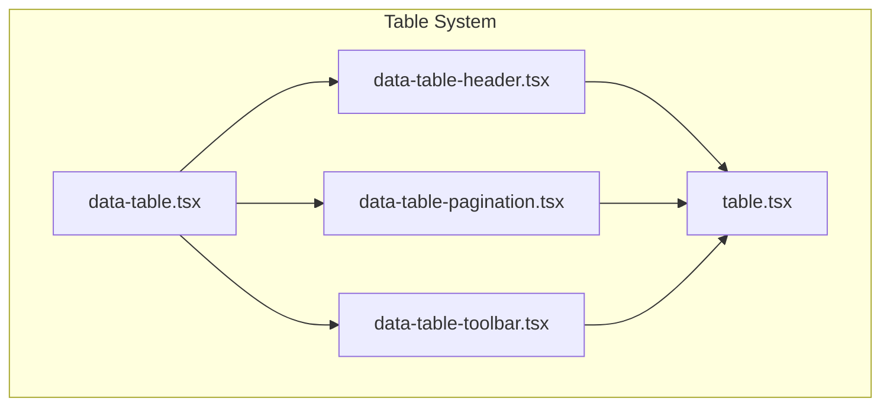
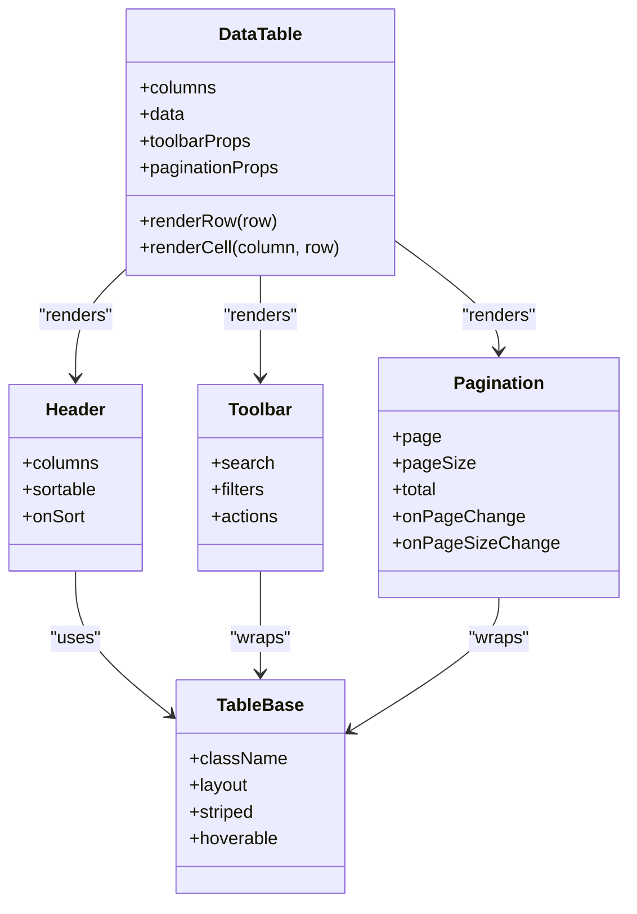
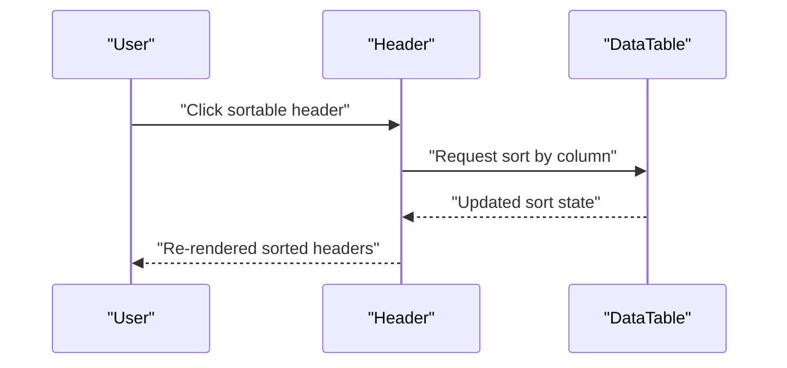
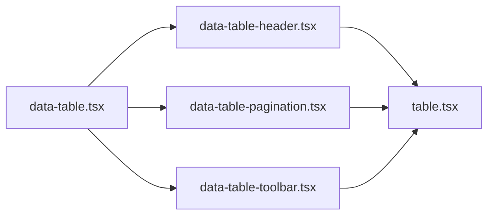

# Basic Tables

<cite>
**Referenced Files in This Document**
- [table.tsx](file://table-system/components/ui/table/table.tsx)
- [data-table-header.tsx](file://table-system/components/ui/table/data-table-header.tsx)
- [data-table-pagination.tsx](file://table-system/components/ui/table/data-table-pagination.tsx)
- [data-table-toolbar.tsx](file://table-system/components/ui/table/data-table-toolbar.tsx)
- [data-table.tsx](file://table-system/components/ui/table/data-table.tsx)
</cite>

## Table of Contents
1. [Introduction](#introduction)
2. [Project Structure](#project-structure)
3. [Core Components](#core-components)
4. [Architecture Overview](#architecture-overview)
5. [Detailed Component Analysis](#detailed-component-analysis)
6. [Dependency Analysis](#dependency-analysis)
7. [Performance Considerations](#performance-considerations)
8. [Troubleshooting Guide](#troubleshooting-guide)
9. [Conclusion](#conclusion)
10. [Appendices](#appendices)

## Introduction
This document explains the basic table components used to display tabular data with a focus on:
- Column definitions and header setup
- Row rendering and cell content formatting
- Data binding patterns for static and dynamic datasets
- Props, styling options, and layout configuration
- Responsive behavior and mobile adaptations
- Common use cases such as lists, catalogs, and reference data

The goal is to help you quickly build accessible, readable tables that scale from small static lists to larger dynamic datasets.

## Project Structure
The table system is organized under a dedicated UI package path with focused modules:
- Base table primitives (semantic HTML structure)
- Header row component
- Toolbar for search, filters, and actions
- Pagination controls
- A higher-level data table orchestrator that wires columns, rows, toolbar, and pagination together

**Diagram sources**
- [table.tsx](file://table-system/components/ui/table/table.tsx)
- [data-table-header.tsx](file://table-system/components/ui/table/data-table-header.tsx)
- [data-table-pagination.tsx](file://table-system/components/ui/table/data-table-pagination.tsx)
- [data-table-toolbar.tsx](file://table-system/components/ui/table/data-table-toolbar.tsx)
- [data-table.tsx](file://table-system/components/ui/table/data-table.tsx)

**Section sources**
- [table.tsx](file://table-system/components/ui/table/table.tsx)
- [data-table-header.tsx](file://table-system/components/ui/table/data-table-header.tsx)
- [data-table-pagination.tsx](file://table-system/components/ui/table/data-table-pagination.tsx)
- [data-table-toolbar.tsx](file://table-system/components/ui/table/data-table-toolbar.tsx)
- [data-table.tsx](file://table-system/components/ui/table/data-table.tsx)

## Core Components
- Base table primitive: Provides semantic table elements and foundational classes for consistent layout and accessibility.
- Header component: Renders column headers, supports alignment, sorting hooks, and responsive visibility toggles.
- Toolbar component: Hosts search input, filter chips, and action buttons; integrates with the data table’s state.
- Pagination component: Displays page size selector, current page info, and navigation controls.
- Data table orchestrator: Accepts column definitions and data arrays, renders header, body, toolbar, and pagination, and manages common interactions like sorting and filtering.

Key responsibilities:
- Declarative column definitions drive header generation and cell renderers
- Rows are rendered by mapping over data arrays
- Cell content can be plain text or custom React nodes
- Styling is applied via utility classes for spacing, alignment, and responsive behavior

**Section sources**
- [table.tsx](file://table-system/components/ui/table/table.tsx)
- [data-table-header.tsx](file://table-system/components/ui/table/data-table-header.tsx)
- [data-table-toolbar.tsx](file://table-system/components/ui/table/data-table-toolbar.tsx)
- [data-table-pagination.tsx](file://table-system/components/ui/table/data-table-pagination.tsx)
- [data-table.tsx](file://table-system/components/ui/table/data-table.tsx)

## Architecture Overview
The data table composes smaller building blocks into a cohesive experience. The orchestrator coordinates props and state, while the base table provides the structural foundation.

**Diagram sources**
- [data-table.tsx](file://table-system/components/ui/table/data-table.tsx)
- [table.tsx](file://table-system/components/ui/table/table.tsx)
- [data-table-header.tsx](file://table-system/components/ui/table/data-table-header.tsx)
- [data-table-toolbar.tsx](file://table-system/components/ui/table/data-table-toolbar.tsx)
- [data-table-pagination.tsx](file://table-system/components/ui/table/data-table-pagination.tsx)

## Detailed Component Analysis

### Base Table Primitive
Purpose:
- Provide semantic table markup and shared styling tokens
- Offer optional visual variants (striped rows, hover states) and layout modes

Common usage:
- Wrap your table content with this primitive to ensure consistent baseline styles and accessibility attributes
- Apply layout and variant props to control appearance

Styling guidance:
- Use utility classes for spacing and alignment
- Prefer responsive utilities to hide/show columns on small screens

**Section sources**
- [table.tsx](file://table-system/components/ui/table/table.tsx)

### Header Component
Responsibilities:
- Render column titles based on column definitions
- Support sortable headers when enabled
- Respect per-column alignment and width hints
- Toggle visibility for responsive layouts

Column definition highlights:
- Label for header text
- Key or accessor for data binding
- Optional sort configuration
- Optional visibility flags for responsive breakpoints

Sorting flow:

**Diagram sources**
- [data-table-header.tsx](file://table-system/components/ui/table/data-table-header.tsx)
- [data-table.tsx](file://table-system/components/ui/table/data-table.tsx)

**Section sources**
- [data-table-header.tsx](file://table-system/components/ui/table/data-table-header.tsx)
- [data-table.tsx](file://table-system/components/ui/table/data-table.tsx)

### Toolbar Component
Responsibilities:
- Provide search input and filter controls
- Expose action buttons (e.g., export, add new)
- Integrate with the data table’s state for filtering and searching

Integration points:
- Search input updates a query string passed to the data table
- Filters update an object consumed by the data table’s data source
- Actions trigger callbacks defined at the data table level

**Section sources**
- [data-table-toolbar.tsx](file://table-system/components/ui/table/data-table-toolbar.tsx)
- [data-table.tsx](file://table-system/components/ui/table/data-table.tsx)

### Pagination Component
Responsibilities:
- Display current page and total records
- Allow changing page size and navigating pages
- Emit events for page changes and page size adjustments

Typical props:
- Current page index
- Page size
- Total record count
- Callbacks for page change and page size change

**Section sources**
- [data-table-pagination.tsx](file://table-system/components/ui/table/data-table-pagination.tsx)
- [data-table.tsx](file://table-system/components/ui/table/data-table.tsx)

### Data Table Orchestrator
Responsibilities:
- Accept column definitions and data arrays
- Compose header, body, toolbar, and pagination
- Manage common interactions (sorting, filtering, pagination)
- Provide hooks or callbacks for advanced customization

Data binding patterns:
- Static data: Pass a local array directly to the data prop
- Dynamic data: Fetch data via a hook and pass it to the data prop
- Cell rendering: Use column render functions or slot-based cells for rich content

Responsive behavior:
- Hide less important columns on small screens using column visibility flags
- Enable horizontal scrolling for wide tables on mobile devices
- Adjust row density and font sizes via utility classes

**Section sources**
- [data-table.tsx](file://table-system/components/ui/table/data-table.tsx)

## Dependency Analysis
The data table depends on the base table primitive and composes header, toolbar, and pagination. This separation improves reusability and testability.

**Diagram sources**
- [data-table.tsx](file://table-system/components/ui/table/data-table.tsx)
- [data-table-header.tsx](file://table-system/components/ui/table/data-table-header.tsx)
- [data-table-pagination.tsx](file://table-system/components/ui/table/data-table-pagination.tsx)
- [data-table-toolbar.tsx](file://table-system/components/ui/table/data-table-toolbar.tsx)
- [table.tsx](file://table-system/components/ui/table/table.tsx)

**Section sources**
- [data-table.tsx](file://table-system/components/ui/table/data-table.tsx)
- [table.tsx](file://table-system/components/ui/table/table.tsx)

## Performance Considerations
- Keep column definitions stable across renders to avoid unnecessary re-renders
- Memoize expensive cell renderers where possible
- For large datasets, consider virtualization or server-side pagination/sorting/filtering
- Limit the number of visible columns on mobile to reduce DOM size
- Avoid heavy computations inside render loops; precompute derived values upstream

[No sources needed since this section provides general guidance]

## Troubleshooting Guide
Common issues and resolutions:
- Missing keys in data arrays: Ensure each row has a unique identifier to prevent rendering anomalies
- Unstable column definitions: Define columns outside of render or memoize them to avoid repeated allocations
- Sorting not working: Verify sort handlers are wired and that the data source returns sorted results
- Pagination mismatch: Confirm total count matches the actual dataset size after filtering
- Mobile overflow: Add horizontal scroll wrapper or hide low-priority columns on small screens

**Section sources**
- [data-table.tsx](file://table-system/components/ui/table/data-table.tsx)
- [data-table-header.tsx](file://table-system/components/ui/table/data-table-header.tsx)
- [data-table-pagination.tsx](file://table-system/components/ui/table/data-table-pagination.tsx)
- [data-table-toolbar.tsx](file://table-system/components/ui/table/data-table-toolbar.tsx)
- [table.tsx](file://table-system/components/ui/table/table.tsx)

## Conclusion
By composing a base table primitive with focused header, toolbar, and pagination components, the data table offers a flexible and maintainable way to present tabular data. With declarative column definitions, clear data binding patterns, and responsive strategies, you can implement everything from simple static lists to complex catalogs and reference data views.

[No sources needed since this section summarizes without analyzing specific files]

## Appendices

### Quick Start Examples

Static list example:
- Define a few columns with labels and accessors
- Pass a small static array to the data prop
- Render the data table without toolbar or pagination

Dynamic catalog example:
- Fetch data from an API and store it in state
- Wire toolbar search and filters to refine the dataset
- Enable pagination to handle larger result sets

Reference data example:
- Use minimal columns and disable sorting/pagination if appropriate
- Format cell content consistently (e.g., currency, dates)
- Keep the table compact and readable

[No sources needed since this section provides conceptual examples]