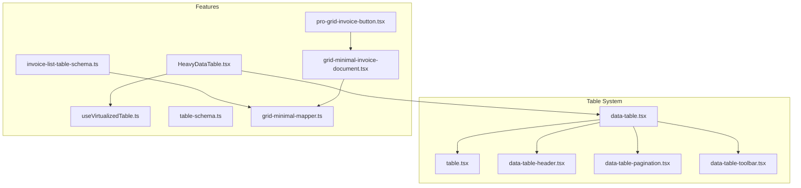
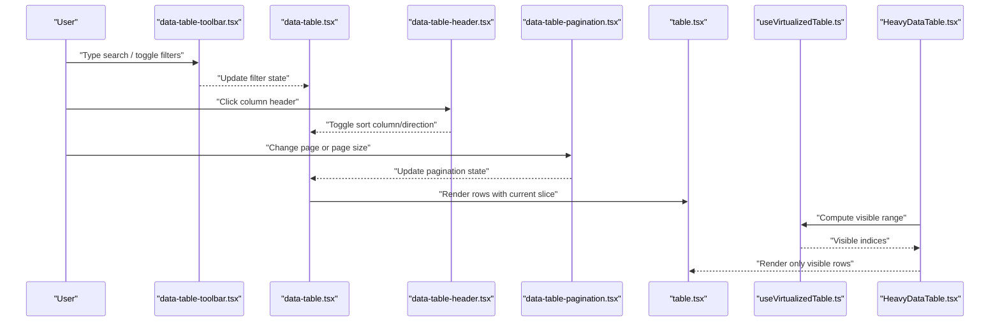
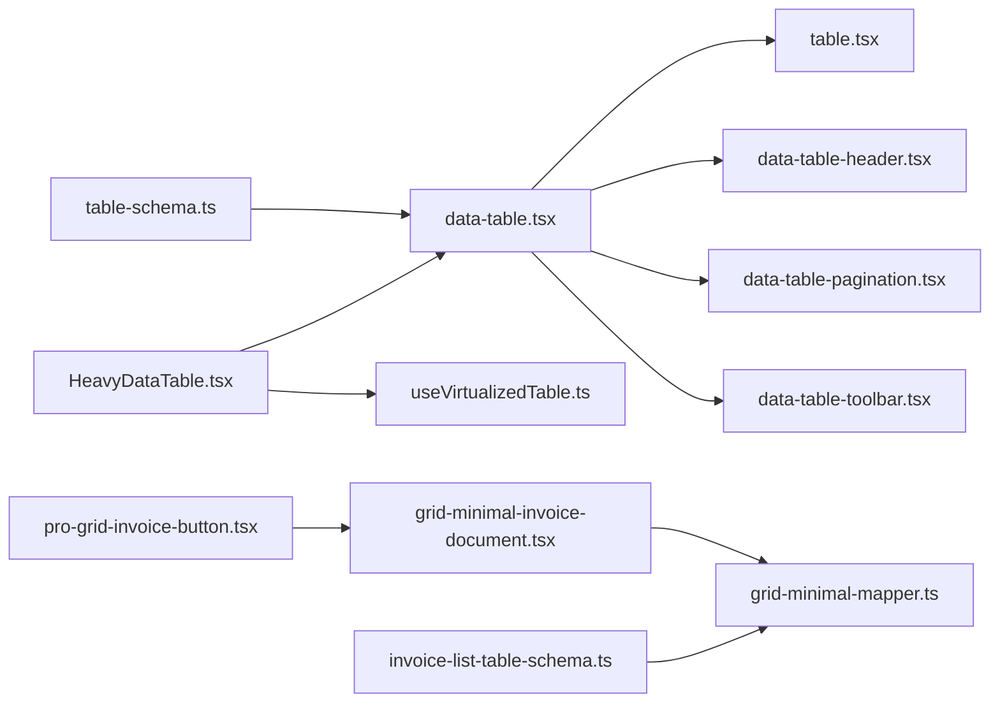

# Data Tables & Grids

<cite>
**Referenced Files in This Document**
- [table.tsx](file://table-system/components/ui/table/table.tsx)
- [data-table.tsx](file://table-system/components/ui/table/data-table.tsx)
- [data-table-header.tsx](file://table-system/components/ui/table/data-table-header.tsx)
- [data-table-pagination.tsx](file://table-system/components/ui/table/data-table-pagination.tsx)
- [data-table-toolbar.tsx](file://table-system/components/ui/table/data-table-toolbar.tsx)
- [HeavyDataTable.tsx](file://src/components/HeavyDataTable.tsx)
- [useVirtualizedTable.ts](file://src/hooks/useVirtualizedTable.ts)
- [table-schema.ts](file://src/lib/table-schema.ts)
- [invoice-list-table-schema.ts](file://src/invoices/invoice-list-table-schema.ts)
- [grid-minimal-mapper.ts](file://src/invoices/grid-minimal-mapper.ts)
- [grid-minimal-invoice-document.tsx](file://src/invoices/grid-minimal-invoice-document.tsx)
- [pro-grid-invoice-button.tsx](file://src/invoices/pro-grid-invoice-button.tsx)
</cite>

## Table of Contents
1. [Introduction](#introduction)
2. [Project Structure](#project-structure)
3. [Core Components](#core-components)
4. [Architecture Overview](#architecture-overview)
5. [Detailed Component Analysis](#detailed-component-analysis)
6. [Dependency Analysis](#dependency-analysis)
7. [Performance Considerations](#performance-considerations)
8. [Troubleshooting Guide](#troubleshooting-guide)
9. [Conclusion](#conclusion)
10. [Appendices](#appendices)

## Introduction
This document explains the enhanced data table and grid system used across the application. It covers column definitions, sorting, filtering, pagination, toolbar utilities, header components, and virtualization for large datasets. It also provides guidance on responsive behavior, mobile adaptations, custom cell renderers, row actions, bulk operations, export functionality, and accessibility requirements for screen readers.

## Project Structure
The table system is organized into a small set of focused UI primitives and higher-level composition patterns:
- Core table primitives under table-system/components/ui/table
- A heavy-duty table component for large datasets
- A virtualization hook to optimize rendering performance
- Shared table schema utilities and invoice-specific grid examples

**Diagram sources**
- [table.tsx](file://table-system/components/ui/table/table.tsx)
- [data-table.tsx](file://table-system/components/ui/table/data-table.tsx)
- [data-table-header.tsx](file://table-system/components/ui/table/data-table-header.tsx)
- [data-table-pagination.tsx](file://table-system/components/ui/table/data-table-pagination.tsx)
- [data-table-toolbar.tsx](file://table-system/components/ui/table/data-table-toolbar.tsx)
- [HeavyDataTable.tsx](file://src/components/HeavyDataTable.tsx)
- [useVirtualizedTable.ts](file://src/hooks/useVirtualizedTable.ts)
- [table-schema.ts](file://src/lib/table-schema.ts)
- [invoice-list-table-schema.ts](file://src/invoices/invoice-list-table-schema.ts)
- [grid-minimal-mapper.ts](file://src/invoices/grid-minimal-mapper.ts)
- [grid-minimal-invoice-document.tsx](file://src/invoices/grid-minimal-invoice-document.tsx)
- [pro-grid-invoice-button.tsx](file://src/invoices/pro-grid-invoice-button.tsx)

**Section sources**
- [table.tsx](file://table-system/components/ui/table/table.tsx)
- [data-table.tsx](file://table-system/components/ui/table/data-table.tsx)
- [data-table-header.tsx](file://table-system/components/ui/table/data-table-header.tsx)
- [data-table-pagination.tsx](file://table-system/components/ui/table/data-table-pagination.tsx)
- [data-table-toolbar.tsx](file://table-system/components/ui/table/data-table-toolbar.tsx)
- [HeavyDataTable.tsx](file://src/components/HeavyDataTable.tsx)
- [useVirtualizedTable.ts](file://src/hooks/useVirtualizedTable.ts)
- [table-schema.ts](file://src/lib/table-schema.ts)
- [invoice-list-table-schema.ts](file://src/invoices/invoice-list-table-schema.ts)
- [grid-minimal-mapper.ts](file://src/invoices/grid-minimal-mapper.ts)
- [grid-minimal-invoice-document.tsx](file://src/invoices/grid-minimal-invoice-document.tsx)
- [pro-grid-invoice-button.tsx](file://src/invoices/pro-grid-invoice-button.tsx)

## Core Components
- Base table primitive: Provides semantic HTML structure and styling hooks for building tables.
- Enhanced data table: Composes header, body, pagination, and toolbar with shared state for sorting, filtering, and page navigation.
- Header component: Renders sortable column headers and integrates with the data table’s sort state.
- Pagination controls: Manages current page, page size, and total records; exposes handlers for page changes.
- Toolbar utilities: Offers search input, filters, and action buttons that integrate with the data table’s filter state.
- Heavy data table: Optimizes rendering for large datasets by combining virtualization with the enhanced data table.
- Virtualization hook: Calculates visible rows based on scroll position and container height to minimize DOM nodes.
- Table schema utilities: Centralizes column definitions, types, and formatting rules for consistent table layouts.
- Invoice grid examples: Demonstrates mapping, document rendering, and action buttons within a grid context.

Key responsibilities:
- Column definitions drive rendering, sorting, and filtering behavior.
- Sorting toggles order and direction per column.
- Filtering applies client-side or server-driven constraints via toolbar inputs.
- Pagination slices data for display while preserving total count.
- Toolbar aggregates user interactions and updates table state.
- Virtualization reduces layout thrash and memory usage for large lists.

**Section sources**
- [table.tsx](file://table-system/components/ui/table/table.tsx)
- [data-table.tsx](file://table-system/components/ui/table/data-table.tsx)
- [data-table-header.tsx](file://table-system/components/ui/table/data-table-header.tsx)
- [data-table-pagination.tsx](file://table-system/components/ui/table/data-table-pagination.tsx)
- [data-table-toolbar.tsx](file://table-system/components/ui/table/data-table-toolbar.tsx)
- [HeavyDataTable.tsx](file://src/components/HeavyDataTable.tsx)
- [useVirtualizedTable.ts](file://src/hooks/useVirtualizedTable.ts)
- [table-schema.ts](file://src/lib/table-schema.ts)
- [invoice-list-table-schema.ts](file://src/invoices/invoice-list-table-schema.ts)
- [grid-minimal-mapper.ts](file://src/invoices/grid-minimal-mapper.ts)
- [grid-minimal-invoice-document.tsx](file://src/invoices/grid-minimal-invoice-document.tsx)
- [pro-grid-invoice-button.tsx](file://src/invoices/pro-grid-invoice-button.tsx)

## Architecture Overview
The enhanced data table composes smaller, focused components and hooks to deliver a flexible grid experience. The flow below shows how user interactions propagate through the system.

**Diagram sources**
- [data-table-toolbar.tsx](file://table-system/components/ui/table/data-table-toolbar.tsx)
- [data-table.tsx](file://table-system/components/ui/table/data-table.tsx)
- [data-table-header.tsx](file://table-system/components/ui/table/data-table-header.tsx)
- [data-table-pagination.tsx](file://table-system/components/ui/table/data-table-pagination.tsx)
- [table.tsx](file://table-system/components/ui/table/table.tsx)
- [useVirtualizedTable.ts](file://src/hooks/useVirtualizedTable.ts)
- [HeavyDataTable.tsx](file://src/components/HeavyDataTable.tsx)

## Detailed Component Analysis

### Enhanced Data Table (data-table.tsx)
Responsibilities:
- Owns shared state for columns, sorting, filtering, and pagination.
- Coordinates child components (header, pagination, toolbar).
- Applies transformations (sort/filter/paginate) before passing data to the base table.

Usage patterns:
- Define columns once using the table schema utilities.
- Provide initial sort and filter values.
- Wire toolbar inputs to update filter state.
- Render pagination at the bottom and header at the top.

Best practices:
- Keep column definitions stable across renders to avoid unnecessary re-renders.
- Use memoization for derived data when dataset is large.
- Prefer controlled props for sorting and pagination to enable external control if needed.

**Section sources**
- [data-table.tsx](file://table-system/components/ui/table/data-table.tsx)
- [table-schema.ts](file://src/lib/table-schema.ts)

### Table Header (data-table-header.tsx)
Responsibilities:
- Renders column headers with sort indicators.
- Emits sort change events to the parent data table.
- Supports multi-column sorting where applicable.

Accessibility:
- Ensure each header button has an aria-label describing the sort state.
- Announce active sort column and direction to assistive technologies.

**Section sources**
- [data-table-header.tsx](file://table-system/components/ui/table/data-table-header.tsx)

### Pagination Controls (data-table-pagination.tsx)
Responsibilities:
- Displays current page, total pages, and page size options.
- Emits page change and page size change events.
- Integrates with total record counts from the data source.

Mobile considerations:
- Collapse page size selector into a dropdown on small screens.
- Show minimal controls and hide less critical info on very narrow widths.

**Section sources**
- [data-table-pagination.tsx](file://table-system/components/ui/table/data-table-pagination.tsx)

### Toolbar Utilities (data-table-toolbar.tsx)
Responsibilities:
- Provides global search input and filter toggles.
- Updates filter state consumed by the data table.
- Exposes action buttons for bulk operations and exports.

Integration:
- Connect search input to debounce logic to reduce re-renders.
- Persist filter preferences in local storage if appropriate.

**Section sources**
- [data-table-toolbar.tsx](file://table-system/components/ui/table/data-table-toolbar.tsx)

### Base Table Primitive (table.tsx)
Responsibilities:
- Renders the underlying HTML table structure.
- Accepts rows and columns for rendering.
- Provides styling hooks and responsive behaviors.

Responsive behavior:
- Enable horizontal scrolling on small screens.
- Optionally switch to card-like layout for mobile views.

**Section sources**
- [table.tsx](file://table-system/components/ui/table/table.tsx)

### Heavy Data Table (HeavyDataTable.tsx)
Responsibilities:
- Wraps the enhanced data table with virtualization for large datasets.
- Uses the virtualization hook to compute visible rows.
- Optimizes rendering performance by limiting DOM nodes.

When to use:
- Large datasets (thousands of rows).
- Complex cells that are expensive to render.

**Section sources**
- [HeavyDataTable.tsx](file://src/components/HeavyDataTable.tsx)
- [useVirtualizedTable.ts](file://src/hooks/useVirtualizedTable.ts)

### Virtualization Hook (useVirtualizedTable.ts)
Responsibilities:
- Computes start and end indices for visible rows based on scroll position and container height.
- Returns a slice of data to render and helper functions for scroll management.

Performance implications:
- Reduces memory footprint and layout recalculations.
- Requires accurate row heights or fixed-height rows for best results.

**Section sources**
- [useVirtualizedTable.ts](file://src/hooks/useVirtualizedTable.ts)

### Table Schema Utilities (table-schema.ts)
Responsibilities:
- Defines column metadata such as label, accessor, type, formatter, and sortability.
- Centralizes formatting rules and validation hints.

Benefits:
- Consistent column behavior across tables.
- Easier maintenance and reuse of column definitions.

**Section sources**
- [table-schema.ts](file://src/lib/table-schema.ts)

### Invoice Grid Examples
- Invoice list table schema: Demonstrates domain-specific column definitions for invoices.
- Minimal mapper: Maps raw data to grid-friendly structures.
- Minimal invoice document: Shows how to render complex content inside grid cells.
- Pro grid invoice button: Adds action buttons within the grid for quick operations.

These examples illustrate:
- Custom cell renderers for rich content.
- Row actions integrated into the grid.
- Export and generation workflows triggered from grid actions.

**Section sources**
- [invoice-list-table-schema.ts](file://src/invoices/invoice-list-table-schema.ts)
- [grid-minimal-mapper.ts](file://src/invoices/grid-minimal-mapper.ts)
- [grid-minimal-invoice-document.tsx](file://src/invoices/grid-minimal-invoice-document.tsx)
- [pro-grid-invoice-button.tsx](file://src/invoices/pro-grid-invoice-button.tsx)

## Dependency Analysis
The following diagram maps key dependencies between table components and supporting modules.

**Diagram sources**
- [data-table.tsx](file://table-system/components/ui/table/data-table.tsx)
- [table.tsx](file://table-system/components/ui/table/table.tsx)
- [data-table-header.tsx](file://table-system/components/ui/table/data-table-header.tsx)
- [data-table-pagination.tsx](file://table-system/components/ui/table/data-table-pagination.tsx)
- [data-table-toolbar.tsx](file://table-system/components/ui/table/data-table-toolbar.tsx)
- [HeavyDataTable.tsx](file://src/components/HeavyDataTable.tsx)
- [useVirtualizedTable.ts](file://src/hooks/useVirtualizedTable.ts)
- [invoice-list-table-schema.ts](file://src/invoices/invoice-list-table-schema.ts)
- [grid-minimal-mapper.ts](file://src/invoices/grid-minimal-mapper.ts)
- [grid-minimal-invoice-document.tsx](file://src/invoices/grid-minimal-invoice-document.tsx)
- [pro-grid-invoice-button.tsx](file://src/invoices/pro-grid-invoice-button.tsx)
- [table-schema.ts](file://src/lib/table-schema.ts)

**Section sources**
- [data-table.tsx](file://table-system/components/ui/table/data-table.tsx)
- [table.tsx](file://table-system/components/ui/table/table.tsx)
- [data-table-header.tsx](file://table-system/components/ui/table/data-table-header.tsx)
- [data-table-pagination.tsx](file://table-system/components/ui/table/data-table-pagination.tsx)
- [data-table-toolbar.tsx](file://table-system/components/ui/table/data-table-toolbar.tsx)
- [HeavyDataTable.tsx](file://src/components/HeavyDataTable.tsx)
- [useVirtualizedTable.ts](file://src/hooks/useVirtualizedTable.ts)
- [table-schema.ts](file://src/lib/table-schema.ts)
- [invoice-list-table-schema.ts](file://src/invoices/invoice-list-table-schema.ts)
- [grid-minimal-mapper.ts](file://src/invoices/grid-minimal-mapper.ts)
- [grid-minimal-invoice-document.tsx](file://src/invoices/grid-minimal-invoice-document.tsx)
- [pro-grid-invoice-button.tsx](file://src/invoices/pro-grid-invoice-button.tsx)

## Performance Considerations
- Virtualization: Use the heavy data table and virtualization hook for large datasets to limit rendered nodes.
- Memoization: Memoize column definitions and derived data to prevent unnecessary re-renders.
- Debounced search: Apply debouncing to toolbar search inputs to reduce frequent state updates.
- Fixed row heights: When possible, use fixed row heights to improve virtualization accuracy.
- Lazy loading: Combine pagination with server-side fetching to minimize payload sizes.
- Avoid heavy computations in render paths; precompute or cache results.

[No sources needed since this section provides general guidance]

## Troubleshooting Guide
Common issues and resolutions:
- Columns not sorting: Verify sort handlers are wired to the data table and that column definitions mark fields as sortable.
- Filters not applying: Ensure toolbar inputs update the filter state consumed by the data table and that derived data recomputes correctly.
- Pagination mismatch: Confirm total record counts reflect filtered results and that page size changes reset to page one.
- Virtualization glitches: Check container height and row heights; ensure the virtualization hook receives correct measurements.
- Mobile overflow: Enable horizontal scrolling or adaptive layouts for small screens.

**Section sources**
- [data-table.tsx](file://table-system/components/ui/table/data-table.tsx)
- [data-table-header.tsx](file://table-system/components/ui/table/data-table-header.tsx)
- [data-table-pagination.tsx](file://table-system/components/ui/table/data-table-pagination.tsx)
- [data-table-toolbar.tsx](file://table-system/components/ui/table/data-table-toolbar.tsx)
- [HeavyDataTable.tsx](file://src/components/HeavyDataTable.tsx)
- [useVirtualizedTable.ts](file://src/hooks/useVirtualizedTable.ts)

## Conclusion
The enhanced data table system provides a modular, performant foundation for building robust grids. By composing header, pagination, toolbar, and base table primitives, and leveraging virtualization for large datasets, teams can create accessible, responsive, and high-performance data interfaces. The invoice grid examples demonstrate advanced patterns like custom cell renderers, row actions, and export flows.

[No sources needed since this section summarizes without analyzing specific files]

## Appendices

### Creating a Complex Table with Virtualization
Steps:
- Define columns using the table schema utilities.
- Wrap the enhanced data table with the heavy data table.
- Provide data and pagination state from your data layer.
- Integrate toolbar search and filters.
- Add row actions and bulk operations via toolbar and cell renderers.

**Section sources**
- [HeavyDataTable.tsx](file://src/components/HeavyDataTable.tsx)
- [useVirtualizedTable.ts](file://src/hooks/useVirtualizedTable.ts)
- [table-schema.ts](file://src/lib/table-schema.ts)
- [data-table.tsx](file://table-system/components/ui/table/data-table.tsx)
- [data-table-toolbar.tsx](file://table-system/components/ui/table/data-table-toolbar.tsx)

### Responsive Behavior and Mobile Adaptations
Guidelines:
- Enable horizontal scrolling for wide tables on small screens.
- Collapse non-essential columns or switch to a card layout on mobile.
- Adjust pagination controls for touch targets and limited width.

**Section sources**
- [table.tsx](file://table-system/components/ui/table/table.tsx)
- [data-table-pagination.tsx](file://table-system/components/ui/table/data-table-pagination.tsx)

### Custom Cell Renderers and Row Actions
Patterns:
- Use column renderers to inject custom components into cells.
- Add row actions via toolbar buttons or inline cell buttons.
- For invoice-style grids, leverage the minimal mapper and document components to compose rich content.

**Section sources**
- [grid-minimal-mapper.ts](file://src/invoices/grid-minimal-mapper.ts)
- [grid-minimal-invoice-document.tsx](file://src/invoices/grid-minimal-invoice-document.tsx)
- [pro-grid-invoice-button.tsx](file://src/invoices/pro-grid-invoice-button.tsx)

### Bulk Operations and Export Functionality
Approaches:
- Select multiple rows via checkboxes and expose bulk actions in the toolbar.
- Trigger export workflows from toolbar buttons, generating CSV/PDF outputs.
- Combine selection state with server-side operations for efficiency.

**Section sources**
- [data-table-toolbar.tsx](file://table-system/components/ui/table/data-table-toolbar.tsx)
- [pro-grid-invoice-button.tsx](file://src/invoices/pro-grid-invoice-button.tsx)

### Accessibility Requirements and Screen Reader Compatibility
Recommendations:
- Use semantic table elements and proper headings.
- Provide descriptive aria labels for sortable headers and action buttons.
- Announce sort states and pagination changes to assistive technologies.
- Ensure keyboard navigability for all interactive elements.

**Section sources**
- [data-table-header.tsx](file://table-system/components/ui/table/data-table-header.tsx)
- [data-table-pagination.tsx](file://table-system/components/ui/table/data-table-pagination.tsx)
- [table.tsx](file://table-system/components/ui/table/table.tsx)