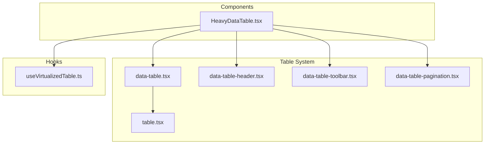
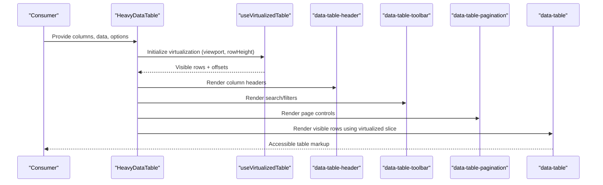
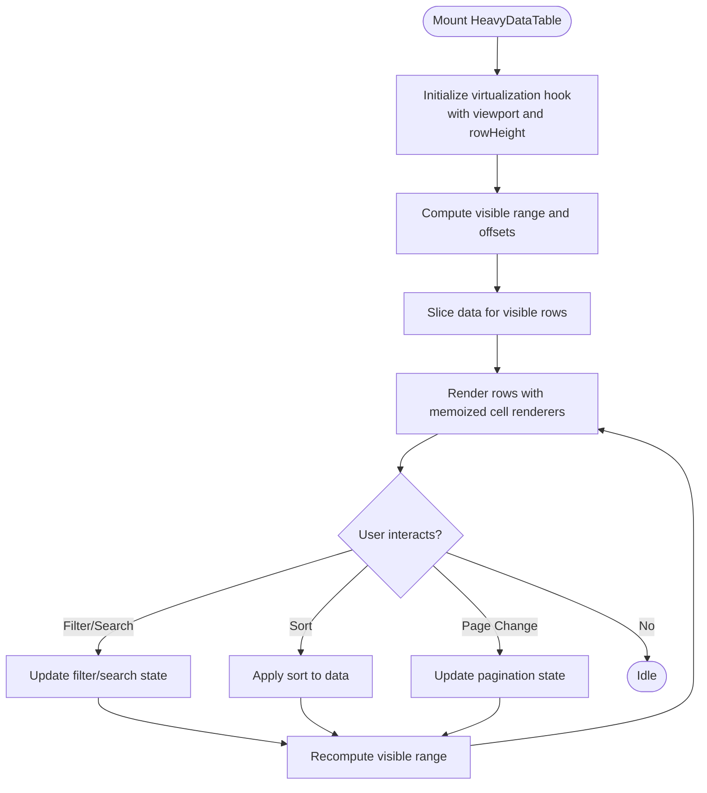
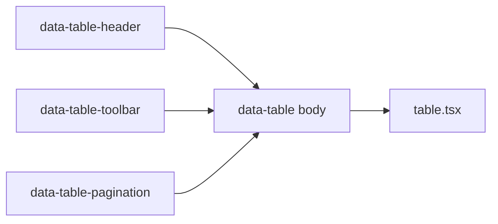
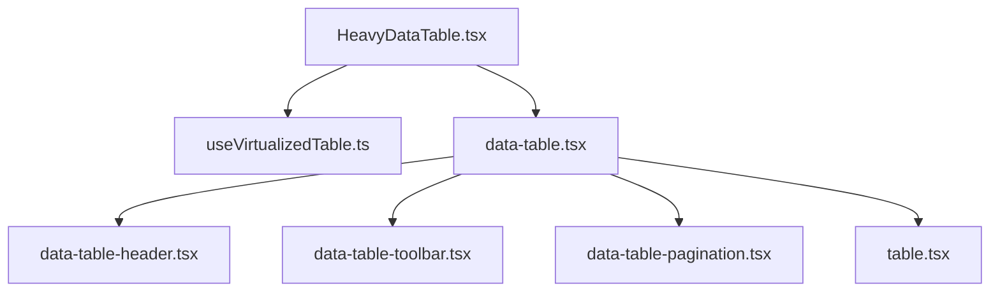

# Enhanced Data Tables

<cite>
**Referenced Files in This Document**
- [HeavyDataTable.tsx](file://src/components/HeavyDataTable.tsx)
- [useVirtualizedTable.ts](file://src/hooks/useVirtualizedTable.ts)
- [data-table.tsx](file://table-system/components/ui/table/data-table.tsx)
- [data-table-header.tsx](file://table-system/components/ui/table/data-table-header.tsx)
- [data-table-toolbar.tsx](file://table-system/components/ui/table/data-table-toolbar.tsx)
- [data-table-pagination.tsx](file://table-system/components/ui/table/data-table-pagination.tsx)
- [table.tsx](file://table-system/components/ui/table/table.tsx)
</cite>

## Table of Contents
1. [Introduction](#introduction)
2. [Project Structure](#project-structure)
3. [Core Components](#core-components)
4. [Architecture Overview](#architecture-overview)
5. [Detailed Component Analysis](#detailed-component-analysis)
6. [Dependency Analysis](#dependency-analysis)
7. [Performance Considerations](#performance-considerations)
8. [Troubleshooting Guide](#troubleshooting-guide)
9. [Conclusion](#conclusion)
10. [Appendices](#appendices)

## Introduction
This document explains the enhanced data table components used across the application, focusing on performance-oriented rendering for large datasets and advanced user interactions. It covers:
- The HeavyDataTable component designed for efficient rendering and memory management with large datasets
- Virtualization strategies implemented via a dedicated hook to minimize DOM nodes and improve scroll performance
- Memoization patterns to reduce unnecessary re-renders
- Custom cell renderers and interactive features
- Accessibility considerations for screen readers and keyboard navigation
- Performance tuning techniques including lazy loading and memory optimization

The goal is to provide both conceptual guidance and concrete implementation references so teams can build robust, accessible, and high-performance tables.

## Project Structure
The table system is organized into reusable UI primitives and specialized hooks:
- Core table primitives under table-system/components/ui/table
- A virtualization hook under src/hooks
- A heavy dataset table component under src/components



**Diagram sources**
- [HeavyDataTable.tsx](file://src/components/HeavyDataTable.tsx)
- [useVirtualizedTable.ts](file://src/hooks/useVirtualizedTable.ts)
- [data-table.tsx](file://table-system/components/ui/table/data-table.tsx)
- [data-table-header.tsx](file://table-system/components/ui/table/data-table-header.tsx)
- [data-table-toolbar.tsx](file://table-system/components/ui/table/data-table-toolbar.tsx)
- [data-table-pagination.tsx](file://table-system/components/ui/table/data-table-pagination.tsx)
- [table.tsx](file://table-system/components/ui/table/table.tsx)

**Section sources**
- [HeavyDataTable.tsx](file://src/components/HeavyDataTable.tsx)
- [useVirtualizedTable.ts](file://src/hooks/useVirtualizedTable.ts)
- [data-table.tsx](file://table-system/components/ui/table/data-table.tsx)
- [data-table-header.tsx](file://table-system/components/ui/table/data-table-header.tsx)
- [data-table-toolbar.tsx](file://table-system/components/ui/table/data-table-toolbar.tsx)
- [data-table-pagination.tsx](file://table-system/components/ui/table/data-table-pagination.tsx)
- [table.tsx](file://table-system/components/ui/table/table.tsx)

## Core Components
- HeavyDataTable: Optimized for large datasets with virtualization, memoization, and controlled rendering. It coordinates data slicing, row height estimation, and viewport-aware rendering.
- useVirtualizedTable: Provides state and logic for virtual scrolling, including visible range calculation, offset tracking, and stable item sizing.
- data-table: Base layout and composition for header, body, toolbar, and pagination.
- data-table-header: Column definitions, sorting, and header accessibility attributes.
- data-table-toolbar: Search, filters, and actions integrated with table state.
- data-table-pagination: Page size control and page navigation.
- table: Low-level table element wrapper with consistent structure and semantics.

Key responsibilities:
- HeavyDataTable orchestrates data flow, applies memoization, and delegates rendering to virtualized segments.
- useVirtualizedTable encapsulates complex calculations for viewport ranges and offsets.
- UI primitives focus on presentation and interaction while relying on props from higher-level components.

**Section sources**
- [HeavyDataTable.tsx](file://src/components/HeavyDataTable.tsx)
- [useVirtualizedTable.ts](file://src/hooks/useVirtualizedTable.ts)
- [data-table.tsx](file://table-system/components/ui/table/data-table.tsx)
- [data-table-header.tsx](file://table-system/components/ui/table/data-table-header.tsx)
- [data-table-toolbar.tsx](file://table-system/components/ui/table/data-table-toolbar.tsx)
- [data-table-pagination.tsx](file://table-system/components/ui/table/data-table-pagination.tsx)
- [table.tsx](file://table-system/components/ui/table/table.tsx)

## Architecture Overview
The architecture separates concerns between data orchestration, virtualization logic, and UI primitives. HeavyDataTable composes the table system and uses the virtualization hook to render only what is visible.



**Diagram sources**
- [HeavyDataTable.tsx](file://src/components/HeavyDataTable.tsx)
- [useVirtualizedTable.ts](file://src/hooks/useVirtualizedTable.ts)
- [data-table.tsx](file://table-system/components/ui/table/data-table.tsx)
- [data-table-header.tsx](file://table-system/components/ui/table/data-table-header.tsx)
- [data-table-toolbar.tsx](file://table-system/components/ui/table/data-table-toolbar.tsx)
- [data-table-pagination.tsx](file://table-system/components/ui/table/data-table-pagination.tsx)

## Detailed Component Analysis

### HeavyDataTable
HeavyDataTable is designed for large datasets. It:
- Slices data based on the visible range provided by the virtualization hook
- Memoizes expensive computations such as filtered/sorted views and row content
- Delegates rendering of individual cells to custom renderers passed as props
- Integrates toolbar, header, and pagination for full interactivity

Implementation highlights:
- Uses the virtualization hook to compute start/end indices and total offset height
- Applies React.memo or similar memoization to avoid re-rendering unchanged rows
- Supports custom cell renderers for rich content and interactive elements
- Coordinates state with toolbar and pagination for filtering, searching, and paging



**Diagram sources**
- [HeavyDataTable.tsx](file://src/components/HeavyDataTable.tsx)
- [useVirtualizedTable.ts](file://src/hooks/useVirtualizedTable.ts)

**Section sources**
- [HeavyDataTable.tsx](file://src/components/HeavyDataTable.tsx)
- [useVirtualizedTable.ts](file://src/hooks/useVirtualizedTable.ts)

### useVirtualizedTable
This hook manages virtual scrolling state and calculations:
- Tracks container dimensions and scroll position
- Computes visible indices based on row heights and viewport size
- Maintains an offset stack to support variable row heights
- Exposes methods to update row heights and reset state when data changes

Complexity considerations:
- Visible range computation is O(k) where k is the number of visible rows
- Offset updates are amortized; batched updates prevent excessive recalculations
- Stable keys and memoization ensure minimal re-renders

```mermaid
classDiagram
class UseVirtualizedTable {
+number startIndex
+number endIndex
+number offsetY
+number[] rowHeights
+updateRowHeight(index, height) void
+reset() void
+getVisibleRange(viewportHeight) {start : number, end : number}
}
```

**Diagram sources**
- [useVirtualizedTable.ts](file://src/hooks/useVirtualizedTable.ts)

**Section sources**
- [useVirtualizedTable.ts](file://src/hooks/useVirtualizedTable.ts)

### Table System Primitives
- data-table: Composes header, body, toolbar, and pagination; provides consistent structure and accessibility attributes.
- data-table-header: Defines columns, supports sorting, and sets aria attributes for accessibility.
- data-table-toolbar: Integrates search and filters; updates table state and triggers recomputation.
- data-table-pagination: Controls page size and current page; integrates with virtualization to adjust visible range.
- table: Wraps the native table element with semantic roles and styles.



**Diagram sources**
- [data-table-header.tsx](file://table-system/components/ui/table/data-table-header.tsx)
- [data-table-toolbar.tsx](file://table-system/components/ui/table/data-table-toolbar.tsx)
- [data-table-pagination.tsx](file://table-system/components/ui/table/data-table-pagination.tsx)
- [table.tsx](file://table-system/components/ui/table/table.tsx)

**Section sources**
- [data-table.tsx](file://table-system/components/ui/table/data-table.tsx)
- [data-table-header.tsx](file://table-system/components/ui/table/data-table-header.tsx)
- [data-table-toolbar.tsx](file://table-system/components/ui/table/data-table-toolbar.tsx)
- [data-table-pagination.tsx](file://table-system/components/ui/table/data-table-pagination.tsx)
- [table.tsx](file://table-system/components/ui/table/table.tsx)

## Dependency Analysis
HeavyDataTable depends on:
- useVirtualizedTable for virtualization logic
- data-table and its subcomponents for layout and interaction
- Custom cell renderers provided by consumers for flexible content



**Diagram sources**
- [HeavyDataTable.tsx](file://src/components/HeavyDataTable.tsx)
- [useVirtualizedTable.ts](file://src/hooks/useVirtualizedTable.ts)
- [data-table.tsx](file://table-system/components/ui/table/data-table.tsx)
- [data-table-header.tsx](file://table-system/components/ui/table/data-table-header.tsx)
- [data-table-toolbar.tsx](file://table-system/components/ui/table/data-table-toolbar.tsx)
- [data-table-pagination.tsx](file://table-system/components/ui/table/data-table-pagination.tsx)
- [table.tsx](file://table-system/components/ui/table/table.tsx)

**Section sources**
- [HeavyDataTable.tsx](file://src/components/HeavyDataTable.tsx)
- [useVirtualizedTable.ts](file://src/hooks/useVirtualizedTable.ts)
- [data-table.tsx](file://table-system/components/ui/table/data-table.tsx)
- [data-table-header.tsx](file://table-system/components/ui/table/data-table-header.tsx)
- [data-table-toolbar.tsx](file://table-system/components/ui/table/data-table-toolbar.tsx)
- [data-table-pagination.tsx](file://table-system/components/ui/table/data-table-pagination.tsx)
- [table.tsx](file://table-system/components/ui/table/table.tsx)

## Performance Considerations
- Virtualization: Render only visible rows to minimize DOM nodes and improve scroll performance.
- Memoization: Wrap expensive computations and cell renderers to avoid redundant work.
- Row Height Estimation: Use fixed or estimated row heights to simplify offset calculations; switch to dynamic heights if necessary with careful batching.
- Lazy Loading: Load additional pages or chunks of data on demand to reduce initial payload and memory usage.
- Stable Keys: Ensure stable row keys to leverage React’s reconciliation efficiently.
- Debounced Input: Debounce search and filter inputs to limit recomputation frequency.
- Memory Management: Clear timers and event listeners on unmount; avoid retaining large arrays in closures.

[No sources needed since this section provides general guidance]

## Troubleshooting Guide
Common issues and resolutions:
- Jumpy Scrolling: Verify that row heights are consistent or properly tracked; ensure offset updates are batched.
- Missing Rows: Check visible range calculations and ensure startIndex/endIndex align with data length.
- Slow Rendering: Confirm memoization is applied to cell renderers and computed slices; avoid creating new objects per render.
- Accessibility Gaps: Ensure headers have proper aria attributes and that interactive cells expose correct roles and states.
- Pagination Mismatch: Validate that pagination state updates trigger recomputation of visible range and that page sizes are respected.

**Section sources**
- [HeavyDataTable.tsx](file://src/components/HeavyDataTable.tsx)
- [useVirtualizedTable.ts](file://src/hooks/useVirtualizedTable.ts)
- [data-table-header.tsx](file://table-system/components/ui/table/data-table-header.tsx)
- [data-table-toolbar.tsx](file://table-system/components/ui/table/data-table-toolbar.tsx)
- [data-table-pagination.tsx](file://table-system/components/ui/table/data-table-pagination.tsx)

## Conclusion
The enhanced table system combines a heavy-duty component for large datasets with a modular set of UI primitives and a virtualization hook. By leveraging virtualization, memoization, and thoughtful state management, it delivers smooth interactions and strong accessibility. Teams should adopt these patterns to build performant, maintainable tables tailored to their data and UX requirements.

[No sources needed since this section summarizes without analyzing specific files]

## Appendices

### Implementing Complex Table Behaviors
- Custom Cell Renderers: Pass renderer functions to define rich content and interactions within cells.
- Interactive Features: Integrate inline editing, selection, and context menus through cell renderers and toolbar actions.
- Sorting and Filtering: Use header and toolbar components to manage state and feed back into the virtualization hook.

**Section sources**
- [HeavyDataTable.tsx](file://src/components/HeavyDataTable.tsx)
- [data-table-header.tsx](file://table-system/components/ui/table/data-table-header.tsx)
- [data-table-toolbar.tsx](file://table-system/components/ui/table/data-table-toolbar.tsx)

### Accessibility Requirements
- Semantic Markup: Ensure table elements use appropriate roles and headings.
- Keyboard Navigation: Support tabbing, arrow keys, and enter/space for interactive cells.
- Screen Reader Compatibility: Provide descriptive labels, aria-live regions for dynamic updates, and clear status messages.

**Section sources**
- [data-table-header.tsx](file://table-system/components/ui/table/data-table-header.tsx)
- [table.tsx](file://table-system/components/ui/table/table.tsx)