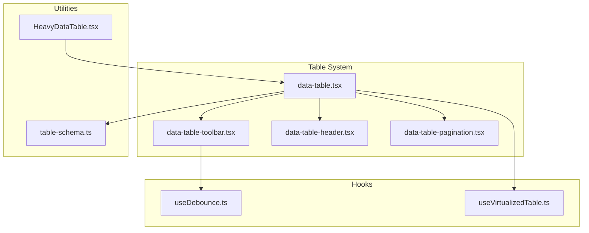
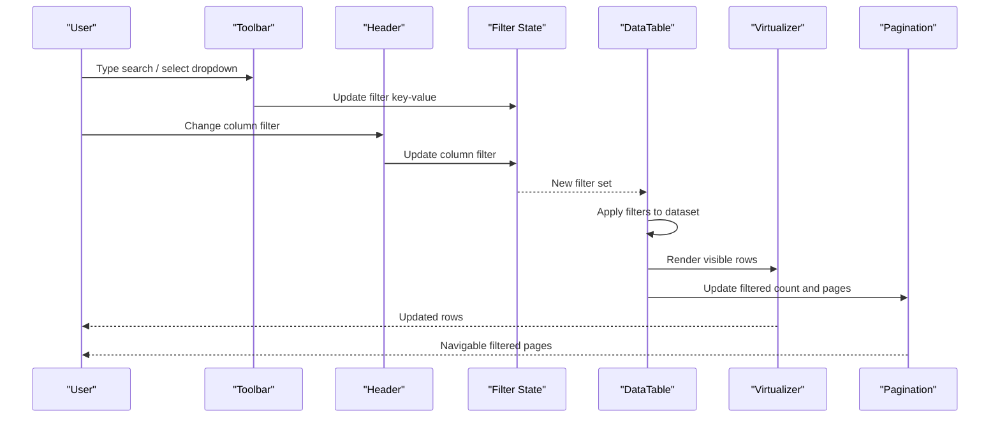
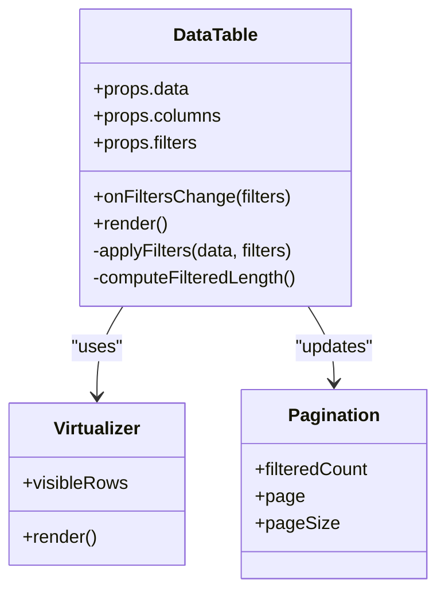
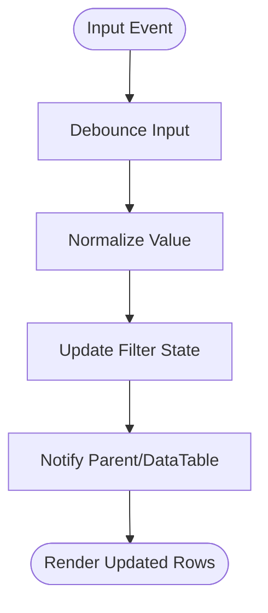
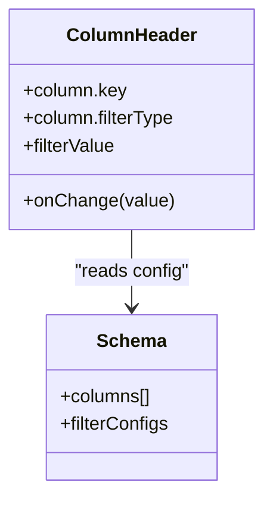
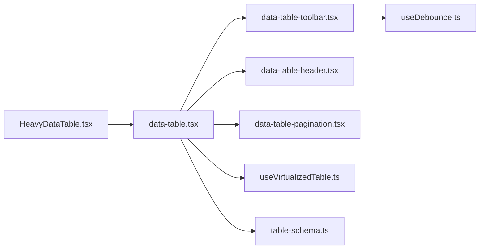

# Filtering Mechanisms

<cite>
**Referenced Files in This Document**
- [table-system/components/ui/table/data-table.tsx](file://table-system/components/ui/table/data-table.tsx)
- [table-system/components/ui/table/data-table-toolbar.tsx](file://table-system/components/ui/table/data-table-toolbar.tsx)
- [table-system/components/ui/table/data-table-header.tsx](file://table-system/components/ui/table/data-table-header.tsx)
- [table-system/components/ui/table/data-table-pagination.tsx](file://table-system/components/ui/table/data-table-pagination.tsx)
- [src/hooks/useDebounce.ts](file://src/hooks/useDebounce.ts)
- [src/hooks/useVirtualizedTable.ts](file://src/hooks/useVirtualizedTable.ts)
- [src/lib/table-schema.ts](file://src/lib/table-schema.ts)
- [src/components/HeavyDataTable.tsx](file://src/components/HeavyDataTable.tsx)
</cite>

## Table of Contents
1. [Introduction](#introduction)
2. [Project Structure](#project-structure)
3. [Core Components](#core-components)
4. [Architecture Overview](#architecture-overview)
5. [Detailed Component Analysis](#detailed-component-analysis)
6. [Dependency Analysis](#dependency-analysis)
7. [Performance Considerations](#performance-considerations)
8. [Troubleshooting Guide](#troubleshooting-guide)
9. [Conclusion](#conclusion)
10. [Appendices](#appendices)

## Introduction
This document explains the table filtering mechanisms available in the project, focusing on:
- Real-time text search across multiple columns
- Dropdown filters with multiple options
- Advanced filtering scenarios (numeric ranges, date ranges, custom components)
- Combining multiple filters
- Debounced search input
- Filter persistence and URL synchronization
- Filter state management patterns
- Performance optimization for large datasets

The guidance is grounded in the shared table system and reusable hooks used across pages.

## Project Structure
The filtering capabilities are implemented through a small set of focused components and utilities:
- DataTable: orchestrates data, pagination, and filter application
- Toolbar: hosts search inputs and dropdown filters
- Header: supports column-level filters
- Pagination: integrates with filtered results
- Hooks: provide debouncing and virtualization to optimize performance
- Utilities: define table schemas and heavy-data helpers

**Diagram sources**
- [table-system/components/ui/table/data-table.tsx](file://table-system/components/ui/table/data-table.tsx)
- [table-system/components/ui/table/data-table-toolbar.tsx](file://table-system/components/ui/table/data-table-toolbar.tsx)
- [table-system/components/ui/table/data-table-header.tsx](file://table-system/components/ui/table/data-table-header.tsx)
- [table-system/components/ui/table/data-table-pagination.tsx](file://table-system/components/ui/table/data-table-pagination.tsx)
- [src/hooks/useDebounce.ts](file://src/hooks/useDebounce.ts)
- [src/hooks/useVirtualizedTable.ts](file://src/hooks/useVirtualizedTable.ts)
- [src/lib/table-schema.ts](file://src/lib/table-schema.ts)
- [src/components/HeavyDataTable.tsx](file://src/components/HeavyDataTable.tsx)

**Section sources**
- [table-system/components/ui/table/data-table.tsx](file://table-system/components/ui/table/data-table.tsx)
- [table-system/components/ui/table/data-table-toolbar.tsx](file://table-system/components/ui/table/data-table-toolbar.tsx)
- [table-system/components/ui/table/data-table-header.tsx](file://table-system/components/ui/table/data-table-header.tsx)
- [table-system/components/ui/table/data-table-pagination.tsx](file://table-system/components/ui/table/data-table-pagination.tsx)
- [src/hooks/useDebounce.ts](file://src/hooks/useDebounce.ts)
- [src/hooks/useVirtualizedTable.ts](file://src/hooks/useVirtualizedTable.ts)
- [src/lib/table-schema.ts](file://src/lib/table-schema.ts)
- [src/components/HeavyDataTable.tsx](file://src/components/HeavyDataTable.tsx)

## Core Components
- DataTable: central controller that accepts raw data, applies filters, manages pagination, and renders rows. It exposes props for global search, per-column filters, and callbacks for server-side or client-side filtering.
- Toolbar: provides UI for global search and dropdown filters. Integrates with debounced input to avoid excessive re-renders.
- Header: optional column-level filters (e.g., status dropdowns). Can be extended for numeric/date ranges.
- Pagination: reflects filtered counts and navigates within filtered sets.
- useDebounce: utility hook to delay expensive operations like filtering or API calls.
- useVirtualizedTable: optimizes rendering for large datasets by only rendering visible rows.
- table-schema: defines column metadata and filter types for consistent behavior.
- HeavyDataTable: wrapper component for high-performance tables combining virtualization and efficient filtering.

Key responsibilities:
- Maintain a normalized filter state object
- Apply filters deterministically
- Keep pagination aligned with filtered results
- Expose clear APIs for integration

**Section sources**
- [table-system/components/ui/table/data-table.tsx](file://table-system/components/ui/table/data-table.tsx)
- [table-system/components/ui/table/data-table-toolbar.tsx](file://table-system/components/ui/table/data-table-toolbar.tsx)
- [table-system/components/ui/table/data-table-header.tsx](file://table-system/components/ui/table/data-table-header.tsx)
- [table-system/components/ui/table/data-table-pagination.tsx](file://table-system/components/ui/table/data-table-pagination.tsx)
- [src/hooks/useDebounce.ts](file://src/hooks/useDebounce.ts)
- [src/hooks/useVirtualizedTable.ts](file://src/hooks/useVirtualizedTable.ts)
- [src/lib/table-schema.ts](file://src/lib/table-schema.ts)
- [src/components/HeavyDataTable.tsx](file://src/components/HeavyDataTable.tsx)

## Architecture Overview
The filtering architecture separates concerns between UI, state, and rendering:
- UI layer: toolbar and header components capture user input
- State layer: a single source of truth holds all active filters
- Application layer: page code decides whether to filter client-side or pass filters to server queries
- Rendering layer: virtualization and pagination ensure smooth UX at scale

**Diagram sources**
- [table-system/components/ui/table/data-table-toolbar.tsx](file://table-system/components/ui/table/data-table-toolbar.tsx)
- [table-system/components/ui/table/data-table-header.tsx](file://table-system/components/ui/table/data-table-header.tsx)
- [table-system/components/ui/table/data-table.tsx](file://table-system/components/ui/table/data-table.tsx)
- [src/hooks/useVirtualizedTable.ts](file://src/hooks/useVirtualizedTable.ts)
- [table-system/components/ui/table/data-table-pagination.tsx](file://table-system/components/ui/table/data-table-pagination.tsx)

## Detailed Component Analysis

### DataTable
Responsibilities:
- Accepts raw data and filter configuration
- Applies combined filters (global + column-specific)
- Computes filtered length for pagination
- Supports both client-side and server-side filtering via callbacks
- Integrates with virtualization for large lists

Integration points:
- Receives filter state from parent or internal state
- Emits events when filters change (for URL sync or persistence)
- Delegates rendering to virtualizer when enabled

**Diagram sources**
- [table-system/components/ui/table/data-table.tsx](file://table-system/components/ui/table/data-table.tsx)
- [src/hooks/useVirtualizedTable.ts](file://src/hooks/useVirtualizedTable.ts)
- [table-system/components/ui/table/data-table-pagination.tsx](file://table-system/components/ui/table/data-table-pagination.tsx)

**Section sources**
- [table-system/components/ui/table/data-table.tsx](file://table-system/components/ui/table/data-table.tsx)
- [src/hooks/useVirtualizedTable.ts](file://src/hooks/useVirtualizedTable.ts)
- [table-system/components/ui/table/data-table-pagination.tsx](file://table-system/components/ui/table/data-table-pagination.tsx)

### Toolbar (Global Search and Dropdown Filters)
Features:
- Global text search input with debounced updates
- Multiple dropdown filters with multi-select support
- Clear-all action to reset filters
- Optional keyboard shortcuts for quick access

Implementation notes:
- Debounce input changes to reduce re-renders and network requests
- Normalize filter values (trim, case-insensitive where applicable)
- Emit filter updates atomically to maintain consistency

**Diagram sources**
- [table-system/components/ui/table/data-table-toolbar.tsx](file://table-system/components/ui/table/data-table-toolbar.tsx)
- [src/hooks/useDebounce.ts](file://src/hooks/useDebounce.ts)

**Section sources**
- [table-system/components/ui/table/data-table-toolbar.tsx](file://table-system/components/ui/table/data-table-toolbar.tsx)
- [src/hooks/useDebounce.ts](file://src/hooks/useDebounce.ts)

### Header (Column-Level Filters)
Capabilities:
- Per-column dropdown filters
- Extensible to numeric range and date range pickers
- Consistent schema-driven behavior via table-schema

Best practices:
- Use column metadata to determine filter type and options
- Provide default “All” option for dropdowns
- Validate and sanitize inputs before applying

**Diagram sources**
- [table-system/components/ui/table/data-table-header.tsx](file://table-system/components/ui/table/data-table-header.tsx)
- [src/lib/table-schema.ts](file://src/lib/table-schema.ts)

**Section sources**
- [table-system/components/ui/table/data-table-header.tsx](file://table-system/components/ui/table/data-table-header.tsx)
- [src/lib/table-schema.ts](file://src/lib/table-schema.ts)

### Pagination
Behavior:
- Reflects filtered result counts
- Resets to first page when filters change
- Supports configurable page sizes

Integration:
- Consumes filtered length from DataTable
- Updates query parameters if URL-synced

**Section sources**
- [table-system/components/ui/table/data-table-pagination.tsx](file://table-system/components/ui/table/data-table-pagination.tsx)

### useDebounce Hook
Purpose:
- Delay execution of expensive operations (filtering, API calls)
- Prevent rapid successive updates during typing

Usage:
- Wrap search input handlers
- Combine with filter state updates

**Section sources**
- [src/hooks/useDebounce.ts](file://src/hooks/useDebounce.ts)

### useVirtualizedTable Hook
Purpose:
- Efficiently render large datasets by only mounting visible rows
- Reduce memory footprint and improve scroll performance

Integration:
- Works with DataTable’s filtered dataset
- Adjusts row height and buffer settings based on content

**Section sources**
- [src/hooks/useVirtualizedTable.ts](file://src/hooks/useVirtualizedTable.ts)

### table-schema Utility
Role:
- Centralize column definitions and filter configurations
- Ensure consistent behavior across tables
- Provide defaults for filter types and options

Benefits:
- Easier maintenance and extension
- Stronger typing and validation

**Section sources**
- [src/lib/table-schema.ts](file://src/lib/table-schema.ts)

### HeavyDataTable Wrapper
Focus:
- Combine virtualization, efficient filtering, and pagination
- Provide sensible defaults for large datasets
- Simplify integration for feature teams

When to use:
- Large datasets (>1k rows)
- Frequent filtering and sorting
- Need for responsive scrolling and low memory usage

**Section sources**
- [src/components/HeavyDataTable.tsx](file://src/components/HeavyDataTable.tsx)

## Dependency Analysis
High-level dependencies among filtering components:

**Diagram sources**
- [table-system/components/ui/table/data-table.tsx](file://table-system/components/ui/table/data-table.tsx)
- [table-system/components/ui/table/data-table-toolbar.tsx](file://table-system/components/ui/table/data-table-toolbar.tsx)
- [table-system/components/ui/table/data-table-header.tsx](file://table-system/components/ui/table/data-table-header.tsx)
- [table-system/components/ui/table/data-table-pagination.tsx](file://table-system/components/ui/table/data-table-pagination.tsx)
- [src/hooks/useDebounce.ts](file://src/hooks/useDebounce.ts)
- [src/hooks/useVirtualizedTable.ts](file://src/hooks/useVirtualizedTable.ts)
- [src/lib/table-schema.ts](file://src/lib/table-schema.ts)
- [src/components/HeavyDataTable.tsx](file://src/components/HeavyDataTable.tsx)

**Section sources**
- [table-system/components/ui/table/data-table.tsx](file://table-system/components/ui/table/data-table.tsx)
- [table-system/components/ui/table/data-table-toolbar.tsx](file://table-system/components/ui/table/data-table-toolbar.tsx)
- [table-system/components/ui/table/data-table-header.tsx](file://table-system/components/ui/table/data-table-header.tsx)
- [table-system/components/ui/table/data-table-pagination.tsx](file://table-system/components/ui/table/data-table-pagination.tsx)
- [src/hooks/useDebounce.ts](file://src/hooks/useDebounce.ts)
- [src/hooks/useVirtualizedTable.ts](file://src/hooks/useVirtualizedTable.ts)
- [src/lib/table-schema.ts](file://src/lib/table-schema.ts)
- [src/components/HeavyDataTable.tsx](file://src/components/HeavyDataTable.tsx)

## Performance Considerations
- Debounce search input to minimize re-renders and network calls
- Prefer server-side filtering for large datasets; pass filter objects to API endpoints
- Use virtualization for long lists to keep DOM size manageable
- Normalize and memoize filter keys to avoid unnecessary recalculations
- Limit dropdown options; paginate or search within dropdowns if needed
- Avoid deep equality checks on large objects; use stable references and shallow comparisons where possible
- Batch filter updates to prevent intermediate states from triggering extra renders

[No sources needed since this section provides general guidance]

## Troubleshooting Guide
Common issues and resolutions:
- Filters not updating: verify filter state propagation and event emission paths
- Slow typing response: increase debounce delay or switch to server-side filtering
- Incorrect pagination counts: ensure filtered length is computed after all filters apply
- Dropdown options missing: check schema definitions and data availability
- Memory spikes with large lists: enable virtualization and review row heights

**Section sources**
- [table-system/components/ui/table/data-table.tsx](file://table-system/components/ui/table/data-table.tsx)
- [table-system/components/ui/table/data-table-toolbar.tsx](file://table-system/components/ui/table/data-table-toolbar.tsx)
- [table-system/components/ui/table/data-table-header.tsx](file://table-system/components/ui/table/data-table-header.tsx)
- [table-system/components/ui/table/data-table-pagination.tsx](file://table-system/components/ui/table/data-table-pagination.tsx)
- [src/hooks/useDebounce.ts](file://src/hooks/useDebounce.ts)
- [src/hooks/useVirtualizedTable.ts](file://src/hooks/useVirtualizedTable.ts)
- [src/lib/table-schema.ts](file://src/lib/table-schema.ts)
- [src/components/HeavyDataTable.tsx](file://src/components/HeavyDataTable.tsx)

## Conclusion
The table filtering system combines a clean component architecture with powerful hooks to deliver fast, scalable, and user-friendly filtering experiences. By leveraging debounced inputs, virtualization, and schema-driven configurations, teams can implement robust search, dropdown, and advanced filters while maintaining strong performance even with large datasets.

[No sources needed since this section summarizes without analyzing specific files]

## Appendices

### Implementing Text Search Across Multiple Columns
- Define searchable columns in the schema
- Normalize input (lowercase, trim)
- Apply substring matches across specified fields
- Debounce input to control update frequency

**Section sources**
- [src/lib/table-schema.ts](file://src/lib/table-schema.ts)
- [table-system/components/ui/table/data-table-toolbar.tsx](file://table-system/components/ui/table/data-table-toolbar.tsx)
- [table-system/components/ui/table/data-table.tsx](file://table-system/components/ui/table/data-table.tsx)

### Numeric Range Filters
- Add range inputs (min/max) in header or toolbar
- Convert inputs to numbers and validate ranges
- Apply inclusive/exclusive bounds consistently
- Persist range values in filter state

**Section sources**
- [table-system/components/ui/table/data-table-header.tsx](file://table-system/components/ui/table/data-table-header.tsx)
- [src/lib/table-schema.ts](file://src/lib/table-schema.ts)

### Date Range Pickers
- Use start/end date inputs
- Normalize dates to consistent timezone/format
- Apply boundary conditions (start-of-day, end-of-day)
- Handle empty ranges gracefully

**Section sources**
- [table-system/components/ui/table/data-table-header.tsx](file://table-system/components/ui/table/data-table-header.tsx)
- [src/lib/table-schema.ts](file://src/lib/table-schema.ts)

### Custom Filter Components
- Extend header or toolbar with custom controls
- Map component values to standardized filter keys
- Integrate with DataTable’s filter application logic

**Section sources**
- [table-system/components/ui/table/data-table-header.tsx](file://table-system/components/ui/table/data-table-header.tsx)
- [table-system/components/ui/table/data-table-toolbar.tsx](file://table-system/components/ui/table/data-table-toolbar.tsx)

### Combining Multiple Filters
- Merge global search with column filters using AND logic
- Reset to first page when any filter changes
- Provide clear indicators for active filters

**Section sources**
- [table-system/components/ui/table/data-table.tsx](file://table-system/components/ui/table/data-table.tsx)
- [table-system/components/ui/table/data-table-pagination.tsx](file://table-system/components/ui/table/data-table-pagination.tsx)

### Debounced Search Input
- Wrap input handlers with debounce hook
- Choose appropriate delay based on dataset size and network latency
- Cancel pending operations on unmount

**Section sources**
- [src/hooks/useDebounce.ts](file://src/hooks/useDebounce.ts)
- [table-system/components/ui/table/data-table-toolbar.tsx](file://table-system/components/ui/table/data-table-toolbar.tsx)

### Filter Persistence and URL Synchronization
- Serialize filter state to URL query parameters
- Initialize filters from URL on mount
- Update URL on filter changes without full reload
- Support shareable links with applied filters

**Section sources**
- [table-system/components/ui/table/data-table.tsx](file://table-system/components/ui/table/data-table.tsx)
- [table-system/components/ui/table/data-table-pagination.tsx](file://table-system/components/ui/table/data-table-pagination.tsx)

### Filter State Management Patterns
- Single source of truth for filters
- Immutable updates to avoid reference churn
- Memoized derived values for filtered data and counts
- Decouple UI events from data transformation

**Section sources**
- [table-system/components/ui/table/data-table.tsx](file://table-system/components/ui/table/data-table.tsx)
- [src/lib/table-schema.ts](file://src/lib/table-schema.ts)

### Performance Optimization for Large Datasets
- Enable virtualization for long lists
- Prefer server-side filtering and pagination
- Minimize re-renders with stable references and memoization
- Profile and tune debounce delays and virtualizer buffers

**Section sources**
- [src/hooks/useVirtualizedTable.ts](file://src/hooks/useVirtualizedTable.ts)
- [src/components/HeavyDataTable.tsx](file://src/components/HeavyDataTable.tsx)
- [table-system/components/ui/table/data-table.tsx](file://table-system/components/ui/table/data-table.tsx)