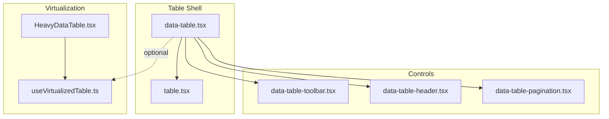
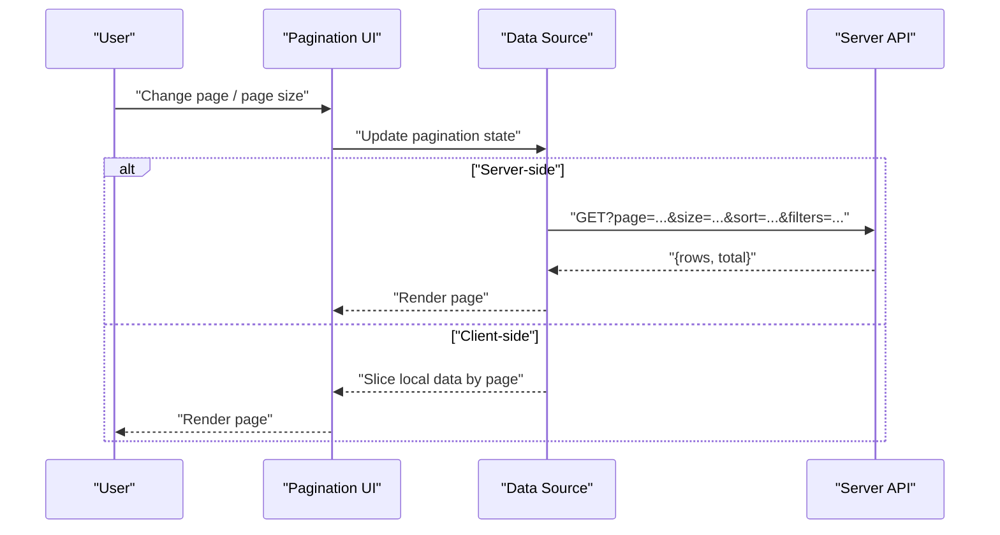
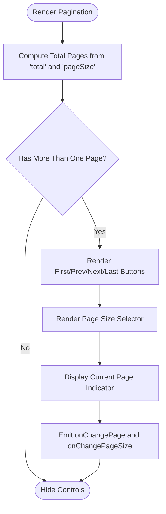
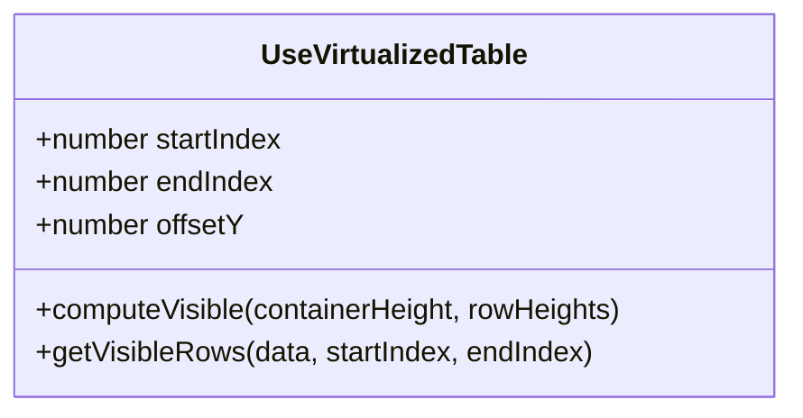
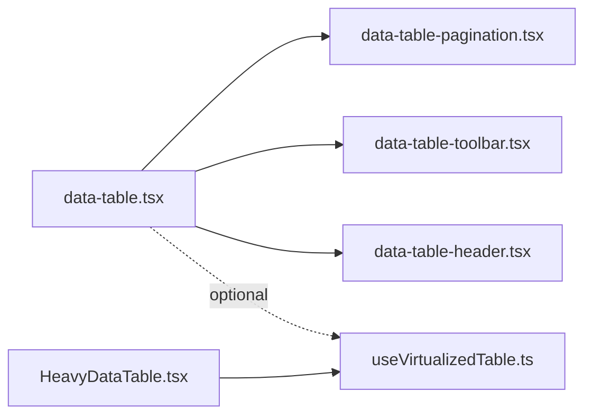

# Pagination System

<cite>
**Referenced Files in This Document**
- [data-table-pagination.tsx](file://table-system/components/ui/table/data-table-pagination.tsx)
- [data-table-toolbar.tsx](file://table-system/components/ui/table/data-table-toolbar.tsx)
- [data-table-header.tsx](file://table-system/components/ui/table/data-table-header.tsx)
- [data-table.tsx](file://table-system/components/ui/table/data-table.tsx)
- [table.tsx](file://table-system/components/ui/table/table.tsx)
- [useVirtualizedTable.ts](file://src/hooks/useVirtualizedTable.ts)
- [HeavyDataTable.tsx](file://src/components/HeavyDataTable.tsx)
</cite>

## Table of Contents
1. [Introduction](#introduction)
2. [Project Structure](#project-structure)
3. [Core Components](#core-components)
4. [Architecture Overview](#architecture-overview)
5. [Detailed Component Analysis](#detailed-component-analysis)
6. [Dependency Analysis](#dependency-analysis)
7. [Performance Considerations](#performance-considerations)
8. [Troubleshooting Guide](#troubleshooting-guide)
9. [Conclusion](#conclusion)

## Introduction
This document explains the pagination system implemented across the table UI components and virtualization hooks. It covers server-side versus client-side strategies, page size controls, infinite scrolling patterns for large datasets, virtualization techniques for efficient rendering, navigation controls, current page indicators, custom page sizes, jump-to-page functionality, responsive layouts, state management, URL synchronization, and performance considerations for different data volumes.

## Project Structure
The pagination implementation is centered around a small set of reusable table components and a virtualization hook:
- Table shell and layout
  - data-table.tsx: orchestrates toolbar, header, body, and pagination
  - table.tsx: base table wrapper with semantic structure
- Controls
  - data-table-toolbar.tsx: search, filters, and actions
  - data-table-header.tsx: column headers and sorting
  - data-table-pagination.tsx: page navigation, page size selector, and current page indicator
- Virtualization
  - useVirtualizedTable.ts: hook to compute visible rows and viewport offsets
  - HeavyDataTable.tsx: example integration of virtualization with heavy datasets

**Diagram sources**
- [data-table.tsx](file://table-system/components/ui/table/data-table.tsx)
- [table.tsx](file://table-system/components/ui/table/table.tsx)
- [data-table-toolbar.tsx](file://table-system/components/ui/table/data-table-toolbar.tsx)
- [data-table-header.tsx](file://table-system/components/ui/table/data-table-header.tsx)
- [data-table-pagination.tsx](file://table-system/components/ui/table/data-table-pagination.tsx)
- [useVirtualizedTable.ts](file://src/hooks/useVirtualizedTable.ts)
- [HeavyDataTable.tsx](file://src/components/HeavyDataTable.tsx)

**Section sources**
- [data-table.tsx](file://table-system/components/ui/table/data-table.tsx)
- [table.tsx](file://table-system/components/ui/table/table.tsx)
- [data-table-toolbar.tsx](file://table-system/components/ui/table/data-table-toolbar.tsx)
- [data-table-header.tsx](file://table-system/components/ui/table/data-table-header.tsx)
- [data-table-pagination.tsx](file://table-system/components/ui/table/data-table-pagination.tsx)
- [useVirtualizedTable.ts](file://src/hooks/useVirtualizedTable.ts)
- [HeavyDataTable.tsx](file://src/components/HeavyDataTable.tsx)

## Core Components
- data-table-pagination.tsx
  - Provides next/previous buttons, first/last navigation, page size dropdown, and current page display
  - Emits events for page changes and page size updates
- data-table-toolbar.tsx
  - Hosts global search and filters that typically drive server-side pagination parameters
- data-table-header.tsx
  - Renders sortable columns; sorting often influences server-side queries
- data-table.tsx
  - Composes toolbar, header, body, and pagination; manages local state or integrates with external state (e.g., URL)
- useVirtualizedTable.ts
  - Computes visible row indices based on container height and row heights, enabling smooth scrolling through large lists
- HeavyDataTable.tsx
  - Demonstrates combining virtualization with pagination for very large datasets

Key responsibilities:
- State ownership: Decide whether pagination state lives locally, in a context, or in the URL
- Data fetching strategy: Client-side slicing vs server-side requests
- Rendering optimization: Virtualization for large lists; pagination for coarse navigation
- Accessibility: Keyboard navigation, ARIA labels, focus management

**Section sources**
- [data-table-pagination.tsx](file://table-system/components/ui/table/data-table-pagination.tsx)
- [data-table-toolbar.tsx](file://table-system/components/ui/table/data-table-toolbar.tsx)
- [data-table-header.tsx](file://table-system/components/ui/table/data-table-header.tsx)
- [data-table.tsx](file://table-system/components/ui/table/data-table.tsx)
- [useVirtualizedTable.ts](file://src/hooks/useVirtualizedTable.ts)
- [HeavyDataTable.tsx](file://src/components/HeavyDataTable.tsx)

## Architecture Overview
Two primary strategies are supported:

- Server-side pagination
  - The UI sends page number, page size, sort, and filter parameters to the backend
  - Backend returns only the requested slice and total count
  - Ideal for large datasets and consistent memory usage
- Client-side pagination
  - Entire dataset is loaded once into memory
  - UI slices and renders the current page
  - Suitable for small to medium datasets where latency dominates over memory

Virtualization complements both strategies by rendering only visible rows within the viewport, improving scroll performance for large pages.

**Diagram sources**
- [data-table-pagination.tsx](file://table-system/components/ui/table/data-table-pagination.tsx)
- [data-table.tsx](file://table-system/components/ui/table/data-table.tsx)

## Detailed Component Analysis

### Pagination UI: data-table-pagination.tsx
Responsibilities:
- Display current page and total pages
- Provide Next/Previous and First/Last navigation
- Offer a page size selector with custom options
- Emit change events for page index and page size

Implementation highlights:
- Page index and size are controlled props or derived from parent state
- Navigation handlers update the active page while respecting bounds
- Page size changes trigger re-fetching when using server-side pagination
- Current page indicator reflects the active page for accessibility and UX

**Diagram sources**
- [data-table-pagination.tsx](file://table-system/components/ui/table/data-table-pagination.tsx)

**Section sources**
- [data-table-pagination.tsx](file://table-system/components/ui/table/data-table-pagination.tsx)

### Toolbar and Header: data-table-toolbar.tsx and data-table-header.tsx
- Toolbar
  - Centralizes search and filters that influence query parameters
  - Debounced input can reduce network chatter during typing
- Header
  - Column-level sorting toggles
  - Sorting state is typically combined with pagination state for server-side requests

Integration points:
- Both components emit events or mutate shared state consumed by the data layer
- When combined with server-side pagination, these inputs directly affect the request payload

**Section sources**
- [data-table-toolbar.tsx](file://table-system/components/ui/table/data-table-toolbar.tsx)
- [data-table-header.tsx](file://table-system/components/ui/table/data-table-header.tsx)

### Table Shell: data-table.tsx
Responsibilities:
- Orchestrates toolbar, header, body, and pagination
- Manages or wires up pagination state (page, pageSize, total)
- Decides between client-side slicing and server-side fetching
- Optionally integrates with URL sync for shareable links

State model:
- page: current page index (0-based or 1-based depending on convention)
- pageSize: number of items per page
- total: total item count returned by server or computed locally
- data: current page’s rows

Control flow:
- On page/pageSize change, fetch new data if server-side
- Update UI state and re-render only the affected sections

**Section sources**
- [data-table.tsx](file://table-system/components/ui/table/data-table.tsx)

### Virtualization Hook: useVirtualizedTable.ts
Purpose:
- Compute which rows are visible in the viewport
- Calculate top padding to simulate full list height
- Efficiently render only visible rows to maintain smooth scrolling

Key concepts:
- Container height and row heights determine visible range
- Buffer rows above/below viewport to reduce flicker during fast scrolls
- Works well with fixed-height rows; variable heights require more complex measurement

**Diagram sources**
- [useVirtualizedTable.ts](file://src/hooks/useVirtualizedTable.ts)

**Section sources**
- [useVirtualizedTable.ts](file://src/hooks/useVirtualizedTable.ts)

### Heavy Data Example: HeavyDataTable.tsx
Demonstrates:
- Combining pagination with virtualization for very large datasets
- Using server-side pagination to limit payload size
- Applying virtualization to improve scroll performance even with larger page sizes

Typical pattern:
- Fetch a page via server API
- Pass the page’s rows to the virtualizer
- Render only visible rows inside the virtualized container

**Section sources**
- [HeavyDataTable.tsx](file://src/components/HeavyDataTable.tsx)

## Dependency Analysis
Relationships among core files:
- data-table.tsx composes toolbar, header, pagination, and body
- data-table-pagination.tsx depends on pagination state and emits change events
- data-table-toolbar.tsx and data-table-header.tsx provide inputs that influence pagination parameters
- useVirtualizedTable.ts is used by components that need to render large lists efficiently
- HeavyDataTable.tsx shows an integration example

**Diagram sources**
- [data-table.tsx](file://table-system/components/ui/table/data-table.tsx)
- [data-table-pagination.tsx](file://table-system/components/ui/table/data-table-pagination.tsx)
- [data-table-toolbar.tsx](file://table-system/components/ui/table/data-table-toolbar.tsx)
- [data-table-header.tsx](file://table-system/components/ui/table/data-table-header.tsx)
- [useVirtualizedTable.ts](file://src/hooks/useVirtualizedTable.ts)
- [HeavyDataTable.tsx](file://src/components/HeavyDataTable.tsx)

**Section sources**
- [data-table.tsx](file://table-system/components/ui/table/data-table.tsx)
- [data-table-pagination.tsx](file://table-system/components/ui/table/data-table-pagination.tsx)
- [data-table-toolbar.tsx](file://table-system/components/ui/table/data-table-toolbar.tsx)
- [data-table-header.tsx](file://table-system/components/ui/table/data-table-header.tsx)
- [useVirtualizedTable.ts](file://src/hooks/useVirtualizedTable.ts)
- [HeavyDataTable.tsx](file://src/components/HeavyDataTable.tsx)

## Performance Considerations
- Choose server-side pagination for large datasets to minimize memory and bandwidth
- For client-side pagination, cap the dataset size and consider caching
- Use virtualization when rendering large pages or infinite lists to keep frame rates high
- Debounce search/filter inputs to avoid excessive network calls
- Prefer fixed row heights for virtualization; measure variable heights lazily if necessary
- Avoid unnecessary re-renders by memoizing expensive computations and stable references
- Implement skeleton loaders and error boundaries for robust UX under slow networks

[No sources needed since this section provides general guidance]

## Troubleshooting Guide
Common issues and resolutions:
- Incorrect total pages calculation
  - Ensure total and pageSize are synchronized; verify 0-based vs 1-based indexing
- Stale data after page change
  - Confirm that pagination state updates trigger refetches in server-side mode
- Slow scrolling with large pages
  - Enable virtualization and ensure row heights are predictable
- Jump-to-page not working
  - Validate boundary checks and event propagation from the pagination component
- URL out of sync
  - Add URL synchronization logic to persist page, pageSize, and filters

**Section sources**
- [data-table-pagination.tsx](file://table-system/components/ui/table/data-table-pagination.tsx)
- [data-table.tsx](file://table-system/components/ui/table/data-table.tsx)

## Conclusion
The pagination system combines a flexible UI layer with clear separation between server-side and client-side strategies. By leveraging virtualization for large datasets and maintaining clean state boundaries, it delivers responsive and scalable table experiences. Adopting URL synchronization and thoughtful performance optimizations ensures a robust solution across varying data volumes.

[No sources needed since this section summarizes without analyzing specific files]