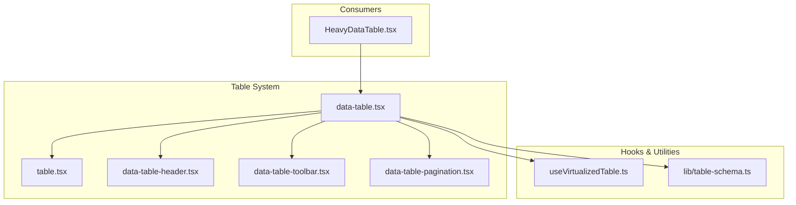
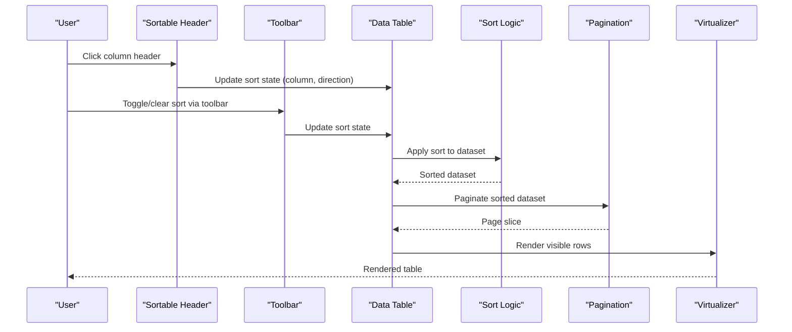
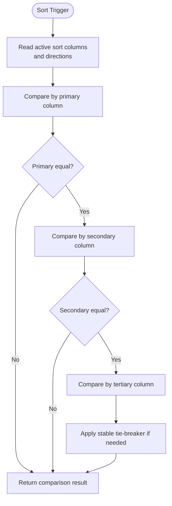
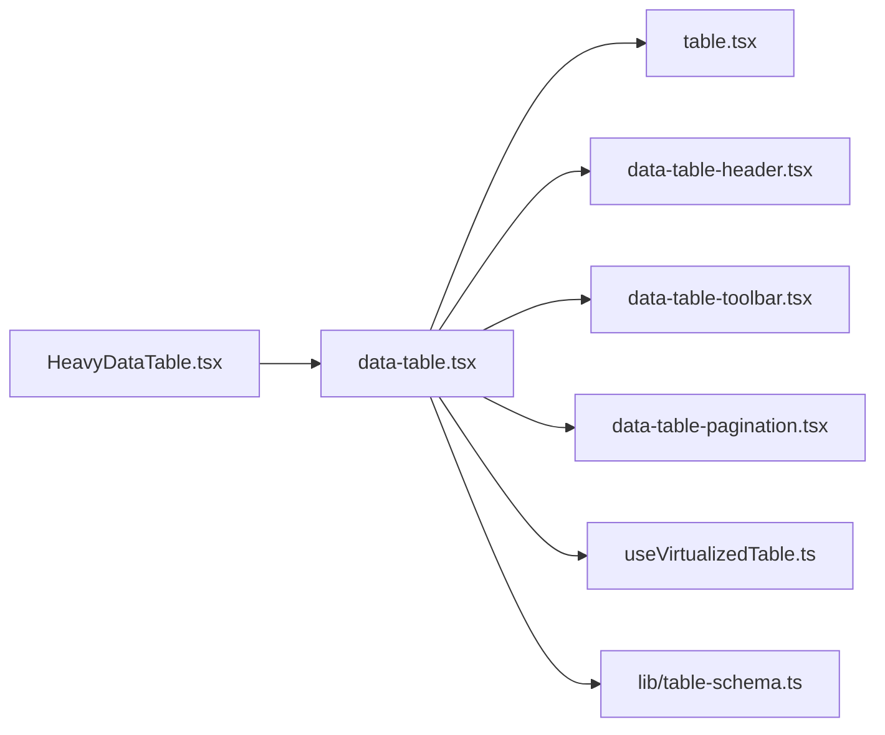

# Sorting Capabilities

<cite>
**Referenced Files in This Document**
- [table.tsx](file://table-system/components/ui/table/table.tsx)
- [data-table-header.tsx](file://table-system/components/ui/table/data-table-header.tsx)
- [data-table-toolbar.tsx](file://table-system/components/ui/table/data-table-toolbar.tsx)
- [data-table-pagination.tsx](file://table-system/components/ui/table/data-table-pagination.tsx)
- [data-table.tsx](file://table-system/components/ui/table/data-table.tsx)
- [useVirtualizedTable.ts](file://src/hooks/useVirtualizedTable.ts)
- [HeavyDataTable.tsx](file://src/components/HeavyDataTable.tsx)
- [lib/table-schema.ts](file://src/lib/table-schema.ts)
</cite>

## Table of Contents
1. [Introduction](#introduction)
2. [Project Structure](#project-structure)
3. [Core Components](#core-components)
4. [Architecture Overview](#architecture-overview)
5. [Detailed Component Analysis](#detailed-component-analysis)
6. [Dependency Analysis](#dependency-analysis)
7. [Performance Considerations](#performance-considerations)
8. [Troubleshooting Guide](#troubleshooting-guide)
9. [Conclusion](#conclusion)
10. [Appendices](#appendices)

## Introduction
This document explains the table sorting capabilities implemented across the project’s reusable table system and its consumers. It covers multi-column sorting, custom sort functions, ascending/descending order configuration, complex data type sorting (dates, formatted numbers, nested object properties), state management for sort state, visual indicators, accessibility considerations, and performance techniques for large datasets.

## Project Structure
The sorting functionality is primarily implemented in a small set of shared table components under the table-system directory, with additional hooks and utilities used by feature pages. The key files are:
- Core table shell and header rendering
- Toolbar integration for sort controls
- Pagination component
- A virtualization hook for large datasets
- A heavy-data table wrapper that composes these pieces
- A shared table schema utility for column definitions

**Diagram sources**
- [table.tsx](file://table-system/components/ui/table/table.tsx)
- [data-table-header.tsx](file://table-system/components/ui/table/data-table-header.tsx)
- [data-table-toolbar.tsx](file://table-system/components/ui/table/data-table-toolbar.tsx)
- [data-table-pagination.tsx](file://table-system/components/ui/table/data-table-pagination.tsx)
- [data-table.tsx](file://table-system/components/ui/table/data-table.tsx)
- [useVirtualizedTable.ts](file://src/hooks/useVirtualizedTable.ts)
- [lib/table-schema.ts](file://src/lib/table-schema.ts)
- [HeavyDataTable.tsx](file://src/components/HeavyDataTable.tsx)

**Section sources**
- [table.tsx](file://table-system/components/ui/table/table.tsx)
- [data-table-header.tsx](file://table-system/components/ui/table/data-table-header.tsx)
- [data-table-toolbar.tsx](file://table-system/components/ui/table/data-table-toolbar.tsx)
- [data-table-pagination.tsx](file://table-system/components/ui/table/data-table-pagination.tsx)
- [data-table.tsx](file://table-system/components/ui/table/data-table.tsx)
- [useVirtualizedTable.ts](file://src/hooks/useVirtualizedTable.ts)
- [lib/table-schema.ts](file://src/lib/table-schema.ts)
- [HeavyDataTable.tsx](file://src/components/HeavyDataTable.tsx)

## Core Components
- Data table shell: orchestrates columns, rows, sorting, pagination, and toolbar interactions.
- Header cell: renders sortable headers, manages per-column sort direction, and exposes keyboard navigation.
- Toolbar: provides UI to toggle sort directions and clear active sorts.
- Pagination: integrates with sorted results for consistent page sizes.
- Virtualization hook: optimizes rendering for large datasets while preserving sort semantics.
- Heavy data table wrapper: composes the above into a ready-to-use component for feature pages.
- Table schema utility: centralizes column definitions and optional sort metadata.

Key responsibilities:
- Maintain a stable sort state model (columns, directions).
- Provide deterministic comparisons for equal keys.
- Expose accessible controls and visual indicators.
- Integrate with pagination and virtualization without breaking sort order.

**Section sources**
- [data-table.tsx](file://table-system/components/ui/table/data-table.tsx)
- [data-table-header.tsx](file://table-system/components/ui/table/data-table-header.tsx)
- [data-table-toolbar.tsx](file://table-system/components/ui/table/data-table-toolbar.tsx)
- [data-table-pagination.tsx](file://table-system/components/ui/table/data-table-pagination.tsx)
- [useVirtualizedTable.ts](file://src/hooks/useVirtualizedTable.ts)
- [HeavyDataTable.tsx](file://src/components/HeavyDataTable.tsx)
- [lib/table-schema.ts](file://src/lib/table-schema.ts)

## Architecture Overview
The sorting architecture separates concerns between state, UI, and rendering:
- State layer: holds current sort configuration (column keys and directions).
- UI layer: headers and toolbar expose actions to update sort state.
- Rendering layer: applies sort to data before pagination/virtualization.

**Diagram sources**
- [data-table-header.tsx](file://table-system/components/ui/table/data-table-header.tsx)
- [data-table-toolbar.tsx](file://table-system/components/ui/table/data-table-toolbar.tsx)
- [data-table.tsx](file://table-system/components/ui/table/data-table.tsx)
- [data-table-pagination.tsx](file://table-system/components/ui/table/data-table-pagination.tsx)
- [useVirtualizedTable.ts](file://src/hooks/useVirtualizedTable.ts)

## Detailed Component Analysis

### Multi-Column Sorting
Multi-column sorting allows users to define a primary, secondary, and subsequent sort keys. The implementation maintains an ordered list of active columns and their directions. When two rows compare equal on one column, the next column in the chain breaks ties deterministically.

- Configuration: Columns can declare whether they are sortable and provide a comparator or rely on default comparators.
- Behavior: Clicking a header toggles direction; holding modifier keys or using toolbar actions can add/remove columns from the sort chain.
- Determinism: If all configured columns compare equal, a stable tie-breaker (such as original index or row id) ensures consistent ordering.

**Diagram sources**
- [data-table.tsx](file://table-system/components/ui/table/data-table.tsx)
- [data-table-header.tsx](file://table-system/components/ui/table/data-table-header.tsx)

**Section sources**
- [data-table.tsx](file://table-system/components/ui/table/data-table.tsx)
- [data-table-header.tsx](file://table-system/components/ui/table/data-table-header.tsx)

### Custom Sort Functions
Custom comparators enable domain-specific logic for complex types:
- Date sorting: Normalize values to timestamps or locale-aware date objects before comparing.
- Numeric sorting with formatting: Parse formatted strings (e.g., currency, percentages) into numeric primitives for comparison.
- Nested object property sorting: Extract values via safe accessors and apply appropriate comparators.

Guidelines:
- Always return -1, 0, or 1.
- Handle nulls/undefined consistently (e.g., treat as smallest or largest).
- Prefer pure functions for memoization and testability.

Examples of where to implement:
- Column definition includes a comparator function.
- Utility module exports common comparators (date, number, string).

**Section sources**
- [lib/table-schema.ts](file://src/lib/table-schema.ts)
- [data-table.tsx](file://table-system/components/ui/table/data-table.tsx)

### Ascending/Descending Order Management
Each sortable column tracks its direction. Common patterns:
- Click cycles through states (none → asc → desc → none).
- Toolbar buttons allow explicit selection or clearing of a column’s sort.
- Visual indicators reflect current state (arrows, icons, aria attributes).

Accessibility:
- Headers are focusable and respond to Enter/Space.
- ARIA roles and labels describe current sort state and available actions.
- Keyboard navigation supports moving between headers and toggling direction.

**Section sources**
- [data-table-header.tsx](file://table-system/components/ui/table/data-table-header.tsx)
- [data-table-toolbar.tsx](file://table-system/components/ui/table/data-table-toolbar.tsx)

### Sorting Large Datasets
For large tables, combine sorting with pagination and virtualization:
- Sort first, then paginate to reduce DOM size.
- Use a virtualizer to render only visible rows within the current page.
- Keep sort comparators lightweight; avoid expensive computations inside the comparator.

Integration points:
- The virtualization hook receives already-sorted data and returns viewport indices.
- Pagination slices the sorted array based on page size and current page.

**Section sources**
- [useVirtualizedTable.ts](file://src/hooks/useVirtualizedTable.ts)
- [data-table-pagination.tsx](file://table-system/components/ui/table/data-table-pagination.tsx)
- [data-table.tsx](file://table-system/components/ui/table/data-table.tsx)

### Visual Indicators and Accessibility
Visual cues:
- Arrow icons or chevrons indicate direction.
- Active column highlighting distinguishes the primary sort key.
- Disabled states for non-sortable columns.

Accessibility:
- Role="columnheader" with aria-sort reflecting current state.
- aria-label describing action (e.g., “Sort ascending”).
- Focus styles and keyboard support for all interactive elements.

**Section sources**
- [data-table-header.tsx](file://table-system/components/ui/table/data-table-header.tsx)

### Example Scenarios

#### Date Sorting
- Normalize dates to a comparable primitive (timestamp).
- Handle invalid or missing dates consistently.
- Consider time zones and locale formats when parsing.

Implementation pointers:
- Add a date comparator utility.
- Reference it in the column’s comparator field.

**Section sources**
- [lib/table-schema.ts](file://src/lib/table-schema.ts)

#### Numeric Sorting with Formatting
- Strip currency symbols, commas, and percentage signs before comparison.
- Convert to floating-point numbers for accurate ordering.
- Preserve display formatting separately from sort values.

Implementation pointers:
- Create a number parser utility.
- Use it in the column comparator.

**Section sources**
- [lib/table-schema.ts](file://src/lib/table-schema.ts)

#### Custom Object Property Sorting
- Safely extract nested properties.
- Provide fallbacks for missing fields.
- Chain multiple comparators for robustness.

Implementation pointers:
- Implement a generic property accessor comparator.
- Compose it with type-specific comparators.

**Section sources**
- [lib/table-schema.ts](file://src/lib/table-schema.ts)

## Dependency Analysis
The following diagram shows how the core table components depend on each other and on supporting hooks/utilities.

**Diagram sources**
- [data-table.tsx](file://table-system/components/ui/table/data-table.tsx)
- [table.tsx](file://table-system/components/ui/table/table.tsx)
- [data-table-header.tsx](file://table-system/components/ui/table/data-table-header.tsx)
- [data-table-toolbar.tsx](file://table-system/components/ui/table/data-table-toolbar.tsx)
- [data-table-pagination.tsx](file://table-system/components/ui/table/data-table-pagination.tsx)
- [useVirtualizedTable.ts](file://src/hooks/useVirtualizedTable.ts)
- [lib/table-schema.ts](file://src/lib/table-schema.ts)
- [HeavyDataTable.tsx](file://src/components/HeavyDataTable.tsx)

**Section sources**
- [data-table.tsx](file://table-system/components/ui/table/data-table.tsx)
- [table.tsx](file://table-system/components/ui/table/table.tsx)
- [data-table-header.tsx](file://table-system/components/ui/table/data-table-header.tsx)
- [data-table-toolbar.tsx](file://table-system/components/ui/table/data-table-toolbar.tsx)
- [data-table-pagination.tsx](file://table-system/components/ui/table/data-table-pagination.tsx)
- [useVirtualizedTable.ts](file://src/hooks/useVirtualizedTable.ts)
- [lib/table-schema.ts](file://src/lib/table-schema.ts)
- [HeavyDataTable.tsx](file://src/components/HeavyDataTable.tsx)

## Performance Considerations
- Memoize comparators and derived values to avoid recomputation.
- Avoid heavy operations inside comparators; precompute normalized values when possible.
- Combine sorting with pagination and virtualization to minimize DOM work.
- Use stable sort strategies to ensure consistent user experience.
- Debounce rapid sort changes triggered by batch updates.

[No sources needed since this section provides general guidance]

## Troubleshooting Guide
Common issues and resolutions:
- Inconsistent sort order: Ensure comparators are total orders and include a stable tie-breaker.
- Slow sorting: Offload normalization to a preprocessing step; keep comparators simple.
- Incorrect direction toggling: Verify state transitions and ARIA attribute updates.
- Accessibility gaps: Confirm keyboard navigation, focus management, and screen reader labels.

**Section sources**
- [data-table-header.tsx](file://table-system/components/ui/table/data-table-header.tsx)
- [data-table.tsx](file://table-system/components/ui/table/data-table.tsx)

## Conclusion
The table system provides a robust, accessible, and performant sorting foundation. By separating sort state, UI, and rendering, it supports multi-column sorting, custom comparators, and efficient handling of large datasets. Following the guidelines here will help you implement reliable sorting for dates, formatted numbers, and complex object properties while maintaining good UX and accessibility.

[No sources needed since this section summarizes without analyzing specific files]

## Appendices

### API and Props Summary
- Sort state:
  - Active columns and directions
  - Stable tie-breaker strategy
- Column definitions:
  - Sortable flag
  - Comparator function
  - Display formatter (separate from sort value)
- UI controls:
  - Header click behavior
  - Toolbar actions for adding/removing/toggling sort keys
- Integration:
  - Pagination compatibility
  - Virtualization compatibility

**Section sources**
- [data-table.tsx](file://table-system/components/ui/table/data-table.tsx)
- [data-table-header.tsx](file://table-system/components/ui/table/data-table-header.tsx)
- [data-table-toolbar.tsx](file://table-system/components/ui/table/data-table-toolbar.tsx)
- [data-table-pagination.tsx](file://table-system/components/ui/table/data-table-pagination.tsx)
- [useVirtualizedTable.ts](file://src/hooks/useVirtualizedTable.ts)
- [lib/table-schema.ts](file://src/lib/table-schema.ts)